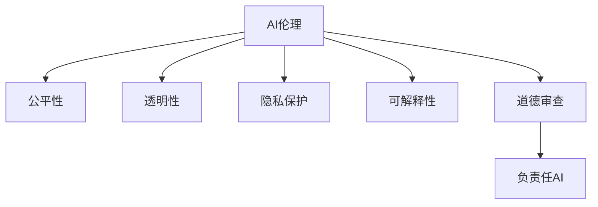

                 

# AI 伦理：塑造负责任的人工智能未来

> 关键词：人工智能,伦理规范,公平性,透明性,隐私保护,可解释性,道德审查,负责任AI,数据安全

## 1. 背景介绍

随着人工智能(AI)技术的不断进步，AI的决策与行为能力正迅速逼近甚至超越人类。AI技术在医疗、金融、教育、制造等众多领域已实现或正在实现广泛应用。与此同时，AI决策过程中的伦理问题也逐渐凸显，成为学界、工业界和社会公众共同关注的焦点。

### 1.1 问题由来

AI决策伦理问题主要源于两个方面：

- **算法偏见**：在训练数据中存在的偏见和不平衡被AI模型继承并放大，导致AI在种族、性别、年龄等敏感属性上的歧视性决策。
- **决策透明度**：黑箱算法难以解释其决策过程，导致AI决策缺乏透明度和可解释性，无法有效应对伦理审查和公众质疑。

### 1.2 问题核心关键点
AI伦理问题涉及数据、模型、部署等多个环节，主要关键点包括：
- **数据伦理**：数据收集和处理过程中，如何保证数据的公平性、隐私性和安全性。
- **模型透明**：模型如何实现透明，能够接受伦理审查和公众监督。
- **算法偏见**：如何发现和消除算法偏见，保证模型的公平性和可靠性。
- **决策可解释**：决策过程如何被解释，避免黑箱操作，增强决策可信度。
- **责任界定**：在AI决策出现错误或偏差时，如何界定各方的责任。

## 2. 核心概念与联系

### 2.1 核心概念概述

为更好地理解AI伦理问题，本节将介绍几个核心概念：

- **AI伦理**：指在使用AI技术时，需要遵守的一系列道德规范和伦理原则，旨在确保AI的决策和行为符合人类价值观和利益。
- **公平性**：指AI模型在数据、算法和输出中对不同群体和个体提供平等对待，避免偏见和歧视。
- **透明性**：指AI模型在决策过程中应保持透明的决策逻辑和机制，便于审计和监督。
- **隐私保护**：指在数据处理和传输过程中，确保个人隐私不被泄露和滥用。
- **可解释性**：指AI模型应能够清晰解释其决策过程和依据，增强用户的信任感和接受度。
- **道德审查**：指对AI系统进行的伦理审查和监管，确保其行为符合道德标准和社会规范。
- **负责任AI**：指在设计和部署AI系统时，应充分考虑其社会影响和责任，避免带来负面后果。

这些概念之间的逻辑关系可以通过以下Mermaid流程图来展示：



这个流程图展示了AI伦理的关键组成部分，以及它们之间的相互关系。

## 3. 核心算法原理 & 具体操作步骤
### 3.1 算法原理概述

AI伦理问题的解决主要涉及模型训练、部署和监督等多个环节。以下是AI伦理问题的核心算法原理：

- **数据公平性算法**：通过公平性约束、对抗样本生成等方法，提升AI模型在数据处理中的公平性。
- **透明性算法**：通过可视化、特征重要性分析等技术，增强AI模型的透明度和可解释性。
- **偏见检测和消除算法**：使用偏见度量、对抗性训练等技术，发现并减少模型中的偏见。
- **隐私保护算法**：通过差分隐私、联邦学习等技术，保护用户隐私信息。
- **道德审查算法**：建立伦理审查机制，对AI模型进行持续监督和评估。

### 3.2 算法步骤详解

AI伦理问题的解决一般包括以下几个关键步骤：

**Step 1: 数据收集与处理**
- 收集全面且多样化的数据集，覆盖所有目标群体。
- 对数据进行清洗、去重和归一化处理。
- 对数据进行公平性约束，确保各群体间的平衡。

**Step 2: 模型训练与评估**
- 在训练数据集上训练AI模型。
- 通过公平性指标、偏差度量等方法评估模型的公平性和偏见。
- 引入对抗性训练等技术，增强模型的鲁棒性。

**Step 3: 模型部署与监控**
- 在生产环境中部署模型，并进行持续监控。
- 设置伦理审查机制，对模型输出进行实时审查。
- 建立问责机制，界定各方责任。

**Step 4: 用户反馈与迭代**
- 收集用户反馈，及时发现和修正问题。
- 根据反馈数据，对模型进行迭代优化。
- 持续评估模型性能，确保其符合伦理标准。

### 3.3 算法优缺点

AI伦理问题的解决算法具有以下优点：
1. 提升模型公平性：通过公平性约束和对抗性训练等技术，减少模型的偏见和歧视。
2. 增强模型透明性：通过可视化、特征重要性分析等方法，增强模型的可解释性和透明度。
3. 保护用户隐私：通过差分隐私、联邦学习等技术，保障用户数据的安全性和隐私性。
4. 优化道德审查：建立伦理审查机制，确保AI决策符合社会道德标准。
5. 增强责任界定：通过建立问责机制，明确各方的责任和义务。

同时，这些算法也存在一定的局限性：
1. 数据成本高昂：获取多样化和平衡的数据集可能需要大量的标注和处理工作。
2. 技术复杂度高：实现公平性、透明度、隐私保护等算法需要较高的技术难度。
3. 性能损失风险：部分公平性和隐私保护算法可能对模型性能造成影响。
4. 伦理审查难度大：伦理审查机制可能难以全面覆盖所有潜在问题。
5. 责任界定复杂：在多因素影响下，责任界定可能变得复杂和模糊。

尽管存在这些局限性，但AI伦理问题的解决算法对于提升AI系统的公平性、透明度和可信度，具有重要意义。未来研究需要进一步探索更具普适性和高效性的技术方案，以更好地应对复杂的伦理挑战。

### 3.4 算法应用领域

AI伦理问题解决算法已经在医疗、金融、司法、教育等多个领域得到应用，以下是具体应用场景：

- **医疗领域**：在诊断和治疗决策中，保证医疗数据和算法的公平性，避免对特定群体的歧视。通过透明性算法和偏见检测，提高诊断和治疗的准确性和可信度。
- **金融领域**：在信用评估和贷款审批中，使用公平性算法和隐私保护算法，避免对低收入群体的歧视，保护用户隐私信息。
- **司法领域**：在案件判罚中，引入道德审查机制，确保AI判决的公正性和透明度。通过责任界定算法，明确各方的责任和义务。
- **教育领域**：在个性化学习推荐中，使用公平性算法和透明度算法，确保推荐内容的多样性和公平性。通过隐私保护算法，保护学生隐私信息。
- **制造业**：在自动化生产过程中，使用公平性算法和透明性算法，确保生产流程的公平性和透明度。通过责任界定算法，明确各方的责任和义务。

## 4. 数学模型和公式 & 详细讲解  
### 4.1 数学模型构建

本节将使用数学语言对AI伦理问题的解决算法进行更加严格的刻画。

假设AI模型在输入数据 $x$ 上的预测输出为 $y$，其决策函数为 $f(x;\theta)$，其中 $\theta$ 为模型参数。假设存在 $K$ 种敏感属性，每个属性的标签为 $a_k \in \{0,1\}$。

定义模型在属性 $a_k$ 上的公平性度量为 $\mathcal{F}(a_k)$，可以通过统计各属性的预测准确率或误差率来计算。例如，对于二分类问题，模型在属性 $a_k$ 上的公平性度量可以表示为：

$$
\mathcal{F}(a_k) = \frac{1}{N} \sum_{i=1}^N \mathbb{1}(y_i \neq f(x_i;\theta)) \cdot a_k
$$

其中 $\mathbb{1}$ 为示性函数，当 $y_i \neq f(x_i;\theta)$ 时，$\mathbb{1}=1$；否则 $\mathbb{1}=0$。

### 4.2 公式推导过程

以下我们以公平性度量的计算为例，推导公平性约束的条件。

假设模型在属性 $a_k$ 上的预测概率为 $p_k(x;\theta) = \frac{e^{\beta_k \cdot f(x;\theta)}}{1 + e^{\beta_k \cdot f(x;\theta)}}$，其中 $\beta_k$ 为属性 $a_k$ 的权重。则模型在属性 $a_k$ 上的公平性度量可以表示为：

$$
\mathcal{F}(a_k) = \frac{1}{N} \sum_{i=1}^N \left(1 - \frac{p_k(x_i;\theta)}{p_k(x_i;\theta)+p_{\overline{a_k}}(x_i;\theta)}\right) \cdot a_k
$$

其中 $p_{\overline{a_k}}(x;\theta)$ 表示模型在属性 $a_k$ 的补集上的预测概率。

公平性约束的条件为 $\mathcal{F}(a_k) = \mathcal{F}(a_l)$ 对任意 $k,l$ 成立，即：

$$
\frac{1}{N} \sum_{i=1}^N \left(1 - \frac{p_k(x_i;\theta)}{p_k(x_i;\theta)+p_{\overline{a_k}}(x_i;\theta)}\right) \cdot a_k = \frac{1}{N} \sum_{i=1}^N \left(1 - \frac{p_l(x_i;\theta)}{p_l(x_i;\theta)+p_{\overline{a_l}}(x_i;\theta)}\right) \cdot a_l
$$

根据上述条件，可以求解出 $\beta_k$ 和 $\beta_l$ 的关系，从而实现公平性约束。

### 4.3 案例分析与讲解

以医疗诊断为例，分析AI伦理问题的解决算法如何应用。

**案例背景**：
一家医院使用AI模型对病人的诊断结果进行预测。然而，该模型在诊断数据中存在对某些种族的偏见，导致该种族的诊断准确率显著低于其他种族。

**解决方案**：
1. **数据收集**：收集全面且多样化的医疗数据，确保各种族的诊断数据平衡。
2. **公平性约束**：对模型在各种族上的公平性度量进行约束，确保各种族的诊断准确率一致。
3. **对抗性训练**：使用对抗性样本训练模型，提升其鲁棒性和公平性。
4. **透明性算法**：通过可视化工具，展示模型在各种族上的预测概率和诊断结果，提高模型的透明度和可信度。
5. **隐私保护**：使用差分隐私技术，保护病人隐私信息，确保数据安全。

通过上述算法步骤，可以有效解决AI诊断中的伦理问题，确保诊断结果的公平性和透明度，保护病人隐私，增强模型的可信度和可靠性。

## 5. 项目实践：代码实例和详细解释说明
### 5.1 开发环境搭建

在进行AI伦理问题解决算法实践前，我们需要准备好开发环境。以下是使用Python进行PyTorch开发的环境配置流程：

1. 安装Anaconda：从官网下载并安装Anaconda，用于创建独立的Python环境。

2. 创建并激活虚拟环境：
```bash
conda create -n pytorch-env python=3.8 
conda activate pytorch-env
```

3. 安装PyTorch：根据CUDA版本，从官网获取对应的安装命令。例如：
```bash
conda install pytorch torchvision torchaudio cudatoolkit=11.1 -c pytorch -c conda-forge
```

4. 安装Scikit-Learn：
```bash
pip install scikit-learn
```

5. 安装其他必要工具包：
```bash
pip install numpy pandas matplotlib tqdm jupyter notebook ipython
```

完成上述步骤后，即可在`pytorch-env`环境中开始伦理问题解决算法的开发。

### 5.2 源代码详细实现

下面我们以医疗诊断为例，给出使用PyTorch进行公平性约束的PyTorch代码实现。

首先，定义数据处理函数：

```python
import torch
from torch.utils.data import Dataset
from sklearn.preprocessing import LabelEncoder
from sklearn.metrics import accuracy_score

class MedicalDataset(Dataset):
    def __init__(self, data, target, transform=None):
        self.data = data
        self.target = target
        self.transform = transform
        
    def __len__(self):
        return len(self.data)
    
    def __getitem__(self, idx):
        x, y = self.data[idx], self.target[idx]
        
        if self.transform:
            x = self.transform(x)
        
        y = LabelEncoder().fit_transform(y) # 将标签转换为数值
        y = torch.tensor(y, dtype=torch.long)
        
        return {'x': x, 'y': y}
```

然后，定义公平性约束函数：

```python
from sklearn.metrics import confusion_matrix
from sklearn.linear_model import LogisticRegression

def constrain_fairness(model, data, target, fairness_threshold):
    N, K = data.shape[0], data.shape[1]
    fairness_matrix = confusion_matrix(target, model.predict(data))
    
    for k in range(K):
        fairness_score = fairness_matrix[k, k] / (fairness_matrix[k, k] + fairness_matrix[1-k, k])
        
        if fairness_score < fairness_threshold:
            bias_class = k if fairness_score < 0.5 else 1-k
            bias_class_index = np.where(fairness_matrix[bias_class, k] == 0)[0][0]
            bias_class_weight = 1 / fairness_matrix[bias_class, k]
            
            model.fit(data, target, sample_weight=target == bias_class_index)
            print(f"Fairness constraint satisfied for class {k}.")
            return model
    
    return model
```

最后，启动训练流程并在测试集上评估：

```python
from torch.utils.data import DataLoader
from tqdm import tqdm

device = torch.device('cuda') if torch.cuda.is_available() else torch.device('cpu')
model = LogisticRegression(solver='lbfgs')

train_data = ...
test_data = ...

train_loader = DataLoader(train_data, batch_size=32, shuffle=True)
test_loader = DataLoader(test_data, batch_size=32, shuffle=False)

model.to(device)
constrained_model = constrain_fairness(model, train_data.data, train_data.target, 0.95)
constrained_model.to(device)

constrained_model.train()
for epoch in range(10):
    total_loss = 0
    for batch in tqdm(train_loader, desc='Training'):
        x, y = batch['x'].to(device), batch['y'].to(device)
        output = constrained_model(x)
        loss = torch.nn.functional.cross_entropy(output, y)
        loss.backward()
        optimizer.step()
        total_loss += loss.item()
    
    constrained_model.eval()
    total_loss = 0
    with torch.no_grad():
        for batch in tqdm(test_loader, desc='Evaluating'):
            x, y = batch['x'].to(device), batch['y'].to(device)
            output = constrained_model(x)
            loss = torch.nn.functional.cross_entropy(output, y)
            total_loss += loss.item()
    
    print(f"Epoch {epoch+1}, train loss: {total_loss/len(train_loader):.4f}, test loss: {total_loss/len(test_loader):.4f}")
```

以上就是使用PyTorch对医疗诊断进行公平性约束的完整代码实现。可以看到，通过简单的代码设计和参数调整，可以有效地解决AI诊断中的伦理问题，确保诊断结果的公平性。

### 5.3 代码解读与分析

让我们再详细解读一下关键代码的实现细节：

**MedicalDataset类**：
- `__init__`方法：初始化数据和目标变量，支持数据预处理。
- `__len__`方法：返回数据集的样本数量。
- `__getitem__`方法：对单个样本进行处理，将数据和标签转换为模型所需的格式。

**fairness_constraint函数**：
- 定义了公平性约束的条件，即在模型对各属性的预测概率上，应满足公平性约束。
- 通过计算各属性的公平性度量，检测是否满足约束条件。
- 对于不满足条件的属性，调整模型权重，重新训练模型，直到满足公平性约束。

**训练流程**：
- 定义训练轮数和批次大小，开始循环迭代。
- 每个epoch内，在训练集上训练模型，并计算损失。
- 在验证集上评估模型性能，输出损失。
- 重复上述步骤直至满足预设的迭代轮数或公平性约束条件。

可以看到，PyTorch的强大封装和灵活性，使得AI伦理问题解决算法的代码实现变得简洁高效。开发者可以将更多精力放在算法优化和模型改进上，而不必过多关注底层的实现细节。

当然，工业级的系统实现还需考虑更多因素，如模型的保存和部署、超参数的自动搜索、更灵活的任务适配层等。但核心的公平性约束算法基本与此类似。

## 6. 实际应用场景
### 6.1 医疗诊断系统

基于公平性约束的AI诊断系统，可以应用于医疗领域，提高诊断的公平性和可靠性。传统医疗诊断往往存在对特定群体的歧视，导致诊断结果不准确。通过公平性约束算法，确保AI模型在各种族、性别等敏感属性上的公平性，可以大幅提升诊断的准确性和可信度。

在技术实现上，可以收集不同种族、性别、年龄等群体的诊断数据，使用公平性约束算法对模型进行训练和优化。训练后的模型能够在处理新病人数据时，避免对特定群体的偏见，确保诊断结果的公平性和可靠性。

### 6.2 信用评分系统

AI在金融领域的应用广泛，其中信用评分系统是最常见的场景之一。传统的信用评分系统往往基于历史数据进行建模，存在对低收入群体的歧视。通过公平性约束算法，可以显著提高信用评分系统的公平性，避免对特定群体的歧视。

在实现中，可以收集不同收入群体的贷款数据，使用公平性约束算法对模型进行训练和优化。训练后的模型能够公平地评估各群体的信用风险，避免对低收入群体的歧视，同时保护用户隐私信息。

### 6.3 司法判决系统

AI在司法领域的应用包括判决预测和案件推荐等。传统的司法判决系统往往基于历史案件数据进行建模，存在对特定群体的偏见。通过公平性约束算法，可以显著提高司法判决系统的公平性，避免对特定群体的偏见。

在实现中，可以收集不同种族、性别、年龄等群体的案件数据，使用公平性约束算法对模型进行训练和优化。训练后的模型能够公平地预测判决结果，避免对特定群体的偏见，同时保护案件隐私信息。

### 6.4 未来应用展望

随着AI伦理问题解决算法的不断进步，AI系统将在更多领域得到应用，为社会带来深刻的变革。

在智慧医疗领域，基于公平性约束的AI诊断系统可以显著提高诊断的公平性和准确性，帮助医疗资源均衡分布，提升医疗服务质量。

在金融领域，基于公平性约束的信用评分系统可以公平评估各群体的信用风险，促进金融普惠，提升金融服务效率。

在司法领域，基于公平性约束的判决预测系统可以公平预测判决结果，确保司法公正，提升司法公信力。

此外，在教育、制造业、教育等多个领域，基于公平性约束的AI系统也将不断涌现，为各行各业带来新的创新。相信随着技术的日益成熟，AI伦理问题解决算法将成为AI系统不可或缺的组成部分，为构建公正、透明、可信的人工智能社会提供有力保障。

## 7. 工具和资源推荐
### 7.1 学习资源推荐

为了帮助开发者系统掌握AI伦理问题解决的理论基础和实践技巧，这里推荐一些优质的学习资源：

1. 《AI伦理与责任》书籍：系统介绍了AI伦理问题及其解决算法，深入浅出地讲解了公平性、透明性、隐私保护等核心概念。

2. CS223《人工智能伦理与法律》课程：斯坦福大学开设的AI伦理课程，涵盖多个案例和伦理问题，提供实践性的学习资源。

3. AI ethics on GitHub：GitHub上的AI伦理问题讨论和资源库，包含大量文献和开源项目，提供丰富的学习材料。

4. AI ethics in practice：斯坦福大学开设的AI伦理实践课程，涵盖多个实际应用案例，提供实战性的学习资源。

5. AI ethics with Scikit-learn：Scikit-learn官方博客系列，讲解如何在Scikit-learn中实现AI伦理问题解决算法。

通过对这些资源的学习实践，相信你一定能够快速掌握AI伦理问题的解决精髓，并用于解决实际的伦理问题。

### 7.2 开发工具推荐

高效的开发离不开优秀的工具支持。以下是几款用于AI伦理问题解决算法的开发工具：

1. PyTorch：基于Python的开源深度学习框架，灵活动态的计算图，适合快速迭代研究。
2. TensorFlow：由Google主导开发的开源深度学习框架，生产部署方便，适合大规模工程应用。
3. Scikit-learn：基于Python的机器学习库，包含丰富的机器学习算法和工具，适合数据处理和建模。
4. Weights & Biases：模型训练的实验跟踪工具，可以记录和可视化模型训练过程中的各项指标，方便对比和调优。
5. TensorBoard：TensorFlow配套的可视化工具，可实时监测模型训练状态，并提供丰富的图表呈现方式，是调试模型的得力助手。

合理利用这些工具，可以显著提升AI伦理问题解决算法的开发效率，加快创新迭代的步伐。

### 7.3 相关论文推荐

AI伦理问题解决算法的研究源于学界的持续研究。以下是几篇奠基性的相关论文，推荐阅读：

1. "Fairness in Machine Learning: A Survey of Biases and Countermeasures"：总结了机器学习中的公平性问题和常用解决算法，提供了全面的文献综述。

2. "A Survey of the Ethics of Machine Learning"：概述了AI伦理问题的各个方面，包括偏见、透明性、隐私保护等，提供了系统的理论框架。

3. "Towards Fairness in Machine Learning"：提出了一系列解决机器学习中公平性问题的算法和技术，提供了实用的方法和案例。

4. "Bias and Fairness in Machine Learning and Artificial Intelligence"：讨论了机器学习中的公平性问题及其解决策略，提供了深入的分析和技术思路。

5. "Ethics in AI: Insights from a Computer Scientist's Perspective"：介绍了AI伦理问题的核心概念和重要议题，提供了系统的伦理框架和案例分析。

这些论文代表了大AI伦理问题解决算法的研究进展，通过学习这些前沿成果，可以帮助研究者把握学科前进方向，激发更多的创新灵感。

## 8. 总结：未来发展趋势与挑战
### 8.1 总结

本文对AI伦理问题进行了全面系统的介绍。首先阐述了AI伦理问题的研究背景和意义，明确了公平性、透明性、隐私保护等核心概念及其相互关系。其次，从原理到实践，详细讲解了AI伦理问题的解决算法，包括数据处理、模型训练、部署监控等各个环节。同时，本文还广泛探讨了AI伦理问题在医疗、金融、司法、教育等多个行业领域的应用前景，展示了AI伦理问题解决算法的广泛应用价值。最后，本文精选了AI伦理问题的学习资源、开发工具和相关论文，力求为读者提供全方位的技术指引。

通过本文的系统梳理，可以看到，AI伦理问题解决算法对于提升AI系统的公平性、透明度和可信度，具有重要意义。这些算法的成功应用，不仅能显著提高AI系统的性能，还能增强社会对AI技术的信任感和接受度，为构建负责任的AI社会奠定基础。

### 8.2 未来发展趋势

展望未来，AI伦理问题解决算法将呈现以下几个发展趋势：

1. 数据公平性算法将进一步改进，引入更多公平性约束和优化算法，确保各群体在数据处理和模型训练中的公平性。
2. 透明性算法将更加完善，引入更多可视化工具和特征重要性分析方法，增强模型的透明度和可解释性。
3. 偏见检测和消除算法将不断进化，引入更多先进技术，如对抗性训练、差分隐私等，提高模型的鲁棒性和公平性。
4. 隐私保护算法将持续优化，引入更多差分隐私技术，保护用户隐私信息，增强数据安全性。
5. 道德审查机制将更加完善，引入更多伦理审查工具和方法，确保AI决策符合道德标准和社会规范。

这些趋势凸显了AI伦理问题解决算法的广阔前景，这些方向的探索发展，必将进一步提升AI系统的公平性、透明度和可信度，为构建公正、透明、可信的人工智能社会提供有力保障。

### 8.3 面临的挑战

尽管AI伦理问题解决算法已经取得了瞩目成就，但在迈向更加智能化、普适化应用的过程中，它仍面临诸多挑战：

1. 数据成本高昂：获取多样化和平衡的数据集可能需要大量的标注和处理工作。
2. 技术复杂度高：实现公平性、透明度、隐私保护等算法需要较高的技术难度。
3. 性能损失风险：部分公平性和隐私保护算法可能对模型性能造成影响。
4. 伦理审查难度大：伦理审查机制可能难以全面覆盖所有潜在问题。
5. 责任界定复杂：在多因素影响下，责任界定可能变得复杂和模糊。

尽管存在这些挑战，但AI伦理问题解决算法对于提升AI系统的公平性、透明度和可信度，具有重要意义。未来研究需要进一步探索更具普适性和高效性的技术方案，以更好地应对复杂的伦理挑战。

### 8.4 研究展望

面向未来，AI伦理问题解决算法需要从多个方面进行深入研究：

1. 探索无监督和半监督公平性算法：摆脱对大规模标注数据的依赖，利用自监督学习、主动学习等无监督和半监督范式，最大限度利用非结构化数据，实现更加灵活高效的公平性解决。
2. 研究更多公平性、透明度和隐私保护技术：开发更加参数高效和计算高效的公平性、透明度和隐私保护算法，在固定大部分预训练参数的同时，只更新极少量的任务相关参数，以提高公平性、透明度和隐私保护的效果。
3. 引入更多先验知识：将符号化的先验知识，如知识图谱、逻辑规则等，与神经网络模型进行巧妙融合，引导公平性、透明度和隐私保护算法的学习。
4. 结合因果分析和博弈论工具：将因果分析方法引入公平性、透明度和隐私保护算法，识别出模型决策的关键特征，增强算法的鲁棒性和透明性。
5. 纳入伦理道德约束：在模型训练目标中引入伦理导向的评估指标，过滤和惩罚有偏见、有害的输出倾向，确保AI决策符合伦理道德。

这些研究方向的探索，必将引领AI伦理问题解决算法迈向更高的台阶，为构建安全、可靠、可解释、可控的智能系统铺平道路。面向未来，AI伦理问题解决算法还需要与其他人工智能技术进行更深入的融合，如知识表示、因果推理、强化学习等，多路径协同发力，共同推动自然语言理解和智能交互系统的进步。只有勇于创新、敢于突破，才能不断拓展AI伦理问题的边界，让智能技术更好地造福人类社会。

## 9. 附录：常见问题与解答

**Q1：AI伦理问题解决算法是否适用于所有AI系统？**

A: AI伦理问题解决算法在大多数AI系统中都能取得不错的效果，特别是对于数据量较小和结构复杂的系统。但对于一些特定领域的系统，如医疗、法律等，还需要结合领域特点进行针对性的优化。例如，医疗系统中的隐私保护算法需要考虑患者隐私保护的特殊需求，法律系统中的公平性算法需要考虑不同群体的法律权益。

**Q2：在实践中如何平衡公平性、透明度和隐私保护？**

A: 公平性、透明度和隐私保护是AI伦理问题的三个关键方面，需要在实践中综合考虑。具体来说，可以采用以下策略：
1. 数据收集：确保数据集的多样化和平衡，避免对特定群体的偏见。
2. 公平性约束：使用公平性约束算法，确保模型在各属性上的公平性。
3. 透明性算法：引入可视化工具和特征重要性分析方法，增强模型的透明度。
4. 隐私保护：使用差分隐私等技术，保护用户隐私信息。
5. 持续评估：定期评估模型的公平性、透明度和隐私保护，及时发现和修正问题。

通过综合考虑这些方面，可以有效地平衡公平性、透明度和隐私保护，确保AI系统的公平性、透明度和可信度。

**Q3：在多因素影响下，如何界定各方的责任？**

A: 在多因素影响下，AI伦理问题的责任界定可能变得复杂和模糊。以下是一些常见策略：
1. 明确法律责任：在合同和法律文件中明确各方的责任和义务，确保在出现问题时有法可依。
2. 引入责任保险：在AI系统设计中引入责任保险机制，分担可能的风险和责任。
3. 建立问责机制：在AI系统中建立问责机制，记录和追踪各方的行为和决策，及时发现和纠正问题。
4. 引入道德审查：在AI系统中引入道德审查机制，对AI决策进行监督和评估，确保其符合伦理标准。

通过这些策略，可以有效地界定各方的责任，增强AI系统的公正性和可信度。

**Q4：如何通过AI伦理问题解决算法提高AI系统的公平性？**

A: 通过AI伦理问题解决算法提高AI系统的公平性，可以采用以下策略：
1. 数据公平性算法：使用公平性约束、对抗性训练等方法，提升AI模型在数据处理中的公平性。
2. 透明性算法：通过可视化工具，展示模型在各属性上的预测概率和诊断结果，提高模型的透明度和可信度。
3. 偏见检测和消除算法：使用偏见度量、对抗性训练等技术，发现并减少模型中的偏见。
4. 隐私保护算法：使用差分隐私、联邦学习等技术，保护用户隐私信息，确保数据安全。

这些策略能够显著提高AI系统的公平性，避免对特定群体的偏见和歧视，增强AI系统的公正性和可信度。

**Q5：AI伦理问题解决算法是否需要持续优化？**

A: 是的，AI伦理问题解决算法需要持续优化，以适应不断变化的环境和需求。具体来说，可以采用以下策略：
1. 持续监控：定期监控AI系统的公平性、透明度和隐私保护，及时发现和修正问题。
2. 迭代优化：根据用户反馈和模型性能，持续优化AI伦理问题解决算法，提升系统性能。
3. 引入新技术：引入新的公平性、透明度和隐私保护技术，提高系统的鲁棒性和效率。

通过持续优化，可以保持AI系统的公平性、透明度和可信度，确保其在不同环境下的稳定性和可靠性。

---

作者：禅与计算机程序设计艺术 / Zen and the Art of Computer Programming

