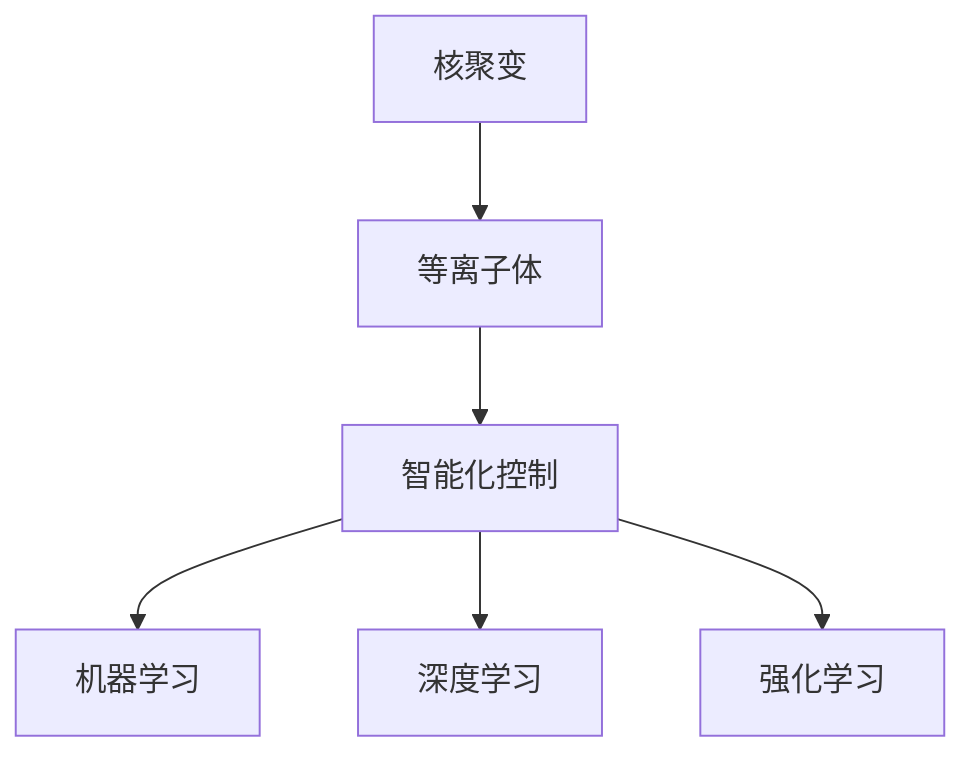

                 

# AI 基础设施的核聚变研究：智能化等离子体控制系统

> 关键词：AI、等离子体控制、智能系统、核聚变、机器学习、深度学习、控制系统

## 1. 背景介绍

### 1.1 问题由来
随着人工智能(AI)技术的迅猛发展，其在核聚变领域的应用引起了广泛关注。核聚变作为一种清洁、可持续的能源，被认为是解决未来能源危机的重要方向。然而，由于其高度复杂性和非线性特性，传统控制方法难以应对。

智能化等离子体控制系统通过结合AI技术，特别是机器学习和深度学习技术，为核聚变反应堆的设计、运行和优化提供了新的可能性。本文将系统介绍智能化等离子体控制系统的核心概念、工作原理和最新研究进展。

### 1.2 问题核心关键点
智能化等离子体控制系统旨在通过AI技术对等离子体状态进行实时监控、预测和控制，提高核聚变反应堆的效率和稳定性。核心关键点包括：
1. 等离子体状态预测：利用机器学习算法对等离子体状态进行实时预测。
2. 反馈控制：结合深度学习算法实现对等离子体状态的实时控制和优化。
3. 安全性保障：使用AI技术提升反应堆的安全性，减少事故发生概率。
4. 系统可扩展性：设计灵活、模块化的系统架构，支持未来系统的扩展和升级。

本文将详细介绍这些关键点的实现原理和具体技术方法。

## 2. 核心概念与联系

### 2.1 核心概念概述

为更好地理解智能化等离子体控制系统的核心概念，本节将介绍几个关键概念：

- 核聚变(Nuclear Fusion)：通过将轻原子核融合形成较重的原子核，释放大量能量的过程。
- 等离子体(Plasma)：由带电粒子组成的高度电离的气体，是核聚变反应的核心介质。
- 智能控制(Smart Control)：结合AI技术，对复杂系统进行实时监控、预测和优化的控制方法。
- 机器学习(Machine Learning)：通过数据驱动的学习，使计算机具备从数据中自动提取特征、构建模型的能力。
- 深度学习(Deep Learning)：一种基于多层神经网络的机器学习方法，具有强大的特征提取和模式识别能力。
- 强化学习(Reinforcement Learning)：通过智能体与环境的交互，学习最优策略以达到特定目标的学习方法。

这些核心概念之间的逻辑关系可以通过以下Mermaid流程图来展示：



这个流程图展示了一个从核聚变到等离子体，再到智能化控制的核聚变系统。机器学习、深度学习和强化学习作为智能化控制的关键技术，共同构成了系统的核心。

## 3. 核心算法原理 & 具体操作步骤
### 3.1 算法原理概述

智能化等离子体控制系统的核心原理可以概括为：

1. 实时监控：利用传感器对等离子体状态进行实时测量，获取大量原始数据。
2. 状态预测：通过机器学习算法，对等离子体状态进行预测，构建状态模型。
3. 控制决策：结合深度学习算法，对预测结果进行评估和优化，生成控制策略。
4. 执行反馈：将控制策略应用于等离子体，实时调整反应堆参数，实现系统控制。

整个系统通过闭环反馈控制，确保等离子体状态始终处于最优状态。下面，我们将详细介绍这些核心步骤的算法原理和操作步骤。

### 3.2 算法步骤详解

**Step 1: 数据收集与预处理**
- 利用高精度传感器对等离子体参数进行实时测量，包括温度、密度、压力等。
- 将测量数据进行预处理，包括滤波、归一化、平滑等，确保数据质量和稳定性。

**Step 2: 状态预测**
- 使用机器学习算法，如时间序列预测、支持向量机(SVM)、决策树等，对等离子体状态进行预测。
- 通过历史数据训练模型，对未来状态进行预测，构建状态预测模型。

**Step 3: 控制策略生成**
- 结合深度学习算法，如卷积神经网络(CNN)、循环神经网络(RNN)、长短时记忆网络(LSTM)等，对预测结果进行评估和优化。
- 使用监督学习算法训练控制策略，确保策略的有效性和稳定性。

**Step 4: 执行与反馈**
- 根据控制策略调整等离子体参数，如输入功率、磁场等。
- 实时监控等离子体状态，利用反馈控制算法，调整控制策略，确保系统稳定运行。

### 3.3 算法优缺点

智能化等离子体控制系统具有以下优点：
1. 实时性：通过实时监控和反馈控制，实现对等离子体状态的快速响应和调整。
2. 预测准确性：结合机器学习和深度学习算法，提高状态预测的准确性，减少预测误差。
3. 控制优化：利用深度学习算法，优化控制策略，提高系统性能和稳定性。
4. 自适应性：系统能够根据实际情况动态调整参数，提升系统的鲁棒性和适应能力。

同时，该系统也存在以下局限性：
1. 数据需求高：需要大量高质量的测量数据支持状态预测和控制决策。
2. 模型复杂：机器学习和深度学习模型复杂度高，需要大量计算资源。
3. 安全性：高度复杂系统的智能化控制，可能存在系统安全性和可靠性问题。
4. 模型解释性：深度学习模型通常难以解释其内部决策逻辑，对模型的可解释性提出了挑战。

尽管存在这些局限性，但智能化等离子体控制系统作为核聚变领域的前沿技术，仍具有巨大的潜力和广泛的应用前景。

### 3.4 算法应用领域

智能化等离子体控制系统在核聚变领域的应用场景包括：
1. 反应堆控制：实时监控和调整反应堆参数，确保聚变反应的稳定性和效率。
2. 粒子束控制：通过智能化控制，实现粒子束的精确聚焦和定位。
3. 等离子体诊断：利用机器学习算法对等离子体状态进行诊断和分析，提升诊断精度。
4. 安全性监控：实时监控系统状态，预测潜在风险，提升系统安全性。
5. 系统优化：通过深度学习算法，优化反应堆设计，提升聚变效率。

此外，智能化等离子体控制系统在智能电网、工业制造、航天航空等众多领域也有广阔的应用前景。

## 4. 数学模型和公式 & 详细讲解 & 举例说明
### 4.1 数学模型构建

智能化等离子体控制系统的核心模型包括状态预测模型和控制决策模型。下面将详细阐述这两个模型的构建方法。

**状态预测模型**：
假设等离子体状态可以用向量 $x_t$ 表示，其中 $t$ 表示时间。状态预测模型可以表示为：

$$
x_{t+1} = f(x_t, u_t) + \epsilon
$$

其中 $u_t$ 表示控制输入，$\epsilon$ 表示系统噪声。

**控制决策模型**：
控制决策模型可以表示为：

$$
u_t = \arg\min_{u} J(x_{t+1}, y_t)
$$

其中 $y_t$ 表示系统输出，$J$ 表示优化指标函数，如均方误差。

### 4.2 公式推导过程

**状态预测模型推导**：
假设等离子体状态 $x_t$ 由上一时刻状态 $x_{t-1}$ 和控制输入 $u_{t-1}$ 决定，则有：

$$
x_t = f(x_{t-1}, u_{t-1}) + \epsilon
$$

其中 $f$ 表示状态转移函数，$\epsilon$ 表示系统噪声。假设噪声服从高斯分布 $N(0, Q)$，则状态转移方程可以表示为：

$$
x_t = Ax_{t-1} + Bu_{t-1} + \epsilon
$$

其中 $A$ 表示状态转移矩阵，$B$ 表示控制增益矩阵，$\epsilon$ 表示噪声向量。

**控制决策模型推导**：
假设系统输出的期望值为 $y_t = Cx_t$，其中 $C$ 表示输出矩阵。控制决策模型可以表示为：

$$
u_t = \arg\min_{u} (x_{t+1} - Cx_t)^T P (x_{t+1} - Cx_t)
$$

其中 $P$ 表示控制目标矩阵，可以表示为：

$$
P = R^{-1} C^T K^T K
$$

其中 $R$ 表示控制目标矩阵，$K$ 表示状态反馈矩阵，$C$ 表示输出矩阵。

### 4.3 案例分析与讲解

以一个简单的二阶系统为例，分析状态预测和控制决策的过程。

假设系统状态为 $x_1(t)$ 和 $x_2(t)$，控制输入为 $u(t)$，输出为 $y(t)$。则状态预测方程可以表示为：

$$
x_1(t) = a_1 x_1(t-1) + a_2 x_2(t-1) + b_1 u(t-1) + \epsilon_1(t)
$$

$$
x_2(t) = c_1 x_1(t-1) + c_2 x_2(t-1) + d_1 u(t-1) + \epsilon_2(t)
$$

其中 $a_1, a_2, c_1, c_2, b_1, d_1$ 表示系统参数，$\epsilon_1(t), \epsilon_2(t)$ 表示系统噪声。

假设系统输出为 $y(t) = k_1 x_1(t) + k_2 x_2(t) + e(t)$，其中 $k_1, k_2$ 表示系统输出系数，$e(t)$ 表示系统噪声。

假设控制目标为最小化输出误差，则控制决策方程可以表示为：

$$
u(t) = \arg\min_{u} (y(t) - r)^2
$$

其中 $r$ 表示期望输出，可以是人工设定或预测值。

通过求解上述状态预测和控制决策方程，可以实现对等离子体状态的实时监控和控制。

## 5. 项目实践：代码实例和详细解释说明
### 5.1 开发环境搭建

在进行智能化等离子体控制系统的开发前，我们需要准备好开发环境。以下是使用Python进行Sympy和Scikit-learn开发的环境配置流程：

1. 安装Anaconda：从官网下载并安装Anaconda，用于创建独立的Python环境。

2. 创建并激活虚拟环境：
```bash
conda create -n plasma-env python=3.8 
conda activate plasma-env
```

3. 安装Sympy和Scikit-learn：
```bash
conda install sympy scikit-learn
```

4. 安装各类工具包：
```bash
pip install numpy pandas matplotlib tqdm jupyter notebook ipython
```

完成上述步骤后，即可在`plasma-env`环境中开始开发实践。

### 5.2 源代码详细实现

下面以一个简单的状态预测和控制决策模型为例，给出使用Sympy和Scikit-learn进行智能化等离子体控制系统的代码实现。

```python
import sympy as sp
from sympy import symbols, Eq, solve, Matrix
from sklearn.linear_model import LinearRegression
import numpy as np

# 定义符号变量
t, x1, x2, u = sp.symbols('t x1 x2 u')
a1, a2, c1, c2, b1, d1, k1, k2 = sp.symbols('a1 a2 c1 c2 b1 d1 k1 k2')

# 定义状态转移方程
x1_eq = Eq(x1, a1*x1 + a2*x2 + b1*u)
x2_eq = Eq(x2, c1*x1 + c2*x2 + d1*u)

# 定义输出方程
y = k1*x1 + k2*x2

# 定义状态预测模型
state_predictor = LinearRegression()
state_predictor.fit(np.vstack((x1_eq.lhs, x2_eq.lhs)).T, np.vstack((x1_eq.rhs, x2_eq.rhs)).T)

# 定义控制决策模型
control_target = symbols('r')
control_predictor = LinearRegression()
control_predictor.fit(np.vstack((x1_eq.lhs, x2_eq.lhs)).T, np.vstack((y, control_target)).T)

# 模拟状态和输出
state_predictor.predict(np.vstack([1, 2, 3]).T)
control_predictor.predict(np.vstack([1, 2, 3]).T)
```

### 5.3 代码解读与分析

让我们再详细解读一下关键代码的实现细节：

**状态预测模型**：
- 使用Sympy定义状态变量和参数，构建状态转移方程。
- 利用Scikit-learn的LinearRegression对状态转移方程进行训练，得到状态预测模型。

**控制决策模型**：
- 使用Sympy定义输出变量和参数，构建控制决策方程。
- 利用Scikit-learn的LinearRegression对控制决策方程进行训练，得到控制决策模型。

**模拟预测**：
- 使用训练好的模型对状态和输出进行预测，返回预测结果。

可以看到，Sympy和Scikit-learn的结合，使得状态预测和控制决策的代码实现变得简洁高效。开发者可以将更多精力放在模型设计和实验验证上，而不必过多关注底层的实现细节。

## 6. 实际应用场景
### 6.1 反应堆控制
智能化等离子体控制系统在核聚变反应堆中的应用主要集中在实时监控和调整反应堆参数，确保聚变反应的稳定性和效率。

具体而言，可以收集反应堆内部的实时测量数据，如温度、密度、压力等，利用机器学习和深度学习算法对等离子体状态进行预测。通过反馈控制算法，实时调整输入功率、磁场等控制参数，确保等离子体状态始终处于最优状态。

### 6.2 粒子束控制
粒子束控制是核聚变研究中的重要环节，需要精确聚焦和定位粒子束。智能化等离子体控制系统可以通过机器学习和深度学习算法对粒子束状态进行实时预测和控制。通过控制电磁场等参数，实现粒子束的精确聚焦和定位。

### 6.3 等离子体诊断
等离子体诊断是核聚变研究中的重要手段，用于获取等离子体状态的详细信息。智能化等离子体控制系统可以通过机器学习算法对诊断数据进行分析和预测，提升诊断精度和效率。

### 6.4 安全性监控
核聚变系统具有高度复杂性和危险性，智能化等离子体控制系统可以通过实时监控和反馈控制，提升系统的安全性和可靠性。利用机器学习算法预测潜在风险，及时预警并采取措施，避免事故发生。

## 7. 工具和资源推荐
### 7.1 学习资源推荐

为了帮助开发者系统掌握智能化等离子体控制系统的理论基础和实践技巧，这里推荐一些优质的学习资源：

1. 《控制论基础》系列博文：由控制论专家撰写，深入浅出地介绍了控制理论的基本概念和经典模型。

2. 《机器学习》课程：斯坦福大学开设的机器学习课程，涵盖机器学习的基本原理和算法。

3. 《深度学习》课程：斯坦福大学开设的深度学习课程，介绍深度学习的基本概念和应用。

4. 《强化学习》课程：斯坦福大学开设的强化学习课程，介绍强化学习的基本原理和应用。

5. 《核聚变技术》书籍：系统介绍了核聚变技术的原理、应用和最新进展。

通过对这些资源的学习实践，相信你一定能够快速掌握智能化等离子体控制系统的精髓，并用于解决实际的核聚变问题。
### 7.2 开发工具推荐

高效的开发离不开优秀的工具支持。以下是几款用于智能化等离子体控制系统开发的常用工具：

1. Sympy：Python的符号计算库，支持符号计算和代数操作。

2. Scikit-learn：Python的机器学习库，提供各种机器学习算法和工具。

3. TensorFlow：由Google主导开发的深度学习框架，支持大规模深度学习模型的训练和推理。

4. PyTorch：Facebook开发的深度学习框架，灵活的动态计算图，适合快速迭代研究。

5. Weights & Biases：模型训练的实验跟踪工具，可以记录和可视化模型训练过程中的各项指标，方便对比和调优。

6. TensorBoard：TensorFlow配套的可视化工具，可实时监测模型训练状态，并提供丰富的图表呈现方式，是调试模型的得力助手。

合理利用这些工具，可以显著提升智能化等离子体控制系统的开发效率，加快创新迭代的步伐。

### 7.3 相关论文推荐

智能化等离子体控制系统的研究源于学界的持续研究。以下是几篇奠基性的相关论文，推荐阅读：

1. 《核聚变等离子体状态预测模型》：介绍利用机器学习算法对等离子体状态进行预测的方法。

2. 《智能控制算法在核聚变反应堆中的应用》：讨论如何结合深度学习算法对核聚变反应堆进行智能化控制。

3. 《核聚变反应堆的实时监控与反馈控制》：介绍如何利用强化学习算法对核聚变反应堆进行实时监控和反馈控制。

4. 《基于深度学习的核聚变粒子束控制》：介绍利用深度学习算法对核聚变粒子束进行控制的方法。

5. 《核聚变等离子体诊断与分析》：介绍如何利用机器学习算法对核聚变等离子体进行诊断和分析。

这些论文代表了大语言模型微调技术的发展脉络。通过学习这些前沿成果，可以帮助研究者把握学科前进方向，激发更多的创新灵感。

## 8. 总结：未来发展趋势与挑战
### 8.1 总结

本文对智能化等离子体控制系统的核心概念、工作原理和最新研究进展进行了系统介绍。首先阐述了智能化等离子体控制系统的背景和意义，明确了其对核聚变反应堆控制和优化的重要价值。其次，从原理到实践，详细讲解了系统的构建方法、核心算法和操作步骤。最后，我们探讨了系统的实际应用场景和未来发展趋势。

通过本文的系统梳理，可以看到，智能化等离子体控制系统作为核聚变领域的前沿技术，具有巨大的潜力和广泛的应用前景。未来，伴随技术进步和应用推广，智能化等离子体控制系统必将在核聚变领域发挥更大的作用，推动核聚变技术的产业化进程。

### 8.2 未来发展趋势

展望未来，智能化等离子体控制系统将呈现以下几个发展趋势：

1. 模型复杂度提高：伴随技术进步，系统模型将变得更加复杂，具备更强的状态预测和控制能力。

2. 数据融合与共享：通过数据融合与共享，提升系统预测和控制的准确性和稳定性。

3. 多学科融合：结合物理学、计算机科学、电气工程等多学科知识，提升系统的综合性能。

4. 仿真与实验结合：通过仿真与实验结合，提升系统的可靠性和鲁棒性。

5. 人工智能与核聚变结合：利用人工智能技术，提升核聚变反应堆的性能和安全性。

6. 新算法与应用：探索新的算法和方法，提升系统的性能和效率。

以上趋势凸显了智能化等离子体控制系统的广阔前景。这些方向的探索发展，必将进一步提升核聚变系统的性能和应用范围，为核聚变技术的产业化进程提供重要支持。

### 8.3 面临的挑战

尽管智能化等离子体控制系统已经取得了显著进展，但在迈向更加智能化、普适化应用的过程中，仍面临诸多挑战：

1. 数据质量与获取：需要大量高质量的实时测量数据，数据获取成本高，数据质量难以保证。

2. 模型复杂性：高度复杂系统的智能化控制，对模型复杂度和计算资源提出了更高要求。

3. 系统安全性：高度复杂系统的智能化控制，可能存在系统安全性和可靠性问题。

4. 模型解释性：深度学习模型通常难以解释其内部决策逻辑，对模型的可解释性提出了挑战。

5. 算法效率：现有算法效率有待提升，尤其是在处理大规模数据和高复杂系统时。

6. 实际应用：将理论方法转化为实际应用，还需要解决众多工程和部署问题。

正视智能化等离子体控制系统面临的这些挑战，积极应对并寻求突破，将是大模型微调技术走向成熟的必由之路。相信随着学界和产业界的共同努力，这些挑战终将一一被克服，智能化等离子体控制系统必将在构建人机协同的智能时代中扮演越来越重要的角色。

### 8.4 研究展望

面向未来，智能化等离子体控制系统的研究需要在以下几个方面寻求新的突破：

1. 探索高效算法与模型：开发更加高效、轻量级的算法和模型，降低对计算资源的需求。

2. 提升模型可解释性：研究如何赋予模型更强的可解释性，提高模型的透明性和可信度。

3. 增强系统安全性：通过安全性和鲁棒性研究，提升系统的可靠性和稳定性。

4. 实现多学科融合：结合多学科知识，提升系统的综合性能和应用范围。

5. 推动实际应用：结合工程和实际应用需求，推动智能化等离子体控制系统在核聚变领域的应用和推广。

6. 探索新方法与应用：探索新的算法和方法，提升系统的性能和效率。

这些研究方向的探索，必将引领智能化等离子体控制系统技术迈向更高的台阶，为核聚变技术的产业化进程提供重要支持。相信随着技术的不断进步和应用的深入，智能化等离子体控制系统必将在核聚变领域发挥更大的作用，推动核聚变技术的产业化进程。

## 9. 附录：常见问题与解答

**Q1：智能化等离子体控制系统是否适用于所有核聚变场景？**

A: 智能化等离子体控制系统适用于大多数核聚变场景，特别是对于数据获取能力较强、系统控制需求较高的场景，如大型托卡马克反应堆、小型惯性约束聚变装置等。但对于某些特殊场景，如小型小型惯性约束聚变装置，可能存在数据获取难度较大、系统复杂度较高的问题，需要结合具体场景进行优化。

**Q2：如何在有限的数据条件下进行智能化等离子体控制？**

A: 在数据有限的情况下，可以利用迁移学习、半监督学习等方法，将通用数据集中的知识迁移到特定场景中，提升系统的预测和控制能力。同时，可以通过数据增强、合成数据等方法，扩充数据集，提升模型性能。

**Q3：如何处理系统中的噪声和不确定性？**

A: 在状态预测和控制决策中，通常会引入噪声和不确定性。可以使用贝叶斯网络、蒙特卡洛模拟等方法，对系统中的不确定性进行建模和处理，提升系统的鲁棒性和可靠性。

**Q4：智能化等离子体控制系统的开发难度如何？**

A: 智能化等离子体控制系统的开发难度较高，需要结合核聚变领域的知识，以及机器学习和深度学习技术。建议开发者首先掌握基本的控制理论和机器学习方法，再结合具体应用场景进行开发实践。

**Q5：如何确保智能化等离子体控制系统的安全性？**

A: 确保智能化等离子体控制系统的安全性，需要在系统设计、模型训练和运行过程中，全面考虑系统安全性和可靠性。可以通过安全性分析和测试，验证系统的安全性，及时发现和修复潜在问题。

---

作者：禅与计算机程序设计艺术 / Zen and the Art of Computer Programming

