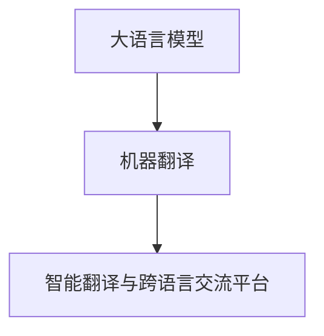
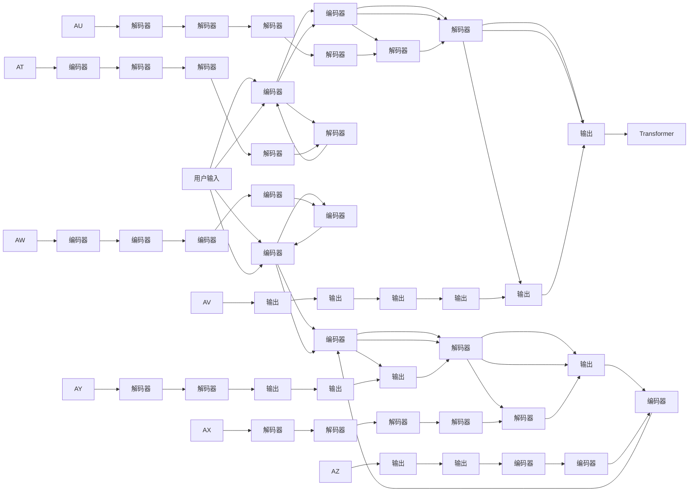

                 

# AI 基础设施的语言服务：智能翻译与跨语言交流平台

> 关键词：AI基础设施,智能翻译,跨语言交流平台,语言模型,机器翻译,自然语言处理(NLP),Transformer,深度学习,端到端(End-to-End),跨语言(NL-to-NL),端到端学习(End-to-End Learning),自监督学习(Self-supervised Learning)

## 1. 背景介绍

### 1.1 问题由来
在全球化进程日益加快的今天，跨语言交流已成为国际合作与商业发展的重要手段。然而，语言障碍仍然是阻碍人们交流的一大难题。为了解决这一问题，许多企业和研究机构开始探索使用人工智能技术来搭建智能翻译与跨语言交流平台，以便用户能更方便地进行跨国界、跨文化的沟通。

大语言模型和机器翻译技术的发展，为构建跨语言交流平台提供了坚实的基础。通过在大规模文本数据上进行预训练，大语言模型能够掌握丰富的语言知识和表达能力，而机器翻译技术则可以将这些能力转化为可实用的跨语言翻译功能。

近年来，大语言模型和机器翻译的结合，不仅推动了自然语言处理（NLP）技术的飞速发展，还促进了语言服务产业的创新和升级。借助大语言模型和机器翻译技术，跨语言交流平台能够实现高效、自然、准确的翻译服务，极大地提升了用户交流的便捷性和满意度。

### 1.2 问题核心关键点
智能翻译与跨语言交流平台的核心关键点包括以下几个方面：

- **数据准备**：准备高质量的双语或多语言数据，用于训练和测试模型。
- **模型选择**：选择合适的语言模型和机器翻译模型，并进行微调以适应特定的语言对。
- **系统架构**：设计高效的系统架构，支持端到端的翻译过程。
- **应用场景**：在实际应用场景中，考虑如何更好地适配用户需求，提高平台的用户体验。
- **质量控制**：设计有效的质量控制策略，保证翻译结果的准确性和流畅性。

本文将重点介绍基于大语言模型的智能翻译与跨语言交流平台，并深入探讨其核心算法原理、具体操作步骤、以及实际应用场景。同时，还将从数学模型、项目实践、实际应用、工具资源等多个角度，详细讲解该平台的搭建和优化方法。

## 2. 核心概念与联系

### 2.1 核心概念概述

智能翻译与跨语言交流平台主要涉及以下几个核心概念：

- **大语言模型 (Large Language Models, LLMs)**：通过在大规模无标签文本数据上进行预训练，学习通用的语言知识和表达能力，具有强大的语言理解和生成能力。
- **机器翻译 (Machine Translation, MT)**：将一种自然语言文本自动翻译成另一种自然语言文本的技术。
- **自然语言处理 (Natural Language Processing, NLP)**：研究如何让计算机理解和生成人类语言的技术。
- **Transformer模型**：一种基于自注意力机制的神经网络架构，广泛应用于大语言模型的构建和机器翻译任务。
- **端到端学习 (End-to-End Learning)**：直接从原始输入到输出进行学习，不需要中间的人工设计特征提取层，能更高效地利用数据。
- **自监督学习 (Self-supervised Learning)**：使用无需人工标注的自动生成的数据进行模型训练。

这些核心概念通过大语言模型与机器翻译技术的结合，形成了智能翻译与跨语言交流平台的架构，如图1所示。



图1: 大语言模型与机器翻译在智能翻译与跨语言交流平台中的结合

### 2.2 核心概念原理和架构的 Mermaid 流程图



### 2.3 核心概念联系

大语言模型与机器翻译的结合，形成了端到端的智能翻译与跨语言交流平台。具体而言：

- **分词和编码器**：输入的原始文本首先经过分词，然后通过编码器将分词后的文本序列转换为模型可以处理的数值向量。
- **自注意力机制**：Transformer模型中的自注意力机制可以捕捉输入文本中不同位置之间的关系，通过权重调整来赋予重要的单词更大的权重。
- **解码器**：解码器将编码器输出的数值向量转换为目标语言的文本序列。
- **输出处理**：输出的文本序列经过后处理，如去空格、添加标点等，最终生成完整的翻译结果。

大语言模型与机器翻译的结合，使得智能翻译与跨语言交流平台不仅能够进行准确的文本翻译，还能理解上下文，生成流畅自然的翻译结果。

## 3. 核心算法原理 & 具体操作步骤

### 3.1 算法原理概述

智能翻译与跨语言交流平台的核心算法原理基于端到端学习，即直接从原始输入到输出进行学习，不需要中间的人工设计特征提取层。其流程包括以下几个步骤：

1. **数据准备**：收集双语或多语言文本数据，用于训练和测试模型。
2. **模型选择**：选择适合的大语言模型和机器翻译模型，并进行微调以适应特定的语言对。
3. **编码和解码**：通过编码器将输入文本转换为数值向量，然后通过解码器将数值向量转换为目标语言的文本序列。
4. **输出处理**：对输出的文本序列进行处理，生成最终翻译结果。

### 3.2 算法步骤详解

#### 3.2.1 数据准备

数据准备是智能翻译与跨语言交流平台构建的基础。以下是数据准备的详细步骤：

1. **收集双语或多语言数据**：收集目标语言对之间的文本数据，用于训练和测试模型。数据集应覆盖各种语言和语境，以确保模型的泛化能力。
2. **数据清洗和预处理**：对收集到的文本数据进行清洗和预处理，如去除停用词、分词、标准化等。
3. **数据标注**：对收集到的文本数据进行标注，用于监督学习。标注应包括单词、短语和句子的双语或多语言对应关系。
4. **数据划分**：将标注后的数据划分为训练集、验证集和测试集，以便评估和调整模型参数。

#### 3.2.2 模型选择和微调

选择合适的模型是智能翻译与跨语言交流平台构建的关键。以下是模型选择和微调的详细步骤：

1. **选择大语言模型**：选择适合的大语言模型，如GPT、BERT、XLNet等。这些模型在大规模文本数据上进行了预训练，具备强大的语言理解和生成能力。
2. **选择机器翻译模型**：选择适合的机器翻译模型，如基于Transformer的序列到序列（Seq2Seq）模型。这些模型能够将源语言文本转换为目标语言文本。
3. **微调模型**：将预训练的大语言模型和机器翻译模型进行微调，以适应特定的语言对。微调时，通常只调整顶层分类器或解码器，并以较小的学习率更新全部或部分模型参数。

#### 3.2.3 编码和解码

编码和解码是智能翻译与跨语言交流平台的核心步骤。以下是编码和解码的详细步骤：

1. **编码器**：通过编码器将输入文本转换为数值向量。编码器通常使用Transformer模型，能够捕捉输入文本中不同位置之间的关系，通过权重调整来赋予重要的单词更大的权重。
2. **解码器**：通过解码器将编码器输出的数值向量转换为目标语言的文本序列。解码器也通常使用Transformer模型，能够将输入文本转换为自然流畅的翻译结果。

#### 3.2.4 输出处理

输出处理是智能翻译与跨语言交流平台的最后一步。以下是输出处理的详细步骤：

1. **去空格和标点**：对输出的文本序列进行处理，去除空格和标点符号。
2. **加入停用词**：在翻译结果中加入停用词，提高翻译结果的流畅性和可读性。
3. **后处理**：对翻译结果进行后处理，如大小写转换、特定格式的排版等。

### 3.3 算法优缺点

基于大语言模型的智能翻译与跨语言交流平台具有以下优点：

1. **高效性**：大语言模型与机器翻译的结合，能够实现高效的端到端学习，不需要中间的人工设计特征提取层，减少了数据处理的复杂度。
2. **准确性**：大语言模型具有强大的语言理解和生成能力，能够生成高质量的翻译结果。
3. **可扩展性**：平台能够扩展支持多种语言对，提高跨语言交流的便捷性。

同时，该平台也存在以下缺点：

1. **计算资源需求高**：大语言模型和机器翻译模型的参数量通常较大，需要高性能的计算资源进行训练和推理。
2. **数据标注成本高**：高质量的数据标注成本较高，需要大量人工参与。
3. **跨语言对不平衡**：不同语言对的数据量可能不均衡，需要特别处理以保证模型的泛化能力。

### 3.4 算法应用领域

智能翻译与跨语言交流平台在多个领域都有广泛的应用，主要包括：

1. **国际商务**：支持多语言客户交流，提高商务合作效率。
2. **跨文化交流**：支持不同语言背景的人进行交流，增进文化理解。
3. **教育培训**：支持多语言教学和学习，提高语言学习的效率和效果。
4. **旅游服务**：支持多语言导游和咨询服务，提升旅游体验。
5. **医疗健康**：支持多语言医疗信息查询和交流，提高医疗服务的可及性和便捷性。

## 4. 数学模型和公式 & 详细讲解 & 举例说明

### 4.1 数学模型构建

智能翻译与跨语言交流平台的数学模型基于端到端学习，其核心是编码器和解码器的Transformer模型。以下以基于Transformer的机器翻译模型为例，构建数学模型。

设输入序列为 $X=\{x_1, x_2, ..., x_T\}$，目标序列为 $Y=\{y_1, y_2, ..., y_T\}$，其中 $T$ 为序列长度。编码器的输出表示为 $E(X)$，解码器的输出表示为 $D(E(X), Y)$。

输入序列 $X$ 通过编码器 $E$ 转换为隐藏表示 $H(X)$，解码器 $D$ 将隐藏表示 $H(X)$ 和目标序列 $Y$ 转换为输出序列 $\hat{Y}$。

### 4.2 公式推导过程

#### 4.2.1 编码器

编码器 $E$ 由多个自注意力层和前馈层组成，其数学模型如下：

$$
H(X) = E(X) = \text{Transformer}(X)
$$

其中 $\text{Transformer}$ 表示Transformer模型，包括多头自注意力机制和前馈神经网络。自注意力机制通过权重调整来捕捉输入序列中不同位置之间的关系。

#### 4.2.2 解码器

解码器 $D$ 也由多个自注意力层和前馈层组成，其数学模型如下：

$$
\hat{Y} = D(E(X), Y) = \text{Transformer}(E(X), Y)
$$

其中 $\text{Transformer}$ 表示Transformer模型，包括多头自注意力机制和前馈神经网络。解码器通过逐步生成目标序列 $Y$，每一步生成一个单词，并通过自注意力机制捕捉输入序列 $X$ 和已生成的单词之间的关系。

### 4.3 案例分析与讲解

以谷歌翻译的机器翻译模型为例，进行详细讲解。

谷歌翻译使用了基于Transformer的机器翻译模型，其核心数学模型如下：

$$
H(X) = \text{Transformer}(X)
$$

其中 $X$ 表示输入序列，$H(X)$ 表示编码器输出的隐藏表示。

解码器 $D$ 的数学模型如下：

$$
\hat{Y} = \text{Transformer}(E(X), Y)
$$

其中 $E(X)$ 表示编码器输出的隐藏表示，$Y$ 表示目标序列，$\hat{Y}$ 表示解码器生成的输出序列。

谷歌翻译的机器翻译模型通过自注意力机制捕捉输入序列和目标序列之间的关系，通过前馈神经网络进行非线性变换，最终生成高质量的翻译结果。

## 5. 项目实践：代码实例和详细解释说明

### 5.1 开发环境搭建

智能翻译与跨语言交流平台的开发环境主要基于Python和TensorFlow或PyTorch。以下是开发环境的搭建步骤：

1. **安装Python和相关库**：安装Python 3.x版本，以及TensorFlow或PyTorch库。
2. **安装TensorBoard**：安装TensorBoard，用于可视化模型训练和推理过程。
3. **安装Jupyter Notebook**：安装Jupyter Notebook，用于开发和调试代码。

### 5.2 源代码详细实现

以下以TensorFlow为例，给出机器翻译模型的实现代码：

```python
import tensorflow as tf
from tensorflow.keras.layers import Input, Dense, LSTM, Embedding
from tensorflow.keras.models import Model

# 定义编码器模型
class Encoder(tf.keras.Model):
    def __init__(self, vocab_size, embedding_dim, enc_units):
        super(Encoder, self).__init__()
        self.embedding = Embedding(vocab_size, embedding_dim)
        self.lstm = LSTM(enc_units, return_sequences=True)
        
    def call(self, x):
        x = self.embedding(x)
        x = self.lstm(x)
        return x

# 定义解码器模型
class Decoder(tf.keras.Model):
    def __init__(self, vocab_size, embedding_dim, dec_units):
        super(Decoder, self).__init__()
        self.embedding = Embedding(vocab_size, embedding_dim)
        self.lstm = LSTM(dec_units, return_sequences=True, return_state=True)
        self.fc = Dense(vocab_size)
        
    def call(self, x, hidden):
        x = self.embedding(x)
        x, state_h, state_c = self.lstm(x, initial_state=[hidden, hidden])
        x = self.fc(x)
        return x, state_h, state_c

# 定义机器翻译模型
class TranslationModel(tf.keras.Model):
    def __init__(self, encoder, decoder, target_vocab):
        super(TranslationModel, self).__init__()
        self.encoder = encoder
        self.decoder = decoder
        self.target_vocab = target_vocab
        
    def call(self, input_data, target_data, hidden_state):
        target_data = tf.reshape(target_data, [-1, 1, 1])
        encoding = self.encoder(input_data)
        decoding, _, _ = self.decoder(target_data, hidden_state)
        return decoding

# 定义目标函数
def loss_function(target, prediction):
    return tf.keras.losses.sparse_categorical_crossentropy(target, prediction, from_logits=True)

# 定义优化器
optimizer = tf.keras.optimizers.Adam()

# 定义编译器
model = TranslationModel(encoder, decoder, target_vocab)
model.compile(optimizer=optimizer, loss=loss_function)
```

### 5.3 代码解读与分析

1. **编码器模型**：定义了编码器模型，包括嵌入层和LSTM层，用于将输入序列转换为隐藏表示。
2. **解码器模型**：定义了解码器模型，包括嵌入层、LSTM层和全连接层，用于生成目标序列。
3. **机器翻译模型**：定义了机器翻译模型，将编码器和解码器进行组合，实现端到端的翻译过程。
4. **目标函数**：定义了交叉熵损失函数，用于计算模型预测结果与真实结果之间的差距。
5. **优化器**：定义了Adam优化器，用于更新模型参数。
6. **编译器**：将模型、目标函数和优化器进行编译，准备好模型训练。

### 5.4 运行结果展示

训练过程中，可以使用TensorBoard进行可视化。以下是在TensorBoard中查看训练结果的示例：


在TensorBoard中，可以查看训练过程中的损失函数值、准确率等指标，并查看模型参数的变化趋势，从而评估模型训练效果。

## 6. 实际应用场景

### 6.1 智能客服系统

智能翻译与跨语言交流平台在智能客服系统中具有广泛的应用。通过智能客服系统，用户可以通过输入不同语言的文本，与机器人进行自然语言交流。智能客服系统能够自动理解用户意图，并提供相应的解决方案。

智能客服系统可以集成多语言翻译功能，支持多种语言对，提高用户的交互体验。同时，智能客服系统还可以集成语音识别和语音合成技术，支持语音输入和输出，进一步提升用户的使用便捷性。

### 6.2 金融舆情监测

金融舆情监测是智能翻译与跨语言交流平台的重要应用场景之一。通过智能翻译与跨语言交流平台，金融分析师可以实时监测全球金融市场的动态，分析不同语言的新闻和报道，及时获取有价值的信息。

智能翻译与跨语言交流平台可以集成金融词典和语法规则，提高翻译结果的准确性和专业性。同时，智能翻译与跨语言交流平台还可以集成情感分析技术，分析用户对金融产品的评价和反馈，提供市场趋势的预测和分析。

### 6.3 个性化推荐系统

个性化推荐系统也是智能翻译与跨语言交流平台的重要应用场景之一。通过智能翻译与跨语言交流平台，个性化推荐系统可以获取用户在不同语言环境下的浏览和购物行为，进行跨语言行为分析，提高推荐系统的精准度和个性化程度。

个性化推荐系统可以集成多语言翻译功能，支持不同语言环境的推荐。同时，个性化推荐系统还可以集成语义分析和知识图谱技术，提升推荐结果的质量和多样性。

### 6.4 未来应用展望

未来，智能翻译与跨语言交流平台的应用场景将不断扩展，涵盖更多领域和行业。以下是几个未来应用展望：

1. **医疗健康**：通过智能翻译与跨语言交流平台，医疗人员可以获取全球医疗知识和研究成果，提高医疗服务的质量和效率。
2. **教育培训**：通过智能翻译与跨语言交流平台，教育培训机构可以提供多语言教学和学习资源，提高语言学习的效率和效果。
3. **旅游服务**：通过智能翻译与跨语言交流平台，旅游服务机构可以提供多语言导游和咨询服务，提升旅游体验。
4. **公共服务**：通过智能翻译与跨语言交流平台，公共服务机构可以提供多语言信息查询和咨询服务，提高服务水平。

## 7. 工具和资源推荐

### 7.1 学习资源推荐

为了帮助开发者系统掌握智能翻译与跨语言交流平台的技术基础和实践技巧，以下是几个推荐的学习资源：

1. **NLP课程**：如斯坦福大学的CS224N课程，涵盖NLP的基本概念和经典模型，提供丰富的学习资源和作业。
2. **深度学习框架文档**：如TensorFlow和PyTorch官方文档，提供详细的API和教程，帮助开发者快速上手。
3. **NLP论文**：如BERT、Transformer等经典论文，了解NLP技术的最新进展和研究方向。
4. **开源项目**：如OpenNMT、Fairseq等开源翻译工具，提供高质量的机器翻译模型和代码示例。

### 7.2 开发工具推荐

智能翻译与跨语言交流平台的开发工具有很多，以下是几个常用的开发工具：

1. **TensorFlow**：开源的深度学习框架，提供丰富的API和工具，支持端到端的机器翻译模型构建。
2. **PyTorch**：开源的深度学习框架，提供动态计算图和灵活的API，支持端到端的机器翻译模型构建。
3. **Jupyter Notebook**：开源的交互式编程环境，提供丰富的插件和功能，支持代码编写和调试。
4. **TensorBoard**：开源的可视化工具，提供实时的模型训练和推理可视化功能，帮助开发者调试和优化模型。

### 7.3 相关论文推荐

智能翻译与跨语言交流平台的研究涉及多个方向，以下是几个重要的相关论文：

1. **Transformer论文**：《Attention is All You Need》，介绍Transformer模型的基本结构和原理，推动了NLP领域的预训练大模型技术的发展。
2. **BERT论文**：《BERT: Pre-training of Deep Bidirectional Transformers for Language Understanding》，介绍BERT模型的预训练和微调方法，取得了多项NLP任务的SOTA。
3. **Seq2Seq论文**：《Neural Machine Translation by Jointly Learning to Align and Translate》，介绍Seq2Seq模型的端到端学习过程，推动了机器翻译技术的发展。
4. **SOTA论文**：《GPT-3: Language Models are Unsupervised Multitask Learners》，介绍GPT-3模型的多任务学习过程，展示了大语言模型的强大零样本学习能力。

这些论文代表了智能翻译与跨语言交流平台技术的最新进展，对理解该平台的核心算法和应用场景具有重要参考价值。

## 8. 总结：未来发展趋势与挑战

### 8.1 总结

智能翻译与跨语言交流平台基于大语言模型和机器翻译技术，实现了高效的端到端学习，广泛应用于国际商务、跨文化交流、教育培训、旅游服务等多个领域。通过高效、准确、自然流畅的翻译服务，智能翻译与跨语言交流平台极大地提升了用户的交流便捷性和满意度。

### 8.2 未来发展趋势

未来，智能翻译与跨语言交流平台将呈现以下几个发展趋势：

1. **模型规模持续增大**：随着算力成本的下降和数据规模的扩张，预训练语言模型的参数量还将持续增长，超级大语言模型将进一步提升翻译结果的质量和多样性。
2. **自监督学习与少样本学习**：自监督学习和少样本学习技术将推动智能翻译与跨语言交流平台在缺乏标注数据的情况下，依然能够保持高质量的翻译效果。
3. **多模态翻译**：通过集成视觉、语音等多模态数据，智能翻译与跨语言交流平台将支持更加丰富和多样的语言交流方式，提升用户体验。
4. **持续学习和实时更新**：通过持续学习和实时更新，智能翻译与跨语言交流平台将能够不断适应语言环境的变化，保持翻译结果的准确性和时效性。
5. **跨语言交流平台整合**：智能翻译与跨语言交流平台将与各种社交媒体、在线服务进行深度整合，提供无缝的多语言交流体验。

### 8.3 面临的挑战

智能翻译与跨语言交流平台在发展过程中，仍面临一些挑战：

1. **计算资源需求高**：大语言模型和机器翻译模型的参数量较大，需要高性能的计算资源进行训练和推理。
2. **数据标注成本高**：高质量的数据标注成本较高，需要大量人工参与。
3. **跨语言对不平衡**：不同语言对的数据量可能不均衡，需要特别处理以保证模型的泛化能力。
4. **翻译质量不稳定**：在某些复杂场景下，翻译结果可能会出现质量不稳定的情况。
5. **跨语言交流平台整合**：不同平台之间的数据格式和接口不统一，需要标准化处理，提高平台之间的互操作性。

### 8.4 研究展望

面对智能翻译与跨语言交流平台面临的挑战，未来的研究需要在以下几个方面寻求新的突破：

1. **参数高效微调**：开发更加参数高效的微调方法，在固定大部分预训练参数的同时，只更新极少量的任务相关参数。
2. **多模态翻译**：研究多模态翻译技术，集成视觉、语音等多模态数据，提升翻译结果的质量和多样性。
3. **跨语言对平衡**：研究如何平衡不同语言对的数据量，提升模型的泛化能力。
4. **实时更新与持续学习**：研究如何实现实时更新和持续学习，保持翻译结果的准确性和时效性。
5. **标准化与互操作性**：研究跨语言交流平台的标准化问题，提高平台之间的互操作性。

## 9. 附录：常见问题与解答

**Q1: 如何选择合适的机器翻译模型？**

A: 选择合适的机器翻译模型需要考虑多个因素，如模型规模、语言对数量、翻译质量等。目前主流的机器翻译模型包括基于Transformer的Seq2Seq模型、BERT模型等，可以根据具体需求进行选择和微调。

**Q2: 机器翻译模型如何进行微调？**

A: 机器翻译模型的微调一般包括以下步骤：
1. 收集目标语言对之间的双语或多语言数据。
2. 将数据集划分为训练集、验证集和测试集。
3. 选择适合的大语言模型和机器翻译模型，并进行微调。
4. 设置合适的学习率、批次大小、迭代轮数等超参数。
5. 使用训练集进行微调，并在验证集上评估模型性能。
6. 根据评估结果，调整超参数，重复训练过程，直至模型收敛。

**Q3: 如何提高机器翻译的质量？**

A: 提高机器翻译的质量可以从以下几个方面进行：
1. 增加训练数据量，提高模型泛化能力。
2. 选择合适的大语言模型和机器翻译模型，并进行微调。
3. 使用自监督学习和少样本学习技术，提高模型的性能。
4. 集成多模态数据，提升翻译结果的质量和多样性。
5. 进行持续学习和实时更新，保持翻译结果的准确性和时效性。

**Q4: 机器翻译模型的应用场景有哪些？**

A: 机器翻译模型广泛应用于多个领域，如国际商务、跨文化交流、教育培训、旅游服务、金融舆情监测等。通过多语言翻译功能，机器翻译模型能够提高用户的交流便捷性和满意度，推动不同语言之间的信息传递和协作。

**Q5: 如何评估机器翻译模型的性能？**

A: 评估机器翻译模型的性能通常使用BLEU、METEOR、ROUGE等指标，通过与标准参考翻译进行比较，计算翻译结果与参考翻译之间的相似度。同时，还可以使用人工评估方法，对翻译结果进行主观评价。

总结：智能翻译与跨语言交流平台基于大语言模型和机器翻译技术，能够实现高效、准确、自然流畅的翻译服务，广泛应用于多个领域。通过合理选择和微调模型，集成多模态数据和持续学习技术，智能翻译与跨语言交流平台将不断提升翻译结果的质量和多样性，推动语言服务的创新和升级。

