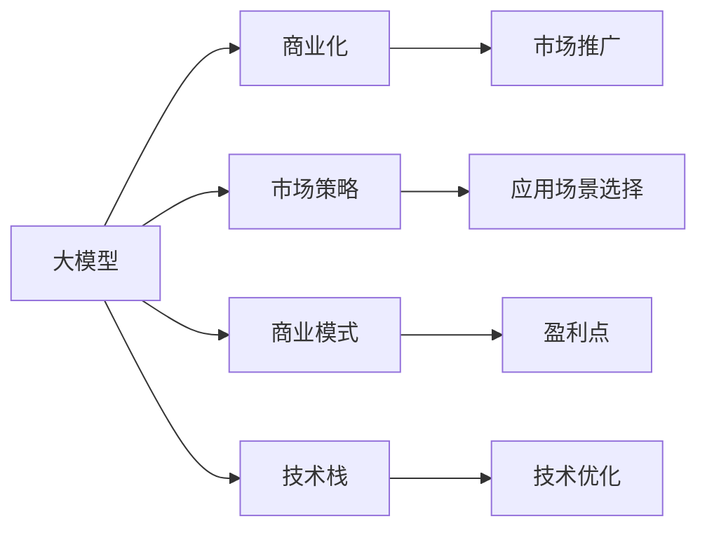

                 

# AI 大模型创业：如何利用商业优势？

大模型正在加速推进AI商业化进程，而在AI大模型的创业浪潮中，利用好商业优势，掌握正确的方法论，成为制胜关键。

## 1. 背景介绍

### 1.1 背景概述

随着AI技术在各行各业的应用深入，商业公司纷纷投入大量资源进行AI大模型的研发和应用。深度学习与大数据的结合，让大模型的应用范围与能力得到了极大提升，创造了巨大的商业价值。例如，谷歌的BERT模型、OpenAI的GPT-3模型，都被广泛应用于搜索引擎、自然语言处理、机器翻译、对话系统等多个领域。

这些模型不仅是学术界的研究热点，更是商业公司竞相争夺的核心技术。大模型的创业机会主要体现在如下几个方面：

1. **技术领先**：拥有先进的算法和模型架构，可以在特定应用场景中提升模型效果，带来更大的市场份额。
2. **数据优势**：通过整合多来源的数据，优化模型训练，提升模型在商业应用中的表现。
3. **应用场景**：选择具有高市场需求、高附加值的场景进行深度定制，提高商业化速度。
4. **市场策略**：制定有效的市场推广策略，扩大品牌影响，占领更多市场份额。

### 1.2 核心问题

在大模型创业过程中，可能遇到以下问题：

1. **数据获取困难**：优质的训练数据获取困难，可能限制模型性能提升。
2. **技术壁垒高**：技术研发需要高水平团队，高昂的研发成本。
3. **市场竞争激烈**：市场竞争激烈，需要持续创新以保持竞争优势。
4. **商业模式不明晰**：商业模式不清晰，盈利点单一。
5. **商业化难点**：从技术到产品，再到市场推广，每一步都需精细化运营。

## 2. 核心概念与联系

### 2.1 核心概念概述

大模型创业的核心概念包括：

1. **大模型**：指采用深度学习框架、经过大规模数据预训练的模型，如BERT、GPT-3等。
2. **商业化**：将AI模型应用于实际业务，产生商业价值的过程。
3. **市场策略**：针对不同应用场景，制定有效的市场推广和销售策略。
4. **商业模式**：包括产品的定价、销售渠道、客户关系管理等，决定公司盈利模式。
5. **技术栈**：涉及深度学习框架、云计算平台、模型优化等技术。

### 2.2 核心概念联系

这些核心概念之间的关系可以用以下Mermaid流程图表示：



大模型是商业化的基础，而市场策略、商业模式和技术栈则辅助大模型的商业化落地。

## 3. 核心算法原理 & 具体操作步骤

### 3.1 算法原理概述

大模型的商业化原理，主要是利用深度学习模型的强大表征能力，将模型的输出应用于实际业务中，创造商业价值。基于大模型的商业化流程包括：

1. **数据收集与预处理**：收集高质量的训练数据，对数据进行清洗和预处理，确保数据质量。
2. **模型训练与优化**：在数据上进行大模型的训练与优化，提升模型效果。
3. **场景应用与定制化**：选择适合的应用场景，进行模型定制化，以适应具体业务需求。
4. **模型部署与维护**：将训练好的模型部署到生产环境中，并持续维护与优化。

### 3.2 算法步骤详解

**Step 1：数据收集与预处理**

1. **数据来源**：收集与业务相关的数据，如客户反馈、用户行为、交易记录等。
2. **数据清洗**：去除噪声和无用数据，确保数据质量。
3. **数据增强**：对数据进行扩充与增强，如数据增强、合成数据等。

**Step 2：模型训练与优化**

1. **模型选择**：选择适合当前应用场景的模型，如BERT、GPT等。
2. **模型优化**：对模型进行微调，提升模型效果。
3. **模型评估**：在验证集上评估模型性能，调整模型参数。

**Step 3：场景应用与定制化**

1. **场景选择**：选择具有高市场需求的场景，如自然语言处理、计算机视觉、语音识别等。
2. **模型定制**：根据具体业务需求，对模型进行定制化优化。
3. **功能集成**：将模型集成到业务系统中，提供实时服务。

**Step 4：模型部署与维护**

1. **部署方式**：选择适合的生产环境，如云平台、本地服务器等。
2. **性能监控**：对模型性能进行实时监控，及时发现问题。
3. **持续优化**：对模型进行定期优化，提升性能。

### 3.3 算法优缺点

**优点**：

1. **高效性**：大模型具有高效的表征能力，可以快速解决实际问题。
2. **泛化性**：大模型具有较强的泛化能力，可以适应多种业务场景。
3. **可扩展性**：大模型可部署在云端，快速扩展。

**缺点**：

1. **高成本**：大模型的训练与部署需要高昂的成本，如硬件资源、云计算费用等。
2. **数据依赖**：模型的性能高度依赖于数据的数量与质量，获取高质量数据困难。
3. **复杂性**：模型的训练与优化过程复杂，需要高水平团队。

### 3.4 算法应用领域

大模型的商业化应用主要包括以下几个领域：

1. **金融科技**：利用模型进行信用评估、风险控制、智能投顾等。
2. **医疗健康**：利用模型进行疾病预测、病理分析、智能问诊等。
3. **智能制造**：利用模型进行工业物联网、智能运维、质量检测等。
4. **智能客服**：利用模型进行自然语言处理、对话系统、情感分析等。
5. **教育培训**：利用模型进行学习推荐、智能测评、智能教学等。

## 4. 数学模型和公式 & 详细讲解 & 举例说明

### 4.1 数学模型构建

大模型商业化的数学模型主要包括损失函数、优化算法和评估指标等：

1. **损失函数**：如交叉熵损失、均方误差损失、对数似然损失等，用于衡量模型的预测输出与真实标签之间的差异。
2. **优化算法**：如随机梯度下降、Adam优化器、Adagrad优化器等，用于最小化损失函数。
3. **评估指标**：如准确率、召回率、F1分数等，用于评估模型的性能。

### 4.2 公式推导过程

以分类任务为例，二分类任务中的交叉熵损失函数为：

$$
\mathcal{L} = -\frac{1}{N} \sum_{i=1}^N(y_i\log p_i + (1-y_i)\log(1-p_i))
$$

其中，$p_i$ 表示模型对样本 $i$ 的预测概率。优化算法中，常用的Adam优化器更新公式为：

$$
\theta \leftarrow \theta - \eta (\frac{\partial \mathcal{L}}{\partial \theta})
$$

其中，$\eta$ 为学习率，$\partial \mathcal{L}/\partial \theta$ 为损失函数对模型参数的梯度。

### 4.3 案例分析与讲解

**案例1：情感分析**

- **任务描述**：对用户评论进行情感分析，判断评论为正面、负面或中性。
- **数据预处理**：清洗数据，去除噪声，分词处理，将评论转换为向量。
- **模型训练**：使用BERT模型进行训练，采用交叉熵损失函数，Adam优化器。
- **评估指标**：使用准确率、召回率和F1分数评估模型性能。

**案例2：风险控制**

- **任务描述**：对贷款申请进行风险评估，判断申请人是否具有高风险。
- **数据预处理**：收集贷款申请数据，清洗数据，提取特征。
- **模型训练**：使用BERT模型进行训练，采用对数似然损失函数，Adam优化器。
- **评估指标**：使用ROC曲线、AUC值评估模型性能。

## 5. 项目实践：代码实例和详细解释说明

### 5.1 开发环境搭建

开发环境搭建需要如下步骤：

1. **安装Python**：在开发机器上安装Python3.x，建议安装最新版本。
2. **安装深度学习框架**：如TensorFlow、PyTorch等，安装最新版本。
3. **安装数据处理库**：如Pandas、NumPy等，方便数据预处理。
4. **安装模型库**：如TensorFlow Hub、PyTorch Hub等，方便模型选择和优化。
5. **安装评估库**：如Scikit-learn等，方便模型评估。

### 5.2 源代码详细实现

**代码实现1：情感分析**

```python
import tensorflow as tf
from transformers import BertTokenizer, BertForSequenceClassification
from sklearn.model_selection import train_test_split

# 数据预处理
tokenizer = BertTokenizer.from_pretrained('bert-base-uncased')
train_data, test_data = train_test_split(data, test_size=0.2)

# 模型训练
model = BertForSequenceClassification.from_pretrained('bert-base-uncased', num_labels=3)
optimizer = tf.keras.optimizers.Adam(learning_rate=2e-5)
loss_fn = tf.keras.losses.CategoricalCrossentropy(from_logits=True)
metric = tf.keras.metrics.CategoricalAccuracy('accuracy')

# 模型训练与优化
model.compile(optimizer=optimizer, loss=loss_fn, metrics=[metric])
model.fit(train_data, epochs=3, validation_data=test_data)

# 模型评估
model.evaluate(test_data)
```

**代码实现2：风险控制**

```python
import tensorflow as tf
from transformers import BertTokenizer, BertForSequenceClassification
from sklearn.model_selection import train_test_split

# 数据预处理
tokenizer = BertTokenizer.from_pretrained('bert-base-uncased')
train_data, test_data = train_test_split(data, test_size=0.2)

# 模型训练
model = BertForSequenceClassification.from_pretrained('bert-base-uncased', num_labels=2)
optimizer = tf.keras.optimizers.Adam(learning_rate=2e-5)
loss_fn = tf.keras.losses.BinaryCrossentropy(from_logits=True)
metric = tf.keras.metrics.AUC()

# 模型训练与优化
model.compile(optimizer=optimizer, loss=loss_fn, metrics=[metric])
model.fit(train_data, epochs=3, validation_data=test_data)

# 模型评估
model.evaluate(test_data)
```

### 5.3 代码解读与分析

**代码实现1：情感分析**

1. **数据预处理**：使用BertTokenizer进行分词处理，将评论转换为token id。
2. **模型训练**：使用BertForSequenceClassification进行分类模型训练，使用交叉熵损失函数和Adam优化器。
3. **模型评估**：使用CategoricalAccuracy评估模型准确率。

**代码实现2：风险控制**

1. **数据预处理**：使用BertTokenizer进行分词处理，将贷款申请数据转换为token id。
2. **模型训练**：使用BertForSequenceClassification进行分类模型训练，使用二分类交叉熵损失函数和Adam优化器。
3. **模型评估**：使用AUC值评估模型性能。

## 6. 实际应用场景

### 6.1 金融科技

金融科技行业是大模型的重要应用领域。通过大模型进行风险控制、信用评估、智能投顾等，可以大幅提升金融服务水平。

**场景案例：智能投顾**

- **任务描述**：利用大模型进行智能投顾，推荐合适的投资组合。
- **数据来源**：用户的历史交易记录、市场数据、财务报表等。
- **模型训练**：使用大模型进行用户行为分析，推荐合适的投资组合。
- **效果评估**：评估模型推荐的投资组合的收益、风险等指标。

### 6.2 医疗健康

医疗健康行业是大模型的另一个重要应用领域。通过大模型进行疾病预测、病理分析、智能问诊等，可以大幅提升医疗服务水平。

**场景案例：智能问诊**

- **任务描述**：利用大模型进行智能问诊，提供快速准确的诊断结果。
- **数据来源**：病人的病历记录、临床数据、基因数据等。
- **模型训练**：使用大模型进行疾病诊断，提取特征并训练模型。
- **效果评估**：评估模型诊断的准确率、召回率等指标。

### 6.3 智能制造

智能制造行业是大模型的潜在应用领域。通过大模型进行工业物联网、智能运维、质量检测等，可以大幅提升生产效率和产品质量。

**场景案例：智能运维**

- **任务描述**：利用大模型进行智能运维，预测设备故障，提前进行维护。
- **数据来源**：设备的历史运行数据、环境数据、操作数据等。
- **模型训练**：使用大模型进行设备故障预测，提取特征并训练模型。
- **效果评估**：评估模型预测的准确率和故障率等指标。

### 6.4 智能客服

智能客服行业是大模型的典型应用场景。通过大模型进行自然语言处理、对话系统、情感分析等，可以大幅提升客服效率和用户满意度。

**场景案例：智能客服**

- **任务描述**：利用大模型进行智能客服，解答用户咨询。
- **数据来源**：历史客服对话记录。
- **模型训练**：使用大模型进行对话系统训练，提取特征并训练模型。
- **效果评估**：评估模型对话的准确率和用户满意度等指标。

## 7. 工具和资源推荐

### 7.1 学习资源推荐

1. **《深度学习》书籍**：宜家经典书籍，全面介绍了深度学习的基本概念和算法。
2. **《Python深度学习》书籍**：由深度学习领域的知名专家撰写，详细介绍了Python深度学习框架的使用。
3. **Coursera深度学习课程**：由斯坦福大学教授Andrew Ng教授主讲，系统介绍了深度学习的基本概念和算法。
4. **Kaggle数据集**：Kaggle是一个数据科学竞赛平台，提供大量数据集和竞赛，是数据科学学习的良好资源。
5. **Transformers文档**：HuggingFace提供的Transformer文档，详细介绍了各种大模型的使用方法和参数设置。

### 7.2 开发工具推荐

1. **PyTorch**：由Facebook开源的深度学习框架，具有灵活性和高效性。
2. **TensorFlow**：由Google开源的深度学习框架，具有生产部署性和可扩展性。
3. **Jupyter Notebook**：一个交互式的开发环境，支持Python、R等多种编程语言。
4. **AWS SageMaker**：亚马逊提供的云端机器学习服务，支持深度学习模型训练和部署。
5. **Google Cloud AI Platform**：谷歌提供的云端机器学习服务，支持深度学习模型训练和部署。

### 7.3 相关论文推荐

1. **《Attention is All You Need》**：Transformer的论文，介绍了Transformer的架构和应用。
2. **《BERT: Pre-training of Deep Bidirectional Transformers for Language Understanding》**：BERT的论文，介绍了BERT的架构和训练方法。
3. **《Google's AlphaGo Zero》**：谷歌的AlphaGo Zero论文，介绍了强化学习在围棋中的应用。
4. **《A Survey on Transfer Learning》**：一篇综述论文，系统介绍了转移学习的概念和应用。
5. **《Language Models are Unsupervised Multitask Learners》**：GPT-2的论文，介绍了GPT-2的架构和训练方法。

## 8. 总结：未来发展趋势与挑战

### 8.1 总结

本文从大模型创业的角度，系统介绍了大模型的商业化原理、操作步骤和核心概念，并结合实际应用场景，进行了详细讲解和代码实现。通过本文的学习，读者可以深入理解大模型商业化的关键步骤和方法，为后续的创业实践奠定基础。

### 8.2 未来发展趋势

1. **大模型规模化**：随着硬件和算力的提升，大模型将向更大规模发展，带来更强的泛化能力和性能提升。
2. **多模态融合**：结合视觉、语音、文本等多种模态数据，提升模型的综合能力。
3. **模型迁移学习**：通过迁移学习，将大模型的知识迁移到小模型中，降低模型训练成本。
4. **应用场景多样化**：大模型将逐渐应用于更多行业，提升各行业的智能化水平。
5. **模型可解释性**：随着模型复杂度的增加，模型的可解释性需求将更加迫切，研究者将投入更多精力提高模型的透明性和可解释性。

### 8.3 面临的挑战

1. **数据获取困难**：高质量的数据获取难度较大，限制了大模型的性能提升。
2. **技术壁垒高**：大模型的训练与优化需要高水平团队，研发成本高昂。
3. **市场竞争激烈**：大模型领域的竞争将更加激烈，需要持续创新以保持竞争优势。
4. **应用落地难度**：将大模型应用于实际业务中，需要考虑数据、模型、算力等多个环节，实现难度较大。
5. **商业化难度**：大模型的商业化需要精细化运营，市场推广难度较大。

### 8.4 研究展望

1. **无监督学习**：研究无监督学习和半监督学习，降低对标注数据的需求。
2. **模型压缩**：研究模型压缩和优化技术，提高模型的可部署性和效率。
3. **多模态学习**：研究多模态数据的融合与学习，提升模型的综合能力。
4. **迁移学习**：研究迁移学习技术，降低模型训练成本，提高模型泛化能力。
5. **可解释性**：研究模型的可解释性技术，提高模型的透明性和可解释性。

通过不断探索和突破，大模型将逐渐在各行业落地应用，成为推动智能化转型和经济社会发展的重要力量。

## 9. 附录：常见问题与解答

**Q1: 大模型和普通模型有何区别？**

**A1:** 大模型与普通模型的主要区别在于规模和能力。大模型通常具有数十亿参数，能够处理更复杂、更丰富的数据，具有更强的泛化能力和表达能力。而普通模型参数规模较小，主要用于特定的业务场景。

**Q2: 如何选择合适的训练数据？**

**A2:** 选择合适的训练数据需要考虑数据的代表性和多样性，数据的噪声和质量，数据的标注方式等。一般建议选择与业务场景相关的数据，并进行适当的预处理。

**Q3: 大模型训练和优化有哪些技巧？**

**A3:** 大模型训练和优化技巧包括：
1. 使用GPU/TPU等高性能设备进行训练。
2. 使用混合精度训练，提高训练效率。
3. 使用学习率调度策略，避免学习率过大或过小。
4. 使用正则化技术，避免过拟合。
5. 使用数据增强技术，提高模型泛化能力。

**Q4: 大模型如何应用于实际业务？**

**A4:** 大模型应用于实际业务需要经过以下步骤：
1. 收集数据，并进行预处理。
2. 选择合适的大模型，并进行微调。
3. 将模型部署到生产环境中，并持续优化。
4. 对模型进行实时监控和评估，确保模型性能。

**Q5: 大模型商业化有哪些策略？**

**A5:** 大模型商业化策略包括：
1. 选择合适的应用场景，进行定制化优化。
2. 制定有效的市场推广策略，扩大品牌影响力。
3. 制定清晰的商业模式，确定盈利点。
4. 建立良好的客户关系管理，提升客户满意度。

---

作者：禅与计算机程序设计艺术 / Zen and the Art of Computer Programming

