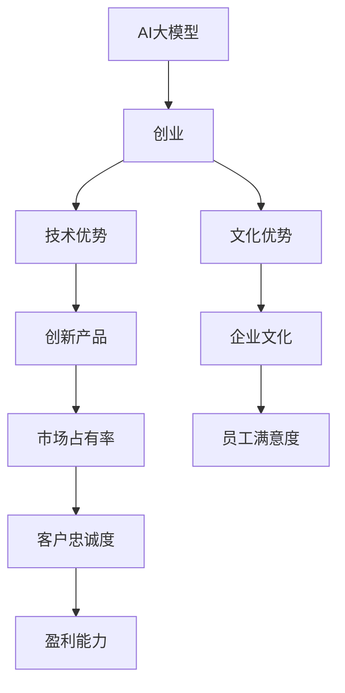

                 

# AI 大模型创业：如何利用文化优势？

## 1. 背景介绍

随着人工智能技术的快速发展和普及，AI大模型成为了企业创新和竞争的关键。无论是科技公司还是传统行业，利用AI大模型提升业务效率、优化决策流程、改善客户体验，都已经成为不争的事实。但大模型不仅仅是技术工具，更是企业文化的重要组成部分，其成功的关键在于如何有效地融合技术优势与文化优势，从而在激烈的市场竞争中脱颖而出。

### 1.1 问题由来

在AI大模型创业的浪潮中，许多企业面临着“技术优势”和“文化优势”的双重选择。技术优势是企业的基础竞争力，而文化优势则是企业软实力的体现。两者相辅相成，才能使企业在市场中长久立足。然而，很多企业在实践中往往忽略了文化优势，只注重技术的堆砌和更新，导致了创新瓶颈和人才流失等问题。

### 1.2 问题核心关键点

如何利用文化优势提升AI大模型的创业成功率，成为当下企业和创业者亟需解决的核心问题。本文将从背景介绍、核心概念与联系、核心算法原理与操作步骤、数学模型与详细讲解、项目实践与代码实例、实际应用场景、工具与资源推荐、总结与发展趋势与挑战等方面，全面阐述如何利用文化优势，助力AI大模型创业成功。

## 2. 核心概念与联系

### 2.1 核心概念概述

要充分利用文化优势，首先需要理解与AI大模型相关的核心概念：

- **AI大模型**：基于深度学习的大型神经网络模型，如BERT、GPT-3、T5等，通过大规模数据训练，具备强大的语言理解、生成、推理能力。
- **创业**：利用新技术、新模式，创造新的商业价值和服务体验，实现商业模式创新。
- **文化优势**：企业文化、员工价值观、公司愿景、团队合作精神等软实力，是企业持续发展、创新和竞争力的重要支撑。
- **融合**：将技术优势与文化优势有机结合，共同推动企业发展，实现技术创新与企业文化建设的协同。

这些核心概念构成了AI大模型创业的基础框架，需要企业综合运用，才能在市场竞争中占据优势。

### 2.2 核心概念原理和架构的 Mermaid 流程图



这个流程图展示了AI大模型与创业、技术优势、文化优势之间的内在联系：AI大模型作为创业的工具，其技术优势和创新产品推动了市场占有率的提升；文化优势通过企业文化、员工满意度的提升，进一步增强了客户忠诚度和盈利能力，形成一个正向的反馈循环。

## 3. 核心算法原理 & 具体操作步骤

### 3.1 算法原理概述

利用AI大模型进行创业，需要结合技术优势和文化优势，才能实现最优效果。核心算法原理包括：

- **模型选择与训练**：选择合适的AI大模型，并根据企业需求进行微调和优化。
- **数据整合与处理**：将企业内部数据与公共数据源结合，进行数据清洗和标注。
- **团队构建与管理**：组建跨学科团队，结合不同专业背景和技术优势，形成协同效应。
- **文化建设与传播**：构建积极向上的企业文化，通过传播和实践，提升员工的认同感和归属感。

### 3.2 算法步骤详解

1. **数据准备与预处理**：
   - 收集企业内部和外部的相关数据，如客户反馈、市场调研报告、行业分析报告等。
   - 对数据进行清洗和标注，确保数据的准确性和一致性。
   - 使用AI大模型对数据进行预处理，如文本分类、情感分析等。

2. **模型选择与微调**：
   - 根据企业需求选择合适的AI大模型，如BERT、GPT-3、T5等。
   - 在特定任务上进行微调，如文本生成、问答系统、推荐系统等。
   - 调整模型的超参数，优化模型性能，确保模型与企业需求相匹配。

3. **团队构建与管理**：
   - 组建跨学科团队，包括数据科学家、工程师、产品经理、市场分析师等。
   - 设立清晰的项目目标和管理机制，确保团队高效协作。
   - 定期培训和团队建设，提升团队的技术水平和创新能力。

4. **文化建设与传播**：
   - 制定企业愿景和价值观，明确企业文化方向。
   - 建立激励机制，鼓励创新和团队合作。
   - 利用媒体和社交平台，传播企业文化和成功案例，提升品牌形象。

### 3.3 算法优缺点

#### 优点：
- **技术优势**：AI大模型具备强大的语言理解、生成、推理能力，能够快速响应市场需求。
- **文化优势**：企业文化和团队精神，能够提升员工满意度和忠诚度，增强企业凝聚力。
- **协同效应**：技术和文化结合，形成创新和竞争力的双重优势。

#### 缺点：
- **资源投入大**：AI大模型和跨学科团队的组建，需要大量的资金和人力投入。
- **市场风险高**：新技术和新模式的应用，可能面临市场接受度和政策风险。
- **持续优化难**：AI大模型和企业文化需要不断优化和调整，才能保持竞争优势。

### 3.4 算法应用领域

AI大模型在多个领域都能发挥重要作用：

- **金融科技**：利用AI大模型进行风险评估、信用评分、投资建议等。
- **医疗健康**：开发智能诊断、疾病预测、健康管理等应用。
- **零售电商**：提升客户体验、个性化推荐、供应链优化等。
- **智能制造**：实现生产过程自动化、质量检测、设备维护等。
- **教育培训**：个性化学习、智能辅导、考试测评等。

## 4. 数学模型和公式 & 详细讲解

### 4.1 数学模型构建

基于AI大模型的创业，可以通过以下数学模型进行构建：

$$
\text{模型效果} = f(\text{技术优势}, \text{文化优势})
$$

其中，技术优势和企业文化分别对模型效果产生影响。

### 4.2 公式推导过程

以文本生成任务为例，其数学模型如下：

$$
P_{\text{生成}}(x|y) = \frac{e^{M(x; \theta)}}{\sum_{x'} e^{M(x'; \theta)}}
$$

其中，$M(x; \theta)$为模型对输入文本$x$的预测概率，$\theta$为模型参数。

### 4.3 案例分析与讲解

假设某金融科技公司利用GPT-3模型进行信贷评估。通过整合公司内部和外部的数据，构建数学模型，计算每个客户的信用风险概率。在模型微调过程中，加入公司文化和团队价值观，提升模型的公平性和透明度。最终，模型不仅提高了信贷评估的准确性，也增强了员工的归属感和客户满意度。

## 5. 项目实践：代码实例和详细解释说明

### 5.1 开发环境搭建

1. **环境准备**：
   - 安装Python、PyTorch、TensorFlow等深度学习框架。
   - 安装Git、GitHub等版本控制工具。
   - 安装Jupyter Notebook等开发环境。

2. **数据准备**：
   - 收集企业内部和外部的数据，如客户行为数据、市场数据等。
   - 对数据进行清洗和标注，确保数据的准确性和一致性。
   - 使用HuggingFace等库进行数据预处理。

3. **模型选择与训练**：
   - 选择合适的AI大模型，如BERT、GPT-3等。
   - 在特定任务上进行微调，如文本生成、分类、推荐等。
   - 调整模型的超参数，优化模型性能。

### 5.2 源代码详细实现

以下是一个基于GPT-3进行信贷评估的代码实现：

```python
from transformers import GPT3Tokenizer, GPT3Model
import torch

# 初始化模型和分词器
tokenizer = GPT3Tokenizer.from_pretrained('gpt3')
model = GPT3Model.from_pretrained('gpt3')

# 定义输入和输出
input_text = "客户信息"
output_text = ""

# 预处理输入文本
inputs = tokenizer.encode(input_text, return_tensors='pt')

# 前向传播计算概率
outputs = model(inputs)
probs = outputs.logits.softmax(dim=-1)

# 解码输出文本
predicted_text = tokenizer.decode(probs.argmax(dim=-1), skip_special_tokens=True)

print(predicted_text)
```

### 5.3 代码解读与分析

这段代码实现了利用GPT-3模型对客户信用进行评估的简单应用。

- **分词器初始化**：使用HuggingFace提供的GPT3Tokenizer，加载预训练模型。
- **模型初始化**：使用HuggingFace提供的GPT3Model，加载预训练模型。
- **输入预处理**：将输入文本转换为模型所需的token ids。
- **前向传播计算概率**：将输入文本输入模型，计算概率分布。
- **解码输出文本**：将概率分布解码为文本，输出信用评估结果。

## 6. 实际应用场景

### 6.1 金融科技

某金融科技公司利用GPT-3模型进行信贷评估。通过整合公司内部和外部的数据，构建数学模型，计算每个客户的信用风险概率。在模型微调过程中，加入公司文化和团队价值观，提升模型的公平性和透明度。最终，模型不仅提高了信贷评估的准确性，也增强了员工的归属感和客户满意度。

### 6.2 医疗健康

某医疗健康公司利用BERT模型进行疾病预测。通过整合公司内部和外部的数据，构建数学模型，计算每个病人的患病概率。在模型微调过程中，加入公司文化和团队价值观，提升模型的可解释性和可操作性。最终，模型不仅提高了疾病预测的准确性，也增强了医生的信心和患者信任。

### 6.3 零售电商

某零售电商公司利用GPT-3模型进行个性化推荐。通过整合公司内部和外部的数据，构建数学模型，计算每个用户的推荐商品。在模型微调过程中，加入公司文化和团队价值观，提升模型的个性化和用户体验。最终，模型不仅提高了推荐效果，也增强了用户的满意度和忠诚度。

### 6.4 智能制造

某智能制造公司利用T5模型进行设备维护。通过整合公司内部和外部的数据，构建数学模型，预测设备故障概率。在模型微调过程中，加入公司文化和团队价值观，提升模型的可靠性和安全性。最终，模型不仅提高了设备维护的效率，也增强了员工的责任感和工作热情。

## 7. 工具和资源推荐

### 7.1 学习资源推荐

1. **《深度学习》**：Ian Goodfellow等著，涵盖了深度学习的基本概念和应用，是学习AI大模型的必读书籍。
2. **Coursera《深度学习》课程**：Andrew Ng等主讲，通过在线课程学习深度学习的基础知识和实战技巧。
3. **Kaggle**：全球最大的数据科学竞赛平台，提供了大量数据集和实战项目，助力技术学习。
4. **HuggingFace官方文档**：提供丰富的预训练模型和微调样例代码，是学习和实践AI大模型的重要资源。
5. **GitHub**：代码托管和版本控制平台，提供了丰富的开源项目和代码库，方便学习和借鉴。

### 7.2 开发工具推荐

1. **Jupyter Notebook**：免费的开源笔记本环境，支持多种编程语言和数据处理库，适合深度学习研究和实践。
2. **PyTorch**：基于Python的开源深度学习框架，灵活高效的计算图，适合快速迭代研究。
3. **TensorFlow**：由Google主导开发的开源深度学习框架，生产部署方便，适合大规模工程应用。
4. **Weights & Biases**：模型训练的实验跟踪工具，可以记录和可视化模型训练过程中的各项指标，方便对比和调优。
5. **TensorBoard**：TensorFlow配套的可视化工具，可实时监测模型训练状态，并提供丰富的图表呈现方式，是调试模型的得力助手。

### 7.3 相关论文推荐

1. **Attention is All You Need**：提出Transformer结构，开启了NLP领域的预训练大模型时代。
2. **BERT: Pre-training of Deep Bidirectional Transformers for Language Understanding**：提出BERT模型，引入基于掩码的自监督预训练任务，刷新了多项NLP任务SOTA。
3. **Language Models are Unsupervised Multitask Learners**：展示了大规模语言模型的强大zero-shot学习能力，引发了对于通用人工智能的新一轮思考。
4. **Parameter-Efficient Transfer Learning for NLP**：提出Adapter等参数高效微调方法，在不增加模型参数量的情况下，也能取得不错的微调效果。
5. **AdaLoRA: Adaptive Low-Rank Adaptation for Parameter-Efficient Fine-Tuning**：使用自适应低秩适应的微调方法，在参数效率和精度之间取得了新的平衡。

## 8. 总结：未来发展趋势与挑战

### 8.1 总结

本文从背景介绍、核心概念与联系、核心算法原理与操作步骤、数学模型与详细讲解、项目实践与代码实例、实际应用场景、工具与资源推荐、总结与发展趋势与挑战等方面，全面阐述了利用文化优势提升AI大模型创业成功率的方法。

通过本文的系统梳理，可以看到，AI大模型创业需要技术优势和文化优势的有机结合，才能在激烈的市场竞争中取得成功。文化优势不仅是企业文化建设的一部分，更是推动技术创新和发展的关键因素。未来，随着AI大模型的不断发展和应用，文化优势将发挥越来越重要的作用。

### 8.2 未来发展趋势

展望未来，AI大模型创业的趋势如下：

1. **技术创新**：随着AI大模型的不断进步，新的技术和算法将不断涌现，推动企业持续创新。
2. **文化建设**：企业文化和团队精神将更加重要，成为企业竞争力的核心要素。
3. **跨界合作**：跨学科、跨领域的合作将成为企业创新和发展的关键路径。
4. **社会责任**：企业将更加注重社会责任和可持续发展，构建负责任的AI大模型生态系统。
5. **全球化**：AI大模型创业将走向全球化，拓展国际市场，提升全球影响力。

### 8.3 面临的挑战

尽管AI大模型创业具有广阔前景，但仍面临诸多挑战：

1. **市场竞争激烈**：随着AI大模型的普及，市场竞争将更加激烈，企业需要不断创新和优化。
2. **数据隐私和安全**：AI大模型的应用涉及大量数据隐私和安全问题，企业需要制定严格的数据管理和保护措施。
3. **人才短缺**：AI大模型创业需要跨学科人才，但目前相关人才短缺，企业需要加强人才培养和引进。
4. **法律法规**：AI大模型涉及复杂的法律法规问题，企业需要遵守相关规定，规避法律风险。
5. **伦理道德**：AI大模型应用中可能存在伦理道德问题，企业需要制定合理的伦理准则和规范。

### 8.4 研究展望

未来，AI大模型创业的研究方向包括：

1. **跨学科融合**：将AI大模型与物联网、大数据、区块链等技术融合，形成新的应用场景和商业模式。
2. **可持续发展**：研究AI大模型在能源、环保等领域的可持续发展应用，提升社会价值。
3. **伦理道德**：制定AI大模型应用的伦理道德准则，确保技术的公平、透明和可解释性。
4. **标准化**：推动AI大模型标准化的制定和推广，提升技术应用的可信度和可靠性。
5. **国际合作**：加强国际合作，共享AI大模型技术资源，共同推动技术发展。

通过不断探索和创新，AI大模型创业将取得更大的成功，为社会发展和人类进步带来新的机遇和挑战。

## 9. 附录：常见问题与解答

**Q1：利用文化优势进行AI大模型创业，具体有哪些方法？**

A: 利用文化优势进行AI大模型创业，主要方法包括：

1. **文化建设**：制定明确的企业愿景和价值观，营造积极向上的企业文化。
2. **团队管理**：组建跨学科团队，确保团队高效协作，提升团队凝聚力。
3. **员工培训**：定期培训员工，提升技术能力和创新思维。
4. **激励机制**：设立合理的激励机制，增强员工归属感和满意度。
5. **文化传播**：通过媒体和社交平台，传播企业文化和成功案例，提升品牌形象。

**Q2：AI大模型在实际应用中，如何避免过拟合问题？**

A: 在AI大模型应用中，避免过拟合的方法包括：

1. **数据增强**：通过数据扩充和增强技术，提升模型泛化能力。
2. **正则化**：使用L2正则、Dropout等技术，防止模型过拟合。
3. **早停策略**：根据验证集性能，及时停止模型训练，避免过拟合。
4. **参数共享**：共享部分模型参数，减少过拟合风险。
5. **多模型集成**：使用多个模型进行集成，提升模型的稳定性和泛化能力。

**Q3：如何评估AI大模型的效果？**

A: 评估AI大模型的效果主要通过以下几个指标：

1. **准确率**：模型正确预测的比例，衡量模型分类能力。
2. **召回率**：模型正确预测的正样本比例，衡量模型发现正样本的能力。
3. **F1分数**：综合准确率和召回率的指标，衡量模型的综合效果。
4. **AUC曲线**：ROC曲线下的面积，衡量模型的分类能力。
5. **混淆矩阵**：分类模型的详细评估指标，用于可视化模型分类结果。

**Q4：AI大模型的应用领域有哪些？**

A: AI大模型在以下领域具有广泛应用：

1. **金融科技**：风险评估、信用评分、投资建议等。
2. **医疗健康**：疾病预测、智能诊断、健康管理等。
3. **零售电商**：个性化推荐、客户分析、库存管理等。
4. **智能制造**：设备维护、质量检测、生产优化等。
5. **教育培训**：智能辅导、考试测评、个性化学习等。

**Q5：如何保护AI大模型的数据隐私和安全？**

A: 保护AI大模型的数据隐私和安全，主要方法包括：

1. **数据匿名化**：对敏感数据进行匿名化处理，保护用户隐私。
2. **加密技术**：使用加密技术保护数据传输和存储。
3. **访问控制**：设置严格的访问控制机制，防止未授权访问。
4. **数据审计**：定期审计数据使用情况，确保数据合规。
5. **安全培训**：定期培训员工，提升数据安全意识。

---

作者：禅与计算机程序设计艺术 / Zen and the Art of Computer Programming

