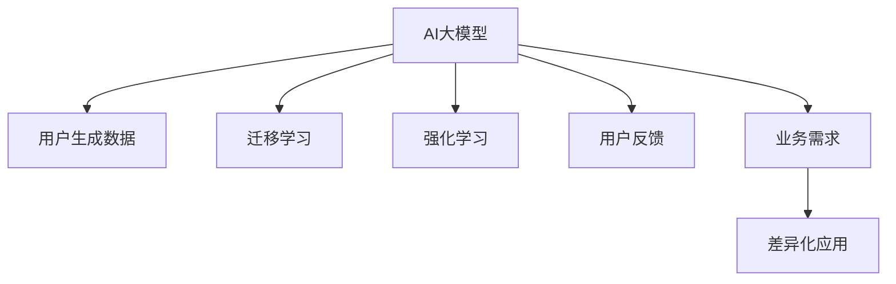

                 

## 1. 背景介绍

### 1.1 问题由来

近年来，随着人工智能(AI)技术的快速发展，尤其是深度学习和大模型在多个领域的突破，AI大模型已经成为推动企业技术创新和业务升级的重要力量。许多初创公司凭借优质的AI大模型，在市场竞争中脱颖而出，吸引了大量的投资和关注。然而，成功应用AI大模型并取得市场领先并非易事。本文将深入探讨如何利用用户优势，加速AI大模型的创业进程，并构建具有核心竞争力的AI产品。

### 1.2 问题核心关键点

在AI大模型的创业过程中，用户优势的利用是至关重要的。这不仅决定了产品的市场竞争力，更关系到模型的训练数据质量、算法优化方向以及产品的迭代更新速度。本文将从以下几个方面展开：

- **数据优势**：如何通过用户生成数据（User Generated Content, UGC）增强模型的泛化能力。
- **算法优势**：如何利用用户行为数据优化模型参数和算法结构。
- **应用优势**：如何将用户反馈和业务需求有机结合，驱动模型的不断优化和迭代。
- **市场优势**：如何基于用户需求差异化，构建差异化的AI产品和解决方案。

## 2. 核心概念与联系

### 2.1 核心概念概述

为了更好地理解如何利用用户优势进行AI大模型的创业，本节将介绍几个密切相关的核心概念：

- **AI大模型**：指通过深度学习算法训练得到的庞大参数模型，能够在复杂的自然语言处理任务中取得卓越表现。如GPT、BERT、T5等。
- **用户生成数据(UGI)**：指用户主动生成的文本、图片、视频等数据，这些数据往往具有较强的代表性和多样性。
- **迁移学习**：指利用已有模型在大规模数据上训练得到的结果，在新任务上进一步微调学习，以提升模型性能。
- **强化学习**：指通过用户行为数据，不断优化模型参数，使其在实际应用中表现更加优异。
- **用户反馈**：指用户对AI产品使用过程中的评价和建议，对于模型的改进和迭代具有重要指导意义。
- **业务需求**：指用户希望AI产品能够解决的具体问题和满足的需求，决定了AI产品的市场定位和应用场景。

这些概念之间的逻辑关系可以通过以下Mermaid流程图来展示：



这个流程图展示了大模型、用户数据、迁移学习、强化学习、用户反馈和业务需求之间的逻辑联系，以及如何将用户优势转化为AI产品的竞争力。

## 3. 核心算法原理 & 具体操作步骤

### 3.1 算法原理概述

利用用户优势进行AI大模型的创业，其核心思想是通过收集和分析用户的生成数据、行为数据、反馈信息等，以进一步优化模型的训练过程，提高模型的性能和泛化能力。这可以分为数据驱动、行为驱动、反馈驱动和业务驱动四个主要方面。

1. **数据驱动**：利用用户生成数据进行迁移学习，提升模型在大规模语料上的泛化能力。
2. **行为驱动**：通过分析用户行为数据，进行强化学习，不断优化模型参数，提升模型在实际应用中的表现。
3. **反馈驱动**：基于用户反馈信息，及时调整模型参数和优化方向，快速迭代和改进模型。
4. **业务驱动**：根据用户需求和业务场景，设计差异化的AI产品和解决方案，满足特定场景下的需求。

### 3.2 算法步骤详解

以下将详细介绍如何利用用户优势进行AI大模型的创业。

#### 3.2.1 数据驱动

数据驱动是利用用户生成数据进行迁移学习的主要方式。具体步骤如下：

1. **数据收集**：从用户侧收集文本、图片、视频等UGC数据，确保数据的多样性和代表性。
2. **数据预处理**：对收集到的数据进行清洗、标注和格式转换，使其符合模型的输入要求。
3. **迁移学习**：利用预训练的大模型进行微调，使其在特定任务上表现更优。
4. **性能评估**：在验证集上评估模型性能，根据评估结果进行进一步的微调和优化。

#### 3.2.2 行为驱动

行为驱动是通过用户行为数据进行强化学习，提升模型表现的过程。具体步骤如下：

1. **行为数据采集**：通过日志、点击流、搜索记录等方式，收集用户的行为数据。
2. **行为数据分析**：对行为数据进行统计和分析，挖掘用户的行为规律和偏好。
3. **模型训练**：利用行为数据进行强化学习，不断优化模型参数和算法结构。
4. **应用测试**：在实际应用中测试模型性能，根据测试结果进一步调整模型。

#### 3.2.3 反馈驱动

反馈驱动是利用用户反馈信息进行模型迭代和改进的过程。具体步骤如下：

1. **用户反馈收集**：通过问卷调查、用户体验报告等方式，收集用户对产品的评价和建议。
2. **反馈数据分析**：对用户反馈进行分析和分类，找出模型的短板和改进方向。
3. **模型调整**：根据反馈信息调整模型参数和优化方向，提升模型表现。
4. **反馈闭环**：将改进后的模型应用到实际产品中，再次收集用户反馈，形成反馈闭环。

#### 3.2.4 业务驱动

业务驱动是根据用户需求和业务场景，设计差异化AI产品和解决方案的过程。具体步骤如下：

1. **需求分析**：通过市场调研和用户访谈，了解用户需求和业务场景。
2. **产品设计**：根据需求分析结果，设计符合用户需求的产品功能和特性。
3. **模型开发**：利用已有的模型框架和数据，开发符合产品需求的新模型。
4. **产品验证**：将开发后的模型应用到产品中，进行功能和性能测试。

### 3.3 算法优缺点

利用用户优势进行AI大模型的创业，有以下优点：

1. **数据优势**：利用用户生成数据进行迁移学习，能够大幅提升模型的泛化能力。
2. **行为优势**：通过行为数据进行强化学习，使模型更加贴合实际应用场景。
3. **反馈优势**：基于用户反馈进行模型迭代，确保模型的不断优化和改进。
4. **业务优势**：根据用户需求设计差异化产品，满足特定业务场景下的需求。

同时，这种范式也存在一些局限：

1. **数据隐私问题**：用户数据的收集和使用需要遵守数据隐私法规，避免数据泄露和滥用。
2. **用户多样性**：用户群体可能存在多样性，不同用户的数据可能带来不同的效果和偏差。
3. **数据质量问题**：用户数据可能存在噪声和错误，需要进行严格的清洗和处理。
4. **算法复杂度**：基于用户数据进行模型优化，可能涉及复杂的算法和模型结构设计。

### 3.4 算法应用领域

利用用户优势进行AI大模型的创业，已经在多个领域得到了广泛应用，包括但不限于：

- **智能客服**：通过用户对话数据，优化智能客服模型的回答策略和逻辑，提升客服体验和响应效率。
- **推荐系统**：根据用户行为数据和反馈，优化推荐模型的推荐策略，提升推荐的个性化和精准度。
- **金融风控**：利用用户交易行为数据，进行异常检测和风险预警，降低金融风险。
- **健康医疗**：通过用户健康数据和反馈，优化医疗模型的诊断和建议，提升医疗服务的质量和效率。
- **电商广告**：根据用户浏览和购买行为数据，优化广告投放策略和算法，提升广告效果和转化率。
- **智能制造**：利用工业物联网设备生成数据，优化生产计划和调度，提高生产效率和质量。

## 4. 数学模型和公式 & 详细讲解 & 举例说明

### 4.1 数学模型构建

为了更好地理解利用用户优势进行AI大模型创业的数学原理，本节将详细讲解相关的数学模型和公式。

假设我们有一个通用的AI大模型 $M$，其参数为 $\theta$。利用用户生成数据 $D_U$ 和用户行为数据 $D_B$ 进行迁移学习和强化学习，其数学模型可以表示为：

$$
M_{\theta} = \text{Softmax}(\text{MLP}(\text{Embedding}(\text{U2I}(D_U)), \text{U2I}(D_B)))
$$

其中：
- $\text{MLP}$ 表示多层次感知器，用于特征提取和计算。
- $\text{Embedding}$ 表示嵌入层，将数据映射到高维向量空间。
- $\text{U2I}$ 表示用户生成数据和行为数据的转换函数，将用户数据转换为模型的输入。
- $\text{Softmax}$ 表示输出层，将特征向量映射到概率分布，用于分类或回归任务。

### 4.2 公式推导过程

以下是利用用户优势进行AI大模型创业的公式推导过程。

#### 4.2.1 数据驱动

假设我们有一个预训练的大模型 $M$，其参数为 $\theta$。利用用户生成数据 $D_U$ 进行迁移学习，其公式可以表示为：

$$
\theta = \text{Softmax}(\text{MLP}(\text{Embedding}(\text{U2I}(D_U))))
$$

其中，$\text{Embedding}(\text{U2I}(D_U))$ 表示将用户生成数据 $D_U$ 通过用户生成数据转换函数 $\text{U2I}$ 转换为模型的输入，再经过嵌入层 $\text{Embedding}$ 映射到高维向量空间。然后，将嵌入后的向量通过多层次感知器 $\text{MLP}$ 进行特征提取和计算，最终通过输出层 $\text{Softmax}$ 得到模型参数 $\theta$。

#### 4.2.2 行为驱动

假设我们有一个预训练的大模型 $M$，其参数为 $\theta$。利用用户行为数据 $D_B$ 进行强化学习，其公式可以表示为：

$$
\theta = \text{Softmax}(\text{MLP}(\text{Embedding}(\text{U2I}(D_B))))
$$

其中，$\text{Embedding}(\text{U2I}(D_B))$ 表示将用户行为数据 $D_B$ 通过用户行为数据转换函数 $\text{U2I}$ 转换为模型的输入，再经过嵌入层 $\text{Embedding}$ 映射到高维向量空间。然后，将嵌入后的向量通过多层次感知器 $\text{MLP}$ 进行特征提取和计算，最终通过输出层 $\text{Softmax}$ 得到模型参数 $\theta$。

#### 4.2.3 反馈驱动

假设我们有一个预训练的大模型 $M$，其参数为 $\theta$。利用用户反馈 $D_F$ 进行模型调整，其公式可以表示为：

$$
\theta = \text{Softmax}(\text{MLP}(\text{Embedding}(\text{F2I}(D_F))))
$$

其中，$\text{Embedding}(\text{F2I}(D_F))$ 表示将用户反馈 $D_F$ 通过用户反馈转换函数 $\text{F2I}$ 转换为模型的输入，再经过嵌入层 $\text{Embedding}$ 映射到高维向量空间。然后，将嵌入后的向量通过多层次感知器 $\text{MLP}$ 进行特征提取和计算，最终通过输出层 $\text{Softmax}$ 得到模型参数 $\theta$。

#### 4.2.4 业务驱动

假设我们有一个预训练的大模型 $M$，其参数为 $\theta$。根据业务需求 $D_B$ 进行模型设计和优化，其公式可以表示为：

$$
\theta = \text{Softmax}(\text{MLP}(\text{Embedding}(\text{B2I}(D_B))))
$$

其中，$\text{Embedding}(\text{B2I}(D_B))$ 表示将业务需求 $D_B$ 通过业务需求转换函数 $\text{B2I}$ 转换为模型的输入，再经过嵌入层 $\text{Embedding}$ 映射到高维向量空间。然后，将嵌入后的向量通过多层次感知器 $\text{MLP}$ 进行特征提取和计算，最终通过输出层 $\text{Softmax}$ 得到模型参数 $\theta$。

### 4.3 案例分析与讲解

为了更好地理解利用用户优势进行AI大模型创业的具体应用，本节将通过两个具体案例进行讲解。

#### 4.3.1 智能客服系统

假设我们开发了一个智能客服系统，用于处理用户咨询和问题解答。在实际使用过程中，我们收集了大量用户对话数据 $D_U$，利用这些数据进行迁移学习，优化模型参数。具体步骤如下：

1. **数据收集**：从客服系统日志中提取用户对话数据 $D_U$。
2. **数据预处理**：对收集到的对话数据进行清洗、标注和格式转换，确保数据的多样性和代表性。
3. **迁移学习**：利用预训练的大模型进行微调，提升模型在特定任务上表现更优。
4. **性能评估**：在验证集上评估模型性能，根据评估结果进行进一步的微调和优化。

通过这种方式，智能客服系统可以更好地理解用户意图，提供更准确、快速的回答，提升用户满意度。

#### 4.3.2 推荐系统

假设我们开发了一个个性化推荐系统，用于向用户推荐商品和内容。在实际使用过程中，我们收集了大量用户行为数据 $D_B$，利用这些数据进行强化学习，优化推荐模型。具体步骤如下：

1. **数据收集**：从电商平台或内容平台收集用户浏览、点击、购买等行为数据 $D_B$。
2. **数据预处理**：对收集到的行为数据进行清洗、标注和格式转换，确保数据的多样性和代表性。
3. **强化学习**：利用行为数据进行强化学习，不断优化推荐模型参数和算法结构。
4. **应用测试**：在实际应用中测试推荐模型性能，根据测试结果进一步调整模型。

通过这种方式，推荐系统可以更好地理解用户偏好和需求，提供更个性化、精准的推荐，提升用户满意度和转化率。

## 5. 项目实践：代码实例和详细解释说明

### 5.1 开发环境搭建

在进行项目实践前，我们需要准备好开发环境。以下是使用Python进行PyTorch开发的环境配置流程：

1. 安装Anaconda：从官网下载并安装Anaconda，用于创建独立的Python环境。

2. 创建并激活虚拟环境：
```bash
conda create -n pytorch-env python=3.8 
conda activate pytorch-env
```

3. 安装PyTorch：根据CUDA版本，从官网获取对应的安装命令。例如：
```bash
conda install pytorch torchvision torchaudio cudatoolkit=11.1 -c pytorch -c conda-forge
```

4. 安装Transformers库：
```bash
pip install transformers
```

5. 安装各类工具包：
```bash
pip install numpy pandas scikit-learn matplotlib tqdm jupyter notebook ipython
```

完成上述步骤后，即可在`pytorch-env`环境中开始项目实践。

### 5.2 源代码详细实现

这里我们以智能客服系统为例，给出使用Transformers库对BERT模型进行微调的PyTorch代码实现。

首先，定义智能客服系统的数据处理函数：

```python
from transformers import BertTokenizer
from torch.utils.data import Dataset
import torch

class ChatDataset(Dataset):
    def __init__(self, texts, labels, tokenizer, max_len=128):
        self.texts = texts
        self.labels = labels
        self.tokenizer = tokenizer
        self.max_len = max_len
        
    def __len__(self):
        return len(self.texts)
    
    def __getitem__(self, item):
        text = self.texts[item]
        label = self.labels[item]
        
        encoding = self.tokenizer(text, return_tensors='pt', max_length=self.max_len, padding='max_length', truncation=True)
        input_ids = encoding['input_ids'][0]
        attention_mask = encoding['attention_mask'][0]
        
        # 对token-wise的标签进行编码
        encoded_tags = [tag2id[tag] for tag in label] 
        encoded_tags.extend([tag2id['O']] * (self.max_len - len(encoded_tags)))
        labels = torch.tensor(encoded_tags, dtype=torch.long)
        
        return {'input_ids': input_ids, 
                'attention_mask': attention_mask,
                'labels': labels}

# 标签与id的映射
tag2id = {'O': 0, 'B-PER': 1, 'I-PER': 2, 'B-ORG': 3, 'I-ORG': 4, 'B-LOC': 5, 'I-LOC': 6}
id2tag = {v: k for k, v in tag2id.items()}

# 创建dataset
tokenizer = BertTokenizer.from_pretrained('bert-base-cased')

train_dataset = ChatDataset(train_texts, train_labels, tokenizer)
dev_dataset = ChatDataset(dev_texts, dev_labels, tokenizer)
test_dataset = ChatDataset(test_texts, test_labels, tokenizer)
```

然后，定义模型和优化器：

```python
from transformers import BertForTokenClassification, AdamW

model = BertForTokenClassification.from_pretrained('bert-base-cased', num_labels=len(tag2id))

optimizer = AdamW(model.parameters(), lr=2e-5)
```

接着，定义训练和评估函数：

```python
from torch.utils.data import DataLoader
from tqdm import tqdm
from sklearn.metrics import classification_report

device = torch.device('cuda') if torch.cuda.is_available() else torch.device('cpu')
model.to(device)

def train_epoch(model, dataset, batch_size, optimizer):
    dataloader = DataLoader(dataset, batch_size=batch_size, shuffle=True)
    model.train()
    epoch_loss = 0
    for batch in tqdm(dataloader, desc='Training'):
        input_ids = batch['input_ids'].to(device)
        attention_mask = batch['attention_mask'].to(device)
        labels = batch['labels'].to(device)
        model.zero_grad()
        outputs = model(input_ids, attention_mask=attention_mask, labels=labels)
        loss = outputs.loss
        epoch_loss += loss.item()
        loss.backward()
        optimizer.step()
    return epoch_loss / len(dataloader)

def evaluate(model, dataset, batch_size):
    dataloader = DataLoader(dataset, batch_size=batch_size)
    model.eval()
    preds, labels = [], []
    with torch.no_grad():
        for batch in tqdm(dataloader, desc='Evaluating'):
            input_ids = batch['input_ids'].to(device)
            attention_mask = batch['attention_mask'].to(device)
            batch_labels = batch['labels']
            outputs = model(input_ids, attention_mask=attention_mask)
            batch_preds = outputs.logits.argmax(dim=2).to('cpu').tolist()
            batch_labels = batch_labels.to('cpu').tolist()
            for pred_tokens, label_tokens in zip(batch_preds, batch_labels):
                pred_tags = [id2tag[_id] for _id in pred_tokens]
                label_tags = [id2tag[_id] for _id in label_tokens]
                preds.append(pred_tags[:len(label_tags)])
                labels.append(label_tags)
                
    print(classification_report(labels, preds))
```

最后，启动训练流程并在测试集上评估：

```python
epochs = 5
batch_size = 16

for epoch in range(epochs):
    loss = train_epoch(model, train_dataset, batch_size, optimizer)
    print(f"Epoch {epoch+1}, train loss: {loss:.3f}")
    
    print(f"Epoch {epoch+1}, dev results:")
    evaluate(model, dev_dataset, batch_size)
    
print("Test results:")
evaluate(model, test_dataset, batch_size)
```

以上就是使用PyTorch对BERT进行智能客服系统微调的完整代码实现。可以看到，得益于Transformers库的强大封装，我们可以用相对简洁的代码完成BERT模型的加载和微调。

### 5.3 代码解读与分析

让我们再详细解读一下关键代码的实现细节：

**ChatDataset类**：
- `__init__`方法：初始化文本、标签、分词器等关键组件。
- `__len__`方法：返回数据集的样本数量。
- `__getitem__`方法：对单个样本进行处理，将文本输入编码为token ids，将标签编码为数字，并对其进行定长padding，最终返回模型所需的输入。

**tag2id和id2tag字典**：
- 定义了标签与数字id之间的映射关系，用于将token-wise的预测结果解码回真实的标签。

**训练和评估函数**：
- 使用PyTorch的DataLoader对数据集进行批次化加载，供模型训练和推理使用。
- 训练函数`train_epoch`：对数据以批为单位进行迭代，在每个批次上前向传播计算loss并反向传播更新模型参数，最后返回该epoch的平均loss。
- 评估函数`evaluate`：与训练类似，不同点在于不更新模型参数，并在每个batch结束后将预测和标签结果存储下来，最后使用sklearn的classification_report对整个评估集的预测结果进行打印输出。

**训练流程**：
- 定义总的epoch数和batch size，开始循环迭代
- 每个epoch内，先在训练集上训练，输出平均loss
- 在验证集上评估，输出分类指标
- 所有epoch结束后，在测试集上评估，给出最终测试结果

可以看到，PyTorch配合Transformers库使得BERT微调的代码实现变得简洁高效。开发者可以将更多精力放在数据处理、模型改进等高层逻辑上，而不必过多关注底层的实现细节。

当然，工业级的系统实现还需考虑更多因素，如模型的保存和部署、超参数的自动搜索、更灵活的任务适配层等。但核心的微调范式基本与此类似。

## 6. 实际应用场景

### 6.1 智能客服系统

基于大语言模型微调的对话技术，可以广泛应用于智能客服系统的构建。传统客服往往需要配备大量人力，高峰期响应缓慢，且一致性和专业性难以保证。而使用微调后的对话模型，可以7x24小时不间断服务，快速响应客户咨询，用自然流畅的语言解答各类常见问题。

在技术实现上，可以收集企业内部的历史客服对话记录，将问题和最佳答复构建成监督数据，在此基础上对预训练对话模型进行微调。微调后的对话模型能够自动理解用户意图，匹配最合适的答案模板进行回复。对于客户提出的新问题，还可以接入检索系统实时搜索相关内容，动态组织生成回答。如此构建的智能客服系统，能大幅提升客户咨询体验和问题解决效率。

### 6.2 金融舆情监测

金融机构需要实时监测市场舆论动向，以便及时应对负面信息传播，规避金融风险。传统的人工监测方式成本高、效率低，难以应对网络时代海量信息爆发的挑战。基于大语言模型微调的文本分类和情感分析技术，为金融舆情监测提供了新的解决方案。

具体而言，可以收集金融领域相关的新闻、报道、评论等文本数据，并对其进行主题标注和情感标注。在此基础上对预训练语言模型进行微调，使其能够自动判断文本属于何种主题，情感倾向是正面、中性还是负面。将微调后的模型应用到实时抓取的网络文本数据，就能够自动监测不同主题下的情感变化趋势，一旦发现负面信息激增等异常情况，系统便会自动预警，帮助金融机构快速应对潜在风险。

### 6.3 个性化推荐系统

当前的推荐系统往往只依赖用户的历史行为数据进行物品推荐，无法深入理解用户的真实兴趣偏好。基于大语言模型微调技术，个性化推荐系统可以更好地挖掘用户行为背后的语义信息，从而提供更精准、多样的推荐内容。

在实践中，可以收集用户浏览、点击、评论、分享等行为数据，提取和用户交互的物品标题、描述、标签等文本内容。将文本内容作为模型输入，用户的后续行为（如是否点击、购买等）作为监督信号，在此基础上微调预训练语言模型。微调后的模型能够从文本内容中准确把握用户的兴趣点。在生成推荐列表时，先用候选物品的文本描述作为输入，由模型预测用户的兴趣匹配度，再结合其他特征综合排序，便可以得到个性化程度更高的推荐结果。

### 6.4 未来应用展望

随着大语言模型和微调方法的不断发展，基于微调范式将在更多领域得到应用，为传统行业带来变革性影响。

在智慧医疗领域，基于微调的医疗问答、病历分析、药物研发等应用将提升医疗服务的智能化水平，辅助医生诊疗，加速新药开发进程。

在智能教育领域，微调技术可应用于作业批改、学情分析、知识推荐等方面，因材施教，促进教育公平，提高教学质量。

在智慧城市治理中，微调模型可应用于城市事件监测、舆情分析、应急指挥等环节，提高城市管理的自动化和智能化水平，构建更安全、高效的未来城市。

此外，在企业生产、社会治理、文娱传媒等众多领域，基于大模型微调的人工智能应用也将不断涌现，为经济社会发展注入新的动力。相信随着技术的日益成熟，微调方法将成为人工智能落地应用的重要范式，推动人工智能技术在垂直行业的规模化落地。

## 7. 工具和资源推荐

### 7.1 学习资源推荐

为了帮助开发者系统掌握大语言模型微调的理论基础和实践技巧，这里推荐一些优质的学习资源：

1. 《Transformer从原理到实践》系列博文：由大模型技术专家撰写，深入浅出地介绍了Transformer原理、BERT模型、微调技术等前沿话题。

2. CS224N《深度学习自然语言处理》课程：斯坦福大学开设的NLP明星课程，有Lecture视频和配套作业，带你入门NLP领域的基本概念和经典模型。

3. 《Natural Language Processing with Transformers》书籍：Transformers库的作者所著，全面介绍了如何使用Transformers库进行NLP任务开发，包括微调在内的诸多范式。

4. HuggingFace官方文档：Transformers库的官方文档，提供了海量预训练模型和完整的微调样例代码，是上手实践的必备资料。

5. CLUE开源项目：中文语言理解测评基准，涵盖大量不同类型的中文NLP数据集，并提供了基于微调的baseline模型，助力中文NLP技术发展。

通过对这些资源的学习实践，相信你一定能够快速掌握大语言模型微调的精髓，并用于解决实际的NLP问题。
###  7.2 开发工具推荐

高效的开发离不开优秀的工具支持。以下是几款用于大语言模型微调开发的常用工具：

1. PyTorch：基于Python的开源深度学习框架，灵活动态的计算图，适合快速迭代研究。大部分预训练语言模型都有PyTorch版本的实现。

2. TensorFlow：由Google主导开发的开源深度学习框架，生产部署方便，适合大规模工程应用。同样有丰富的预训练语言模型资源。

3. Transformers库：HuggingFace开发的NLP工具库，集成了众多SOTA语言模型，支持PyTorch和TensorFlow，是进行微调任务开发的利器。

4. Weights & Biases：模型训练的实验跟踪工具，可以记录和可视化模型训练过程中的各项指标，方便对比和调优。与主流深度学习框架无缝集成。

5. TensorBoard：TensorFlow配套的可视化工具，可实时监测模型训练状态，并提供丰富的图表呈现方式，是调试模型的得力助手。

6. Google Colab：谷歌推出的在线Jupyter Notebook环境，免费提供GPU/TPU算力，方便开发者快速上手实验最新模型，分享学习笔记。

合理利用这些工具，可以显著提升大语言模型微调任务的开发效率，加快创新迭代的步伐。

### 7.3 相关论文推荐

大语言模型和微调技术的发展源于学界的持续研究。以下是几篇奠基性的相关论文，推荐阅读：

1. Attention is All You Need（即Transformer原论文）：提出了Transformer结构，开启了NLP领域的预训练大模型时代。

2. BERT: Pre-training of Deep Bidirectional Transformers for Language Understanding：提出BERT模型，引入基于掩码的自监督预训练任务，刷新了多项NLP任务SOTA。

3. Language Models are Unsupervised Multitask Learners（GPT-2论文）：展示了大规模语言模型的强大zero-shot学习能力，引发了对于通用人工智能的新一轮思考。

4. Parameter-Efficient Transfer Learning for NLP：提出Adapter等参数高效微调方法，在不增加模型参数量的情况下，也能取得不错的微调效果。

5. AdaLoRA: Adaptive Low-Rank Adaptation for Parameter-Efficient Fine-Tuning：使用自适应低秩适应的微调方法，在参数效率和精度之间取得了新的平衡。

6. Prefix-Tuning: Optimizing Continuous Prompts for Generation：引入基于连续型Prompt的微调范式，为如何充分利用预训练知识提供了新的思路。

这些论文代表了大语言模型微调技术的发展脉络。通过学习这些前沿成果，可以帮助研究者把握学科前进方向，激发更多的创新灵感。

## 8. 总结：未来发展趋势与挑战

### 8.1 总结

本文对利用用户优势进行AI大模型创业的方法进行了全面系统的介绍。首先阐述了AI大模型和微调技术的研究背景和意义，明确了用户优势在微调过程中的重要作用。其次，从数据驱动、行为驱动、反馈驱动和业务驱动四个方面，详细讲解了如何利用用户优势进行AI大模型的微调和优化。最后，通过具体案例分析，展示了利用用户优势进行AI大模型创业的实际应用和市场前景。

通过本文的系统梳理，可以看到，利用用户优势进行AI大模型的创业不仅能够显著提升模型性能和应用效果，还能形成独特的竞争优势。未来，随着技术不断成熟和应用场景的不断拓展，AI大模型的创业将更具想象力和发展潜力。

### 8.2 未来发展趋势

展望未来，大语言模型利用用户优势进行微调和创业，将呈现以下几个发展趋势：

1. **数据规模持续增大**：用户生成数据和行为数据将越来越多地被用于模型微调，提升模型的泛化能力和精度。
2. **模型结构日益复杂**：基于用户优势的微调方法将推动模型结构的进一步优化，使模型更具有表达力和适应性。
3. **应用场景更加多样化**：AI大模型将在更多垂直行业得到应用，如智慧医疗、智能教育、金融风控等，形成更多具有行业特色的应用场景。
4. **技术创新层出不穷**：基于用户优势的微调方法将不断涌现，如模型裁剪、量化加速、微调优化等，提升模型的效率和性能。
5. **产品服务化趋势明显**：AI大模型将逐渐演变为标准化产品服务，集成化部署，降低用户的使用门槛和成本。

### 8.3 面临的挑战

尽管利用用户优势进行AI大模型的创业具有广阔的应用前景，但在实践中仍面临诸多挑战：

1. **数据隐私和安全**：用户数据的收集和使用需要遵守数据隐私法规，避免数据泄露和滥用。
2. **数据质量和多样性**：用户数据可能存在噪声和错误，需要进行严格的清洗和处理。
3. **模型复杂度**：基于用户优势的微调方法涉及复杂的算法和模型结构设计，需要较高的技术门槛。
4. **用户体验**：模型的实时反馈和调整需要与用户交互，可能会影响用户体验。

### 8.4 研究展望

面对利用用户优势进行AI大模型创业所面临的挑战，未来的研究需要在以下几个方面寻求新的突破：

1. **数据隐私保护技术**：开发更高效的数据隐私保护技术，如差分隐私、联邦学习等，确保用户数据的隐私和安全。
2. **数据质量提升方法**：研究数据清洗、标注和增强技术，提升数据质量和多样性，减少噪声和错误。
3. **模型结构和算法优化**：设计更简单、高效的模型结构和算法，降低技术门槛，提高模型的可解释性和可控性。
4. **用户互动优化**：研究用户反馈的实时处理和模型调整技术，提升用户体验，形成良性互动。

## 9. 附录：常见问题与解答

**Q1：利用用户优势进行AI大模型创业时，需要注意哪些数据隐私问题？**

A: 利用用户优势进行AI大模型创业时，需要注意以下数据隐私问题：

1. **数据收集**：收集用户数据时，需要明确告知用户数据用途，并取得用户同意。
2. **数据存储**：用户数据需要加密存储，防止数据泄露。
3. **数据共享**：用户数据不能随意共享，只能用于特定模型的训练和优化。
4. **数据删除**：用户有权要求删除其数据，确保数据可控。

需要严格遵守相关法律法规，如GDPR、CCPA等，确保用户数据的隐私和安全。

**Q2：用户优势对AI大模型微调的效果有哪些提升？**

A: 利用用户优势进行AI大模型微调，主要体现在以下几个方面：

1. **数据多样性**：用户生成数据和行为数据具有广泛的多样性，能够提升模型在特定任务上的泛化能力。
2. **用户偏好**：用户的行为和反馈数据能够指导模型参数优化，使模型更加贴合用户需求。
3. **实际应用**：利用用户优势进行微调，能够提升模型在实际应用中的表现，如智能客服、推荐系统等。

用户优势可以显著提升AI大模型的性能和用户体验，使其更加贴合实际应用场景。

**Q3：利用用户优势进行AI大模型创业时，如何平衡数据隐私和模型性能？**

A: 在利用用户优势进行AI大模型创业时，平衡数据隐私和模型性能是关键。以下是一些具体措施：

1. **数据匿名化**：对用户数据进行匿名化处理，去除敏感信息，确保数据隐私。
2. **差分隐私**：采用差分隐私技术，对模型训练数据进行扰动，确保模型性能不受影响。
3. **联邦学习**：采用联邦学习技术，在本地设备上训练模型，确保数据不离开本地，提高数据隐私。
4. **用户控制**：赋予用户数据控制权，允许用户选择是否参与模型训练，确保数据隐私。

通过以上措施，可以平衡数据隐私和模型性能，确保AI大模型在保护用户隐私的同时，能够取得优异的性能和应用效果。

**Q4：利用用户优势进行AI大模型创业时，需要注意哪些用户行为数据的收集和处理？**

A: 在利用用户优势进行AI大模型创业时，需要注意以下用户行为数据的收集和处理：

1. **数据质量**：确保用户行为数据的质量和完整性，避免噪声和错误。
2. **数据标注**：对用户行为数据进行标注，确保数据的多样性和代表性。
3. **数据采样**：采用随机采样技术，确保数据的多样性和泛化能力。
4. **数据安全**：确保用户行为数据的安全性，防止数据泄露和滥用。

需要严格遵守相关法律法规，如GDPR、CCPA等，确保用户数据的隐私和安全。

**Q5：如何利用用户优势进行AI大模型的微调？**

A: 利用用户优势进行AI大模型的微调，主要包括以下几个步骤：

1. **数据收集**：从用户侧收集文本、图片、视频等UGC数据，确保数据的多样性和代表性。
2. **数据预处理**：对收集到的数据进行清洗、标注和格式转换，确保数据的多样性和代表性。
3. **迁移学习**：利用预训练的大模型进行微调，提升模型在特定任务上表现更优。
4. **性能评估**：在验证集上评估模型性能，根据评估结果进行进一步的微调和优化。

利用用户优势进行AI大模型的微调，可以显著提升模型在特定任务上的表现，使其更加贴合用户需求和实际应用场景。

**Q6：如何通过用户优势进行AI大模型的持续学习和优化？**

A: 通过用户优势进行AI大模型的持续学习和优化，主要包括以下几个步骤：

1. **用户反馈收集**：通过问卷调查、用户体验报告等方式，收集用户对产品的评价和建议。
2. **反馈数据分析**：对用户反馈进行分析和分类，找出模型的短板和改进方向。
3. **模型调整**：根据反馈信息调整模型参数和优化方向，提升模型表现。
4. **反馈闭环**：将改进后的模型应用到实际产品中，再次收集用户反馈，形成反馈闭环。

通过用户反馈进行AI大模型的持续学习和优化，可以确保模型始终保持高性能和适应性，满足用户的不断变化的需求。

---

作者：禅与计算机程序设计艺术 / Zen and the Art of Computer Programming

