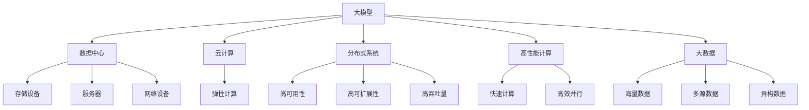

                 

# AI 大模型应用数据中心建设：数据中心产业发展

> 关键词：大模型应用,数据中心,人工智能,深度学习,机器学习,分布式系统,云计算,高性能计算,大数据,模型训练,模型推理

## 1. 背景介绍

### 1.1 问题由来
随着人工智能(AI)技术的快速发展，大模型在各个领域的应用日益广泛，包括自然语言处理(NLP)、计算机视觉(CV)、语音识别(Speech Recognition)、推荐系统(Recommendation Systems)等。这些大模型往往需要庞大的数据集进行训练，并在训练过程中依赖强大的计算资源，因此需要构建高效、可靠的数据中心来支持模型的训练和推理。然而，当前数据中心的建设和运维面临诸多挑战，如何优化数据中心的结构和资源配置，提升其效能和灵活性，成为急需解决的问题。

### 1.2 问题核心关键点
1. **数据中心的定义与功能**：数据中心是集中存放和处理数据的设施，包括硬件设施、网络设施、软件设施等，负责数据的存储、计算、管理和应用。数据中心是大模型训练和推理的基础，其效能直接影响模型的训练速度和推理效率。
2. **大模型的需求与挑战**：大模型需要巨量数据和强大计算资源，其训练和推理过程对数据中心的存储、计算、带宽和网络等方面提出了更高要求。如何在数据中心中部署和优化大模型，是当前技术发展的关键。
3. **云计算与分布式系统**：云计算和分布式系统技术为数据中心提供了弹性计算和存储资源，支持大规模、高并发的数据处理任务。如何利用这些技术优化数据中心，满足大模型的需求，是技术研究的重点。
4. **数据安全和隐私保护**：大模型训练和推理涉及大量敏感数据，数据安全和隐私保护是大模型应用的关键问题之一。如何在数据中心中实现数据的安全存储和传输，保障用户隐私，是数据中心建设的重要内容。
5. **成本控制与能效优化**：数据中心的建设和运维成本较高，能效问题也是一大挑战。如何在保证高性能的同时，优化数据中心的能源消耗，降低运营成本，是技术研究和管理的核心问题。

### 1.3 问题研究意义
研究大模型应用数据中心建设，对于提升AI大模型的训练和推理性能，保障数据安全和隐私，降低成本和能耗，推动AI技术在各行各业的落地应用，具有重要意义：

1. **提升模型效能**：通过优化数据中心的存储、计算和网络资源，加速大模型的训练和推理过程，提升模型的训练速度和推理效率。
2. **保障数据安全**：构建安全可靠的数据中心环境，实现数据的加密存储和传输，保护用户隐私和数据安全。
3. **降低成本**：通过云计算和分布式系统的技术应用，实现资源共享和高效利用，降低数据中心的建设和运维成本。
4. **优化能效**：通过技术创新和资源优化，提升数据中心的能源利用效率，降低能耗，实现绿色低碳的AI应用。
5. **推动产业应用**：通过建设高效、可靠的数据中心，支撑大模型的广泛应用，推动AI技术在金融、医疗、教育、制造等领域的发展和落地。

## 2. 核心概念与联系

### 2.1 核心概念概述

为更好地理解AI大模型应用数据中心的建设，本节将介绍几个关键概念及其之间的关系：

- **大模型(Large Models)**：指通过大规模数据集训练得到的深度神经网络模型，具有强大的学习能力，能够在特定领域内表现出色。常见的大模型包括BERT、GPT、T5等。
- **数据中心(Data Centers)**：指集中存放和处理数据的设施，包括服务器、存储设备、网络设备等。数据中心是支持大模型训练和推理的基础设施。
- **云计算(Cloud Computing)**：通过网络提供按需、弹性计算和存储资源，实现资源共享和高效利用。云计算为数据中心的建设和运维提供了灵活的技术手段。
- **分布式系统(Distributed Systems)**：由多个独立的计算机通过网络互联组成，能够实现高可用性、高可扩展性和高吞吐量的数据处理任务。分布式系统支持大模型的分布式训练和推理。
- **高性能计算(High-Performance Computing, HPC)**：指使用高性能计算机和大规模并行计算技术，实现快速、高效的数据处理任务。高性能计算是数据中心核心功能之一。
- **大数据(Big Data)**：指海量、多源、异构的数据集合，需要先进的存储、计算和分析技术来处理。大数据是大模型训练的基础数据源。

这些概念之间的关系可以通过以下Mermaid流程图来展示：



这个流程图展示了大模型、数据中心、云计算、分布式系统、高性能计算和大数据之间的关系：

1. 大模型通过云计算和分布式系统技术，利用数据中心的高性能计算能力，在存储海量大数据基础上进行训练和推理。
2. 数据中心由存储设备、服务器和网络设备组成，支持云计算和分布式系统的弹性计算、高可用性和高吞吐量。
3. 高性能计算是大模型训练和推理的加速手段，通过并行计算和快速计算提升模型效能。
4. 大数据是大模型训练的基础，需要先进的数据管理和分析技术来处理。

## 3. 核心算法原理 & 具体操作步骤

### 3.1 算法原理概述

AI大模型应用数据中心的建设，涉及大模型的训练和推理过程。本节将介绍大模型训练和推理的算法原理，以及如何通过数据中心优化其性能。

大模型训练和推理的基本流程包括：

- **数据准备**：收集和预处理训练数据和推理数据，确保数据质量和格式一致。
- **模型训练**：在数据中心中部署大模型，利用高性能计算资源进行模型训练，通过反向传播算法优化模型参数。
- **模型推理**：在推理服务器上部署训练好的大模型，接收输入数据，并返回推理结果。

### 3.2 算法步骤详解

大模型训练和推理的算法步骤包括：

1. **数据预处理**：对原始数据进行清洗、格式化和归一化处理，确保数据符合训练和推理的要求。
2. **模型训练**：在数据中心中部署大模型，利用GPU、TPU等高性能计算资源进行模型训练，通过反向传播算法优化模型参数。
3. **模型推理**：在推理服务器上部署训练好的大模型，接收输入数据，并返回推理结果。

具体步骤为：

- **数据预处理**：将原始数据转换为适合模型训练和推理的格式，包括数据增强、数据标准化、数据分割等步骤。
- **模型训练**：将预处理后的数据输入模型，利用反向传播算法计算损失函数，并通过优化算法更新模型参数。
- **模型推理**：将推理数据输入训练好的模型，计算模型输出，返回推理结果。

### 3.3 算法优缺点

大模型训练和推理的算法具有以下优点：

- **高效性**：通过使用高性能计算资源，加速模型训练和推理过程，提升模型的训练速度和推理效率。
- **灵活性**：利用云计算和分布式系统的技术，实现资源共享和弹性计算，满足不同规模和大模型需求。
- **可扩展性**：通过增加计算资源和存储资源，扩展数据中心的能力，支持更大规模的模型训练和推理任务。

同时，该算法也存在一些缺点：

- **资源消耗高**：大模型的训练和推理需要大量的计算资源和存储资源，数据中心的建设和运维成本较高。
- **能耗高**：高性能计算设备消耗大量的电能，数据中心的能耗问题需要特别关注。
- **数据安全风险**：数据中心集中存储大量敏感数据，数据安全和隐私保护是大模型应用的关键问题之一。
- **技术复杂性高**：大模型的训练和推理涉及复杂的技术栈，需要高水平的技术团队和基础设施支持。

### 3.4 算法应用领域

大模型训练和推理的算法广泛应用于以下几个领域：

- **自然语言处理(NLP)**：通过大模型训练和推理，实现文本分类、情感分析、机器翻译、问答系统等任务。
- **计算机视觉(CV)**：通过大模型训练和推理，实现图像识别、物体检测、图像生成等任务。
- **语音识别(Speech Recognition)**：通过大模型训练和推理，实现语音识别、语音合成等任务。
- **推荐系统(Recommendation Systems)**：通过大模型训练和推理，实现个性化推荐、用户行为分析等任务。
- **金融分析(Financial Analysis)**：通过大模型训练和推理，实现市场分析、风险评估等任务。
- **医疗诊断(Medical Diagnosis)**：通过大模型训练和推理，实现疾病预测、图像诊断等任务。
- **智能制造(Intelligent Manufacturing)**：通过大模型训练和推理，实现生产过程监控、设备维护等任务。

## 4. 数学模型和公式 & 详细讲解 & 举例说明

### 4.1 数学模型构建

大模型训练和推理的数学模型主要包括：

- **深度神经网络模型**：用于表示模型的结构和参数。
- **损失函数**：用于衡量模型输出和真实标签之间的差异。
- **优化算法**：用于更新模型参数，最小化损失函数。

以大模型的训练为例，基本的数学模型构建如下：

- **深度神经网络模型**：$\theta$ 表示模型的参数，$x$ 表示输入数据，$y$ 表示模型输出，$h(x;\theta)$ 表示模型计算过程。
- **损失函数**：$\mathcal{L}(\theta)$ 表示模型输出和真实标签之间的差异。
- **优化算法**：$\mathcal{G}(\theta)$ 表示优化算法，用于更新模型参数。

### 4.2 公式推导过程

大模型训练的优化算法通常使用随机梯度下降(SGD)或其变种，如Adam、Adagrad等。以Adam算法为例，其公式推导过程如下：

- **梯度计算**：$\Delta \theta = \frac{\partial \mathcal{L}(\theta)}{\partial \theta}$
- **动量项**：$m_t = \beta_1 m_{t-1} + (1 - \beta_1) \Delta \theta$
- **偏差校正项**：$\hat{m}_t = \frac{m_t}{1 - \beta_1^t}$
- **方差项**：$v_t = \beta_2 v_{t-1} + (1 - \beta_2) \Delta \theta^2$
- **偏差校正项**：$\hat{v}_t = \frac{v_t}{1 - \beta_2^t}$
- **参数更新**：$\theta_{t+1} = \theta_t - \eta \frac{\hat{m}_t}{\sqrt{\hat{v}_t} + \epsilon}$

其中，$\beta_1$ 和 $\beta_2$ 是Adam算法的动量系数和偏差系数，$\eta$ 是学习率，$\epsilon$ 是正则化项，通常设置为一个很小的数，如$10^{-7}$。

### 4.3 案例分析与讲解

以BERT模型的训练为例，BERT模型是一个预训练的深度神经网络模型，用于自然语言处理任务。BERT模型的训练过程包括两个步骤：预训练和微调。

- **预训练**：在大量无标签文本数据上，利用自监督学习任务对BERT模型进行预训练。常见的预训练任务包括语言模型任务和掩码语言模型任务。
- **微调**：在特定任务的数据集上，利用有标签数据对BERT模型进行微调，使其适应特定任务的需求。

BERT模型的微调过程如下：

- **输入准备**：将训练数据和测试数据进行预处理，包括分词、向量化等步骤。
- **模型选择**：选择适当的BERT模型作为微调的基础，如BERT-base或BERT-large。
- **任务适配层设计**：根据任务类型，设计合适的输出层和损失函数。
- **模型训练**：将训练数据输入模型，计算损失函数，利用Adam算法更新模型参数。
- **模型评估**：在测试数据上评估模型性能，根据评估结果调整超参数和模型结构。

## 5. 项目实践：代码实例和详细解释说明

### 5.1 开发环境搭建

在进行大模型应用数据中心的建设时，首先需要准备好开发环境。以下是使用Python进行PyTorch开发的环境配置流程：

1. 安装Anaconda：从官网下载并安装Anaconda，用于创建独立的Python环境。

2. 创建并激活虚拟环境：
```bash
conda create -n pytorch-env python=3.8 
conda activate pytorch-env
```

3. 安装PyTorch：根据CUDA版本，从官网获取对应的安装命令。例如：
```bash
conda install pytorch torchvision torchaudio cudatoolkit=11.1 -c pytorch -c conda-forge
```

4. 安装Transformers库：
```bash
pip install transformers
```

5. 安装各类工具包：
```bash
pip install numpy pandas scikit-learn matplotlib tqdm jupyter notebook ipython
```

完成上述步骤后，即可在`pytorch-env`环境中开始数据中心的建设实践。

### 5.2 源代码详细实现

这里我们以BERT模型的训练为例，给出使用Transformers库对BERT模型进行训练的PyTorch代码实现。

首先，定义训练数据和测试数据：

```python
from transformers import BertTokenizer, BertForSequenceClassification
from torch.utils.data import Dataset, DataLoader
import torch

class MyDataset(Dataset):
    def __init__(self, data, tokenizer, max_len=128):
        self.data = data
        self.tokenizer = tokenizer
        self.max_len = max_len
        
    def __len__(self):
        return len(self.data)
    
    def __getitem__(self, item):
        text = self.data[item][0]
        label = self.data[item][1]
        
        encoding = self.tokenizer(text, return_tensors='pt', max_length=self.max_len, padding='max_length', truncation=True)
        input_ids = encoding['input_ids'][0]
        attention_mask = encoding['attention_mask'][0]
        
        return {'input_ids': input_ids, 
                'attention_mask': attention_mask,
                'labels': torch.tensor(label, dtype=torch.long)}
```

然后，定义模型和优化器：

```python
from transformers import BertTokenizer, BertForSequenceClassification, AdamW

tokenizer = BertTokenizer.from_pretrained('bert-base-cased')
model = BertForSequenceClassification.from_pretrained('bert-base-cased', num_labels=2)
optimizer = AdamW(model.parameters(), lr=2e-5)
```

接着，定义训练和评估函数：

```python
from tqdm import tqdm

def train_epoch(model, dataloader, optimizer):
    model.train()
    epoch_loss = 0
    for batch in dataloader:
        input_ids = batch['input_ids'].to(device)
        attention_mask = batch['attention_mask'].to(device)
        labels = batch['labels'].to(device)
        model.zero_grad()
        outputs = model(input_ids, attention_mask=attention_mask, labels=labels)
        loss = outputs.loss
        epoch_loss += loss.item()
        loss.backward()
        optimizer.step()
    return epoch_loss / len(dataloader)

def evaluate(model, dataloader):
    model.eval()
    preds, labels = [], []
    with torch.no_grad():
        for batch in dataloader:
            input_ids = batch['input_ids'].to(device)
            attention_mask = batch['attention_mask'].to(device)
            labels = batch['labels'].to(device)
            outputs = model(input_ids, attention_mask=attention_mask)
            preds.append(outputs.logits.argmax(dim=1).to('cpu').tolist())
            labels.append(labels.to('cpu').tolist())
            
    return preds, labels
```

最后，启动训练流程并在测试集上评估：

```python
epochs = 5
batch_size = 16
device = torch.device('cuda') if torch.cuda.is_available() else torch.device('cpu')

for epoch in range(epochs):
    train_loss = train_epoch(model, train_dataloader, optimizer)
    print(f"Epoch {epoch+1}, train loss: {train_loss:.3f}")
    
    test_preds, test_labels = evaluate(model, test_dataloader)
    print(f"Epoch {epoch+1}, test results:")
    print(classification_report(test_labels, test_preds))
```

以上就是使用PyTorch对BERT模型进行训练的完整代码实现。可以看到，得益于Transformers库的强大封装，我们可以用相对简洁的代码完成BERT模型的训练。

### 5.3 代码解读与分析

让我们再详细解读一下关键代码的实现细节：

**MyDataset类**：
- `__init__`方法：初始化数据、分词器等关键组件。
- `__len__`方法：返回数据集的样本数量。
- `__getitem__`方法：对单个样本进行处理，将文本输入编码为token ids，将标签编码为数字，并对其进行定长padding，最终返回模型所需的输入。

**tokenizer和model的定义**：
- 使用预训练的BERT分词器，将原始文本转换为token ids。
- 加载预训练的BERT模型，并指定分类任务的标签数量。

**训练和评估函数**：
- 使用PyTorch的DataLoader对数据集进行批次化加载，供模型训练和推理使用。
- 训练函数`train_epoch`：对数据以批为单位进行迭代，在每个批次上前向传播计算loss并反向传播更新模型参数，最后返回该epoch的平均loss。
- 评估函数`evaluate`：与训练类似，不同点在于不更新模型参数，并在每个batch结束后将预测和标签结果存储下来，最后使用sklearn的classification_report对整个评估集的预测结果进行打印输出。

**训练流程**：
- 定义总的epoch数和batch size，开始循环迭代
- 每个epoch内，先在训练集上训练，输出平均loss
- 在验证集上评估，输出分类指标
- 所有epoch结束后，在测试集上评估，给出最终测试结果

可以看到，PyTorch配合Transformers库使得BERT模型的训练代码实现变得简洁高效。开发者可以将更多精力放在数据处理、模型改进等高层逻辑上，而不必过多关注底层的实现细节。

当然，工业级的系统实现还需考虑更多因素，如模型的保存和部署、超参数的自动搜索、更灵活的任务适配层等。但核心的训练流程基本与此类似。

## 6. 实际应用场景

### 6.1 智能客服系统

基于大模型应用数据中心的建设，智能客服系统可以广泛应用于企业的客户服务场景。传统的客服系统往往依赖人力，高峰期响应慢，且客服质量难以保证。而使用大模型应用数据中心支持的智能客服系统，可以7x24小时不间断服务，快速响应客户咨询，提升客服效率和质量。

在技术实现上，可以收集企业内部的历史客服对话记录，将问题和最佳答复构建成监督数据，在此基础上对大模型进行微调。微调后的客服模型能够自动理解用户意图，匹配最合适的答案模板进行回复。对于客户提出的新问题，还可以接入检索系统实时搜索相关内容，动态组织生成回答。如此构建的智能客服系统，能大幅提升客户咨询体验和问题解决效率。

### 6.2 金融舆情监测

金融机构需要实时监测市场舆论动向，以便及时应对负面信息传播，规避金融风险。传统的人工监测方式成本高、效率低，难以应对网络时代海量信息爆发的挑战。基于大模型应用数据中心支持的舆情监测系统，可以实时抓取和分析网络文本数据，自动判断文本属于何种主题，情感倾向是正面、中性还是负面。将监测系统接入到金融机构的舆情平台，能够实时预警负面信息激增等异常情况，帮助金融机构快速应对潜在风险。

### 6.3 个性化推荐系统

当前的推荐系统往往只依赖用户的历史行为数据进行物品推荐，无法深入理解用户的真实兴趣偏好。基于大模型应用数据中心的推荐系统，可以更好地挖掘用户行为背后的语义信息，从而提供更精准、多样的推荐内容。

在实践中，可以收集用户浏览、点击、评论、分享等行为数据，提取和用户交互的物品标题、描述、标签等文本内容。将文本内容作为模型输入，用户的后续行为（如是否点击、购买等）作为监督信号，在此基础上微调大模型。微调后的模型能够从文本内容中准确把握用户的兴趣点。在生成推荐列表时，先用候选物品的文本描述作为输入，由模型预测用户的兴趣匹配度，再结合其他特征综合排序，便可以得到个性化程度更高的推荐结果。

### 6.4 未来应用展望

随着大模型应用数据中心技术的不断发展，未来将有更多应用场景得到探索，为大模型应用提供新的可能：

- **医疗诊断**：基于大模型应用数据中心的医疗诊断系统，可以实时监测患者的健康数据，自动分析诊断结果，辅助医生进行疾病预测和治疗方案选择。
- **教育培训**：基于大模型应用数据中心的智能教育平台，可以个性化推荐学习内容和教学方案，提高学习效果。
- **智能制造**：基于大模型应用数据中心的智能制造系统，可以实时监控生产过程，预测设备故障，优化生产调度。
- **智慧城市**：基于大模型应用数据中心的智慧城市管理系统，可以实时监测城市运行数据，优化城市资源配置，提高城市管理效率。

此外，在大模型应用数据中心技术的推动下，AI技术将在更多领域得到应用，为经济社会发展注入新的动力。相信随着技术的日益成熟，大模型应用数据中心必将成为AI技术落地的重要基础设施，推动人工智能技术向更广阔的领域加速渗透。

## 7. 工具和资源推荐

### 7.1 学习资源推荐

为了帮助开发者系统掌握大模型应用数据中心的理论基础和实践技巧，这里推荐一些优质的学习资源：

1. **《深度学习入门》系列书籍**：由李宏毅教授编写，详细介绍了深度学习的基础知识和算法实现，适合初学者入门。
2. **CS231n《卷积神经网络》课程**：斯坦福大学开设的计算机视觉课程，讲解了卷积神经网络、图像分类等核心概念。
3. **《分布式系统》课程**：由清华大学的李冰老师主讲，讲解了分布式系统基础和经典算法。
4. **Google Cloud AI和ML Best Practices**：Google官方提供的AI和ML最佳实践指南，包括大模型训练和推理的最佳实践。
5. **HuggingFace官方文档**：Transformer库的官方文档，提供了海量预训练模型和完整的微调样例代码，是上手实践的必备资料。

通过对这些资源的学习实践，相信你一定能够快速掌握大模型应用数据中心的精髓，并用于解决实际的AI问题。

### 7.2 开发工具推荐

高效的开发离不开优秀的工具支持。以下是几款用于大模型应用数据中心开发的常用工具：

1. **PyTorch**：基于Python的开源深度学习框架，灵活动态的计算图，适合快速迭代研究。大部分预训练语言模型都有PyTorch版本的实现。
2. **TensorFlow**：由Google主导开发的开源深度学习框架，生产部署方便，适合大规模工程应用。同样有丰富的预训练语言模型资源。
3. **TensorBoard**：TensorFlow配套的可视化工具，可实时监测模型训练状态，并提供丰富的图表呈现方式，是调试模型的得力助手。
4. **Jupyter Notebook**：免费的交互式计算环境，支持多种编程语言和数据分析工具，适合数据探索和算法实验。
5. **Weights & Biases**：模型训练的实验跟踪工具，可以记录和可视化模型训练过程中的各项指标，方便对比和调优。与主流深度学习框架无缝集成。
6. **Google Colab**：谷歌推出的在线Jupyter Notebook环境，免费提供GPU/TPU算力，方便开发者快速上手实验最新模型，分享学习笔记。

合理利用这些工具，可以显著提升大模型应用数据中心的开发效率，加快创新迭代的步伐。

### 7.3 相关论文推荐

大模型应用数据中心技术的研究源于学界的持续研究。以下是几篇奠基性的相关论文，推荐阅读：

1. **分布式深度学习综述**：由Google Cloud AI团队撰写，详细介绍了分布式深度学习的基本原理和实践经验。
2. **TensorFlow分布式机器学习**：由Google Cloud AI团队撰写，讲解了TensorFlow分布式机器学习的基本原理和实现细节。
3. **GPU加速深度学习训练**：由NVIDIA和Google Cloud AI团队合作撰写，讲解了GPU加速深度学习训练的基本原理和实现细节。
4. **Hierarchical Attention Networks for Document Classification**：由斯坦福大学的Yoon Kim撰写，提出层次化注意力网络模型，实现了较高的文本分类效果。
5. **Attention Is All You Need**：由Google Brain团队的Ashish Vaswani等撰写，提出了Transformer模型，开启了大模型的预训练时代。

这些论文代表了大模型应用数据中心技术的发展脉络。通过学习这些前沿成果，可以帮助研究者把握学科前进方向，激发更多的创新灵感。

## 8. 总结：未来发展趋势与挑战

### 8.1 总结

本文对基于大模型应用的数据中心建设进行了全面系统的介绍。首先阐述了大模型和数据中心的定义与功能，明确了数据中心在支持大模型训练和推理中的重要作用。其次，从原理到实践，详细讲解了大模型训练和推理的算法原理和关键步骤，给出了大模型训练的完整代码实例。同时，本文还广泛探讨了数据中心在智能客服、金融舆情、个性化推荐等多个行业领域的应用前景，展示了数据中心技术的巨大潜力。此外，本文精选了数据中心的各类学习资源，力求为读者提供全方位的技术指引。

通过本文的系统梳理，可以看到，基于大模型的数据中心建设是推动AI技术落地的重要基础设施，其高效性、灵活性和可扩展性使其在大模型应用中扮演着关键角色。随着大模型技术的发展和数据中心技术的演进，大模型应用数据中心必将成为AI技术落地的重要支撑。未来，伴随技术的持续创新，大模型应用数据中心必将在更多的应用场景中发挥重要作用，推动AI技术的普及和发展。

### 8.2 未来发展趋势

展望未来，大模型应用数据中心将呈现以下几个发展趋势：

1. **云计算与边缘计算融合**：云计算和边缘计算技术的融合，将实现数据中心在云端和边缘的协同工作，提升数据中心的灵活性和响应速度。
2. **分布式系统的进一步发展**：分布式系统技术的进一步发展，将支持更大规模、更高并发的数据处理任务，满足大模型应用的需求。
3. **人工智能芯片的崛起**：人工智能芯片的崛起，如GPU、TPU等，将进一步提升数据中心的计算能力和能效，加速模型训练和推理过程。
4. **大数据和实时数据的融合**：大数据和实时数据的融合，将实现数据中心的智能分析和实时处理，支持动态数据驱动的应用场景。
5. **多模态数据的处理**：多模态数据的处理技术，如视觉、语音、文本的融合，将提升数据中心对复杂数据的处理能力，支持更多样化的应用场景。
6. **智能化运维和管理**：智能化运维和管理技术的应用，将提升数据中心的运营效率，降低运维成本，实现绿色低碳的数据中心建设。

这些趋势凸显了大模型应用数据中心的广阔前景。未来的数据中心技术将更加智能、高效和绿色，为大模型应用的广泛落地提供坚实的基础。

### 8.3 面临的挑战

尽管大模型应用数据中心技术已经取得了重要进展，但在迈向更加智能化、普适化应用的过程中，它仍面临诸多挑战：

1. **数据安全和隐私保护**：大模型训练和推理涉及大量敏感数据，数据安全和隐私保护是大模型应用的关键问题之一。如何在数据中心中部署和处理数据，确保数据的安全存储和传输，是技术研究和管理的核心问题。
2. **资源消耗高**：大模型的训练和推理需要大量的计算资源和存储资源，数据中心的建设和运维成本较高。如何在保证高性能的同时，优化数据中心的能源消耗，降低运营成本，是技术研究和管理的难点。
3. **技术复杂性高**：大模型的训练和推理涉及复杂的技术栈，需要高水平的技术团队和基础设施支持。如何在技术复杂性和系统稳定性之间找到平衡，是技术研究和管理的挑战。
4. **智能化运维和管理**：智能化运维和管理技术的引入，虽然提升了数据中心的运营效率，但也带来了新的技术挑战，如系统的自动化、故障诊断和修复等。
5. **多模态数据的处理**：多模态数据的处理技术，如视觉、语音、文本的融合，虽然提升了数据中心对复杂数据的处理能力，但也带来了新的技术挑战，如不同模态数据的格式转换和融合。

这些挑战凸显了大模型应用数据中心技术的复杂性和多样性。未来的研究需要在技术创新、资源优化和管理提升等方面做出更多的努力，才能实现大模型应用数据中心的高效、智能和普适化。

### 8.4 研究展望

面对大模型应用数据中心所面临的挑战，未来的研究需要在以下几个方面寻求新的突破：

1. **多模态数据融合技术**：研究多模态数据的融合方法，提升数据中心对复杂数据的处理能力，支持更多样化的应用场景。
2. **智能运维和管理技术**：研究智能化运维和管理技术，提升数据中心的运营效率，降低运维成本，实现绿色低碳的数据中心建设。
3. **分布式系统的优化**：研究分布式系统的优化方法，支持更大规模、更高并发的数据处理任务，满足大模型应用的需求。
4. **边缘计算与云计算的融合**：研究边缘计算与云计算的融合方法，提升数据中心的灵活性和响应速度，支持动态数据驱动的应用场景。
5. **人工智能芯片的优化**：研究人工智能芯片的优化方法，提升数据中心的计算能力和能效，加速模型训练和推理过程。
6. **数据安全和隐私保护**：研究数据安全和隐私保护技术，确保大模型应用数据中心的安全性和可靠性。

这些研究方向将推动大模型应用数据中心的进一步发展，为AI技术的广泛应用提供更加坚实的技术支撑。通过不断创新和优化，大模型应用数据中心必将在未来的AI技术发展中发挥更加重要的作用。

## 9. 附录：常见问题与解答

**Q1：大模型应用数据中心与传统数据中心有何不同？**

A: 大模型应用数据中心与传统数据中心相比，主要差异在于其支持的计算任务和硬件要求不同。大模型应用数据中心需要支持大规模深度学习模型的训练和推理，对计算资源和存储资源的需求更高，对硬件设备的计算能力和能效也有更高的要求。

**Q2：如何降低大模型应用数据中心的能耗？**

A: 降低大模型应用数据中心的能耗，可以从以下几个方面入手：
1. **使用高能效的硬件设备**：如GPU、TPU等高性能计算设备，这些设备在单位时间内可以处理更多的计算任务，从而减少能耗。
2. **优化算法和模型结构**：通过优化算法和模型结构，减少计算量和存储需求，降低能耗。
3. **采用混合精度训练**：将浮点模型转为定点模型，压缩存储空间，提高计算效率，降低能耗。
4. **优化资源配置**：根据任务的特性，合理配置计算资源和存储资源，避免资源浪费和能耗增加。

**Q3：如何保证大模型应用数据中心的安全性和可靠性？**

A: 保证大模型应用数据中心的安全性和可靠性，可以从以下几个方面入手：
1. **数据加密和传输安全**：对存储和传输的数据进行加密处理，保障数据的安全性。
2. **访问控制和身份认证**：采用严格的访问控制和身份认证机制，防止未经授权的访问。
3. **系统备份和故障恢复**：建立系统备份机制，定期进行数据和模型的备份，保证系统在故障时的快速恢复。
4. **安全监控和异常检测**：建立安全监控系统，实时监测系统的运行状态，及时发现异常情况，防止安全事件的发生。

**Q4：大模型应用数据中心在实际应用中面临哪些挑战？**

A: 大模型应用数据中心在实际应用中面临的挑战包括：
1. **数据安全和隐私保护**：大模型训练和推理涉及大量敏感数据，数据安全和隐私保护是大模型应用的关键问题之一。
2. **资源消耗高**：大模型的训练和推理需要大量的计算资源和存储资源，数据中心的建设和运维成本较高。
3. **技术复杂性高**：大模型的训练和推理涉及复杂的技术栈，需要高水平的技术团队和基础设施支持。
4. **智能化运维和管理**：智能化运维和管理技术的引入，虽然提升了数据中心的运营效率，但也带来了新的技术挑战，如系统的自动化、故障诊断和修复等。

通过这些问题的解答，可以看到大模型应用数据中心的建设虽然面临诸多挑战，但通过技术创新和管理优化，这些问题是可以逐步解决的。相信随着技术的不断进步和应用的不断深入，大模型应用数据中心必将在更多的领域发挥重要作用，推动AI技术的发展和普及。

---

作者：禅与计算机程序设计艺术 / Zen and the Art of Computer Programming

