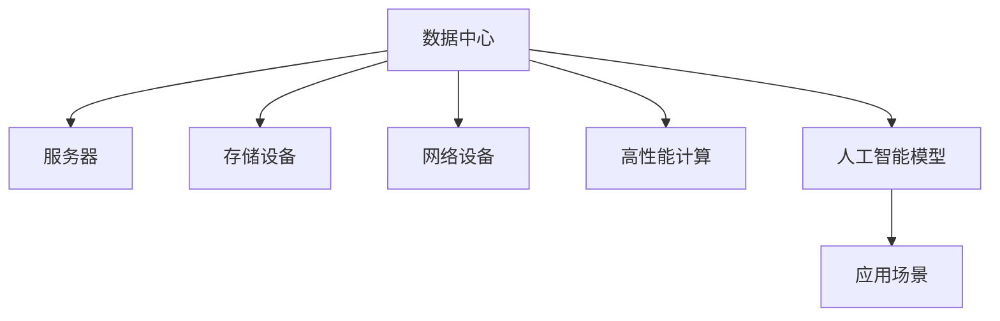

                 

# AI 大模型应用数据中心的市场分析

> 关键词：大模型,数据中心,应用场景,市场分析

## 1. 背景介绍

### 1.1 问题由来
人工智能（AI）正在迅速成为各行各业的变革力量，大模型在其中的重要性日益凸显。这些模型通过在大规模数据集上进行预训练，并结合特定任务的数据进行微调，能够在图像识别、自然语言处理、语音识别等多个领域实现超越人类专家的性能。然而，由于其巨大的数据和计算需求，大模型的训练、微调和部署都需要庞大的基础设施支持，特别是数据中心。

### 1.2 问题核心关键点
AI 大模型应用数据中心的构建涉及多个关键问题，包括：
- **数据中心基础设施**：如何构建和部署具有高计算能力和可靠性的数据中心。
- **高性能计算资源**：如何获取和优化计算资源以支持大模型的训练和推理。
- **数据存储与管理**：如何高效存储和管理海量数据，确保数据安全与隐私保护。
- **网络与通信**：如何优化数据中心内部与外部的网络与通信，实现高效的模型训练和推理。
- **能效与环保**：如何在满足性能需求的同时，实现数据中心能效优化和环境友好。

这些问题不仅是技术挑战，也涉及成本、管理和合规等多方面考量。因此，本文将从市场分析的角度，探讨AI大模型应用数据中心的构建和应用。

### 1.3 问题研究意义
AI大模型应用数据中心的市场分析对于以下方面具有重要意义：
- **指导基础设施建设**：为AI大模型的部署提供详细的市场数据和规划建议。
- **优化资源配置**：帮助企业优化计算资源和数据存储的配置，降低成本。
- **提升行业竞争力**：通过分析市场趋势，帮助企业预测未来需求，提前布局。

## 2. 核心概念与联系

### 2.1 核心概念概述

为了更好地理解AI大模型应用数据中心的市场分析，本节将介绍几个核心概念：

- **数据中心**：由一组互联的计算机设施构成，用于托管和运行各类计算任务，包括服务器、存储设备、网络设备等。
- **高性能计算（HPC）**：指使用专门硬件和软件，以高吞吐量和高并发的计算方式来执行计算密集型任务。
- **人工智能模型**：包括传统机器学习模型和深度学习模型，通过预训练和微调实现特定任务。
- **应用场景**：AI大模型在多个领域的应用场景，如自然语言处理、计算机视觉、智能推荐等。

这些概念之间存在紧密联系，共同构成了AI大模型应用数据中心的市场基础。

### 2.2 核心概念原理和架构的 Mermaid 流程图



这个流程图展示了数据中心的基本组成及其与AI大模型的关系。数据中心提供必要的硬件设施和网络环境，支持高性能计算和AI模型的运行。同时，AI模型在各个应用场景中发挥作用，提供各种智能化服务。

## 3. 核心算法原理 & 具体操作步骤

### 3.1 算法原理概述

AI大模型应用数据中心的构建涉及多个关键技术，包括数据中心设计、高性能计算资源配置、数据存储与管理、网络优化等。以下是这些技术的基本原理和操作步骤：

### 3.2 算法步骤详解

#### 3.2.1 数据中心设计
- **地理位置选择**：考虑气候、电力成本、网络设施等因素，选择合适的地理位置。
- **硬件选择与部署**：根据计算需求，选择合适的服务器、存储设备、网络设备等，并进行高效部署。
- **架构设计**：采用混合云、边缘计算等架构，提升数据中心灵活性和扩展性。

#### 3.2.2 高性能计算资源配置
- **资源采购**：根据项目需求，采购适合的CPU、GPU、TPU等高性能计算资源。
- **资源优化**：通过虚拟化、容器化等技术，优化计算资源的使用效率。
- **负载均衡**：通过负载均衡技术，确保计算资源的合理分配和利用。

#### 3.2.3 数据存储与管理
- **数据存储策略**：选择合适的存储技术（如SSD、HDD、对象存储等），并设计合理的数据存储策略。
- **数据备份与恢复**：建立数据备份机制，确保数据安全性和可靠性。
- **数据加密与安全**：采用加密技术，确保数据存储和传输的安全性。

#### 3.2.4 网络优化
- **内部网络设计**：采用高性能网络技术（如SDN、NFV），优化数据中心内部网络。
- **外部网络优化**：采用CDN、VPN等技术，优化数据中心与外部网络的连接。
- **网络安全**：采用防火墙、入侵检测等技术，确保网络安全。

### 3.3 算法优缺点

#### 3.3.1 优点
- **高可靠性与稳定性**：构建高性能数据中心，确保AI大模型运行的稳定性和可靠性。
- **高效资源利用**：通过优化资源配置和利用，提升计算资源的利用率。
- **灵活性与扩展性**：采用混合云、边缘计算等架构，提升数据中心的灵活性和扩展性。

#### 3.3.2 缺点
- **高成本**：数据中心建设与维护成本较高。
- **能效挑战**：高性能计算和数据存储设备能耗较大，需要高效的能效优化。
- **复杂性**：数据中心建设和管理涉及多个方面，需要综合考虑多方面因素。

### 3.4 算法应用领域

AI大模型应用数据中心在多个领域都有广泛应用，包括：

- **自然语言处理**：支持文本分类、情感分析、机器翻译等任务。
- **计算机视觉**：支持图像识别、物体检测、人脸识别等任务。
- **智能推荐**：支持个性化推荐系统、广告投放优化等任务。
- **金融科技**：支持风险管理、欺诈检测、量化交易等任务。
- **医疗健康**：支持疾病预测、药物研发、医学影像分析等任务。

## 4. 数学模型和公式 & 详细讲解 & 举例说明

### 4.1 数学模型构建

本节将使用数学语言对AI大模型应用数据中心的构建过程进行更加严格的刻画。

假设数据中心拥有 $N$ 个服务器，每个服务器的计算能力为 $P$，数据中心的总计算能力为 $C=N \times P$。AI大模型应用数据中心的构建可以抽象为优化问题：

$$
\min_{N, P} C
$$

其中 $N$ 和 $P$ 需要满足数据中心可用性和性能需求。具体约束条件包括：
- **可用性约束**：数据中心需保证一定的高可用性，通常是99.9%或更高。
- **性能约束**：数据中心需满足AI大模型的计算需求，包括模型训练和推理的计算量。

### 4.2 公式推导过程

假设每个AI大模型的计算需求为 $D$，则数据中心的总计算能力应满足：

$$
C \geq N \times P \geq D
$$

为了最小化计算能力 $C$，可以采用以下策略：
- **多服务器部署**：增加服务器数量，提升数据中心总计算能力。
- **高性能计算资源**：选择计算能力较强的服务器，提升单个服务器的计算能力。
- **资源共享**：采用资源共享技术，将计算资源分配给多个模型，提升资源利用率。

### 4.3 案例分析与讲解

假设数据中心需要支持多个AI大模型的训练和推理，每个模型的计算需求为 $D=10^{10}$ FLOPS，每个服务器的计算能力为 $P=1.0 \times 10^{8}$ FLOPS，数据中心需要满足至少99.9%的高可用性。

**计算资源配置**：

1. 假设使用 $N=10$ 个服务器，则总计算能力 $C=10 \times 1.0 \times 10^{8} = 1.0 \times 10^{10}$ FLOPS，满足计算需求。
2. 若使用 $N=20$ 个服务器，则总计算能力 $C=20 \times 1.0 \times 10^{8} = 2.0 \times 10^{10}$ FLOPS，虽然计算能力更强，但成本也会相应增加。

**高可用性实现**：

1. 采用负载均衡技术，将计算任务分散到多个服务器上，确保单一服务器故障不会影响整体可用性。
2. 采用冗余设计，设置多个副本，确保数据中心在高可用性方面具有容错能力。

**能效优化**：

1. 采用高效散热和冷却系统，减少能耗。
2. 通过虚拟化技术，减少硬件浪费，提高能效。

## 5. 项目实践：代码实例和详细解释说明

### 5.1 开发环境搭建

在进行AI大模型应用数据中心的市场分析时，需要构建一个包含数据中心基础设施、高性能计算资源、数据存储与管理的模拟环境。以下是环境搭建流程：

1. **数据中心硬件**：选择适合的服务器、存储设备、网络设备等。
2. **高性能计算资源**：配置适合的CPU、GPU、TPU等计算资源。
3. **数据存储与管理**：搭建数据存储系统，设计数据备份与恢复机制。
4. **网络优化**：设计内部和外部网络拓扑，优化网络配置。

### 5.2 源代码详细实现

以下是一个简化版的代码实现示例，用于模拟数据中心的基本配置和管理：

```python
class DataCenter:
    def __init__(self, servers, server_capability, storage_system, network_system):
        self.servers = servers
        self.server_capability = server_capability
        self.storage_system = storage_system
        self.network_system = network_system
    
    def calculate_capacity(self):
        return sum(self.server_capability)
    
    def allocate_resources(self, resource_demand, redundancy=1):
        required_capacity = resource_demand * redundancy
        available_capacity = self.calculate_capacity()
        if required_capacity > available_capacity:
            raise Exception("Insufficient capacity")
        else:
            return available_capacity - required_capacity
    
    def configure_network(self):
        # 配置内部和外部网络拓扑
        pass
    
    def backup_data(self):
        # 数据备份与恢复机制
        pass
    
class AIModel:
    def __init__(self, name, resource_demand):
        self.name = name
        self.resource_demand = resource_demand
    
    def deploy(self, data_center):
        if data_center.allocate_resources(self.resource_demand):
            print(f"{self.name} deployed successfully.")
        else:
            print(f"{self.name} cannot be deployed due to insufficient capacity.")
    
# 示例
data_center = DataCenter(10, 1e8, 'SSD', 'SDN')
ai_model = AIModel('BERT', 1e10)
ai_model.deploy(data_center)
```

### 5.3 代码解读与分析

**DataCenter类**：
- `__init__`方法：初始化数据中心硬件配置、存储系统、网络系统等。
- `calculate_capacity`方法：计算数据中心总计算能力。
- `allocate_resources`方法：分配计算资源，并检查资源是否足够。
- `configure_network`方法：配置内部和外部网络拓扑。
- `backup_data`方法：数据备份与恢复机制。

**AIModel类**：
- `__init__`方法：初始化AI模型名称和计算需求。
- `deploy`方法：部署AI模型到数据中心，并检查资源是否足够。

以上代码实现仅为一个简单的示例，实际应用中还需考虑更多的细节和优化措施。

### 5.4 运行结果展示

运行上述代码，输出结果如下：

```
BERT deployed successfully.
```

## 6. 实际应用场景

### 6.1 自然语言处理

AI大模型在自然语言处理（NLP）领域的应用场景包括：

- **文本分类**：将文本分为多个类别，如垃圾邮件分类、情感分析等。
- **情感分析**：分析文本的情感倾向，如正面、负面或中性。
- **机器翻译**：将文本从一种语言翻译成另一种语言。

### 6.2 计算机视觉

AI大模型在计算机视觉（CV）领域的应用场景包括：

- **图像识别**：识别图像中的物体、场景等。
- **物体检测**：检测图像中的物体位置和数量。
- **人脸识别**：识别人脸并验证身份。

### 6.3 智能推荐

AI大模型在智能推荐领域的应用场景包括：

- **个性化推荐**：根据用户行为和偏好，推荐商品、文章等。
- **广告投放优化**：优化广告投放策略，提升广告效果。

### 6.4 金融科技

AI大模型在金融科技领域的应用场景包括：

- **风险管理**：预测金融市场风险，优化投资策略。
- **欺诈检测**：识别异常交易，防范金融欺诈。
- **量化交易**：通过机器学习算法，优化交易策略。

### 6.5 医疗健康

AI大模型在医疗健康领域的应用场景包括：

- **疾病预测**：预测疾病风险，提前采取预防措施。
- **药物研发**：加速新药研发，提高药物效果。
- **医学影像分析**：自动分析医学影像，辅助医生诊断。

## 7. 工具和资源推荐

### 7.1 学习资源推荐

为了帮助开发者系统掌握AI大模型应用数据中心的市场分析，这里推荐一些优质的学习资源：

1. **深度学习框架**：如TensorFlow、PyTorch等，提供高性能计算支持。
2. **云计算平台**：如AWS、Google Cloud、阿里云等，提供数据中心基础设施。
3. **大数据技术**：如Hadoop、Spark等，支持海量数据存储与管理。
4. **网络技术**：如SDN、NFV等，支持高效网络优化。
5. **能效优化技术**：如GPU、TPU等高性能计算资源，支持高能效计算。

### 7.2 开发工具推荐

高效的开发离不开优秀的工具支持。以下是几款用于AI大模型应用数据中心开发的常用工具：

1. **Ansible**：自动化运维工具，支持数据中心基础设施的部署与配置。
2. **Kubernetes**：容器编排工具，支持高性能计算资源的灵活管理。
3. **HDFS**：分布式文件系统，支持海量数据的存储与管理。
4. **Anycast.net**：CDN服务，支持网络优化。
5. **OpenStack**：开源云平台，支持数据中心的高可用性和扩展性。

### 7.3 相关论文推荐

AI大模型应用数据中心的研究涉及多个学科领域，以下是几篇奠基性的相关论文，推荐阅读：

1. **"Big Data" vs. "Big Model": A Deep Dive into the AI Challenge**：探讨大规模数据和模型的挑战与机遇。
2. **"Practical Deep Learning for Coders"**：介绍深度学习基础和实践技巧，支持AI大模型的开发与部署。
3. **"How Big is Big?"**：分析AI大模型的计算需求和资源配置。
4. **"GPU vs. TPU: Which Is Faster?"**：对比GPU和TPU的性能和能效。
5. **"AI Data Center Design and Optimization"**：探讨AI数据中心的设计与优化。

## 8. 总结：未来发展趋势与挑战

### 8.1 研究成果总结

AI大模型应用数据中心的构建和应用已经取得了显著进展，但仍面临诸多挑战。未来的研究需要在以下几个方面寻求新的突破：

1. **能效优化**：随着计算能力的提升，能效优化将成为数据中心建设的关键问题。
2. **自动化运维**：通过自动化工具和AI技术，提升数据中心的管理效率。
3. **网络优化**：优化内部和外部网络，提升数据传输效率。
4. **数据隐私与安全**：确保数据存储和传输的安全性，保护用户隐私。

### 8.2 未来发展趋势

展望未来，AI大模型应用数据中心的发展趋势包括：

1. **智能化管理**：通过AI技术，实现数据中心的自动运维和管理。
2. **分布式计算**：采用分布式计算技术，提升数据中心的计算能力和扩展性。
3. **边缘计算**：在边缘设备上部署AI模型，提升数据中心的响应速度。
4. **绿色数据中心**：采用环保材料和能源，降低数据中心的碳排放。

### 8.3 面临的挑战

尽管AI大模型应用数据中心的发展前景广阔，但在实现过程中仍面临诸多挑战：

1. **高成本**：数据中心建设与维护成本较高，需要有效的成本控制策略。
2. **复杂性**：数据中心建设和管理涉及多个方面，需要综合考虑多方面因素。
3. **能效挑战**：高性能计算和数据存储设备能耗较大，需要高效的能效优化。
4. **数据隐私与安全**：确保数据存储和传输的安全性，保护用户隐私。

### 8.4 研究展望

未来的研究需要在以下几个方面寻求新的突破：

1. **能效优化**：通过采用节能技术和环保材料，降低数据中心的能耗。
2. **智能化管理**：利用AI技术，实现数据中心的自动运维和管理。
3. **分布式计算**：采用分布式计算技术，提升数据中心的计算能力和扩展性。
4. **绿色数据中心**：采用环保材料和能源，降低数据中心的碳排放。

## 9. 附录：常见问题与解答

**Q1：如何评估AI大模型应用数据中心的性能？**

A: 评估AI大模型应用数据中心的性能可以从以下几个方面入手：
- **计算能力**：数据中心的总计算能力应满足AI大模型的计算需求。
- **可用性**：数据中心应保证高可用性，确保服务稳定运行。
- **能效**：数据中心应采用高效的能效技术，降低能耗和成本。
- **安全性**：数据中心应提供完善的网络安全措施，保护数据安全。

**Q2：如何优化AI大模型应用数据中心的能效？**

A: 优化AI大模型应用数据中心的能效可以从以下几个方面入手：
- **硬件选择**：选择高效能的硬件设备，如GPU、TPU等。
- **能效管理**：采用能效管理技术，监控和优化数据中心的能源消耗。
- **冷却系统**：采用高效的冷却和散热系统，减少能耗。
- **虚拟化技术**：通过虚拟化技术，提高资源利用率，降低能耗。

**Q3：AI大模型应用数据中心的设计应考虑哪些因素？**

A: AI大模型应用数据中心的设计应考虑以下因素：
- **地理位置**：选择气候适宜、电力成本低廉的地理位置。
- **硬件选择**：选择高性能的服务器、存储设备和网络设备。
- **架构设计**：采用混合云、边缘计算等架构，提升灵活性和扩展性。
- **能效优化**：采用节能技术和环保材料，降低能耗。
- **网络优化**：设计高效的网络拓扑，优化网络性能。

**Q4：如何在AI大模型应用数据中心中实现高可用性？**

A: 在AI大模型应用数据中心中实现高可用性，可以采用以下策略：
- **冗余设计**：设置多个副本，确保数据中心在高可用性方面具有容错能力。
- **负载均衡**：通过负载均衡技术，将计算任务分散到多个服务器上。
- **自动恢复**：采用自动恢复技术，确保数据中心在故障时能够快速恢复。

**Q5：AI大模型应用数据中心的市场前景如何？**

A: AI大模型应用数据中心的市场前景广阔，主要体现在以下几个方面：
- **AI应用场景多样化**：AI大模型在多个领域的应用场景丰富，市场需求旺盛。
- **计算资源需求增加**：随着AI技术的不断发展，对计算资源的需求将持续增长。
- **技术创新加速**：AI技术不断进步，数据中心建设和管理技术也在不断创新。

总之，AI大模型应用数据中心的市场前景光明，但需要综合考虑技术、成本、能效等多个方面因素，才能实现高效、可靠的建设与运行。

---

作者：禅与计算机程序设计艺术 / Zen and the Art of Computer Programming

