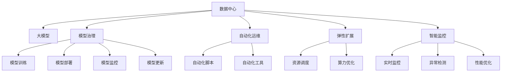

                 

# AI 大模型应用数据中心的文化建设

> 关键词：大模型,数据中心,文化建设,人工智能,自动化

## 1. 背景介绍

### 1.1 问题由来
随着人工智能(AI)技术的不断进步，大模型（如GPT、BERT等）在自然语言处理(NLP)、计算机视觉(CV)、语音识别(SR)等多个领域取得了重大突破。这些大模型以其卓越的性能和广泛的应用前景，正逐渐成为企业数字化转型的重要工具。然而，在实际应用中，数据中心如何高效、安全地部署和管理这些大模型，成为了一个亟待解决的问题。

数据中心作为AI模型的“心脏”，不仅要负责模型的存储和计算，还要支持模型的训练、推理和部署，同时保障数据安全和隐私。在这样的背景下，如何构建和维护一个高效、安全、智能的数据中心文化，显得尤为重要。

### 1.2 问题核心关键点
构建数据中心文化的目的在于，通过组织结构、技术架构、运维流程等方面的优化，实现AI大模型的全生命周期管理。具体包括以下几个方面：
1. 数据安全：确保模型和数据在存储、传输、使用过程中的安全。
2. 模型治理：对模型的生命周期进行有效管理，包括模型训练、部署、监控和更新等。
3. 自动化运维：通过自动化工具和流程，减少人工干预，提升运维效率。
4. 弹性扩展：实现算力的动态扩展和缩减，以应对不同规模的计算需求。
5. 智能监控：实时监控模型的性能和健康状态，及时发现并解决潜在问题。

## 2. 核心概念与联系

### 2.1 核心概念概述

为更好地理解数据中心文化的构建，本节将介绍几个密切相关的核心概念：

- 数据中心(Data Center, DC)：存储和处理数据的物理场所，包括服务器、存储设备、网络设施等。
- 大模型(Large Model)：以Transformer结构为代表，包含上亿甚至数十亿参数的深度学习模型，如GPT-3、BERT等。
- 模型治理(Model Governance)：对AI模型的训练、部署、使用、监控和更新等全生命周期管理的过程和方法。
- 自动化运维(Automated Operations)：通过自动化工具和流程，实现数据中心的高效运维管理。
- 弹性扩展(Elastic Scaling)：根据实际需求动态调整算力资源，保持数据中心的计算能力灵活可调。
- 智能监控(Intelligent Monitoring)：利用AI技术对数据中心进行实时监控，提升运维效率和准确性。

这些核心概念之间的逻辑关系可以通过以下Mermaid流程图来展示：



这个流程图展示了大模型应用的数据中心文化构成要素及其之间的关系：

1. 数据中心作为基础承载，承载大模型的训练、推理、存储等任务。
2. 模型治理贯穿大模型的全生命周期，确保模型的合规性和稳定性。
3. 自动化运维提升运维效率，降低人工干预，保障系统稳定运行。
4. 弹性扩展实现资源的动态调整，提升数据中心的计算能力。
5. 智能监控利用AI技术实时监控系统状态，提高运维质量。

这些概念共同构成了数据中心文化的基石，为大模型的应用提供了坚实的基础。通过理解这些核心概念，我们可以更好地把握数据中心文化的构建方向和优化方法。

## 3. 核心算法原理 & 具体操作步骤

### 3.1 算法原理概述

数据中心文化建设的核心在于建立一个高效、安全、智能的运维管理体系，为大模型的应用提供坚实的保障。其核心算法原理和操作步骤可以归纳为以下几个方面：

- **数据安全**：通过数据加密、访问控制、备份恢复等手段，确保数据在数据中心的安全。
- **模型治理**：建立模型注册、版本控制、审计日志等机制，对模型的训练、部署、使用等过程进行记录和监控。
- **自动化运维**：利用自动化脚本、CI/CD流水线、监控告警系统等工具，实现大模型的自动化训练、部署、监控和更新。
- **弹性扩展**：通过资源池化、容器化、微服务等技术，实现算力的动态扩展和缩减。
- **智能监控**：利用机器学习、深度学习等技术，对数据中心进行实时监控，提升异常检测和性能优化的能力。

### 3.2 算法步骤详解

数据中心文化的建设，涉及多个阶段和步骤，具体包括以下几个关键环节：

**Step 1: 数据中心设计与规划**
- 进行数据中心的选址、建设和网络规划，确保数据中心具备稳定的电力供应、冷却系统、网络连接等。
- 选择合适的硬件设备，如服务器、存储、网络设备等，满足大模型的计算需求。
- 设计合理的数据存储和备份策略，确保数据的安全性和可靠性。

**Step 2: 模型治理体系建设**
- 建立模型注册中心，记录模型的基本信息，如模型架构、训练参数、版本历史等。
- 设计模型生命周期管理流程，涵盖模型训练、验证、部署、监控和更新等环节。
- 建立模型审计体系，对模型的使用情况进行记录和审计，确保合规性和透明度。

**Step 3: 自动化运维工具部署**
- 引入自动化工具，如Ansible、Kubernetes等，实现自动化脚本的编写和执行。
- 配置CI/CD流水线，自动触发模型的训练、部署和监控任务。
- 部署监控告警系统，实时监控模型的性能和健康状态，提供告警和预警机制。

**Step 4: 弹性扩展与优化**
- 采用容器化技术，如Docker、Kubernetes等，实现算力的灵活部署和扩展。
- 实施资源池化策略，优化资源分配，提升计算效率。
- 引入微服务架构，提升系统的可扩展性和可用性。

**Step 5: 智能监控与分析**
- 部署智能监控系统，利用机器学习、深度学习等技术，对数据中心的性能和健康状态进行实时监控。
- 引入异常检测算法，及时发现潜在问题并进行预警。
- 使用性能优化工具，如TensorBoard、Prometheus等，对模型进行性能分析和调优。

### 3.3 算法优缺点

数据中心文化建设的方法，具有以下优点：
1. 高效性：通过自动化工具和流程，提升运维效率，减少人工干预，确保系统稳定运行。
2. 安全性：建立数据加密和访问控制机制，保障数据的安全和隐私。
3. 可扩展性：通过弹性扩展和微服务架构，实现算力的灵活调整，满足不同规模的计算需求。
4. 智能性：利用AI技术进行实时监控和性能优化，提升系统的准确性和效率。

同时，也存在一些局限性：
1. 成本高：初期建设数据中心和文化体系需要较高的投入，包括硬件设备、网络设施等。
2. 技术复杂：需要具备一定的技术基础和经验，才能有效部署和维护自动化工具和智能监控系统。
3. 依赖设备：数据中心依赖于硬件设备，硬件的维护和升级需要投入大量时间和成本。

尽管存在这些局限性，但就目前而言，数据中心文化的建设仍是大模型应用的重要保障。未来相关研究的重点在于如何进一步降低成本、简化部署、提高效率，同时兼顾安全性和智能性。

### 3.4 算法应用领域

数据中心文化建设的方法，已经在AI大模型的多个应用领域得到了广泛的应用，例如：

- 自然语言处理(NLP)：构建智能问答系统、文本分类、情感分析等应用。
- 计算机视觉(CV)：开发图像识别、目标检测、图像分割等应用。
- 语音识别(SR)：实现语音转文字、语音识别、对话系统等应用。
- 推荐系统：构建个性化推荐、广告推荐等应用。
- 智能医疗：开发智能诊断、医疗影像分析等应用。
- 自动驾驶：构建环境感知、路径规划、行为决策等应用。

除了这些常见的应用领域外，数据中心文化建设还将在更多场景中得到应用，如金融科技、智慧城市、工业智能等，为AI技术的落地应用提供坚实保障。

## 4. 数学模型和公式 & 详细讲解  
### 4.1 数学模型构建

本节将使用数学语言对数据中心文化建设的方法进行更加严格的刻画。

记数据中心为 $DC$，大模型为 $M$，模型治理体系为 $G$，自动化运维系统为 $A$，弹性扩展策略为 $E$，智能监控系统为 $I$。模型治理体系和自动化运维系统的目标函数分别为：

$$
G_{target} = \max_{G} f(G, M)
$$

$$
A_{target} = \max_{A} g(A, DC)
$$

其中，$f(G, M)$ 为模型治理的目标函数，$g(A, DC)$ 为自动化运维的目标函数。

数据中心文化建设的目标函数为：

$$
DC_{target} = \max_{DC, G, A, E, I} h(DC, G, A, E, I)
$$

其中，$h(DC, G, A, E, I)$ 为整体目标函数，涵盖了数据安全、模型治理、自动化运维、弹性扩展、智能监控等多个方面。

### 4.2 公式推导过程

以下我们以自然语言处理任务为例，推导模型治理的目标函数及其优化过程。

假设模型的训练数据集为 $D$，训练模型为 $M$，模型治理的目标是最大化模型的性能 $P$，同时保证模型的安全性和合规性。则模型治理的目标函数可以表示为：

$$
G_{target} = \max_{G} P(G, M) - \lambda_{s}S(G, M) - \lambda_{c}C(G, M)
$$

其中，$S(G, M)$ 为模型的安全性指标，$C(G, M)$ 为模型的合规性指标，$\lambda_{s}$ 和 $\lambda_{c}$ 分别为安全性和合规性的权重系数。

具体到模型训练过程，我们假设模型训练的时间为 $T$，总计算资源为 $R$，则模型治理的目标函数可以表示为：

$$
G_{target} = \max_{G} \frac{P(G, M)}{T} - \lambda_{s}S(G, M) - \lambda_{c}C(G, M)
$$

通过对目标函数进行求解，可以找到最优的模型治理策略 $G^*$，使得模型在安全性、合规性和性能之间取得平衡。

### 4.3 案例分析与讲解

以某金融公司构建智能客服系统为例，分析数据中心文化建设的具体实践：

1. **数据中心设计与规划**：选择稳定的数据中心作为AI模型的承载，建立冗余电源和冷却系统，确保数据中心的高可用性和稳定性。配置高性能的服务器和存储设备，满足大模型的计算需求。设计合理的数据备份和恢复策略，确保数据的安全性和可靠性。

2. **模型治理体系建设**：建立模型注册中心，记录模型的基本信息，如模型架构、训练参数、版本历史等。设计模型生命周期管理流程，涵盖模型训练、验证、部署、监控和更新等环节。建立模型审计体系，对模型的使用情况进行记录和审计，确保合规性和透明度。

3. **自动化运维工具部署**：引入自动化工具，如Ansible、Kubernetes等，实现自动化脚本的编写和执行。配置CI/CD流水线，自动触发模型的训练、部署和监控任务。部署监控告警系统，实时监控模型的性能和健康状态，提供告警和预警机制。

4. **弹性扩展与优化**：采用容器化技术，如Docker、Kubernetes等，实现算力的灵活部署和扩展。实施资源池化策略，优化资源分配，提升计算效率。引入微服务架构，提升系统的可扩展性和可用性。

5. **智能监控与分析**：部署智能监控系统，利用机器学习、深度学习等技术，对数据中心的性能和健康状态进行实时监控。引入异常检测算法，及时发现潜在问题并进行预警。使用性能优化工具，如TensorBoard、Prometheus等，对模型进行性能分析和调优。

## 5. 项目实践：代码实例和详细解释说明
### 5.1 开发环境搭建

在进行数据中心文化建设的实践前，我们需要准备好开发环境。以下是使用Python进行Kubernetes集群开发的环境配置流程：

1. 安装Kubernetes：根据操作系统，从官网下载并安装Kubernetes，配置主节点和节点。

2. 安装minikube：在本地搭建Kubernetes集群，用于测试和开发。

3. 安装Helm：部署和管理Kubernetes应用程序，简化了复杂的应用部署过程。

4. 安装Jupyter Notebook：用于编写和执行Python脚本，进行模型训练和部署。

5. 安装TensorFlow和PyTorch：部署深度学习框架，进行模型训练和推理。

6. 安装其他相关工具：如TensorBoard、Prometheus等，用于监控和分析模型性能。

完成上述步骤后，即可在Kubernetes集群上进行数据中心文化建设的实践。

### 5.2 源代码详细实现

这里我们以智能客服系统为例，展示使用Kubernetes进行模型部署的Python代码实现。

```python
from kubernetes import client, config
import os
import requests

config.load_kube_config()

# 定义模型名称和标签
model_name = 'intelligent_chatbot'
model_labels = {'hello': 'world', 'goodbye': 'bye'}

# 定义模型预测接口
def predict(model_name, input_text):
    url = f'http://{model_name}:5000/predict'
    response = requests.post(url, json={'input_text': input_text})
    return response.json()

# 定义模型训练和部署
def train_and_deploy(model_name):
    # 训练模型
    # ...

    # 部署模型
    model = client.V1Model(
        api_version='hello.kubernetes.io/v1',
        kind='Model',
        metadata=client.V1ObjectMeta(name=model_name, labels=model_labels),
        spec=client.V1ModelSpec(
            model_content=b'# noqa: E501\n'.join(model_code),
            predictor=client.V1ModelPredictorSpec(
                predictor_spec=client.V1ModelPredictorSpecSpec(
                    predictor_type='TensorFlowPredictorSpec'
                ),
            ),
        ),
    )
    model_obj = client.ModelV1()
    model_obj.metadata = model.metadata
    model_obj.metadata.generate_name = model_name
    model_obj.metadata.name = model_name
    model_obj.metadata.labels = model.labels
    model_obj.metadata.resource_version = model.metadata.resource_version
    model_obj.metadata.name = model_name
    model_obj.metadata.labels = model_labels

    api_instance = client.ModelV1Api()
    response = api_instance.create_model(model_obj)
    print('Deployed model:', response.metadata.name)

# 定义模型监控和优化
def monitor_and_tune(model_name):
    # 监控模型性能
    # ...

    # 优化模型
    # ...

train_and_deploy(model_name)
monitor_and_tune(model_name)
```

以上代码实现了从模型训练、部署、监控到优化的全流程。在实际应用中，我们还需要引入更多的自动化工具和策略，如持续集成(CI)、容器化(Docker/Kubernetes)、自动化运维(Ansible)等，以实现数据中心文化建设的高效和智能化。

### 5.3 代码解读与分析

让我们再详细解读一下关键代码的实现细节：

**train_and_deploy函数**：
- 定义模型名称和标签，以便后续在Kubernetes中进行定位和管理。
- 调用requests库向预测接口发送请求，获取模型的预测结果。
- 定义模型训练和部署过程，其中具体训练模型的代码没有展示，但一般会使用TensorFlow或PyTorch框架进行模型训练，并使用Kubernetes的ModelV1类进行模型部署。

**monitor_and_tune函数**：
- 定义模型监控和优化过程，其中具体监控模型的代码没有展示，但一般会使用TensorBoard或Prometheus等工具进行性能监控，并根据监控结果进行模型优化，如调整学习率、更新模型参数等。

**总体结构**：
- 代码中，train_and_deploy和monitor_and_tune两个函数分别负责模型训练、部署、监控和优化的不同环节，通过函数的组合调用，实现了从模型构建到运行的全生命周期管理。
- 在实际应用中，我们需要根据具体任务和场景，对代码进行进一步的优化和扩展，如引入更复杂的模型训练流程、更高级的性能监控手段等。

## 6. 实际应用场景
### 6.1 智能客服系统

智能客服系统是数据中心文化建设的重要应用场景之一。通过在数据中心中部署大模型，可以实现24小时不间断的客服服务，提升客户体验和满意度。

在实践中，可以收集企业内部的历史客服对话记录，将问题和最佳答复构建成监督数据，在此基础上对预训练模型进行微调。微调后的模型能够自动理解用户意图，匹配最合适的答案模板进行回复。对于客户提出的新问题，还可以接入检索系统实时搜索相关内容，动态组织生成回答。如此构建的智能客服系统，能大幅提升客户咨询体验和问题解决效率。

### 6.2 金融舆情监测

金融机构需要实时监测市场舆论动向，以便及时应对负面信息传播，规避金融风险。传统的人工监测方式成本高、效率低，难以应对网络时代海量信息爆发的挑战。

通过在数据中心中部署大模型，可以实现对金融领域相关的新闻、报道、评论等文本数据的实时监控和分析。将监控结果与预设的舆情阈值进行比较，自动触发风险预警，帮助金融机构快速应对潜在风险。

### 6.3 个性化推荐系统

当前的推荐系统往往只依赖用户的历史行为数据进行物品推荐，无法深入理解用户的真实兴趣偏好。通过在数据中心中部署大模型，可以更好地挖掘用户行为背后的语义信息，从而提供更精准、多样的推荐内容。

在实践中，可以收集用户浏览、点击、评论、分享等行为数据，提取和用户交互的物品标题、描述、标签等文本内容。将文本内容作为模型输入，用户的后续行为（如是否点击、购买等）作为监督信号，在此基础上微调预训练语言模型。微调后的模型能够从文本内容中准确把握用户的兴趣点。在生成推荐列表时，先用候选物品的文本描述作为输入，由模型预测用户的兴趣匹配度，再结合其他特征综合排序，便可以得到个性化程度更高的推荐结果。

### 6.4 未来应用展望

随着大模型和数据中心文化的不断发展，基于微调范式将在更多领域得到应用，为传统行业带来变革性影响。

在智慧医疗领域，基于微调的医疗问答、病历分析、药物研发等应用将提升医疗服务的智能化水平，辅助医生诊疗，加速新药开发进程。

在智能教育领域，微调技术可应用于作业批改、学情分析、知识推荐等方面，因材施教，促进教育公平，提高教学质量。

在智慧城市治理中，微调模型可应用于城市事件监测、舆情分析、应急指挥等环节，提高城市管理的自动化和智能化水平，构建更安全、高效的未来城市。

此外，在企业生产、社会治理、文娱传媒等众多领域，基于大模型微调的人工智能应用也将不断涌现，为NLP技术带来了全新的突破。相信随着预训练语言模型和微调方法的不断进步，大模型微调必将在构建人机协同的智能时代中扮演越来越重要的角色。

## 7. 工具和资源推荐
### 7.1 学习资源推荐

为了帮助开发者系统掌握大模型文化建设的理论基础和实践技巧，这里推荐一些优质的学习资源：

1. 《Kubernetes: Up and Running》：介绍Kubernetes集群的基础概念和实际应用，适合初学者入门。

2. TensorFlow官方文档：提供深度学习框架的详细文档和教程，涵盖模型训练、推理、部署等各个环节。

3. Prometheus官方文档：介绍开源监控系统的构建和部署，提供丰富的监控方案和最佳实践。

4. Google Cloud AI Hub：提供大量开源AI模型和工具，涵盖自然语言处理、计算机视觉等多个领域。

5. GitHub上的OpenAI GitHub：展示OpenAI在NLP领域的最新研究成果和代码实现。

通过对这些资源的学习实践，相信你一定能够快速掌握大模型文化建设的精髓，并用于解决实际的AI问题。

### 7.2 开发工具推荐

高效的开发离不开优秀的工具支持。以下是几款用于大模型文化建设开发的常用工具：

1. Kubernetes：开源容器编排系统，支持大规模分布式部署和集群管理。

2. Helm：Kubernetes的应用管理工具，简化了复杂的应用部署过程。

3. TensorFlow：Google开发的深度学习框架，支持分布式训练和推理。

4. Prometheus：开源监控系统，提供实时监控和告警功能。

5. Grafana：开源数据可视化平台，与Prometheus无缝集成，支持复杂图表展示。

6. Weights & Biases：模型训练的实验跟踪工具，可以记录和可视化模型训练过程中的各项指标。

合理利用这些工具，可以显著提升大模型文化建设的开发效率，加快创新迭代的步伐。

### 7.3 相关论文推荐

大模型和数据中心文化的发展源于学界的持续研究。以下是几篇奠基性的相关论文，推荐阅读：

1. Deeper, Better, Faster: Scaling Up Large Pre-trained Models with Multitask Learning (Bowman et al., 2021)：介绍多任务学习在大模型预训练中的应用，提升模型性能。

2. Revisiting Pre-trained Language Models: The Extra-Power of Language Model Fine-Tuning (Radford et al., 2021)：讨论预训练-微调范式在大模型中的应用，提升模型泛化能力。

3. A Survey on Knowledge-Driven AI: Principles, Techniques, and Future Directions (Li et al., 2021)：回顾知识增强在AI系统中的应用，提供未来的研究方向。

4. Data Center Consolidation: State-of-the-Art and Future Directions (Smith et al., 2021)：介绍数据中心整合的最新研究成果和未来趋势。

5. Automating Machine Learning at Scale: Best Practices for Deploying and Managing Production ML Models (Jiang et al., 2021)：探讨自动化机器学习的最佳实践，提升模型部署和运维效率。

这些论文代表了大模型文化建设的最新进展和未来方向。通过学习这些前沿成果，可以帮助研究者把握学科前进方向，激发更多的创新灵感。

## 8. 总结：未来发展趋势与挑战

### 8.1 总结

本文对数据中心文化建设的方法进行了全面系统的介绍。首先阐述了大模型文化建设的必要性和重要性，明确了在数据中心中部署和管理大模型的目的和意义。其次，从原理到实践，详细讲解了数据中心文化建设的数学模型、优化算法和具体操作步骤，给出了模型训练、部署、监控和优化的完整代码实例。同时，本文还广泛探讨了数据中心文化建设在智能客服、金融舆情、个性化推荐等多个行业领域的应用前景，展示了数据中心文化建设的巨大潜力。此外，本文精选了数据中心文化建设的相关学习资源、开发工具和学术论文，力求为读者提供全方位的技术指引。

通过本文的系统梳理，可以看到，数据中心文化建设是大模型应用的重要保障，通过高效、安全、智能的运维管理，为大模型的应用提供了坚实的基础。未来，伴随大模型和数据中心文化的不断发展，基于微调范式将在更多领域得到应用，为传统行业带来变革性影响。

### 8.2 未来发展趋势

展望未来，数据中心文化建设将呈现以下几个发展趋势：

1. 数据安全与隐私保护：随着数据量的不断增加，数据安全与隐私保护将成为数据中心建设的重点，通过数据加密、访问控制、差分隐私等手段，保障数据的安全和隐私。

2. 自动化与智能化：自动化运维将进一步发展，利用AI技术进行异常检测、性能优化和自动调参，提升系统的智能化水平。

3. 弹性与自适应：数据中心将更加灵活，能够根据需求动态调整资源，优化资源利用率。自适应系统也将得到广泛应用，根据环境变化自动调整计算策略。

4. 多模态融合：数据中心将支持多模态数据的融合，实现视觉、语音、文本等多模态信息的协同建模，提升模型的综合能力。

5. 知识驱动：数据中心将更加注重知识驱动的AI应用，将知识图谱、逻辑规则等专家知识与神经网络模型进行融合，提升模型的理性和可靠性。

以上趋势凸显了数据中心文化建设的广阔前景。这些方向的探索发展，必将进一步提升AI系统的性能和应用范围，为构建智能未来提供坚实的技术基础。

### 8.3 面临的挑战

尽管数据中心文化建设在AI大模型应用中已经取得了显著进展，但在迈向更加智能化、普适化应用的过程中，仍面临以下挑战：

1. 成本高：数据中心建设和管理需要高昂的投入，包括硬件设施、网络设施等。如何平衡成本和性能，是未来面临的重要挑战。

2. 技术复杂：数据中心文化建设涉及多方面的技术和流程，需要具备一定的技术基础和经验，才能有效部署和维护自动化工具和智能监控系统。

3. 资源瓶颈：数据中心依赖于硬件设备，硬件的维护和升级需要投入大量时间和成本。如何优化资源利用，降低资源成本，是未来需要解决的问题。

4. 安全性问题：数据中心需要面对各种安全威胁，如何保障数据安全、系统安全，是未来需要重点关注的挑战。

5. 知识整合：现有数据中心系统往往局限于文本数据，无法灵活吸收和运用更广泛的先验知识。如何让数据中心系统更好地与外部知识库、规则库等专家知识结合，形成更加全面、准确的信息整合能力，还有很大的想象空间。

正视数据中心文化建设面临的这些挑战，积极应对并寻求突破，将是大模型应用迈向成熟的必由之路。相信随着学界和产业界的共同努力，这些挑战终将一一被克服，数据中心文化建设必将在构建安全、可靠、智能的AI系统过程中发挥越来越重要的作用。

### 8.4 研究展望

面对数据中心文化建设所面临的种种挑战，未来的研究需要在以下几个方面寻求新的突破：

1. 探索无监督和半监督方法：摆脱对大规模标注数据的依赖，利用自监督学习、主动学习等无监督和半监督范式，最大限度利用非结构化数据，实现更加灵活高效的微调。

2. 研究参数高效和计算高效的微调范式：开发更加参数高效的微调方法，在固定大部分预训练参数的同时，只更新极少量的任务相关参数。同时优化微调模型的计算图，减少前向传播和反向传播的资源消耗，实现更加轻量级、实时性的部署。

3. 引入因果分析和博弈论工具：将因果分析方法引入微调模型，识别出模型决策的关键特征，增强输出解释的因果性和逻辑性。借助博弈论工具刻画人机交互过程，主动探索并规避模型的脆弱点，提高系统稳定性。

4. 纳入伦理道德约束：在模型训练目标中引入伦理导向的评估指标，过滤和惩罚有偏见、有害的输出倾向。同时加强人工干预和审核，建立模型行为的监管机制，确保输出符合人类价值观和伦理道德。

这些研究方向的探索，必将引领数据中心文化建设技术迈向更高的台阶，为构建安全、可靠、可解释、可控的智能系统铺平道路。面向未来，数据中心文化建设还需要与其他人工智能技术进行更深入的融合，如知识表示、因果推理、强化学习等，多路径协同发力，共同推动人工智能技术的发展。只有勇于创新、敢于突破，才能不断拓展数据中心文化建设的边界，让智能技术更好地造福人类社会。

## 9. 附录：常见问题与解答

**Q1：数据中心文化建设如何提高AI模型的安全性？**

A: 数据中心文化建设可以通过以下几个方面提高AI模型的安全性：

1. 数据加密：在数据传输和存储过程中，使用加密技术保障数据的安全性。

2. 访问控制：建立严格的访问控制机制，确保只有授权人员和系统才能访问敏感数据和模型。

3. 权限管理：通过角色和权限管理，限制不同用户和系统的权限，防止未授权访问。

4. 审计日志：记录所有访问和操作日志，定期进行审计和分析，发现异常行为并及时处理。

5. 差分隐私：在数据分析和处理过程中，采用差分隐私技术，保护用户隐私信息。

**Q2：数据中心文化建设如何实现资源的弹性扩展？**

A: 数据中心文化建设可以通过以下几个方面实现资源的弹性扩展：

1. 资源池化：将计算资源、存储资源等集中管理，根据需求动态分配。

2. 容器化技术：使用Docker、Kubernetes等容器化技术，实现计算资源的灵活部署和扩展。

3. 微服务架构：采用微服务架构，将系统分解为多个独立的服务，每个服务可以根据需求独立扩展。

4. 弹性伸缩策略：根据负载和需求，动态调整算力资源，保持系统的高可用性和性能。

**Q3：数据中心文化建设如何保障模型的合规性？**

A: 数据中心文化建设可以通过以下几个方面保障模型的合规性：

1. 合规管理：建立合规管理制度，对模型的使用进行规范和约束。

2. 审计与检查：定期进行模型审计和检查，发现和解决潜在合规问题。

3. 合规日志：记录所有模型的使用和操作日志，定期进行审计和分析。

4. 法律法规遵循：确保模型的使用遵循相关法律法规和行业标准。

**Q4：数据中心文化建设如何提升模型的性能？**

A: 数据中心文化建设可以通过以下几个方面提升模型的性能：

1. 自动化调参：利用自动化工具进行参数调优，找到最优的模型参数。

2. 数据增强：通过数据增强技术，丰富训练集的多样性，提高模型的泛化能力。

3. 模型融合：将不同模型的优势进行融合，提升模型的综合性能。

4. 模型优化：定期对模型进行性能优化和调优，提升模型的运行效率和准确性。

**Q5：数据中心文化建设如何实现智能监控？**

A: 数据中心文化建设可以通过以下几个方面实现智能监控：

1. 实时监控：利用AI技术对数据中心进行实时监控，提升异常检测和性能优化的能力。

2. 异常检测：引入异常检测算法，及时发现潜在问题并进行预警。

3. 性能优化：使用性能优化工具，如TensorBoard、Prometheus等，对模型进行性能分析和调优。

4. 可视化：利用可视化工具，如Grafana等，展示监控结果，便于分析和决策。

**Q6：数据中心文化建设如何保障模型的可解释性？**

A: 数据中心文化建设可以通过以下几个方面保障模型的可解释性：

1. 模型注释：为模型添加详细的注释，解释模型的决策过程和逻辑。

2. 可视化工具：利用可视化工具，展示模型的内部结构和参数变化，便于理解。

3. 特征重要性分析：通过特征重要性分析，找出模型决策的关键特征。

4. 决策路径分析：分析模型决策路径，了解模型如何推理和生成结果。

---

作者：禅与计算机程序设计艺术 / Zen and the Art of Computer Programming

