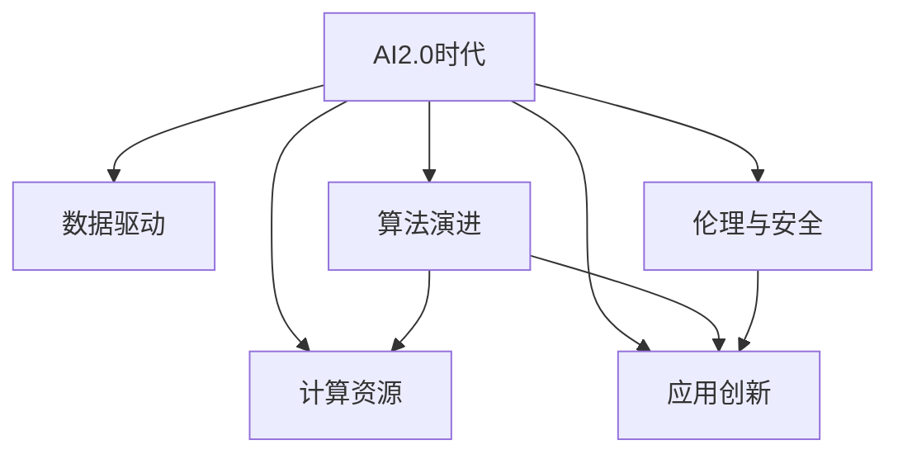

                 

# AI2.0时代：计算变化中的新机遇

> 关键词：AI2.0,计算变化,新机遇,深度学习,算法迭代,数据驱动,人工智能,未来技术

## 1. 背景介绍

### 1.1 问题由来
进入21世纪20年代，我们即将迎来新一轮技术革命：AI2.0时代的到来。AI2.0是指在数据、算法、计算、应用等多方面的全面升级，将人工智能技术推向新的高度。从初期的规则、符号AI到机器学习、深度学习，再到如今的增强学习、自动机器学习(AutoML)、联邦学习、自监督学习等，计算技术和算法的不断演进，正在开启一个新的计算时代。

AI2.0时代，人工智能技术将与更多领域深度融合，加速实现产业数字化、智能化的进程。从制造业的智能制造，到医疗领域的精准医疗，再到金融行业的智能投顾，未来社会的方方面面都将被人工智能所改变。这一历史性的变革，将带来前所未有的机遇和挑战。

### 1.2 问题核心关键点
AI2.0时代的核心在于，通过计算与算法的不断迭代，极大提升人工智能的能力和效率，从而实现更广泛的应用。在这一过程中，以下关键问题值得关注：

- 数据驱动：如何高效获取、处理和利用数据，是AI2.0时代的关键。
- 算法演进：深度学习、增强学习、自监督学习等算法的不断进步，为AI2.0提供了坚实基础。
- 计算资源：海量数据的处理需要强大的计算资源支持，云计算、边缘计算等技术将是重要支撑。
- 应用创新：AI2.0技术如何与不同行业场景结合，产生新的应用场景和商业模式。
- 伦理与安全：如何在AI2.0技术应用中，确保数据隐私、算法公平、决策透明等伦理和安全问题。

### 1.3 问题研究意义
研究AI2.0时代的计算变化及其带来的新机遇，对于把握未来技术趋势、推动产业升级、赋能人类发展具有重要意义：

1. 把握未来技术趋势：AI2.0时代是一个充满活力和创新的时代，通过深入研究，可以更好地把握未来技术发展方向。
2. 推动产业升级：AI2.0技术能够赋能各行各业，加速传统行业的数字化、智能化进程，提升产业竞争力。
3. 赋能人类发展：AI2.0技术将改变人类的工作方式、生活方式，提升人类的生产效率和生活质量。
4. 促进社会进步：AI2.0技术的应用能够解决更多社会问题，如疾病预测、交通优化、环境治理等，促进社会整体进步。

## 2. 核心概念与联系

### 2.1 核心概念概述

为更好地理解AI2.0时代的计算变化及其新机遇，本节将介绍几个密切相关的核心概念：

- AI2.0时代：人工智能技术在数据、算法、计算、应用等方面的全面升级，开启新的计算时代。
- 数据驱动：通过数据驱动的方式，提升人工智能模型的效果，是AI2.0时代的核心特征。
- 算法演进：从传统的机器学习到深度学习、增强学习等算法的不断进步，推动了AI2.0的发展。
- 计算资源：包括云计算、边缘计算、分布式计算等技术，提供了高效处理大规模数据的能力。
- 应用创新：将AI2.0技术与不同领域应用相结合，创新出新的商业模式和技术方案。
- 伦理与安全：在AI2.0技术应用中，确保数据隐私、算法公平、决策透明等伦理和安全问题，是确保AI2.0健康发展的重要保障。

这些核心概念之间的逻辑关系可以通过以下Mermaid流程图来展示：



这个流程图展示了一系列的逻辑关系：

1. AI2.0时代通过数据驱动的方式，提升算法效果。
2. 算法演进为AI2.0时代的核心动力。
3. 计算资源提供高效的数据处理能力，支持AI2.0应用。
4. 应用创新将AI2.0技术与各行业结合，产生新的价值。
5. 伦理与安全是AI2.0技术应用的重要保障。

这些核心概念共同构成了AI2.0时代的计算框架，使其能够在更多领域实现突破。

## 3. 核心算法原理 & 具体操作步骤
### 3.1 算法原理概述

AI2.0时代的计算变化，核心在于通过数据、算法和计算资源的全方位提升，显著提升人工智能的效果和效率。以下是对这一过程的详细解释：

- 数据驱动：通过大规模、高质量的数据训练，提升人工智能模型的泛化能力和精度。
- 算法演进：从传统的机器学习到深度学习、增强学习等高级算法，不断提升模型的复杂度和性能。
- 计算资源：利用云计算、边缘计算等技术，提供高效的计算支持，降低数据处理的成本和时延。

AI2.0时代的核心算法主要包括深度学习、增强学习、自监督学习等。以下是对这些算法的详细解析：

### 3.2 算法步骤详解

AI2.0时代的算法步骤主要包括以下几个关键环节：

**Step 1: 数据准备与预处理**

- 收集高质量、多样化的数据集，如自然语言数据、图像数据、传感器数据等。
- 进行数据清洗、去噪、标注等预处理，确保数据质量。
- 使用数据增强技术，如数据扩充、合成数据生成等，提升数据的多样性。

**Step 2: 模型设计与训练**

- 选择合适的深度学习框架，如TensorFlow、PyTorch等，构建模型结构。
- 定义损失函数、优化器等训练参数。
- 使用GPU/TPU等高性能计算资源，进行高效的模型训练。

**Step 3: 模型调优与部署**

- 使用交叉验证、超参数优化等技术，调优模型参数。
- 在目标设备上部署模型，进行推理预测。
- 进行持续的模型监控与迭代，提升模型的实时性和稳定性。

### 3.3 算法优缺点

AI2.0时代的算法具有以下优点：

- 高效性：深度学习、增强学习等算法能够高效处理大规模数据，提升模型效果。
- 鲁棒性：算法迭代和优化，提升了模型的泛化能力和鲁棒性。
- 可扩展性：利用云计算、边缘计算等技术，模型能够灵活扩展，适应不同规模的数据处理需求。

但这些算法也存在一些局限：

- 计算资源依赖：深度学习等高级算法需要强大的计算资源支持。
- 模型复杂度高：模型结构复杂，训练和推理时间较长。
- 数据隐私风险：大量数据的使用，可能带来数据隐私和安全问题。

### 3.4 算法应用领域

AI2.0时代的算法应用广泛，涉及多个领域：

- 自然语言处理(NLP)：如语音识别、机器翻译、文本生成等。
- 计算机视觉(CV)：如图像分类、目标检测、图像生成等。
- 智能推荐：如电商推荐、新闻推荐、广告推荐等。
- 自动驾驶：如自动驾驶、智能交通等。
- 金融科技：如智能投顾、风险预测、欺诈检测等。
- 医疗健康：如疾病预测、影像诊断、个性化治疗等。

此外，AI2.0技术还在智能家居、智慧城市、工业互联网等更多领域中得到应用，未来将具有更广阔的发展前景。

## 4. 数学模型和公式 & 详细讲解 & 举例说明（备注：数学公式请使用latex格式，latex嵌入文中独立段落使用 $$，段落内使用 $)
### 4.1 数学模型构建

AI2.0时代的核心算法通常使用神经网络结构，通过多层次的抽象表示学习数据的复杂特征。以下是一个简单的深度学习模型结构：

$$
\begin{align*}
y &= W^{\mathrm{T}} \sigma(z) \\
z &= U^{\mathrm{T}} x + b
\end{align*}
$$

其中 $x$ 为输入数据，$W$、$U$ 为模型参数，$\sigma$ 为激活函数，$b$ 为偏置项。

### 4.2 公式推导过程

深度学习模型的训练过程通常使用梯度下降算法，通过反向传播计算参数梯度，更新模型参数。以损失函数 $L$ 为例，其梯度推导如下：

$$
\nabla_{W} L = \frac{\partial L}{\partial W} = \frac{\partial L}{\partial z} \frac{\partial z}{\partial W}
$$

其中：

$$
\frac{\partial L}{\partial z} = \frac{\partial L}{\partial y} \frac{\partial y}{\partial z}
$$

将上述公式代入损失函数 $L$ 中，并使用反向传播算法计算参数梯度，完成模型训练过程。

### 4.3 案例分析与讲解

以计算机视觉领域的图像分类任务为例，展示深度学习模型的训练过程。使用LeNet-5作为基准模型，训练过程如下：

1. 收集图像数据集，并进行数据增强和预处理。
2. 定义LeNet-5模型结构，并设置训练参数，如损失函数、优化器、学习率等。
3. 使用GPU/TPU等计算资源，进行模型训练。
4. 使用交叉验证等技术，调优模型参数。
5. 在测试集上评估模型性能，并部署模型进行实际应用。

## 5. 项目实践：代码实例和详细解释说明
### 5.1 开发环境搭建

在进行AI2.0时代的项目实践前，需要准备好开发环境。以下是使用Python进行TensorFlow开发的环境配置流程：

1. 安装Anaconda：从官网下载并安装Anaconda，用于创建独立的Python环境。

2. 创建并激活虚拟环境：
```bash
conda create -n tf-env python=3.8 
conda activate tf-env
```

3. 安装TensorFlow：
```bash
pip install tensorflow
```

4. 安装各类工具包：
```bash
pip install numpy pandas scikit-learn matplotlib tqdm jupyter notebook ipython
```

完成上述步骤后，即可在`tf-env`环境中开始AI2.0项目的开发。

### 5.2 源代码详细实现

以下是使用TensorFlow实现图像分类任务的完整代码实现：

```python
import tensorflow as tf
from tensorflow.keras import layers

# 定义模型结构
model = tf.keras.Sequential([
    layers.Conv2D(32, (3,3), activation='relu', input_shape=(32, 32, 3)),
    layers.MaxPooling2D((2,2)),
    layers.Conv2D(64, (3,3), activation='relu'),
    layers.MaxPooling2D((2,2)),
    layers.Flatten(),
    layers.Dense(64, activation='relu'),
    layers.Dense(10, activation='softmax')
])

# 编译模型
model.compile(optimizer='adam',
              loss='categorical_crossentropy',
              metrics=['accuracy'])

# 加载数据集
train_data = tf.keras.datasets.cifar10.load_data()
train_images, train_labels = train_data[0], train_data[1]
test_data = tf.keras.datasets.cifar10.load_data()
test_images, test_labels = test_data[0], test_data[1]

# 数据预处理
train_images = train_images / 255.0
test_images = test_images / 255.0

# 训练模型
model.fit(train_images, train_labels, epochs=10, batch_size=64, validation_data=(test_images, test_labels))

# 评估模型
test_loss, test_acc = model.evaluate(test_images, test_labels)
print('Test accuracy:', test_acc)
```

### 5.3 代码解读与分析

让我们再详细解读一下关键代码的实现细节：

**模型结构定义**：
- 使用Keras的Sequential模型定义神经网络结构，包含卷积层、池化层、全连接层等。
- 在卷积层中，使用ReLU激活函数，输入数据形状为32x32x3。
- 在全连接层中，使用softmax激活函数，输出10个类别的概率。

**模型编译**：
- 使用Adam优化器和交叉熵损失函数，设置准确率作为评估指标。
- 编译模型，准备进行训练。

**数据加载与预处理**：
- 使用CIFAR-10数据集，加载训练集和测试集。
- 对数据进行归一化处理，将像素值缩放到0-1之间。

**模型训练**：
- 使用fit方法训练模型，设置训练轮数为10，每个批次的样本数为64。
- 在每个epoch的末尾，计算测试集的准确率，进行模型评估。

**模型评估**：
- 使用evaluate方法评估模型在测试集上的性能，输出测试损失和准确率。

以上代码展示了使用TensorFlow进行图像分类任务的基本流程。可以看出，TensorFlow提供了简单易用的API，能够快速搭建和训练深度学习模型，并提供了丰富的可视化工具和模型评估方法，极大地简化了AI2.0项目的开发过程。

## 6. 实际应用场景
### 6.1 智能制造

在制造业中，AI2.0技术可以通过智能制造系统，实现生产过程的数字化和智能化。通过收集工厂内外的生产数据，如设备状态、产品信息、物流数据等，AI2.0技术可以实时监控生产线的运行状况，预测设备故障，优化生产流程，提高生产效率和质量。

具体而言，AI2.0技术可以在以下几个方面发挥作用：

- 设备预测维护：通过分析设备传感器数据，预测设备故障，减少停机时间。
- 生产过程优化：利用机器学习模型，优化生产工艺，提高生产效率。
- 质量控制：使用深度学习模型，检测产品缺陷，提升产品质量。
- 供应链管理：通过数据分析和预测，优化供应链运作，减少库存成本。

### 6.2 精准医疗

在医疗领域，AI2.0技术可以实现精准医疗，通过分析患者的多维度数据，提供个性化的诊断和治疗方案。AI2.0技术在医疗影像分析、基因组学分析、疾病预测等方面展现了强大的能力。

具体而言，AI2.0技术可以在以下几个方面发挥作用：

- 影像诊断：使用卷积神经网络(CNN)分析医疗影像，帮助医生快速准确地诊断疾病。
- 基因组学分析：利用深度学习模型，分析基因组数据，发现疾病风险和药物敏感性。
- 疾病预测：通过分析患者的生理数据和历史病历，预测疾病风险，提供早期干预。
- 个性化治疗：根据患者的基因信息和疾病特征，提供个性化的治疗方案。

### 6.3 智能投顾

在金融行业，AI2.0技术可以通过智能投顾系统，帮助投资者进行更智能的投资决策。通过分析市场数据、财务报告、新闻资讯等多维度的信息，AI2.0技术可以预测市场趋势，推荐投资组合，优化资产配置。

具体而言，AI2.0技术可以在以下几个方面发挥作用：

- 市场预测：使用深度学习模型，预测股票市场的趋势和波动。
- 投资组合优化：通过优化算法，构建最优的投资组合，实现收益最大化。
- 风险管理：利用强化学习模型，评估投资风险，进行风险控制。
- 个性化推荐：根据投资者的风险偏好和历史交易数据，提供个性化的投资建议。

### 6.4 未来应用展望

随着AI2.0技术的不断演进，其在更多领域的应用前景将更加广阔。未来，AI2.0技术可能在以下几个方面取得更大的突破：

- 通用智能：通过进一步提升模型的复杂度和泛化能力，实现更广泛的应用场景和更高的智能水平。
- 跨领域融合：将AI2.0技术与更多领域的技术结合，创新出更多的应用场景和商业模式。
- 实时决策：通过实时计算和推理，实现更高效的决策和应用，提高生产效率和生活质量。
- 伦理与公平：在AI2.0技术应用中，注重数据隐私、算法公平等问题，确保技术的健康发展。

## 7. 工具和资源推荐
### 7.1 学习资源推荐

为了帮助开发者系统掌握AI2.0技术的基础知识，以下是几款优质的学习资源：

1. 《深度学习入门：基于Python的理论与实现》：清华大学出版社出版的经典教材，涵盖了深度学习的基础理论和实战技巧。
2. 《TensorFlow官方文档》：TensorFlow官方提供的详细文档，包括模型构建、训练、部署等方面的内容。
3. 《PyTorch官方文档》：PyTorch官方提供的详细文档，涵盖模型的构建、训练、优化等方面的内容。
4. 《AutoML权威指南》：O'Reilly出版社出版的权威指南，详细介绍了AutoML技术和应用。
5. 《AI2.0：智能技术革命》：一本全面介绍AI2.0时代的书籍，涵盖深度学习、增强学习、自监督学习等多方面的内容。

通过对这些资源的学习实践，相信你一定能够快速掌握AI2.0技术，并应用于实际项目中。

### 7.2 开发工具推荐

高效的开发离不开优秀的工具支持。以下是几款用于AI2.0项目开发的常用工具：

1. PyTorch：基于Python的开源深度学习框架，灵活的计算图设计，适合快速迭代研究。
2. TensorFlow：由Google主导开发的开源深度学习框架，生产部署方便，适合大规模工程应用。
3. Jupyter Notebook：交互式的Python开发环境，支持丰富的可视化工具和数据处理库，非常适合数据驱动的AI项目。
4. Weights & Biases：模型训练的实验跟踪工具，可以记录和可视化模型训练过程中的各项指标，方便对比和调优。
5. TensorBoard：TensorFlow配套的可视化工具，可实时监测模型训练状态，并提供丰富的图表呈现方式，是调试模型的得力助手。
6. Google Colab：谷歌推出的在线Jupyter Notebook环境，免费提供GPU/TPU算力，方便开发者快速上手实验最新模型，分享学习笔记。

合理利用这些工具，可以显著提升AI2.0项目的开发效率，加快创新迭代的步伐。

### 7.3 相关论文推荐

AI2.0技术的发展源于学界的持续研究。以下是几篇奠基性的相关论文，推荐阅读：

1. AlexNet: ImageNet Classification with Deep Convolutional Neural Networks：提出深度卷积神经网络，开启了深度学习时代。
2. ResNet: Deep Residual Learning for Image Recognition：提出残差网络结构，进一步提升了深度学习的训练效果。
3. Attention is All You Need：提出Transformer结构，开启了自注意力机制在深度学习中的应用。
4. AlphaGo Zero: Mastering the Game of Go without Human Knowledge：展示了强化学习在棋类游戏中的应用，推动了AI在特定领域的发展。
5. GPT-3: Language Models are Unsupervised Multitask Learners：展示了预训练语言模型的强大学习能力，引发了对于通用人工智能的新一轮思考。

这些论文代表了大数据、深度学习和强化学习等AI2.0技术的发展脉络。通过学习这些前沿成果，可以帮助研究者把握学科前进方向，激发更多的创新灵感。

## 8. 总结：未来发展趋势与挑战
### 8.1 总结

本文对AI2.0时代的计算变化及其新机遇进行了全面系统的介绍。首先阐述了AI2.0时代计算变化的背景和意义，明确了数据、算法、计算、应用等方面全面升级的关键点。其次，从原理到实践，详细讲解了AI2.0算法的核心步骤和关键技术，给出了AI2.0项目开发的完整代码实例。同时，本文还广泛探讨了AI2.0技术在智能制造、精准医疗、智能投顾等多个行业领域的应用前景，展示了AI2.0技术的广阔前景。此外，本文精选了AI2.0技术的各类学习资源，力求为读者提供全方位的技术指引。

通过本文的系统梳理，可以看到，AI2.0时代的计算变化正在开启一个新的计算时代，AI2.0技术在数据、算法、计算、应用等多方面全面升级，正在推动各行各业的数字化和智能化进程。未来，伴随AI2.0技术的不断发展，计算资源、算法演进和应用创新等方面的不断进步，必将引领人工智能技术迈向新的高度，带来更多前所未有的机遇和挑战。

### 8.2 未来发展趋势

展望未来，AI2.0时代的计算变化及其新机遇将呈现以下几个发展趋势：

1. 数据驱动：数据获取、处理和利用技术将进一步提升，数据驱动将成为AI2.0的核心特征。
2. 算法演进：深度学习、增强学习、自监督学习等算法将不断进步，提升模型的复杂度和效果。
3. 计算资源：云计算、边缘计算、分布式计算等技术将进一步发展，提供更高效的计算支持。
4. 应用创新：AI2.0技术将与更多行业场景结合，创新出更多新的应用场景和商业模式。
5. 伦理与安全：数据隐私、算法公平、决策透明等伦理和安全问题将受到更多重视。

以上趋势凸显了AI2.0时代的计算变化及其新机遇的广阔前景。这些方向的探索发展，必将进一步提升AI2.0技术的性能和应用范围，为各行各业带来更多创新和变革。

### 8.3 面临的挑战

尽管AI2.0技术在多个领域取得了显著成果，但在迈向更加智能化、普适化应用的过程中，仍面临诸多挑战：

1. 数据质量问题：大量数据的使用可能带来数据质量问题，如数据噪声、数据偏斜等，需要进一步提升数据清洗和预处理能力。
2. 计算资源需求：大规模数据和复杂模型的训练需要强大的计算资源支持，如何有效利用计算资源，提高计算效率，是未来的重要挑战。
3. 模型鲁棒性问题：模型在实际应用中，面对复杂的现实场景，可能出现鲁棒性不足的问题，需要进一步提升模型的泛化能力和鲁棒性。
4. 应用落地问题：AI2.0技术在实际应用中，如何与不同行业场景结合，产生实际价值，是技术应用的关键。
5. 伦理与隐私问题：在AI2.0技术应用中，如何确保数据隐私、算法公平等问题，是技术应用的重要保障。

正视AI2.0技术面临的这些挑战，积极应对并寻求突破，将是大数据、深度学习和增强学习等AI2.0技术走向成熟的必由之路。相信随着学界和产业界的共同努力，这些挑战终将一一被克服，AI2.0技术必将在构建人机协同的智能时代中扮演越来越重要的角色。

### 8.4 研究展望

面对AI2.0技术面临的种种挑战，未来的研究需要在以下几个方面寻求新的突破：

1. 数据治理与质量提升：通过数据治理和质量提升技术，确保数据的高质量、高可用性。
2. 高效计算资源管理：利用云计算、边缘计算等技术，高效管理计算资源，提高计算效率。
3. 鲁棒性增强与泛化能力提升：通过算法改进和模型优化，提升模型的鲁棒性和泛化能力。
4. 跨领域知识融合：将符号化的先验知识，如知识图谱、逻辑规则等，与神经网络模型进行巧妙融合，引导模型学习更全面、准确的语言模型。
5. 伦理与隐私保护：在AI2.0技术应用中，引入伦理导向的评估指标，过滤和惩罚有偏见、有害的输出倾向，确保数据隐私和算法公平。

这些研究方向的发展，必将引领AI2.0技术迈向更高的台阶，为构建安全、可靠、可解释、可控的智能系统铺平道路。面向未来，AI2.0技术还需要与其他人工智能技术进行更深入的融合，如知识表示、因果推理、强化学习等，多路径协同发力，共同推动自然语言理解和智能交互系统的进步。只有勇于创新、敢于突破，才能不断拓展AI2.0技术的边界，让智能技术更好地造福人类社会。

## 9. 附录：常见问题与解答

**Q1：AI2.0时代的计算资源需求是否过于昂贵？**

A: AI2.0时代的计算资源需求确实较大，特别是深度学习等高级算法需要大量的计算资源。然而，随着云计算技术的不断发展，公有云和私有云平台提供了丰富的计算资源，如图形处理器(GPU)、张量处理器(TPU)等，能够满足大规模数据和复杂模型的计算需求。同时，边缘计算技术也在不断发展，可以在设备端进行计算，降低计算资源成本。

**Q2：如何提升AI2.0模型的泛化能力和鲁棒性？**

A: 提升AI2.0模型的泛化能力和鲁棒性，需要从模型设计、数据处理和优化算法等多个方面入手：

- 模型设计：使用更复杂的模型结构，如残差网络、自注意力机制等，提升模型的表达能力。
- 数据处理：使用数据增强、迁移学习、对抗训练等技术，丰富数据多样性，增强模型的泛化能力。
- 优化算法：使用更有效的优化算法，如AdamW、Adafactor等，加速模型收敛，提高鲁棒性。

**Q3：AI2.0技术在实际应用中如何保障数据隐私和算法公平？**

A: 保障数据隐私和算法公平，需要从数据处理、算法设计和应用部署等多个环节进行保障：

- 数据处理：使用数据匿名化、差分隐私等技术，确保数据隐私。
- 算法设计：在模型设计中，引入伦理导向的评估指标，过滤和惩罚有偏见、有害的输出倾向。
- 应用部署：使用数据脱敏、访问控制等技术，确保应用场景中的数据隐私和算法公平。

通过这些措施，可以有效保障AI2.0技术在实际应用中的数据隐私和算法公平性，确保技术的健康发展。

**Q4：AI2.0技术在各行业的应用前景如何？**

A: AI2.0技术在各行业的应用前景非常广阔，具体包括：

- 制造业：通过智能制造系统，实现生产过程的数字化和智能化。
- 医疗健康：实现精准医疗，通过分析患者的多维度数据，提供个性化的诊断和治疗方案。
- 金融科技：通过智能投顾系统，帮助投资者进行更智能的投资决策。
- 智能家居：通过智能家居设备，实现家庭场景的自动化和智能化。
- 智慧城市：通过智慧城市系统，提高城市管理的自动化和智能化水平。
- 智慧交通：通过智能交通系统，实现交通流的优化和调度。

AI2.0技术将在更多领域得到应用，为各行各业带来更多的创新和变革。

---

作者：禅与计算机程序设计艺术 / Zen and the Art of Computer Programming

