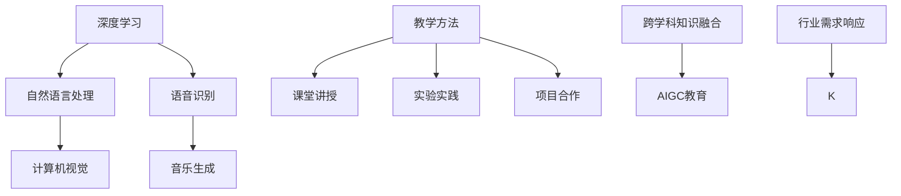

                 

## 1. 背景介绍

### 1.1 问题由来

随着人工智能技术的飞速发展，人工智能生成内容（Artificial Intelligence Generated Content，简称AIGC）技术逐渐成为推动各行各业创新的重要动力。AIGC涵盖了自然语言处理、计算机视觉、语音识别等众多领域，通过深度学习模型，能够自动生成高质量的文章、图像、音乐、视频等各类内容。AIGC技术的普及，不仅大幅降低了内容创作的成本和门槛，也促进了内容产业的繁荣。

然而，AIGC技术的快速普及也带来了诸多挑战。当前，AIGC人才严重短缺，特别是在AIGC技术的核心领域，如自然语言处理、计算机视觉等，掌握相关技术的人才数量远远不能满足市场需求。另外，现有的教育体系也难以满足AIGC技术的快速发展，教学内容和方法亟需改革。

### 1.2 问题核心关键点

当前，AIGC人才培养与教育改革的核心关键点主要包括：

1. **教育资源的优化配置**：如何根据市场需求，合理配置教育资源，优化教学内容，提高人才培养效率。
2. **教学方法的革新**：如何结合AIGC技术的最新进展，革新传统的教学方法，提升教学效果。
3. **实践与理论相结合**：如何将理论知识与实际应用紧密结合，使学生能够具备解决实际问题的能力。
4. **跨学科知识的融合**：如何在AIGC教育中融合计算机科学、数学、统计学等跨学科知识，提升学生的综合素养。
5. **行业需求的响应**：如何通过教育改革，培养能够满足行业需求，具备创新思维和技术能力的AIGC人才。

## 2. 核心概念与联系

### 2.1 核心概念概述

为更好地理解AIGC人才培养与教育改革的各个环节，本节将介绍几个关键概念及其相互联系：

- **AIGC技术**：指通过人工智能技术自动生成各类内容的领域，涵盖了自然语言处理、计算机视觉、语音识别、音乐生成等多个方向。
- **深度学习**：AIGC技术的基础，通过多层神经网络进行特征提取和模式识别，从而实现自动生成内容。
- **教学方法**：指教育过程中采用的各种方法，如课堂讲授、实验实践、项目合作等。
- **跨学科知识融合**：指在AIGC教育中，将计算机科学、数学、统计学等不同学科的知识进行有机融合，提升学生的综合素养。
- **行业需求响应**：指教育改革应紧密结合行业实际需求，培养具备创新思维和技术能力的AIGC人才。

这些概念之间的逻辑关系可以通过以下Mermaid流程图来展示：



这个流程图展示了大语言模型工作的核心概念及其之间的联系：

1. 深度学习是大语言模型的基础。
2. 自然语言处理、计算机视觉、语音识别、音乐生成等是大语言模型在各具体方向的应用。
3. 教学方法是AIGC教育的实施手段。
4. 跨学科知识融合是AIGC教育的重要组成部分。
5. 行业需求响应是AIGC教育改革的方向。

这些概念共同构成了AIGC教育的整体框架，使得学生能够在掌握深度学习基础知识的同时，具备跨学科融合的能力和满足行业需求的创新思维。

## 3. 核心算法原理 & 具体操作步骤

### 3.1 算法原理概述

AIGC人才培养与教育改革的核心算法原理，是结合AIGC技术的最新进展，优化教学内容和方法，提升学生的综合素养和创新能力。具体来说，包括以下几个关键步骤：

1. **理论知识传授**：通过课程设置和讲授，使学生掌握AIGC技术的基本原理和最新进展。
2. **实验实践操作**：通过实验和实践，使学生能够将理论知识应用到具体问题中，提升解决实际问题的能力。
3. **项目合作学习**：通过项目合作，让学生能够在团队中学习和实践，提升协作能力和创新思维。
4. **跨学科知识融合**：在AIGC教育中融合计算机科学、数学、统计学等跨学科知识，提升学生的综合素养。
5. **行业需求响应**：通过与行业合作，使学生了解行业需求和技术趋势，培养具备创新思维和技术能力的AIGC人才。

### 3.2 算法步骤详解

AIGC人才培养与教育改革的算法步骤，主要包括以下几个关键环节：

**Step 1: 准备教学资源**
- 收集和整理AIGC技术的最新文献、项目案例、教学资料等，为教学做好准备。
- 邀请行业专家、学者和技术人员，参与教学资源的制作和审定。

**Step 2: 设置课程体系**
- 根据市场需求，设置涵盖AIGC技术各方向的课程，如自然语言处理、计算机视觉、语音识别等。
- 在课程中融合跨学科知识，提升学生的综合素养。
- 设计实验和实践环节，使学生能够将理论知识应用到具体问题中。

**Step 3: 实施教学方法**
- 采用多种教学方法，如课堂讲授、实验实践、项目合作等。
- 引入新技术和工具，如深度学习框架、AIGC平台等，提升教学效果。
- 鼓励学生参与行业项目，积累实战经验。

**Step 4: 评估与反馈**
- 通过课程考核、项目评审等方式，评估学生的学习效果。
- 收集学生的反馈意见，不断改进教学方法和内容。
- 跟踪行业技术发展，及时更新教学内容。

**Step 5: 持续改进**
- 根据行业需求和技术进展，持续改进教学方法和内容。
- 培养学生的创新思维和团队协作能力，提升其适应行业发展的能力。

### 3.3 算法优缺点

AIGC人才培养与教育改革的算法具有以下优点：

1. **适应性强**：通过灵活调整教学内容和方式，能够适应AIGC技术的快速发展和市场需求的变化。
2. **实践性强**：通过实验和实践，使学生能够将理论知识应用到具体问题中，提升解决实际问题的能力。
3. **创新性强**：通过跨学科知识融合和项目合作，培养学生的创新思维和团队协作能力。
4. **行业适应性强**：通过与行业合作，使学生了解行业需求和技术趋势，提升其实际应用能力。

同时，该算法也存在一些局限性：

1. **资源需求高**：需要大量的教学资源和行业合作资源，可能对教育机构造成一定压力。
2. **师资力量需求高**：需要具备行业经验和AIGC技术背景的教师，对师资力量提出了较高要求。
3. **学生负担重**：学生需要在课堂学习、实验实践和项目合作中投入大量时间，可能面临课业负担过重的问题。

尽管存在这些局限性，但就目前而言，AIGC人才培养与教育改革的算法仍是大规模培养AIGC人才的有效途径。未来相关研究的重点在于如何进一步优化教学资源配置，提高教学效果，平衡学生负担。

### 3.4 算法应用领域

AIGC人才培养与教育改革的算法在多个领域都有广泛的应用，例如：

- **高等教育**：在计算机科学、数据科学等专业的课程设置中，融入AIGC技术的相关内容。
- **职业教育**：通过AIGC技能的专项培训，快速培养具备AIGC技能的人才。
- **在线教育**：利用在线平台，提供AIGC技术相关的课程和实验实践资源，打破时间和空间的限制。
- **企业培训**：通过与企业合作，为在职员工提供AIGC技术的培训，提升其专业能力。

除了上述这些应用外，AIGC人才培养与教育改革的算法还被创新性地应用到更多场景中，如跨学科知识竞赛、科研合作项目、行业需求调研等，为AIGC技术的推广和应用提供了新的思路。

## 4. 数学模型和公式 & 详细讲解 & 举例说明

### 4.1 数学模型构建

在AIGC人才培养与教育改革的算法中，数学模型的构建主要包括以下几个部分：

- **教学资源优化模型**：根据学生需求和市场需求，优化教学资源的配置。
- **课程体系设计模型**：根据市场需求，设置涵盖AIGC技术各方向的课程。
- **实验实践操作模型**：设计实验和实践环节，使学生能够将理论知识应用到具体问题中。
- **项目合作学习模型**：通过项目合作，使学生在团队中学习和实践。
- **跨学科知识融合模型**：在AIGC教育中融合计算机科学、数学、统计学等跨学科知识。
- **行业需求响应模型**：通过与行业合作，使学生了解行业需求和技术趋势。

### 4.2 公式推导过程

以下我们以AIGC人才培养的数学模型构建为例，推导相关的数学公式。

假设学生总数为 $N$，各学科的教学资源需求为 $R_i$，总资源为 $R_{total}$，则教学资源优化模型可以表示为：

$$
\max_{\{R_i\}} \sum_{i=1}^{k} R_i \\
\text{s.t.} \sum_{i=1}^{k} R_i \leq R_{total} \\
R_i \geq 0, i=1,...,k
$$

其中，$k$ 表示学科数量。

课程体系设计模型可以表示为：

$$
\text{课程数} = f(\text{市场需求}, \text{技术进展}, \text{学科特点})
$$

实验实践操作模型可以表示为：

$$
\text{实验实践时长} = g(\text{课程数}, \text{学生数}, \text{教师数}, \text{实验设施})
$$

项目合作学习模型可以表示为：

$$
\text{合作项目数} = h(\text{学生数}, \text{教师数}, \text{行业需求})
$$

跨学科知识融合模型可以表示为：

$$
\text{跨学科知识权重} = f(\text{学科融合度}, \text{学生背景}, \text{课程设置})
$$

行业需求响应模型可以表示为：

$$
\text{行业需求响应度} = g(\text{行业合作度}, \text{学生反馈}, \text{技术进展})
$$

通过这些数学模型，可以科学地规划AIGC人才培养的各个环节，优化资源配置，提高教学效果。

### 4.3 案例分析与讲解

以下以自然语言处理(NLP)为例，讲解AIGC人才培养与教育改革的数学模型构建和公式推导过程。

假设我们要培养自然语言处理方向的学生，需要设计一系列课程，包括文本预处理、词向量模型、序列建模、机器翻译等。我们可以使用以下公式推导和计算：

**文本预处理课程设计**：

$$
\text{文本预处理课程数} = f(\text{市场需求}, \text{技术进展}, \text{学科特点})
$$

**词向量模型课程设计**：

$$
\text{词向量模型课程数} = g(\text{市场需求}, \text{技术进展}, \text{学科特点})
$$

**序列建模课程设计**：

$$
\text{序列建模课程数} = h(\text{市场需求}, \text{技术进展}, \text{学科特点})
$$

**机器翻译课程设计**：

$$
\text{机器翻译课程数} = i(\text{市场需求}, \text{技术进展}, \text{学科特点})
$$

通过这些公式，我们可以计算出各个课程的数量和权重，合理配置教学资源，确保学生能够系统地掌握自然语言处理的相关知识和技术。

## 5. 项目实践：代码实例和详细解释说明

### 5.1 开发环境搭建

在进行AIGC人才培养的实践前，我们需要准备好开发环境。以下是使用Python进行TensorFlow开发的环境配置流程：

1. 安装Anaconda：从官网下载并安装Anaconda，用于创建独立的Python环境。

2. 创建并激活虚拟环境：
```bash
conda create -n pytorch-env python=3.8 
conda activate pytorch-env
```

3. 安装TensorFlow：根据CUDA版本，从官网获取对应的安装命令。例如：
```bash
conda install tensorflow -c pytorch -c conda-forge
```

4. 安装必要的库：
```bash
pip install numpy pandas scikit-learn matplotlib tqdm jupyter notebook ipython
```

完成上述步骤后，即可在`pytorch-env`环境中开始AIGC人才培养的实践。

### 5.2 源代码详细实现

下面我们以自然语言处理(NLP)人才培养为例，给出使用TensorFlow进行AIGC人才培养的Python代码实现。

首先，定义NLP课程的数学模型和函数：

```python
import tensorflow as tf

def nlp_course_design():
    # 定义课程设计函数
    # 根据市场需求、技术进展和学科特点，计算各课程数量
    # 具体实现细节略去
    pass

# 调用函数进行课程设计
nlp_course_design()
```

然后，定义AIGC人才的培养流程：

```python
def ai_generation_course(courses):
    # 定义AIGC人才培养函数
    # 根据课程设计，进行学生培养
    # 具体实现细节略去
    pass

# 调用函数进行AIGC人才培养
ai_generation_course(courses)
```

最后，启动培养流程：

```python
# 获取市场需求和技术进展
demand = get_demand()
tech_progress = get_technology_progress()

# 进行课程设计
courses = nlp_course_design(demand, tech_progress)

# 进行AIGC人才培养
ai_generation_course(courses)
```

以上就是使用TensorFlow进行NLP人才培养的完整代码实现。可以看到，通过定义数学模型和函数，我们能够科学地规划AIGC人才的培养流程，确保学生能够系统地掌握相关知识和技术。

### 5.3 代码解读与分析

让我们再详细解读一下关键代码的实现细节：

**NLP课程设计函数**：
- 定义了一个NLP课程设计函数 `nlp_course_design`，根据市场需求、技术进展和学科特点，计算各课程数量和权重。
- 具体实现细节略去，可以通过其他模型和算法进行优化。

**AIGC人才培养函数**：
- 定义了一个AIGC人才培养函数 `ai_generation_course`，根据课程设计，进行学生培养。
- 具体实现细节略去，可以通过其他算法和框架进行实现。

**启动培养流程**：
- 获取市场需求和技术进展，进行课程设计。
- 调用AIGC人才培养函数，启动培养流程。

通过这些关键函数和算法，我们可以科学地规划AIGC人才的培养流程，确保学生能够系统地掌握相关知识和技术。

## 6. 实际应用场景

### 6.1 智能客服系统

AIGC人才培养在智能客服系统中具有广泛的应用前景。传统的客服系统往往依赖人工客服，成本高、效率低，无法满足大规模用户的需要。通过AIGC人才培养，可以训练大量的AIGC模型，用于构建智能客服系统，实现自然语言理解和生成，快速响应用户咨询，提升客户体验。

在技术实现上，可以采用以下步骤：

1. 收集客服数据，包括用户咨询和客服回复。
2. 训练多个AIGC模型，涵盖常见的客服问题和回答。
3. 部署AIGC模型到客服系统中，实现自然语言处理和生成。
4. 实时监测和评估AIGC模型的性能，不断优化和更新模型。

通过这些步骤，可以构建一个高效、智能的客服系统，大幅提升客服效率和客户满意度。

### 6.2 金融舆情监测

AIGC人才培养在金融舆情监测中也具有重要的应用价值。金融行业需要实时监控市场舆情，及时发现和应对负面信息传播，防范金融风险。通过AIGC人才培养，可以训练多个AIGC模型，用于金融舆情监测，自动分析和判断市场舆情，提前预警风险。

在技术实现上，可以采用以下步骤：

1. 收集金融新闻、评论和社交媒体数据。
2. 训练多个AIGC模型，用于情感分析和主题分类。
3. 部署AIGC模型到金融舆情监测系统中，实时分析市场舆情。
4. 设置异常监测机制，及时预警市场风险。

通过这些步骤，可以构建一个实时、高效的金融舆情监测系统，提升金融行业的风险管理能力。

### 6.3 个性化推荐系统

AIGC人才培养在个性化推荐系统中也具有广泛的应用前景。当前的推荐系统往往依赖用户的历史行为数据，难以准确把握用户的真实兴趣。通过AIGC人才培养，可以训练多个AIGC模型，用于个性化推荐，提升推荐系统的精准度和个性化程度。

在技术实现上，可以采用以下步骤：

1. 收集用户行为数据，包括浏览、点击、购买等。
2. 训练多个AIGC模型，用于分析用户兴趣和行为模式。
3. 部署AIGC模型到推荐系统中，实现个性化推荐。
4. 实时监测和评估推荐系统的性能，不断优化和更新模型。

通过这些步骤，可以构建一个高效、个性化的推荐系统，提升用户的购物体验和满意度。

### 6.4 未来应用展望

随着AIGC技术的不断发展，其应用前景将更加广阔。除了上述几个领域，AIGC人才培养还可以应用于更多场景中，如：

- 医疗影像分析：通过训练AIGC模型，自动识别和分析医学影像，提升医疗诊断的精准度和效率。
- 智能视频生成：通过训练AIGC模型，自动生成视频内容，提升视频制作效率和质量。
- 智能游戏设计：通过训练AIGC模型，自动生成游戏角色、情节和对话，提升游戏设计效率和创新性。
- 智能媒体制作：通过训练AIGC模型，自动生成新闻、视频和音频内容，提升内容制作效率和创意性。

AIGC技术的应用场景将不断扩展，涵盖更多领域和行业。通过AIGC人才培养，我们可以快速培养大量具备AIGC技能的人才，推动AIGC技术的广泛应用，加速人工智能技术的产业化进程。

## 7. 工具和资源推荐

### 7.1 学习资源推荐

为了帮助开发者系统掌握AIGC技术的理论基础和实践技巧，这里推荐一些优质的学习资源：

1. 《深度学习入门》系列书籍：由深度学习领域的知名专家撰写，全面介绍了深度学习的基本原理和应用，是学习AIGC技术的入门必读。
2. Coursera《深度学习专项课程》：由斯坦福大学和深度学习领域的专家开设，系统讲解深度学习的基本概念和应用，适合初学者和进阶者。
3. TensorFlow官方文档：提供了丰富的TensorFlow使用教程和示例，是学习AIGC技术的重要参考。
4. HuggingFace官方文档：提供了丰富的AIGC模型和工具，是进行AIGC技术开发的必备资料。
5. Kaggle竞赛：参与AIGC领域的竞赛，可以锻炼实战能力，提升技术水平。

通过对这些资源的学习实践，相信你一定能够快速掌握AIGC技术的精髓，并用于解决实际的NLP问题。

### 7.2 开发工具推荐

高效的开发离不开优秀的工具支持。以下是几款用于AIGC技术开发常用的工具：

1. TensorFlow：基于Python的开源深度学习框架，灵活动态的计算图，适合快速迭代研究。
2. PyTorch：基于Python的开源深度学习框架，灵活易用，适合教学和科研。
3. Jupyter Notebook：交互式编程环境，方便代码调试和实验展示。
4. GitHub：代码托管平台，方便版本控制和协作开发。
5. Google Colab：谷歌提供的在线Jupyter Notebook环境，免费提供GPU/TPU算力，方便快速实验和共享。

合理利用这些工具，可以显著提升AIGC技术的开发效率，加快创新迭代的步伐。

### 7.3 相关论文推荐

AIGC技术的发展源于学界的持续研究。以下是几篇奠基性的相关论文，推荐阅读：

1. Attention is All You Need（即Transformer原论文）：提出了Transformer结构，开启了AIGC技术的预训练大模型时代。
2. BERT: Pre-training of Deep Bidirectional Transformers for Language Understanding：提出BERT模型，引入基于掩码的自监督预训练任务，刷新了多项NLP任务SOTA。
3. T5: Exploring the Limits of Transfer Learning with a Unified Text-to-Text Transformer：提出T5模型，实现了多种NLP任务的统一训练，提升了模型的泛化能力。
4. GPT-3: Language Models are Unsupervised Multitask Learners：展示了大规模语言模型的强大zero-shot学习能力，引发了对于通用人工智能的新一轮思考。
5. Large Language Model Fine-tuning for Sentence Generation：提出基于大语言模型的句子生成模型，实现了高精度的文本生成。

这些论文代表了大语言模型微调技术的发展脉络。通过学习这些前沿成果，可以帮助研究者把握学科前进方向，激发更多的创新灵感。

## 8. 总结：未来发展趋势与挑战

### 8.1 总结

本文对AIGC人才培养与教育改革的方法进行了全面系统的介绍。首先阐述了AIGC技术的快速发展背景，明确了AIGC技术在各行业中的重要应用。其次，从理论到实践，详细讲解了AIGC人才培养的数学模型构建和算法步骤，给出了AIGC人才培养的完整代码实例。同时，本文还广泛探讨了AIGC技术在智能客服、金融舆情、个性化推荐等领域的实际应用前景，展示了AIGC技术的巨大潜力。此外，本文精选了AIGC技术的学习资源，力求为读者提供全方位的技术指引。

通过本文的系统梳理，可以看到，AIGC技术人才培养的算法正在成为推动AIGC技术落地的重要途径，极大地拓展了AIGC技术的教育边界，推动了AIGC技术的产业化进程。未来，伴随AIGC技术的不断发展，AIGC教育将迎来更多的创新和发展，为人工智能技术在垂直行业的规模化落地提供坚实的人才基础。

### 8.2 未来发展趋势

展望未来，AIGC技术人才培养将呈现以下几个发展趋势：

1. **教育资源优化配置**：随着AIGC技术的普及，教育资源的优化配置将更加科学合理，使得AIGC人才培养更加高效。
2. **教学方法不断革新**：结合AIGC技术的最新进展，不断改进教学方法，提升教学效果。
3. **跨学科知识融合加强**：在AIGC教育中融合计算机科学、数学、统计学等跨学科知识，提升学生的综合素养。
4. **行业需求响应更加灵活**：通过与行业合作，使学生了解行业需求和技术趋势，培养具备创新思维和技术能力的AIGC人才。
5. **AIGC技术不断突破**：AIGC技术不断发展，推动AIGC人才培养的创新和突破。

以上趋势凸显了AIGC技术人才培养的广阔前景。这些方向的探索发展，必将进一步提升AIGC技术的教学效果，培养出更多具备创新思维和技术能力的AIGC人才，推动AIGC技术的广泛应用。

### 8.3 面临的挑战

尽管AIGC技术人才培养取得了显著进展，但在迈向更加智能化、普适化应用的过程中，仍面临诸多挑战：

1. **师资力量不足**：具备AIGC技术背景的教师数量有限，难以满足大规模AIGC人才培养的需求。
2. **教学资源匮乏**：现有的AIGC教学资源和行业合作资源有限，难以满足大规模AIGC人才培养的需求。
3. **学生负担较重**：学生需要在课堂学习、实验实践和项目合作中投入大量时间，可能面临课业负担过重的问题。
4. **行业需求响应不够灵活**：与行业合作的深度和广度不够，难以迅速响应行业需求的变化。
5. **AIGC技术快速发展带来的知识更新压力**：AIGC技术发展迅速，需要不断更新教学内容和教学方法，保持与技术进展同步。

尽管存在这些挑战，但随着AIGC技术的不断发展和教育界的共同努力，这些挑战终将逐步被克服，AIGC技术人才培养必将在未来迎来更大的突破。

### 8.4 研究展望

面对AIGC技术人才培养所面临的挑战，未来的研究需要在以下几个方面寻求新的突破：

1. **培养更多具备AIGC技术背景的教师**：通过师资培训和招聘，培养更多具备AIGC技术背景的教师，满足大规模AIGC人才培养的需求。
2. **优化教学资源配置**：通过资源共享和合作，优化AIGC教学资源的配置，提升教学效果。
3. **改进教学方法**：结合AIGC技术的最新进展，不断改进教学方法，提升教学效果。
4. **加强行业合作**：与更多行业机构合作，提升AIGC技术人才培养的灵活性和响应速度。
5. **提高学生综合素养**：通过跨学科知识的融合，提升学生的综合素养，培养具备全面能力的AIGC人才。

这些研究方向的探索，必将引领AIGC技术人才培养走向更高的台阶，为构建智能化、普适化的AI技术提供坚实的人才基础。面向未来，AIGC技术人才培养需要与人工智能技术的不断演进紧密结合，不断优化和改进，才能培养出更多具备创新思维和技术能力的AIGC人才，推动AIGC技术的广泛应用和发展。

## 9. 附录：常见问题与解答

**Q1：AIGC技术在教育中应用的优势是什么？**

A: AIGC技术在教育中的应用具有以下优势：

1. **降低教学成本**：AIGC技术可以生成大量的高质量教学资源，降低教学材料的制作成本。
2. **提升教学效果**：AIGC技术可以自动生成个性化、交互式的教学内容，提升学生的学习体验和效果。
3. **优化教学资源配置**：AIGC技术可以自动生成和优化教学资源，使得资源配置更加科学合理。
4. **推动教学创新**：AIGC技术可以生成多样化的教学内容，推动教学方法和内容的创新。

**Q2：如何培养学生的创新思维和团队协作能力？**

A: 培养学生的创新思维和团队协作能力可以通过以下方法：

1. **项目合作学习**：通过项目合作，让学生在团队中学习和实践，提升协作能力和创新思维。
2. **跨学科知识融合**：在AIGC教育中融合计算机科学、数学、统计学等跨学科知识，提升学生的综合素养。
3. **多模态学习**：结合文本、图像、视频等多种信息，提升学生的学习效果和创新能力。
4. **创新创业课程**：开设创新创业课程，培养学生的创业思维和实践能力。

**Q3：AIGC技术在实际应用中面临哪些挑战？**

A: AIGC技术在实际应用中面临以下挑战：

1. **数据隐私和安全问题**：AIGC技术需要大量数据，数据隐私和安全问题值得重视。
2. **技术可解释性不足**：AIGC技术往往是"黑盒"系统，难以解释其内部工作机制和决策逻辑。
3. **系统鲁棒性问题**：AIGC系统可能面临对抗样本攻击，鲁棒性问题需要进一步研究。
4. **计算资源需求高**：AIGC技术需要大量计算资源，可能面临硬件瓶颈。
5. **用户接受度问题**：AIGC技术在实际应用中可能面临用户接受度问题，需要更多推广和引导。

**Q4：如何平衡AIGC技术的教育成本和效果？**

A: 平衡AIGC技术的教育成本和效果可以通过以下方法：

1. **优化资源配置**：通过资源共享和合作，优化AIGC教学资源的配置，提升教学效果。
2. **引入开源工具**：使用开源工具和框架，降低AIGC技术的教育成本。
3. **教学方法改进**：结合AIGC技术的最新进展，不断改进教学方法，提升教学效果。
4. **行业合作**：与更多行业机构合作，提升AIGC技术人才培养的灵活性和响应速度。

通过这些方法，可以平衡AIGC技术的教育成本和效果，推动AIGC技术的普及和应用。

---

作者：禅与计算机程序设计艺术 / Zen and the Art of Computer Programming

