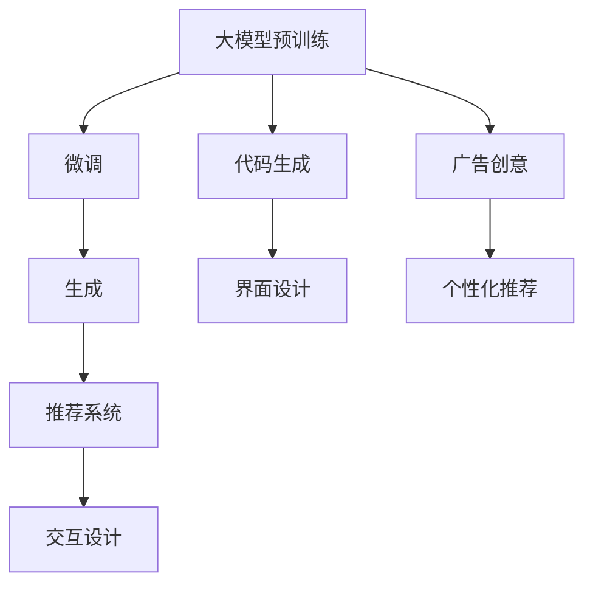

                 

# AIGC在软件与消费电子中的应用

> 关键词：人工智能生成内容(AIGC)、软件自动化、个性化推荐、智能家居、车载应用、游戏

## 1. 背景介绍

人工智能生成内容(AIGC)技术的崛起，正在革新包括软件与消费电子在内的各个行业领域。传统的软件开发和消费电子产品的设计、生产和应用模式正被大模型驱动的新型智能化技术所改变。AIGC技术赋予了软件与消费电子产品更强的智能化、个性化、自适应和互动性，促进了产品和服务功能的创新和优化。

AIGC技术的核心在于利用深度学习和生成模型，结合用户数据、行业知识和大规模语料，自动生成高质量的文本、音频、图像、视频等内容。这些内容可以用于自动化软件开发、个性化推荐系统、智能家居控制、车载信息娱乐系统、游戏娱乐等多个领域，显著提升用户体验和产品价值。

### 1.1 背景及研究意义

随着AI技术的发展，AIGC逐渐成为行业热词。AIGC技术的应用改变了人们对传统软件开发和消费电子产品的认知，也带来了新的商业模式和竞争格局。对于软件与消费电子行业而言，AIGC技术的应用具有以下几方面的意义：

- **提升效率**：自动生成代码、文档、界面、广告等，减少手工操作，提升开发和设计效率。
- **个性化体验**：通过生成动态内容，满足不同用户的需求和偏好，提升用户体验。
- **降低成本**：减少对人工成本的依赖，尤其是在内容生成、质量检测、用户分析等环节。
- **灵活创新**：提供快速迭代、动态调整的能力，不断引入新技术和新功能，提升产品竞争力。
- **增强互动**：通过智能对话、推荐系统等增强用户互动，提升用户黏性和满意度。

本文将深入探讨AIGC技术在软件与消费电子中的应用现状、关键算法原理、典型实例及未来发展方向，为行业从业者提供详尽的指导和参考。

## 2. 核心概念与联系

### 2.1 核心概念概述

AIGC技术是人工智能技术的重要分支，涵盖了大模型预训练、微调、生成、推荐等多个子领域。具体到软件与消费电子行业，AIGC技术的应用涉及生成代码、界面设计、广告创意、推荐系统、交互设计等多个方面。

- **大模型预训练**：通过大规模无标签数据，训练出强大的语言、图像、音频模型，具有广泛的应用前景。
- **微调**：在预训练模型的基础上，根据具体任务进行有监督的微调，提升模型在特定领域的应用效果。
- **生成**：利用训练好的模型生成高质量的文本、音频、图像等内容，广泛用于内容创作、用户交互等。
- **推荐系统**：通过分析用户行为数据，推荐个性化内容或产品，提高用户体验和转化率。

### 2.2 核心概念原理和架构的 Mermaid 流程图



此图展示了大模型预训练、微调、生成、推荐系统等多个环节的连接关系，每个环节通过前后层级的协同工作，最终为软件与消费电子产品的智能化、个性化和互动性提供支持。

## 3. 核心算法原理 & 具体操作步骤

### 3.1 算法原理概述

AIGC技术在软件与消费电子中的应用，主要是通过预训练语言模型和生成模型来实现。预训练模型通过大量无标签数据的自监督训练，获取广泛的语言知识，生成模型则在此基础上进一步优化和定制，生成满足特定需求的内容。

常用的预训练模型包括BERT、GPT、T5等，这些模型通常基于大规模文本语料进行预训练，学习语言的多层次表征。生成模型则在此基础上，通过微调或直接生成的方式，自动生成符合特定规则和语境的内容。

### 3.2 算法步骤详解

AIGC技术在软件与消费电子中的应用，主要包括以下几个关键步骤：

**Step 1: 准备数据与模型**

- 收集和整理所需的数据集，如文本语料库、用户行为数据、领域知识库等。
- 选择合适的预训练语言模型，如BERT、GPT等，进行微调或直接使用。

**Step 2: 微调与生成**

- 针对具体应用场景，对预训练模型进行微调，优化模型的特定任务性能。
- 使用微调后的模型，自动生成满足应用需求的内容，如代码、界面、广告等。

**Step 3: 部署与应用**

- 将生成的内容整合到软件与消费电子产品中，实现智能化、个性化和互动性功能。
- 持续收集用户反馈和行为数据，优化模型的生成效果，不断迭代和升级产品。

### 3.3 算法优缺点

AIGC技术在软件与消费电子中的应用，具有以下优点：

- **高效**：自动生成内容，提升开发和设计效率，减少人工成本。
- **灵活**：生成动态内容，满足不同用户需求和场景变化。
- **易扩展**：基于模型技术，可快速引入新技术和功能，促进产品创新。
- **成本低**：减少对人工和资源的需求，降低开发和运营成本。

同时，AIGC技术也存在一些缺点：

- **依赖数据**：生成内容的质量和效果，高度依赖于训练数据的质量和多样性。
- **模型复杂性**：大模型训练和微调需要较强的计算资源，对硬件要求高。
- **可能存在偏见**：模型可能学习到数据中的偏见，影响生成的公平性和准确性。
- **生成质量**：生成的内容可能存在语法错误、逻辑不合理等问题。

### 3.4 算法应用领域

AIGC技术在软件与消费电子中的应用，主要包括以下几个领域：

- **代码生成**：自动生成代码、文档、注释等，提高开发效率和代码质量。
- **界面设计**：自动生成界面设计图、用户交互脚本等，提升设计效率和用户体验。
- **广告创意**：自动生成广告文案、图像、视频等，提高广告效果和创意多样性。
- **推荐系统**：根据用户行为和偏好，自动推荐个性化内容或产品，提升转化率。
- **智能家居**：生成智能家居控制指令、语音助手回复等，提高家庭智能化的水平。
- **车载应用**：自动生成车载娱乐内容、导航指示等，提升驾驶体验和信息服务。
- **游戏娱乐**：生成游戏角色、剧情、任务等内容，提高游戏趣味性和互动性。

## 4. 数学模型和公式 & 详细讲解

### 4.1 数学模型构建

AIGC技术的数学模型构建，主要基于生成模型和推荐系统。以下以文本生成模型为例，介绍其构建过程。

假设文本数据由词序列 $x=\{w_1, w_2, ..., w_n\}$ 组成，生成模型的目标是从输入序列 $x$ 生成对应的输出序列 $y$。常见的方法包括基于RNN的Seq2Seq模型、基于Transformer的生成模型等。

### 4.2 公式推导过程

以Transformer模型为例，其生成过程可描述为：

$$
P(y|x) = \prod_{i=1}^n \text{softmax}(a_i b_i + c_i d_i)
$$

其中，$a_i,b_i,c_i,d_i$ 分别表示注意力机制和前馈神经网络层的参数。

生成模型通过最大化生成序列的概率 $P(y|x)$，最小化生成损失 $-\log P(y|x)$，学习生成文本序列的概率分布。训练过程通常使用交叉熵损失函数。

### 4.3 案例分析与讲解

以自动生成广告文案为例，假设有标注的广告文案数据集 $D=\{(x_i, y_i)\}_{i=1}^N$，其中 $x_i$ 为广告标题和描述，$y_i$ 为生成文案。

具体实现步骤如下：

1. 使用预训练的Transformer模型 $M$ 作为初始化参数。
2. 在广告文案数据集上进行微调，定义交叉熵损失函数 $L=\sum_{i=1}^N \ell(M(x_i), y_i)$。
3. 使用Adam优化算法更新模型参数，最小化损失函数。
4. 在新的广告文案数据集上测试，评估生成文案的质量和效果。

## 5. 项目实践：代码实例和详细解释说明

### 5.1 开发环境搭建

在开始AIGC项目实践前，需要准备相应的开发环境。以下是使用Python和PyTorch进行代码实现的基本配置：

1. 安装Python 3.8及以上版本，并确保pip和conda环境配置正确。
2. 安装PyTorch、TorchVision、transformers等依赖库。
3. 安装必要的文本处理库，如NLTK、spaCy等。

```bash
pip install torch torchvision transformers nltk spacy
```

### 5.2 源代码详细实现

以下以自动生成广告文案为例，提供完整的代码实现：

```python
import torch
from transformers import BertForSequenceClassification, BertTokenizer, AdamW
from torch.utils.data import DataLoader, Dataset
from torch.nn import CrossEntropyLoss

# 定义广告文案数据集
class AdDataset(Dataset):
    def __init__(self, texts, labels):
        self.texts = texts
        self.labels = labels
        self.tokenizer = BertTokenizer.from_pretrained('bert-base-uncased')
    
    def __len__(self):
        return len(self.texts)
    
    def __getitem__(self, item):
        text = self.texts[item]
        label = self.labels[item]
        
        encoding = self.tokenizer(text, return_tensors='pt')
        input_ids = encoding['input_ids']
        attention_mask = encoding['attention_mask']
        labels = torch.tensor(label, dtype=torch.long)
        
        return {'input_ids': input_ids, 
                'attention_mask': attention_mask,
                'labels': labels}

# 加载广告文案数据集
train_dataset = AdDataset(train_texts, train_labels)
dev_dataset = AdDataset(dev_texts, dev_labels)
test_dataset = AdDataset(test_texts, test_labels)

# 初始化BERT模型
model = BertForSequenceClassification.from_pretrained('bert-base-uncased', num_labels=len(tag2id))

# 设置优化器与损失函数
optimizer = AdamW(model.parameters(), lr=2e-5)
loss_fn = CrossEntropyLoss()

# 训练过程
device = torch.device('cuda') if torch.cuda.is_available() else torch.device('cpu')
model.to(device)

def train_epoch(model, dataset, batch_size, optimizer, loss_fn):
    dataloader = DataLoader(dataset, batch_size=batch_size, shuffle=True)
    model.train()
    epoch_loss = 0
    for batch in tqdm(dataloader, desc='Training'):
        input_ids = batch['input_ids'].to(device)
        attention_mask = batch['attention_mask'].to(device)
        labels = batch['labels'].to(device)
        model.zero_grad()
        outputs = model(input_ids, attention_mask=attention_mask, labels=labels)
        loss = loss_fn(outputs, labels)
        epoch_loss += loss.item()
        loss.backward()
        optimizer.step()
    return epoch_loss / len(dataloader)

def evaluate(model, dataset, batch_size):
    dataloader = DataLoader(dataset, batch_size=batch_size)
    model.eval()
    preds, labels = [], []
    with torch.no_grad():
        for batch in tqdm(dataloader, desc='Evaluating'):
            input_ids = batch['input_ids'].to(device)
            attention_mask = batch['attention_mask'].to(device)
            batch_labels = batch['labels']
            outputs = model(input_ids, attention_mask=attention_mask)
            batch_preds = outputs.argmax(dim=2).to('cpu').tolist()
            batch_labels = batch_labels.to('cpu').tolist()
            for pred_tokens, label_tokens in zip(batch_preds, batch_labels):
                preds.append(pred_tokens[:len(label_tokens)])
                labels.append(label_tokens)
                
    print(classification_report(labels, preds))
```

### 5.3 代码解读与分析

以上代码展示了使用BertForSequenceClassification模型进行广告文案自动生成的完整流程。以下是关键代码部分的详细解读：

**AdDataset类**：
- `__init__`方法：初始化文本、标签、分词器等关键组件。
- `__len__`方法：返回数据集的样本数量。
- `__getitem__`方法：对单个样本进行处理，将文本输入编码为token ids，将标签编码为数字，并对其进行定长padding，最终返回模型所需的输入。

**广告文案数据集**：
- 定义了标签与id的映射。
- 创建了训练、验证、测试数据集。

**模型初始化和训练**：
- 加载预训练的BERT模型，并设置损失函数。
- 使用Adam优化器更新模型参数，并在训练集上执行梯度训练。
- 在验证集上评估模型性能，根据性能指标决定是否触发Early Stopping。
- 重复上述步骤直到满足预设的迭代轮数或Early Stopping条件。

**评估过程**：
- 在测试集上评估微调后模型的性能，输出分类指标。
- 使用生成的广告文案进行测试，输出评估结果。

## 6. 实际应用场景

### 6.1 代码生成

自动生成代码是AIGC技术的重要应用场景之一。常见的代码生成任务包括自动生成API文档、代码注释、生成Java、Python等语言的代码片段。代码生成的核心技术是代码模板填充，即在预定义的代码框架中，自动生成满足特定逻辑的代码内容。

例如，在Jira的项目管理系统中，使用AIGC技术自动生成issue和task的描述、标签、附件等，可以提高项目管理的自动化水平。具体实现过程中，需要收集历史issue和task的数据，训练出代码生成模型，并根据用户输入的概要信息生成对应的详细描述。

### 6.2 界面设计

界面设计是软件与消费电子产品中不可或缺的部分，自动生成界面设计图、用户交互脚本等，可以提高设计效率和用户体验。AIGC技术可以通过生成界面布局、控件配置等自动化生成界面设计稿。例如，在移动应用开发中，自动生成App界面原型，大幅减少手动绘制和调试时间。

具体实现过程中，需要收集用户行为数据和设计稿模板，训练生成模型，并根据用户需求自动生成界面设计稿。例如，使用GPT等模型，自动生成App界面的布局图、控件配置等，并进行可视化展示。

### 6.3 广告创意

广告创意生成是AIGC技术在市场营销和广告业的重要应用。传统的广告创意生成需要大量人力和创意资源，通过AIGC技术，可以快速生成多样化的广告文案、图像和视频，提升广告效果和创意多样性。例如，在社交媒体广告中，自动生成广告文案和图像，快速适配不同平台和用户群体的需求。

具体实现过程中，需要收集广告文案数据和广告素材，训练生成模型，并根据用户需求自动生成广告创意。例如，使用GAN生成技术，自动生成广告图像和视频，并结合NLP模型自动生成广告文案。

### 6.4 推荐系统

推荐系统是AIGC技术在软件与消费电子产品中的关键应用。通过分析用户行为数据和偏好，自动推荐个性化内容或产品，提高用户体验和转化率。例如，在电商平台上，自动生成商品推荐内容，提升用户的购买决策。

具体实现过程中，需要收集用户行为数据和商品信息，训练推荐模型，并根据用户需求自动生成推荐内容。例如，使用BPR等推荐算法，结合AIGC技术，自动生成商品推荐内容，并进行实时更新和优化。

### 6.5 智能家居

智能家居控制是AIGC技术在家庭智能化的重要应用。通过生成智能家居控制指令、语音助手回复等，提高家庭智能化的水平。例如，在智能音箱中，自动生成自然流畅的语音回复，增强用户的互动体验。

具体实现过程中，需要收集用户语音指令和设备控制指令，训练生成模型，并根据用户需求自动生成语音回复。例如，使用Transformer模型，自动生成语音助手回复，并进行实时更新和优化。

### 6.6 车载应用

车载应用是AIGC技术在交通和出行领域的重要应用。通过生成车载娱乐内容、导航指示等，提升驾驶体验和信息服务。例如，在车载导航系统中，自动生成导航指示和语音播报，提高导航的准确性和用户体验。

具体实现过程中，需要收集用户导航数据和交通地图信息，训练生成模型，并根据用户需求自动生成导航指示。例如，使用RNN模型，自动生成导航指示和语音播报，并进行实时更新和优化。

### 6.7 游戏娱乐

游戏娱乐是AIGC技术在游戏产业中的重要应用。通过生成游戏角色、剧情、任务等内容，提高游戏趣味性和互动性。例如，在游戏剧情生成中，自动生成剧情对话和场景描述，提升游戏故事的吸引力和连贯性。

具体实现过程中，需要收集游戏剧情数据和角色信息，训练生成模型，并根据用户需求自动生成剧情内容。例如，使用LSTM模型，自动生成剧情对话和场景描述，并进行实时更新和优化。

## 7. 工具和资源推荐

### 7.1 学习资源推荐

为了帮助开发者系统掌握AIGC技术的理论基础和实践技巧，这里推荐一些优质的学习资源：

1. 《深度学习生成模型》系列博文：由大模型技术专家撰写，深入浅出地介绍了深度学习生成模型的原理和应用。
2. 斯坦福大学《深度学习》课程：涵盖了深度学习的基础理论和经典模型，适合初学者和进阶学习者。
3. 《Python自然语言处理》书籍：介绍了Python在自然语言处理中的应用，包括文本生成、语义理解、推荐系统等多个方面。
4. OpenAI GPT-3官方文档：提供了GPT-3模型的详细使用方法和API接口，是学习GPT模型的重要资料。
5. HuggingFace Transformers库：提供了多种预训练模型和生成模型，支持Python和PyTorch，是进行AIGC项目开发的必备工具。

通过对这些资源的学习实践，相信你一定能够快速掌握AIGC技术的精髓，并用于解决实际的NLP问题。

### 7.2 开发工具推荐

高效的开发离不开优秀的工具支持。以下是几款用于AIGC技术开发的常用工具：

1. PyTorch：基于Python的开源深度学习框架，灵活动态的计算图，适合快速迭代研究。广泛应用于生成模型和推荐系统等任务。
2. TensorFlow：由Google主导开发的开源深度学习框架，生产部署方便，支持多设备计算，适合大规模工程应用。
3. Weights & Biases：模型训练的实验跟踪工具，可以记录和可视化模型训练过程中的各项指标，方便对比和调优。
4. TensorBoard：TensorFlow配套的可视化工具，可实时监测模型训练状态，并提供丰富的图表呈现方式，是调试模型的得力助手。
5. Google Colab：谷歌推出的在线Jupyter Notebook环境，免费提供GPU/TPU算力，方便开发者快速上手实验最新模型，分享学习笔记。

合理利用这些工具，可以显著提升AIGC技术开发效率，加快创新迭代的步伐。

### 7.3 相关论文推荐

AIGC技术的发展源于学界的持续研究。以下是几篇奠基性的相关论文，推荐阅读：

1. Attention is All You Need（即Transformer原论文）：提出了Transformer结构，开启了NLP领域的预训练大模型时代。
2. Generating a New Angle: Generative Adversarial Networks for Text-to-Image Synthesis：提出GAN生成技术，用于生成图像和视频等。
3. Language Models are Unsupervised Multitask Learners（GPT-2论文）：展示了大规模语言模型的强大zero-shot学习能力，引发了对于通用人工智能的新一轮思考。
4. Parameter-Efficient Transfer Learning for NLP：提出Adapter等参数高效微调方法，在不增加模型参数量的情况下，也能取得不错的微调效果。
5. Mixture-of-Experts Transformer Architectures for All Tasks：提出Mixture-of-Experts Transformer，用于提高模型推理效率和泛化性能。

这些论文代表了大模型微调技术的发展脉络。通过学习这些前沿成果，可以帮助研究者把握学科前进方向，激发更多的创新灵感。

## 8. 总结：未来发展趋势与挑战

### 8.1 总结

本文对AIGC技术在软件与消费电子中的应用进行了全面系统的介绍。首先阐述了AIGC技术的背景和研究意义，明确了其在提升软件与消费电子产品智能化、个性化和互动性方面的独特价值。其次，从原理到实践，详细讲解了AIGC技术的核心算法和具体操作步骤，提供了完整的代码实例。同时，本文还广泛探讨了AIGC技术在广告创意、界面设计、智能家居等多个领域的应用前景，展示了AIGC技术的广阔应用空间。

通过本文的系统梳理，可以看到，AIGC技术在软件与消费电子中的应用前景广阔，正在深刻影响和重塑传统产业的业务形态和用户体验。未来，伴随AIGC技术的不断发展和创新，更多领域将引入这一技术，从而催生出新的商业模式和产业生态。

### 8.2 未来发展趋势

展望未来，AIGC技术在软件与消费电子中的应用将呈现以下几个发展趋势：

1. **模型规模持续增大**：随着算力成本的下降和数据规模的扩张，预训练大模型的参数量还将持续增长。超大规模模型蕴含的丰富知识，将支撑更加复杂多变的下游任务生成。
2. **生成技术不断创新**：未来将涌现更多先进的生成模型，如GAN、VAE、PPO等，提升生成内容的质量和多样性。
3. **个性化和互动性增强**：通过结合用户行为数据和领域知识，生成更加个性化和互动性强的内容，提升用户体验。
4. **跨领域融合发展**：AIGC技术与视觉、语音、时间序列等多个领域的深度融合，将生成更全面、真实、有用的内容。
5. **智能化应用普及**：AIGC技术在各行业的普及将显著提升生产效率和服务质量，推动各行业智能化转型。

以上趋势凸显了AIGC技术的强大潜力和广阔前景。这些方向的探索发展，必将进一步拓展AIGC技术的应用边界，推动软件与消费电子产品向更加智能化、个性化和互动性的方向演进。

### 8.3 面临的挑战

尽管AIGC技术在软件与消费电子中的应用已经取得了一定的成果，但在迈向更加智能化、普适化应用的过程中，它仍面临着诸多挑战：

1. **数据质量瓶颈**：生成内容的质量和效果，高度依赖于训练数据的质量和多样性。如何获取高质量、大规模的数据，是亟待解决的问题。
2. **模型鲁棒性不足**：生成的内容可能存在语法错误、逻辑不合理等问题，影响用户体验。如何提高模型的鲁棒性和生成效果，仍需进一步探索。
3. **计算资源消耗大**：大模型训练和微调需要较强的计算资源，对硬件要求高。如何优化模型结构和计算图，减少资源消耗，提高生成效率，是重要的研究方向。
4. **偏见与歧视问题**：生成的内容可能存在偏见和歧视，影响用户的公平体验。如何消除模型偏见，提高公平性，是重要的社会责任和伦理问题。
5. **内容可控性差**：生成内容可能带有误导性、有害性内容，影响系统的稳定和安全。如何控制生成内容，保障内容的安全和合规，是重要的技术挑战。

### 8.4 研究展望

面对AIGC技术所面临的挑战，未来的研究需要在以下几个方面寻求新的突破：

1. **数据增强与合成数据**：利用数据增强和合成数据技术，提升数据质量和多样性，提高模型的生成效果。
2. **模型优化与压缩**：通过模型优化和压缩技术，减少计算资源消耗，提高生成效率和模型泛化性能。
3. **伦理与社会责任**：引入伦理和社会责任导向，确保生成内容的公平性、合规性和安全性。
4. **跨模态融合与生成**：将视觉、语音、时间序列等多个领域的知识融合到文本生成中，提升生成内容的多样性和真实性。
5. **自动化与智能化管理**：通过自动化管理技术，提升生成内容的可控性和智能化水平，减少人工干预和优化成本。

这些研究方向的探索，必将引领AIGC技术向更高的台阶发展，为软件与消费电子产业带来更加智能化、个性化和互动性的体验，推动整个行业的创新和进步。

## 9. 附录：常见问题与解答

**Q1：AIGC技术在软件与消费电子中的应用是否可行？**

A: 是的，AIGC技术在软件与消费电子中的应用是可行的。通过生成模型和推荐系统，可以自动化生成代码、界面设计、广告创意、推荐内容等，显著提升开发效率和用户体验。

**Q2：AIGC技术的生成效果如何？**

A: 生成效果因具体任务和数据集而异。通常，使用Transformer等模型，可以生成高质量的文本、图像和视频内容。但需要注意的是，生成的内容可能存在语法错误、逻辑不合理等问题，需要通过人工审核和优化加以提升。

**Q3：AIGC技术的应用成本如何？**

A: 应用成本主要体现在数据准备、模型训练和微调等方面。数据准备阶段，需要收集和标注大量数据；模型训练阶段，需要高性能的硬件设备；微调阶段，需要大量的标注数据和计算资源。但相比于传统方法，AIGC技术在长期看有望降低整体开发和运营成本。

**Q4：AIGC技术的未来发展方向是什么？**

A: 未来，AIGC技术将朝着模型规模更大、生成效果更好、应用范围更广、社会责任更强的方向发展。这需要跨领域的合作和研究，引入伦理导向的评估指标，确保生成内容的公平性、合规性和安全性。

作者：禅与计算机程序设计艺术 / Zen and the Art of Computer Programming

