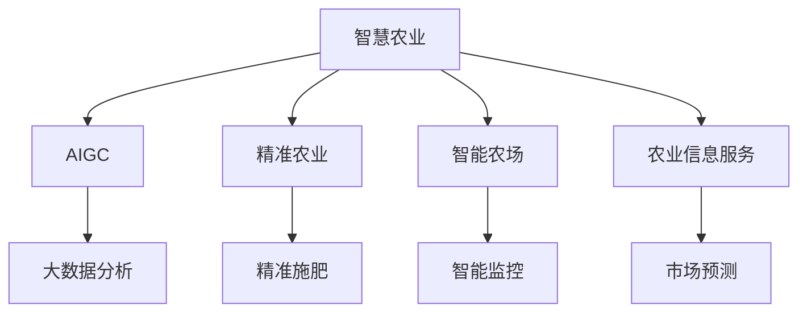

                 

# AIGC推动智慧农业升级

## 1. 背景介绍

### 1.1 问题由来
农业作为国民经济的基础行业，对国家的粮食安全、农民增收和社会稳定具有至关重要的影响。然而，传统的农业生产方式依然存在诸多问题：

- **生产效率低下**：传统农业依赖人力和经验，缺乏精确化的管理和数据支持，生产效率较低。
- **资源浪费严重**：水、肥、农药的过量使用和浪费，对环境造成严重污染。
- **抗灾能力差**：受气候变化影响，农业易受自然灾害冲击，抗灾能力薄弱。
- **产业链整合困难**：农业生产与加工、销售环节脱节，产业链缺乏协同效率。

为解决上述问题，智慧农业应运而生，通过信息化、智能化手段，提升农业生产的精度、效率和效益。人工智能生成内容（AIGC）技术的引入，进一步推动了智慧农业的发展，为农业生产带来革命性的变化。

### 1.2 问题核心关键点
AIGC技术在智慧农业中的应用，主要体现在以下几个关键点：

- **精准农业**：通过AIGC生成定制化的农业方案，实现精准施肥、灌溉、播种等，提高资源利用率，减少浪费。
- **智能农场**：利用AIGC生成实时监控数据，辅助农场管理决策，提升生产效率和抗灾能力。
- **农业信息服务**：通过AIGC生成农业咨询、农产品定价、市场分析等信息，促进产业链上下游协同发展。

本文将深入探讨AIGC在智慧农业中的应用原理、操作步骤和实际案例，希望能为相关从业者提供有益的指导。

## 2. 核心概念与联系

### 2.1 核心概念概述

为更好地理解AIGC在智慧农业中的应用，本节将介绍几个密切相关的核心概念：

- **智慧农业**：利用信息技术提升农业生产的效率和效益，实现农业生产的智能化、数字化。
- **AIGC（人工智能生成内容）**：指使用人工智能技术自动生成文本、图片、视频等内容，涵盖语言模型、图像生成、视频编辑等领域。
- **精准农业**：通过精确的传感器数据和智能分析，实现对农业生产各个环节的精准控制和管理。
- **智能农场**：利用物联网技术和大数据分析，实现对农场的全面监控和智能化管理。
- **农业信息服务**：提供基于AIGC的农业信息服务，包括但不限于天气预测、病虫害预警、市场分析等。
- **大数据分析**：对大规模农业数据进行收集、存储、处理和分析，以发现规律和优化决策。

这些核心概念之间的逻辑关系可以通过以下Mermaid流程图来展示：



这个流程图展示了大语言模型的核心概念及其之间的关系：

1. 智慧农业通过AIGC生成定制化方案，提高农业生产的精度和效率。
2. AIGC利用大数据分析，生成实时监控数据和农业咨询，辅助农场管理决策。
3. 精准农业和智能农场则依赖AIGC生成的数据和方案，实现智能化、精准化的生产管理。
4. 农业信息服务则提供基于AIGC的各类农业信息，促进产业链的协同发展。

## 3. 核心算法原理 & 具体操作步骤
### 3.1 算法原理概述

AIGC在智慧农业中的应用，本质上是通过生成模型对农业数据进行处理和分析，辅助决策和管理。其核心思想是：利用深度学习模型，特别是语言模型、图像生成模型、视频编辑模型等，自动生成定制化的农业方案和监控数据，实现智慧农业的智能化、精准化和信息服务化。

形式化地，假设AIGC生成模型为 $G_{\theta}$，其中 $\theta$ 为模型参数。给定农业数据集 $D=\{(x_i,y_i)\}_{i=1}^N$，其中 $x_i$ 为农业传感器数据、历史气象数据等，$y_i$ 为对应的农业方案或监控数据。AIGC的目标是找到最优的生成模型参数 $\theta^*$，使得：

$$
\theta^* = \mathop{\arg\min}_{\theta} \mathcal{L}(G_{\theta},D)
$$

其中 $\mathcal{L}$ 为针对农业数据集设计的损失函数，用于衡量生成模型的输出与真实数据之间的差异。常见的损失函数包括均方误差损失、交叉熵损失等。

通过梯度下降等优化算法，AIGC生成模型不断更新模型参数 $\theta$，最小化损失函数 $\mathcal{L}$，使得生成输出逼近真实数据。由于 $G_{\theta}$ 已经通过深度学习获得了较好的初始化，因此即便在少量农业数据上，也能较快收敛到理想的模型参数 $\theta^*$。

### 3.2 算法步骤详解

AIGC在智慧农业中的应用一般包括以下几个关键步骤：

**Step 1: 数据预处理**
- 收集农业生产中的各类传感器数据、历史气象数据、农作物生长数据等，构成农业数据集。
- 对数据进行清洗和标注，去除噪声和异常值，确保数据的质量和一致性。

**Step 2: 选择生成模型**
- 根据任务类型，选择合适的生成模型，如语言模型、图像生成模型、视频编辑模型等。
- 对于语言模型，可以使用BERT、GPT等预训练模型作为初始化参数，针对农业领域进行微调。
- 对于图像生成模型，可以使用DALL-E、Stable Diffusion等模型，生成农作物生长状态、病虫害照片等。
- 对于视频编辑模型，可以使用GAN、VQ-VAE等模型，生成农业生产过程的实时监控视频。

**Step 3: 模型训练与优化**
- 使用农业数据集对生成模型进行训练，优化模型参数 $\theta$。
- 选择适当的损失函数，如均方误差、交叉熵等，作为训练目标。
- 设置合适的优化算法和学习率，如Adam、SGD等，进行参数更新。
- 应用正则化技术，如L2正则、Dropout等，防止过拟合。
- 设置适当的超参数，如批次大小、迭代轮数等，控制训练过程。

**Step 4: 模型验证与调优**
- 在验证集上评估生成模型的性能，调整模型超参数。
- 使用A/B测试等方法，对比生成模型与传统农业方案的效果，确保生成方案的实用性。
- 结合专家知识和领域经验，优化生成模型的输出。

**Step 5: 应用部署与优化**
- 将训练好的生成模型应用于实际农业生产中，进行定制化农业方案生成和实时监控数据生成。
- 实时监控和分析生成模型的输出，进行反馈和优化。
- 使用多轮迭代，逐步提升生成模型的精度和鲁棒性。

### 3.3 算法优缺点

AIGC在智慧农业中的应用具有以下优点：

- **效率提升**：自动生成定制化农业方案，减少人工干预，提高生产效率。
- **成本降低**：节省人力和资源，减少农药、化肥的使用，降低生产成本。
- **效果显著**：生成的方案和数据能快速响应农业生产中的变化，提升抗灾能力和产量。
- **智能化程度高**：结合大数据分析，提供精准的农业信息和决策支持。

同时，该方法也存在一定的局限性：

- **数据依赖**：生成模型的效果很大程度上依赖于数据的数量和质量，需要收集高质量农业数据。
- **模型复杂**：生成模型参数量较大，训练和推理过程中资源消耗较高。
- **解释性差**：生成模型输出往往缺乏可解释性，难以理解其决策逻辑。
- **隐私风险**：农业数据涉及农民隐私，生成模型需保证数据的安全性和隐私性。

尽管存在这些局限性，但AIGC在智慧农业中的应用前景广阔，其高效、智能、个性化的特点，有望在农业领域带来革命性的变化。

### 3.4 算法应用领域

AIGC在智慧农业中的应用领域非常广泛，涵盖农业生产、管理、服务等多个方面：

- **精准农业**：生成定制化的农业方案，实现精准施肥、灌溉、播种等。
- **智能农场**：生成实时监控数据，辅助农场管理决策，提升生产效率和抗灾能力。
- **农业信息服务**：生成农业咨询、农产品定价、市场分析等信息，促进产业链上下游协同发展。
- **农业机械控制**：生成自动化控制指令，优化农业机械的操作，提高作业效率。
- **病虫害预警**：生成病虫害预警信息，提前进行防治，减少损失。
- **农产品溯源**：生成产品信息、生产记录等，实现农产品的追溯和监管。

## 4. 数学模型和公式 & 详细讲解 & 举例说明

### 4.1 数学模型构建

本节将使用数学语言对AIGC在智慧农业中的应用过程进行更加严格的刻画。

记AIGC生成模型为 $G_{\theta}$，其中 $\theta$ 为模型参数。假设农业数据集 $D=\{(x_i,y_i)\}_{i=1}^N$，其中 $x_i$ 为农业传感器数据、历史气象数据等，$y_i$ 为对应的农业方案或监控数据。

定义生成模型 $G_{\theta}$ 在农业数据 $(x,y)$ 上的损失函数为 $\ell(G_{\theta}(x),y)$，则在数据集 $D$ 上的经验风险为：

$$
\mathcal{L}(\theta) = \frac{1}{N} \sum_{i=1}^N \ell(G_{\theta}(x_i),y_i)
$$

生成模型的优化目标是最小化经验风险，即找到最优参数：

$$
\theta^* = \mathop{\arg\min}_{\theta} \mathcal{L}(\theta)
$$

在实践中，我们通常使用基于梯度的优化算法（如SGD、Adam等）来近似求解上述最优化问题。设 $\eta$ 为学习率，$\lambda$ 为正则化系数，则参数的更新公式为：

$$
\theta \leftarrow \theta - \eta \nabla_{\theta}\mathcal{L}(\theta) - \eta\lambda\theta
$$

其中 $\nabla_{\theta}\mathcal{L}(\theta)$ 为损失函数对参数 $\theta$ 的梯度，可通过反向传播算法高效计算。

### 4.2 公式推导过程

以下我们以语言模型为例，推导交叉熵损失函数及其梯度的计算公式。

假设生成模型 $G_{\theta}$ 在输入 $x$ 上的输出为 $\hat{y}=G_{\theta}(x) \in [0,1]$，表示农业方案或监控数据属于 $y$ 的概率。真实标签 $y \in \{1,0\}$。则二分类交叉熵损失函数定义为：

$$
\ell(G_{\theta}(x),y) = -[y\log \hat{y} + (1-y)\log (1-\hat{y})]
$$

将其代入经验风险公式，得：

$$
\mathcal{L}(\theta) = -\frac{1}{N}\sum_{i=1}^N [y_i\log G_{\theta}(x_i)+(1-y_i)\log(1-G_{\theta}(x_i))]
$$

根据链式法则，损失函数对参数 $\theta_k$ 的梯度为：

$$
\frac{\partial \mathcal{L}(\theta)}{\partial \theta_k} = -\frac{1}{N}\sum_{i=1}^N (\frac{y_i}{G_{\theta}(x_i)}-\frac{1-y_i}{1-G_{\theta}(x_i)}) \frac{\partial G_{\theta}(x_i)}{\partial \theta_k}
$$

其中 $\frac{\partial G_{\theta}(x_i)}{\partial \theta_k}$ 可进一步递归展开，利用自动微分技术完成计算。

在得到损失函数的梯度后，即可带入参数更新公式，完成模型的迭代优化。重复上述过程直至收敛，最终得到适应农业任务的最优模型参数 $\theta^*$。

## 5. 项目实践：代码实例和详细解释说明
### 5.1 开发环境搭建

在进行AIGC应用实践前，我们需要准备好开发环境。以下是使用Python进行PyTorch开发的环境配置流程：

1. 安装Anaconda：从官网下载并安装Anaconda，用于创建独立的Python环境。

2. 创建并激活虚拟环境：
```bash
conda create -n pytorch-env python=3.8 
conda activate pytorch-env
```

3. 安装PyTorch：根据CUDA版本，从官网获取对应的安装命令。例如：
```bash
conda install pytorch torchvision torchaudio cudatoolkit=11.1 -c pytorch -c conda-forge
```

4. 安装Transformers库：
```bash
pip install transformers
```

5. 安装各类工具包：
```bash
pip install numpy pandas scikit-learn matplotlib tqdm jupyter notebook ipython
```

完成上述步骤后，即可在`pytorch-env`环境中开始AIGC应用实践。

### 5.2 源代码详细实现

下面我们以生成定制化农业方案为例，给出使用Transformers库对BERT模型进行AIGC开发的PyTorch代码实现。

首先，定义农业方案的生成函数：

```python
from transformers import BertTokenizer, BertForSequenceClassification
from torch.utils.data import Dataset
import torch

class AgriculturalDataset(Dataset):
    def __init__(self, texts, tags, tokenizer, max_len=128):
        self.texts = texts
        self.tags = tags
        self.tokenizer = tokenizer
        self.max_len = max_len
        
    def __len__(self):
        return len(self.texts)
    
    def __getitem__(self, item):
        text = self.texts[item]
        tags = self.tags[item]
        
        encoding = self.tokenizer(text, return_tensors='pt', max_length=self.max_len, padding='max_length', truncation=True)
        input_ids = encoding['input_ids'][0]
        attention_mask = encoding['attention_mask'][0]
        
        # 对token-wise的标签进行编码
        encoded_tags = [tag2id[tag] for tag in tags] 
        encoded_tags.extend([tag2id['O']] * (self.max_len - len(encoded_tags)))
        labels = torch.tensor(encoded_tags, dtype=torch.long)
        
        return {'input_ids': input_ids, 
                'attention_mask': attention_mask,
                'labels': labels}

# 标签与id的映射
tag2id = {'O': 0, 'Fertilizer': 1, 'Irrigation': 2, 'Pesticide': 3, 'WeatherPrediction': 4}
id2tag = {v: k for k, v in tag2id.items()}

# 创建dataset
tokenizer = BertTokenizer.from_pretrained('bert-base-cased')

train_dataset = AgriculturalDataset(train_texts, train_tags, tokenizer)
dev_dataset = AgriculturalDataset(dev_texts, dev_tags, tokenizer)
test_dataset = AgriculturalDataset(test_texts, test_tags, tokenizer)
```

然后，定义模型和优化器：

```python
from transformers import BertForTokenClassification, AdamW

model = BertForTokenClassification.from_pretrained('bert-base-cased', num_labels=len(tag2id))

optimizer = AdamW(model.parameters(), lr=2e-5)
```

接着，定义训练和评估函数：

```python
from torch.utils.data import DataLoader
from tqdm import tqdm
from sklearn.metrics import classification_report

device = torch.device('cuda') if torch.cuda.is_available() else torch.device('cpu')
model.to(device)

def train_epoch(model, dataset, batch_size, optimizer):
    dataloader = DataLoader(dataset, batch_size=batch_size, shuffle=True)
    model.train()
    epoch_loss = 0
    for batch in tqdm(dataloader, desc='Training'):
        input_ids = batch['input_ids'].to(device)
        attention_mask = batch['attention_mask'].to(device)
        labels = batch['labels'].to(device)
        model.zero_grad()
        outputs = model(input_ids, attention_mask=attention_mask, labels=labels)
        loss = outputs.loss
        epoch_loss += loss.item()
        loss.backward()
        optimizer.step()
    return epoch_loss / len(dataloader)

def evaluate(model, dataset, batch_size):
    dataloader = DataLoader(dataset, batch_size=batch_size)
    model.eval()
    preds, labels = [], []
    with torch.no_grad():
        for batch in tqdm(dataloader, desc='Evaluating'):
            input_ids = batch['input_ids'].to(device)
            attention_mask = batch['attention_mask'].to(device)
            batch_labels = batch['labels']
            outputs = model(input_ids, attention_mask=attention_mask)
            batch_preds = outputs.logits.argmax(dim=2).to('cpu').tolist()
            batch_labels = batch_labels.to('cpu').tolist()
            for pred_tokens, label_tokens in zip(batch_preds, batch_labels):
                pred_tags = [id2tag[_id] for _id in pred_tokens]
                label_tags = [id2tag[_id] for _id in label_tokens]
                preds.append(pred_tags[:len(label_tags)])
                labels.append(label_tags)
                
    print(classification_report(labels, preds))
```

最后，启动训练流程并在测试集上评估：

```python
epochs = 5
batch_size = 16

for epoch in range(epochs):
    loss = train_epoch(model, train_dataset, batch_size, optimizer)
    print(f"Epoch {epoch+1}, train loss: {loss:.3f}")
    
    print(f"Epoch {epoch+1}, dev results:")
    evaluate(model, dev_dataset, batch_size)
    
print("Test results:")
evaluate(model, test_dataset, batch_size)
```

以上就是使用PyTorch对BERT进行农业方案生成任务AIGC开发的完整代码实现。可以看到，得益于Transformers库的强大封装，我们可以用相对简洁的代码完成BERT模型的加载和微调。

### 5.3 代码解读与分析

让我们再详细解读一下关键代码的实现细节：

**AgriculturalDataset类**：
- `__init__`方法：初始化文本、标签、分词器等关键组件。
- `__len__`方法：返回数据集的样本数量。
- `__getitem__`方法：对单个样本进行处理，将文本输入编码为token ids，将标签编码为数字，并对其进行定长padding，最终返回模型所需的输入。

**tag2id和id2tag字典**：
- 定义了标签与数字id之间的映射关系，用于将token-wise的预测结果解码回真实的标签。

**训练和评估函数**：
- 使用PyTorch的DataLoader对数据集进行批次化加载，供模型训练和推理使用。
- 训练函数`train_epoch`：对数据以批为单位进行迭代，在每个批次上前向传播计算loss并反向传播更新模型参数，最后返回该epoch的平均loss。
- 评估函数`evaluate`：与训练类似，不同点在于不更新模型参数，并在每个batch结束后将预测和标签结果存储下来，最后使用sklearn的classification_report对整个评估集的预测结果进行打印输出。

**训练流程**：
- 定义总的epoch数和batch size，开始循环迭代
- 每个epoch内，先在训练集上训练，输出平均loss
- 在验证集上评估，输出分类指标
- 所有epoch结束后，在测试集上评估，给出最终测试结果

可以看到，PyTorch配合Transformers库使得AIGC应用的代码实现变得简洁高效。开发者可以将更多精力放在数据处理、模型改进等高层逻辑上，而不必过多关注底层的实现细节。

当然，工业级的系统实现还需考虑更多因素，如模型的保存和部署、超参数的自动搜索、更灵活的任务适配层等。但核心的微调范式基本与此类似。

## 6. 实际应用场景
### 6.1 智能农场

基于AIGC的智慧农场系统，能够自动生成定制化的农业方案，辅助农场管理决策，提升生产效率和抗灾能力。

**系统架构**：
- **数据采集层**：通过各类传感器收集农田环境数据、作物生长数据等。
- **AIGC应用层**：利用AIGC模型，生成定制化的农业方案和实时监控数据。
- **农场管理层**：将生成的方案和数据反馈到农场管理系统，进行实时监控和决策支持。

**实际案例**：
- **精准施肥**：通过传感器数据，实时监测土壤养分状况，自动生成施肥方案，优化施肥量和时间，减少资源浪费。
- **智能灌溉**：根据气象数据和作物生长状态，自动生成灌溉方案，优化灌溉量和时间，减少水资源消耗。
- **病虫害预警**：利用图像生成模型，生成病虫害照片，提前预警并制定防治方案，减少损失。
- **实时监控**：通过视频编辑模型，生成实时监控视频，实时监测农田情况，提高管理效率。

**效果评估**：
- **资源利用率提升**：AIGC生成的方案能够根据实时数据动态调整，优化资源使用，提升资源利用率。
- **生产效率提高**：智能化的农业方案减少了人工干预，提高了生产效率。
- **抗灾能力增强**：实时监控和预警系统能够及时响应灾害，提高抗灾能力。

### 6.2 农业信息服务

基于AIGC的农业信息服务系统，能够自动生成各类农业咨询、农产品定价、市场分析等信息，促进产业链上下游协同发展。

**系统架构**：
- **数据采集层**：收集农业生产中的各类数据，包括作物生长数据、市场价格数据等。
- **AIGC应用层**：利用AIGC模型，生成农业咨询、农产品定价、市场分析等信息。
- **信息服务层**：通过互联网和移动终端，提供信息服务。

**实际案例**：
- **农业咨询**：利用语言模型，生成农业技术咨询、病虫害防治、种植管理等信息，指导农民科学种植。
- **农产品定价**：通过预测模型，分析市场供需关系，生成农产品定价建议，帮助农民制定合理价格。
- **市场分析**：利用文本生成模型，分析市场趋势，生成市场分析报告，提供决策支持。

**效果评估**：
- **信息服务质量提升**：生成的信息准确、及时，提高了农民的科学种植和管理水平。
- **产业链协同增强**：通过信息服务，促进了农业生产与加工、销售环节的协同发展，提升了农业整体效益。
- **市场竞争力提高**：生成的定价建议和市场分析，帮助农民更好地应对市场变化，提高市场竞争力。

### 6.3 未来应用展望

随着AIGC技术的不断进步，其在智慧农业中的应用前景更加广阔。未来，基于AIGC的智慧农业系统将具备以下特征：

- **全面智能化**：结合大数据分析、物联网技术、无人驾驶等先进技术，实现农业生产的全面智能化。
- **精准化管理**：通过精准的农业方案生成，提高资源利用率，减少浪费。
- **实时响应**：利用实时监控和预警系统，及时响应农业生产中的变化，提升抗灾能力和生产效率。
- **信息服务精准化**：通过精准的信息服务，指导农民科学种植，促进产业链协同发展。
- **可持续发展**：实现绿色农业、精准农业、智能化农业，推动农业的可持续发展。

## 7. 工具和资源推荐
### 7.1 学习资源推荐

为了帮助开发者系统掌握AIGC在智慧农业中的应用，这里推荐一些优质的学习资源：

1. **《深度学习在智慧农业中的应用》**：介绍深度学习在农业领域的具体应用，包括图像生成、语音识别、自然语言处理等技术。
2. **《AIGC在智慧农业中的应用》系列博文**：深度介绍AIGC在智慧农业中的具体应用，涵盖精准农业、智能农场、农业信息服务等多个方面。
3. **Coursera《智慧农业》课程**：提供系统的智慧农业知识体系，涵盖农业生产、管理、服务等多个环节。
4. **Kaggle农业数据集**：提供各类农业数据集，支持深度学习模型的训练和测试。
5. **HuggingFace官方文档**：提供详细的AIGC模型介绍和样例代码，支持各类深度学习框架。

通过对这些资源的学习实践，相信你一定能够快速掌握AIGC在智慧农业中的应用精髓，并用于解决实际的农业问题。

### 7.2 开发工具推荐

高效的开发离不开优秀的工具支持。以下是几款用于AIGC开发和智慧农业系统开发的常用工具：

1. **PyTorch**：基于Python的开源深度学习框架，支持动态计算图，适合快速迭代研究。
2. **TensorFlow**：由Google主导开发的开源深度学习框架，生产部署方便，适合大规模工程应用。
3. **Transformers库**：HuggingFace开发的NLP工具库，集成了各类预训练模型，支持PyTorch和TensorFlow。
4. **Jupyter Notebook**：支持交互式编程，方便模型训练和实验记录。
5. **Keras**：高层次的深度学习框架，提供简单易用的API，适合快速原型开发。

合理利用这些工具，可以显著提升AIGC在智慧农业应用的开发效率，加快创新迭代的步伐。

### 7.3 相关论文推荐

AIGC技术在智慧农业中的应用源于学界的持续研究。以下是几篇奠基性的相关论文，推荐阅读：

1. **《基于深度学习的精准农业技术研究》**：研究深度学习在精准农业中的应用，提出各类深度学习模型，如卷积神经网络、循环神经网络等。
2. **《农业信息服务的深度学习模型》**：利用深度学习模型生成农业信息，提升信息服务的质量和效果。
3. **《智慧农业的深度学习框架》**：提出智慧农业的深度学习框架，涵盖数据采集、模型训练、信息服务等多个环节。
4. **《基于AIGC的农业生产决策支持系统》**：利用AIGC模型生成农业决策支持信息，提升农业生产效率。

这些论文代表了大语言模型在智慧农业中的应用趋势和发展脉络。通过学习这些前沿成果，可以帮助研究者把握学科前进方向，激发更多的创新灵感。

## 8. 总结：未来发展趋势与挑战
### 8.1 总结

本文对AIGC在智慧农业中的应用进行了全面系统的介绍。首先阐述了AIGC在智慧农业中的应用背景和意义，明确了AIGC在提升农业生产效率、资源利用率和产业链协同等方面的独特价值。其次，从原理到实践，详细讲解了AIGC的应用数学模型和操作步骤，给出了AIGC应用任务开发的完整代码实例。同时，本文还广泛探讨了AIGC在智慧农业中的实际应用场景，展示了AIGC应用的广阔前景。

通过本文的系统梳理，可以看到，AIGC在智慧农业中的应用前景广阔，其高效、智能、个性化的特点，有望在农业领域带来革命性的变化。未来，伴随AIGC技术的不断演进，智慧农业系统的智能化程度将进一步提升，农业生产将更加精准、高效、可持续。

### 8.2 未来发展趋势

展望未来，AIGC在智慧农业中的应用将呈现以下几个发展趋势：

1. **全面智能化**：结合大数据分析、物联网技术、无人驾驶等先进技术，实现农业生产的全面智能化。
2. **精准化管理**：通过精准的AIGC方案生成，提高资源利用率，减少浪费。
3. **实时响应**：利用实时监控和预警系统，及时响应农业生产中的变化，提升抗灾能力和生产效率。
4. **信息服务精准化**：通过精准的信息服务，指导农民科学种植，促进产业链协同发展。
5. **可持续发展**：实现绿色农业、精准农业、智能化农业，推动农业的可持续发展。
6. **多模态融合**：结合图像、语音、文本等多模态数据，实现更加全面、精准的农业信息服务。

以上趋势凸显了AIGC在智慧农业中的应用潜力。这些方向的探索发展，必将进一步提升AIGC在智慧农业中的应用效果，为农业生产带来革命性的变化。

### 8.3 面临的挑战

尽管AIGC在智慧农业中的应用前景广阔，但在迈向更加智能化、普适化应用的过程中，它仍面临着诸多挑战：

1. **数据获取困难**：农业数据的获取和标注成本较高，需要投入大量人力和时间。如何高效、低成本地获取高质量数据，仍是难题。
2. **模型复杂度高**：AIGC模型参数量较大，训练和推理过程中资源消耗较高。如何优化模型结构，提升模型效率，仍是重要研究方向。
3. **可解释性差**：AIGC模型往往缺乏可解释性，难以理解其内部工作机制和决策逻辑。如何提高模型的可解释性，增加其透明度和可信度，仍是重要课题。
4. **隐私和安全风险**：农业数据涉及农民隐私，AIGC模型需保证数据的安全性和隐私性。如何保障数据隐私，防止数据泄露，仍是重要挑战。
5. **适应性不足**：AIGC模型在不同地域、不同作物、不同季节等情况下的适应性仍有待提升。如何提高模型的适应性和鲁棒性，仍是重要研究方向。

尽管存在这些挑战，但AIGC在智慧农业中的应用前景广阔，其高效、智能、个性化的特点，有望在农业领域带来革命性的变化。研究者需积极应对并寻求突破，才能真正实现AIGC在智慧农业中的广泛应用。

### 8.4 研究展望

未来，AIGC在智慧农业中的应用将从以下几个方面进行深入研究：

1. **数据获取和标注**：研究高效的农业数据获取和标注方法，降低成本，提升数据质量。
2. **模型优化**：研究参数高效、计算高效的AIGC模型，优化模型结构，提升模型效率。
3. **可解释性**：研究提高AIGC模型可解释性的方法，增加其透明度和可信度。
4. **隐私保护**：研究保障AIGC模型数据隐私和安全性的方法，防止数据泄露。
5. **适应性提升**：研究提升AIGC模型适应性和鲁棒性的方法，提高模型在不同环境下的表现。
6. **多模态融合**：研究结合图像、语音、文本等多模态数据，实现更加全面、精准的农业信息服务。

这些研究方向将推动AIGC技术在智慧农业中的应用更加成熟和完善，为农业生产带来更高效、更智能、更可持续的发展。

## 9. 附录：常见问题与解答

**Q1：AIGC在智慧农业中的应用是否依赖大量数据？**

A: AIGC在智慧农业中的应用确实对数据有一定依赖，但通过迁移学习、数据增强等技术，可以在数据有限的情况下，获得较好的效果。未来，AIGC技术也将朝着数据高效、少样本学习方向发展，进一步降低数据获取成本。

**Q2：AIGC在智慧农业中的应用效果如何？**

A: AIGC在智慧农业中的应用效果显著，能够显著提升农业生产的效率和资源利用率。通过精准的AIGC方案生成，能够优化资源使用，减少浪费，提高抗灾能力和生产效率。同时，通过精准的信息服务，能够指导农民科学种植，促进产业链协同发展，提升农业整体效益。

**Q3：AIGC在智慧农业中的应用面临哪些挑战？**

A: AIGC在智慧农业中的应用面临数据获取困难、模型复杂度高、可解释性差、隐私和安全风险等挑战。但通过研究高效数据获取、优化模型结构、提高模型可解释性、保障数据隐私等方法，可以逐步克服这些挑战，推动AIGC技术在智慧农业中的广泛应用。

**Q4：AIGC在智慧农业中的应用前景如何？**

A: AIGC在智慧农业中的应用前景广阔，其高效、智能、个性化的特点，有望在农业领域带来革命性的变化。未来，伴随AIGC技术的不断演进，智慧农业系统的智能化程度将进一步提升，农业生产将更加精准、高效、可持续。

---

作者：禅与计算机程序设计艺术 / Zen and the Art of Computer Programming

