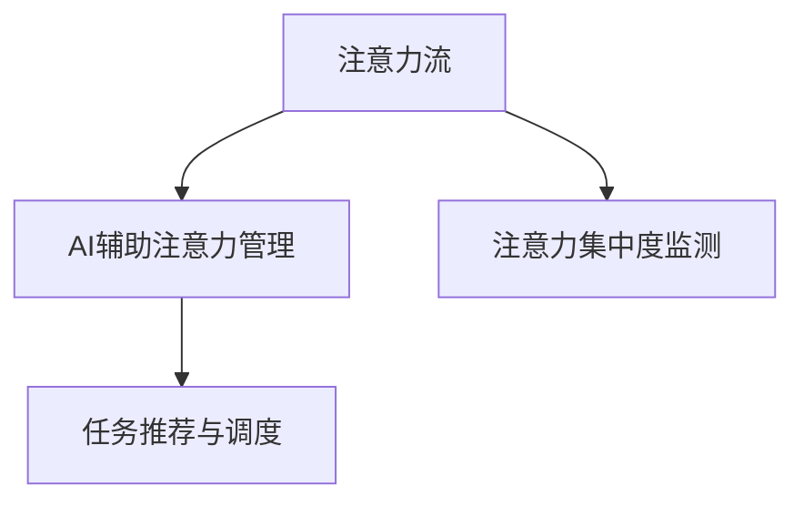

                 

# AI与人类注意力流：未来的工作、技能与注意力流管理技术的应用前景趋势分析预测

## 1. 背景介绍

随着人工智能技术的飞速发展，AI与人类注意力流的关系也成为了一个备受关注的话题。AI技术不仅能辅助人类进行决策，还能通过分析人类注意力流，帮助优化工作和学习效率，提升个人能力。本文将探讨AI与人类注意力流之间的关系，分析其在未来的工作、技能和注意力流管理技术中的应用前景和趋势。

## 2. 核心概念与联系

### 2.1 核心概念概述

为更好地理解AI与人类注意力流的关系，本节将介绍几个关键概念：

- **注意力流**：人类在进行工作、学习等活动时，注意力会在不同任务、信息或对象间不断流动，形成了一种动态的、非线性的信息处理模式。
- **AI辅助注意力管理**：利用AI技术，如机器学习、自然语言处理等，帮助人类更好地管理注意力流，提高效率和效果。
- **注意力集中度监测**：通过生理传感器、脑电图等手段，实时监测人类注意力集中度的变化，以优化任务安排和时间分配。
- **任务推荐与调度**：根据人类当前注意力状态和目标任务，AI系统能够推荐最合适的任务或调整任务执行的优先级，以最大化效率和效果。

这些核心概念通过以下Mermaid流程图来展示其联系：



### 2.2 核心概念原理和架构

注意力流是认知心理学的核心概念之一，指人类注意力在任务、信息源之间的动态分布。AI辅助注意力管理，则是通过算法和大数据分析，对人类注意力流进行优化和控制，以提高工作和学习效率。

注意力集中度监测，通常采用生理信号分析技术，如脑电图(EEG)、眼动追踪等手段，实时测量人类注意力集中度的变化，帮助识别注意力分散、疲劳等状态。

任务推荐与调度，则是通过模型学习人类注意力与任务之间的关联，推荐最合适的任务或调整任务执行的优先级，以实现时间管理和任务优化。

## 3. 核心算法原理 & 具体操作步骤

### 3.1 算法原理概述

AI与人类注意力流的结合，涉及生理信号处理、机器学习、自然语言处理等多领域的算法。核心算法原理主要包括以下几个方面：

- **注意力集中度监测算法**：通过生理信号分析技术，提取人类注意力集中度的特征，使用机器学习模型进行实时监测和预测。
- **注意力流分析算法**：使用自然语言处理技术，分析文本、语音等数据，提取注意力流的模式和趋势。
- **任务推荐与调度算法**：结合注意力流分析和任务相关性，设计优化算法，推荐最佳任务或调整任务执行顺序。

### 3.2 算法步骤详解

1. **数据采集**：使用生理信号传感器、脑电图(EEG)、眼动追踪等设备，采集人类注意力集中度的数据。
2. **特征提取**：通过时域和频域分析等技术，从采集到的数据中提取注意力集中度的特征。
3. **模型训练**：使用机器学习算法，如支持向量机(SVM)、神经网络等，训练注意力集中度监测模型。
4. **注意力流分析**：利用自然语言处理技术，分析人类在任务之间的注意力流模式，如任务切换频率、集中时间等。
5. **任务推荐与调度**：结合注意力流分析结果，设计任务推荐与调度的算法，如线性规划、遗传算法等，优化任务执行顺序和优先级。

### 3.3 算法优缺点

AI辅助注意力管理具有以下优点：

- **实时监测**：能够实时监测人类注意力集中度，帮助及时调整工作和学习状态。
- **个性化优化**：通过个性化分析，推荐最适合的任务，优化时间管理。
- **减少疲劳**：避免过度疲劳，提升工作效率和学习效果。

同时，也存在一些缺点：

- **数据隐私问题**：生理信号监测涉及个人隐私，如何保护数据安全是一个重要问题。
- **模型误差**：注意力监测和分析的模型可能存在误差，影响推荐的准确性。
- **用户接受度**：需要用户接受并配合，才能真正实现注意力管理的优化效果。

### 3.4 算法应用领域

AI辅助注意力管理技术在多个领域都有广泛的应用前景：

- **教育**：通过分析学生的注意力流，为教师提供个性化教学建议，优化课堂管理。
- **职场**：帮助员工管理时间，提升工作效率，优化工作流程。
- **医疗**：监测病人的注意力集中度，辅助治疗和康复。
- **游戏**：根据玩家注意力流，优化游戏体验，提升游戏乐趣和挑战性。

## 4. 数学模型和公式 & 详细讲解 & 举例说明

### 4.1 数学模型构建

假设有一个简单的注意力集中度监测模型，输入为当前任务T和注意力集中度特征X，输出为推荐的任务Y。则该模型的数学模型为：

$$
Y = f(X, T; \theta)
$$

其中，$f$为模型函数，$\theta$为模型参数。

### 4.2 公式推导过程

以线性回归模型为例，推导注意力集中度监测的数学公式。假设模型的输入特征为$x_1, x_2, ..., x_n$，输出为$y$，则线性回归模型可以表示为：

$$
y = \sum_{i=1}^{n} \beta_i x_i + \alpha
$$

其中，$\beta_i$为权重，$\alpha$为截距。

通过最小二乘法，求解$\beta_i$和$\alpha$：

$$
\beta = (X^T X)^{-1} X^T y
$$

$$
\alpha = \bar{y} - X \beta
$$

其中，$\bar{y}$为$y$的均值。

### 4.3 案例分析与讲解

假设有一个学习者的注意力集中度数据，使用线性回归模型进行训练，得到权重$\beta$和截距$\alpha$。模型预测学习者当前最适合进行的任务，如阅读、写作或休息。根据模型的输出，教师可以调整教学计划，优化学生的学习效果。

## 5. 项目实践：代码实例和详细解释说明

### 5.1 开发环境搭建

在进行AI与人类注意力流结合的开发实践前，需要准备以下开发环境：

1. 安装Python：确保Python版本为3.6及以上。
2. 安装必要的依赖包：使用pip安装numpy、pandas、scikit-learn等包。
3. 数据采集设备：选用生理信号传感器、脑电图(EEG)设备等。

### 5.2 源代码详细实现

以下是一个简单的注意力集中度监测模型实现的代码示例：

```python
import numpy as np
from sklearn.linear_model import LinearRegression

# 假设采集到的人类注意力集中度数据
x = np.array([[0.3, 0.5], [0.7, 0.2], [0.4, 0.8], [0.1, 0.4]])

# 假设对应任务的类型
y = np.array([1, 0, 1, 0])

# 创建线性回归模型
model = LinearRegression()

# 训练模型
model.fit(x, y)

# 预测当前注意力集中度对应的任务
new_x = np.array([[0.6, 0.3]])
prediction = model.predict(new_x)
print(prediction)
```

### 5.3 代码解读与分析

上述代码使用了scikit-learn库中的线性回归模型，对人类注意力集中度数据进行训练，并预测新的注意力集中度对应的任务类型。

- `x`：输入的注意力集中度特征，这里以二维数组形式表示。
- `y`：对应的任务类型，这里以0和1表示两种任务。
- `model.fit(x, y)`：训练模型。
- `model.predict(new_x)`：预测新的注意力集中度对应的任务类型。

## 6. 实际应用场景

### 6.1 智能学习助手

在教育领域，AI辅助注意力管理技术可以用于智能学习助手的开发。智能学习助手能够实时监测学生的注意力集中度，根据注意力流分析结果，推荐最合适的学习任务，优化学习计划，提升学习效果。

### 6.2 远程工作优化

在职场中，远程工作的员工面临诸多挑战，如时间管理、任务调度等。AI辅助注意力管理技术可以帮助员工管理时间，推荐最佳任务，优化工作流程，提升工作效率。

### 6.3 医疗康复辅助

在医疗领域，AI辅助注意力管理技术可以用于监测病人的注意力集中度，辅助治疗和康复。通过分析注意力流模式，识别注意力分散等状态，及时调整治疗方案。

### 6.4 未来应用展望

未来，AI辅助注意力管理技术将在更多领域得到应用，为人类生活带来便利。例如：

- **智能家居**：根据用户的注意力集中度，智能家居系统能够自动调整环境参数，提升生活舒适度。
- **智能交通**：通过监测驾驶员的注意力集中度，优化交通控制，减少交通事故。
- **虚拟现实**：根据用户的注意力流，优化虚拟现实体验，提升沉浸感和互动性。

## 7. 工具和资源推荐

### 7.1 学习资源推荐

为了帮助开发者掌握AI与人类注意力流结合的技术，以下是一些推荐的资源：

1. **《深度学习与认知心理学》**：该书详细介绍了深度学习在认知心理学中的应用，包括注意力流监测和分析。
2. **Kaggle竞赛**：Kaggle上有多项与注意力监测相关的竞赛，可以参与实践，提升技能。
3. **在线课程**：Coursera、Udacity等平台上有相关的深度学习、认知心理学等课程，有助于理解技术原理。

### 7.2 开发工具推荐

以下是一些常用的AI与人类注意力流结合的开发工具：

1. **Python**：Python是开发AI与注意力流管理技术的常用语言，生态丰富，功能强大。
2. **TensorFlow**：用于构建深度学习模型的开源框架，适合大规模数据处理和模型训练。
3. **PyTorch**：深度学习框架，灵活性高，适合快速迭代实验。
4. **Scikit-learn**：简单易用的机器学习库，支持多种算法和模型。

### 7.3 相关论文推荐

以下是几篇具有代表性的相关论文：

1. **《AI辅助注意力管理的综述》**：概述了AI辅助注意力管理的原理、方法和应用场景。
2. **《注意力流分析的新进展》**：讨论了注意力流的最新研究进展，介绍了多种注意力流分析方法。
3. **《基于深度学习的注意力集中度监测》**：提出了一种基于深度学习的注意力集中度监测模型，并进行了实验验证。

## 8. 总结：未来发展趋势与挑战

### 8.1 研究成果总结

本文对AI与人类注意力流的结合进行了详细探讨，包括注意力流监测、分析和管理的技术原理和应用场景。研究表明，AI技术可以显著提升人类注意力流管理的效率和效果，具有广泛的应用前景。

### 8.2 未来发展趋势

未来，AI与人类注意力流结合技术的发展趋势如下：

- **多模态融合**：结合视觉、听觉、触觉等多种模态信息，更全面地监测和分析注意力流。
- **个性化优化**：通过个性化数据分析，提供更加精准的任务推荐和调度。
- **实时化应用**：实现实时监测和优化，提升用户体验。

### 8.3 面临的挑战

尽管AI与人类注意力流结合技术具有广阔的应用前景，但仍面临以下挑战：

- **数据隐私问题**：如何保护用户的生理数据隐私，是关键挑战之一。
- **算法鲁棒性**：注意力监测和分析算法需要具备较高的鲁棒性，避免数据噪声和模型误差。
- **用户接受度**：如何提高用户对注意力管理技术的接受度，是另一大挑战。

### 8.4 研究展望

未来，需要在以下几个方面进行进一步研究：

- **多模态数据融合**：研究如何更全面地整合多种模态信息，提升注意力流分析的准确性。
- **隐私保护技术**：开发更加安全的隐私保护技术，保护用户数据隐私。
- **用户友好界面**：设计更加友好易用的用户界面，提高用户的使用体验。

总之，AI与人类注意力流结合技术正处于快速发展阶段，其应用前景广阔。通过技术创新和实践应用，相信该技术将为人类生活带来更多便利和效率提升。

## 9. 附录：常见问题与解答

**Q1: 如何保护用户的生理数据隐私？**

A: 保护用户隐私是AI与人类注意力流结合技术的核心挑战之一。具体措施包括：
1. **数据匿名化**：对采集到的数据进行匿名化处理，去除个人身份信息。
2. **访问控制**：对生理信号采集设备进行严格控制，确保只有授权人员可以访问数据。
3. **数据加密**：使用加密技术保护数据的存储和传输安全。

**Q2: 注意力监测模型的误差来源有哪些？**

A: 注意力监测模型的误差来源主要包括以下几个方面：
1. **生理信号采集误差**：生理信号采集设备的精度和稳定性会影响监测结果的准确性。
2. **数据处理误差**：信号处理和特征提取过程中可能存在误差，导致特征不准确。
3. **模型训练误差**：模型训练过程中可能存在过拟合或欠拟合，导致模型泛化能力不足。

**Q3: 如何提高用户对注意力管理技术的接受度？**

A: 提高用户对注意力管理技术的接受度，可以从以下几个方面入手：
1. **用户体验设计**：设计友好易用的用户界面，让用户易于理解和操作。
2. **个性化推荐**：根据用户的个性化需求，提供个性化的任务推荐和调度。
3. **透明性**：向用户解释技术原理和应用场景，增加透明度和信任感。

**Q4: 多模态数据融合在注意力流分析中有何优势？**

A: 多模态数据融合在注意力流分析中具有以下优势：
1. **全面监测**：结合视觉、听觉、触觉等多种模态信息，更全面地监测和分析注意力流。
2. **增强鲁棒性**：通过多模态数据融合，减少单一模态数据的噪声和误差，提高监测的鲁棒性。
3. **提升准确性**：多模态数据融合可以提供更加准确的注意力流分析结果，提升任务推荐的准确性。

**Q5: 未来AI与人类注意力流结合技术的主要研究方向有哪些？**

A: 未来AI与人类注意力流结合技术的主要研究方向包括：
1. **隐私保护技术**：开发更加安全的隐私保护技术，保护用户数据隐私。
2. **多模态数据融合**：研究如何更全面地整合多种模态信息，提升注意力流分析的准确性。
3. **用户友好界面**：设计更加友好易用的用户界面，提高用户的使用体验。

---

作者：禅与计算机程序设计艺术 / Zen and the Art of Computer Programming

