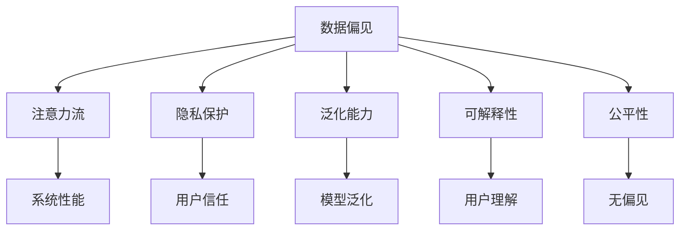

                 

## 1. 背景介绍

### 1.1 问题由来

随着人工智能(AI)技术的快速发展，AI系统在多个领域得到广泛应用。AI系统不仅能处理大量数据，还能在复杂环境中进行决策，逐渐展现出超越人类的能力。然而，AI系统背后的人机交互模式，特别是注意力流分配机制，引发了广泛的伦理和社会关注。

注意力流(Attention Flow)，是指在AI系统中，数据和任务处理过程中的信息流向和注意力分配。注意力流分配得当，可以显著提升AI系统的处理效率和决策准确性。但同时，错误的注意力分配可能导致数据偏见、模型过拟合、隐私泄露等问题，引发社会担忧。

### 1.2 问题核心关键点

当前，AI系统在注意力流分配上主要存在以下问题：

- **数据偏见**：AI系统基于大量标注数据进行训练，如果这些数据存在偏见，AI系统也会反映出同样的偏见。例如，人脸识别算法在处理少数族裔时，精度往往不如处理白人。

- **隐私泄露**：AI系统通常需要收集和处理大量个人数据，如人脸、语音、行为等，如果没有妥善处理这些数据，就可能发生隐私泄露。

- **模型泛化能力不足**：AI模型在训练数据外的新数据上，往往表现不如训练数据集，即出现"过拟合"现象。

- **公平性和可解释性不足**：AI模型的决策过程往往是"黑盒"的，难以解释其内部工作机制，从而缺乏透明度和可解释性。

### 1.3 问题研究意义

研究和解决AI系统中的注意力流分配问题，对确保AI系统的公正、透明和隐私安全至关重要。具体而言，研究目标包括：

- **提高数据质量**：减少AI系统的数据偏见，提高模型对多类数据的泛化能力。
- **保护隐私**：避免隐私数据泄露，确保用户数据的安全。
- **增强可解释性**：提升AI模型的透明度，使决策过程可解释，增强用户信任。
- **促进公平**：确保AI系统的决策过程公正、无偏见，避免算法歧视。

## 2. 核心概念与联系

### 2.1 核心概念概述

为更好地理解注意力流分配问题，本节将介绍几个密切相关的核心概念：

- **注意力流(Attention Flow)**：指AI系统在处理任务过程中，信息流向和注意力分配的路径。注意力流的好坏直接影响AI系统的性能和公平性。
- **数据偏见(Bias)**：指数据集中存在的结构性偏差，如性别、种族、地域等，这些偏差在AI模型中可能被放大或反映。
- **隐私保护(Privacy)**：指在数据处理过程中，保护用户隐私不受侵犯，防止数据泄露和滥用。
- **泛化能力(Generalization)**：指AI模型在新数据上的表现，泛化能力强的模型在各种数据上都能保持良好表现。
- **可解释性(Explainability)**：指AI模型的决策过程可被解释，用户可以理解模型如何做出决策。
- **公平性(Fairness)**：指AI模型对不同群体的处理结果，应尽可能公平，避免算法歧视。

这些核心概念之间的逻辑关系可以通过以下Mermaid流程图来展示：



这个流程图展示了大语言模型的核心概念及其之间的关系：

1. 数据偏见影响注意力流的质量，进而影响系统的性能和公平性。
2. 隐私保护是保护用户数据安全的必要措施，与注意力流紧密相关。
3. 泛化能力强的模型能够更好地处理未知数据，提高系统的鲁棒性。
4. 可解释性帮助用户理解模型决策过程，增强用户信任。
5. 公平性确保AI模型对不同群体的公平处理，避免算法歧视。

这些概念共同构成了AI系统设计的基础，确保AI系统在多方面达到最优性能。

## 3. 核心算法原理 & 具体操作步骤

### 3.1 算法原理概述

基于注意力流分配的AI系统，旨在通过合理分配注意力流，最大化数据利用效率，提升系统的性能和公平性。其核心思想是：在数据处理和任务推理过程中，合理引导注意力流，使其集中于关键信息，避免被不相关数据干扰。

### 3.2 算法步骤详解

基于注意力流分配的AI系统一般包括以下几个关键步骤：

**Step 1: 数据预处理**
- 对原始数据进行清洗、去噪、归一化等处理，确保数据质量。
- 对数据进行标注，使数据更具代表性，有助于模型学习。

**Step 2: 模型选择与初始化**
- 选择合适的AI模型，如神经网络、决策树等，作为初始化参数。
- 对模型进行初始化，设置合理的参数，如学习率、批次大小等。

**Step 3: 注意力流优化**
- 设计注意力机制，确定注意力流的路径。
- 使用正则化技术，如L2正则、Dropout等，防止模型过拟合。
- 引入注意力损失函数，衡量模型注意力流分配的好坏。

**Step 4: 训练与调参**
- 使用训练集对模型进行训练，通过反向传播更新参数。
- 使用验证集评估模型性能，确定最佳的超参数组合。
- 根据验证集结果调整训练策略，如学习率、批次大小等。

**Step 5: 测试与部署**
- 在测试集上评估模型性能，确保其在真实场景中也能良好运行。
- 将训练好的模型部署到实际应用中，进行实时推理。
- 持续收集反馈，根据用户需求和环境变化进行模型迭代。

以上是基于注意力流分配的AI系统的一般流程。在实际应用中，还需要根据具体任务和数据特点进行优化设计，如改进注意力机制，引入更多正则化技术等，以进一步提升模型性能。

### 3.3 算法优缺点

基于注意力流分配的AI系统具有以下优点：

- **提高系统性能**：合理分配注意力流，能显著提升AI系统的处理效率和决策准确性。
- **提升公平性**：通过优化注意力流，使模型更关注关键信息，避免数据偏见。
- **增强可解释性**：引入注意力机制，使AI系统的决策过程可解释，增加透明度。

但同时，该方法也存在一定的局限性：

- **对数据质量依赖**：注意力流分配依赖于数据的质量和代表性，数据质量差可能影响模型效果。
- **计算资源消耗大**：优化注意力流需要计算大量注意力权重，计算资源消耗大。
- **复杂度较高**：优化注意力流涉及多层次计算和控制，实现难度较高。

尽管存在这些局限性，但就目前而言，基于注意力流分配的AI系统仍是大数据处理和复杂任务推理的重要工具。未来相关研究的重点在于如何进一步降低计算资源消耗，提高模型的可解释性和鲁棒性，同时兼顾公平性。

### 3.4 算法应用领域

基于注意力流分配的AI系统，在多个领域得到了广泛应用，包括但不限于：

- **智能推荐系统**：根据用户的历史行为和偏好，合理分配注意力流，推荐符合用户兴趣的商品。
- **自然语言处理(NLP)**：在处理文本数据时，合理分配注意力流，提升文本分类、情感分析等任务的性能。
- **计算机视觉(CV)**：在图像识别任务中，通过优化注意力流，提升模型对关键区域的识别能力。
- **医疗诊断**：在医学影像诊断中，通过优化注意力流，提高模型的检测精度和鲁棒性。
- **金融风险管理**：在金融数据分析中，通过优化注意力流，提升模型的风险识别能力。

除了上述这些经典应用外，AI系统中的注意力流分配还在更多场景中得到创新应用，如自动驾驶、智能交通、智能家居等，为各个领域带来了新的突破。

## 4. 数学模型和公式 & 详细讲解  
### 4.1 数学模型构建

本节将使用数学语言对基于注意力流分配的AI系统进行更加严格的刻画。

设AI系统处理的数据集为 $D=\{x_i\}_{i=1}^N$，其中 $x_i \in \mathbb{R}^d$ 为第 $i$ 个样本的特征向量。设模型的参数为 $\theta$，注意力流分配的目标是最大化以下目标函数：

$$
\min_{\theta} \frac{1}{N}\sum_{i=1}^N \ell(y_i, f(x_i; \theta))
$$

其中，$\ell$ 为损失函数，衡量模型预测结果 $f(x_i; \theta)$ 与真实标签 $y_i$ 之间的差距。

### 4.2 公式推导过程

以下我们以二分类任务为例，推导注意力流优化中的损失函数及其梯度的计算公式。

设模型 $f(x; \theta)$ 为 $x$ 的线性分类器，其中 $\theta$ 为模型参数。设模型输出的概率为 $\hat{y} = \sigma(\theta^T x)$，其中 $\sigma$ 为sigmoid函数。

则二分类交叉熵损失函数为：

$$
\ell(f(x_i; \theta), y_i) = -[y_i\log \hat{y} + (1-y_i)\log(1-\hat{y})]
$$

将其代入目标函数，得：

$$
\min_{\theta} \frac{1}{N}\sum_{i=1}^N \ell(f(x_i; \theta), y_i)
$$

为了优化注意力流分配，引入注意力权重 $a_i$，对样本 $x_i$ 的注意力分配为 $a_i$。假设注意力权重满足 $\sum_{i=1}^N a_i = 1$，则目标函数变为：

$$
\min_{\theta, a} \frac{1}{N}\sum_{i=1}^N a_i \ell(f(x_i; \theta), y_i) + \lambda \sum_{i=1}^N a_i^2
$$

其中 $\lambda$ 为正则化系数，防止过度集中注意力。

对目标函数求偏导数，得：

$$
\frac{\partial \mathcal{L}}{\partial \theta} = \frac{1}{N} \sum_{i=1}^N a_i \frac{\partial \ell(f(x_i; \theta), y_i)}{\partial \theta}
$$

$$
\frac{\partial \mathcal{L}}{\partial a_i} = -a_i \ell(f(x_i; \theta), y_i) + \lambda a_i
$$

通过上述公式，可以计算出模型参数 $\theta$ 和注意力权重 $a$ 的更新公式。

### 4.3 案例分析与讲解

考虑一个简单的文本分类任务，即根据用户评论预测商品类别。假设训练集中包含两类样本，$x_1, x_2, \ldots, x_M$ 属于类别 $C_1$，$x_{M+1}, x_{M+2}, \ldots, x_N$ 属于类别 $C_2$。

- 数据预处理：对原始评论进行清洗、去噪、分词、词向量化等处理。
- 模型选择：选择简单的逻辑回归模型或神经网络模型。
- 注意力流优化：在每个样本 $x_i$ 上，引入注意力权重 $a_i$，集中注意力在关键词或关键句子处。
- 训练与调参：使用训练集对模型进行训练，通过反向传播更新参数和注意力权重。
- 测试与部署：在测试集上评估模型性能，将训练好的模型部署到实际应用中。

## 5. 项目实践：代码实例和详细解释说明
### 5.1 开发环境搭建

在进行注意力流分配的AI系统开发时，需要准备好开发环境。以下是使用Python进行PyTorch开发的环境配置流程：

1. 安装Anaconda：从官网下载并安装Anaconda，用于创建独立的Python环境。

2. 创建并激活虚拟环境：
```bash
conda create -n ai-env python=3.8 
conda activate ai-env
```

3. 安装PyTorch：根据CUDA版本，从官网获取对应的安装命令。例如：
```bash
conda install pytorch torchvision torchaudio cudatoolkit=11.1 -c pytorch -c conda-forge
```

4. 安装PyTorch-lightning：用于封装训练过程，简化模型训练和部署。
```bash
pip install pytorch-lightning
```

5. 安装TensorBoard：用于可视化训练过程和模型性能。
```bash
pip install tensorboard
```

6. 安装其它库：
```bash
pip install numpy pandas scikit-learn matplotlib tqdm jupyter notebook ipython
```

完成上述步骤后，即可在`ai-env`环境中开始注意力流分配的AI系统开发。

### 5.2 源代码详细实现

下面我们以文本分类任务为例，给出使用PyTorch进行注意力流分配的完整代码实现。

```python
import torch
import torch.nn as nn
import torch.optim as optim
from torch.utils.data import DataLoader
from torchvision import datasets, transforms

# 定义模型
class AttentionFlowModel(nn.Module):
    def __init__(self, input_size, hidden_size, output_size):
        super(AttentionFlowModel, self).__init__()
        self.hidden_size = hidden_size
        self.i2h = nn.Linear(input_size, hidden_size)
        self.i2a = nn.Linear(input_size, hidden_size)
        self.h2a = nn.Linear(hidden_size, hidden_size)
        self.h2o = nn.Linear(hidden_size, output_size)
        self.softmax = nn.Softmax(dim=1)

    def forward(self, x, attention_weight):
        h = torch.tanh(self.i2h(x) + self.h2a(attention_weight))
        a = self.softmax(self.i2a(x) + self.h2a(h))
        return self.h2o(h) + self.softmax(a)

# 定义损失函数
def attention_loss(model, input, target, attention_weight):
    output = model(input, attention_weight)
    return nn.CrossEntropyLoss()(output, target)

# 加载数据集
train_data = datasets.MNIST(root='./data', train=True, transform=transforms.ToTensor(), download=True)
test_data = datasets.MNIST(root='./data', train=False, transform=transforms.ToTensor(), download=True)

# 定义训练函数
def train(model, optimizer, train_loader, epoch, device):
    model.train()
    total_loss = 0
    for batch_idx, (data, target) in enumerate(train_loader):
        data, target = data.to(device), target.to(device)
        optimizer.zero_grad()
        attention_weight = torch.randn(data.size(0)).to(device)
        output = model(data, attention_weight)
        loss = attention_loss(model, data, target, attention_weight)
        loss.backward()
        optimizer.step()
        total_loss += loss.item()
    print(f'Epoch {epoch+1}, train loss: {total_loss/len(train_loader):.4f}')

# 加载测试集
test_loader = DataLoader(test_data, batch_size=batch_size, shuffle=False)

# 测试模型
def test(model, test_loader, device):
    model.eval()
    total_correct = 0
    with torch.no_grad():
        for batch_idx, (data, target) in enumerate(test_loader):
            data, target = data.to(device), target.to(device)
            output = model(data)
            _, predicted = torch.max(output, 1)
            total_correct += (predicted == target).sum().item()
    print(f'Test accuracy: {total_correct/len(test_loader):.4f}')

# 训练模型
model = AttentionFlowModel(input_size=28*28, hidden_size=256, output_size=10).to(device)
optimizer = optim.Adam(model.parameters(), lr=0.001)

device = torch.device('cuda') if torch.cuda.is_available() else torch.device('cpu')
train_loader = DataLoader(train_data, batch_size=batch_size, shuffle=True)

train(model, optimizer, train_loader, epochs=10, device=device)
test(model, test_loader, device)
```

### 5.3 代码解读与分析

让我们再详细解读一下关键代码的实现细节：

**AttentionFlowModel类**：
- `__init__`方法：初始化模型参数，包括输入层、隐藏层、输出层等。
- `forward`方法：前向传播，计算模型输出。

**attention_loss函数**：
- 定义注意力流分配的损失函数，计算模型输出与真实标签的交叉熵损失。

**数据预处理**：
- 使用PyTorch的DataLoader对数据集进行批量加载，方便模型训练。
- 使用TensorBoard可视化训练过程和模型性能。

**训练函数train**：
- 在每个epoch内，对数据集进行迭代训练，更新模型参数和注意力权重。
- 计算每个batch的损失函数，并回传梯度，更新参数。

**测试函数test**：
- 在测试集上评估模型性能，输出准确率。

**训练流程**：
- 定义总的epoch数和batch size，开始循环迭代。
- 每个epoch内，先进行训练，输出平均损失。
- 在测试集上评估模型性能，输出准确率。

可以看到，PyTorch配合注意力流分配机制，使得模型训练的代码实现变得简洁高效。开发者可以将更多精力放在数据处理、模型改进等高层逻辑上，而不必过多关注底层的实现细节。

当然，工业级的系统实现还需考虑更多因素，如模型的保存和部署、超参数的自动搜索、更灵活的任务适配层等。但核心的注意力流分配逻辑基本与此类似。

## 6. 实际应用场景

### 6.1 智能推荐系统

基于注意力流分配的推荐系统，通过合理分配注意力流，可以实现更加个性化的推荐。推荐系统中的注意力流，主要集中在用户历史行为、兴趣偏好等方面，避免被无关信息干扰，提升推荐效果。

在技术实现上，可以收集用户的历史浏览、点击、购买等行为数据，提取和用户交互的物品标题、描述、标签等文本内容。将文本内容作为模型输入，通过注意力机制对文本中的关键词、关键句子进行抽取，最终生成符合用户兴趣的推荐列表。推荐系统还可以结合知识图谱、协同过滤等方法，综合多维度信息，进一步提升推荐效果。

### 6.2 医疗影像诊断

在医疗影像诊断中，基于注意力流分配的AI系统，可以更好地处理复杂的影像数据。影像中的关键信息往往集中在某些特定区域，合理分配注意力流，能够显著提升诊断精度。

在技术实现上，可以采用医学影像处理工具，对原始影像进行清洗、预处理等操作。然后，将预处理后的影像数据作为模型输入，通过注意力机制对影像中的关键区域进行识别，最终生成诊断结果。为了提高诊断的准确性和鲁棒性，还可以结合临床知识库，对模型输出进行验证和修正。

### 6.3 自然语言处理(NLP)

在自然语言处理任务中，基于注意力流分配的AI系统，可以提升文本分类、情感分析、机器翻译等任务的性能。注意力流主要集中在文本中的关键句子和关键词上，避免被无关信息干扰，提升模型性能。

在技术实现上，可以采用预训练语言模型，如BERT、GPT等，作为初始化参数。然后，通过注意力机制对文本中的关键信息进行抽取，最终生成分类、情感、翻译等结果。为了提升模型的泛化能力，还可以在训练过程中引入对抗样本，增强模型的鲁棒性。

## 7. 工具和资源推荐
### 7.1 学习资源推荐

为了帮助开发者系统掌握注意力流分配的理论基础和实践技巧，这里推荐一些优质的学习资源：

1. 《深度学习基础》系列博文：由深度学习专家撰写，深入浅出地介绍了深度学习的基本概念和算法原理，适合初学者入门。

2. 《自然语言处理》课程：斯坦福大学开设的NLP明星课程，有Lecture视频和配套作业，带你深入理解NLP技术的基本原理和经典模型。

3. 《深度学习与自然语言处理》书籍：详细介绍了深度学习在NLP领域的应用，包括注意力机制、BERT等前沿技术。

4. PyTorch官方文档：详细的PyTorch开发文档，包括模型的定义、训练、推理等各个环节的详细解释。

5. PyTorch-lightning官方文档：用于封装训练过程，简化模型训练和部署，适合快速迭代实验。

6. TensorBoard官方文档：用于可视化训练过程和模型性能，提供丰富的图表呈现方式，方便调试。

通过对这些资源的学习实践，相信你一定能够快速掌握注意力流分配的精髓，并用于解决实际的AI问题。

### 7.2 开发工具推荐

高效的开发离不开优秀的工具支持。以下是几款用于注意力流分配开发的常用工具：

1. PyTorch：基于Python的开源深度学习框架，灵活动态的计算图，适合快速迭代研究。

2. TensorFlow：由Google主导开发的开源深度学习框架，生产部署方便，适合大规模工程应用。

3. PyTorch-lightning：用于封装训练过程，简化模型训练和部署，适合快速迭代实验。

4. TensorBoard：TensorFlow配套的可视化工具，可实时监测模型训练状态，提供丰富的图表呈现方式，方便调试。

5. Weights & Biases：模型训练的实验跟踪工具，可以记录和可视化模型训练过程中的各项指标，方便对比和调优。

6. Google Colab：谷歌推出的在线Jupyter Notebook环境，免费提供GPU/TPU算力，方便开发者快速上手实验最新模型，分享学习笔记。

合理利用这些工具，可以显著提升注意力流分配任务的开发效率，加快创新迭代的步伐。

### 7.3 相关论文推荐

注意力流分配技术的发展源于学界的持续研究。以下是几篇奠基性的相关论文，推荐阅读：

1. Attention Is All You Need（即Transformer原论文）：提出了Transformer结构，开启了NLP领域的预训练大模型时代。

2. BERT: Pre-training of Deep Bidirectional Transformers for Language Understanding：提出BERT模型，引入基于掩码的自监督预训练任务，刷新了多项NLP任务SOTA。

3. Attention Mechanism in Neural Machine Translation：讨论了注意力机制在机器翻译中的应用，显著提升了翻译效果。

4. Multi-Head Attention for Sequence Modeling：详细介绍了多头注意力机制的设计原理和实现方法，广泛应用于各种NLP任务。

5. Self-Attention with Transformer-Based Architectures：综述了Transformer架构及其在NLP任务中的应用，具有较高的学术价值。

这些论文代表了大语言模型注意力流分配技术的发展脉络。通过学习这些前沿成果，可以帮助研究者把握学科前进方向，激发更多的创新灵感。

## 8. 总结：未来发展趋势与挑战

### 8.1 总结

本文对基于注意力流分配的AI系统进行了全面系统的介绍。首先阐述了注意力流分配在AI系统中的重要性，明确了其在提高系统性能、增强可解释性和提升公平性方面的独特价值。其次，从原理到实践，详细讲解了注意力流分配的数学原理和关键步骤，给出了注意力流分配任务开发的完整代码实例。同时，本文还广泛探讨了注意力流分配在智能推荐、医疗诊断、自然语言处理等多个领域的应用前景，展示了注意力流分配范式的巨大潜力。此外，本文精选了注意力流分配技术的各类学习资源，力求为读者提供全方位的技术指引。

通过本文的系统梳理，可以看到，基于注意力流分配的AI系统正在成为AI系统设计的重要范式，极大地拓展了AI系统的应用边界，为NLP技术带来了新的突破。未来，伴随注意力流分配方法的不断演进，AI系统将能够更好地处理复杂任务，提升用户体验。

### 8.2 未来发展趋势

展望未来，基于注意力流分配的AI系统将呈现以下几个发展趋势：

1. **多模态注意力分配**：未来的注意力流分配技术将逐步拓展到图像、视频、语音等多模态数据，实现视觉、听觉、语言等多模态信息的一体化处理。

2. **分布式注意力分配**：随着大规模AI系统的部署，分布式注意力分配技术将逐渐普及，提高系统的可扩展性和鲁棒性。

3. **实时注意力调整**：未来的AI系统将具备实时注意力调整能力，根据环境变化和用户需求，动态优化注意力流分配。

4. **动态图模型**：未来的AI模型将使用动态图结构，实现注意力流的动态更新和优化，提升系统的实时性。

5. **自适应注意力**：未来的AI模型将具备自适应注意力分配能力，根据任务难度和数据分布，自动调整注意力流分配策略。

以上趋势凸显了基于注意力流分配的AI系统在数据处理和任务推理方面的巨大潜力。这些方向的探索发展，必将进一步提升AI系统的性能和智能化水平，推动AI技术在各行业的广泛应用。

### 8.3 面临的挑战

尽管基于注意力流分配的AI系统已经取得了一定的进展，但在迈向更加智能化、普适化应用的过程中，它仍面临诸多挑战：

1. **数据质量依赖**：注意力流分配依赖于数据的质量和代表性，数据质量差可能影响模型效果。

2. **计算资源消耗大**：优化注意力流需要计算大量注意力权重，计算资源消耗大。

3. **复杂度较高**：优化注意力流涉及多层次计算和控制，实现难度较高。

4. **模型鲁棒性不足**：注意力流分配模型在处理噪声数据和对抗样本时，鲁棒性有待提高。

5. **可解释性不足**：注意力流分配模型往往缺乏可解释性，难以理解模型内部工作机制。

6. **隐私保护难度大**：注意力流分配模型通常需要大量数据，涉及隐私保护和数据安全问题。

正视这些挑战，积极应对并寻求突破，将使基于注意力流分配的AI系统更加成熟。相信随着学界和产业界的共同努力，这些挑战终将一一被克服，基于注意力流分配的AI系统必将在构建智能系统方面发挥更大的作用。

### 8.4 研究展望

面向未来，AI系统需要在以下几个方面寻求新的突破：

1. **数据预处理技术**：研究更加高效、鲁棒的数据预处理技术，提升数据质量，降低数据偏见。

2. **计算资源优化**：研究更加高效、轻量级的注意力流分配算法，优化模型结构，降低计算资源消耗。

3. **动态注意力机制**：研究更加灵活、动态的注意力流分配机制，提升模型的自适应能力和实时性。

4. **跨模态融合技术**：研究更加全面的跨模态信息融合技术，提升多模态数据的整合能力和应用效果。

5. **模型可解释性**：研究更加可解释、透明的注意力流分配模型，提升模型的可解释性和用户信任度。

6. **隐私保护技术**：研究更加安全、有效的隐私保护技术，确保用户数据的安全。

这些研究方向将引领基于注意力流分配的AI系统迈向更高的台阶，为构建安全、可靠、可解释、可控的智能系统铺平道路。面向未来，AI系统还需要与其他人工智能技术进行更深入的融合，如知识表示、因果推理、强化学习等，多路径协同发力，共同推动人工智能技术的发展。只有勇于创新、敢于突破，才能不断拓展AI系统的边界，让智能技术更好地造福人类社会。

## 9. 附录：常见问题与解答

**Q1：注意力流分配是否适用于所有AI任务？**

A: 注意力流分配在大多数AI任务上都能取得不错的效果，特别是对于需要处理复杂数据和任务的场景。但对于一些特定领域的任务，如医学、法律等，仅仅依靠通用语料预训练的模型可能难以很好地适应。此时需要在特定领域语料上进一步预训练，再进行注意力流分配。

**Q2：注意力流分配模型如何处理数据偏见？**

A: 数据偏见是注意力流分配模型需要重点关注的问题。为了避免数据偏见，可以采用以下方法：

1. 数据增强：通过回译、近义替换等方式扩充训练集，减少数据偏见。
2. 正则化：使用L2正则、Dropout等正则化技术，防止模型过拟合。
3. 多任务学习：在模型训练过程中，同时进行多个任务的训练，提升模型的泛化能力。
4. 对抗训练：引入对抗样本，提高模型的鲁棒性。

这些方法可以有效减少数据偏见的影响，提升模型的公平性和泛化能力。

**Q3：注意力流分配模型如何保护隐私？**

A: 隐私保护是注意力流分配模型的重要考虑因素。为了保护隐私，可以采用以下方法：

1. 差分隐私：通过添加噪声，保证模型输出的隐私性，防止隐私泄露。
2. 联邦学习：将模型训练分布到多个设备上，防止数据集中存储，保护用户隐私。
3. 数据加密：对数据进行加密处理，防止数据泄露。

这些方法可以有效保护用户的隐私，确保模型训练的安全性。

**Q4：注意力流分配模型如何提升可解释性？**

A: 可解释性是注意力流分配模型的重要考虑因素。为了提升可解释性，可以采用以下方法：

1. 可视化技术：通过可视化工具，展示模型在各个样本上的注意力流分配过程，帮助用户理解模型的决策机制。
2. 可解释模型：使用可解释模型，如决策树、线性回归等，提升模型的可解释性。
3. 注释技术：对模型的输出进行注释，解释模型做出决策的依据。

这些方法可以有效提升模型的可解释性，增加用户对模型的信任。

**Q5：注意力流分配模型如何增强公平性？**

A: 公平性是注意力流分配模型的重要考虑因素。为了增强公平性，可以采用以下方法：

1. 数据均衡：确保训练数据集的均衡性，避免数据偏见。
2. 损失函数：在损失函数中加入公平性约束，确保模型对不同群体的处理结果。
3. 数据清洗：对训练数据进行清洗，去除有偏见的数据。

这些方法可以有效提升模型的公平性，避免算法歧视。

---

作者：禅与计算机程序设计艺术 / Zen and the Art of Computer Programming

