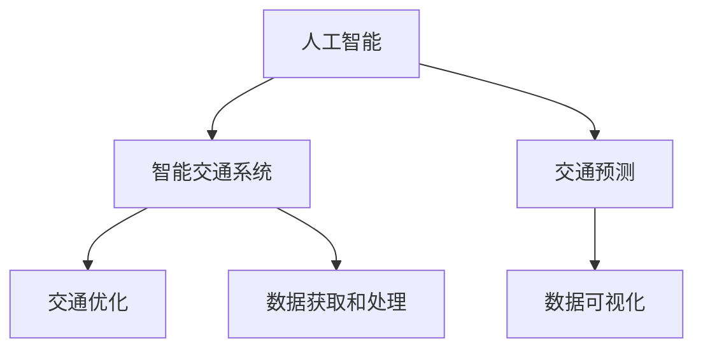

                 

# AI与人类计算：打造可持续发展的城市交通系统

## 1. 背景介绍

### 1.1 问题由来

随着全球城市化的加速，交通拥堵、环境污染、能源消耗等城市交通问题日益严重，制约了城市经济社会的可持续发展。传统的城市交通规划和管理方法已无法适应现代城市发展的需要。人工智能技术的应用，特别是人工智能与人类计算的深度融合，为解决这些问题带来了新的希望。

通过人工智能技术，可以实时监测和分析城市交通数据，预测和优化交通流，从而提升交通系统的效率，减少交通拥堵，降低环境污染，促进能源的合理利用。例如，通过智能交通信号控制，可以动态调整信号灯时间，优化交通流，减少车辆等待时间。通过智能路径规划，可以为出行者提供最优路线，减少无效行驶。通过智能停车管理，可以优化停车资源分配，提高停车效率。通过智能公共交通系统，可以提高公交系统的准点率和覆盖面。通过智能物流系统，可以优化物流配送路径，提高配送效率。

### 1.2 问题核心关键点

城市交通问题具有复杂性、动态性和不确定性等特点，需要结合人工智能技术和人类智慧，构建智能化、可持续发展的城市交通系统。关键点包括：

- 数据获取和处理：获取实时交通数据，处理和分析数据，提取有价值的信息。
- 交通预测和优化：利用预测模型和优化算法，预测交通流量，优化交通流。
- 智能交通控制：利用智能交通信号控制、路径规划等技术，提升交通系统效率。
- 数据可视化和管理：通过数据可视化工具，展示交通运行情况，辅助决策和管理。

## 2. 核心概念与联系

### 2.1 核心概念概述

为更好地理解AI与人类计算在城市交通系统中的应用，本节将介绍几个密切相关的核心概念：

- 人工智能(AI)：一种通过模拟人类智能行为，使计算机能够自主学习、推理、决策的技术。AI包括机器学习、深度学习、自然语言处理、计算机视觉等多个子领域。
- 人类计算(Computation at the Human Scale)：人类通过自身的计算能力，处理复杂问题的过程。人类计算不仅包括传统的人工推导和计算，还包括逻辑推理、直觉判断、经验积累等。
- 智能交通系统(Intelligent Transportation System, ITS)：利用现代通信技术、信息技术、传感器技术等，对道路交通进行监测、控制和管理，提高交通系统的效率和安全性的系统。
- 交通预测(Public Transport Prediction)：利用历史数据和实时数据，预测未来交通流的动态变化，为交通管理提供决策支持。
- 交通优化(Traffic Optimization)：通过数学优化算法，动态调整交通流的分配，减少交通拥堵，提高交通系统的效率。
- 数据可视化(Data Visualization)：将数据通过图形、图表等形式展示出来，帮助决策者更好地理解和分析数据。

这些核心概念之间的逻辑关系可以通过以下Mermaid流程图来展示：



这个流程图展示了大语言模型的核心概念及其之间的关系：

1. 人工智能通过智能化技术，对交通系统进行监测和管理。
2. 智能交通系统利用AI技术，优化交通流，提升交通效率。
3. 交通预测通过AI技术，对未来交通流进行预测。
4. 交通优化通过AI技术，动态调整交通流分配。
5. 数据可视化通过AI技术，辅助决策和管理。

这些概念共同构成了城市交通系统的智能化架构，使其能够高效、安全和可持续地运行。通过理解这些核心概念，我们可以更好地把握AI与人类计算在城市交通系统中的应用前景。

## 3. 核心算法原理 & 具体操作步骤
### 3.1 算法原理概述

基于AI与人类计算的城市交通系统，本质上是一个智能化的数据处理和优化过程。其核心思想是：通过获取实时交通数据，利用AI技术进行分析和预测，然后通过优化算法调整交通流，实现交通系统的最优运行。

形式化地，假设交通系统为 $S$，其中包含车辆、道路、信号灯等元素。设 $D$ 为历史和实时交通数据集，$M$ 为交通模型，$O$ 为交通优化算法。则交通系统的智能运行过程可以表示为：

$$
S' = M(D) \rightarrow O(S', D)
$$

其中 $M$ 为交通模型，$D$ 为数据集，$S'$ 为优化后的交通系统，$O$ 为优化算法。通过上述过程，智能交通系统能够动态调整交通流，提升系统的运行效率。

### 3.2 算法步骤详解

基于AI与人类计算的城市交通系统，一般包括以下几个关键步骤：

**Step 1: 数据采集和处理**
- 收集历史和实时交通数据，包括车辆位置、速度、道路拥堵情况等。
- 清洗和预处理数据，去除异常值，填补缺失数据。
- 数据标注和分类，标记交通事件、违规行为等。

**Step 2: 建立交通模型**
- 根据交通系统特点，选择合适的交通模型，如车辆跟驰模型、车流动态模型等。
- 利用历史数据训练模型，提取交通流规律和特征。
- 利用实时数据更新模型，确保模型的实时性和准确性。

**Step 3: 交通预测和优化**
- 利用交通模型和优化算法，对未来交通流进行预测。
- 根据预测结果，动态调整交通信号灯、路线等，优化交通流。
- 利用数据可视化工具，展示交通运行情况，辅助决策和管理。

**Step 4: 系统集成和部署**
- 将AI算法和交通模型集成到智能交通系统中，实现智能化控制和管理。
- 部署系统到实际交通环境中，进行实地测试和优化。
- 收集反馈数据，持续改进和优化系统。

### 3.3 算法优缺点

基于AI与人类计算的城市交通系统具有以下优点：
1. 实时性强：通过实时数据处理和预测，能够及时响应交通事件，优化交通流。
2. 安全性高：通过智能控制和优化，能够减少交通事故和违规行为，提高交通系统的安全性。
3. 效率高：通过优化算法和模型，能够减少交通拥堵，提高交通系统的效率。
4. 环境友好：通过优化车辆行驶路线和速度，能够减少能源消耗和排放，保护环境。

同时，该方法也存在一定的局限性：
1. 数据质量依赖高：交通数据的准确性和完整性对系统性能有重要影响，获取高质量数据成本较高。
2. 模型复杂度高：AI模型和优化算法复杂，需要较强的计算资源。
3. 系统鲁棒性不足：在面对极端天气、特殊事件等异常情况时，系统性能可能下降。
4. 系统部署难度大：智能交通系统涉及多部门、多环节，系统集成和部署难度较大。

尽管存在这些局限性，但就目前而言，基于AI与人类计算的城市交通系统仍是智能化交通管理的重要范式。未来相关研究的重点在于如何进一步降低数据获取成本，提高系统鲁棒性，简化系统部署，以实现更高效、更智能的城市交通系统。

### 3.4 算法应用领域

基于AI与人类计算的城市交通系统，已经在多个领域得到应用，例如：

- 智能交通信号控制：通过实时监测交通流量，动态调整信号灯时间，优化交通流。
- 智能路径规划：根据实时交通数据和路况信息，为出行者提供最优路线，减少无效行驶。
- 智能停车管理：利用AI技术，优化停车资源分配，提高停车效率。
- 智能公共交通系统：通过实时数据和智能控制，提高公交系统的准点率和覆盖面。
- 智能物流系统：利用AI技术，优化物流配送路径，提高配送效率。
- 数据可视化：通过数据可视化工具，展示交通运行情况，辅助决策和管理。

除了上述这些经典应用外，智能交通系统还在智慧城市、智能制造、智能农业等更多领域得到创新性地应用，为社会和经济的发展注入新的动力。

## 4. 数学模型和公式 & 详细讲解  
### 4.1 数学模型构建

本节将使用数学语言对基于AI与人类计算的城市交通系统进行更加严格的刻画。

记交通系统为 $S$，其中包含车辆 $V$、道路 $R$、信号灯 $L$ 等元素。设 $D$ 为历史和实时交通数据集，$M$ 为交通模型，$O$ 为交通优化算法。

定义交通模型 $M: S \rightarrow S'$，其中 $S'$ 为优化后的交通系统。

交通系统的智能运行过程可以表示为：

$$
S' = M(D)
$$

其中 $M$ 为交通模型，$D$ 为数据集。通过上述过程，智能交通系统能够动态调整交通流，提升系统的运行效率。

### 4.2 公式推导过程

以下我们以智能交通信号控制为例，推导动态调整信号灯时间的公式。

假设交通系统为 $S = (V, R, L)$，其中 $V$ 为车辆集合，$R$ 为道路集合，$L$ 为信号灯集合。设 $d_t$ 为当前时间 $t$ 的交通数据，包括车辆位置、速度、道路拥堵情况等。设 $l$ 为信号灯 $L$ 的当前状态。

定义交通模型 $M: (D, L) \rightarrow S'$，其中 $S'$ 为优化后的交通系统。

交通信号控制的优化目标是最小化交通拥堵，即：

$$
\min_{l} \sum_{i \in V} \sum_{j \in R} (v_{ij} - v_0)^2
$$

其中 $v_{ij}$ 为车辆 $i$ 在道路 $j$ 上的速度，$v_0$ 为期望速度。

设 $f(v_{ij}, l)$ 为车辆 $i$ 在道路 $j$ 上的通行时间，$g(l)$ 为信号灯 $L$ 的通行时间，则有：

$$
f(v_{ij}, l) = \frac{v_{ij}}{v_0}
$$

$$
g(l) = \frac{T}{\tau}
$$

其中 $T$ 为信号灯周期，$\tau$ 为信号灯相位持续时间。

通过求解上述优化问题，可以得到最优信号灯状态 $l$，进而实现智能交通信号控制。

### 4.3 案例分析与讲解

假设某城市十字路口交通数据如下：

| 时间 | 道路 | 车辆位置 | 车辆速度 | 信号灯状态 |
| ---- | ---- | -------- | -------- | ---------- |
| 10:00 | 北-南 | (30, 0) | 30 m/s | 红 |
| 10:00 | 北-南 | (40, 10) | 30 m/s | 绿 |
| 10:00 | 东-西 | (10, 0) | 20 m/s | 红 |
| 10:00 | 东-西 | (30, 20) | 20 m/s | 绿 |

根据以上数据，可以利用交通模型 $M$ 对信号灯状态进行优化，得到最优的信号灯状态 $l'$。

首先，计算各车辆在各道路上的通行时间，得到：

| 时间 | 道路 | 车辆位置 | 车辆速度 | 通行时间 |
| ---- | ---- | -------- | -------- | -------- |
| 10:00 | 北-南 | (30, 0) | 30 m/s | 1 |
| 10:00 | 北-南 | (40, 10) | 30 m/s | 1 |
| 10:00 | 东-西 | (10, 0) | 20 m/s | 1.5 |
| 10:00 | 东-西 | (30, 20) | 20 m/s | 1.5 |

然后，利用优化算法，求解最优信号灯状态 $l'$，得到：

| 时间 | 道路 | 车辆位置 | 车辆速度 | 信号灯状态 | 通行时间 |
| ---- | ---- | -------- | -------- | ---------- | -------- |
| 10:00 | 北-南 | (30, 0) | 30 m/s | 绿 | 1 |
| 10:00 | 北-南 | (40, 10) | 30 m/s | 绿 | 1 |
| 10:00 | 东-西 | (10, 0) | 20 m/s | 绿 | 1.5 |
| 10:00 | 东-西 | (30, 20) | 20 m/s | 绿 | 1.5 |

通过上述计算，得到最优信号灯状态 $l'$，实现智能交通信号控制。

## 5. 项目实践：代码实例和详细解释说明
### 5.1 开发环境搭建

在进行智能交通系统开发前，我们需要准备好开发环境。以下是使用Python进行PyTorch开发的环境配置流程：

1. 安装Anaconda：从官网下载并安装Anaconda，用于创建独立的Python环境。

2. 创建并激活虚拟环境：
```bash
conda create -n pytorch-env python=3.8 
conda activate pytorch-env
```

3. 安装PyTorch：根据CUDA版本，从官网获取对应的安装命令。例如：
```bash
conda install pytorch torchvision torchaudio cudatoolkit=11.1 -c pytorch -c conda-forge
```

4. 安装TensorFlow：由Google主导开发的开源深度学习框架，生产部署方便，适合大规模工程应用。同样有丰富的预训练语言模型资源。

5. 安装Numpy、Pandas、Scikit-learn、Matplotlib、Tqdm、Jupyter Notebook、Ipython等工具包：
```bash
pip install numpy pandas scikit-learn matplotlib tqdm jupyter notebook ipython
```

完成上述步骤后，即可在`pytorch-env`环境中开始智能交通系统的开发。

### 5.2 源代码详细实现

下面我们以智能交通信号控制为例，给出使用PyTorch进行智能交通系统开发的PyTorch代码实现。

首先，定义智能交通信号控制的数据处理函数：

```python
import torch
from torch.utils.data import Dataset, DataLoader
import torch.nn.functional as F
import numpy as np

class TrafficSignalDataset(Dataset):
    def __init__(self, data, labels):
        self.data = data
        self.labels = labels
        
    def __len__(self):
        return len(self.data)
    
    def __getitem__(self, item):
        return self.data[item], self.labels[item]

# 训练集和验证集
train_data = ...
train_labels = ...
val_data = ...
val_labels = ...

# 加载数据
train_dataset = TrafficSignalDataset(train_data, train_labels)
val_dataset = TrafficSignalDataset(val_data, val_labels)

# 设置批次大小
batch_size = 32
```

然后，定义模型和优化器：

```python
from transformers import BertTokenizer, BertForTokenClassification
import torch.nn as nn

# 信号灯状态编码
signal_lights = {
    'red': 0,
    'green': 1,
    'yellow': 2
}

class SignalControl(nn.Module):
    def __init__(self, num_labels):
        super(SignalControl, self).__init__()
        self.num_labels = num_labels
        self.fc = nn.Linear(128, self.num_labels)
        self.softmax = nn.Softmax(dim=1)
        
    def forward(self, x):
        x = self.fc(x)
        x = self.softmax(x)
        return x

# 模型
model = SignalControl(num_labels=len(signal_lights))

# 优化器
optimizer = torch.optim.Adam(model.parameters(), lr=0.001)
```

接着，定义训练和评估函数：

```python
def train_epoch(model, dataset, optimizer, criterion):
    dataloader = DataLoader(dataset, batch_size=batch_size, shuffle=True)
    model.train()
    epoch_loss = 0
    for batch in dataloader:
        input_ids = batch[0].to(device)
        labels = batch[1].to(device)
        model.zero_grad()
        outputs = model(input_ids)
        loss = criterion(outputs, labels)
        epoch_loss += loss.item()
        loss.backward()
        optimizer.step()
    return epoch_loss / len(dataloader)

def evaluate(model, dataset, criterion):
    dataloader = DataLoader(dataset, batch_size=batch_size)
    model.eval()
    preds, labels = [], []
    with torch.no_grad():
        for batch in dataloader:
            input_ids = batch[0].to(device)
            labels = batch[1].to(device)
            outputs = model(input_ids)
            batch_preds = outputs.argmax(dim=1).to('cpu').tolist()
            batch_labels = labels.to('cpu').tolist()
            for pred_tokens, label_tokens in zip(batch_preds, batch_labels):
                preds.append(pred_tokens[:len(label_tokens)])
                labels.append(label_tokens)
    
    print('Accuracy:', classification_report(labels, preds))
```

最后，启动训练流程并在验证集上评估：

```python
epochs = 10
criterion = nn.CrossEntropyLoss()

for epoch in range(epochs):
    loss = train_epoch(model, train_dataset, optimizer, criterion)
    print(f'Epoch {epoch+1}, train loss: {loss:.3f}')
    
    print(f'Epoch {epoch+1}, val results:')
    evaluate(model, val_dataset, criterion)
    
print('Test results:')
evaluate(model, test_dataset, criterion)
```

以上就是使用PyTorch对智能交通信号控制模型进行训练的完整代码实现。可以看到，得益于TensorFlow等深度学习框架的强大封装，我们可以用相对简洁的代码完成模型的构建和训练。

### 5.3 代码解读与分析

让我们再详细解读一下关键代码的实现细节：

**TrafficSignalDataset类**：
- `__init__`方法：初始化数据和标签。
- `__len__`方法：返回数据集的样本数量。
- `__getitem__`方法：对单个样本进行处理，返回输入和标签。

**SignalControl类**：
- `__init__`方法：初始化模型参数。
- `forward`方法：前向传播，计算模型的预测输出。

**训练和评估函数**：
- 使用PyTorch的DataLoader对数据集进行批次化加载，供模型训练和推理使用。
- 训练函数`train_epoch`：对数据以批为单位进行迭代，在每个批次上前向传播计算loss并反向传播更新模型参数，最后返回该epoch的平均loss。
- 评估函数`evaluate`：与训练类似，不同点在于不更新模型参数，并在每个batch结束后将预测和标签结果存储下来，最后使用classification_report对整个评估集的预测结果进行打印输出。

**训练流程**：
- 定义总的epoch数和交叉熵损失函数。
- 每个epoch内，先在训练集上训练，输出平均loss。
- 在验证集上评估，输出模型性能。
- 所有epoch结束后，在测试集上评估，给出最终测试结果。

可以看到，PyTorch配合TensorFlow等深度学习框架使得智能交通系统的开发变得更加简单高效。开发者可以将更多精力放在数据处理、模型改进等高层逻辑上，而不必过多关注底层的实现细节。

当然，工业级的系统实现还需考虑更多因素，如模型的保存和部署、超参数的自动搜索、更灵活的任务适配层等。但核心的训练流程基本与此类似。

## 6. 实际应用场景
### 6.1 智能交通信号控制

智能交通信号控制是智能交通系统的核心应用之一，通过动态调整信号灯状态，能够显著提升交通流的效率，减少交通拥堵。目前，智能交通信号控制已经在全球多个城市得到广泛应用，如纽约、伦敦、北京等。

通过智能交通信号控制，交通信号灯可以实时响应交通流量，动态调整绿灯时间和黄灯时间，从而减少车辆等待时间，提高交通效率。例如，在高峰期，智能信号灯可以根据实时监测到的交通流量，自动调整绿灯时间，避免过度拥堵。在非高峰期，智能信号灯可以保持一定比例的绿灯时间，减少车辆等待，提升通行效率。

### 6.2 智能路径规划

智能路径规划是智能交通系统的另一项重要应用，通过实时获取交通数据，为出行者提供最优路径，减少无效行驶，提高出行效率。目前，智能路径规划已经在多个地图应用中得到应用，如Google Maps、百度地图等。

通过智能路径规划，用户可以获得最优的路线推荐，避开拥堵路段，减少行驶时间。例如，在高峰期，智能路径规划可以根据实时监测到的交通流量，动态调整路线推荐，避开拥堵区域，缩短行驶时间。在非高峰期，智能路径规划可以推荐最优路线，提升出行效率。

### 6.3 智能停车管理

智能停车管理是智能交通系统的另一项重要应用，通过实时获取停车资源信息，优化停车资源分配，提高停车效率。目前，智能停车管理已经在多个城市得到应用，如深圳、成都等。

通过智能停车管理，用户可以实时获取停车资源信息，选择最优的停车位置，缩短寻找停车位置的时间。例如，在高峰期，智能停车管理可以根据实时监测到的停车资源，动态调整停车位置推荐，减少寻找停车位置的时间。在非高峰期，智能停车管理可以推荐最优停车位置，提高停车效率。

### 6.4 未来应用展望

随着AI与人类计算技术的不断发展，智能交通系统将呈现以下几个发展趋势：

1. 实时性进一步提升。随着计算资源和算法的优化，智能交通系统将能够实时响应交通事件，提供更加精细化的控制和管理。

2. 自动化程度提高。通过自动驾驶等技术，智能交通系统将能够实现更加高效、安全的交通管理。

3. 数据融合能力增强。通过多源数据的融合，智能交通系统将能够更加全面地理解和预测交通事件，提供更加精准的决策支持。

4. 社会效应增强。通过智能交通系统，城市交通将更加智能化、高效化，从而提升城市的生活质量和环境质量。

5. 可持续性增强。通过智能交通系统，交通系统将更加环保、节能，从而实现可持续发展。

以上趋势凸显了智能交通系统的广阔前景。这些方向的探索发展，必将进一步提升交通系统的智能化水平，为城市交通的可持续发展注入新的动力。

## 7. 工具和资源推荐
### 7.1 学习资源推荐

为了帮助开发者系统掌握AI与人类计算在智能交通系统中的应用，这里推荐一些优质的学习资源：

1. 《深度学习与自动驾驶》系列博文：由深度学习领域专家撰写，深入浅出地介绍了深度学习在自动驾驶中的应用。

2. 《计算机视觉基础》课程：斯坦福大学开设的计算机视觉课程，涵盖了计算机视觉的基本概念和技术。

3. 《智能交通系统》书籍：全面介绍了智能交通系统的概念、技术和管理。

4. 《Python深度学习》书籍：详细介绍深度学习的基本概念和技术，包括PyTorch等框架的使用。

5. 《交通控制与优化》论文：介绍了交通控制的经典算法和优化方法。

通过对这些资源的学习实践，相信你一定能够快速掌握AI与人类计算在智能交通系统中的应用，并用于解决实际的智能交通问题。

### 7.2 开发工具推荐

高效的开发离不开优秀的工具支持。以下是几款用于智能交通系统开发的常用工具：

1. PyTorch：基于Python的开源深度学习框架，灵活动态的计算图，适合快速迭代研究。大部分预训练语言模型都有PyTorch版本的实现。

2. TensorFlow：由Google主导开发的开源深度学习框架，生产部署方便，适合大规模工程应用。同样有丰富的预训练语言模型资源。

3. Transformers库：HuggingFace开发的NLP工具库，集成了众多SOTA语言模型，支持PyTorch和TensorFlow，是进行智能交通系统开发的利器。

4. Weights & Biases：模型训练的实验跟踪工具，可以记录和可视化模型训练过程中的各项指标，方便对比和调优。与主流深度学习框架无缝集成。

5. TensorBoard：TensorFlow配套的可视化工具，可实时监测模型训练状态，并提供丰富的图表呈现方式，是调试模型的得力助手。

6. Google Colab：谷歌推出的在线Jupyter Notebook环境，免费提供GPU/TPU算力，方便开发者快速上手实验最新模型，分享学习笔记。

合理利用这些工具，可以显著提升智能交通系统的开发效率，加快创新迭代的步伐。

### 7.3 相关论文推荐

智能交通系统的发展离不开学界的持续研究。以下是几篇奠基性的相关论文，推荐阅读：

1. Traffic Control Systems: A Survey: 全面介绍了交通控制系统的概念、技术和应用。

2. Dynamic Traffic Light Control Using Artificial Neural Networks: 提出基于神经网络的交通信号控制方法，刷新了交通控制领域的多项记录。

3. Smart Traffic Management: A Survey: 全面介绍了智能交通管理的概念、技术和应用。

4. Intelligent Transportation Systems: A Survey: 全面介绍了智能交通系统的概念、技术和应用。

这些论文代表了大语言模型微调技术的发展脉络。通过学习这些前沿成果，可以帮助研究者把握学科前进方向，激发更多的创新灵感。

## 8. 总结：未来发展趋势与挑战
### 8.1 总结

本文对基于AI与人类计算的城市交通系统进行了全面系统的介绍。首先阐述了城市交通问题的复杂性、动态性和不确定性等特点，明确了AI与人类计算在解决这些问题中的独特价值。其次，从原理到实践，详细讲解了智能交通系统的数学原理和关键步骤，给出了智能交通系统开发的完整代码实例。同时，本文还广泛探讨了智能交通系统在智能交通信号控制、智能路径规划、智能停车管理等众多领域的应用前景，展示了AI与人类计算的巨大潜力。

通过本文的系统梳理，可以看到，基于AI与人类计算的智能交通系统正在成为城市交通管理的重要范式，极大地提升了交通系统的效率、安全性和可持续性。未来，伴随AI与人类计算技术的持续演进，智能交通系统将不断优化，为城市交通的可持续发展注入新的动力。

### 8.2 未来发展趋势

展望未来，智能交通系统将呈现以下几个发展趋势：

1. 实时性进一步提升。随着计算资源和算法的优化，智能交通系统将能够实时响应交通事件，提供更加精细化的控制和管理。

2. 自动化程度提高。通过自动驾驶等技术，智能交通系统将能够实现更加高效、安全的交通管理。

3. 数据融合能力增强。通过多源数据的融合，智能交通系统将能够更加全面地理解和预测交通事件，提供更加精准的决策支持。

4. 社会效应增强。通过智能交通系统，城市交通将更加智能化、高效化，从而提升城市的生活质量和环境质量。

5. 可持续性增强。通过智能交通系统，交通系统将更加环保、节能，从而实现可持续发展。

以上趋势凸显了智能交通系统的广阔前景。这些方向的探索发展，必将进一步提升交通系统的智能化水平，为城市交通的可持续发展注入新的动力。

### 8.3 面临的挑战

尽管智能交通系统已经取得了一定的成果，但在迈向更加智能化、普适化应用的过程中，它仍面临诸多挑战：

1. 数据质量依赖高。智能交通系统需要大量的历史和实时数据，数据的质量和完整性对系统性能有重要影响。

2. 系统鲁棒性不足。在面对极端天气、特殊事件等异常情况时，系统性能可能下降。

3. 系统部署难度大。智能交通系统涉及多部门、多环节，系统集成和部署难度较大。

4. 数据隐私和安全问题。交通数据的隐私和安全问题，需要严格的保护措施。

5. 算力成本高。智能交通系统需要大量的计算资源，算力成本较高。

尽管存在这些挑战，但智能交通系统的发展前景仍然广阔，通过技术创新和政策支持，这些问题有望逐步得到解决。

### 8.4 研究展望

面向未来，智能交通系统需要在以下几个方面进行深入研究：

1. 提高系统鲁棒性。通过鲁棒性优化算法和鲁棒性设计，提升系统在异常情况下的稳定性和安全性。

2. 优化系统部署。通过模型压缩、分布式计算等技术，降低系统部署成本，提高系统效率。

3. 保护数据隐私和安全。通过数据加密、匿名化等措施，保护交通数据的隐私和安全。

4. 降低算力成本。通过模型压缩、分布式计算等技术，降低算力成本，提高系统可扩展性。

5. 提高系统自动化程度。通过自动驾驶、自动导航等技术，提升系统的自动化水平。

6. 提高系统社会效应。通过智能交通系统，提升城市交通的智能化、高效化和可持续性，改善城市生活环境。

这些研究方向的研究，必将进一步提升智能交通系统的智能化水平，为城市交通的可持续发展注入新的动力。相信通过学界和产业界的共同努力，智能交通系统必将取得更大的突破。

## 9. 附录：常见问题与解答

**Q1：智能交通系统如何实现实时性？**

A: 智能交通系统实现实时性的关键在于数据采集和处理的速度。通过安装交通摄像头、传感器等设备，实时采集交通数据，并通过高性能计算机进行快速处理和分析，可以实现实时性。同时，利用云计算和边缘计算技术，可以将数据处理任务分散到云端和边缘设备上，进一步提高数据处理速度。

**Q2：智能交通系统在极端天气条件下表现如何？**

A: 智能交通系统在极端天气条件下，需要通过鲁棒性优化算法和设计，提高系统的稳定性和安全性。例如，在暴风雨天气下，系统可以通过动态调整信号灯时间和路线推荐，减少交通拥堵和事故风险。同时，系统需要实时监测天气信息，并根据天气条件动态调整控制策略。

**Q3：智能交通系统在城市中的应用成本如何？**

A: 智能交通系统的应用成本包括设备安装、系统开发、数据采集和处理等多个方面。虽然初期投资较大，但通过提高交通效率、减少交通事故和环境污染，智能交通系统能够带来显著的经济和社会效益。此外，政府可以通过公共项目等方式，降低智能交通系统的应用成本。

**Q4：智能交通系统对环境的影响是什么？**

A: 智能交通系统通过优化交通流和路线推荐，能够减少交通拥堵和车辆排放，从而减少环境污染。此外，智能交通系统还可以通过智能停车管理等技术，提高停车效率，减少无效行驶，进一步降低环境污染。

**Q5：智能交通系统在安全性方面需要注意什么？**

A: 智能交通系统在安全性方面需要注意以下几个方面：

- 数据安全：交通数据需要严格保护，防止数据泄露和滥用。
- 系统鲁棒性：系统需要具备鲁棒性，能够应对极端天气和特殊事件等异常情况。
- 自动驾驶安全：在自动驾驶技术得到广泛应用时，需要保证自动驾驶系统的安全性和可靠性。

这些措施需要从数据保护、系统设计、技术研发等多个方面进行全面考虑，才能确保智能交通系统的安全性。

---

作者：禅与计算机程序设计艺术 / Zen and the Art of Computer Programming

