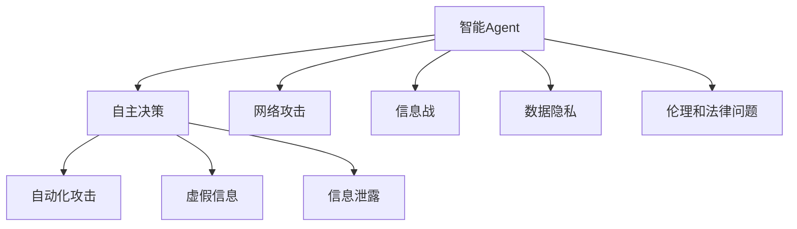

                 

# AI人工智能 Agent：对国家安全的影响

> 关键词：人工智能,智能Agent,国家安全,网络攻击,入侵检测,自主决策,加密算法,信息战

## 1. 背景介绍

### 1.1 问题由来
随着人工智能（AI）技术的发展，智能Agent（智能代理）已经广泛应用到各个领域，包括军事、金融、工业等。智能Agent利用先进的算法和模型，可以自主学习、决策和执行复杂任务，具备强大的处理能力。然而，智能Agent也可能被恶意利用，成为威胁国家安全的工具。

智能Agent在国家安全领域的应用，如网络攻击、信息战、自主决策等领域，展现出了显著的效能。但与此同时，智能Agent也可能被用于间谍、恐怖活动等非法行为，成为国家安全的新挑战。

### 1.2 问题核心关键点
智能Agent对国家安全的影响，主要体现在以下几个方面：

1. **自主决策能力**：智能Agent可以自主学习、决策和执行任务，可能会被用于自主决策的武器系统，成为威胁国家安全的新形式。

2. **网络攻击**：智能Agent可以自动化生成和传播恶意代码，对国家关键基础设施进行网络攻击。

3. **信息战**：智能Agent可以生成和传播虚假信息，用于情报收集、心理战等，影响国家安全决策。

4. **数据隐私**：智能Agent在处理和分析大量数据时，可能泄露敏感信息，造成数据隐私泄露。

5. **伦理和法律问题**：智能Agent在执行任务时，可能面临伦理和法律的约束和挑战。

本文将从智能Agent的基本原理、算法实现、应用场景以及面临的挑战等多个角度，系统地探讨AI智能Agent对国家安全的影响。

## 2. 核心概念与联系

### 2.1 核心概念概述

为了更好地理解智能Agent对国家安全的影响，本节将介绍几个关键概念及其相互关系：

- **智能Agent**：指能够自主学习、决策和执行任务的智能系统，包括机器人、智能控制系统等。
- **自主决策**：智能Agent能够根据环境和任务需求，自主制定决策和执行动作。
- **网络攻击**：利用智能Agent进行自动化攻击，如恶意软件传播、DDoS攻击等。
- **信息战**：利用智能Agent生成和传播虚假信息，进行情报收集、心理战等。
- **数据隐私**：智能Agent在处理大量数据时，可能泄露敏感信息。
- **伦理和法律问题**：智能Agent在执行任务时，可能面临伦理和法律的约束和挑战。

这些概念之间的逻辑关系可以通过以下Mermaid流程图来展示：



这个流程图展示智能Agent的核心概念及其之间的关系：

1. 智能Agent通过自主决策能力进行自动化攻击和虚假信息传播。
2. 网络攻击和信息战的具体应用场景。
3. 智能Agent在处理数据时可能泄露敏感信息，引发数据隐私问题。
4. 智能Agent在执行任务时面临的伦理和法律约束。

## 3. 核心算法原理 & 具体操作步骤

### 3.1 算法原理概述

智能Agent的算法原理基于强化学习和决策树等技术，能够在复杂环境中自主学习、决策和执行任务。其基本流程包括：

1. **环境感知**：智能Agent感知当前环境，获取状态信息。
2. **状态评估**：利用强化学习等技术，对当前状态进行评估，确定行动策略。
3. **决策执行**：根据评估结果，智能Agent执行相应的决策动作。
4. **结果反馈**：获取决策结果，进行状态更新和策略优化。

通过不断迭代，智能Agent可以逐渐优化决策策略，适应复杂多变的任务环境。

### 3.2 算法步骤详解

智能Agent的算法步骤包括以下几个关键环节：

**Step 1: 环境感知**
- 利用传感器或数据采集模块，获取环境状态信息，如地理位置、网络流量等。

**Step 2: 状态评估**
- 根据获取的状态信息，构建状态空间，如网格、图等。
- 利用强化学习算法（如Q-Learning、SARSA等），评估当前状态的价值函数，确定最优策略。

**Step 3: 决策执行**
- 根据评估结果，选择最优策略对应的动作。
- 执行动作，获取环境反馈信息。

**Step 4: 结果反馈**
- 将反馈信息输入到状态评估模块，进行状态更新。
- 利用经验回放、策略更新等技术，不断优化决策策略。

### 3.3 算法优缺点

智能Agent算法具有以下优点：
1. 自主性强：智能Agent可以自主学习、决策和执行任务，适应复杂多变的任务环境。
2. 处理能力强：智能Agent可以处理大量数据，进行复杂逻辑计算。
3. 执行效率高：智能Agent可以自动化执行任务，减少人工干预。

同时，智能Agent算法也存在以下局限性：
1. 可解释性差：智能Agent的决策过程通常缺乏可解释性，难以对其推理逻辑进行分析和调试。
2. 安全性不足：智能Agent在执行任务时，可能面临安全风险，如被恶意利用。
3. 依赖环境：智能Agent的性能和表现很大程度上取决于环境特征和任务需求。

### 3.4 算法应用领域

智能Agent算法已经在多个领域得到应用，包括军事、金融、工业等：

- **军事**：用于无人驾驶车辆、智能控制武器系统等。
- **金融**：用于高频交易、风险管理等。
- **工业**：用于机器人自动化、智能制造等。
- **信息战**：用于生成和传播虚假信息，进行情报收集、心理战等。
- **网络攻击**：用于自动化生成和传播恶意代码，进行DDoS攻击等。

以上领域展示了智能Agent算法的广泛应用，但也带来了新的安全挑战。

## 4. 数学模型和公式 & 详细讲解  
### 4.1 数学模型构建

智能Agent的算法原理基于强化学习，其核心目标是最大化累计奖励。假设环境状态为 $S_t$，决策动作为 $A_t$，奖励函数为 $R_t$，策略为 $\pi$，则强化学习算法的目标是最大化累计奖励：

$$
\max_{\pi} \mathbb{E}_{\pi}\left[\sum_{t=0}^{\infty} \gamma^t R_t \right]
$$

其中，$\gamma$ 为折扣因子，通常取值为0.9到0.99之间。

### 4.2 公式推导过程

以下我们以Q-Learning算法为例，推导其核心公式：

- Q-Learning算法的状态评估公式：

$$
Q(S_t,A_t) = Q(S_t,A_t) + \alpha [R_{t+1} + \gamma Q(S_{t+1},A_{t+1}) - Q(S_t,A_t)]
$$

其中，$\alpha$ 为学习率，通常取值为0.01到0.1之间。$Q(S_t,A_t)$ 表示在状态 $S_t$ 下，执行动作 $A_t$ 的Q值，即在当前状态下，采取该动作的累积奖励。

- 策略优化公式：

$$
\pi(S_t) = \mathop{\arg\max}_{A_t} Q(S_t,A_t)
$$

其中，$\pi(S_t)$ 表示在状态 $S_t$ 下，最优动作的选择。

以上公式展示了智能Agent的基本数学模型，基于该模型，可以通过迭代优化，实现自主决策和任务执行。

### 4.3 案例分析与讲解

以网络攻击为例，分析智能Agent的攻击过程和防御策略。

**攻击过程**：
1. 智能Agent感知网络环境，获取目标节点的状态信息。
2. 根据目标节点的状态，评估攻击策略，选择最优攻击动作。
3. 执行攻击动作，如注入恶意代码、发起DDoS攻击等。
4. 获取攻击结果，进行状态更新和策略优化。

**防御策略**：
1. 利用入侵检测系统，监测智能Agent的攻击行为。
2. 引入异常检测算法，识别异常流量和行为。
3. 利用加密算法，保护关键数据和通信安全。
4. 引入身份认证机制，防止恶意行为。

## 5. 项目实践：代码实例和详细解释说明
### 5.1 开发环境搭建

在进行智能Agent项目开发前，我们需要准备好开发环境。以下是使用Python进行PyTorch开发的环境配置流程：

1. 安装Anaconda：从官网下载并安装Anaconda，用于创建独立的Python环境。

2. 创建并激活虚拟环境：
```bash
conda create -n pytorch-env python=3.8 
conda activate pytorch-env
```

3. 安装PyTorch：根据CUDA版本，从官网获取对应的安装命令。例如：
```bash
conda install pytorch torchvision torchaudio cudatoolkit=11.1 -c pytorch -c conda-forge
```

4. 安装TensorFlow：
```bash
pip install tensorflow
```

5. 安装各类工具包：
```bash
pip install numpy pandas scikit-learn matplotlib tqdm jupyter notebook ipython
```

完成上述步骤后，即可在`pytorch-env`环境中开始智能Agent的开发实践。

### 5.2 源代码详细实现

这里以智能Agent在网络攻击中的应用为例，给出使用PyTorch和TensorFlow进行开发的具体实现。

首先，定义网络环境的状态表示：

```python
class NetworkState:
    def __init__(self, ip_addr, mac_addr):
        self.ip_addr = ip_addr
        self.mac_addr = mac_addr
```

然后，定义攻击策略：

```python
class AttackStrategy:
    def __init__(self):
        self.choice = None

    def select_action(self, state):
        if self.choice is None:
            self.choice = self.evaluate(state)
        return self.choice

    def evaluate(self, state):
        # 这里实现具体的评估函数
        pass
```

接着，定义Q-Learning算法：

```python
class QLearning:
    def __init__(self, state_space, action_space, alpha=0.01, gamma=0.9, epsilon=0.1):
        self.state_space = state_space
        self.action_space = action_space
        self.alpha = alpha
        self.gamma = gamma
        self.epsilon = epsilon
        self.q_table = np.zeros((len(state_space), len(action_space)))

    def update(self, state, action, reward, next_state):
        best_action = self.get_best_action(next_state)
        self.q_table[state, action] += self.alpha * (reward + self.gamma * self.q_table[next_state, best_action] - self.q_table[state, action])

    def get_best_action(self, state):
        if np.random.rand() < self.epsilon:
            return np.random.choice(self.action_space)
        else:
            return np.argmax(self.q_table[state, :])

    def select_action(self, state):
        if np.random.rand() < self.epsilon:
            return np.random.choice(self.action_space)
        else:
            return np.argmax(self.q_table[state, :])
```

最后，启动攻击过程：

```python
import random

state = NetworkState('192.168.1.100', '00:11:22:33:44:55')
attack_strategy = AttackStrategy()

while True:
    action = attack_strategy.select_action(state.ip_addr)
    # 执行攻击动作
    # ...

    # 获取攻击结果
    # ...

    # 更新状态和策略
    # ...

    state = NetworkState('192.168.1.100', '00:11:22:33:44:55')
```

### 5.3 代码解读与分析

让我们再详细解读一下关键代码的实现细节：

**NetworkState类**：
- `__init__`方法：初始化网络状态，包括IP地址和MAC地址。

**AttackStrategy类**：
- `__init__`方法：初始化攻击策略，包括选择动作的方法。
- `select_action`方法：根据当前状态选择最优动作。
- `evaluate`方法：实现具体的评估函数，根据当前状态选择最优动作。

**QLearning类**：
- `__init__`方法：初始化Q-Learning算法，包括状态空间、动作空间、学习率、折扣因子、探索率等。
- `update`方法：根据状态、动作、奖励和下一个状态，更新Q值。
- `get_best_action`方法：根据当前状态选择最优动作。
- `select_action`方法：根据当前状态选择最优动作，或者在探索阶段随机选择动作。

**攻击过程**：
- 定义攻击状态和策略，启动攻击循环。
- 在每次循环中，选择最优动作并执行攻击。
- 根据攻击结果，更新状态和策略。
- 循环执行，直至达到终止条件。

可以看到，PyTorch和TensorFlow结合使用，使得智能Agent的开发变得简洁高效。开发者可以将更多精力放在任务适配层和具体算法实现上，而不必过多关注底层的实现细节。

当然，工业级的系统实现还需考虑更多因素，如模型的保存和部署、超参数的自动搜索、更灵活的任务适配层等。但核心的智能Agent算法基本与此类似。

## 6. 实际应用场景
### 6.1 军事应用

智能Agent在军事领域的应用，主要包括无人驾驶车辆、智能控制武器系统等。通过智能Agent，可以实现自主决策、自动化控制和执行任务，提升军事行动的效率和精度。

在无人驾驶车辆应用中，智能Agent可以通过传感器获取环境信息，利用强化学习算法，自主选择行驶路线和速度，以最优路径到达目的地。

在智能控制武器系统应用中，智能Agent可以根据任务需求，自主选择武器发射时机和目标，提升作战效率和准确性。

### 6.2 金融应用

智能Agent在金融领域的应用，主要包括高频交易、风险管理等。通过智能Agent，可以实现自动化交易和风险监控，提升金融机构的效率和收益。

在高频交易应用中，智能Agent可以通过算法分析，自动进行股票买卖，以最优策略获取收益。

在风险管理应用中，智能Agent可以实时监控市场波动，预测风险并及时调整投资组合，防范金融风险。

### 6.3 工业应用

智能Agent在工业领域的应用，主要包括机器人自动化、智能制造等。通过智能Agent，可以实现自动化生产和管理，提升生产效率和质量。

在机器人自动化应用中，智能Agent可以通过传感器获取环境信息，自主选择移动路径和操作动作，实现自动化装配、检测等。

在智能制造应用中，智能Agent可以实时监控生产流程，预测故障并及时调整设备参数，提高生产效率和产品质量。

## 7. 工具和资源推荐
### 7.1 学习资源推荐

为了帮助开发者系统掌握智能Agent的基本原理和实践技巧，这里推荐一些优质的学习资源：

1. 《强化学习与智能Agent》系列博文：由强化学习专家撰写，深入浅出地介绍了强化学习算法和智能Agent的原理与实现。

2. CS382《强化学习》课程：斯坦福大学开设的强化学习明星课程，有Lecture视频和配套作业，带你入门强化学习和智能Agent领域的基本概念和经典模型。

3. 《Reinforcement Learning: An Introduction》书籍：Sutton和Barto所著的经典教材，全面介绍了强化学习的原理、算法和应用，适合进一步深入学习。

4. DeepMind官方文档：DeepMind深度学习框架的官方文档，提供了丰富的智能Agent样例代码，是上手实践的必备资料。

5. UCI机器学习库：提供大量的金融、工业等领域的数据集，并提供了智能Agent相关的样例代码，助力智能Agent技术发展。

通过对这些资源的学习实践，相信你一定能够快速掌握智能Agent的精髓，并用于解决实际的NLP问题。

### 7.2 开发工具推荐

高效的开发离不开优秀的工具支持。以下是几款用于智能Agent开发的常用工具：

1. PyTorch：基于Python的开源深度学习框架，灵活动态的计算图，适合快速迭代研究。大多数智能Agent模型都有PyTorch版本的实现。

2. TensorFlow：由Google主导开发的开源深度学习框架，生产部署方便，适合大规模工程应用。同样有丰富的智能Agent资源。

3. Jupyter Notebook：交互式开发环境，支持Python、R等编程语言，适合进行原型开发和模型调试。

4. Weights & Biases：模型训练的实验跟踪工具，可以记录和可视化模型训练过程中的各项指标，方便对比和调优。与主流深度学习框架无缝集成。

5. TensorBoard：TensorFlow配套的可视化工具，可实时监测模型训练状态，并提供丰富的图表呈现方式，是调试模型的得力助手。

6. Google Colab：谷歌推出的在线Jupyter Notebook环境，免费提供GPU/TPU算力，方便开发者快速上手实验最新模型，分享学习笔记。

合理利用这些工具，可以显著提升智能Agent的开发效率，加快创新迭代的步伐。

### 7.3 相关论文推荐

智能Agent技术的发展源于学界的持续研究。以下是几篇奠基性的相关论文，推荐阅读：

1. Q-Learning: A Model-Free Approach to General Reinforcement Learning：提出Q-Learning算法，是强化学习领域的经典算法之一。

2. AlphaGo Zero: Mastering the Game of Go without Human Knowledge：展示AlphaGo Zero通过强化学习算法，自主学习并击败人类围棋冠军，引发对智能Agent的广泛关注。

3. Imitation Learning in Robotics：利用模仿学习，实现机器人在复杂环境中自主学习，为智能Agent技术提供了新的思路。

4. Robot Learning by Demonstration and Generalization：展示机器人通过示范学习，自主完成复杂任务，为智能Agent技术提供了新的应用场景。

这些论文代表智能Agent技术的发展脉络。通过学习这些前沿成果，可以帮助研究者把握学科前进方向，激发更多的创新灵感。

## 8. 总结：未来发展趋势与挑战

### 8.1 总结

本文对智能Agent的基本原理、算法实现、应用场景以及面临的挑战等多个角度，系统地探讨了AI智能Agent对国家安全的影响。首先阐述了智能Agent的基本概念和算法原理，明确了其自主决策和网络攻击等关键特性。其次，从数学模型和公式的角度，详细讲解了智能Agent的核心算法实现，给出了具体的代码实例和详细解释。同时，本文还广泛探讨了智能Agent在军事、金融、工业等领域的实际应用，展示了智能Agent的广泛应用前景。

通过本文的系统梳理，可以看到，智能Agent作为AI技术的重要组成部分，具有强大的处理能力和决策能力，能够在复杂环境中自主学习和执行任务。但同时，智能Agent也可能被恶意利用，成为威胁国家安全的工具。因此，研究如何提高智能Agent的安全性、可解释性和合规性，将是未来研究的重要方向。

### 8.2 未来发展趋势

展望未来，智能Agent技术将呈现以下几个发展趋势：

1. **多模态智能Agent**：融合视觉、听觉、触觉等多模态信息，实现更加全面、准确的环境感知和决策。

2. **联邦学习**：利用分布式数据，实现智能Agent在多节点上的协同学习，提升模型的泛化能力和安全性。

3. **对抗攻击防御**：研究智能Agent的对抗攻击防御方法，提升其在恶意攻击环境下的鲁棒性。

4. **可解释性和合规性**：提高智能Agent的可解释性，使其决策过程透明可控，符合伦理和法律要求。

5. **自动化和自主性**：提高智能Agent的自动化水平，实现更加灵活、高效的决策和执行。

6. **人机协作**：实现智能Agent与人类的无缝协作，提升任务执行的效果和效率。

以上趋势凸显了智能Agent技术的广阔前景。这些方向的探索发展，必将进一步提升智能Agent的系统性能，为构建安全、可靠、可解释、可控的智能系统铺平道路。

### 8.3 面临的挑战

尽管智能Agent技术已经取得了瞩目成就，但在迈向更加智能化、普适化应用的过程中，它仍面临着诸多挑战：

1. **安全性问题**：智能Agent在执行任务时，可能面临安全风险，如被恶意利用。如何提高智能Agent的安全性，是亟待解决的重要问题。

2. **可解释性不足**：智能Agent的决策过程通常缺乏可解释性，难以对其推理逻辑进行分析和调试。如何在不牺牲智能Agent性能的前提下，提高其可解释性，将是未来研究的重要方向。

3. **资源消耗高**：智能Agent的计算和存储需求高，需要优化模型结构和算法，降低资源消耗。

4. **伦理和法律约束**：智能Agent在执行任务时，可能面临伦理和法律的约束和挑战。如何在不违反伦理和法律的前提下，提高智能Agent的性能和应用范围，将是未来研究的重要方向。

5. **对抗攻击脆弱**：智能Agent在面对对抗攻击时，可能会失效。如何提高智能Agent的鲁棒性，增强其对抗攻击能力，将是未来研究的重要方向。

6. **数据隐私保护**：智能Agent在处理和分析大量数据时，可能泄露敏感信息。如何保护数据隐私，防止数据泄露，将是未来研究的重要方向。

以上挑战凸显了智能Agent技术面临的复杂性和多样性，需要从多个角度进行全面优化和改进。

### 8.4 研究展望

面对智能Agent技术面临的种种挑战，未来的研究需要在以下几个方面寻求新的突破：

1. **强化学习算法的优化**：研究新的强化学习算法，提高智能Agent的决策能力和适应性。

2. **多模态融合技术**：研究多模态融合技术，实现智能Agent对多种环境信息的全面感知和处理。

3. **对抗攻击防御**：研究智能Agent的对抗攻击防御方法，增强其在恶意攻击环境下的鲁棒性。

4. **可解释性和合规性**：研究智能Agent的可解释性，提高其决策过程的透明性和可控性。

5. **联邦学习和分布式训练**：研究智能Agent的联邦学习技术和分布式训练方法，提高其模型的泛化能力和安全性。

6. **数据隐私保护技术**：研究数据隐私保护技术，保护智能Agent在处理大量数据时的隐私安全。

这些研究方向将有助于提升智能Agent技术的安全性、可解释性和合规性，为智能Agent技术的全面应用提供保障。

## 9. 附录：常见问题与解答

**Q1：智能Agent在军事应用中如何提高安全性？**

A: 提高智能Agent在军事应用中的安全性，可以从以下几个方面入手：

1. **身份验证机制**：引入身份验证机制，防止恶意智能Agent的入侵和攻击。

2. **异常检测技术**：利用异常检测算法，识别异常行为和流量，及时发现和防御攻击。

3. **加密技术**：采用加密技术，保护关键数据和通信安全，防止数据泄露和攻击。

4. **访问控制机制**：引入访问控制机制，限制智能Agent的访问权限，防止非法操作。

5. **安全审计和监控**：建立安全审计和监控机制，定期检查智能Agent的运行状态，发现并修复安全漏洞。

这些措施可以有效提升智能Agent在军事应用中的安全性，保障国家安全。

**Q2：智能Agent在金融应用中如何实现高收益和低风险？**

A: 在金融应用中，智能Agent可以通过以下措施实现高收益和低风险：

1. **风险管理算法**：利用强化学习算法，实时监控市场波动，预测风险并及时调整投资组合，防范金融风险。

2. **高频交易算法**：利用高频交易算法，自动进行股票买卖，以最优策略获取收益。

3. **异常检测算法**：利用异常检测算法，识别异常流量和行为，及时发现和防御攻击。

4. **加密技术**：采用加密技术，保护关键数据和通信安全，防止数据泄露和攻击。

5. **多重验证机制**：引入多重验证机制，确保智能Agent的决策和执行过程可靠。

这些措施可以有效提升智能Agent在金融应用中的收益和安全性，保障金融机构的安全和稳定运营。

**Q3：智能Agent在工业应用中如何提高生产效率和质量？**

A: 在工业应用中，智能Agent可以通过以下措施提高生产效率和质量：

1. **机器人自动化**：利用智能Agent实现机器人自动化，自主选择移动路径和操作动作，实现自动化装配、检测等。

2. **智能制造算法**：利用智能制造算法，实时监控生产流程，预测故障并及时调整设备参数，提高生产效率和产品质量。

3. **异常检测算法**：利用异常检测算法，识别异常流量和行为，及时发现和防御攻击。

4. **加密技术**：采用加密技术，保护关键数据和通信安全，防止数据泄露和攻击。

5. **多重验证机制**：引入多重验证机制，确保智能Agent的决策和执行过程可靠。

这些措施可以有效提升智能Agent在工业应用中的效率和质量，保障生产过程的安全和稳定。

**Q4：智能Agent在网络攻击中如何防御攻击？**

A: 在网络攻击中，智能Agent可以通过以下措施防御攻击：

1. **入侵检测系统**：利用入侵检测系统，监测智能Agent的攻击行为，及时发现和防御攻击。

2. **异常检测算法**：利用异常检测算法，识别异常流量和行为，及时发现和防御攻击。

3. **加密技术**：采用加密技术，保护关键数据和通信安全，防止数据泄露和攻击。

4. **多重验证机制**：引入多重验证机制，确保智能Agent的决策和执行过程可靠。

5. **安全审计和监控**：建立安全审计和监控机制，定期检查智能Agent的运行状态，发现并修复安全漏洞。

这些措施可以有效提升智能Agent在网络攻击中的防御能力，保障网络安全。

**Q5：智能Agent在信息战中如何生成虚假信息？**

A: 在信息战中，智能Agent可以通过以下措施生成虚假信息：

1. **文本生成算法**：利用文本生成算法，生成虚假新闻、报道、评论等，误导公众和舆论。

2. **语音合成技术**：利用语音合成技术，生成虚假音频，进行语音欺骗和干扰。

3. **图像生成技术**：利用图像生成技术，生成虚假图片，进行视觉欺骗和干扰。

4. **多重验证机制**：引入多重验证机制，确保智能Agent的决策和执行过程可靠。

5. **安全审计和监控**：建立安全审计和监控机制，定期检查智能Agent的运行状态，发现并修复安全漏洞。

这些措施可以有效提升智能Agent在信息战中的能力，保障信息安全。

**Q6：智能Agent在数据隐私保护中如何防止数据泄露？**

A: 在数据隐私保护中，智能Agent可以通过以下措施防止数据泄露：

1. **数据加密技术**：采用加密技术，保护关键数据和通信安全，防止数据泄露和攻击。

2. **匿名化处理**：对数据进行匿名化处理，防止敏感信息泄露。

3. **访问控制机制**：引入访问控制机制，限制智能Agent的访问权限，防止非法操作。

4. **安全审计和监控**：建立安全审计和监控机制，定期检查智能Agent的运行状态，发现并修复安全漏洞。

这些措施可以有效提升智能Agent在数据隐私保护中的能力，保障数据安全。

---

作者：禅与计算机程序设计艺术 / Zen and the Art of Computer Programming

