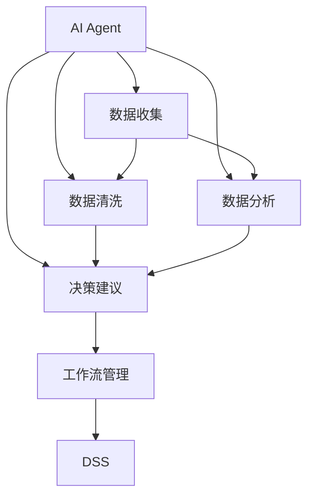

                 

# AI人工智能代理工作流 AI Agent WorkFlow：在决策支持系统中的应用

> 关键词：AI代理,工作流管理,决策支持系统,DSS,机器学习,深度学习,自然语言处理,NLP

## 1. 背景介绍

### 1.1 问题由来
随着信息技术和数据科学的发展，企业越来越依赖于数据分析和人工智能(AI)技术来辅助决策。然而，数据量大、种类繁多、结构复杂等因素，使得决策支持系统（Decision Support System, DSS）在实际应用中存在诸多挑战。传统的数据查询和报表展示已经难以满足现代业务决策的智能化需求。AI代理（AI Agent）作为一种智能工作流管理系统，能够自动化、智能化地处理和分析数据，帮助企业高效、准确地做出决策。

### 1.2 问题核心关键点
AI代理是一种利用AI技术，结合工作流管理思想，自动化处理和分析企业数据，提供决策支持的智能系统。它的核心作用在于：
1. 数据自动化处理：通过机器学习和自然语言处理（NLP）技术，自动提取、清洗和处理企业内部的海量数据。
2. 智能分析与建议：基于深度学习模型，对数据进行深入分析，识别出潜在问题和机会，提出相应的决策建议。
3. 工作流自动化管理：通过工作流引擎，将数据处理、分析、建议等环节自动化串联起来，形成一个闭环的决策支持流程。

AI代理的工作流管理系统一般包括：
1. 数据收集模块：从不同数据源中自动采集数据。
2. 数据清洗模块：对采集的数据进行清洗和预处理，包括去重、格式化、转换等。
3. 数据分析模块：利用机器学习、深度学习等技术对数据进行建模和分析。
4. 决策建议模块：根据分析结果，生成可行的决策建议。
5. 工作流管理模块：通过工作流引擎，自动化串联以上各个模块，形成一个完整的决策支持工作流。

### 1.3 问题研究意义
AI代理在决策支持系统中的应用，具有以下重要意义：
1. 提升决策效率：通过自动化数据处理和智能分析，显著缩短决策周期。
2. 提高决策质量：基于深度学习模型的智能分析，可以发现潜在问题和机会，提供更精准的决策建议。
3. 降低决策成本：通过智能工作流管理，减少人工干预，降低决策成本和人为错误。
4. 增强企业竞争力：利用AI代理辅助决策，帮助企业快速应对市场变化，提升竞争优势。

## 2. 核心概念与联系

### 2.1 核心概念概述

为更好地理解AI代理在决策支持系统中的应用，本节将介绍几个密切相关的核心概念：

- 人工智能代理（AI Agent）：利用AI技术，自动化处理和分析数据，辅助决策的智能系统。
- 工作流管理（Workflow Management）：通过工作流引擎，自动化串联多个工作环节，形成闭环的业务流程。
- 决策支持系统（Decision Support System, DSS）：利用AI、数据分析等技术，提供决策支持的智能系统。
- 机器学习（Machine Learning, ML）：通过数据训练模型，使模型能够自动进行预测和分类等任务。
- 深度学习（Deep Learning, DL）：利用多层神经网络对数据进行复杂的特征提取和分析。
- 自然语言处理（Natural Language Processing, NLP）：利用计算机处理和理解人类语言，包括语言生成、语言理解等。

这些核心概念之间的逻辑关系可以通过以下Mermaid流程图来展示：



这个流程图展示了一些关键组件之间的逻辑关系：

1. AI代理从数据源中自动采集数据。
2. 采集的数据经过清洗模块进行处理，确保数据质量和完整性。
3. 清洗后的数据进入数据分析模块，通过机器学习和深度学习技术进行建模和分析。
4. 分析结果传递给决策建议模块，生成可行的决策建议。
5. 最后，通过工作流管理模块，将数据处理、分析、建议等环节自动化串联起来，形成一个闭环的决策支持流程。

这些组件协同工作，帮助企业快速、准确地做出决策。

## 3. 核心算法原理 & 具体操作步骤
### 3.1 算法原理概述

AI代理在决策支持系统中的应用，核心算法原理基于机器学习和深度学习的自动分析和决策过程。其核心思想是：通过自动化数据处理和智能分析，快速生成决策建议，辅助决策者进行决策。

形式化地，假设决策任务为 $T$，输入为 $x$，输出为 $y$，则决策支持系统 $DSS$ 可以表示为：

$$
DSS: \mathcal{X} \rightarrow \mathcal{Y}
$$

其中 $\mathcal{X}$ 为输入空间，$\mathcal{Y}$ 为输出空间，$x$ 为决策输入，$y$ 为决策建议。AI代理 $Agent$ 的决策过程可以表示为：

$$
Agent: \mathcal{D} \rightarrow \mathcal{Y}
$$

其中 $\mathcal{D}$ 为决策数据集，$\mathcal{Y}$ 为决策建议。AI代理通过训练模型，从数据集中学习决策规则和模式，从而自动生成决策建议。

### 3.2 算法步骤详解

AI代理在决策支持系统中的应用，一般包括以下几个关键步骤：

**Step 1: 数据收集与预处理**
- 自动从企业内部和外部的不同数据源（如数据库、API、文件等）收集决策数据 $D$。
- 对采集的数据进行预处理，包括去重、格式化、转换等，确保数据质量和完整性。

**Step 2: 模型训练与优化**
- 选择合适的机器学习或深度学习模型，如回归、分类、聚类、神经网络等。
- 在决策数据集 $D$ 上训练模型，优化模型参数，使其能够准确地生成决策建议。
- 使用交叉验证、网格搜索等技术，选择最优模型和参数组合。

**Step 3: 数据处理与分析**
- 对原始数据进行进一步处理，包括特征提取、特征选择、特征归一化等。
- 使用机器学习或深度学习模型对数据进行建模和分析，识别出潜在问题和机会。

**Step 4: 生成决策建议**
- 根据模型的分析结果，生成可行的决策建议 $y$。
- 对决策建议进行验证和优化，确保其合理性和可行性。

**Step 5: 工作流自动化管理**
- 将数据收集、预处理、模型训练、数据处理、决策建议等环节自动化串联起来，形成一个完整的决策支持工作流。
- 使用工作流引擎，自动化管理各个环节的执行顺序和任务调度。

**Step 6: 反馈与优化**
- 定期收集用户反馈，评估决策建议的效果。
- 根据反馈结果，优化模型和算法，提高决策建议的准确性和实用性。

### 3.3 算法优缺点

AI代理在决策支持系统中的应用，具有以下优点：
1. 自动化处理数据：自动收集、清洗、处理数据，显著减少人工干预，提高效率。
2. 智能分析决策：利用机器学习和深度学习模型，进行深度分析，生成精准的决策建议。
3. 闭环工作流管理：通过工作流引擎，将各个环节自动化串联，形成一个完整的决策支持流程。
4. 快速响应变化：AI代理能够快速适应数据变化，自动更新模型和算法，保持决策建议的及时性。

同时，该方法也存在一定的局限性：
1. 数据质量依赖：模型的准确性依赖于数据的质量和完整性，数据错误或缺失可能导致决策错误。
2. 模型可解释性不足：深度学习模型的决策过程难以解释，难以理解模型的推理逻辑。
3. 模型泛化能力有限：模型训练依赖于特定领域的数据集，泛化能力可能受限。
4. 技术复杂度高：实现AI代理需要较强的技术背景，对数据科学家和工程师要求较高。

尽管存在这些局限性，但就目前而言，AI代理在决策支持系统中的应用，已成为提高决策效率和质量的重要手段。

### 3.4 算法应用领域

AI代理在决策支持系统中的应用，已经在多个领域得到广泛应用，例如：

- 金融决策：通过分析市场数据，预测股票走势，生成投资建议。
- 供应链管理：通过分析供应链数据，优化库存和物流管理，提高供应链效率。
- 医疗诊断：通过分析患者数据，生成诊断报告和治疗建议。
- 客户服务：通过分析客户数据，生成个性化服务和产品推荐。
- 风险管理：通过分析风险数据，生成风险评估报告和应对策略。
- 人力资源管理：通过分析员工数据，生成招聘、培训和绩效评估建议。

除了上述这些经典应用外，AI代理还被创新性地应用到更多场景中，如智能合约、智能投顾、智能客服等，为决策支持系统带来了全新的突破。随着技术的发展和应用的深入，相信AI代理将在更广阔的领域大放异彩。

## 4. 数学模型和公式 & 详细讲解  
### 4.1 数学模型构建

本节将使用数学语言对AI代理在决策支持系统中的应用过程进行更加严格的刻画。

假设决策任务 $T$ 的输入为 $x \in \mathcal{X}$，输出为 $y \in \mathcal{Y}$，其中 $\mathcal{X}$ 为输入空间，$\mathcal{Y}$ 为输出空间。AI代理 $Agent$ 的决策过程可以表示为：

$$
Agent: \mathcal{D} \rightarrow \mathcal{Y}
$$

其中 $\mathcal{D}$ 为决策数据集，$\mathcal{Y}$ 为决策建议。假设 $Agent$ 使用深度学习模型 $\theta$ 进行决策，则模型训练过程可以表示为：

$$
\theta^* = \mathop{\arg\min}_{\theta} \mathcal{L}(\theta, D)
$$

其中 $\mathcal{L}$ 为损失函数，用于衡量模型预测输出与真实标签之间的差异。常用的损失函数包括交叉熵损失、均方误差损失等。

### 4.2 公式推导过程

以二分类任务为例，推导交叉熵损失函数及其梯度的计算公式。

假设模型 $Agent$ 在输入 $x$ 上的输出为 $\hat{y}=M_{\theta}(x) \in [0,1]$，表示样本属于正类的概率。真实标签 $y \in \{0,1\}$。则二分类交叉熵损失函数定义为：

$$
\ell(M_{\theta}(x),y) = -[y\log \hat{y} + (1-y)\log (1-\hat{y})]
$$

将其代入经验风险公式，得：

$$
\mathcal{L}(\theta) = -\frac{1}{N}\sum_{i=1}^N [y_i\log M_{\theta}(x_i)+(1-y_i)\log(1-M_{\theta}(x_i))]
$$

根据链式法则，损失函数对参数 $\theta_k$ 的梯度为：

$$
\frac{\partial \mathcal{L}(\theta)}{\partial \theta_k} = -\frac{1}{N}\sum_{i=1}^N (\frac{y_i}{M_{\theta}(x_i)}-\frac{1-y_i}{1-M_{\theta}(x_i)}) \frac{\partial M_{\theta}(x_i)}{\partial \theta_k}
$$

其中 $\frac{\partial M_{\theta}(x_i)}{\partial \theta_k}$ 可进一步递归展开，利用自动微分技术完成计算。

在得到损失函数的梯度后，即可带入参数更新公式，完成模型的迭代优化。重复上述过程直至收敛，最终得到适应决策任务的最优模型参数 $\theta^*$。

## 5. 项目实践：代码实例和详细解释说明
### 5.1 开发环境搭建

在进行AI代理实践前，我们需要准备好开发环境。以下是使用Python进行TensorFlow开发的环境配置流程：

1. 安装Anaconda：从官网下载并安装Anaconda，用于创建独立的Python环境。

2. 创建并激活虚拟环境：
```bash
conda create -n tf-env python=3.8 
conda activate tf-env
```

3. 安装TensorFlow：根据CUDA版本，从官网获取对应的安装命令。例如：
```bash
conda install tensorflow-gpu==2.7 -c tf -c conda-forge
```

4. 安装各类工具包：
```bash
pip install numpy pandas scikit-learn matplotlib tqdm jupyter notebook ipython
```

完成上述步骤后，即可在`tf-env`环境中开始AI代理实践。

### 5.2 源代码详细实现

这里我们以金融决策任务为例，给出使用TensorFlow进行AI代理决策模型的PyTorch代码实现。

首先，定义金融决策任务的数据处理函数：

```python
import tensorflow as tf
import numpy as np
from sklearn.model_selection import train_test_split
from sklearn.preprocessing import MinMaxScaler

class FinancialDataProcessor:
    def __init__(self, data_path, target_col):
        self.data_path = data_path
        self.target_col = target_col
        self.scaler = MinMaxScaler()
        self.train_data, self.test_data = None, None
        
    def load_data(self):
        data = pd.read_csv(self.data_path)
        self.scaler.fit(data.drop(columns=[self.target_col]))
        self.train_data, self.test_data = train_test_split(data, test_size=0.2)
        return self.train_data, self.test_data
    
    def preprocess_data(self, data):
        data[self.target_col] = self.scaler.transform(data[[self.target_col]])
        return data
    
    def split_train_val(self, data, val_ratio=0.2):
        train, val = train_test_split(data, test_size=val_ratio)
        train_x, train_y = train.drop(columns=[self.target_col]), train[self.target_col]
        val_x, val_y = val.drop(columns=[self.target_col]), val[self.target_col]
        return train_x, train_y, val_x, val_y
```

然后，定义模型和优化器：

```python
from tensorflow.keras.layers import Input, Dense, Dropout
from tensorflow.keras.models import Model
from tensorflow.keras.optimizers import Adam

def build_model(input_shape, num_classes):
    input_layer = Input(shape=input_shape)
    hidden_layer = Dense(128, activation='relu')(input_layer)
    dropout_layer = Dropout(0.5)(hidden_layer)
    output_layer = Dense(num_classes, activation='sigmoid')(dropout_layer)
    model = Model(inputs=input_layer, outputs=output_layer)
    model.compile(optimizer=Adam(learning_rate=0.001), loss='binary_crossentropy', metrics=['accuracy'])
    return model

def train_model(model, train_x, train_y, val_x, val_y, epochs=10, batch_size=32):
    model.fit(train_x, train_y, validation_data=(val_x, val_y), epochs=epochs, batch_size=batch_size)
    return model
```

接着，定义训练和评估函数：

```python
def evaluate_model(model, test_x, test_y):
    loss, accuracy = model.evaluate(test_x, test_y)
    print(f"Test loss: {loss:.4f}, Test accuracy: {accuracy:.4f}")
    y_pred = model.predict(test_x)
    y_pred = (y_pred > 0.5).astype(int)
    y_true = test_y.astype(int)
    print(classification_report(y_true, y_pred))
```

最后，启动训练流程并在测试集上评估：

```python
input_shape = (20, )
num_classes = 1

data_processor = FinancialDataProcessor('financial_data.csv', 'return')
train_data, test_data = data_processor.load_data()

train_x, train_y = data_processor.preprocess_data(train_data)
val_x, val_y = data_processor.preprocess_data(train_data)
test_x, test_y = data_processor.preprocess_data(test_data)

model = build_model(input_shape, num_classes)
model = train_model(model, train_x, train_y, val_x, val_y)

evaluate_model(model, test_x, test_y)
```

以上就是使用TensorFlow进行金融决策任务AI代理实践的完整代码实现。可以看到，TensorFlow的Keras API提供了便捷的数据流图建模和优化器选择，使得模型训练和评估过程变得简洁高效。

### 5.3 代码解读与分析

让我们再详细解读一下关键代码的实现细节：

**FinancialDataProcessor类**：
- `__init__`方法：初始化数据路径和目标列名，创建MinMaxScaler对象。
- `load_data`方法：从数据路径加载数据，进行数据预处理，并切分为训练集和测试集。
- `preprocess_data`方法：对数据进行归一化处理，确保输入特征在同一尺度上。
- `split_train_val`方法：将数据集进一步切分为训练集、验证集和测试集，并返回各自的数据和标签。

**build_model函数**：
- 定义了简单的神经网络结构，包括输入层、隐藏层、Dropout层和输出层。
- 使用Adam优化器和二元交叉熵损失函数，进行模型编译。

**train_model函数**：
- 在训练集上使用Keras的`fit`方法，进行模型训练，并设置验证集。

**evaluate_model函数**：
- 使用Keras的`evaluate`方法，在测试集上评估模型性能。
- 使用sklearn的`classification_report`，打印分类器的性能指标。

**训练流程**：
- 定义输入特征的形状和输出类别的数量。
- 创建FinancialDataProcessor对象，加载和预处理数据。
- 将数据集切分为训练集、验证集和测试集。
- 构建神经网络模型，并进行训练。
- 在测试集上评估模型，打印分类器的性能指标。

可以看到，TensorFlow的Keras API使得AI代理的实现变得非常直观和简洁，大大降低了模型训练的门槛。开发者可以更加专注于模型的改进和优化，而不必过多关注底层实现细节。

当然，工业级的系统实现还需考虑更多因素，如模型的保存和部署、超参数的自动搜索、更灵活的任务适配层等。但核心的工作流管理逻辑基本与此类似。

## 6. 实际应用场景
### 6.1 智能客服系统

基于AI代理的工作流管理系统，可以广泛应用于智能客服系统的构建。传统客服往往需要配备大量人力，高峰期响应缓慢，且一致性和专业性难以保证。而使用AI代理的智能客服系统，可以7x24小时不间断服务，快速响应客户咨询，用自然流畅的语言解答各类常见问题。

在技术实现上，可以收集企业内部的历史客服对话记录，将问题和最佳答复构建成监督数据，在此基础上对预训练语言模型进行微调。微调后的语言模型能够自动理解用户意图，匹配最合适的答复模板进行回复。对于客户提出的新问题，还可以接入检索系统实时搜索相关内容，动态组织生成回答。如此构建的智能客服系统，能大幅提升客户咨询体验和问题解决效率。

### 6.2 金融舆情监测

金融机构需要实时监测市场舆论动向，以便及时应对负面信息传播，规避金融风险。传统的人工监测方式成本高、效率低，难以应对网络时代海量信息爆发的挑战。基于AI代理的文本分类和情感分析技术，为金融舆情监测提供了新的解决方案。

具体而言，可以收集金融领域相关的新闻、报道、评论等文本数据，并对其进行主题标注和情感标注。在此基础上对预训练语言模型进行微调，使其能够自动判断文本属于何种主题，情感倾向是正面、中性还是负面。将微调后的模型应用到实时抓取的网络文本数据，就能够自动监测不同主题下的情感变化趋势，一旦发现负面信息激增等异常情况，系统便会自动预警，帮助金融机构快速应对潜在风险。

### 6.3 个性化推荐系统

当前的推荐系统往往只依赖用户的历史行为数据进行物品推荐，无法深入理解用户的真实兴趣偏好。基于AI代理的个性化推荐系统，可以更好地挖掘用户行为背后的语义信息，从而提供更精准、多样的推荐内容。

在实践中，可以收集用户浏览、点击、评论、分享等行为数据，提取和用户交互的物品标题、描述、标签等文本内容。将文本内容作为模型输入，用户的后续行为（如是否点击、购买等）作为监督信号，在此基础上微调预训练语言模型。微调后的模型能够从文本内容中准确把握用户的兴趣点。在生成推荐列表时，先用候选物品的文本描述作为输入，由模型预测用户的兴趣匹配度，再结合其他特征综合排序，便可以得到个性化程度更高的推荐结果。

### 6.4 未来应用展望

随着AI代理和决策支持系统的不断发展，未来将在更多领域得到应用，为传统行业带来变革性影响。

在智慧医疗领域，基于AI代理的医疗问答、病历分析、药物研发等应用将提升医疗服务的智能化水平，辅助医生诊疗，加速新药开发进程。

在智能教育领域，AI代理可应用于作业批改、学情分析、知识推荐等方面，因材施教，促进教育公平，提高教学质量。

在智慧城市治理中，AI代理可应用于城市事件监测、舆情分析、应急指挥等环节，提高城市管理的自动化和智能化水平，构建更安全、高效的未来城市。

此外，在企业生产、社会治理、文娱传媒等众多领域，基于AI代理的决策支持系统也将不断涌现，为经济社会发展注入新的动力。相信随着技术的日益成熟，AI代理必将在构建人机协同的智能时代中扮演越来越重要的角色。

## 7. 工具和资源推荐
### 7.1 学习资源推荐

为了帮助开发者系统掌握AI代理的理论基础和实践技巧，这里推荐一些优质的学习资源：

1. 《深度学习》系列书籍：Ian Goodfellow等所著，全面介绍了深度学习的基础知识和核心算法。
2. 《自然语言处理综论》书籍：Christopher D. Manning等所著，系统讲解了自然语言处理的基本理论和实践方法。
3. Coursera《机器学习》课程：由Andrew Ng主讲，介绍了机器学习的基本概念和经典模型。
4. Coursera《深度学习专项课程》：由Andrew Ng主讲，介绍了深度学习的基本理论和实践方法。
5. TensorFlow官方文档：TensorFlow的官方文档，提供了丰富的模型库和实例代码，是上手实践的必备资料。

通过对这些资源的学习实践，相信你一定能够快速掌握AI代理的理论基础和实践技巧，并用于解决实际的NLP问题。
###  7.2 开发工具推荐

高效的开发离不开优秀的工具支持。以下是几款用于AI代理开发和部署的常用工具：

1. TensorFlow：由Google主导开发的开源深度学习框架，生产部署方便，适合大规模工程应用。
2. PyTorch：基于Python的开源深度学习框架，灵活度较高，适合研究型项目。
3. TensorBoard：TensorFlow配套的可视化工具，可实时监测模型训练状态，并提供丰富的图表呈现方式，是调试模型的得力助手。
4. Jupyter Notebook：免费的开源Web平台，支持Python、R等多种语言，便于数据探索和模型验证。
5. Weights & Biases：模型训练的实验跟踪工具，可以记录和可视化模型训练过程中的各项指标，方便对比和调优。

合理利用这些工具，可以显著提升AI代理的开发效率，加快创新迭代的步伐。

### 7.3 相关论文推荐

AI代理在决策支持系统中的应用，源于学界的持续研究。以下是几篇奠基性的相关论文，推荐阅读：

1. 《Agent-Based Multiagent Systems》：Richard J. Wooldridge等所著，全面介绍了多智能体系统中的代理设计。
2. 《Decision Support Systems》：George Mason等所著，系统讲解了决策支持系统的基础理论和应用方法。
3. 《Data Mining and Statistical Learning》：Tibshirani等所著，介绍了数据挖掘和机器学习的基本方法和应用场景。
4. 《Artificial Intelligence: A Modern Approach》：Stuart Russell等所著，全面介绍了人工智能的基本理论和应用方法。
5. 《Machine Learning: A Probabilistic Perspective》：Kevin P. Murphy等所著，介绍了机器学习的概率论基础和常用方法。

这些论文代表了大语言模型微调技术的发展脉络。通过学习这些前沿成果，可以帮助研究者把握学科前进方向，激发更多的创新灵感。

## 8. 总结：未来发展趋势与挑战
### 8.1 总结

本文对AI代理在决策支持系统中的应用进行了全面系统的介绍。首先阐述了AI代理和决策支持系统的研究背景和意义，明确了工作流管理范式在自动化数据处理和智能决策中的独特价值。其次，从原理到实践，详细讲解了AI代理的数学模型和核心算法，给出了AI代理决策模型的完整代码实例。同时，本文还广泛探讨了AI代理在智能客服、金融舆情、个性化推荐等多个行业领域的应用前景，展示了工作流管理范式在决策支持系统中的巨大潜力。此外，本文精选了AI代理技术的各类学习资源，力求为读者提供全方位的技术指引。

通过本文的系统梳理，可以看到，AI代理在决策支持系统中的应用，已经成为提升决策效率和质量的重要手段。未来，随着技术的不断发展，AI代理将会在更多领域得到广泛应用，为各行各业带来新的变革和突破。

### 8.2 未来发展趋势

展望未来，AI代理在决策支持系统中的应用，将呈现以下几个发展趋势：

1. 自动化程度提升：AI代理将进一步自动化数据处理、模型训练、模型优化等环节，实现更高程度的智能化决策。
2. 多模态融合：未来的AI代理将支持多模态数据融合，结合文本、图像、声音等多种信息，提供更加全面、准确的决策支持。
3. 跨领域应用拓展：AI代理将扩展到更多领域，如医疗、教育、金融、智能制造等，提升各行业的信息化和智能化水平。
4. 模型可解释性增强：未来的AI代理将更加注重模型可解释性，通过增加解释性模块，增强模型的透明度和可信度。
5. 智能化推荐系统：基于AI代理的推荐系统将更加智能，能够根据用户的历史行为和实时反馈，动态调整推荐策略，提供更加个性化、精准的服务。
6. 知识图谱融合：未来的AI代理将融合知识图谱等结构化知识，增强模型的背景知识和推理能力。

以上趋势凸显了AI代理在决策支持系统中的广泛应用前景。这些方向的探索发展，必将进一步提升决策系统的性能和实用性，为各行各业带来新的技术和商业机会。

### 8.3 面临的挑战

尽管AI代理在决策支持系统中的应用已经取得了显著成效，但在迈向更加智能化、普适化应用的过程中，仍面临诸多挑战：

1. 数据质量依赖：AI代理的性能依赖于数据的质量和完整性，数据错误或缺失可能导致决策错误。
2. 模型泛化能力有限：模型训练依赖于特定领域的数据集，泛化能力可能受限，难以适应新数据。
3. 技术复杂度高：实现AI代理需要较强的技术背景，对数据科学家和工程师要求较高。
4. 模型可解释性不足：深度学习模型的决策过程难以解释，难以理解模型的推理逻辑。
5. 隐私和安全问题：AI代理涉及大量的用户数据，如何保障数据隐私和安全，防止数据泄露和滥用，是亟待解决的问题。

尽管存在这些挑战，但AI代理在决策支持系统中的应用，仍具有广阔的应用前景和发展空间。通过不断探索和突破，相信AI代理必将在构建智能决策系统中扮演越来越重要的角色。

### 8.4 研究展望

面对AI代理在决策支持系统中面临的挑战，未来的研究需要在以下几个方面寻求新的突破：

1. 引入更多先验知识：将符号化的先验知识，如知识图谱、逻辑规则等，与神经网络模型进行巧妙融合，引导AI代理学习更准确、合理的语言模型。同时加强不同模态数据的整合，实现视觉、语音等多模态信息与文本信息的协同建模。
2. 提升模型可解释性：通过引入可解释性模块，如Attention机制、LIME等，增强模型的透明度和可信度。同时，结合自然语言处理技术，生成更加易于理解的决策报告。
3. 优化模型泛化能力：采用迁移学习、半监督学习等方法，提高AI代理在泛化能力上的表现。同时，加强数据增强、对抗训练等技术的应用，提升模型的鲁棒性。
4. 优化技术栈：通过优化算法、优化框架、优化工具等，提升AI代理的训练和推理效率。同时，探索分布式训练、模型压缩等技术，降低系统资源消耗。
5. 保障数据隐私和安全：采用数据加密、差分隐私等技术，保障用户数据的隐私和安全。同时，加强用户数据的匿名化和去标识化处理，防止数据泄露和滥用。

这些研究方向的探索，必将引领AI代理在决策支持系统中的技术进步，为构建更加智能、高效、安全的决策系统提供新的思路和方法。

## 9. 附录：常见问题与解答

**Q1：AI代理在决策支持系统中的应用效果如何？**

A: AI代理在决策支持系统中的应用效果显著。通过自动化数据处理和智能分析，显著提升了决策效率和质量。以智能客服系统为例，AI代理能够7x24小时不间断服务，快速响应客户咨询，显著提高了客户满意度和问题解决效率。在金融舆情监测领域，AI代理能够实时监测市场舆论动向，帮助金融机构及时应对潜在风险。在个性化推荐系统方面，AI代理能够根据用户历史行为和实时反馈，动态调整推荐策略，提供更加个性化、精准的服务。

**Q2：AI代理在决策支持系统中的实现难点是什么？**

A: AI代理在决策支持系统中的实现难点主要包括以下几个方面：
1. 数据质量依赖：AI代理的性能依赖于数据的质量和完整性，数据错误或缺失可能导致决策错误。
2. 模型泛化能力有限：模型训练依赖于特定领域的数据集，泛化能力可能受限，难以适应新数据。
3. 技术复杂度高：实现AI代理需要较强的技术背景，对数据科学家和工程师要求较高。
4. 模型可解释性不足：深度学习模型的决策过程难以解释，难以理解模型的推理逻辑。
5. 隐私和安全问题：AI代理涉及大量的用户数据，如何保障数据隐私和安全，防止数据泄露和滥用，是亟待解决的问题。

**Q3：如何提升AI代理在决策支持系统中的性能？**

A: 提升AI代理在决策支持系统中的性能，可以从以下几个方面入手：
1. 引入更多先验知识：将符号化的先验知识，如知识图谱、逻辑规则等，与神经网络模型进行巧妙融合，引导AI代理学习更准确、合理的语言模型。同时加强不同模态数据的整合，实现视觉、语音等多模态信息与文本信息的协同建模。
2. 提升模型可解释性：通过引入可解释性模块，如Attention机制、LIME等，增强模型的透明度和可信度。同时，结合自然语言处理技术，生成更加易于理解的决策报告。
3. 优化模型泛化能力：采用迁移学习、半监督学习等方法，提高AI代理在泛化能力上的表现。同时，加强数据增强、对抗训练等技术的应用，提升模型的鲁棒性。
4. 优化技术栈：通过优化算法、优化框架、优化工具等，提升AI代理的训练和推理效率。同时，探索分布式训练、模型压缩等技术，降低系统资源消耗。
5. 保障数据隐私和安全：采用数据加密、差分隐私等技术，保障用户数据的隐私和安全。同时，加强用户数据的匿名化和去标识化处理，防止数据泄露和滥用。

这些策略需要根据具体任务和数据特点进行灵活组合，以进一步提升AI代理在决策支持系统中的性能和实用性。

**Q4：AI代理在决策支持系统中的应用场景有哪些？**

A: AI代理在决策支持系统中的应用场景非常广泛，以下是几个典型的应用场景：
1. 智能客服系统：通过AI代理实现7x24小时不间断服务，快速响应客户咨询，显著提高客户满意度和问题解决效率。
2. 金融舆情监测：实时监测市场舆论动向，帮助金融机构及时应对潜在风险。
3. 个性化推荐系统：根据用户历史行为和实时反馈，动态调整推荐策略，提供更加个性化、精准的服务。
4. 医疗诊断：通过分析患者数据，生成诊断报告和治疗建议，辅助医生诊疗。
5. 供应链管理：优化库存和物流管理，提高供应链效率。
6. 客户服务：通过智能客服系统，实现客户自助服务，提高客户满意度。
7. 风险管理：分析风险数据，生成风险评估报告和应对策略，降低金融风险。

这些应用场景展示了AI代理在决策支持系统中的广泛应用前景，未来还有更多创新场景值得探索。

---

作者：禅与计算机程序设计艺术 / Zen and the Art of Computer Programming

