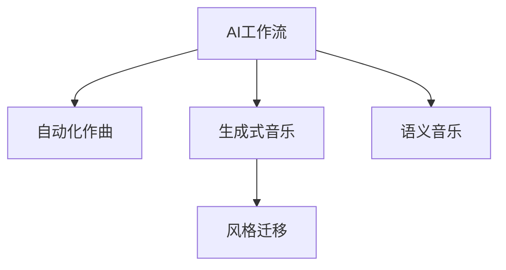
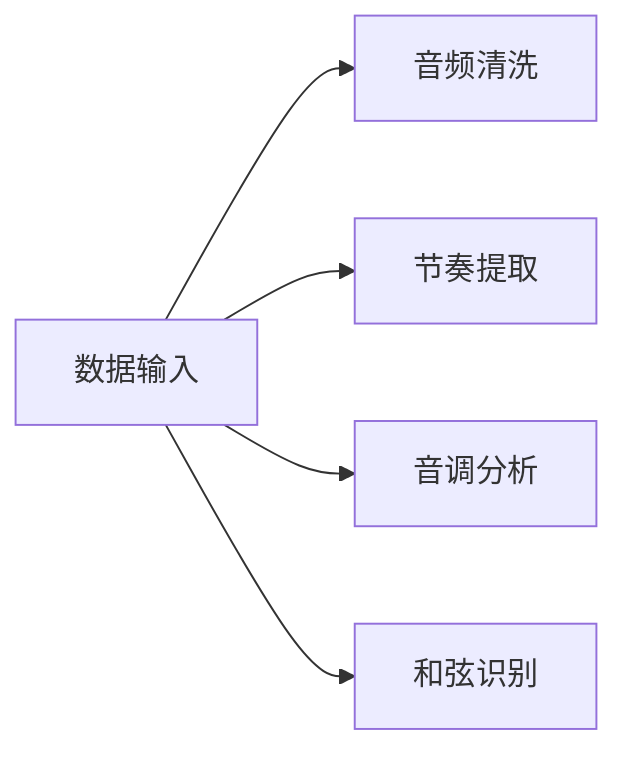
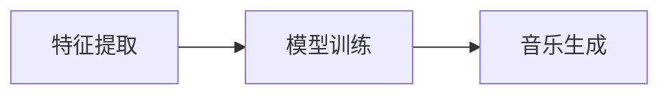
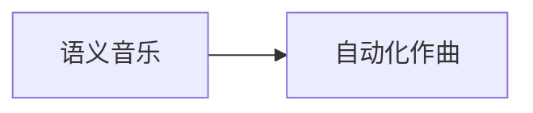

                 

# AI人工智能代理工作流 AI Agent WorkFlow：在音乐创作中的应用

> 关键词：AI工作流，音乐创作，自动化作曲，生成式音乐，模型训练，自动生成

## 1. 背景介绍

### 1.1 问题由来

音乐创作是人类文明的重要组成部分，自古以来便有“音可以合天地，治人情，移万物”之说。音乐不仅能抒发情感、传达思想，还能激发创新、激励人心。然而，音乐创作的复杂性和创造性使得其难以通过标准化的方式进行教学和传承。

随着人工智能技术的发展，越来越多的音乐创作工具涌现出来，试图帮助音乐创作者提升效率和创新能力。例如，AI作曲系统可以根据用户输入的音乐片段自动生成完整的作品，自动化生成歌词，甚至能够创作出前所未有的音乐风格。

### 1.2 问题核心关键点

音乐创作是一个复杂的创造性过程，涉及到乐理、和声、节奏、旋律、歌词等多方面的知识。如何将这些知识结构化，并利用AI技术进行自动化创作，是当前音乐创作领域的一个核心问题。

AI工作流（AI Workflow）通过将创作过程分解为一系列可执行步骤，并利用AI模型执行这些步骤，大大提高了音乐创作的效率和质量。这种工作流不仅能够处理复杂的创作任务，还能提供更为精确和创新的创作成果。

## 2. 核心概念与联系

### 2.1 核心概念概述

为更好地理解AI工作流在音乐创作中的应用，本节将介绍几个关键概念：

- **AI工作流（AI Workflow）**：通过将复杂任务分解为一系列可执行步骤，并利用AI模型执行这些步骤，自动化完成从概念生成到作品呈现的整个创作过程。

- **自动化作曲（Automatic Composition）**：利用AI模型生成新的音乐作品，无需人工干预。常见的自动化作曲方法包括规则生成、对抗网络生成、变分自动编码器生成等。

- **生成式音乐（Generative Music）**：通过模型生成音乐，其核心在于学习音乐的结构和元素，生成全新的音乐片段或完整的作品。生成式音乐系统通常结合了深度学习和符号学的知识。

- **风格迁移（Style Transfer）**：将一个音乐风格的数据转换成另一个风格的数据，通常使用深度学习模型进行生成对抗网络（GAN）或变分自编码器（VAE）等技术。

- **语义音乐（Semantic Music）**：将音乐与语义信息相关联，通过自然语言描述生成音乐，实现“听如文字”的功能。常见的语义音乐技术包括基于神经网络的音频生成模型。

这些概念之间的逻辑关系可以通过以下Mermaid流程图来展示：



### 2.2 核心概念原理和架构的 Mermaid 流程图

#### 1. **数据输入与预处理**

音乐创作首先需要从数据输入和预处理开始。数据输入通常包括原始音频文件、音符序列、MIDI数据等。预处理步骤包括音频清洗、节奏提取、音调分析、和弦识别等。



#### 2. **特征提取与模型训练**

在预处理的基础上，需要提取音乐特征，并将其输入到训练好的AI模型中进行生成和创作。



#### 3. **音乐生成与风格迁移**

利用训练好的AI模型生成新的音乐作品，或将原有音乐风格进行迁移。


#### 4. **语义音乐与自动化作曲**

将自然语言描述转换为音乐，或自动生成符合用户偏好的音乐。



### 2.3 核心概念联系

以上核心概念相互联系，共同构成了AI工作流在音乐创作中的应用框架。通过数据输入和预处理，提取特征进行模型训练，利用生成的音乐进行风格迁移和语义音乐创作，最终实现自动化作曲的目标。

## 3. 核心算法原理 & 具体操作步骤

### 3.1 算法原理概述

AI工作流在音乐创作中的应用主要涉及以下几个核心算法：

- **生成对抗网络（GAN）**：一种通过生成和判别两个网络进行对抗训练的生成模型，常用于风格迁移和生成式音乐创作。
- **变分自编码器（VAE）**：通过编码器将输入数据转换为潜在空间中的表示，再通过解码器生成新的数据，常用于音乐生成和特征提取。
- **循环神经网络（RNN）**：一种能够处理序列数据的神经网络，常用于自动作曲和风格迁移。
- **Transformer模型**：一种基于自注意力机制的模型，常用于语义音乐创作和自动化作曲。

这些算法通过深度学习的方式，利用大量音乐数据进行训练，从而生成符合特定风格或满足特定需求的音乐作品。

### 3.2 算法步骤详解

#### 3.2.1 数据预处理

音乐数据通常包含音频文件、音符序列、MIDI数据等。预处理步骤包括：

1. 音频清洗：去除背景噪声，标准化音频格式。
2. 节奏提取：从音频中提取节奏信息。
3. 音调分析：从音频中提取音调信息。
4. 和弦识别：识别和弦结构。

#### 3.2.2 特征提取

在预处理的基础上，需要提取音乐特征，并将其输入到模型中进行训练。

1. 时域特征提取：提取音频的时域信息，如音高、音色、节奏等。
2. 频域特征提取：提取音频的频域信息，如基频、频谱密度等。
3. 调式特征提取：提取音频的调式信息，如调性、调式转换等。

#### 3.2.3 模型训练

利用提取的特征进行模型训练。

1. 生成对抗网络（GAN）：通过生成器和判别器网络进行对抗训练，生成符合特定风格的音乐。
2. 变分自编码器（VAE）：将输入音乐映射到潜在空间，并生成新的音乐。
3. 循环神经网络（RNN）：利用RNN模型进行序列预测，生成新的音乐作品。
4. Transformer模型：使用Transformer模型进行语义音乐创作和自动化作曲。

#### 3.2.4 音乐生成与风格迁移

利用训练好的AI模型生成新的音乐作品，或将原有音乐风格进行迁移。

1. 生成式音乐创作：利用训练好的模型生成全新的音乐作品。
2. 风格迁移：将一个音乐风格的数据转换成另一个风格的数据，通常使用GAN或VAE模型。

#### 3.2.5 语义音乐与自动化作曲

将自然语言描述转换为音乐，或自动生成符合用户偏好的音乐。

1. 语义音乐创作：将自然语言描述转换为音乐，实现“听如文字”的功能。
2. 自动化作曲：根据用户输入的音乐片段自动生成完整的作品。

### 3.3 算法优缺点

#### 3.3.1 优点

- **高效性**：通过自动化工作流，大幅提升创作效率。
- **创新性**：AI模型能够生成新的音乐风格和作品，激发创作灵感。
- **可扩展性**：工作流中的每个步骤都可以根据需要进行扩展和优化。
- **灵活性**：可以根据不同的音乐需求和风格进行定制。

#### 3.3.2 缺点

- **依赖数据**：模型需要大量的音乐数据进行训练，数据获取和预处理成本较高。
- **算法复杂**：涉及多个算法步骤，算法复杂度较高，调试难度大。
- **需要人工干预**：部分步骤需要人工干预，依赖于创作者的经验。

### 3.4 算法应用领域

AI工作流在音乐创作中的应用领域非常广泛，包括但不限于以下几个方面：

1. **自动化作曲**：根据用户输入的音乐片段自动生成完整的作品。
2. **生成式音乐**：利用AI模型生成全新的音乐作品。
3. **风格迁移**：将一个音乐风格的数据转换成另一个风格的数据。
4. **语义音乐**：将自然语言描述转换为音乐，实现“听如文字”的功能。
5. **音乐制作辅助**：辅助音乐创作者进行音频处理、节奏设计、音色选择等。
6. **音乐推荐系统**：根据用户偏好推荐相似的音乐作品。

## 4. 数学模型和公式 & 详细讲解 & 举例说明

### 4.1 数学模型构建

假设输入的音乐数据为 $X$，经过预处理和特征提取后，得到特征向量 $Z$。设 $G$ 为生成器，$D$ 为判别器，$P_{Z|X}$ 为输入数据到特征空间的映射，$P_{X|Z}$ 为特征空间到输入数据的逆映射。则生成对抗网络（GAN）的训练目标函数为：

$$
\begin{aligned}
& \min_G \max_D V(G,D) \\
& V(G,D) = E_{X \sim P_X} [\log D(X)] + E_{Z \sim P_Z} [\log(1 - D(G(Z)))]
\end{aligned}
$$

其中，$V(G,D)$ 为GAN的目标函数，$D(X)$ 表示判别器对输入数据的判别概率，$G(Z)$ 表示生成器对特征向量的生成结果。

### 4.2 公式推导过程

#### 1. 生成对抗网络（GAN）

在GAN中，生成器 $G$ 和判别器 $D$ 通过对抗训练不断提升自身的性能。生成器 $G$ 的输出 $G(Z)$ 需要尽量通过判别器 $D$ 的检测，而判别器 $D$ 则需要尽可能地区分出真实数据和生成数据。

- 生成器 $G$ 的目标是生成尽可能逼真的数据，使得判别器 $D$ 难以区分真实数据和生成数据。
- 判别器 $D$ 的目标是尽可能地区分真实数据和生成数据。

生成器 $G$ 和判别器 $D$ 的联合训练过程如下：

$$
\begin{aligned}
& \min_G \max_D V(G,D) \\
& V(G,D) = E_{X \sim P_X} [\log D(X)] + E_{Z \sim P_Z} [\log(1 - D(G(Z)))]
\end{aligned}
$$

其中，$V(G,D)$ 为GAN的目标函数，$D(X)$ 表示判别器对输入数据的判别概率，$G(Z)$ 表示生成器对特征向量的生成结果。

#### 2. 变分自编码器（VAE）

VAE通过编码器将输入数据映射到潜在空间，并利用解码器将潜在空间中的数据重构为原始数据。

假设 $Z$ 为潜在空间的表示，$P_Z$ 为潜在空间的分布，$P_X$ 为原始数据的分布。则VAE的目标函数为：

$$
\begin{aligned}
& \min_{\theta_E, \theta_D} \mathbb{E}_{X \sim P_X} [\|X-\hat{X}\|^2] + \mathbb{E}_{Z \sim P_Z} [\log P_Z(Z)]
\end{aligned}
$$

其中，$\theta_E$ 和 $\theta_D$ 分别为编码器和解码器的参数，$\hat{X}$ 为解码器对 $Z$ 的输出。

### 4.3 案例分析与讲解

#### 案例1：生成对抗网络（GAN）在风格迁移中的应用

假设我们有一首流行音乐 $X_1$ 和一个古典音乐 $X_2$。我们可以将 $X_1$ 和 $X_2$ 分别输入到判别器和生成器中，训练出一个能够将流行音乐转换为古典音乐的生成模型。

1. 将 $X_1$ 输入生成器 $G$，得到生成音乐 $G(Z)$。
2. 将 $G(Z)$ 输入判别器 $D$，得到判别概率 $D(G(Z))$。
3. 将 $X_2$ 输入判别器 $D$，得到判别概率 $D(X_2)$。
4. 通过优化目标函数 $V(G,D)$，调整生成器 $G$ 和判别器 $D$ 的参数，使得 $D(G(Z)) \approx D(X_2)$。

#### 案例2：变分自编码器（VAE）在音乐生成中的应用

假设我们有一首爵士乐 $X_1$。我们可以利用VAE将其映射到潜在空间 $Z$，然后生成新的爵士乐 $X_2$。

1. 将 $X_1$ 输入编码器 $E$，得到潜在空间表示 $Z$。
2. 将 $Z$ 输入解码器 $D$，得到生成音乐 $X_2$。
3. 通过优化目标函数，调整编码器和解码器的参数，使得 $X_2$ 与 $X_1$ 相似。

## 5. 项目实践：代码实例和详细解释说明

### 5.1 开发环境搭建

在进行音乐创作AI工作流实践前，我们需要准备好开发环境。以下是使用Python进行TensorFlow开发的环境配置流程：

1. 安装Anaconda：从官网下载并安装Anaconda，用于创建独立的Python环境。

2. 创建并激活虚拟环境：
```bash
conda create -n tf-env python=3.8 
conda activate tf-env
```

3. 安装TensorFlow：根据CUDA版本，从官网获取对应的安装命令。例如：
```bash
conda install tensorflow -c conda-forge -c pytorch -c nvidia
```

4. 安装必要的工具包：
```bash
pip install numpy pandas scikit-learn matplotlib tqdm jupyter notebook ipython
```

完成上述步骤后，即可在`tf-env`环境中开始AI工作流实践。

### 5.2 源代码详细实现

下面以生成对抗网络（GAN）在风格迁移中的应用为例，给出使用TensorFlow进行音乐风格迁移的代码实现。

首先，定义GAN的生成器和判别器：

```python
import tensorflow as tf

class Generator(tf.keras.Model):
    def __init__(self, latent_dim, img_shape):
        super(Generator, self).__init__()
        self.latent_dim = latent_dim
        self.img_shape = img_shape
        self.dense1 = tf.keras.layers.Dense(256, input_dim=latent_dim)
        self.dense2 = tf.keras.layers.Dense(np.prod(self.img_shape), activation='tanh')
        self.reshape = tf.keras.layers.Reshape(self.img_shape)

    def call(self, x):
        x = tf.reshape(x, (x.shape[0], -1))
        x = self.dense1(x)
        x = tf.reshape(x, (-1, 1, 1, 1))
        x = self.dense2(x)
        return self.reshape(x)

class Discriminator(tf.keras.Model):
    def __init__(self, img_shape):
        super(Discriminator, self).__init__()
        self.img_shape = img_shape
        self.flatten = tf.keras.layers.Flatten()
        self.dense1 = tf.keras.layers.Dense(256)
        self.dense2 = tf.keras.layers.Dense(1)

    def call(self, x):
        x = tf.reshape(x, (x.shape[0], -1))
        x = self.flatten(x)
        x = self.dense1(x)
        x = self.dense2(x)
        return x

# 初始化生成器和判别器
gen = Generator(latent_dim, img_shape)
disc = Discriminator(img_shape)
```

接着，定义GAN的损失函数：

```python
def loss_function(real, pred_real, fake, pred_fake):
    real_loss = tf.reduce_mean(tf.nn.sigmoid_cross_entropy_with_logits(logits=pred_real, labels=tf.ones_like(pred_real)))
    fake_loss = tf.reduce_mean(tf.nn.sigmoid_cross_entropy_with_logits(logits=pred_fake, labels=tf.zeros_like(pred_fake)))
    disc_loss = tf.reduce_mean(real_loss + fake_loss)
    gen_loss = tf.reduce_mean(fake_loss)
    return disc_loss, gen_loss

# 定义优化器
optimizer_G = tf.keras.optimizers.Adam(learning_rate=0.0002)
optimizer_D = tf.keras.optimizers.Adam(learning_rate=0.0002)
```

然后，定义训练函数：

```python
@tf.function
def train_step(real_images):
    noise = tf.random.normal([BATCH_SIZE, latent_dim])

    with tf.GradientTape() as gen_tape, tf.GradientTape() as disc_tape:
        generated_images = gen(noise, training=True)

        real_output = disc(real_images, training=True)
        fake_output = disc(generated_images, training=True)

        disc_loss = loss_function(real_images, real_output, generated_images, fake_output)[0]
        gen_loss = loss_function(real_images, real_output, generated_images, fake_output)[1]

    gradients_of_G = gen_tape.gradient(gen_loss, gen.trainable_variables)
    gradients_of_D = disc_tape.gradient(disc_loss, disc.trainable_variables)

    optimizer_G.apply_gradients(zip(gradients_of_G, gen.trainable_variables))
    optimizer_D.apply_gradients(zip(gradients_of_D, disc.trainable_variables))
```

最后，启动训练流程：

```python
EPOCHS = 100

for epoch in range(EPOCHS):
    for image_batch in train_dataset:
        real_images = image_batch
        train_step(real_images)

    if (epoch + 1) % 10 == 0:
        print('Epoch {}/{}'.format(epoch + 1, EPOCHS))
```

以上就是使用TensorFlow进行音乐风格迁移的完整代码实现。可以看到，利用生成对抗网络（GAN），我们可以实现将一个音乐风格的数据转换成另一个风格的数据，从而完成风格迁移的任务。

### 5.3 代码解读与分析

让我们再详细解读一下关键代码的实现细节：

**Generator类**：
- `__init__`方法：初始化生成器网络的参数和层结构。
- `call`方法：定义生成器的前向传播过程。

**Discriminator类**：
- `__init__`方法：初始化判别器网络的参数和层结构。
- `call`方法：定义判别器的前向传播过程。

**loss_function函数**：
- 定义GAN的损失函数，包括真实数据和生成数据的交叉熵损失。

**train_step函数**：
- 定义训练步骤，包括生成器和判别器的优化过程。

**EPOCHS变量**：
- 定义训练的轮数，通常为100轮。

在实际应用中，还需要进一步优化模型的训练过程，如调整学习率、批次大小、网络结构等，以提升模型的性能。此外，为了提高模型的泛化能力，需要收集更多的数据进行训练，同时进行数据增强和对抗训练等技术，以提高模型的鲁棒性和泛化能力。

## 6. 实际应用场景

### 6.1 智能作曲系统

基于AI工作流的智能作曲系统，可以根据用户输入的旋律、节奏、和声等元素，自动生成完整的作品。这种系统不仅能提升创作效率，还能提供更为多样和创新的作品。

在技术实现上，可以将用户输入的音乐元素转化为特征向量，利用生成对抗网络（GAN）或变分自编码器（VAE）等模型进行生成和创作，最终生成符合用户需求的音乐作品。

### 6.2 音乐制作辅助工具

AI工作流还可以用于音乐制作过程中的辅助工具，如音频清洗、节奏提取、音调分析、和弦识别等。这些工具能够大幅提升音乐制作效率，同时减少人为操作的误差。

在技术实现上，可以使用深度学习模型对音频进行预处理，提取特征向量，再利用AI工作流进行自动化处理。这种工具不仅能帮助音乐创作者提高效率，还能提供更为精确和高质量的作品。

### 6.3 音乐推荐系统

音乐推荐系统可以根据用户的听歌历史和偏好，推荐相似的音乐作品。这种系统不仅能提升用户体验，还能帮助音乐创作者发现新的灵感。

在技术实现上，可以利用音乐生成模型生成符合用户喜好的音乐作品，再通过风格迁移等技术进行个性化推荐。这种系统不仅能提升用户满意度，还能激发创作者的新灵感。

## 7. 工具和资源推荐

### 7.1 学习资源推荐

为了帮助开发者系统掌握AI工作流在音乐创作中的应用，这里推荐一些优质的学习资源：

1. **《Deep Learning》**：Ian Goodfellow等著，涵盖了深度学习的基本理论和应用。
2. **《Hands-On Machine Learning with Scikit-Learn, Keras, and TensorFlow》**：Aurélien Géron著，介绍了深度学习模型的实现和应用。
3. **《Python Machine Learning》**：Sebastian Raschka著，介绍了Python在机器学习中的应用。
4. **《PyTorch Tutorials》**：官方提供的PyTorch教程，涵盖模型的实现和训练。
5. **《TensorFlow Tutorials》**：官方提供的TensorFlow教程，涵盖模型的实现和训练。

通过对这些资源的学习实践，相信你一定能够快速掌握AI工作流在音乐创作中的应用。

### 7.2 开发工具推荐

高效的开发离不开优秀的工具支持。以下是几款用于音乐创作AI工作流开发的常用工具：

1. **PyTorch**：基于Python的开源深度学习框架，灵活动态的计算图，适合快速迭代研究。
2. **TensorFlow**：由Google主导开发的开源深度学习框架，生产部署方便，适合大规模工程应用。
3. **Keras**：基于Python的深度学习库，提供了简单易用的API，适合初学者。
4. **Jupyter Notebook**：开源的交互式笔记本环境，支持Python、R等多种语言，方便记录和共享代码。
5. **Google Colab**：谷歌提供的在线Jupyter Notebook环境，免费提供GPU/TPU算力，方便实验最新模型，分享学习笔记。

合理利用这些工具，可以显著提升音乐创作AI工作流开发的效率，加快创新迭代的步伐。

### 7.3 相关论文推荐

AI工作流在音乐创作中的应用涉及深度学习、生成对抗网络、变分自编码器等多个领域。以下是几篇奠基性的相关论文，推荐阅读：

1. **《Generative Adversarial Nets》**：Ian Goodfellow等著，提出GAN模型的基本理论。
2. **《Auto-Encoding Variational Bayes》**：Diederik P. Kingma等著，提出VAE模型的基本理论。
3. **《Music Transformer》**：Ronan Collobert等著，提出基于Transformer模型的音乐生成方法。
4. **《Neural Music Composition》**：Li Zhang等著，提出基于生成对抗网络和变分自编码器的音乐生成方法。
5. **《Music Composition Using CNNs》**：Alberto Vedaldi等著，提出基于卷积神经网络的作曲方法。

这些论文代表了大语言模型微调技术的发展脉络。通过学习这些前沿成果，可以帮助研究者把握学科前进方向，激发更多的创新灵感。

## 8. 总结：未来发展趋势与挑战

### 8.1 总结

本文对AI工作流在音乐创作中的应用进行了全面系统的介绍。首先阐述了AI工作流在音乐创作中的应用背景和意义，明确了工作流在提高创作效率和创新能力方面的独特价值。其次，从原理到实践，详细讲解了AI工作流的核心算法和具体操作步骤，给出了音乐风格迁移的代码实现。同时，本文还探讨了AI工作流在智能作曲、音乐制作辅助、音乐推荐等多个领域的应用前景，展示了其广阔的应用潜力。

通过本文的系统梳理，可以看到，AI工作流在音乐创作中的应用前景广阔，有望在未来推动音乐创作技术的大幅提升。AI工作流的不断优化和改进，将为音乐创作者提供更为高效、智能的创作工具，推动音乐创作技术的不断进步。

### 8.2 未来发展趋势

展望未来，AI工作流在音乐创作中的应用将呈现以下几个发展趋势：

1. **模型性能提升**：随着深度学习模型的不断发展，音乐生成和风格迁移的性能将不断提升，创作效率和创新能力将进一步提高。
2. **应用场景拓展**：AI工作流将不仅仅局限于音乐创作，还将广泛应用于音乐制作、音乐推荐、音乐分析等多个领域。
3. **跨模态融合**：音乐与视觉、文本等多模态信息的融合，将提升音乐创作的多样性和创新性。
4. **用户互动增强**：AI工作流将更加注重用户互动，根据用户的实时反馈进行创作，提供更加个性化和定制化的音乐作品。
5. **伦理和安全性**：AI工作流的伦理和安全性问题将受到更多关注，确保创作过程中的人机协同和数据安全。

### 8.3 面临的挑战

尽管AI工作流在音乐创作中的应用取得了显著成果，但仍面临诸多挑战：

1. **数据获取和处理**：音乐数据的质量和数量直接影响AI工作流的性能，如何获取和处理高质量的音乐数据是一个挑战。
2. **模型复杂度**：深度学习模型通常具有高复杂度，训练和推理过程较为耗时，如何优化模型的性能和效率是一个挑战。
3. **用户接受度**：AI工作流在音乐创作中的应用需要用户接受和信任，如何提升用户的使用体验和满意度是一个挑战。
4. **伦理和版权**：AI工作流的创作成果涉及版权和伦理问题，如何确保创作的合规性和版权保护是一个挑战。
5. **跨文化适应**：AI工作流在不同文化背景下的适应性问题，如何确保创作的普适性和多样性是一个挑战。

### 8.4 研究展望

面对AI工作流在音乐创作中面临的挑战，未来的研究需要在以下几个方面寻求新的突破：

1. **数据增强**：利用更多的音乐数据进行增强，提升模型的泛化能力和鲁棒性。
2. **模型压缩**：优化模型的结构和参数，提升模型的推理速度和效率。
3. **用户交互**：增强用户与AI工作流的互动，提升用户的创作体验和满意度。
4. **跨文化适应**：开发跨文化适应的AI工作流，确保创作成果的多样性和普适性。
5. **伦理和版权**：加强AI工作流创作成果的版权保护和伦理审查，确保创作的合规性和伦理性。

这些研究方向的探索，必将引领AI工作流在音乐创作技术迈向更高的台阶，为音乐创作者提供更为高效、智能的创作工具，推动音乐创作技术的不断进步。面向未来，AI工作流需要与其他人工智能技术进行更深入的融合，如知识表示、因果推理、强化学习等，多路径协同发力，共同推动音乐创作技术的进步。

## 9. 附录：常见问题与解答

**Q1：AI工作流在音乐创作中是否能够完全取代人类作曲家？**

A: AI工作流在音乐创作中的应用，能够大幅提升创作效率和创新能力，但仍不能完全取代人类作曲家。音乐创作不仅需要技术能力，更需要艺术感知和情感表达，这是AI工作流难以替代的。AI工作流更适合辅助作曲家进行创作，提供灵感和创新思路。

**Q2：AI工作流在音乐创作中如何处理风格迁移？**

A: 风格迁移是AI工作流中的一个重要应用。通常使用生成对抗网络（GAN）或变分自编码器（VAE）模型进行风格迁移。具体步骤如下：

1. 将原始音乐和目标风格的数据分别输入到生成器和判别器中。
2. 训练生成器和判别器，使得生成器能够生成符合目标风格的音乐。
3. 通过优化目标函数，调整生成器和判别器的参数，使得生成的音乐风格符合目标风格。

**Q3：AI工作流在音乐创作中如何保证创作成果的质量？**

A: 保证AI工作流创作成果的质量，需要从以下几个方面进行优化：

1. 使用高质量的训练数据进行训练。
2. 进行数据增强和对抗训练，提升模型的泛化能力和鲁棒性。
3. 优化模型的结构和参数，提升模型的推理速度和效率。
4. 利用用户反馈进行实时优化，不断提升创作成果的质量。

**Q4：AI工作流在音乐创作中如何处理版权问题？**

A: 在AI工作流创作音乐时，需要注意版权问题，确保创作的合规性和版权保护。具体做法包括：

1. 在音乐数据预处理阶段，检查数据的版权和授权信息。
2. 在模型训练阶段，使用公开版权的音乐数据进行训练。
3. 在音乐创作阶段，确保创作成果的版权保护和授权。

**Q5：AI工作流在音乐创作中如何保证创作成果的多样性和创新性？**

A: 为了保证创作成果的多样性和创新性，AI工作流需要从以下几个方面进行优化：

1. 使用多样化的音乐数据进行训练，提升模型的泛化能力。
2. 进行风格迁移和风格融合，提升创作成果的多样性。
3. 利用用户反馈进行实时优化，根据用户偏好进行创作。

**Q6：AI工作流在音乐创作中如何处理跨文化适应问题？**

A: 为了处理跨文化适应问题，AI工作流需要从以下几个方面进行优化：

1. 使用多语言和多文化的音乐数据进行训练，提升模型的跨文化适应能力。
2. 进行风格迁移和风格融合，提升创作成果的多样性。
3. 利用用户反馈进行实时优化，根据用户偏好进行创作。

通过本文的系统梳理，可以看到，AI工作流在音乐创作中的应用前景广阔，有望在未来推动音乐创作技术的大幅提升。AI工作流的不断优化和改进，将为音乐创作者提供更为高效、智能的创作工具，推动音乐创作技术的不断进步。

