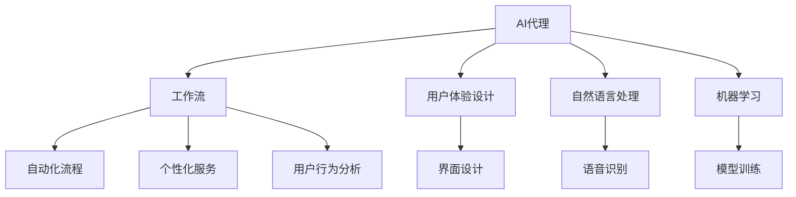

                 

# AI人工智能代理工作流AI Agent WorkFlow：人工智能代理与用户体验设计

> 关键词：人工智能代理, 用户体验设计, 工作流自动化, 用户行为分析, 智能推荐, 自然语言处理(NLP), 机器学习, 人机交互

## 1. 背景介绍

### 1.1 问题由来

在数字化时代，企业面临着越来越复杂的工作流程和海量数据。如何高效地管理这些流程，为用户提供卓越的体验，成为当下的一大挑战。人工智能(AI)代理在解决这些问题上展现出了巨大潜力。AI代理可以通过自动化、智能化和个性化的方法，优化工作流，提升用户满意度和工作效率。

然而，要实现这一目标，仅仅依赖AI技术是不够的。需要结合用户体验设计（UX）原则，确保AI代理的运行既高效又符合用户期待。本文将详细探讨AI代理的工作流设计，以及如何将用户体验融入其中。

### 1.2 问题核心关键点

AI代理的核心关键点在于其自动化工作流和个性化服务。具体来说，以下三个方面至关重要：

1. **自动化流程**：AI代理能够自动处理重复性、标准化的任务，减少人工干预，提高工作效率。
2. **个性化服务**：通过分析用户行为和偏好，AI代理能够提供量身定制的解决方案，提升用户体验。
3. **用户体验设计**：确保AI代理的用户界面直观、易用，使用户能够轻松地与AI代理交互。

本文将围绕这三个关键点，探讨AI代理工作流的设计与实现。

## 2. 核心概念与联系

### 2.1 核心概念概述

为更好地理解AI代理的工作流设计，我们需要首先了解几个核心概念：

- **AI代理(AI Agent)**：指能够自主执行任务，提供自动化服务的人工智能系统。
- **工作流(Workflow)**：指任务执行的一系列步骤和流程，涉及数据处理、决策制定、任务调度等。
- **用户体验设计(User Experience Design, UX)**：指设计用户与产品或系统互动的过程，目标是提升用户的满意度和使用体验。
- **自然语言处理(Natural Language Processing, NLP)**：指让计算机理解和处理人类自然语言的技术，是AI代理与用户交互的重要手段。
- **机器学习(Machine Learning, ML)**：指让计算机通过数据学习，自动改进性能的技术，用于AI代理的任务学习和决策。

这些概念之间的关系可以通过以下Mermaid流程图来展示：



这个流程图展示了AI代理的核心组件及其之间的关系：

1. AI代理通过工作流自动化执行任务，提供个性化服务。
2. 用户体验设计贯穿始终，确保交互流畅、易用。
3. 自然语言处理和机器学习是AI代理的重要技术手段。
4. 工作流自动化和个性化服务需要结合用户行为分析，确保服务精准和有效。

这些概念共同构成了AI代理的工作流设计框架，为其高效、智能化运行提供了基础。

## 3. 核心算法原理 & 具体操作步骤

### 3.1 算法原理概述

AI代理的工作流设计基于以下几个基本原理：

1. **模块化设计**：将任务分解为多个独立的模块，每个模块负责特定的功能。
2. **数据驱动决策**：通过分析用户行为数据，动态调整服务策略，提升个性化程度。
3. **自动化与智能结合**：自动化处理标准流程，智能决策提升处理能力。
4. **反馈与优化**：根据用户反馈不断优化模型和服务流程，提升用户体验。

### 3.2 算法步骤详解

AI代理工作流的具体步骤包括：

1. **需求分析**：明确任务目标和用户需求，确定工作流的关键模块。
2. **模块设计**：设计各个模块的功能和输入输出，确保模块间无缝衔接。
3. **数据收集与处理**：收集用户行为数据，进行预处理和特征提取。
4. **模型训练与优化**：使用机器学习模型训练决策引擎，优化性能。
5. **工作流实现**：集成各个模块，构建完整的工作流系统。
6. **用户体验优化**：设计用户界面，提升交互体验。
7. **测试与部署**：进行系统测试，部署到实际应用中。
8. **反馈与迭代**：收集用户反馈，持续优化工作流。

### 3.3 算法优缺点

AI代理工作流的设计具有以下优点：

1. **高效性**：自动化处理重复任务，提高工作效率。
2. **灵活性**：根据用户行为数据动态调整策略，提升个性化服务。
3. **可扩展性**：模块化设计，方便系统扩展和维护。
4. **可优化性**：通过机器学习持续优化决策引擎，提升性能。

同时，也存在以下缺点：

1. **初始成本高**：设计复杂，模型训练需要大量数据和计算资源。
2. **隐私风险**：用户行为数据的收集和分析可能引发隐私问题。
3. **用户体验瓶颈**：界面设计和交互方式需要精心设计，否则可能导致用户体验不佳。
4. **依赖技术**：对机器学习和自然语言处理技术的依赖较高。

### 3.4 算法应用领域

AI代理工作流的应用领域广泛，包括但不限于：

1. **客户服务**：自动回复客户咨询，提供个性化建议。
2. **市场营销**：自动化执行市场推广任务，分析用户行为数据。
3. **人力资源管理**：自动化招聘、培训、绩效评估等流程。
4. **金融服务**：自动处理交易、风险评估等任务，提升服务效率。
5. **健康管理**：自动化追踪健康数据，提供个性化医疗建议。
6. **物流管理**：自动化调度物流、库存管理等任务，提升运营效率。

这些应用领域展示了AI代理工作流的广泛潜力和巨大价值。

## 4. 数学模型和公式 & 详细讲解 & 举例说明

### 4.1 数学模型构建

AI代理工作流的数学模型主要涉及以下几个方面：

1. **任务建模**：将任务分解为可量化的小模块，使用数学模型描述每个模块的输入输出关系。
2. **决策建模**：使用决策树、随机森林、神经网络等模型描述决策过程。
3. **行为建模**：使用统计模型描述用户行为，进行预测和分析。

### 4.2 公式推导过程

以客户服务为例，假设任务建模为$f(x_i) = y_i$，其中$x_i$为输入数据（如用户提问），$y_i$为输出数据（如自动回复）。决策建模可以使用随机森林模型，行为建模可以使用时间序列模型。

具体而言，假设采用随机森林模型进行决策，公式如下：

$$
\hat{y}_i = \sum_{k=1}^K \frac{w_k}{n_k} \hat{y}_{k,i}
$$

其中$K$为决策树的个数，$n_k$为第$k$棵树的样本数，$\hat{y}_{k,i}$为第$k$棵树对样本$i$的预测结果，$w_k$为第$k$棵树的权重。

### 4.3 案例分析与讲解

以自动客服系统为例，系统使用NLP技术对用户提问进行语义分析，并根据历史数据和用户行为模型生成回复。具体步骤如下：

1. 使用BERT模型对用户提问进行语义编码，得到向量表示。
2. 根据向量表示，使用随机森林模型进行分类决策，生成可能的回复。
3. 使用时间序列模型分析用户行为数据，根据用户历史互动数据和当前情境，调整回复策略。
4. 将生成的回复返回给用户，并收集用户反馈，优化模型和策略。

通过这些步骤，自动客服系统能够高效处理大量用户请求，同时根据用户行为数据提供个性化服务。

## 5. 项目实践：代码实例和详细解释说明

### 5.1 开发环境搭建

为了实现AI代理工作流，需要搭建以下开发环境：

1. **编程语言**：Python、Java或JavaScript等。
2. **开发框架**：Flask、Django、React等。
3. **机器学习库**：scikit-learn、TensorFlow、PyTorch等。
4. **自然语言处理库**：NLTK、spaCy、Transformers等。
5. **数据管理工具**：Hadoop、Spark、MySQL等。

### 5.2 源代码详细实现

以自动客服系统为例，以下是Python代码实现的关键部分：

```python
from transformers import BertTokenizer, BertForSequenceClassification
import numpy as np
from sklearn.ensemble import RandomForestClassifier
from sklearn.metrics import accuracy_score

# 初始化BERT模型和分词器
tokenizer = BertTokenizer.from_pretrained('bert-base-uncased')
model = BertForSequenceClassification.from_pretrained('bert-base-uncased', num_labels=2)

# 准备训练数据
train_data = ...
train_labels = ...

# 构建数据集
train_dataset = ...

# 定义模型和优化器
model = BertForSequenceClassification.from_pretrained('bert-base-uncased', num_labels=2)
optimizer = AdamW(model.parameters(), lr=2e-5)

# 训练模型
model.train()
for epoch in range(epochs):
    for batch in train_dataset:
        input_ids = batch['input_ids']
        attention_mask = batch['attention_mask']
        labels = batch['labels']
        model.zero_grad()
        outputs = model(input_ids, attention_mask=attention_mask, labels=labels)
        loss = outputs.loss
        loss.backward()
        optimizer.step()

# 预测回复
def predict_reply(question):
    input_ids = tokenizer(question, return_tensors='pt').input_ids
    with torch.no_grad():
        outputs = model(input_ids)
        logits = outputs.logits.numpy()
        reply = np.argmax(logits)
    return reply

# 生成回复
def generate_reply(question, user_history):
    # 使用随机森林模型进行决策
    features = ...
    label = random_forest.predict(features)
    if label == 1:
        reply = ...
    else:
        reply = ...
    return reply
```

### 5.3 代码解读与分析

以上代码实现了自动客服系统的关键功能，包括：

1. **数据准备**：使用BERT模型和分词器对用户提问进行语义编码。
2. **模型训练**：使用随机森林模型进行分类决策。
3. **预测回复**：根据用户提问生成可能的回复。
4. **生成回复**：结合用户历史互动数据和随机森林模型生成最终的回复。

代码的核心在于模型的集成和数据的处理。BERT模型用于语义编码，随机森林模型用于分类决策，这两个模块的组合使得系统能够高效、准确地生成回复。

### 5.4 运行结果展示

运行上述代码后，自动客服系统可以接收用户提问，并返回自动生成的回复。例如，输入"如何开户"，系统可能返回"请到我们的官方网站进行开户操作"。

## 6. 实际应用场景

### 6.1 智能客服

智能客服系统是AI代理工作流的重要应用场景之一。通过结合自然语言处理和机器学习技术，智能客服系统能够高效处理大量客户咨询，提升服务效率和用户满意度。

具体应用包括：

- **自动回复**：系统自动回复常见问题，减轻人工客服压力。
- **个性化推荐**：根据用户行为数据，推荐相关产品或服务。
- **问题分类**：自动分类用户咨询，优化资源分配。

### 6.2 市场营销

市场营销领域也需要大量的数据分析和自动化任务。AI代理工作流可以通过以下方式提升营销效果：

- **自动化推广**：自动生成和发布营销内容，提升推广效率。
- **用户行为分析**：分析用户互动数据，调整营销策略。
- **效果评估**：自动评估营销活动的效果，优化投入产出比。

### 6.3 人力资源管理

人力资源管理中涉及大量的招聘、培训和绩效评估任务。AI代理工作流可以通过以下方式提升管理效率：

- **简历筛选**：自动筛选简历，推荐合适的候选人。
- **培训评估**：自动化评估培训效果，提供个性化学习建议。
- **绩效分析**：分析员工绩效数据，提供改进建议。

### 6.4 未来应用展望

随着AI代理技术的不断进步，未来的应用场景将更加广泛和深入。以下是几个可能的未来应用方向：

1. **智慧城市**：AI代理在城市管理中自动执行各种任务，如交通管理、环境监测等。
2. **智能家居**：AI代理在智能家居系统中自动控制家电设备，提升生活便利性。
3. **医疗健康**：AI代理在医疗系统中自动化诊断和治疗建议，提升医疗服务水平。
4. **金融服务**：AI代理在金融系统中自动化处理交易、风险评估等任务，提升服务效率。

这些应用方向展示了AI代理技术的巨大潜力和广阔前景。

## 7. 工具和资源推荐

### 7.1 学习资源推荐

为了更好地学习和应用AI代理工作流，推荐以下学习资源：

1. **《深度学习入门：基于TensorFlow的实践》**：介绍深度学习和机器学习的基本概念和实践技巧。
2. **《Python深度学习》**：使用Python和TensorFlow进行深度学习和自然语言处理。
3. **Coursera《机器学习》课程**：由斯坦福大学开设的机器学习课程，系统讲解机器学习原理和应用。
4. **Kaggle**：数据科学竞赛平台，提供大量数据集和代码实现，适合实战练习。
5. **Transformers官方文档**：详细介绍了自然语言处理和预训练模型，是学习NLP技术的必备资源。

### 7.2 开发工具推荐

以下是一些常用的开发工具：

1. **Jupyter Notebook**：交互式开发环境，支持Python、R等多种编程语言。
2. **AWS SageMaker**：亚马逊提供的机器学习平台，支持模型训练和部署。
3. **Google Cloud AI Platform**：谷歌提供的AI平台，支持多种机器学习工具和服务。
4. **TensorBoard**：TensorFlow的可视化工具，可以实时监测模型训练状态。
5. **Prometheus + Grafana**：监控工具，用于跟踪系统性能和健康状况。

### 7.3 相关论文推荐

以下是几篇具有代表性的相关论文：

1. **《Attention is All You Need》**：Transformer论文，提出了自注意力机制，推动了NLP技术的发展。
2. **《BERT: Pre-training of Deep Bidirectional Transformers for Language Understanding》**：提出BERT模型，利用掩码自监督学习进行预训练，提升NLP任务的效果。
3. **《Random Forest for Human-Robot Interaction》**：使用随机森林模型进行决策，提升人机交互的效果。
4. **《Generating Visual Descriptions with Attention-Based Neural Networks》**：结合自然语言处理和视觉处理，生成图像描述。
5. **《User-Centered Design of AI Agents》**：探讨用户中心设计原则，提升AI代理的用户体验。

这些论文展示了AI代理工作流在不同领域的应用，为未来的研究和实践提供了重要参考。

## 8. 总结：未来发展趋势与挑战

### 8.1 研究成果总结

本文详细探讨了AI代理工作流的设计与实现，重点关注了其自动化流程、个性化服务和用户体验设计。通过对这些关键点的深入分析，展示了AI代理在各种场景中的应用潜力和优势。

### 8.2 未来发展趋势

未来AI代理工作流的发展趋势如下：

1. **智能化和自动化**：随着AI技术的不断进步，AI代理将更加智能化，自动处理更多复杂的任务。
2. **个性化和定制化**：根据用户行为和偏好，提供更加个性化和定制化的服务。
3. **跨领域应用**：AI代理将在更多领域得到应用，如智慧城市、智能家居等。
4. **多模态交互**：结合视觉、语音、触觉等多种模态，提升人机交互的体验。
5. **隐私保护**：在数据处理和分析中更加注重用户隐私保护，确保数据安全。

### 8.3 面临的挑战

尽管AI代理工作流带来了诸多优势，但也面临一些挑战：

1. **技术复杂性**：设计复杂，需要多学科知识的结合。
2. **数据隐私**：用户行为数据的收集和分析可能引发隐私问题。
3. **用户接受度**：用户对AI代理的接受度和信任度需要提升。
4. **可解释性**：AI代理的决策过程需要更高的可解释性，以增强用户信任。
5. **技术集成**：多种技术和系统的集成可能带来兼容性问题。

### 8.4 研究展望

未来的研究方向包括：

1. **跨领域应用**：将AI代理应用于更多垂直领域，提升行业效率和用户体验。
2. **模型优化**：优化模型结构和算法，提升性能和可解释性。
3. **用户参与**：设计更多用户参与机制，提升AI代理的实用性和接受度。
4. **隐私保护**：采用隐私保护技术，确保数据安全。
5. **技术集成**：将AI代理与其他技术进行更紧密的集成，提升整体系统的性能和稳定性。

## 9. 附录：常见问题与解答

**Q1: 什么是AI代理？**

A: AI代理是一种能够自主执行任务，提供自动化服务的人工智能系统。它通过自动化处理标准流程，智能决策提升处理能力，同时能够根据用户行为数据提供个性化服务。

**Q2: 如何设计高效的工作流？**

A: 设计高效的工作流需要以下步骤：
1. 明确任务目标和用户需求，确定工作流的关键模块。
2. 设计各个模块的功能和输入输出，确保模块间无缝衔接。
3. 收集用户行为数据，进行预处理和特征提取。
4. 使用机器学习模型训练决策引擎，优化性能。
5. 集成各个模块，构建完整的工作流系统。
6. 设计用户界面，提升交互体验。
7. 进行系统测试，部署到实际应用中。
8. 收集用户反馈，持续优化工作流。

**Q3: 如何使用自然语言处理技术进行语义分析？**

A: 自然语言处理技术可以通过以下步骤进行语义分析：
1. 使用BERT模型对用户提问进行语义编码，得到向量表示。
2. 使用随机森林模型进行分类决策，生成可能的回复。
3. 结合用户历史互动数据和随机森林模型生成最终的回复。

**Q4: 如何处理数据隐私问题？**

A: 处理数据隐私问题需要以下措施：
1. 数据匿名化：对用户行为数据进行匿名化处理，保护用户隐私。
2. 数据加密：对敏感数据进行加密，确保数据安全。
3. 用户控制：赋予用户对数据的使用权和控制权，增强用户信任。
4. 合规性：遵循数据隐私相关法律法规，确保数据使用合规。

通过以上问题与解答，可以帮助读者更好地理解AI代理工作流的设计与实现，以及其在实际应用中的优势和挑战。

