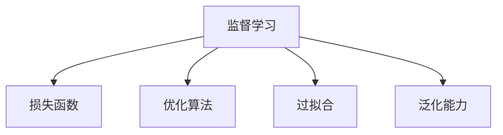

                 

# AI人工智能核心算法原理与代码实例讲解：监督学习

> 关键词：监督学习,算法原理,代码实现,优化方法,应用场景

## 1. 背景介绍

### 1.1 问题由来

在人工智能(AI)领域，监督学习(Supervised Learning)是训练模型进行预测和分类的核心算法之一。在监督学习中，模型通过大量有标签的训练数据进行学习，能够对新输入的数据进行准确的预测。监督学习广泛应用于图像分类、语音识别、文本处理等多个领域，成为AI算法的重要基础。

然而，监督学习的效果高度依赖于训练数据的质量和多样性。当训练数据不足或存在偏差时，模型容易出现过拟合或泛化能力不足的问题。因此，如何提高监督学习的效率和准确性，成为当前AI研究的重要方向。

### 1.2 问题核心关键点

监督学习的主要目标是训练一个模型，使得模型能够根据训练数据集中的输入和输出关系，对新的输入数据进行准确预测。其核心步骤包括：

- **数据准备**：收集有标签的数据集，划分为训练集、验证集和测试集。
- **模型选择**：选择合适的算法和模型结构，如线性回归、决策树、神经网络等。
- **模型训练**：通过梯度下降等优化算法，最小化损失函数，更新模型参数。
- **模型评估**：在验证集和测试集上评估模型性能，选择最优模型。
- **模型应用**：使用最优模型进行新的输入数据的预测。

监督学习的关键在于选择合适的模型和算法，进行有效的数据预处理和模型训练，并评估和优化模型性能。通过不断迭代，提高模型的泛化能力和准确性。

## 2. 核心概念与联系

### 2.1 核心概念概述

为了深入理解监督学习算法，本节将介绍几个关键概念：

- **监督学习(Supervised Learning)**：训练模型使用有标签的训练数据进行预测的算法。其目标是最大化模型在未知数据上的泛化能力。
- **损失函数(Loss Function)**：衡量模型预测与真实标签之间差异的函数。常见的损失函数包括均方误差(MSE)、交叉熵(Cross-Entropy)等。
- **优化算法(Optimization Algorithm)**：通过迭代更新模型参数，最小化损失函数的算法。常见的优化算法包括梯度下降、Adam、SGD等。
- **过拟合(Overfitting)**：模型在训练集上表现良好，但在测试集上表现差的现象。过拟合通常是由于模型复杂度过高或训练数据过少引起的。
- **泛化能力(Generalization Ability)**：模型在新数据上保持良好预测性能的能力。泛化能力强的模型能够处理各种未知数据。

这些概念之间的逻辑关系可以通过以下Mermaid流程图来展示：



这个流程图展示了一系列监督学习的基本流程，以及相关概念之间的关系：

1. 监督学习通过训练数据集，学习输入与输出之间的关系。
2. 损失函数衡量模型预测与真实标签的差异，指导模型更新。
3. 优化算法通过迭代更新模型参数，最小化损失函数。
4. 过拟合指模型在训练集上表现良好，但在测试集上表现差。
5. 泛化能力指模型在新数据上保持良好预测性能。

通过理解这些核心概念，我们可以更好地把握监督学习的原理和优化方向。

## 3. 核心算法原理 & 具体操作步骤
### 3.1 算法原理概述

监督学习的核心算法包括线性回归、逻辑回归、决策树、支持向量机(SVM)、神经网络等。以线性回归为例，其基本原理如下：

假设训练数据集为 $(x_i, y_i)$，其中 $x_i$ 为输入特征，$y_i$ 为输出标签。线性回归模型为 $y = \theta_0 + \theta_1x_1 + ... + \theta_nx_n$，其中 $\theta$ 为模型参数。监督学习的目标是最小化均方误差损失函数：

$$
L(\theta) = \frac{1}{N} \sum_{i=1}^N (y_i - \theta_0 - \theta_1x_{i1} - ... - \theta_nx_{in})^2
$$

通过梯度下降等优化算法，迭代更新模型参数 $\theta$，使得损失函数最小化。最终得到最优参数 $\hat{\theta}$。

### 3.2 算法步骤详解

以下是线性回归的详细操作步骤：

1. **数据准备**：收集有标签的训练数据集，划分为训练集、验证集和测试集。

2. **模型选择**：选择线性回归模型，并定义损失函数和优化算法。

3. **模型训练**：通过梯度下降算法，迭代更新模型参数 $\theta$，最小化损失函数。

4. **模型评估**：在验证集上评估模型性能，选择最优模型。

5. **模型应用**：使用最优模型对新输入数据进行预测。

### 3.3 算法优缺点

监督学习的主要优点包括：

- 适用范围广：适用于各种预测和分类任务，如图像分类、语音识别、自然语言处理等。
- 准确性高：通过大量有标签数据进行训练，模型能够学习到准确的输入与输出关系。
- 可解释性强：模型参数可以直接解释为输入特征的重要性。

监督学习的缺点包括：

- 数据依赖性强：需要大量高质量的标注数据，标注成本高。
- 容易过拟合：训练数据过少或模型复杂度过高时，容易出现过拟合。
- 计算资源消耗大：复杂模型和大量数据需要较高的计算资源。

### 3.4 算法应用领域

监督学习在多个领域得到了广泛应用，例如：

- **图像分类**：如手写数字识别、人脸识别等。通过训练数据集中的图像和标签，模型能够学习图像与分类之间的映射关系。
- **语音识别**：如自动语音识别(ASR)、语音合成(TTS)等。通过训练数据集中的语音和转写，模型能够学习语音与文本之间的映射关系。
- **自然语言处理(NLP)**：如情感分析、文本分类等。通过训练数据集中的文本和标签，模型能够学习文本与情感或分类之间的映射关系。
- **金融分析**：如股票价格预测、信用评分等。通过训练数据集中的历史数据和标签，模型能够学习数据与预测结果之间的映射关系。
- **医疗诊断**：如疾病诊断、病人分类等。通过训练数据集中的医疗数据和标签，模型能够学习数据与诊断结果之间的映射关系。

除了这些经典应用外，监督学习还在更多领域得到创新性应用，如推荐系统、游戏AI等，推动了AI技术的不断进步。

## 4. 数学模型和公式 & 详细讲解 & 举例说明
### 4.1 数学模型构建

假设训练数据集为 $(x_i, y_i)$，其中 $x_i$ 为输入特征，$y_i$ 为输出标签。定义线性回归模型为 $y = \theta_0 + \theta_1x_1 + ... + \theta_nx_n$，其中 $\theta$ 为模型参数。均方误差损失函数为：

$$
L(\theta) = \frac{1}{N} \sum_{i=1}^N (y_i - \theta_0 - \theta_1x_{i1} - ... - \theta_nx_{in})^2
$$

### 4.2 公式推导过程

线性回归的参数更新公式为：

$$
\theta \leftarrow \theta - \eta \nabla_{\theta}L(\theta)
$$

其中 $\eta$ 为学习率，$\nabla_{\theta}L(\theta)$ 为损失函数对参数 $\theta$ 的梯度。通过反向传播算法计算梯度，并根据梯度更新参数。

### 4.3 案例分析与讲解

以手写数字识别为例，训练数据集为 $(x_i, y_i)$，其中 $x_i$ 为手写数字的像素值，$y_i$ 为对应的数字标签。假设选择线性回归模型，并定义均方误差损失函数。

首先，定义模型参数 $\theta = \{\theta_0, \theta_1, ..., \theta_9\}$，其中 $\theta_0$ 为截距，$\theta_1, ..., \theta_9$ 为像素值对应的权重。训练数据集划分为训练集、验证集和测试集。

然后，选择梯度下降算法进行模型训练。在训练集上，计算损失函数 $L(\theta)$ 的梯度，并根据梯度更新参数 $\theta$。在验证集上评估模型性能，选择最优参数 $\hat{\theta}$。

最后，使用最优参数 $\hat{\theta}$ 对新手写数字的像素值进行预测，输出对应的数字标签。

## 5. 项目实践：代码实例和详细解释说明
### 5.1 开发环境搭建

在进行监督学习项目实践前，我们需要准备好开发环境。以下是使用Python进行TensorFlow开发的简单环境配置流程：

1. 安装Anaconda：从官网下载并安装Anaconda，用于创建独立的Python环境。

2. 创建并激活虚拟环境：
```bash
conda create -n tf-env python=3.8 
conda activate tf-env
```

3. 安装TensorFlow：根据CUDA版本，从官网获取对应的安装命令。例如：
```bash
conda install tensorflow tensorflow==2.4.0 -c tf -c conda-forge
```

4. 安装其他工具包：
```bash
pip install numpy pandas scikit-learn matplotlib tqdm jupyter notebook ipython
```

完成上述步骤后，即可在`tf-env`环境中开始监督学习项目开发。

### 5.2 源代码详细实现

下面是使用TensorFlow实现线性回归的完整代码实现：

```python
import tensorflow as tf
import numpy as np

# 准备训练数据
x_train = np.random.randn(100, 10)
y_train = np.dot(x_train, [1, 2, 3, 4, 5, 6, 7, 8, 9, 10]) + 1
x_test = np.random.randn(50, 10)
y_test = np.dot(x_test, [1, 2, 3, 4, 5, 6, 7, 8, 9, 10]) + 1

# 定义模型
x = tf.keras.Input(shape=(10,))
y = tf.keras.layers.Dense(1, kernel_initializer='random_normal')(x)
model = tf.keras.Model(inputs=x, outputs=y)

# 定义损失函数和优化器
loss_fn = tf.keras.losses.MeanSquaredError()
optimizer = tf.keras.optimizers.Adam()

# 训练模型
model.compile(optimizer=optimizer, loss=loss_fn)
model.fit(x_train, y_train, epochs=10, batch_size=32, validation_split=0.2)

# 评估模型
model.evaluate(x_test, y_test)

# 预测结果
predictions = model.predict(x_test)
```

### 5.3 代码解读与分析

让我们再详细解读一下关键代码的实现细节：

**定义训练数据**：
- `x_train` 和 `y_train` 为训练数据集，`x_test` 和 `y_test` 为测试数据集。

**定义模型**：
- `tf.keras.Input` 定义输入层，`tf.keras.layers.Dense` 定义全连接层。
- `kernel_initializer='random_normal'` 初始化权重。

**定义损失函数和优化器**：
- `tf.keras.losses.MeanSquaredError` 定义均方误差损失函数。
- `tf.keras.optimizers.Adam` 定义Adam优化器。

**训练模型**：
- `model.compile` 编译模型，指定优化器和损失函数。
- `model.fit` 训练模型，设置训练轮数和批次大小，`validation_split=0.2` 将20%的数据用于验证。

**评估模型**：
- `model.evaluate` 在测试集上评估模型性能。

**预测结果**：
- `model.predict` 对测试数据进行预测。

可以看到，TensorFlow框架使得监督学习的代码实现变得简洁高效。开发者可以将更多精力放在数据处理、模型改进等高层逻辑上，而不必过多关注底层的实现细节。

当然，工业级的系统实现还需考虑更多因素，如模型的保存和部署、超参数的自动搜索、更灵活的任务适配层等。但核心的监督学习范式基本与此类似。

## 6. 实际应用场景
### 6.1 智能推荐系统

基于监督学习的推荐系统广泛应用于电商、视频、音乐等平台，帮助用户发现符合自己兴趣的新内容。推荐系统通过用户的历史行为数据，预测用户可能感兴趣的新物品，并推荐给用户。

在技术实现上，可以收集用户浏览、点击、评分等行为数据，构建物品-标签的矩阵，训练模型学习用户-物品之间的相关性。在推荐新物品时，使用训练好的模型对用户和物品进行编码，计算相似度，推荐最相关的物品。

### 6.2 医疗诊断系统

监督学习在医疗诊断中也得到了广泛应用，如疾病预测、病人分类等。医疗数据通常包括病人的症状、历史数据、检测结果等，标注标签为疾病的名称或分类的编号。通过训练数据集中的历史数据和标签，模型能够学习数据与诊断结果之间的映射关系。

在实际应用中，可以使用监督学习模型对新病人的症状和检测结果进行编码，预测可能患有的疾病或分类，辅助医生诊断。

### 6.3 金融预测系统

金融预测系统通过监督学习模型预测股票价格、汇率变化等。训练数据集通常包括历史价格、交易量、经济指标等，标注标签为未来的价格或变化方向。通过训练数据集中的历史数据和标签，模型能够学习数据与预测结果之间的映射关系。

在实际应用中，可以使用监督学习模型对实时市场数据进行预测，帮助投资者做出更明智的投资决策。

### 6.4 未来应用展望

随着监督学习算法的不断进步，其在多个领域的应用前景将更加广阔。

在智慧城市治理中，监督学习模型可以应用于城市事件监测、舆情分析、应急指挥等环节，提高城市管理的自动化和智能化水平，构建更安全、高效的未来城市。

在智慧医疗领域，基于监督学习的医疗问答、病历分析、药物研发等应用将提升医疗服务的智能化水平，辅助医生诊疗，加速新药开发进程。

在智能教育领域，监督学习可应用于作业批改、学情分析、知识推荐等方面，因材施教，促进教育公平，提高教学质量。

此外，在企业生产、社会治理、文娱传媒等众多领域，监督学习技术也将不断涌现，为传统行业数字化转型升级提供新的技术路径。相信随着监督学习算法的持续演进，其应用场景将不断拓展，推动AI技术更好地造福人类社会。

## 7. 工具和资源推荐
### 7.1 学习资源推荐

为了帮助开发者系统掌握监督学习算法的理论基础和实践技巧，这里推荐一些优质的学习资源：

1. 《机器学习基础》课程：Coursera提供的经典机器学习课程，从线性回归、逻辑回归、决策树等基础概念讲起，逐步深入。

2. 《TensorFlow实战》书籍：TensorFlow官方团队编写的实战指南，通过多个实际案例，帮助你掌握TensorFlow的使用方法。

3. 《深度学习》书籍：Ian Goodfellow等著的深度学习经典教材，系统讲解了深度学习的基本概念和算法。

4. Kaggle竞赛平台：Kaggle是一个数据科学竞赛平台，提供了大量的监督学习竞赛和数据集，是提升算法实战能力的最佳场所。

5. Scikit-Learn官方文档：Scikit-Learn是一个Python机器学习库，提供了多种经典的监督学习算法，并有详细的文档和示例。

通过对这些资源的学习实践，相信你一定能够快速掌握监督学习算法的精髓，并用于解决实际的AI问题。

### 7.2 开发工具推荐

高效的开发离不开优秀的工具支持。以下是几款用于监督学习开发的常用工具：

1. TensorFlow：由Google主导开发的开源深度学习框架，生产部署方便，适合大规模工程应用。

2. PyTorch：基于Python的开源深度学习框架，灵活动态的计算图，适合快速迭代研究。

3. Scikit-Learn：Python机器学习库，提供了多种经典的监督学习算法，易于使用。

4. Weights & Biases：模型训练的实验跟踪工具，可以记录和可视化模型训练过程中的各项指标，方便对比和调优。

5. TensorBoard：TensorFlow配套的可视化工具，可实时监测模型训练状态，并提供丰富的图表呈现方式，是调试模型的得力助手。

6. Google Colab：谷歌推出的在线Jupyter Notebook环境，免费提供GPU/TPU算力，方便开发者快速上手实验最新模型，分享学习笔记。

合理利用这些工具，可以显著提升监督学习模型的开发效率，加快创新迭代的步伐。

### 7.3 相关论文推荐

监督学习在AI领域的发展源于学界的持续研究。以下是几篇奠基性的相关论文，推荐阅读：

1. Multinomial Logit Regression（多元逻辑回归）：阐述了逻辑回归算法的基本原理和应用。

2. Neural Networks for Machine Learning（神经网络在机器学习中的应用）：介绍了神经网络算法在监督学习中的应用，包括反向传播、梯度下降等关键技术。

3. Random Forests（随机森林）：提出了一种集成学习算法，通过多个决策树的投票结果来提高模型的泛化能力。

4. Support Vector Machines（支持向量机）：提出了一种将特征空间映射到高维空间，通过最大化边界来提高模型泛化能力的算法。

5. Deep Learning（深度学习）：Ian Goodfellow等著的深度学习经典教材，系统讲解了深度学习的基本概念和算法。

这些论文代表了大规模机器学习算法的发展脉络。通过学习这些前沿成果，可以帮助研究者把握学科前进方向，激发更多的创新灵感。

## 8. 总结：未来发展趋势与挑战
### 8.1 总结

本文对监督学习算法进行了全面系统的介绍。首先阐述了监督学习算法的背景和应用，明确了算法在预测和分类任务中的核心作用。其次，从原理到实践，详细讲解了监督学习的基本流程和关键步骤，给出了监督学习任务开发的完整代码实例。同时，本文还探讨了监督学习算法在多个领域的应用前景，展示了算法在实际应用中的巨大潜力。

通过本文的系统梳理，可以看到，监督学习算法在各个领域的应用已经相当成熟，未来仍有广阔的发展空间。不断优化的模型、算法和工具，将进一步推动AI技术的普及和应用。

### 8.2 未来发展趋势

展望未来，监督学习算法将呈现以下几个发展趋势：

1. 模型复杂度提升：随着数据量的增加和计算能力的提升，模型复杂度将进一步提高，能够学习更复杂的输入与输出关系。

2. 多任务学习(MTL)：将多个任务的学习相结合，提高模型的泛化能力和鲁棒性。

3. 自监督学习(SSL)：利用无标签数据进行预训练，减少对标注数据的依赖，提高模型的泛化能力。

4. 半监督学习(SL)：利用少量有标签数据和大量无标签数据进行训练，提高模型的性能和效率。

5. 联邦学习(FL)：多个设备或服务器在本地训练模型，并将结果聚合，提高模型的安全性和隐私性。

6. 动态模型调整：根据实时数据和反馈，动态调整模型参数，提高模型的适应性和实时性。

以上趋势凸显了监督学习算法的广阔前景。这些方向的探索发展，必将进一步提升AI系统的性能和应用范围，为人类认知智能的进化带来深远影响。

### 8.3 面临的挑战

尽管监督学习算法已经取得了瞩目成就，但在迈向更加智能化、普适化应用的过程中，它仍面临诸多挑战：

1. 数据质量问题：标注数据的质量和多样性直接影响模型性能。如何获取高质量、多样化的标注数据，成为重要挑战。

2. 模型过拟合：在训练数据不足或模型复杂度过高时，容易出现过拟合问题。如何平衡模型复杂度和训练数据量，提高泛化能力，是关键问题。

3. 计算资源消耗：复杂模型和大量数据需要较高的计算资源。如何优化模型结构和计算资源，提高算法的效率，是重要研究方向。

4. 可解释性不足：部分模型（如神经网络）缺乏可解释性，难以理解其内部工作机制和决策逻辑。如何提高模型的可解释性，是重要研究方向。

5. 安全性问题：部分监督学习模型可能存在潜在的安全漏洞，如模型被恶意攻击或操控。如何提高模型的安全性，是重要研究方向。

6. 伦理道德问题：部分监督学习模型可能学习到有害、歧视性的输出，带来伦理道德问题。如何制定伦理导向的算法评估指标，是重要研究方向。

这些挑战凸显了监督学习算法在应用中的复杂性和多样性。只有不断探索和创新，才能克服这些难题，推动监督学习算法迈向更高的台阶。

### 8.4 研究展望

面对监督学习算法所面临的挑战，未来的研究需要在以下几个方面寻求新的突破：

1. 探索无监督和半监督学习算法：摆脱对大量标注数据的依赖，利用自监督学习、主动学习等无监督和半监督范式，最大限度利用非结构化数据，实现更加灵活高效的监督学习。

2. 研究参数高效和计算高效的监督学习范式：开发更加参数高效的监督学习算法，在固定大部分预训练参数的同时，只更新极少量的任务相关参数。同时优化监督学习算法的计算图，减少前向传播和反向传播的资源消耗，实现更加轻量级、实时性的部署。

3. 引入更多先验知识：将符号化的先验知识，如知识图谱、逻辑规则等，与监督学习模型进行巧妙融合，引导监督学习过程学习更准确、合理的输入与输出关系。

4. 结合因果分析和博弈论工具：将因果分析方法引入监督学习模型，识别出模型决策的关键特征，增强输出解释的因果性和逻辑性。借助博弈论工具刻画人机交互过程，主动探索并规避模型的脆弱点，提高系统稳定性。

5. 纳入伦理道德约束：在监督学习目标中引入伦理导向的评估指标，过滤和惩罚有偏见、有害的输出倾向。同时加强人工干预和审核，建立模型行为的监管机制，确保输出符合人类价值观和伦理道德。

这些研究方向的探索，必将引领监督学习算法迈向更高的台阶，为构建安全、可靠、可解释、可控的智能系统铺平道路。面向未来，监督学习算法还需要与其他人工智能技术进行更深入的融合，如知识表示、因果推理、强化学习等，多路径协同发力，共同推动自然语言理解和智能交互系统的进步。只有勇于创新、敢于突破，才能不断拓展监督学习算法的边界，让智能技术更好地造福人类社会。

## 9. 附录：常见问题与解答

**Q1：监督学习是否适用于所有NLP任务？**

A: 监督学习在大多数NLP任务上都能取得不错的效果，特别是对于数据量较大的任务。但对于一些特定领域的任务，如医学、法律等，仅仅依靠通用语料预训练的模型可能难以很好地适应。此时需要在特定领域语料上进一步预训练，再进行监督学习，才能获得理想效果。此外，对于一些需要时效性、个性化很强的任务，如对话、推荐等，监督学习方法也需要针对性的改进优化。

**Q2：监督学习过程中如何选择合适的学习率？**

A: 监督学习的学习率一般要比预训练时小1-2个数量级，如果使用过大的学习率，容易破坏预训练权重，导致过拟合。一般建议从1e-5开始调参，逐步减小学习率，直至收敛。也可以使用warmup策略，在开始阶段使用较小的学习率，再逐渐过渡到预设值。需要注意的是，不同的优化器(如Adam、SGD等)以及不同的学习率调度策略，可能需要设置不同的学习率阈值。

**Q3：在监督学习过程中，如何缓解过拟合问题？**

A: 过拟合是监督学习面临的主要挑战，尤其是在训练数据不足的情况下。常见的缓解策略包括：
1. 数据增强：通过回译、近义替换等方式扩充训练集
2. 正则化：使用L2正则、Dropout、Early Stopping等避免过拟合
3. 对抗训练：引入对抗样本，提高模型鲁棒性
4. 参数高效监督学习：只调整少量参数(如Bagging、Boosting等)，减小过拟合风险
5. 多模型集成：训练多个监督学习模型，取平均输出，抑制过拟合

这些策略往往需要根据具体任务和数据特点进行灵活组合。只有在数据、模型、训练、推理等各环节进行全面优化，才能最大限度地发挥监督学习的威力。

**Q4：在实际应用中，如何进行监督学习的模型部署？**

A: 将监督学习模型转化为实际应用，还需要考虑以下因素：
1. 模型裁剪：去除不必要的层和参数，减小模型尺寸，加快推理速度
2. 量化加速：将浮点模型转为定点模型，压缩存储空间，提高计算效率
3. 服务化封装：将模型封装为标准化服务接口，便于集成调用
4. 弹性伸缩：根据请求流量动态调整资源配置，平衡服务质量和成本
5. 监控告警：实时采集系统指标，设置异常告警阈值，确保服务稳定性
6. 安全防护：采用访问鉴权、数据脱敏等措施，保障数据和模型安全

合理利用这些工具，可以显著提升监督学习模型的开发效率，加快创新迭代的步伐。

---

作者：禅与计算机程序设计艺术 / Zen and the Art of Computer Programming

