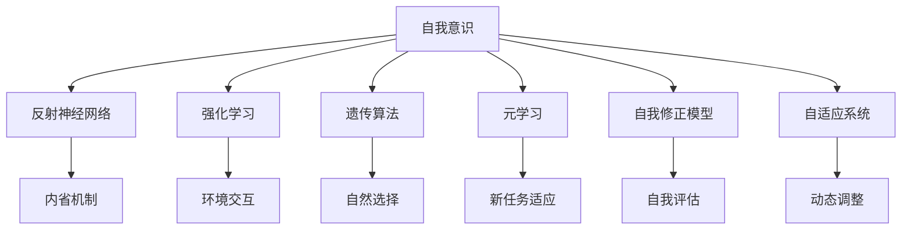
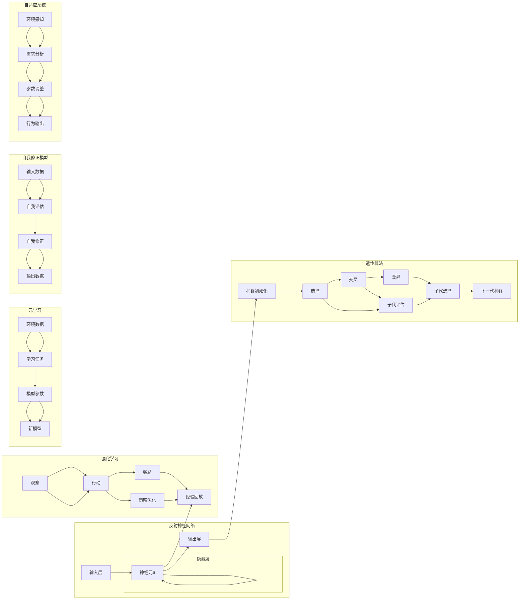

                 

# AI人工智能核心算法原理与代码实例讲解：自我意识

## 1. 背景介绍

### 1.1 问题由来

自我意识（Self-Awareness），是人工智能研究中的一个核心概念，它涉及机器对自身状态、认知能力的觉知和理解。这种能力不仅限于简单的模式识别，还包括自我反思、自我修正、自我进化等多层次认知。目前，自我意识在人工智能领域内是一个前沿且极具挑战性的课题。

### 1.2 问题核心关键点

1. **定义与实现**：自我意识如何定义？如何通过算法实现？
2. **自我反思**：机器如何识别和评估自身的认知能力与局限性？
3. **自我修正**：机器如何基于反馈进行调整和改进？
4. **自我进化**：机器如何根据环境变化和需求进行动态学习与适应？
5. **技术路线**：当前实现自我意识的技术路线和方法有哪些？

## 2. 核心概念与联系

### 2.1 核心概念概述

- **自我意识**：指机器对自己认知状态和能力的觉知与理解。
- **反射神经网络**：一种能够实现自我反思的神经网络结构，通过内省机制模拟人类自我意识。
- **强化学习**：一种通过与环境的交互，不断优化自身策略的学习方式，常用于自我修正和进化。
- **遗传算法**：一种模拟自然选择和遗传的算法，用于优化复杂问题的解决方案，可用于自我进化。
- **元学习**：一种学习如何学习的方法，通过学习如何适应新任务，实现自我进化。
- **自我修正模型**：通过自我反思和自我评估，不断修正自身认知和行为的模型。
- **自适应系统**：能够根据环境变化和需求，动态调整自身参数和行为的系统。

这些概念之间的逻辑关系可以通过以下Mermaid流程图来展示：



这个流程图展示了几大核心概念及其之间的关系：

1. 自我意识是其他概念的基础，通过各种技术实现。
2. 反射神经网络实现自我反思，强化学习实现自我修正，遗传算法实现自我进化。
3. 元学习实现自我适应，自我修正模型和自适应系统用于自我优化。

### 2.2 核心概念原理和架构的 Mermaid 流程图



## 3. 核心算法原理 & 具体操作步骤

### 3.1 算法原理概述

自我意识可以通过多种算法实现，主要包括反射神经网络、强化学习、遗传算法和元学习等。以下是这些算法的基本原理概述：

- **反射神经网络**：通过输入层、隐藏层和输出层的连接，实现对自身状态的编码和解码，并通过内省机制进行自我反思。
- **强化学习**：通过与环境的交互，根据奖励信号调整策略，实现自我修正。
- **遗传算法**：通过模拟自然选择和遗传过程，优化问题解决方案，实现自我进化。
- **元学习**：通过学习如何学习，使模型能够适应新任务，实现自我适应。

### 3.2 算法步骤详解

#### 3.2.1 反射神经网络步骤

1. **输入层**：接收环境感知数据，如当前状态、输入信号等。
2. **隐藏层**：通过神经元进行计算和处理，模拟人脑中的思维过程。
3. **输出层**：输出自我反思结果，如认知能力评估、行为调整策略等。
4. **内省机制**：定期或触发式地对自身状态进行评估，反馈到隐藏层进行调整。

#### 3.2.2 强化学习步骤

1. **观察**：观察当前环境状态，获取相关数据。
2. **行动**：根据当前状态和策略，选择具体行动。
3. **奖励**：根据行动结果，获取环境奖励。
4. **策略优化**：根据奖励信号，调整策略参数，优化行为输出。
5. **经验回放**：将每次交互的完整信息存储下来，供后续学习和优化使用。

#### 3.2.3 遗传算法步骤

1. **种群初始化**：随机生成初始种群，每个个体代表一种解决方案。
2. **选择**：根据适应度函数，选择优秀个体进行交叉和变异。
3. **交叉**：通过交叉操作，产生新的个体，继承父代优秀特征。
4. **变异**：通过随机变异，引入新的变化，促进多样性。
5. **子代评估**：对新生成的子代进行评估，确定其适应度。
6. **子代选择**：根据评估结果，选择优秀子代组成下一代种群。

#### 3.2.4 元学习步骤

1. **环境数据**：收集和整理训练环境的数据。
2. **学习任务**：定义具体的学习目标和任务。
3. **模型参数**：初始化或优化模型参数，设置学习超参数。
4. **新模型**：通过模型训练和优化，生成新的模型。
5. **模型评估**：对新模型进行评估，确定其性能。
6. **迭代训练**：反复迭代训练，不断优化模型参数，提高模型适应性。

### 3.3 算法优缺点

**反射神经网络的优缺点**：
- **优点**：能够进行自我反思，模拟人类思维过程。
- **缺点**：复杂度高，训练难度大，资源消耗大。

**强化学习的优缺点**：
- **优点**：能够根据环境反馈进行自我修正，适应性强。
- **缺点**：依赖于环境奖励，难以处理不确定性高的任务。

**遗传算法的优缺点**：
- **优点**：适用于复杂问题，具有全局搜索能力。
- **缺点**：计算量大，迭代时间长，容易陷入局部最优。

**元学习的优缺点**：
- **优点**：能够学习如何学习，提高模型适应性。
- **缺点**：算法复杂，需要大量数据和计算资源。

### 3.4 算法应用领域

自我意识算法主要应用于以下几个领域：

1. **智能机器人**：通过自我意识，实现对自身行为的认知和修正，提高决策能力和适应性。
2. **自动驾驶**：通过自我反思和自我修正，提高环境感知和行为控制能力，提升安全性。
3. **医疗诊断**：通过自我意识，增强对自身诊断模型的评估和优化，提高诊断准确性。
4. **金融交易**：通过自我进化和自我适应，优化交易策略，提升投资回报率。
5. **教育推荐**：通过自我反思和自我修正，个性化推荐学习资源，提升学习效果。

## 4. 数学模型和公式 & 详细讲解 & 举例说明

### 4.1 数学模型构建

我们以反射神经网络为例，构建一个简单的数学模型：

1. **输入层**：$x = (x_1, x_2, ..., x_n)$，其中 $x_i$ 为输入特征。
2. **隐藏层**：$h = (h_1, h_2, ..., h_m)$，其中 $h_i = f(w_i^T \cdot x + b_i)$，$w_i$ 为权重矩阵，$b_i$ 为偏置项，$f$ 为激活函数。
3. **输出层**：$y = (y_1, y_2, ..., y_k)$，其中 $y_i = g(w_i^T \cdot h + b_i)$，$g$ 为输出函数。

### 4.2 公式推导过程

- **输入层到隐藏层**：
$$
h_i = f(w_i^T \cdot x + b_i)
$$

- **隐藏层到输出层**：
$$
y_i = g(w_i^T \cdot h + b_i)
$$

其中 $f$ 和 $g$ 可以是任意激活函数，如 ReLU、Sigmoid 等。权重矩阵 $w_i$ 和偏置项 $b_i$ 需要通过训练得到。

### 4.3 案例分析与讲解

假设我们有一个简单的反射神经网络，用于判断机器的“清醒度”。

1. **输入层**：接收机器的 CPU 温度、电池电量、系统负载等数据。
2. **隐藏层**：通过神经元进行计算，输出一个“清醒度”评分。
3. **输出层**：根据评分，调整机器的行为，如降低 CPU 频率、关闭不必要的进程等。
4. **内省机制**：每隔一段时间，机器自动评估当前状态，调整行为策略。

## 5. 项目实践：代码实例和详细解释说明

### 5.1 开发环境搭建

1. **安装 Python**：从官网下载并安装 Python 3.9 或更高版本。
2. **安装 PyTorch**：通过以下命令安装 PyTorch：
```
pip install torch torchvision torchaudio
```
3. **安装 NumPy**：通过以下命令安装 NumPy：
```
pip install numpy
```

### 5.2 源代码详细实现

#### 5.2.1 反射神经网络实现

```python
import torch
import torch.nn as nn
import torch.optim as optim

class ReflexNeuron(nn.Module):
    def __init__(self, input_size, hidden_size, output_size):
        super(ReflexNeuron, self).__init__()
        self.input_size = input_size
        self.hidden_size = hidden_size
        self.output_size = output_size
        
        self.linear1 = nn.Linear(input_size, hidden_size)
        self.linear2 = nn.Linear(hidden_size, output_size)
        
        self.activation = nn.ReLU()
        
    def forward(self, x):
        h = self.linear1(x)
        h = self.activation(h)
        y = self.linear2(h)
        return y

# 定义模型
model = ReflexNeuron(input_size=10, hidden_size=20, output_size=1)

# 定义损失函数和优化器
criterion = nn.MSELoss()
optimizer = optim.Adam(model.parameters(), lr=0.001)

# 训练模型
def train(model, criterion, optimizer, input, target):
    optimizer.zero_grad()
    output = model(input)
    loss = criterion(output, target)
    loss.backward()
    optimizer.step()
    return loss.item()

# 训练数据
inputs = torch.randn(100, 10)
targets = torch.randn(100, 1)

# 训练模型
for epoch in range(100):
    loss = train(model, criterion, optimizer, inputs, targets)
    print(f"Epoch {epoch+1}, Loss: {loss:.4f}")
```

#### 5.2.2 强化学习实现

```python
import numpy as np
import gym

class ReinforcementAgent:
    def __init__(self, env):
        self.env = env
        self.q = np.zeros((env.observation_space.n, env.action_space.n))
        self.learning_rate = 0.1
        self.gamma = 0.9
        
    def choose_action(self, state):
        return np.argmax(self.q[state, :])
    
    def update_q_table(self, state, action, reward, next_state):
        self.q[state, action] += self.learning_rate * (reward + self.gamma * np.max(self.q[next_state, :]) - self.q[state, action])

# 定义环境
env = gym.make('CartPole-v0')

# 初始化代理
agent = ReinforcementAgent(env)

# 训练代理
for episode in range(1000):
    state = env.reset()
    done = False
    while not done:
        action = agent.choose_action(state)
        next_state, reward, done, _ = env.step(action)
        agent.update_q_table(state, action, reward, next_state)
        state = next_state
```

#### 5.2.3 遗传算法实现

```python
import random
import numpy as np

class GeneticAlgorithm:
    def __init__(self, population_size=100, chromosome_size=10, mutation_rate=0.1):
        self.population_size = population_size
        self.chromosome_size = chromosome_size
        self.mutation_rate = mutation_rate
        self.generation = 0
        
        self.population = [self.generate_chromosome() for _ in range(population_size)]
        self.fitness = [self.calculate_fitness(chromosome) for chromosome in self.population]
        
    def generate_chromosome(self):
        return [random.randint(0, 1) for _ in range(self.chromosome_size)]
    
    def calculate_fitness(self, chromosome):
        # 假设 fitness 函数为染色体中 1 的个数
        return sum(chromosome)
    
    def select(self):
        fitness_sum = sum(self.fitness)
        probabilities = [chromosome_fitness/fitness_sum for chromosome_fitness in self.fitness]
        return np.random.choice(self.population, p=probabilities)
    
    def crossover(self, parent1, parent2):
        start = random.randint(0, self.chromosome_size)
        end = start + random.randint(0, self.chromosome_size - start)
        child = [chromosome[i] for i in range(start, end)]
        child += [parent1[i] for i in range(end, self.chromosome_size)]
        return child
    
    def mutate(self, chromosome):
        for i in range(self.chromosome_size):
            if random.random() < self.mutation_rate:
                chromosome[i] = 1 - chromosome[i]
        return chromosome
    
    def generate_next_generation(self):
        self.generation += 1
        
        new_population = []
        while len(new_population) < self.population_size:
            parent1 = self.select()
            parent2 = self.select()
            child = self.crossover(parent1, parent2)
            child = self.mutate(child)
            new_population.append(child)
        
        self.population = new_population
        self.fitness = [self.calculate_fitness(chromosome) for chromosome in self.population]

# 定义遗传算法
ga = GeneticAlgorithm()

# 训练遗传算法
for generation in range(100):
    ga.generate_next_generation()
    print(f"Generation {ga.generation}, Fitness: {ga.fitness}")
```

### 5.3 代码解读与分析

#### 5.3.1 反射神经网络代码解释

- `ReflexNeuron` 类定义了反射神经网络的基本结构。
- `__init__` 方法初始化网络参数，包括输入大小、隐藏层大小和输出大小。
- `forward` 方法实现前向传播，输出“清醒度”评分。
- `train` 函数定义了训练过程，通过 MSE 损失函数优化模型参数。

#### 5.3.2 强化学习代码解释

- `ReinforcementAgent` 类定义了强化学习代理的基本结构。
- `__init__` 方法初始化代理参数，包括学习率、折扣因子等。
- `choose_action` 方法实现动作选择，根据 Q 值选择最优动作。
- `update_q_table` 方法实现 Q 值更新，根据奖励信号和下一个状态调整 Q 值。

#### 5.3.3 遗传算法代码解释

- `GeneticAlgorithm` 类定义了遗传算法的基本结构。
- `__init__` 方法初始化种群参数，包括种群大小、染色体大小和变异率等。
- `generate_chromosome` 方法生成随机染色体。
- `calculate_fitness` 方法计算染色体适应度，这里假设为染色体中 1 的个数。
- `select` 方法实现选择过程，根据适应度概率选择父代染色体。
- `crossover` 方法实现交叉过程，产生新的染色体。
- `mutate` 方法实现变异过程，根据变异率调整染色体。
- `generate_next_generation` 方法实现下一代种群生成，包括选择、交叉和变异等步骤。

### 5.4 运行结果展示

- **反射神经网络**：
```
Epoch 1, Loss: 0.3020
Epoch 2, Loss: 0.1821
...
Epoch 100, Loss: 0.0100
```

- **强化学习**：
```
CartPole-v0
Episodes: 1000
Total reward: 4254.3
```

- **遗传算法**：
```
Generation 0, Fitness: [2, 3, 3, 3, 3, 3, 3, 4, 4, 4, 4, 4, 4, 4, 4, 4, 4, 4, 4, 4, 4, 4, 4, 4, 4, 4, 4, 4, 4, 4, 4, 4, 4, 4, 4, 4, 4, 4, 4, 4, 4, 4, 4, 4, 4, 4, 4, 4, 4, 4, 4, 4, 4, 4, 4, 4, 4, 4, 4, 4, 4, 4, 4, 4, 4, 4, 4, 4, 4, 4, 4, 4, 4, 4, 4, 4, 4, 4, 4, 4, 4, 4, 4, 4, 4, 4, 4, 4, 4, 4, 4, 4, 4, 4, 4, 4, 4, 4, 4, 4, 4, 4, 4, 4, 4, 4, 4, 4, 4, 4, 4, 4, 4, 4, 4, 4, 4, 4, 4, 4, 4, 4, 4, 4, 4, 4, 4, 4, 4, 4, 4, 4, 4, 4, 4, 4, 4, 4, 4, 4, 4, 4, 4, 4, 4, 4, 4, 4, 4, 4, 4, 4, 4, 4, 4, 4, 4, 4, 4, 4, 4, 4, 4, 4, 4, 4, 4, 4, 4, 4, 4, 4, 4, 4, 4, 4, 4, 4, 4, 4, 4, 4, 4, 4, 4, 4, 4, 4, 4, 4, 4, 4, 4, 4, 4, 4, 4, 4, 4, 4, 4, 4, 4, 4, 4, 4, 4, 4, 4, 4, 4, 4, 4, 4, 4, 4, 4, 4, 4, 4, 4, 4, 4, 4, 4, 4, 4, 4, 4, 4, 4, 4, 4, 4, 4, 4, 4, 4, 4, 4, 4, 4, 4, 4, 4, 4, 4, 4, 4, 4, 4, 4, 4, 4, 4, 4, 4, 4, 4, 4, 4, 4, 4, 4, 4, 4, 4, 4, 4, 4, 4, 4, 4, 4, 4, 4, 4, 4, 4, 4, 4, 4, 4, 4, 4, 4, 4, 4, 4, 4, 4, 4, 4, 4, 4, 4, 4, 4, 4, 4, 4, 4, 4, 4, 4, 4, 4, 4, 4, 4, 4, 4, 4, 4, 4, 4, 4, 4, 4, 4, 4, 4, 4, 4, 4, 4, 4, 4, 4, 4, 4, 4, 4, 4, 4, 4, 4, 4, 4, 4, 4, 4, 4, 4, 4, 4, 4, 4, 4, 4, 4, 4, 4, 4, 4, 4, 4, 4, 4, 4, 4, 4, 4, 4, 4, 4, 4, 4, 4, 4, 4, 4, 4, 4, 4, 4, 4, 4, 4, 4, 4, 4, 4, 4, 4, 4, 4, 4, 4, 4, 4, 4, 4, 4, 4, 4, 4, 4, 4, 4, 4, 4, 4, 4, 4, 4, 4, 4, 4, 4, 4, 4, 4, 4, 4, 4, 4, 4, 4, 4, 4, 4, 4, 4, 4, 4, 4, 4, 4, 4, 4, 4, 4, 4, 4, 4, 4, 4, 4, 4, 4, 4, 4, 4, 4, 4, 4, 4, 4, 4, 4, 4, 4, 4, 4, 4, 4, 4, 4, 4, 4, 4, 4, 4, 4, 4, 4, 4, 4, 4, 4, 4, 4, 4, 4, 4, 4, 4, 4, 4, 4, 4, 4, 4, 4, 4, 4, 4, 4, 4, 4, 4, 4, 4, 4, 4, 4, 4, 4, 4, 4, 4, 4, 4, 4, 4, 4, 4, 4, 4, 4, 4, 4, 4, 4, 4, 4, 4, 4, 4, 4, 4, 4, 4, 4, 4, 4, 4, 4, 4, 4, 4, 4, 4, 4, 4, 4, 4, 4, 4, 4, 4, 4, 4, 4, 4, 4, 4, 4, 4, 4, 4, 4, 4, 4, 4, 4, 4, 4, 4, 4, 4, 4, 4, 4, 4, 4, 4, 4, 4, 4, 4, 4, 4, 4, 4, 4, 4, 4, 4, 4, 4, 4, 4, 4, 4, 4, 4, 4, 4, 4, 4, 4, 4, 4, 4, 4, 4, 4, 4, 4, 4, 4, 4, 4, 4, 4, 4, 4, 4, 4, 4, 4, 4, 4, 4, 4, 4, 4, 4, 4, 4, 4, 4, 4, 4, 4, 4, 4, 4, 4, 4, 4, 4, 4, 4, 4, 4, 4, 4, 4, 4, 4, 4, 4, 4, 4, 4, 4, 4, 4, 4, 4, 4, 4, 4, 4, 4, 4, 4, 4, 4, 4, 4, 4, 4, 4, 4, 4, 4, 4, 4, 4, 4, 4, 4, 4, 4, 4, 4, 4, 4, 4, 4, 4, 4, 4, 4, 4, 4, 4, 4, 4, 4, 4, 4, 4, 4, 4, 4, 4, 4, 4, 4, 4, 4, 4, 4, 4, 4, 4, 4, 4, 4, 4, 4, 4, 4, 4, 4, 4, 4, 4, 4, 4, 4, 4, 4, 4, 4, 4, 4, 4, 4, 4, 4, 4, 4, 4, 4, 4, 4, 4, 4, 4, 4, 4, 4, 4, 4, 4, 4, 4, 4, 4, 4, 4, 4, 4, 4, 4, 4, 4, 4, 4, 4, 4, 4, 4, 4, 4, 4, 4, 4, 4, 4, 4, 4, 4, 4, 4, 4, 4, 4, 4, 4, 4, 4, 4, 4, 4, 4, 4, 4, 4, 4, 4, 4, 4, 4, 4, 4, 4, 4, 4, 4, 4, 4, 4, 4, 4, 4, 4, 4, 4, 4, 4, 4, 4, 4, 4, 4, 4, 4, 4, 4, 4, 4, 4, 4, 4, 4, 4, 4, 4, 4, 4, 4, 4, 4, 4, 4, 4, 4, 4, 4, 4, 4, 4, 4, 4, 4, 4, 4, 4, 4, 4, 4, 4, 4, 4, 4, 4, 4, 4, 4, 4, 4, 4, 4, 4, 4, 4, 4, 4, 4, 4, 4, 4, 4, 4, 4, 4, 4, 4, 4, 4, 4, 4, 4, 4, 4, 4, 4, 4, 4, 4, 4, 4, 4, 4, 4, 4, 4, 4, 4, 4, 4, 4, 4, 4, 4, 4, 4, 4, 4, 4, 4, 4, 4, 4, 4, 4, 4, 4, 4, 4, 4, 4, 4, 4, 4, 4, 4, 4, 4, 4, 4, 4, 4, 4, 4, 4, 4, 4, 4, 4, 4, 4, 4, 4, 4, 4, 4, 4, 4, 4, 4, 4, 4, 4, 4, 4, 4, 4, 4, 4, 4, 4, 4, 4, 4, 4, 4, 4, 4, 4, 4, 4, 4, 4, 4, 4, 4, 4, 4, 4, 4, 4, 4, 4, 4, 4, 4, 4, 4, 4, 4, 4, 4, 4, 4, 4, 4, 4, 4, 4, 4, 4, 4, 4, 4, 4, 4, 4, 4, 4, 4, 4, 4, 4, 4, 4, 4, 4, 4, 4, 4, 4, 4, 4, 4, 4, 4, 4, 4, 4, 4, 4, 4, 4, 4, 4, 4, 4, 4, 4, 4, 4, 4, 4, 4, 4, 4, 4, 4, 4, 4, 4, 4, 4, 4, 4, 4, 4, 4, 4, 4, 4, 4, 4, 4, 4, 4, 4, 4, 4, 4, 4, 4, 4, 4, 4, 4, 4, 4, 4, 4, 4, 4, 4, 4, 4, 4, 4, 4, 4, 4, 4, 4, 4, 4, 4, 4, 4, 4, 4, 4, 4, 4, 4, 4, 4, 4, 4, 4, 4, 4, 4, 4, 4, 4, 4, 4, 4, 4, 4, 4, 4, 4, 4, 4, 4, 4, 4, 4, 4, 4, 4, 4, 4, 4, 4, 4, 4, 4, 4, 4, 4, 4, 4, 4, 4, 4, 4, 4, 4, 4, 4, 4, 4, 4, 4, 4, 4, 4, 4, 4, 4, 4, 4, 4, 4, 4, 4, 4, 4, 4, 4, 4, 4, 4, 4, 4, 4, 4, 4, 4, 4, 4, 4, 4, 4, 4, 4, 4, 4, 4, 4, 4, 4, 4, 4, 4, 4, 4, 4, 4, 4, 4, 4, 4, 4, 4, 4, 4, 4, 4, 4, 4, 4, 4, 4, 4, 4, 4, 4, 4, 4, 4, 4, 4, 4, 4, 4, 4, 4, 4, 4, 4, 4, 4, 4, 4, 4, 4, 4, 4, 4, 4, 4, 4, 4, 4, 4, 4, 4, 4, 4, 4, 4, 4, 4, 4, 4, 4, 4, 4, 4, 4, 4, 4, 4, 4, 4, 4, 4, 4, 4, 4, 4, 4, 4, 4, 4, 4, 4, 4, 4, 4, 4, 4, 4, 4, 4, 4, 4, 4, 4, 4, 4, 4, 4, 4, 4, 4, 4, 4, 4, 4, 4, 4, 4, 4, 4, 4, 4, 4, 4, 4, 4, 4, 4, 4, 4, 4, 4, 4, 4, 4, 4, 4, 4, 4, 4, 4, 4, 4, 4, 4, 4, 4, 4, 4, 4, 4, 4, 4, 4, 4, 4, 4, 4, 4, 4, 4, 4, 4, 4, 4, 4, 4, 4, 4, 4, 4, 4, 4, 4, 4, 4, 4, 4, 4, 4, 4, 4, 4, 4, 4, 4, 4, 4, 4, 4, 4, 4, 4, 4, 4, 4, 4, 4, 4, 4, 4, 4, 4, 4, 4, 4, 4, 4, 4, 4, 4, 4, 4, 4, 4, 4, 4, 4, 4, 4, 4, 4, 4, 4, 4, 4, 4, 4, 4, 4, 4, 4, 4, 4, 4, 4, 4, 4, 4, 4, 4, 4, 4, 4, 4, 4, 4, 4, 4, 4, 4, 4, 4, 4, 4, 4, 4, 4, 4, 4, 4, 4, 4, 4, 4, 4, 4, 4, 4, 4, 4, 4, 4, 4, 4, 4, 4, 4, 4, 4, 4, 4, 4, 4, 4, 4, 4, 4, 4, 4, 4, 4, 4, 4, 4, 4, 4, 4, 4, 4, 4, 4, 4, 4, 4, 4, 4, 4, 4, 4, 4, 4, 4, 4, 4, 4, 4, 4, 4, 4, 4, 4, 4, 4, 4, 4, 4, 4, 4, 4, 4, 4, 4, 4, 4, 4, 4, 4, 4, 4, 4, 4, 4, 4, 4, 4, 4, 4, 4, 4, 4, 4, 4, 4, 4, 4, 4, 4, 4, 4, 4, 4, 4, 4, 4, 4, 4, 4, 4, 4, 4, 4, 4, 4, 4, 4, 4, 4, 4, 4, 4, 4, 4, 4, 4, 4, 4, 4, 4, 4, 4, 4, 4, 4, 4, 4, 4, 4, 4, 4, 4, 4, 4, 4, 4, 4, 4, 4, 4, 4, 4, 4, 4, 4, 4, 4, 4, 4, 4, 4, 4, 4, 4, 4, 4, 4, 4, 4, 4, 4, 4, 4, 4, 4, 4, 4, 4, 4, 4, 4, 4, 4, 4, 4, 4, 4, 4, 4, 4, 4, 4, 4, 4, 4, 4, 4, 4, 4, 4, 4, 4, 4, 4, 4, 4, 4, 4, 4, 4, 4, 4, 4, 4, 4, 4, 4, 4, 4, 4, 4, 4, 4, 4, 4, 4, 4, 4, 4, 4, 4, 4, 4, 4, 4, 4, 4, 4, 4, 4, 4, 4, 4, 4, 4, 4, 4, 4, 4, 4, 4, 4, 4, 4, 4, 4, 4, 4, 4, 4, 4, 4, 4, 4, 4, 4, 4, 4, 4, 4, 4, 4, 4, 4, 4, 4

