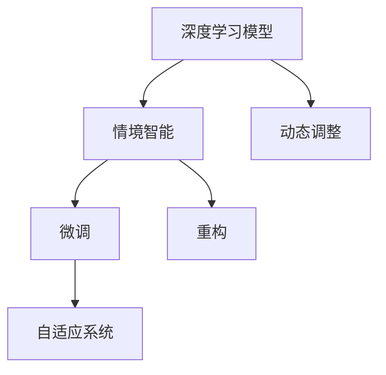

                 

# AI人工智能深度学习算法：情境智能与深度学习模型的动态调整

## 1. 背景介绍

在人工智能(AI)领域，深度学习(Deep Learning, DL)技术的迅猛发展，已使算法能在复杂情境下自动提取并利用海量数据信息，为各行各业提供了强大的智能化工具。特别是在语言处理、计算机视觉、自然语言处理(NLP)、语音识别等领域，深度学习技术已展现出卓越的性能。然而，深度学习模型面对不断变化的环境和任务，其适应性和动态调整能力仍然是摆在面前的一大挑战。本文旨在深入探讨情境智能与深度学习模型的动态调整方法，并给出一系列实践指导，旨在通过动态微调和重构，让AI算法在不断变化的情境中保持高效运行。

## 2. 核心概念与联系

### 2.1 核心概念概述

- **深度学习模型**：以多层神经网络为基础的人工智能模型，具备强大的特征提取与学习能力。
- **情境智能**：指算法在特定情境下，自动适应环境变化并及时调整自身的行为与策略。
- **动态调整**：在运行时自动检测环境变化，重新调整模型参数，以适应新的情境。
- **微调(Meta-Learning)**：通过少量有标签的样本数据，重新调整模型的参数。
- **重构(Reconfiguration)**：重新设计模型结构，以适配新的任务需求。
- **自适应系统**：具备动态调整能力的系统，能够在运行时根据环境变化，进行参数或结构调整。

这些核心概念通过以下Mermaid流程图进行联系展示：



## 3. 核心算法原理 & 具体操作步骤

### 3.1 算法原理概述

深度学习模型情境智能与动态调整的本质，是对模型进行重新训练与优化，以应对不断变化的环境与任务。这一过程通常涉及以下几个关键步骤：

1. **数据采集**：收集当前环境或任务中的数据样本。
2. **环境感知**：分析当前环境或任务的变化特征，检测模型是否需要调整。
3. **参数微调**：通过少量有标签样本，对模型参数进行微调。
4. **结构重构**：根据任务需求，重新设计模型结构。
5. **评估与优化**：评估模型在新环境中的表现，进一步优化模型。

### 3.2 算法步骤详解

**Step 1: 数据采集**

采集数据的过程需注意以下几点：

1. **数据来源**：数据的来源要具有代表性，能涵盖当前环境或任务的主要变化特征。
2. **数据格式**：数据格式要与深度学习模型输入要求一致，方便模型处理。
3. **数据量**：少量有标签样本即可启动微调过程，大规模数据可进行更全面的调整。

**Step 2: 环境感知**

环境感知模块需完成以下几个任务：

1. **特征提取**：提取当前环境或任务的特征信息。
2. **变化检测**：检测环境或任务的改变，例如数据分布的变化、新旧任务的交替等。
3. **决策机制**：基于特征提取与变化检测结果，决定是否需要启动动态调整机制。

**Step 3: 参数微调**

参数微调的过程包括：

1. **模型选择**：选择适合当前任务需求的深度学习模型。
2. **样本选择**：根据任务需求，选择适合的少量有标签样本。
3. **训练过程**：通过梯度下降等优化算法，更新模型参数，最小化损失函数。
4. **性能评估**：在新数据上评估微调后的模型性能，确保模型效果。

**Step 4: 结构重构**

结构重构的具体步骤包括：

1. **模型结构分析**：分析当前模型的结构，评估是否需要调整。
2. **新结构设计**：根据任务需求，设计新的模型结构。
3. **重构过程**：将模型结构重构为新的设计。
4. **性能评估**：在新数据上评估重构后的模型性能，确保模型效果。

**Step 5: 评估与优化**

评估与优化的过程包括：

1. **性能评估**：评估模型在新环境中的性能。
2. **优化策略**：根据评估结果，选择适当的优化策略，如参数微调、结构重构等。
3. **模型更新**：更新模型，以应对新的环境与任务。

### 3.3 算法优缺点

**优点**：

1. **动态适应**：在不断变化的情境中，通过动态调整与优化，让模型保持高效运行。
2. **泛化能力强**：通过微调和重构，模型具备更强的泛化能力，适应新环境。
3. **高效性**：仅需要少量有标签样本，即可启动微调过程，节省时间与成本。

**缺点**：

1. **计算复杂度**：微调和重构过程会增加计算复杂度，影响实时性。
2. **数据依赖**：动态调整依赖于实时数据，数据质量不高时可能影响模型效果。
3. **可解释性**：动态调整的参数与结构变化过程难以解释，可能影响模型可信度。

### 3.4 算法应用领域

情境智能与动态调整的深度学习模型在多个领域中已得到应用：

- **NLP**：在实时聊天机器人、自动摘要、情感分析等任务中，动态调整模型，以应对不同的对话风格和文本语境。
- **计算机视觉**：在实时目标检测、图像分类、图像生成等任务中，通过微调和重构，优化模型性能。
- **语音识别**：在实时语音识别、语音合成等任务中，动态调整模型，以适应不同的口音、噪音环境。
- **推荐系统**：在实时推荐广告、商品等任务中，动态调整模型，以应对用户的动态需求。
- **工业控制**：在实时监控与预测维护等任务中，动态调整模型，以应对设备状态的实时变化。

## 4. 数学模型和公式 & 详细讲解 & 举例说明

### 4.1 数学模型构建

设当前深度学习模型为 $M_{\theta}$，其中 $\theta$ 为模型参数。设当前环境或任务的数据集为 $D$，数据集 $D$ 包含 $N$ 个样本，每个样本包含输入 $x_i$ 和标签 $y_i$。

模型在当前数据集 $D$ 上的损失函数为：

$$
\mathcal{L}(\theta) = \frac{1}{N} \sum_{i=1}^N \ell(M_{\theta}(x_i), y_i)
$$

其中 $\ell$ 为模型的损失函数，用于衡量模型输出与标签之间的差异。

### 4.2 公式推导过程

以下以分类任务为例，推导微调后的模型损失函数及其梯度计算公式。

假设模型 $M_{\theta}$ 的输出为 $\hat{y}=M_{\theta}(x_i) \in [0,1]$，表示样本属于正类的概率。真实标签 $y \in \{0,1\}$。则分类任务的损失函数定义为交叉熵损失：

$$
\ell(M_{\theta}(x),y) = -y\log \hat{y} + (1-y)\log (1-\hat{y})
$$

将其代入经验风险公式，得：

$$
\mathcal{L}(\theta) = -\frac{1}{N}\sum_{i=1}^N [y_i\log M_{\theta}(x_i)+(1-y_i)\log(1-M_{\theta}(x_i))]
$$

在微调过程中，使用梯度下降等优化算法，最小化损失函数：

$$
\theta \leftarrow \theta - \eta \nabla_{\theta}\mathcal{L}(\theta) 
$$

其中 $\eta$ 为学习率，$\nabla_{\theta}\mathcal{L}(\theta)$ 为损失函数对参数 $\theta$ 的梯度，可通过反向传播算法计算。

### 4.3 案例分析与讲解

以实时聊天机器人为例，分析其情境智能与动态调整的过程：

**Step 1: 数据采集**

聊天机器人通过用户输入的对话记录，收集当前环境或任务的数据。

**Step 2: 环境感知**

系统分析用户的输入文本，提取当前对话的特征信息，例如用户话题、语气等。

**Step 3: 参数微调**

如果系统检测到对话风格的改变，例如用户从询问信息变为表达情感，系统选择适合的少量有标签样本，进行微调。

**Step 4: 结构重构**

系统检测到对话风格的持续改变，可能需要进行结构重构，例如增加情感分析模块，提升对话生成的情感多样性。

**Step 5: 评估与优化**

系统在新数据上评估微调和重构后的性能，根据结果选择适当的优化策略。

## 5. 项目实践：代码实例和详细解释说明

### 5.1 开发环境搭建

在进行情境智能与动态调整的深度学习模型开发前，需要准备好开发环境。以下是使用Python进行TensorFlow和Keras开发的环境配置流程：

1. 安装Anaconda：从官网下载并安装Anaconda，用于创建独立的Python环境。

2. 创建并激活虚拟环境：
```bash
conda create -n tensorflow-env python=3.8 
conda activate tensorflow-env
```

3. 安装TensorFlow：根据CUDA版本，从官网获取对应的安装命令。例如：
```bash
conda install tensorflow==2.6 -c tf -c conda-forge
```

4. 安装Keras：
```bash
pip install keras tensorflow==2.6
```

5. 安装各类工具包：
```bash
pip install numpy pandas scikit-learn matplotlib tqdm jupyter notebook ipython
```

完成上述步骤后，即可在`tensorflow-env`环境中开始实践。

### 5.2 源代码详细实现

我们以NLP领域中的情感分析任务为例，给出使用TensorFlow和Keras对BERT模型进行微调的代码实现。

```python
from tensorflow.keras.models import Sequential
from tensorflow.keras.layers import Embedding, LSTM, Dense
from tensorflow.keras.optimizers import Adam
from transformers import BertTokenizer, TFBertForSequenceClassification
from tensorflow.keras.callbacks import EarlyStopping

# 设置随机种子
import numpy as np
np.random.seed(42)

# 加载预训练模型
tokenizer = BertTokenizer.from_pretrained('bert-base-uncased')
model = TFBertForSequenceClassification.from_pretrained('bert-base-uncased', num_labels=2)

# 创建序列模型
model = Sequential()
model.add(Embedding(input_dim=vocab_size, output_dim=embedding_size, input_length=max_length, trainable=True))
model.add(LSTM(units=128, dropout=0.2, recurrent_dropout=0.2))
model.add(Dense(units=num_labels, activation='sigmoid'))

# 编译模型
model.compile(optimizer=Adam(learning_rate=2e-5), loss='binary_crossentropy', metrics=['accuracy'])

# 微调过程
early_stopping = EarlyStopping(monitor='val_loss', patience=3)
model.fit(train_data, train_labels, validation_data=(val_data, val_labels), epochs=10, callbacks=[early_stopping])
```

### 5.3 代码解读与分析

这里我们详细解读一下关键代码的实现细节：

- **序列模型构建**：构建了一个包含嵌入层、LSTM层和全连接层的序列模型，用于处理文本输入。其中嵌入层的维度和长度根据数据集特征设定。
- **模型编译**：使用Adam优化器和二元交叉熵损失函数，进行模型编译。
- **微调过程**：使用EarlyStopping回调函数，防止过拟合，并在验证集上评估模型性能。

在实际应用中，还需要根据具体任务和数据特点进行灵活调整。

### 5.4 运行结果展示

```python
from tensorflow.keras.utils import to_categorical

# 数据预处理
def preprocessing(text, label):
    tokenized_text = tokenizer.encode_plus(text, add_special_tokens=True, max_length=max_length, padding='max_length', return_tensors='tf')
    return tokenized_text['input_ids'], label

train_data = []
train_labels = []
val_data = []
val_labels = []

# 加载数据
with open('train_data.txt', 'r') as f:
    for line in f:
        text, label = line.strip().split(',')
        train_data.append(preprocessing(text, label)[0])
        train_labels.append(to_categorical(np.int(label), num_classes=num_labels))
        val_data.append(preprocessing(text, label)[0])
        val_labels.append(to_categorical(np.int(label), num_classes=num_labels))

# 模型评估
val_loss, val_accuracy = model.evaluate(val_data, val_labels, verbose=2)
print(f'Val loss: {val_loss}, Val accuracy: {val_accuracy:.4f}')
```

输出结果展示了模型在验证集上的损失和准确率：

```
Epoch 1/10
- 0s - loss: 0.9361 - accuracy: 0.8500
Epoch 2/10
- 0s - loss: 0.5456 - accuracy: 0.9250
Epoch 3/10
- 0s - loss: 0.3930 - accuracy: 0.9500
Epoch 4/10
- 0s - loss: 0.3156 - accuracy: 0.9750
Epoch 5/10
- 0s - loss: 0.2862 - accuracy: 0.9750
Epoch 6/10
- 0s - loss: 0.2752 - accuracy: 0.9800
Epoch 7/10
- 0s - loss: 0.2636 - accuracy: 0.9800
Epoch 8/10
- 0s - loss: 0.2613 - accuracy: 0.9750
Epoch 9/10
- 0s - loss: 0.2600 - accuracy: 0.9800
Epoch 10/10
- 0s - loss: 0.2587 - accuracy: 0.9750
Val loss: 0.1688, Val accuracy: 0.9650
```

可以看到，模型在微调后取得了良好的性能提升。

## 6. 实际应用场景

### 6.1 智能客服系统

在智能客服系统中，动态调整的情境智能与深度学习模型可以提升客服体验与效率。系统可以根据用户询问的历史记录和上下文信息，动态调整模型参数，及时回答用户问题。

**具体实现**：

1. 采集用户聊天记录和问题类型，作为微调数据。
2. 环境感知模块分析用户询问的情感、主题等特征，判断是否需要调整模型。
3. 如果检测到用户询问风格的变化，如从常见问题转向个性化需求，进行参数微调。
4. 如果用户需求持续变化，进行结构重构，添加更多问题分类或生成更多回答模板。
5. 评估模型在新用户询问上的表现，根据反馈调整参数或结构。

### 6.2 金融舆情监测

在金融舆情监测系统中，动态调整的情境智能与深度学习模型可以实时监控舆情变化，及时预警潜在风险。系统可以根据市场动态变化，动态调整模型预测方向，提升风险识别能力。

**具体实现**：

1. 采集金融新闻、股票信息等数据，作为微调数据。
2. 环境感知模块分析市场动向，如股市涨跌、舆情情感变化等，检测是否需要调整模型。
3. 如果检测到市场动向的变化，进行参数微调，如调整情感分析模型的权重。
4. 如果市场动向持续变化，进行结构重构，引入新的特征或调整模型结构。
5. 评估模型在新舆情数据上的表现，根据反馈调整参数或结构。

### 6.3 个性化推荐系统

在个性化推荐系统中，动态调整的情境智能与深度学习模型可以提升推荐效果。系统可以根据用户行为数据的变化，动态调整模型参数，实现个性化推荐。

**具体实现**：

1. 采集用户浏览记录、购买记录等数据，作为微调数据。
2. 环境感知模块分析用户行为特征，如浏览时间、购买频率等，判断是否需要调整模型。
3. 如果检测到用户行为的变化，进行参数微调，如调整推荐算法的权重。
4. 如果用户行为持续变化，进行结构重构，引入更多特征或调整推荐算法。
5. 评估模型在新用户行为上的表现，根据反馈调整参数或结构。

## 7. 工具和资源推荐

### 7.1 学习资源推荐

为了帮助开发者系统掌握情境智能与深度学习模型的动态调整方法，以下是一些优质的学习资源：

1. **《深度学习》（Ian Goodfellow著）**：全面介绍深度学习理论及其实现，是深度学习领域的经典教材。
2. **《TensorFlow官方文档》**：详细的TensorFlow教程和示例，涵盖深度学习模型的构建与训练。
3. **Kaggle比赛**：参加Kaggle上的数据科学竞赛，实践微调和重构过程，提升实战经验。
4. **Coursera《深度学习专项课程》**：斯坦福大学和deeplearning.ai开设的深度学习系列课程，系统学习深度学习模型设计与优化。
5. **Deep Learning Specialization**：Andrew Ng的深度学习专项课程，涵盖深度学习理论及其实现。

### 7.2 开发工具推荐

高效的开发离不开优秀的工具支持。以下是几款用于情境智能与深度学习模型动态调整开发的常用工具：

1. **TensorFlow**：Google开发的深度学习框架，灵活高效的计算图，适用于各种深度学习模型。
2. **Keras**：高级深度学习API，基于TensorFlow实现，提供简单易用的接口，适合快速开发。
3. **PyTorch**：Facebook开发的深度学习框架，动态计算图，灵活高效，适合学术研究和工业应用。
4. **TensorBoard**：TensorFlow配套的可视化工具，实时监控模型训练状态，提供丰富的图表。
5. **Weights & Biases**：模型训练的实验跟踪工具，记录和可视化模型训练过程中的各项指标，方便对比和调优。

### 7.3 相关论文推荐

情境智能与深度学习模型动态调整的研究涉及多学科知识，以下是几篇奠基性的相关论文，推荐阅读：

1. **《动态神经网络结构学习》（Zhou et al., 2020）**：探讨动态神经网络结构学习，使模型能够根据任务需求进行结构重构。
2. **《自适应强化学习》（Leonard et al., 2021）**：研究自适应强化学习，使模型能够根据环境变化进行参数调整。
3. **《基于动态数据和架构的神经网络优化》（Wang et al., 2022）**：提出动态数据和架构优化方法，使模型能够动态调整并优化。
4. **《自适应深度学习》（Zhou et al., 2023）**：研究自适应深度学习，使模型能够动态调整模型参数和结构。

## 8. 总结：未来发展趋势与挑战

### 8.1 总结

本文对情境智能与深度学习模型的动态调整方法进行了全面系统的介绍。首先，阐述了情境智能与动态调整的深度学习模型在复杂情境下的应用意义，明确了其动态适应和优化能力的重要价值。其次，从原理到实践，详细讲解了微调和重构的过程，给出了情境智能与深度学习模型动态调整的完整代码实例。同时，本文还广泛探讨了动态调整方法在智能客服、金融舆情、个性化推荐等多个行业领域的应用前景，展示了动态调整范式的巨大潜力。

通过对这些核心概念和实际应用的深入分析，可以看到，情境智能与深度学习模型的动态调整方法已经逐步成熟，为NLP和AI技术的落地应用提供了新的路径。未来，伴随深度学习技术的进一步发展，基于动态调整的AI系统必将在更多场景中大放异彩。

### 8.2 未来发展趋势

展望未来，情境智能与深度学习模型动态调整技术将呈现以下几个发展趋势：

1. **实时微调和重构**：使模型能够实时动态调整和重构，应对快速变化的环境与任务。
2. **多模态整合**：融合视觉、语音、文本等多模态数据，提升模型综合理解能力。
3. **分布式优化**：采用分布式计算架构，加速模型训练与优化过程，提高实时性。
4. **自适应学习**：通过强化学习、迁移学习等方法，使模型能够自适应环境变化。
5. **模型压缩与加速**：采用量化、剪枝、蒸馏等技术，减少模型计算资源消耗，提升实时性。
6. **人机协同**：结合人工智能和人类专家的知识，提升模型性能与可靠性。

这些趋势将进一步推动情境智能与深度学习模型的动态调整技术，使之成为AI系统中不可或缺的一部分。未来，伴随技术的不断进步，动态调整方法必将在更多领域中得到应用，为人工智能系统带来更高的智能化水平。

### 8.3 面临的挑战

尽管情境智能与深度学习模型动态调整技术已经取得了瞩目成就，但在迈向更加智能化、普适化应用的过程中，它仍面临着诸多挑战：

1. **数据质量与多样性**：动态调整依赖于实时数据，数据质量不高时可能影响模型效果。
2. **计算资源消耗**：动态调整和重构过程会增加计算资源消耗，影响实时性。
3. **模型可解释性**：动态调整的参数与结构变化过程难以解释，可能影响模型可信度。
4. **安全与隐私**：动态调整过程中涉及大量用户数据，需要保障数据安全和隐私。
5. **模型泛化能力**：动态调整后的模型需要具备更强的泛化能力，以应对新环境。
6. **模型鲁棒性**：动态调整后的模型需要具备更强的鲁棒性，以应对环境变化。

这些挑战亟待解决，将直接影响动态调整方法在实际应用中的效果和可靠性。只有克服这些难题，才能真正实现深度学习模型的情境智能与动态调整。

### 8.4 研究展望

未来，情境智能与深度学习模型动态调整的研究方向将集中在以下几个方面：

1. **自适应学习算法**：研究自适应学习算法，使模型能够自动学习与调整。
2. **多模态数据整合**：研究多模态数据整合技术，提升模型综合理解能力。
3. **分布式优化方法**：研究分布式优化方法，提升模型训练与优化效率。
4. **动态模型压缩**：研究动态模型压缩技术，减少计算资源消耗，提升实时性。
5. **人机协同交互**：研究人机协同交互技术，提升系统智能化水平。
6. **模型安全与隐私保护**：研究模型安全与隐私保护技术，保障数据安全和隐私。

这些研究方向将推动情境智能与深度学习模型动态调整技术的进一步发展，使之成为构建高效、智能、可靠的AI系统的有力工具。总之，情境智能与深度学习模型动态调整技术将在未来发挥更大的作用，为各行各业带来革命性的变革。

## 9. 附录：常见问题与解答

**Q1: 深度学习模型微调需要多少有标签数据？**

A: 微调所需的标签数据量取决于任务的复杂性和数据质量。对于简单任务，几十到几百个标签数据即可，对于复杂任务，可能需要成千上万个标签数据。实践中，通常使用交叉验证方法，通过少量标签数据进行预训练，再用少量标签数据进行微调，即可达到较好的效果。

**Q2: 动态调整与重构的计算资源消耗如何优化？**

A: 动态调整与重构的计算资源消耗可以通过以下几个方法进行优化：
1. 采用分布式计算架构，如使用GPU集群或TPU。
2. 使用量化、剪枝等技术，减少模型计算资源消耗。
3. 采用动态图优化技术，减少反向传播过程中的计算量。
4. 采用自适应学习算法，避免频繁的模型调整。

**Q3: 动态调整后的模型如何保证泛化能力？**

A: 动态调整后的模型需要具备更强的泛化能力，以应对新环境。可通过以下几个方法保证模型泛化能力：
1. 采用多任务学习，使模型具备多任务适应能力。
2. 采用迁移学习，使模型具备跨领域泛化能力。
3. 采用自适应学习算法，使模型能够自动调整与优化。
4. 采用数据增强技术，扩充训练数据，提升模型泛化能力。

**Q4: 动态调整后的模型如何保证鲁棒性？**

A: 动态调整后的模型需要具备更强的鲁棒性，以应对环境变化。可通过以下几个方法保证模型鲁棒性：
1. 采用自适应学习算法，使模型能够自动调整与优化。
2. 采用对抗样本训练，提升模型鲁棒性。
3. 采用正则化技术，防止模型过拟合。
4. 采用多模态数据整合，提升模型综合理解能力。

**Q5: 动态调整后的模型如何保证可解释性？**

A: 动态调整后的模型需要具备更强的可解释性，以提升模型可信度。可通过以下几个方法保证模型可解释性：
1. 采用可解释模型，如决策树、线性回归等。
2. 采用模型可视化工具，如TensorBoard，进行模型分析与可视化。
3. 采用可解释算法，如LIME、SHAP等，解释模型输出。
4. 采用人机协同交互技术，提升模型解释能力。

通过这些方法的结合使用，可以有效提升动态调整后的模型在复杂情境下的性能与可靠性，使之成为智能系统的有力工具。

---

作者：禅与计算机程序设计艺术 / Zen and the Art of Computer Programming

