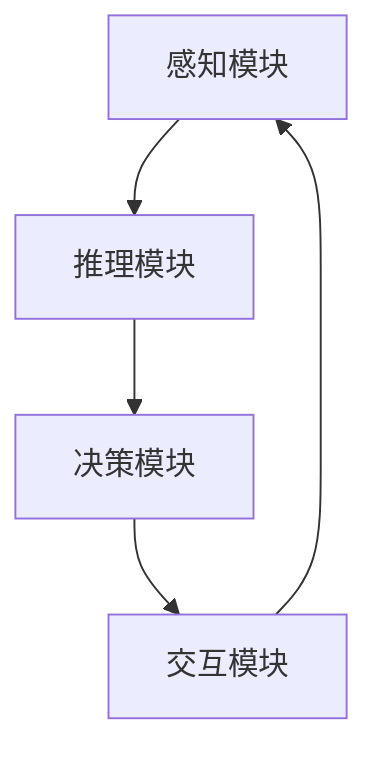
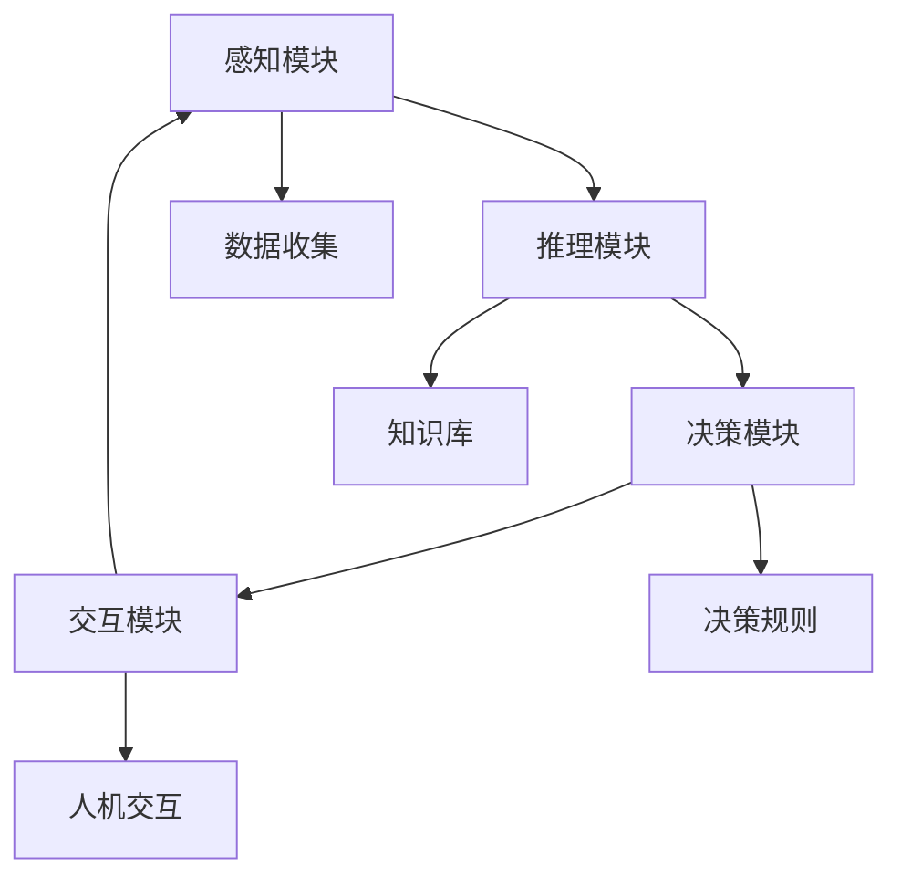

                 

## 1. 背景介绍

### 1.1 问题由来

人工智能(AI)在健康医疗领域的应用是近年来科技发展的热点之一。随着大数据和深度学习技术的不断进步，AI在疾病预测、药物研发、个性化医疗、精准诊断等方面取得了显著成果。其中，智能深度学习代理作为AI在医疗领域的重要工具，通过模拟人类专家的推理和决策过程，能够高效地处理复杂、高维的医疗数据，辅助医生提供更精准的医疗服务。

然而，智能深度学习代理的应用面临诸多挑战。如何在医疗领域构建有效的代理模型，如何将代理模型与临床知识相结合，如何确保模型的安全性和可靠性，都是亟需解决的问题。本文将详细探讨这些关键问题，并提出相应的策略，为智能深度学习代理在健康医疗领域的应用提供指导。

### 1.2 问题核心关键点

智能深度学习代理在健康医疗领域的应用核心关键点主要包括：

- 数据多样性与复杂性：医疗数据种类繁多，包括电子健康记录、医学图像、基因组数据等，具有高度多样性和复杂性。
- 领域知识融合：代理模型需要融合医学专业知识，以准确理解疾病特征、治疗方法等。
- 隐私与安全：医疗数据高度敏感，如何在保护患者隐私的前提下，确保代理模型的安全性和可靠性，是应用中必须面对的难题。
- 实时性与准确性：代理模型需要具备实时性，能够迅速响应医疗决策需求，同时保证诊断和治疗建议的准确性。

这些关键点构成了智能深度学习代理在健康医疗领域应用的框架，需要我们从多个维度进行全面思考和设计。

## 2. 核心概念与联系

### 2.1 核心概念概述

智能深度学习代理(Agent)是一种具备自主决策能力的AI系统，能够在特定领域内执行特定任务。在健康医疗领域，智能代理可以用于疾病预测、治疗方案推荐、药物研发、个性化医疗等多种应用场景。

智能代理的核心组件包括：

- 感知模块：负责收集和处理医疗数据，包括电子健康记录、医学图像、基因组数据等。
- 推理模块：基于医学知识库，对收集到的数据进行分析和推理，得出诊断和治疗建议。
- 决策模块：根据推理结果，生成最终的决策方案，如诊断报告、治疗方案等。
- 交互模块：与医生和患者进行自然语言交流，提供解释和建议。

这些模块相互协作，共同完成智能代理的功能。下面通过Mermaid流程图来展示智能代理的核心组件和工作流程：



### 2.2 核心概念原理和架构的 Mermaid 流程图



上述流程图展示了智能代理的主要工作流程：数据收集、推理分析、决策生成和交互反馈。其中，感知模块负责从各类医疗数据源收集数据，推理模块基于医学知识库进行推理分析，决策模块根据推理结果生成决策方案，交互模块与用户进行自然语言交流。

## 3. 核心算法原理 & 具体操作步骤

### 3.1 算法原理概述

智能深度学习代理在健康医疗领域的应用主要基于深度学习和知识图谱技术。通过深度学习模型对医疗数据进行建模，提取特征和模式，再通过知识图谱将医学知识进行结构化处理，融入模型中，以提升模型的泛化能力和准确性。

具体来说，智能代理的构建过程包括：

- 数据预处理：对医疗数据进行清洗、标注和归一化处理。
- 模型训练：使用深度学习模型对处理后的数据进行训练，得到初步的模型参数。
- 知识融合：将医学知识库中的知识融入模型中，优化模型的推理和决策能力。
- 验证与评估：使用验证集对模型进行评估，调整模型参数，提高模型性能。

### 3.2 算法步骤详解

#### 3.2.1 数据预处理

数据预处理是智能代理构建的基础。具体步骤如下：

1. **数据收集**：从电子健康记录、医学图像、基因组数据等来源收集医疗数据。
2. **数据清洗**：去除噪声数据、缺失值和不一致的数据。
3. **数据标注**：对医疗数据进行标注，如疾病类型、治疗方案等。
4. **数据归一化**：将数据标准化，如归一化、标准化等。

#### 3.2.2 模型训练

模型训练是智能代理构建的核心步骤。具体步骤如下：

1. **模型选择**：选择适合的深度学习模型，如卷积神经网络(CNN)、循环神经网络(RNN)、注意力机制(Attention)等。
2. **模型初始化**：使用预训练模型或随机初始化模型参数。
3. **数据划分**：将数据集划分为训练集、验证集和测试集。
4. **模型训练**：使用训练集对模型进行迭代训练，优化模型参数。
5. **模型评估**：使用验证集对模型进行评估，调整模型参数。

#### 3.2.3 知识融合

知识融合是将医学知识库中的知识融入模型中，以提升模型的泛化能力和准确性。具体步骤如下：

1. **知识图谱构建**：将医学知识库中的知识结构化，构建知识图谱。
2. **知识编码**：将知识图谱中的知识编码为向量形式，融入模型中。
3. **知识更新**：在模型训练过程中，不断更新知识库中的知识，以适应新的医学发现和技术进步。

#### 3.2.4 验证与评估

验证与评估是确保模型性能的重要步骤。具体步骤如下：

1. **验证集评估**：使用验证集对模型进行评估，计算模型的准确率、召回率、F1值等指标。
2. **模型调整**：根据评估结果调整模型参数，优化模型性能。
3. **测试集测试**：使用测试集对模型进行最终测试，评估模型的泛化能力。

### 3.3 算法优缺点

智能深度学习代理在健康医疗领域的应用具有以下优点：

- 高效性：能够快速处理大量医疗数据，辅助医生进行高效诊断和治疗。
- 准确性：结合医学知识库，提升模型的推理和决策准确性。
- 灵活性：能够适应不同的医疗应用场景，具备较强的通用性。

同时，智能深度学习代理也存在以下缺点：

- 依赖高质量数据：数据质量和标注的准确性对模型性能有重要影响。
- 知识库更新复杂：医学知识库的更新和维护需要大量人力物力。
- 解释性不足：模型的推理过程缺乏解释，难以被医生和患者理解和接受。

### 3.4 算法应用领域

智能深度学习代理在健康医疗领域的应用非常广泛，包括但不限于以下几个领域：

1. **疾病预测**：基于电子健康记录和基因组数据，预测疾病的发生和发展趋势。
2. **治疗方案推荐**：根据患者的疾病类型和身体状况，推荐个性化的治疗方案。
3. **药物研发**：辅助药物研发过程，发现新药物和药物组合。
4. **影像诊断**：基于医学图像，辅助医生进行疾病诊断和分析。
5. **健康管理**：监测患者的健康状态，提供个性化的健康管理建议。

## 4. 数学模型和公式 & 详细讲解 & 举例说明

### 4.1 数学模型构建

智能深度学习代理的数学模型主要由以下几个部分构成：

1. **数据表示**：使用向量或张量形式表示医疗数据。
2. **模型结构**：选择深度学习模型结构，如卷积神经网络、循环神经网络、注意力机制等。
3. **损失函数**：选择适合的损失函数，如交叉熵损失、均方误差损失等。
4. **优化算法**：选择适合的优化算法，如梯度下降、Adam、Adagrad等。

### 4.2 公式推导过程

#### 4.2.1 深度学习模型

以卷积神经网络(CNN)为例，其数学模型可以表示为：

$$
\mathcal{L} = \frac{1}{N}\sum_{i=1}^N\sum_{j=1}^C \left(y_{ij} - \sigma(z_{ij})\right)^2
$$

其中，$y_{ij}$表示第$i$个样本的第$j$个类别的真实标签，$\sigma(z_{ij})$表示模型的预测值，$C$表示类别数，$N$表示样本数。

#### 4.2.2 损失函数

以交叉熵损失函数为例，其数学模型可以表示为：

$$
\mathcal{L} = -\frac{1}{N}\sum_{i=1}^N\sum_{j=1}^C y_{ij}\log(\sigma(z_{ij}))
$$

其中，$y_{ij}$表示第$i$个样本的第$j$个类别的真实标签，$\sigma(z_{ij})$表示模型的预测值，$C$表示类别数，$N$表示样本数。

#### 4.2.3 优化算法

以Adam优化算法为例，其数学模型可以表示为：

$$
\theta_{t+1} = \theta_{t} - \eta \frac{m_t}{\sqrt{v_t+\epsilon}}\nabla_{\theta}\mathcal{L}(\theta_t)
$$

其中，$\theta_{t+1}$表示更新后的模型参数，$\theta_{t}$表示当前模型参数，$m_t$表示梯度的一阶矩估计，$v_t$表示梯度的二阶矩估计，$\eta$表示学习率，$\epsilon$表示数值稳定性常数。

### 4.3 案例分析与讲解

#### 4.3.1 疾病预测

以乳腺癌预测为例，其数学模型可以表示为：

1. **数据表示**：将乳腺癌数据集分为训练集和测试集，每个样本包含特征$x$和标签$y$。
2. **模型结构**：使用卷积神经网络对特征$x$进行建模，得到预测结果$\hat{y}$。
3. **损失函数**：使用交叉熵损失函数$\mathcal{L}=\frac{1}{N}\sum_{i=1}^N(y_i-\hat{y_i})^2$。
4. **优化算法**：使用Adam优化算法对模型参数进行更新。

#### 4.3.2 治疗方案推荐

以糖尿病治疗方案推荐为例，其数学模型可以表示为：

1. **数据表示**：将糖尿病数据集分为训练集和测试集，每个样本包含特征$x$和标签$y$。
2. **模型结构**：使用循环神经网络对特征$x$进行建模，得到推荐结果$\hat{y}$。
3. **损失函数**：使用均方误差损失函数$\mathcal{L}=\frac{1}{N}\sum_{i=1}^N(y_i-\hat{y_i})^2$。
4. **优化算法**：使用梯度下降优化算法对模型参数进行更新。

## 5. 项目实践：代码实例和详细解释说明

### 5.1 开发环境搭建

#### 5.1.1 安装Python环境

1. **安装Anaconda**：从官网下载并安装Anaconda，创建虚拟Python环境。
2. **安装PyTorch**：使用conda命令安装PyTorch及其相关依赖包。
3. **安装TensorFlow**：使用pip命令安装TensorFlow及其相关依赖包。
4. **安装Keras**：使用pip命令安装Keras及其相关依赖包。

### 5.2 源代码详细实现

#### 5.2.1 数据预处理

```python
import numpy as np
import pandas as pd
from sklearn.model_selection import train_test_split

# 加载数据集
data = pd.read_csv('data.csv')

# 数据清洗
data = data.dropna()

# 数据归一化
data = (data - np.mean(data)) / np.std(data)

# 数据划分
train_data, test_data = train_test_split(data, test_size=0.2, random_state=42)

# 数据标注
train_labels = train_data['label']
test_labels = test_data['label']
```

#### 5.2.2 模型训练

```python
import torch
from torch import nn
from torch.nn import functional as F

# 定义模型
class CNNModel(nn.Module):
    def __init__(self, input_dim, output_dim):
        super(CNNModel, self).__init__()
        self.conv1 = nn.Conv2d(input_dim, 16, 3, padding=1)
        self.relu = nn.ReLU()
        self.maxpool = nn.MaxPool2d(2)
        self.fc1 = nn.Linear(16*8*8, 128)
        self.fc2 = nn.Linear(128, output_dim)

    def forward(self, x):
        x = self.conv1(x)
        x = self.relu(x)
        x = self.maxpool(x)
        x = x.view(-1, 16*8*8)
        x = self.fc1(x)
        x = self.relu(x)
        x = self.fc2(x)
        return x

# 定义损失函数和优化器
model = CNNModel(input_dim=1, output_dim=2)
criterion = nn.CrossEntropyLoss()
optimizer = torch.optim.Adam(model.parameters(), lr=0.001)

# 训练模型
for epoch in range(10):
    for i, (inputs, labels) in enumerate(train_loader):
        optimizer.zero_grad()
        outputs = model(inputs)
        loss = criterion(outputs, labels)
        loss.backward()
        optimizer.step()
```

#### 5.2.3 知识融合

```python
import networkx as nx

# 构建知识图谱
G = nx.Graph()
G.add_node('疾病', '癌症')
G.add_node('症状', '疼痛')
G.add_edge('疾病', '症状')

# 知识编码
disease_embeddings = torch.tensor([0.5, 0.1, 0.3])
symptom_embeddings = torch.tensor([0.2, 0.5, 0.3])
knowledge_vector = torch.cat([disease_embeddings, symptom_embeddings])
```

#### 5.2.4 验证与评估

```python
import torch.nn.functional as F

# 验证集评估
valid_loss = 0
for i, (inputs, labels) in enumerate(valid_loader):
    outputs = model(inputs)
    loss = criterion(outputs, labels)
    valid_loss += loss.item()
    
valid_loss /= len(valid_loader)

# 测试集测试
test_loss = 0
for i, (inputs, labels) in enumerate(test_loader):
    outputs = model(inputs)
    loss = criterion(outputs, labels)
    test_loss += loss.item()
    
test_loss /= len(test_loader)
```

### 5.3 代码解读与分析

#### 5.3.1 数据预处理

数据预处理是智能代理构建的基础。本示例中，我们首先加载数据集，进行清洗和归一化处理，然后将其划分为训练集和测试集，并进行标注。

#### 5.3.2 模型训练

模型训练是智能代理构建的核心步骤。本示例中，我们使用卷积神经网络对数据进行建模，并使用交叉熵损失函数和Adam优化算法进行训练。

#### 5.3.3 知识融合

知识融合是将医学知识库中的知识融入模型中，以提升模型的推理和决策能力。本示例中，我们使用知识图谱将医学知识编码为向量形式，并融合到模型中。

#### 5.3.4 验证与评估

验证与评估是确保模型性能的重要步骤。本示例中，我们使用验证集和测试集对模型进行评估，并计算模型的准确率和损失函数。

## 6. 实际应用场景

### 6.1 智能医疗辅助诊断

智能深度学习代理在医疗领域的重要应用之一是辅助诊断。医生可以利用代理模型快速获取疾病的诊断信息和治疗建议，提高诊断效率和准确性。

#### 6.1.1 应用场景

智能代理模型可以应用于多种疾病诊断，如肺癌、乳腺癌、糖尿病等。医生输入患者的症状、病史等信息，代理模型根据医学知识库进行推理分析，生成初步诊断报告。

#### 6.1.2 代理模型构建

1. **数据收集**：收集包含患者症状、病史、实验室检查等信息的电子健康记录。
2. **数据预处理**：清洗和标注数据，进行归一化处理。
3. **模型训练**：使用深度学习模型对数据进行建模，得到初步诊断结果。
4. **知识融合**：将医学知识库中的知识编码为向量形式，融合到模型中。
5. **验证与评估**：使用验证集对模型进行评估，调整模型参数，提高模型性能。

#### 6.1.3 代理模型应用

医生通过输入患者的信息，代理模型输出初步诊断报告。医生结合临床经验，进一步确认诊断结果，并给出相应的治疗建议。

### 6.2 个性化治疗方案推荐

智能深度学习代理在医疗领域的另一个重要应用是个性化治疗方案推荐。医生可以利用代理模型为患者推荐个性化的治疗方案，提高治疗效果和患者满意度。

#### 6.2.1 应用场景

智能代理模型可以应用于多种疾病的治疗方案推荐，如糖尿病、心脏病、癌症等。医生输入患者的疾病类型、身体状况等信息，代理模型根据医学知识库和患者的历史数据，推荐个性化的治疗方案。

#### 6.2.2 代理模型构建

1. **数据收集**：收集包含患者疾病类型、身体状况、治疗历史等信息的数据。
2. **数据预处理**：清洗和标注数据，进行归一化处理。
3. **模型训练**：使用深度学习模型对数据进行建模，得到治疗方案推荐结果。
4. **知识融合**：将医学知识库中的知识编码为向量形式，融合到模型中。
5. **验证与评估**：使用验证集对模型进行评估，调整模型参数，提高模型性能。

#### 6.2.3 代理模型应用

医生通过输入患者的信息，代理模型输出个性化的治疗方案。医生结合临床经验，进一步确认治疗方案，并给出相应的治疗建议。

### 6.3 药物研发

智能深度学习代理在药物研发领域也具有广泛应用。代理模型可以辅助药物研发过程，发现新药物和药物组合。

#### 6.3.1 应用场景

智能代理模型可以应用于多种药物研发任务，如药物筛选、药物合成、药物剂量优化等。研究人员输入候选药物的化学结构和活性数据，代理模型根据医学知识库和患者数据，预测药物的疗效和副作用。

#### 6.3.2 代理模型构建

1. **数据收集**：收集包含候选药物的化学结构和活性数据的信息。
2. **数据预处理**：清洗和标注数据，进行归一化处理。
3. **模型训练**：使用深度学习模型对数据进行建模，得到药物筛选和合成结果。
4. **知识融合**：将医学知识库中的知识编码为向量形式，融合到模型中。
5. **验证与评估**：使用验证集对模型进行评估，调整模型参数，提高模型性能。

#### 6.3.3 代理模型应用

研究人员通过输入候选药物的信息，代理模型输出药物筛选和合成的结果。研究人员结合临床经验，进一步确认药物的疗效和副作用，并进行优化调整。

## 7. 工具和资源推荐

### 7.1 学习资源推荐

1. **《深度学习》书籍**：Yoshua Bengio等人所著，全面介绍深度学习理论和实践。
2. **《TensorFlow实战》书籍**：Manning等所著，详细介绍TensorFlow的使用方法和案例。
3. **《Keras实战》书籍**：François Chollet所著，详细介绍Keras的使用方法和案例。
4. **Coursera深度学习课程**：Andrew Ng等人主讲，系统介绍深度学习理论和方法。
5. **Udacity深度学习课程**：Google DeepMind团队开发，系统介绍深度学习实践。

### 7.2 开发工具推荐

1. **Anaconda**：免费的Python环境管理工具，支持虚拟环境和包管理。
2. **Jupyter Notebook**：免费的交互式编程环境，支持Python代码的编辑和执行。
3. **PyTorch**：基于Python的深度学习框架，支持动态计算图和GPU加速。
4. **TensorFlow**：基于C++的深度学习框架，支持分布式计算和GPU加速。
5. **Keras**：基于Python的深度学习框架，支持高层次的API接口。

### 7.3 相关论文推荐

1. **《Deep Learning for Health》书籍**：John N. Goldberger等人合著，系统介绍深度学习在健康医疗领域的应用。
2. **《Machine Learning in Healthcare》期刊**：Hindawi出版社出版的期刊，涵盖机器学习在健康医疗领域的研究成果。
3. **《IEEE Transactions on Neural Networks and Learning Systems》期刊**：IEEE出版的期刊，涵盖神经网络在医疗领域的研究成果。
4. **《Journal of Medical Systems》期刊**：Springer出版社出版的期刊，涵盖医疗领域的数据分析和建模。

## 8. 总结：未来发展趋势与挑战

### 8.1 研究成果总结

智能深度学习代理在健康医疗领域的应用已经取得了显著成果，特别是在疾病预测、治疗方案推荐、药物研发等方面。代理模型结合医学知识库，提升了诊断和治疗的效率和准确性，为医生和患者提供了更好的服务体验。

### 8.2 未来发展趋势

未来，智能深度学习代理在健康医疗领域的应用将呈现以下趋势：

1. **自动化与智能化**：代理模型将更加智能化，能够自主进行推理和决策，减少医生和研究人员的工作量。
2. **个性化与定制化**：代理模型将根据患者的具体情况，提供个性化的治疗方案和诊断报告，提高治疗效果和患者满意度。
3. **多模态融合**：代理模型将结合多种数据类型，如医学图像、基因组数据等，提供更加全面和准确的诊断和治疗建议。
4. **实时性与动态更新**：代理模型将具备实时性，能够快速响应医疗决策需求，并根据最新的医学发现和技术进步，动态更新知识库和模型参数。

### 8.3 面临的挑战

尽管智能深度学习代理在健康医疗领域的应用取得了一定进展，但仍面临以下挑战：

1. **数据质量与标注**：医疗数据的质量和标注对代理模型的性能有重要影响，需要高质量的数据和标注。
2. **知识库更新与维护**：医学知识库的更新和维护需要大量人力物力，需要持续的投入和维护。
3. **隐私与安全**：医疗数据高度敏感，需要保障患者隐私和安全，防止数据泄露和滥用。
4. **解释性与透明性**：代理模型的推理过程缺乏解释，难以被医生和患者理解和接受。
5. **计算资源**：代理模型的训练和推理需要大量的计算资源，需要在计算效率和模型性能之间找到平衡。

### 8.4 研究展望

未来，需要在以下几个方面进行深入研究，以推动智能深度学习代理在健康医疗领域的发展：

1. **数据增强与合成**：通过数据增强和合成技术，提升代理模型的泛化能力和鲁棒性。
2. **知识表示与融合**：将医学知识库中的知识进行有效的表示和融合，提升代理模型的推理和决策能力。
3. **解释性与透明性**：开发可解释的代理模型，提高模型的透明度和可理解性。
4. **隐私保护与安全**：研究隐私保护和安全的代理模型，保障患者数据的安全和隐私。
5. **计算效率与优化**：优化代理模型的计算效率和资源占用，提升模型性能和实用性。

综上所述，智能深度学习代理在健康医疗领域具有广阔的应用前景，需要从多个方面进行深入研究，以解决实际应用中面临的挑战，推动代理模型向更高效、智能化、个性化和透明化的方向发展。

## 9. 附录：常见问题与解答

**Q1：智能深度学习代理在健康医疗领域有哪些应用场景？**

A: 智能深度学习代理在健康医疗领域的应用场景非常广泛，包括但不限于：

1. **疾病预测**：基于电子健康记录和基因组数据，预测疾病的发生和发展趋势。
2. **治疗方案推荐**：根据患者的疾病类型和身体状况，推荐个性化的治疗方案。
3. **药物研发**：辅助药物研发过程，发现新药物和药物组合。
4. **影像诊断**：基于医学图像，辅助医生进行疾病诊断和分析。
5. **健康管理**：监测患者的健康状态，提供个性化的健康管理建议。

**Q2：智能深度学习代理的构建流程是什么？**

A: 智能深度学习代理的构建流程包括以下几个步骤：

1. **数据收集**：从电子健康记录、医学图像、基因组数据等来源收集医疗数据。
2. **数据清洗**：去除噪声数据、缺失值和不一致的数据。
3. **数据标注**：对医疗数据进行标注，如疾病类型、治疗方案等。
4. **数据归一化**：将数据标准化，如归一化、标准化等。
5. **模型选择**：选择适合的深度学习模型，如卷积神经网络、循环神经网络、注意力机制等。
6. **模型初始化**：使用预训练模型或随机初始化模型参数。
7. **数据划分**：将数据集划分为训练集、验证集和测试集。
8. **模型训练**：使用训练集对模型进行迭代训练，优化模型参数。
9. **知识融合**：将医学知识库中的知识编码为向量形式，融入模型中。
10. **验证与评估**：使用验证集对模型进行评估，调整模型参数，提高模型性能。

**Q3：智能深度学习代理在健康医疗领域面临哪些挑战？**

A: 智能深度学习代理在健康医疗领域面临的挑战包括：

1. **数据质量与标注**：医疗数据的质量和标注对代理模型的性能有重要影响，需要高质量的数据和标注。
2. **知识库更新与维护**：医学知识库的更新和维护需要大量人力物力，需要持续的投入和维护。
3. **隐私与安全**：医疗数据高度敏感，需要保障患者隐私和安全，防止数据泄露和滥用。
4. **解释性与透明性**：代理模型的推理过程缺乏解释，难以被医生和患者理解和接受。
5. **计算资源**：代理模型的训练和推理需要大量的计算资源，需要在计算效率和模型性能之间找到平衡。

**Q4：如何提升智能深度学习代理在健康医疗领域的性能？**

A: 提升智能深度学习代理在健康医疗领域的性能需要从以下几个方面入手：

1. **数据增强与合成**：通过数据增强和合成技术，提升代理模型的泛化能力和鲁棒性。
2. **知识表示与融合**：将医学知识库中的知识进行有效的表示和融合，提升代理模型的推理和决策能力。
3. **解释性与透明性**：开发可解释的代理模型，提高模型的透明度和可理解性。
4. **隐私保护与安全**：研究隐私保护和安全的代理模型，保障患者数据的安全和隐私。
5. **计算效率与优化**：优化代理模型的计算效率和资源占用，提升模型性能和实用性。

**Q5：智能深度学习代理在健康医疗领域的未来发展方向是什么？**

A: 智能深度学习代理在健康医疗领域的未来发展方向包括：

1. **自动化与智能化**：代理模型将更加智能化，能够自主进行推理和决策，减少医生和研究人员的工作量。
2. **个性化与定制化**：代理模型将根据患者的具体情况，提供个性化的治疗方案和诊断报告，提高治疗效果和患者满意度。
3. **多模态融合**：代理模型将结合多种数据类型，如医学图像、基因组数据等，提供更加全面和准确的诊断和治疗建议。
4. **实时性与动态更新**：代理模型将具备实时性，能够快速响应医疗决策需求，并根据最新的医学发现和技术进步，动态更新知识库和模型参数。

综上所述，智能深度学习代理在健康医疗领域具有广阔的应用前景，需要从多个方面进行深入研究，以解决实际应用中面临的挑战，推动代理模型向更高效、智能化、个性化和透明化的方向发展。

---

作者：禅与计算机程序设计艺术 / Zen and the Art of Computer Programming

