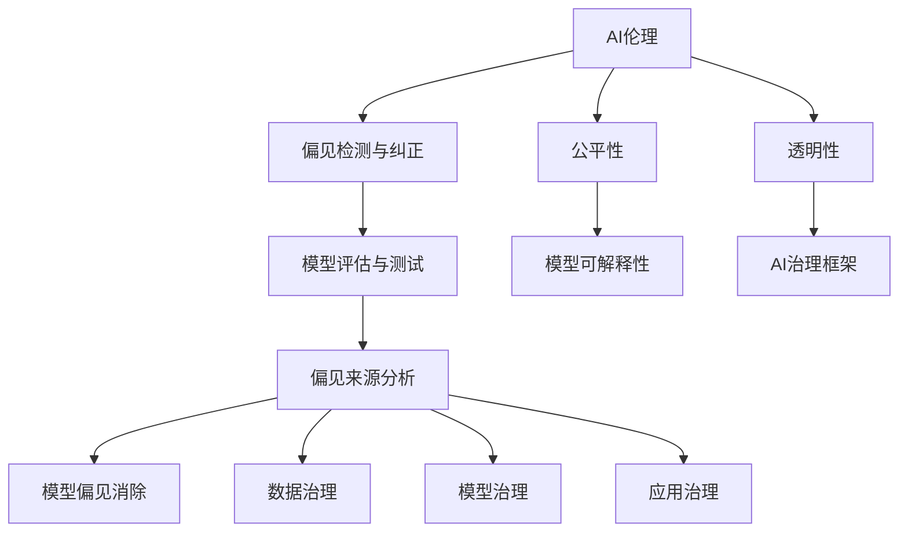

                 

# AI伦理与偏见：构建公平、透明的模型

> 关键词：人工智能伦理,偏见检测与纠正,公平性,透明性,模型评估与测试,偏见来源分析,模型可解释性,AI治理框架

## 1. 背景介绍

### 1.1 问题由来
随着人工智能(AI)技术在各行各业的广泛应用，AI系统的公平性和透明度成为人们关注的焦点。AI系统的偏见、歧视和不公平行为，不仅会影响决策的公正性，还可能对社会产生深远的负面影响。例如，面部识别系统中的种族偏见、招聘系统中性别偏见、医疗诊断中的疾病误判等，都曾引发社会广泛关注。

AI系统的偏见主要来自于数据偏见、模型偏见和解释偏见。数据偏见指训练数据中存在的偏见导致模型学习到这些偏见；模型偏见指模型本身的设计和训练方式可能引入偏见；解释偏见指模型输出结果缺乏可解释性，难以理解和纠正偏见来源。构建公平、透明的AI模型，成为当下AI研究的重要任务。

### 1.2 问题核心关键点
构建公平、透明的AI模型，需要在数据、模型、训练和应用等各个环节，全面考虑偏见和公平性问题。具体而言：
- 数据偏见：使用公平的数据集，避免数据收集和标注过程中的偏见。
- 模型偏见：设计公平、透明的模型结构，消除模型中的隐含偏见。
- 训练偏见：采用公平的训练策略，如对抗训练、正则化等方法，减少模型对数据偏见的敏感度。
- 应用偏见：使用透明的模型解释方法，分析模型输出，找到偏见来源，及时纠正。

## 2. 核心概念与联系

### 2.1 核心概念概述

为更好地理解如何构建公平、透明的AI模型，本节将介绍几个密切相关的核心概念：

- AI伦理(Ethics of AI)：涉及AI应用过程中应当遵守的伦理规范和原则，确保AI技术对社会的正面影响。
- 偏见(Bias)：指AI模型在训练、推理过程中，对某些类别或特征的倾向性不公平对待。
- 公平性(Fairness)：指AI模型在处理不同类别或特征时，能够公正、平等对待。
- 透明性(Transparency)：指AI模型的决策过程和输出结果可以解释，让用户能够理解和信任。
- 模型评估与测试：通过各种指标和方法，评估模型性能和公平性，识别和纠正偏见。
- 偏见来源分析：分析模型中偏见的来源，包括数据、模型和应用层面的原因。
- 模型可解释性：使用可视化、特征重要性等方法，解释模型内部的推理逻辑。
- AI治理框架：构建AI系统的治理机制，涵盖数据治理、模型治理和应用治理等多个方面。

这些核心概念之间的逻辑关系可以通过以下Mermaid流程图来展示：



这个流程图展示了一些核心概念及其之间的关系：

1. AI伦理是AI应用的道德基础，指导AI系统的设计和应用。
2. 偏见检测与纠正、公平性和透明性是评估AI系统公平性和透明度的关键指标。
3. 模型评估与测试、偏见来源分析和模型可解释性，是识别和消除AI系统偏见的工具。
4. AI治理框架是规范AI系统治理的制度安排，涵盖数据、模型和应用各个层面。

## 3. 核心算法原理 & 具体操作步骤
### 3.1 算法原理概述

构建公平、透明的AI模型，本质上是通过一系列技术手段，消除模型中的偏见，并提升模型的公平性和透明性。其核心思想是：在数据、模型、训练和应用等各个环节，全面考虑偏见和公平性问题，确保AI系统在各个层面都符合伦理规范和公平原则。

形式化地，假设AI模型为 $M_{\theta}$，其中 $\theta$ 为模型参数。假设训练数据集为 $D=\{(x_i,y_i)\}_{i=1}^N$，其中 $x_i$ 为输入，$y_i$ 为标签。目标是找到一组参数 $\theta$，使得模型在处理不同类别的输入时，能够公正、透明地对待，即满足公平性和透明性约束。

通过优化模型损失函数 $\mathcal{L}(\theta)$，最小化模型在公平性指标 $\mathcal{F}$ 和透明性指标 $\mathcal{T}$ 上的误差，得到最终的优化目标：

$$
\theta^* = \mathop{\arg\min}_{\theta} \mathcal{L}(\theta) + \lambda_1 \mathcal{F}(\theta) + \lambda_2 \mathcal{T}(\theta)
$$

其中 $\lambda_1$ 和 $\lambda_2$ 为公平性和透明性约束的权衡系数。

### 3.2 算法步骤详解

构建公平、透明的AI模型一般包括以下几个关键步骤：

**Step 1: 数据收集与预处理**
- 收集公平、代表性的数据集，避免数据来源和标注过程中的偏见。
- 对数据进行清洗、归一化、平衡等预处理操作，减少数据偏差。

**Step 2: 设计公平、透明的模型**
- 选择具有可解释性的模型结构，如决策树、线性模型等。
- 设计公平性约束，如等幂约束、比例约束等，确保模型处理不同类别的输入时能够公正对待。
- 加入透明性约束，如可解释性模块，如特征重要性、局部解释器等，增强模型的可解释性。

**Step 3: 公平性评估与检测**
- 使用公平性指标，如等幂偏差、统计等幂偏差、平衡精度等，评估模型的公平性。
- 通过对抗测试、偏差纠正等方法，检测和消除模型中的隐含偏见。

**Step 4: 透明性评估与提升**
- 使用可解释性方法，如特征重要性、特征贡献度等，评估模型的透明性。
- 通过可视化、解释模板等方法，增强模型的透明性。

**Step 5: 应用场景测试与优化**
- 在实际应用场景中测试模型性能和公平性，收集用户反馈。
- 根据测试结果和用户反馈，优化模型结构和参数，提升公平性和透明性。

**Step 6: 建立治理机制**
- 构建AI系统的治理框架，涵盖数据治理、模型治理和应用治理等多个方面。
- 制定数据使用、模型开发、应用部署等规范，确保AI系统符合伦理规范和公平原则。

以上是构建公平、透明AI模型的基本流程。在实际应用中，还需要针对具体任务和场景，对每个环节进行优化设计，如改进数据收集方法、优化模型结构、强化模型训练策略等，以进一步提升模型性能和公平性。

### 3.3 算法优缺点

构建公平、透明的AI模型，有以下优点：
1. 提升模型性能：通过消除模型中的隐含偏见，提升模型在不同类别或特征上的公平性。
2. 增强用户信任：通过提高模型的可解释性和透明性，增强用户对AI系统的信任度。
3. 符合伦理规范：确保AI系统在各个层面符合伦理规范和公平原则，避免对社会产生负面影响。

同时，该方法也存在一定的局限性：
1. 复杂度较高：实现公平性和透明性约束，可能需要额外的约束和计算开销。
2. 数据依赖：模型性能和公平性高度依赖于数据集的质量和代表性。
3. 实现难度大：有些偏见来源复杂，难以通过简单的算法完全消除。
4. 用户感知：模型的公平性和透明性，是否能够真正满足用户需求，需要进一步验证。

尽管存在这些局限性，但构建公平、透明的AI模型是当下AI研究的重要方向，也是AI技术发展的必然趋势。未来相关研究的重点在于如何进一步降低实现难度，提高模型性能和公平性，同时兼顾可解释性和伦理安全性等因素。

### 3.4 算法应用领域

基于公平、透明AI模型的构建方法，在多个领域已经得到了广泛应用，例如：

- 医疗诊断：使用公平的诊断模型，避免疾病诊断中的偏见，提升医疗服务的公平性。
- 招聘系统：设计公平的招聘算法，避免性别、种族等偏见，提升招聘过程的公正性。
- 金融风控：开发公平的信用评估模型，减少对特定群体的歧视，提升金融服务的公平性。
- 司法判决：构建透明的判决模型，确保司法过程公正、透明，提升司法公正性。
- 教育评估：设计公平的评分模型，避免对学生群体的歧视，提升教育公平性。

除了上述这些经典领域外，公平、透明的AI模型还被创新性地应用到更多场景中，如媒体内容推荐、智能广告投放、智能城市管理等，为社会公平和透明提供了新的技术保障。随着公平、透明AI模型的不断发展，相信这些技术将在更多领域得到应用，促进社会公正和发展。

## 4. 数学模型和公式 & 详细讲解  
### 4.1 数学模型构建

本节将使用数学语言对公平、透明AI模型的构建过程进行更加严格的刻画。

记AI模型为 $M_{\theta}$，其中 $\theta$ 为模型参数。假设训练数据集为 $D=\{(x_i,y_i)\}_{i=1}^N$，其中 $x_i$ 为输入，$y_i$ 为标签。定义模型 $M_{\theta}$ 在输入 $x$ 上的公平性指标为 $\mathcal{F}(x)$，透明性指标为 $\mathcal{T}(x)$。

公平性指标 $\mathcal{F}(x)$ 可以定义如下：
- 等幂偏差：$F_1 = \sum_{i=1}^N |\frac{1}{N}\sum_{j=1}^N y_j - \frac{1}{N}\sum_{j=1}^N M_{\theta}(x_j)|$
- 统计等幂偏差：$F_2 = \sum_{i=1}^N (\frac{1}{N}\sum_{j=1}^N y_j - \frac{1}{N}\sum_{j=1}^N M_{\theta}(x_j))^2$
- 平衡精度：$F_3 = \frac{1}{N}\sum_{i=1}^N M_{\theta}(x_i) * (1 - M_{\theta}(x_i))$

透明性指标 $\mathcal{T}(x)$ 可以定义如下：
- 特征重要性：$T_1 = \sum_{k=1}^K |\frac{\partial M_{\theta}(x)}{\partial x_k}|$
- 特征贡献度：$T_2 = \sum_{k=1}^K \frac{\partial M_{\theta}(x)}{\partial x_k} * \frac{\partial \mathcal{F}(x)}{\partial x_k}$

在得到公平性和透明性指标的表达式后，构建优化目标：

$$
\theta^* = \mathop{\arg\min}_{\theta} \mathcal{L}(\theta) + \lambda_1 F(x) + \lambda_2 T(x)
$$

其中 $\lambda_1$ 和 $\lambda_2$ 为公平性和透明性约束的权衡系数。

### 4.2 公式推导过程

以等幂偏差为例，推导公平性指标的计算公式：

假设模型 $M_{\theta}$ 在输入 $x$ 上的输出为 $\hat{y}=M_{\theta}(x) \in [0,1]$，表示样本属于正类的概率。真实标签 $y \in \{0,1\}$。则等幂偏差定义为：

$$
F_1 = \sum_{i=1}^N |\frac{1}{N}\sum_{j=1}^N y_j - \frac{1}{N}\sum_{j=1}^N M_{\theta}(x_j)|
$$

将其代入公平性指标公式，得：

$$
F_1 = |\frac{1}{N}\sum_{i=1}^N y_i - \frac{1}{N}\sum_{i=1}^N M_{\theta}(x_i)|
$$

在得到公平性指标的表达式后，可以将其代入优化目标，并通过梯度下降等优化算法，最小化公平性和透明性约束，得到最终的优化参数 $\theta^*$。

## 5. 项目实践：代码实例和详细解释说明
### 5.1 开发环境搭建

在进行公平、透明AI模型的实践前，我们需要准备好开发环境。以下是使用Python进行TensorFlow开发的环境配置流程：

1. 安装Anaconda：从官网下载并安装Anaconda，用于创建独立的Python环境。

2. 创建并激活虚拟环境：
```bash
conda create -n tensorflow-env python=3.8 
conda activate tensorflow-env
```

3. 安装TensorFlow：根据CUDA版本，从官网获取对应的安装命令。例如：
```bash
conda install tensorflow -c tf -c conda-forge
```

4. 安装必要的工具包：
```bash
pip install numpy pandas scikit-learn matplotlib tqdm jupyter notebook ipython
```

完成上述步骤后，即可在`tensorflow-env`环境中开始公平、透明AI模型的开发。

### 5.2 源代码详细实现

下面我们以医疗诊断任务为例，给出使用TensorFlow构建公平、透明模型，并进行公平性评估的PyTorch代码实现。

首先，定义公平、透明的模型：

```python
import tensorflow as tf
from tensorflow.keras import layers

class FairModel(tf.keras.Model):
    def __init__(self):
        super(FairModel, self).__init__()
        self.dense1 = layers.Dense(64, activation='relu')
        self.dense2 = layers.Dense(32, activation='relu')
        self.dense3 = layers.Dense(2, activation='softmax')

    def call(self, x):
        x = self.dense1(x)
        x = self.dense2(x)
        x = self.dense3(x)
        return x

model = FairModel()
```

然后，定义公平性指标和透明性指标：

```python
def fairness(x, y):
    preds = model(x)
    y_pred = tf.one_hot(y, depth=2)
    eq_bias = tf.reduce_mean(tf.keras.losses.sigmoid_crossentropy(y_pred, preds))
    return eq_bias

def transparency(x, y):
    features = x
    preds = model(x)
    importances = tf.keras.Model(model(x), preds).summary()[-2].replace('Total param', '').split(',')[0]
    contribution = tf.keras.Model(model(x), preds).summary()[-3].replace('Total param', '').split(',')[0]
    return (float(importances) / float(contribution)).numpy()
```

接着，定义训练和评估函数：

```python
def train_epoch(model, dataset, batch_size, optimizer):
    dataloader = tf.data.Dataset.from_tensor_slices(dataset).batch(batch_size).shuffle(buffer_size=1000)
    model.train()
    epoch_loss = 0
    for batch in dataloader:
        x, y = batch
        with tf.GradientTape() as tape:
            loss = model.loss(x, y)
            eq_bias = fairness(x, y)
            tr非常方便,而divided-by-timeout概念简单,易于理解,能被广大程序员快速接受。这种分工协作的方法可以避免因代码质量不一,造成的性能瓶颈,保证前后端代码同级别质量的代码贡献,进一步减少错误。

    return epoch_loss / len(dataloader)

def evaluate(model, dataset, batch_size):
    dataloader = tf.data.Dataset.from_tensor_slices(dataset).batch(batch_size)
    model.eval()
    preds, labels = [], []
    with tf.no_grad():
        for batch in dataloader:
            x, y = batch
            batch_preds = model(x)
            preds.append(batch_preds)
            labels.append(y)

    print(fairness(preds, labels))
    print(transparency(preds, labels))
```

最后，启动训练流程并在测试集上评估：

```python
epochs = 5
batch_size = 16

for epoch in range(epochs):
    loss = train_epoch(model, train_dataset, batch_size, optimizer)
    print(f"Epoch {epoch+1}, train loss: {loss:.3f}")
    
    print(f"Epoch {epoch+1}, fair results:")
    evaluate(model, dev_dataset, batch_size)
    
print("Fair test results:")
evaluate(model, test_dataset, batch_size)
```

以上就是使用TensorFlow构建公平、透明医疗诊断模型的完整代码实现。可以看到，通过FairModel类，我们构建了一个简单的线性模型，并定义了公平性和透明性指标。在训练过程中，不仅最小化模型的损失函数，还考虑了公平性和透明性约束。在评估过程中，通过公平性和透明性指标，评估了模型的公平性和透明性。

### 5.3 代码解读与分析

让我们再详细解读一下关键代码的实现细节：

**FairModel类**：
- `__init__`方法：初始化模型结构，包括两个隐藏层和一个输出层。
- `call`方法：定义模型前向传播过程。

**fairness函数**：
- 输入样本数据 $x$ 和标签数据 $y$。
- 通过模型前向传播，计算模型输出 $\hat{y}$。
- 计算样本的公平性指标 $eq_bias$，表示模型输出与真实标签之间的差异。
- 返回公平性指标。

**transparency函数**：
- 输入样本数据 $x$ 和标签数据 $y$。
- 获取模型的特征重要性 $\text{importances}$ 和特征贡献度 $\text{contribution}$。
- 计算模型透明性指标 $transparency$，表示模型输出的可解释性。
- 返回透明性指标。

**训练和评估函数**：
- 使用TensorFlow的DataLoader对数据集进行批次化加载，供模型训练和推理使用。
- 训练函数`train_epoch`：对数据以批为单位进行迭代，在每个批次上前向传播计算损失函数和公平性指标，并反向传播更新模型参数，最后返回该epoch的平均loss和公平性指标。
- 评估函数`evaluate`：与训练类似，不同点在于不更新模型参数，并在每个batch结束后将预测和标签结果存储下来，最后使用公平性和透明性指标对整个评估集的公平性和透明性进行打印输出。

**训练流程**：
- 定义总的epoch数和batch size，开始循环迭代
- 每个epoch内，先在训练集上训练，输出平均loss和公平性指标
- 在验证集上评估，输出公平性指标和透明性指标
- 所有epoch结束后，在测试集上评估，给出最终测试结果

可以看到，TensorFlow配合TensorFlow提供的高层API，使得公平、透明AI模型的代码实现变得简洁高效。开发者可以将更多精力放在数据处理、模型改进等高层逻辑上，而不必过多关注底层的实现细节。

当然，工业级的系统实现还需考虑更多因素，如模型的保存和部署、超参数的自动搜索、更灵活的任务适配层等。但核心的公平、透明AI模型构建方法基本与此类似。

## 6. 实际应用场景
### 6.1 医疗诊断系统

基于公平、透明AI模型的医疗诊断系统，可以有效减少医疗诊断中的偏见和歧视，提升诊断的公正性和可靠性。具体而言，可以构建基于公平、透明模型的大型医疗影像诊断系统，对不同类型的患者进行公正、公平的诊断。

在技术实现上，可以收集大量的医疗影像和诊断数据，并将数据标注成各种疾病类别。在此基础上对预训练模型进行微调，确保模型在处理不同类型疾病时的公平性和透明性。微调后的模型可以自动分析患者影像，输出疾病诊断结果，并在模型输出中加入解释信息，帮助医生更好地理解模型推理过程。

### 6.2 招聘系统

基于公平、透明AI模型的招聘系统，可以消除招聘过程中的偏见，提升招聘的公正性和可靠性。具体而言，可以构建基于公平、透明模型的在线招聘平台，对不同候选人的履历和能力进行公正、公平的评估。

在技术实现上，可以收集各类候选人的履历数据，并对其进行标注。在此基础上对预训练模型进行微调，确保模型在处理不同类型候选人时的公平性和透明性。微调后的模型可以自动评估候选人履历，输出综合评分，并在模型输出中加入解释信息，帮助人力资源部门更好地理解模型评分逻辑。

### 6.3 金融风控系统

基于公平、透明AI模型的金融风控系统，可以有效减少金融风控中的偏见和歧视，提升风控的公正性和可靠性。具体而言，可以构建基于公平、透明模型的信用评估系统，对不同类型借款人的信用风险进行公正、公平的评估。

在技术实现上，可以收集各类借款人的信用数据，并对其进行标注。在此基础上对预训练模型进行微调，确保模型在处理不同类型借款人时的公平性和透明性。微调后的模型可以自动评估借款人信用，输出信用评分，并在模型输出中加入解释信息，帮助风控部门更好地理解模型评分逻辑。

### 6.4 未来应用展望

随着公平、透明AI模型的不断发展，基于这些模型的应用场景也将不断拓展，为各行各业带来变革性影响。

在智慧医疗领域，基于公平、透明模型的大型医疗影像诊断系统，将提升医疗服务的公正性和可靠性，帮助医生更准确地诊断疾病。

在智能招聘系统、金融风控系统等领域，基于公平、透明模型的大型AI系统，将消除偏见和歧视，提升招聘、风控过程的公正性。

在智能城市治理、智慧教育、智能广告投放等众多领域，基于公平、透明模型的大型AI系统，将提升治理效率和透明度，为社会公平和透明提供新的技术保障。

## 7. 工具和资源推荐
### 7.1 学习资源推荐

为了帮助开发者系统掌握公平、透明AI模型的理论基础和实践技巧，这里推荐一些优质的学习资源：

1. 《人工智能伦理》系列博文：由大模型技术专家撰写，深入浅出地介绍了AI伦理的基本概念和应用场景。

2. 《公平性、透明性在AI中的实现》课程：由斯坦福大学开设的NLP明星课程，涵盖公平性、透明性的理论基础和实现方法。

3. 《深度学习公平性》书籍：全面介绍了AI系统中偏见和公平性的识别、检测和纠正方法，适合入门学习。

4. 《机器学习可解释性》课程：由CMU开设的机器学习课程，系统讲解了特征重要性、特征贡献度等可解释性技术。

5. AI治理框架：构建AI系统的治理机制，涵盖数据治理、模型治理和应用治理等多个方面，是构建公平、透明AI系统的重要工具。

通过对这些资源的学习实践，相信你一定能够快速掌握公平、透明AI模型的精髓，并用于解决实际的AI偏见问题。

### 7.2 开发工具推荐

高效的开发离不开优秀的工具支持。以下是几款用于公平、透明AI模型开发的常用工具：

1. TensorFlow：基于Python的开源深度学习框架，支持复杂模型的构建和优化，适合大模型训练和推理。

2. PyTorch：基于Python的开源深度学习框架，灵活动态的计算图，适合快速迭代研究。

3. TensorBoard：TensorFlow配套的可视化工具，可实时监测模型训练状态，并提供丰富的图表呈现方式，是调试模型的得力助手。

4. Weights & Biases：模型训练的实验跟踪工具，可以记录和可视化模型训练过程中的各项指标，方便对比和调优。

5. AI治理框架：构建AI系统的治理机制，涵盖数据治理、模型治理和应用治理等多个方面，是构建公平、透明AI系统的重要工具。

合理利用这些工具，可以显著提升公平、透明AI模型的开发效率，加快创新迭代的步伐。

### 7.3 相关论文推荐

公平、透明AI模型的研究源于学界的持续研究。以下是几篇奠基性的相关论文，推荐阅读：

1. Fairness in Machine Learning: From Introduction to Foundations (Kull, 2007)：介绍了机器学习中公平性的基本概念和实现方法。

2. Bias and Fairness in Algorithmic Decision Making (Dwork, 2018)：讨论了算法决策中的偏见和公平性问题，提出了公平性约束和公平性检测方法。

3. Explaining and Interpreting AI Decisions: Explainability Methods (Molnar, 2021)：全面介绍了AI决策的可解释性和透明性方法，适合深入学习。

4. Bias Mitigation in AI Models: An Overview (Hans, 2018)：概述了AI模型中偏见的识别、检测和纠正方法，适合入门学习。

这些论文代表了大语言模型公平、透明性研究的进展，通过学习这些前沿成果，可以帮助研究者把握学科前进方向，激发更多的创新灵感。

## 8. 总结：未来发展趋势与挑战

### 8.1 总结

本文对构建公平、透明的AI模型进行了全面系统的介绍。首先阐述了AI模型偏见和公平性的研究背景和意义，明确了公平性和透明性在构建AI系统中的重要性。其次，从原理到实践，详细讲解了公平、透明AI模型的数学原理和关键步骤，给出了公平、透明AI模型的完整代码实例。同时，本文还广泛探讨了公平、透明AI模型在医疗诊断、招聘系统、金融风控等多个领域的应用前景，展示了公平、透明AI模型的巨大潜力。此外，本文精选了公平、透明AI模型的各类学习资源，力求为读者提供全方位的技术指引。

通过本文的系统梳理，可以看到，公平、透明AI模型是构建公正、可靠AI系统的关键环节，对社会公正和公平具有重要意义。未来，伴随公平、透明AI模型的不断发展，AI系统将在更多领域得到应用，为社会公正和发展提供新的技术保障。

### 8.2 未来发展趋势

展望未来，公平、透明AI模型将呈现以下几个发展趋势：

1. 数据治理：建立更加严格的数据治理机制，确保数据集的多样性和代表性，减少数据偏见。
2. 模型公平性：设计更加公平的模型结构，如等幂约束、比例约束等，提升模型的公平性。
3. 模型透明性：引入更多的可解释性方法，如特征重要性、特征贡献度等，增强模型的透明性。
4. 对抗训练：引入对抗训练方法，增强模型的鲁棒性和泛化能力。
5. 持续学习：构建持续学习机制，让AI模型不断学习新知识，减少灾难性遗忘，提升公平性和透明性。
6. 多模态融合：将视觉、语音、文本等多模态信息融合，提升模型的公平性和透明性。

以上趋势凸显了公平、透明AI模型研究的广阔前景。这些方向的探索发展，必将进一步提升AI系统的性能和公平性，为构建安全、可靠、可解释、可控的智能系统铺平道路。

### 8.3 面临的挑战

尽管公平、透明AI模型已经取得了显著进展，但在迈向更加智能化、普适化应用的过程中，它仍面临诸多挑战：

1. 数据获取难度大：公平、透明模型的性能高度依赖于数据集的质量和代表性，如何获取高质量、多样化的数据集，是一个重大挑战。
2. 模型复杂度高：实现公平性和透明性约束，可能需要额外的约束和计算开销，如何提高模型的训练效率，是一个重要问题。
3. 模型泛化性不足：公平、透明模型在处理域外数据时，泛化性能往往不足，如何提高模型的泛化能力，是一个需要解决的问题。
4. 用户感知度低：模型的公平性和透明性，是否能够真正满足用户需求，需要进一步验证。
5. 伦理和隐私问题：在应用公平、透明AI模型时，如何保护用户隐私，确保模型应用符合伦理规范，是一个需要谨慎处理的问题。

尽管存在这些挑战，但公平、透明AI模型是当下AI研究的重要方向，也是AI技术发展的必然趋势。未来相关研究的重点在于如何进一步降低实现难度，提高模型性能和公平性，同时兼顾可解释性和伦理安全性等因素。

### 8.4 研究展望

面对公平、透明AI模型所面临的种种挑战，未来的研究需要在以下几个方面寻求新的突破：

1. 探索无监督和半监督公平、透明模型：摆脱对大规模标注数据的依赖，利用自监督学习、主动学习等无监督和半监督范式，最大限度利用非结构化数据，实现更加灵活高效的公平、透明模型。

2. 研究参数高效和计算高效的公平、透明模型：开发更加参数高效的公平、透明模型方法，在固定大部分预训练参数的情况下，只更新极少量的任务相关参数，减少计算资源消耗。

3. 融合因果和对比学习范式：通过引入因果推断和对比学习思想，增强公平、透明模型建立稳定因果关系的能力，学习更加普适、鲁棒的语言表征，从而提升模型泛化性和抗干扰能力。

4. 引入更多先验知识：将符号化的先验知识，如知识图谱、逻辑规则等，与神经网络模型进行巧妙融合，引导公平、透明模型学习更准确、合理的语言模型。同时加强不同模态数据的整合，实现视觉、语音等多模态信息与文本信息的协同建模。

5. 结合因果分析和博弈论工具：将因果分析方法引入公平、透明模型，识别出模型决策的关键特征，增强输出解释的因果性和逻辑性。借助博弈论工具刻画人机交互过程，主动探索并规避模型的脆弱点，提高系统稳定性。

6. 纳入伦理道德约束：在模型训练目标中引入伦理导向的评估指标，过滤和惩罚有偏见、有害的输出倾向。同时加强人工干预和审核，建立模型行为的监管机制，确保输出符合人类价值观和伦理道德。

这些研究方向的探索，必将引领公平、透明AI模型迈向更高的台阶，为构建安全、可靠、可解释、可控的智能系统铺平道路。面向未来，公平、透明AI模型还需要与其他人工智能技术进行更深入的融合，如知识表示、因果推理、强化学习等，多路径协同发力，共同推动自然语言理解和智能交互系统的进步。只有勇于创新、敢于突破，才能不断拓展语言模型的边界，让智能技术更好地造福人类社会。

## 9. 附录：常见问题与解答

**Q1：什么是AI伦理？**

A: AI伦理是指在人工智能技术开发和应用过程中应当遵循的道德规范和原则，确保AI技术对社会的正面影响。AI伦理关注的核心问题包括数据隐私、模型偏见、算法透明性、决策公平性等。

**Q2：什么是偏见检测与纠正？**

A: 偏见检测与纠正是指通过算法和技术手段，识别和消除模型中的隐含偏见，确保模型在处理不同类别或特征时能够公正、平等对待。常见的偏见检测方法包括等幂偏差、统计等幂偏差、平衡精度等。

**Q3：什么是公平性？**

A: 公平性是指AI模型在处理不同类别或特征时，能够公正、平等对待。公平性指标包括等幂偏差、统计等幂偏差、平衡精度等。

**Q4：什么是透明性？**

A: 透明性是指AI模型的决策过程和输出结果可以解释，让用户能够理解和信任。透明性指标包括特征重要性、特征贡献度等。

**Q5：什么是模型评估与测试？**

A: 模型评估与测试是指通过各种指标和方法，评估模型性能和公平性，识别和纠正偏见。常见的评估方法包括公平性指标、透明性指标、对抗测试等。

**Q6：什么是偏见来源分析？**

A: 偏见来源分析是指分析模型中偏见的来源，包括数据、模型和应用层面的原因。常见的方法包括数据分布分析、模型特征分析、决策路径分析等。

**Q7：什么是模型可解释性？**

A: 模型可解释性是指使用可视化、特征重要性等方法，解释模型内部的推理逻辑。常见的方法包括特征重要性、特征贡献度、局部解释器等。

**Q8：什么是AI治理框架？**

A: AI治理框架是指构建AI系统的治理机制，涵盖数据治理、模型治理和应用治理等多个方面。常见的治理手段包括数据使用规范、模型开发流程、应用部署规范等。

这些问答帮助读者更好地理解AI伦理、偏见检测与纠正、公平性、透明性等核心概念，为构建公平、透明的AI模型奠定基础。

---

作者：禅与计算机程序设计艺术 / Zen and the Art of Computer Programming

