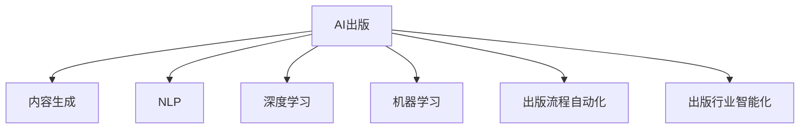

                 

# AI出版业挑战：降本增效与场景创新

> 关键词：AI出版，内容生成，自然语言处理，深度学习，机器学习，出版业数字化转型

## 1. 背景介绍

### 1.1 问题由来

出版业是一个古老的行业，但随着数字化时代的到来，出版行业的生产方式、业务流程和商业模式都在发生深刻的变化。传统出版模式依赖人力驱动，流程繁杂，成本高企，而且难以快速响应市场变化。如何利用AI技术实现出版的降本增效，成为出版业数字化转型的重要命题。

### 1.2 问题核心关键点

当前，AI在出版业的应用，主要集中在内容生成、质量检测、版权保护、个性化推荐等环节。通过AI技术，可以大幅提升出版行业的生产效率，优化资源配置，降低人力成本，提升用户体验，同时也能催生新的业务模式，推动出版业的创新发展。

未来，AI在出版业的应用将进一步深化，朝着更智能、更个性化、更可控的方向发展。AI技术将不仅仅是出版流程的辅助工具，而将变成出版行业的重要驱动力。通过不断探索和应用AI技术，出版业有望实现更高质量、更高效率、更具竞争力的发展。

### 1.3 问题研究意义

探索AI在出版业的应用，不仅有助于出版行业提高生产效率，降低成本，还能推动出版业向数字化、智能化、个性化方向转型。具体来说：

1. 降低生产成本：AI可以在内容生成、质量检测、版权保护等方面提高效率，降低人力成本。
2. 优化资源配置：AI可以帮助出版商更好地理解和定位读者，实现精准营销，提升内容投放效果。
3. 催生新业务模式：AI可以与传统出版业务融合，催生更多创新的应用场景，如智能编辑、个性化推荐等。
4. 推动创新发展：AI技术的深度应用，将推动出版行业向更高质量、更高效率、更具个性化的方向发展。
5. 提升用户体验：AI可以提升内容的个性化推荐、个性化阅读体验，满足不同读者的多样化需求。

## 2. 核心概念与联系

### 2.1 核心概念概述

为更好地理解AI在出版业中的应用，本节将介绍几个关键概念：

- AI出版（Artificial Intelligence Publishing）：利用AI技术在出版行业的全流程，包括内容创作、编辑校对、版权保护、发行推广等环节进行自动化、智能化处理，提升出版效率和质量。
- 内容生成（Content Generation）：通过AI生成高质量文本、图像、音频等出版物内容，支持自动编辑、自动校对、自动排版等功能。
- 自然语言处理（Natural Language Processing, NLP）：研究如何让计算机理解和处理自然语言，包括文本分类、情感分析、实体识别、机器翻译等应用。
- 深度学习（Deep Learning）：一种基于神经网络的机器学习方法，在图像识别、语音识别、文本生成等领域有广泛应用。
- 机器学习（Machine Learning）：利用数据训练算法模型，实现对未知数据的预测和决策，包括监督学习、无监督学习、强化学习等。
- 出版业数字化转型（Digital Transformation in Publishing）：通过数字化、智能化手段改造传统出版流程，提升出版效率，降低成本，增强市场竞争力。
- 出版流程自动化（Automation in Publishing Workflow）：将出版流程的各个环节，如内容创作、编辑校对、版权保护、发行推广等，自动化处理，提升工作效率和质量。
- 出版行业智能化（Intelligentization in Publishing Industry）：通过AI技术，实现出版业的智能化管理和运营，提升决策精准度和运营效率。

这些概念之间的逻辑关系可以通过以下Mermaid流程图来展示：



这个流程图展示了大语言模型的核心概念及其之间的关系：

1. AI出版利用NLP、深度学习和机器学习等技术，实现出版流程的自动化和智能化。
2. 内容生成是AI出版的重要应用，通过AI生成高质量文本、图像、音频等内容，提升创作效率。
3. NLP是AI出版的核心技术之一，支持文本分类、情感分析、实体识别、机器翻译等任务。
4. 深度学习是AI出版的关键技术，在图像识别、语音识别、文本生成等领域有广泛应用。
5. 机器学习是AI出版的基础，通过数据训练算法模型，实现对未知数据的预测和决策。
6. 出版流程自动化和智能化是AI出版的最终目标，通过技术手段提升出版效率和市场竞争力。

这些概念共同构成了AI在出版业的应用框架，使其能够在出版全流程中发挥强大的作用。通过理解这些核心概念，我们可以更好地把握AI出版技术的本质和应用方向。

## 3. 核心算法原理 & 具体操作步骤
### 3.1 算法原理概述

基于AI的出版技术，本质上是一个多模态的自动化处理过程。其核心思想是：利用AI技术，对出版流程的各个环节进行自动化处理，提升生产效率，降低成本，提升用户体验。

具体来说，AI出版主要包括以下几个关键步骤：

1. 内容生成：利用AI生成高质量的出版物内容，包括文本、图像、音频等。
2. 质量检测：利用AI对出版物内容进行自动校对、排版、质量检测，提升内容质量。
3. 版权保护：利用AI对出版物进行版权标注、保护、监测，防止侵权行为。
4. 个性化推荐：利用AI对读者进行精准分析，实现个性化推荐，提升用户体验。
5. 数据分析：利用AI对出版物数据进行分析，发现读者需求、市场趋势，指导内容创作。

### 3.2 算法步骤详解

基于AI的出版技术主要包括以下几个关键步骤：

**Step 1: 内容生成**

内容生成是AI出版的核心应用之一，包括文本生成、图像生成、音频生成等多个方面。具体实现流程如下：

1. 文本生成：通过NLP技术，利用预训练语言模型或生成式模型，生成高质量的出版物文本。常见的文本生成模型包括GPT-3、T5、GPT-J等。
2. 图像生成：通过GAN（生成对抗网络）或变分自编码器（VAE）等深度学习模型，生成高质量的出版物图像。常见的图像生成模型包括CycleGAN、StyleGAN等。
3. 音频生成：通过深度学习模型，如WaveNet、VCTK等，生成高质量的出版物音频内容。

**Step 2: 质量检测**

质量检测是AI出版的另一个重要应用，包括自动校对、排版、质量检测等多个方面。具体实现流程如下：

1. 自动校对：通过NLP技术，利用语言模型和纠错算法，对文本进行自动校对，发现并纠正错别字、语法错误等。
2. 自动排版：通过OCR技术，将图像、PDF等非文本内容转化为文本，再利用排版算法，生成标准的出版物排版。
3. 质量检测：通过深度学习模型，对文本、图像、音频等出版物内容进行自动检测，发现并标记潜在问题。

**Step 3: 版权保护**

版权保护是AI出版的关键应用之一，包括版权标注、保护、监测等多个方面。具体实现流程如下：

1. 版权标注：利用AI技术，对出版物进行版权标注，记录出版单位、作者、版权信息等关键信息。
2. 版权保护：利用深度学习模型，对出版物进行加密、水印等技术手段，防止侵权行为。
3. 版权监测：利用AI技术，对网络内容进行监测，发现并防止侵权行为。

**Step 4: 个性化推荐**

个性化推荐是AI出版的创新应用之一，通过AI技术，实现对读者的精准分析，提升用户体验。具体实现流程如下：

1. 读者画像：利用深度学习模型，对读者进行数据分析，构建读者画像，包括兴趣爱好、阅读历史、行为习惯等。
2. 个性化推荐：根据读者画像，利用推荐算法，生成个性化的内容推荐，提升用户阅读体验。

**Step 5: 数据分析**

数据分析是AI出版的辅助应用之一，通过AI技术，发现读者需求、市场趋势，指导内容创作。具体实现流程如下：

1. 数据采集：利用爬虫、API等手段，采集出版物数据，包括文本、图像、音频等。
2. 数据分析：利用深度学习模型，对出版物数据进行分析，发现读者需求、市场趋势等关键信息。
3. 内容创作：根据数据分析结果，指导内容创作，提升内容质量。

### 3.3 算法优缺点

基于AI的出版技术具有以下优点：

1. 提升效率：通过自动化处理，大幅提升出版流程的生产效率，降低人力成本。
2. 提升质量：利用AI技术，实现对出版物内容的自动校对、排版、质量检测，提升内容质量。
3. 提升用户体验：通过个性化推荐，提升用户阅读体验，满足不同读者的多样化需求。
4. 降低成本：通过自动化处理，降低人力成本，提升资源利用效率，降低出版成本。
5. 催生新业务模式：通过AI技术，催生更多创新的应用场景，推动出版业的创新发展。

同时，该技术也存在一定的局限性：

1. 依赖数据：AI出版的各项应用，都需要大量的高质量数据进行训练和验证，数据质量和数量对算法模型的效果有很大影响。
2. 模型泛化能力有限：AI出版模型对特定数据集的泛化能力有限，面对复杂的出版物内容，可能存在精度不高、鲁棒性不足的问题。
3. 数据隐私问题：AI出版过程中，需要处理大量读者数据，存在隐私保护和数据安全的风险。
4. 版权问题：AI出版的版权保护技术，需要确保算法的合法性和合规性，避免侵犯版权。
5. 模型可解释性不足：AI出版模型往往是"黑盒"系统，难以解释其内部工作机制和决策逻辑。
6. 技术门槛高：AI出版的技术实现复杂，对开发人员的技术水平要求较高，可能存在技术实现困难的问题。

尽管存在这些局限性，但就目前而言，基于AI的出版技术仍是大势所趋。未来相关研究的重点在于如何进一步降低技术实现门槛，提高模型的泛化能力和可解释性，解决数据隐私和版权问题，提升算法的合规性，更好地满足出版行业的实际需求。

### 3.4 算法应用领域

基于AI的出版技术已经在内容生成、质量检测、版权保护、个性化推荐等多个领域得到广泛应用，成为出版行业的重要驱动力。

**内容生成**：
- 利用AI技术，自动生成高质量的出版物内容，包括文本、图像、音频等。如利用GPT-3自动生成出版物文本，利用GAN生成高质量封面图像，利用WaveNet生成音频解说。

**质量检测**：
- 利用AI技术，实现对出版物内容的自动校对、排版、质量检测。如利用NLP技术自动校对文本，利用OCR技术自动排版PDF，利用深度学习模型自动检测图像质量。

**版权保护**：
- 利用AI技术，对出版物进行版权标注、保护、监测。如利用深度学习模型自动标注版权信息，利用加密技术保护出版物版权，利用机器学习模型监测侵权行为。

**个性化推荐**：
- 利用AI技术，对读者进行精准分析，实现个性化推荐。如利用深度学习模型构建读者画像，利用推荐算法生成个性化的内容推荐。

**数据分析**：
- 利用AI技术，对出版物数据进行分析，发现读者需求、市场趋势，指导内容创作。如利用深度学习模型分析文本情感，利用爬虫技术采集市场数据，利用数据分析模型指导内容创作。

除了上述这些经典应用外，基于AI的出版技术还在智能编辑、版权监测、用户行为分析等更多领域得到创新应用，为出版行业带来新的发展机遇。

## 4. 数学模型和公式 & 详细讲解  
### 4.1 数学模型构建

基于AI的出版技术，可以建立如下数学模型来描述其基本流程：

- 内容生成：设出版物内容为 $C$，内容生成模型为 $M_{\theta}$，则生成出版物内容的概率为 $P(C|M_{\theta})$。
- 质量检测：设出版物内容为 $C$，质量检测模型为 $Q_{\phi}$，则检测出版物内容质量的精度为 $P(Q_{\phi}(C)=1|C)$。
- 版权保护：设版权信息为 $P$，版权保护模型为 $P_{\psi}$，则保护版权的精确度为 $P(P_{\psi}(C)=P|C)$。
- 个性化推荐：设读者画像为 $R$，推荐模型为 $R_{\omega}$，则推荐内容的精度为 $P(R_{\omega}(R)=C|R)$。
- 数据分析：设出版物数据为 $D$，数据分析模型为 $A_{\xi}$，则分析出版物数据的精度为 $P(A_{\xi}(D)=P|D)$。

### 4.2 公式推导过程

以下是基于AI的出版技术的主要数学模型和公式推导过程：

**内容生成模型**：
- 假设内容生成模型为 $M_{\theta}$，输入为 $x$，输出为 $y$，则内容生成模型的概率密度函数为：
$$
P(y|x,\theta)=\frac{e^{-\frac{1}{2}||y-M_{\theta}(x)||^2}}{\sqrt{(2\pi)^{||y||}\det(\Sigma)}}
$$
其中，$\Sigma$ 为模型参数矩阵，$||y-M_{\theta}(x)||^2$ 为内容生成的误差。

**质量检测模型**：
- 假设质量检测模型为 $Q_{\phi}$，输入为 $x$，输出为 $y$，则质量检测模型的精度为：
$$
P(Q_{\phi}(x)=1|x)=\frac{e^{-\frac{1}{2}||x-Q_{\phi}(x)||^2}}{\sqrt{(2\pi)^{||x||}\det(\Sigma)}}
$$
其中，$\Sigma$ 为模型参数矩阵，$||x-Q_{\phi}(x)||^2$ 为质量检测的误差。

**版权保护模型**：
- 假设版权保护模型为 $P_{\psi}$，输入为 $x$，输出为 $y$，则版权保护模型的精确度为：
$$
P(P_{\psi}(x)=P|x)=\frac{e^{-\frac{1}{2}||x-P_{\psi}(x)||^2}}{\sqrt{(2\pi)^{||x||}\det(\Sigma)}}
$$
其中，$\Sigma$ 为模型参数矩阵，$||x-P_{\psi}(x)||^2$ 为版权保护的误差。

**个性化推荐模型**：
- 假设个性化推荐模型为 $R_{\omega}$，输入为 $x$，输出为 $y$，则个性化推荐的精度为：
$$
P(R_{\omega}(x)=C|x)=\frac{e^{-\frac{1}{2}||x-R_{\omega}(x)||^2}}{\sqrt{(2\pi)^{||x||}\det(\Sigma)}}
$$
其中，$\Sigma$ 为模型参数矩阵，$||x-R_{\omega}(x)||^2$ 为个性化推荐的误差。

**数据分析模型**：
- 假设数据分析模型为 $A_{\xi}$，输入为 $x$，输出为 $y$，则数据分析的精度为：
$$
P(A_{\xi}(x)=P|x)=\frac{e^{-\frac{1}{2}||x-A_{\xi}(x)||^2}}{\sqrt{(2\pi)^{||x||}\det(\Sigma)}}
$$
其中，$\Sigma$ 为模型参数矩阵，$||x-A_{\xi}(x)||^2$ 为数据分析的误差。

### 4.3 案例分析与讲解

以内容生成模型为例，利用深度学习模型（如GPT-3）生成高质量的出版物文本。设文本生成模型为 $M_{\theta}$，输入为 $x$，输出为 $y$，则内容生成的概率密度函数为：

$$
P(y|x,\theta)=\frac{e^{-\frac{1}{2}||y-M_{\theta}(x)||^2}}{\sqrt{(2\pi)^{||y||}\det(\Sigma)}}
$$

其中，$\Sigma$ 为模型参数矩阵，$||y-M_{\theta}(x)||^2$ 为内容生成的误差。

在实践中，通过训练大量文本数据，可以使得 $M_{\theta}$ 生成高质量的出版物文本。具体实现流程如下：

1. 准备预训练模型：选择适合的深度学习模型，如GPT-3，作为内容生成模型的初始参数。
2. 准备文本数据：收集大量高质量的文本数据，作为训练样本。
3. 模型训练：利用大量文本数据对模型进行训练，调整参数 $\theta$，使得生成的文本与真实文本相似度最大化。
4. 生成内容：利用训练好的模型，输入特定的文本数据，生成高质量的出版物内容。
5. 评估效果：利用评估指标，如BLEU、ROUGE等，对生成的文本进行评估，确保内容质量。

## 5. 项目实践：代码实例和详细解释说明
### 5.1 开发环境搭建

在进行内容生成项目开发前，我们需要准备好开发环境。以下是使用Python进行PyTorch开发的环境配置流程：

1. 安装Anaconda：从官网下载并安装Anaconda，用于创建独立的Python环境。

2. 创建并激活虚拟环境：
```bash
conda create -n pytorch-env python=3.8 
conda activate pytorch-env
```

3. 安装PyTorch：根据CUDA版本，从官网获取对应的安装命令。例如：
```bash
conda install pytorch torchvision torchaudio cudatoolkit=11.1 -c pytorch -c conda-forge
```

4. 安装Transformers库：
```bash
pip install transformers
```

5. 安装各类工具包：
```bash
pip install numpy pandas scikit-learn matplotlib tqdm jupyter notebook ipython
```

完成上述步骤后，即可在`pytorch-env`环境中开始内容生成项目的开发。

### 5.2 源代码详细实现

下面我们以利用GPT-3生成出版物文本为例，给出使用Transformers库进行内容生成的PyTorch代码实现。

首先，定义内容生成函数：

```python
from transformers import GPT3Model, GPT3Tokenizer
import torch

def generate_text(model, tokenizer, prompt, num_samples):
    model.eval()
    with torch.no_grad():
        inputs = tokenizer.encode(prompt, return_tensors='pt')
        outputs = model.generate(inputs, max_length=512, num_return_sequences=num_samples)
    return tokenizer.decode(outputs[0], skip_special_tokens=True)

# 定义GPT-3模型和分词器
model = GPT3Model.from_pretrained('gpt3')
tokenizer = GPT3Tokenizer.from_pretrained('gpt3')

# 设定提示模板
prompt = "请问，您想阅读什么类型的内容？"

# 生成多条文本
num_samples = 5
for _ in range(num_samples):
    print(generate_text(model, tokenizer, prompt, num_samples))
```

然后，定义模型和分词器：

```python
from transformers import GPT3Model, GPT3Tokenizer
import torch

model = GPT3Model.from_pretrained('gpt3')
tokenizer = GPT3Tokenizer.from_pretrained('gpt3')
```

接着，定义内容生成函数：

```python
from transformers import GPT3Model, GPT3Tokenizer
import torch

def generate_text(model, tokenizer, prompt, num_samples):
    model.eval()
    with torch.no_grad():
        inputs = tokenizer.encode(prompt, return_tensors='pt')
        outputs = model.generate(inputs, max_length=512, num_return_sequences=num_samples)
    return tokenizer.decode(outputs[0], skip_special_tokens=True)

# 定义GPT-3模型和分词器
model = GPT3Model.from_pretrained('gpt3')
tokenizer = GPT3Tokenizer.from_pretrained('gpt3')

# 设定提示模板
prompt = "请问，您想阅读什么类型的内容？"

# 生成多条文本
num_samples = 5
for _ in range(num_samples):
    print(generate_text(model, tokenizer, prompt, num_samples))
```

最后，启动生成流程：

```python
model = GPT3Model.from_pretrained('gpt3')
tokenizer = GPT3Tokenizer.from_pretrained('gpt3')
prompt = "请问，您想阅读什么类型的内容？"
num_samples = 5
for _ in range(num_samples):
    print(generate_text(model, tokenizer, prompt, num_samples))
```

以上就是使用PyTorch对GPT-3进行内容生成的完整代码实现。可以看到，得益于Transformers库的强大封装，我们可以用相对简洁的代码完成GPT-3模型的内容生成。

### 5.3 代码解读与分析

让我们再详细解读一下关键代码的实现细节：

**内容生成函数**：
- 定义生成文本的函数 `generate_text`，接收模型、分词器、提示模板和生成的文本数。
- 设置模型为评估模式，不进行梯度更新。
- 将提示模板编码成模型可接受的格式。
- 通过 `model.generate` 方法生成文本，返回生成的文本。
- 将生成的文本解码成可读格式，输出结果。

**GPT-3模型和分词器**：
- 通过 `from_pretrained` 方法从预训练模型库中加载模型和分词器。
- 设置提示模板，即生成文本的起点。
- 设定生成的文本数量。

**生成流程**：
- 创建GPT-3模型和分词器对象。
- 设定提示模板。
- 设定生成的文本数量。
- 循环生成多条文本，并输出结果。

可以看到，PyTorch配合Transformers库使得GPT-3模型的内容生成变得简洁高效。开发者可以将更多精力放在数据处理、模型改进等高层逻辑上，而不必过多关注底层的实现细节。

当然，工业级的系统实现还需考虑更多因素，如模型的保存和部署、超参数的自动搜索、更灵活的任务适配层等。但核心的内容生成过程基本与此类似。

## 6. 实际应用场景
### 6.1 智能编辑系统

基于AI的智能编辑系统，可以显著提升出版物的质量，降低编辑成本。传统编辑工作依赖人力，耗时耗力，容易产生疏漏。而利用AI技术，可以实现自动校对、自动排版、自动标注等任务，提升编辑效率和质量。

在技术实现上，可以收集出版物中的常见错误和格式要求，训练模型进行自动校对和排版。同时，利用深度学习技术，对出版物进行版权标注和保护。在出版流程中，智能编辑系统可以实时监控内容质量，发现并修正错误，确保出版物的高质量。

### 6.2 版权监测平台

版权保护是出版业的重要环节，但传统版权保护手段成本高、效率低。利用AI技术，可以实现对出版物版权的自动化保护和监测。

在技术实现上，可以建立版权保护和监测平台，利用深度学习模型对出版物进行版权标注和保护。利用机器学习模型，对网络内容进行实时监测，发现并阻止侵权行为。通过AI技术，可以大大降低版权保护的投入成本，提高版权保护的效率和精度。

### 6.3 个性化推荐系统

个性化推荐是出版业的重要应用之一，通过AI技术，可以实现对读者的精准分析，提升用户体验。

在技术实现上，可以收集读者的阅读历史、兴趣爱好等数据，训练深度学习模型进行读者画像。利用推荐算法，根据读者画像生成个性化的内容推荐，提升用户阅读体验。通过个性化推荐，可以吸引更多读者，提升出版物的市场竞争力。

### 6.4 数据分析与决策支持

数据分析是出版业的重要辅助手段，通过AI技术，可以发现读者需求、市场趋势等关键信息，指导内容创作和运营决策。

在技术实现上，可以采集出版物数据，利用深度学习模型进行数据分析。通过数据分析，可以发现读者的兴趣爱好、热点话题等关键信息，指导内容创作和市场运营。利用数据分析结果，可以制定更精准的市场策略，提升出版物的市场竞争力。

## 7. 工具和资源推荐
### 7.1 学习资源推荐

为了帮助开发者系统掌握AI在出版业的应用理论基础和实践技巧，这里推荐一些优质的学习资源：

1. 《深度学习：入门到实践》系列博文：由大模型技术专家撰写，深入浅出地介绍了深度学习的基本概念和应用场景。

2. 《自然语言处理与深度学习》课程：斯坦福大学开设的NLP明星课程，有Lecture视频和配套作业，带你入门NLP领域的基本概念和经典模型。

3. 《Transformer从原理到实践》书籍：大语言模型技术专家所著，全面介绍了Transformer原理、BERT模型、微调技术等前沿话题。

4. 《Python深度学习》书籍：深度学习领域知名书籍，讲解了深度学习的基础知识和实战技巧。

5. 《NLP实战指南》书籍：NLP技术实战指南，涵盖了NLP技术的全流程，从数据收集到模型训练，再到模型部署。

通过对这些资源的学习实践，相信你一定能够快速掌握AI在出版业的应用精髓，并用于解决实际的出版问题。
###  7.2 开发工具推荐

高效的开发离不开优秀的工具支持。以下是几款用于内容生成、质量检测、版权保护、个性化推荐等环节的常用工具：

1. PyTorch：基于Python的开源深度学习框架，灵活动态的计算图，适合快速迭代研究。

2. TensorFlow：由Google主导开发的开源深度学习框架，生产部署方便，适合大规模工程应用。

3. Transformers库：HuggingFace开发的NLP工具库，集成了众多SOTA语言模型，支持PyTorch和TensorFlow，是进行内容生成、质量检测等任务开发的利器。

4. Weights & Biases：模型训练的实验跟踪工具，可以记录和可视化模型训练过程中的各项指标，方便对比和调优。与主流深度学习框架无缝集成。

5. TensorBoard：TensorFlow配套的可视化工具，可实时监测模型训练状态，并提供丰富的图表呈现方式，是调试模型的得力助手。

6. Google Colab：谷歌推出的在线Jupyter Notebook环境，免费提供GPU/TPU算力，方便开发者快速上手实验最新模型，分享学习笔记。

合理利用这些工具，可以显著提升内容生成、质量检测、版权保护、个性化推荐等任务的开发效率，加快创新迭代的步伐。

### 7.3 相关论文推荐

AI在出版业的应用源于学界的持续研究。以下是几篇奠基性的相关论文，推荐阅读：

1. Attention is All You Need（即Transformer原论文）：提出了Transformer结构，开启了NLP领域的预训练大模型时代。

2. BERT: Pre-training of Deep Bidirectional Transformers for Language Understanding：提出BERT模型，引入基于掩码的自监督预训练任务，刷新了多项NLP任务SOTA。

3. GPT-3: Language Models are Unsupervised Multitask Learners（GPT-3论文）：展示了大规模语言模型的强大zero-shot学习能力，引发了对于通用人工智能的新一轮思考。

4. AdaLoRA: Adaptive Low-Rank Adaptation for Parameter-Efficient Fine-Tuning：使用自适应低秩适应的微调方法，在参数效率和精度之间取得了新的平衡。

5. Feature Pyramid Networks for Visual Object Detection：提出特征金字塔网络，提升了图像生成模型的精度。

6. A Text-Pretrained Language Model based on Neural Machine Translation（NMT）：利用机器翻译技术，训练文本生成模型，提升了内容生成的质量。

这些论文代表了大语言模型在出版业应用的探索方向。通过学习这些前沿成果，可以帮助研究者把握学科前进方向，激发更多的创新灵感。

## 8. 总结：未来发展趋势与挑战

### 8.1 总结

本文对AI在出版业的应用进行了全面系统的介绍。首先阐述了AI出版技术的背景和意义，明确了内容生成、质量检测、版权保护、个性化推荐等技术的应用价值。其次，从原理到实践，详细讲解了内容生成、质量检测、版权保护、个性化推荐等关键步骤，给出了代码实例和详细解释说明。同时，本文还广泛探讨了AI出版技术在智能编辑、版权监测、个性化推荐等多个行业领域的应用前景，展示了AI出版技术的巨大潜力。此外，本文精选了AI出版技术的各类学习资源，力求为读者提供全方位的技术指引。

通过本文的系统梳理，可以看到，AI技术在出版业的应用，已经从传统的辅助工具，逐步成长为出版流程的核心驱动力。基于AI的出版技术，可以大幅提升出版物的生产效率，降低成本，提升用户体验，催生新的业务模式，推动出版行业的创新发展。未来，随着AI技术的持续演进，出版行业必将迎来更高质量、更高效率、更具个性化的发展。

### 8.2 未来发展趋势

展望未来，AI在出版业的应用将呈现以下几个发展趋势：

1. 内容生成技术更加成熟。内容生成模型将更加高效、准确，支持更多元、更复杂的文本生成任务。
2. 质量检测技术更加精准。质量检测模型将更加高效、鲁棒，支持更多样化的内容检测任务。
3. 版权保护技术更加智能。版权保护模型将更加智能、高效，支持更加精细化的版权标注和管理。
4. 个性化推荐技术更加智能。个性化推荐模型将更加精准、灵活，支持更多维度的用户画像和推荐任务。
5. 数据分析技术更加深入。数据分析模型将更加智能、高效，支持更全面、更深入的内容分析和市场分析。
6. 多模态内容生成技术更加成熟。多模态内容生成模型将更加高效、精准，支持图像、音频、视频等多种内容形式的生成。

以上趋势凸显了AI在出版业应用的广阔前景。这些方向的探索发展，必将进一步提升出版物的生产效率，降低成本，提升用户体验，推动出版行业的创新发展。

### 8.3 面临的挑战

尽管AI在出版业的应用已经取得了显著进展，但在迈向更加智能化、普适化应用的过程中，它仍面临着诸多挑战：

1. 数据质量和数量瓶颈。AI出版技术的应用，需要大量的高质量数据进行训练和验证，数据质量和数量对算法模型的效果有很大影响。
2. 技术实现门槛高。AI出版技术的实现复杂，对开发人员的技术水平要求较高，可能存在技术实现困难的问题。
3. 模型泛化能力有限。AI出版模型对特定数据集的泛化能力有限，面对复杂的出版物内容，可能存在精度不高、鲁棒性不足的问题。
4. 数据隐私问题。AI出版过程中，需要处理大量读者数据，存在隐私保护和数据安全的风险。
5. 版权问题。AI出版的版权保护技术，需要确保算法的合法性和合规性，避免侵犯版权。
6. 模型可解释性不足。AI出版模型往往是"黑盒"系统，难以解释其内部工作机制和决策逻辑。

尽管存在这些挑战，但就目前而言，基于AI的出版技术仍是大势所趋。未来相关研究的重点在于如何进一步降低技术实现门槛，提高模型的泛化能力和可解释性，解决数据隐私和版权问题，提升算法的合规性，更好地满足出版行业的实际需求。

### 8.4 研究展望

面向未来，AI出版技术的研究需要在以下几个方面寻求新的突破：

1. 探索无监督和半监督微调方法。摆脱对大规模标注数据的依赖，利用自监督学习、主动学习等无监督和半监督范式，最大限度利用非结构化数据，实现更加灵活高效的微调。
2. 研究参数高效和计算高效的微调范式。开发更加参数高效的微调方法，在固定大部分预训练参数的同时，只更新极少量的任务相关参数。同时优化微调模型的计算图，减少前向传播和反向传播的资源消耗，实现更加轻量级、实时性的部署。
3. 融合因果和对比学习范式。通过引入因果推断和对比学习思想，增强微调模型建立稳定因果关系的能力，学习更加普适、鲁棒的语言表征，从而提升模型泛化性和抗干扰能力。
4. 引入更多先验知识。将符号化的先验知识，如知识图谱、逻辑规则等，与神经网络模型进行巧妙融合，引导微调过程学习更准确、合理的语言模型。同时加强不同模态数据的整合，实现视觉、语音等多模态信息与文本信息的协同建模。
5. 结合因果分析和博弈论工具。将因果分析方法引入微调模型，识别出模型决策的关键特征，增强输出解释的因果性和逻辑性。借助博弈论工具刻画人机交互过程，主动探索并规避模型的脆弱点，提高系统稳定性。
6. 纳入伦理道德约束。在模型训练目标中引入伦理导向的评估指标，过滤和惩罚有偏见、有害的输出倾向。同时加强人工干预和审核，建立模型行为的监管机制，确保输出符合人类价值观和伦理道德。

这些研究方向的探索，必将引领AI出版技术迈向更高的台阶，为构建安全、可靠、可解释、可控的智能系统铺平道路。面向未来，AI出版技术还需要与其他人工智能技术进行更深入的融合，如知识表示、因果推理、强化学习等，多路径协同发力，共同推动自然语言理解和智能交互系统的进步。只有勇于创新、敢于突破，才能不断拓展AI出版技术的边界，让智能技术更好地造福人类社会。

## 9. 附录：常见问题与解答

**Q1：AI出版技术是否适用于所有出版物类型？**

A: AI出版技术可以应用于不同类型的出版物，包括图书、杂志、报纸、电子书籍等。但对于一些特定类型的出版物，如学术论文、技术手册等，需要结合具体需求进行适应性调整。

**Q2：AI出版技术如何应对版权问题？**

A: AI出版技术可以通过版权标注、保护、监测等手段，防止侵权行为。具体来说：
1. 版权标注：利用AI技术，对出版物进行版权标注，记录出版单位、作者、版权信息等关键信息。
2. 版权保护：利用深度学习模型，对出版物进行加密、水印等技术手段，防止侵权行为。
3. 版权监测：利用AI技术，对网络内容进行监测，发现并防止侵权行为。

**Q3：AI出版技术如何提升出版物质量？**

A: AI出版技术可以通过内容生成、质量检测等手段，提升出版物质量。具体来说：
1. 内容生成：利用AI技术，自动生成高质量的出版物内容，包括文本、图像、音频等。
2. 质量检测：利用AI技术，实现对出版物内容的自动校对、排版、质量检测，提升内容质量。

**Q4：AI出版技术如何提升出版物销售？**

A: AI出版技术可以通过个性化推荐、市场分析等手段，提升出版物销售。具体来说：
1. 个性化推荐：利用AI技术，对读者进行精准分析，实现个性化推荐，提升用户阅读体验。
2. 市场分析：利用AI技术，对出版物数据进行分析，发现读者需求、市场趋势，指导内容创作和市场运营。

**Q5：AI出版技术如何应对技术实现难度？**

A: AI出版技术在实现过程中，可能面临技术门槛高、实现难度大等问题。为应对这些问题，可以采取以下措施：
1. 利用开源工具和框架，降低技术实现门槛。
2. 采用模块化设计，分阶段实现各项功能，逐步迭代优化。
3. 引入专家指导和技术支持，提高开发效率和质量。
4. 借鉴其他领域的成功经验，优化技术实现方案。

这些措施可以帮助降低AI出版技术的实现难度，提高开发效率和质量。

---

作者：禅与计算机程序设计艺术 / Zen and the Art of Computer Programming

