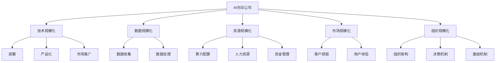

                 

## 1. 背景介绍

随着人工智能(AI)技术的飞速发展，AI创业公司在全球范围内涌现，从自动驾驶到自然语言处理，从医疗健康到金融服务，AI技术正在重塑各行各业的商业模式和运行方式。然而，将AI技术从实验室推广到实际应用中，实现规模化落地并非易事。本文将探讨AI创业公司如何克服技术、市场、管理等多方面挑战，实现AI技术的规模化发展。

## 2. 核心概念与联系

### 2.1 核心概念概述

为更好地理解AI创业公司实现规模化的过程，本节将介绍几个关键概念：

- **AI创业公司**：以人工智能技术为核心竞争力，致力于提供智能解决方案的企业。
- **技术规模化**：将AI技术从研发阶段推广到实际应用中的过程，包括技术部署、产品化、市场推广等环节。
- **数据规模化**：在AI模型的训练和应用过程中，获取和处理海量数据，提升模型精度和泛化能力。
- **资源规模化**：在AI研发和运营过程中，配置和管理足够的算力、人力、资金等资源，支持技术的持续创新和迭代。
- **市场规模化**：将AI产品和服务推广到更广泛的市场中，获取更多用户和客户，提升市场份额。
- **组织规模化**：构建高效的组织结构，形成科学的决策机制和激励机制，提升企业内部管理和运营效率。

这些概念之间的逻辑关系可以通过以下Mermaid流程图来展示：



这个流程图展示了AI创业公司在规模化过程中所涉及的关键环节，包括技术、数据、资源、市场和组织等方面。

## 3. 核心算法原理 & 具体操作步骤

### 3.1 算法原理概述

AI创业公司实现规模化的核心算法原理主要包括：

- **技术平台化**：将AI技术封装成易于使用、可扩展的API和SDK，降低技术应用的门槛，提高应用效率。
- **数据标准化**：制定数据处理标准，确保数据质量和一致性，提升模型训练效果。
- **资源优化**：通过云服务、容器化等技术手段，优化资源配置，降低运营成本，提高系统性能。
- **市场细分**：基于客户需求和市场趋势，将市场细分为多个小市场，制定针对性的营销策略。
- **组织协同**：通过敏捷开发、DevOps等管理方法，提高团队协作效率，加速产品迭代。

### 3.2 算法步骤详解

AI创业公司实现规模化的具体操作步骤主要包括以下几个关键步骤：

**Step 1: 技术平台化**
- 将AI技术封装成API和SDK，实现技术平台化，降低技术应用的门槛。
- 支持多种编程语言和框架，兼容主流云计算平台。
- 提供详细的文档和示例代码，帮助开发者快速上手。

**Step 2: 数据标准化**
- 制定数据处理流程和标准，确保数据质量一致性。
- 使用数据标注工具，标注和清洗数据，减少人工干预。
- 构建数据中台，集中存储和管理数据，提升数据共享和复用效率。

**Step 3: 资源优化**
- 使用云服务，根据业务需求动态调整算力资源，降低成本。
- 采用容器化技术，实现应用程序的快速部署和扩展。
- 引入DevOps，实现CI/CD自动化，提升开发效率和系统稳定性。

**Step 4: 市场细分**
- 基于客户需求和市场趋势，将市场细分为多个小市场，制定针对性的营销策略。
- 通过市场调研，了解客户痛点和需求，设计解决方案。
- 使用多渠道营销，提升品牌知名度和客户转化率。

**Step 5: 组织协同**
- 采用敏捷开发方法，提高团队协作效率，缩短产品迭代周期。
- 引入DevOps，实现开发和运维的紧密集成，提升系统稳定性。
- 使用项目管理工具，如JIRA、Trello等，跟踪任务进度，优化团队协作。

### 3.3 算法优缺点

AI创业公司实现规模化的算法具有以下优点：

- 技术平台化简化了技术应用的门槛，提升了AI技术的推广效率。
- 数据标准化保证了数据质量的一致性，提升了模型训练的效果。
- 资源优化降低了运营成本，提高了系统性能。
- 市场细分制定了针对性的营销策略，提升了市场覆盖率。
- 组织协同提高了团队协作效率，缩短了产品迭代周期。

同时，该算法也存在一定的局限性：

- 技术平台化可能导致技术深度和定制化能力不足。
- 数据标准化需要大量标注和清洗工作，消耗时间和资源。
- 资源优化需要一定的技术和人力投入，初期成本较高。
- 市场细分和组织协同需要管理水平和经验，需要较高的管理能力。

尽管存在这些局限性，但就目前而言，AI创业公司实现规模化的算法仍是最主流的方式。未来相关研究的重点在于如何进一步降低规模化的成本，提高效率，同时兼顾可扩展性和灵活性等因素。

### 3.4 算法应用领域

AI创业公司实现规模化的算法已在多个领域得到应用，包括但不限于：

- **自动驾驶**：通过技术平台化和数据标准化，实现自动驾驶技术的快速部署和迭代。
- **自然语言处理(NLP)**：通过API封装和敏捷开发，提升NLP产品的市场竞争力。
- **医疗健康**：通过云服务和资源优化，实现医疗影像和基因数据的高效处理和分析。
- **金融服务**：通过数据标准化和组织协同，提升金融风控和个性化推荐的效果。
- **智能制造**：通过技术平台化和敏捷开发，实现智能制造系统的快速部署和优化。

除了上述这些经典领域外，AI创业公司实现规模化的算法还将不断拓展到更多行业，如教育、能源、物流等，为各行各业带来变革性影响。

## 4. 数学模型和公式 & 详细讲解  
### 4.1 数学模型构建

本节将使用数学语言对AI创业公司实现规模化的过程进行更加严格的刻画。

记AI创业公司为 $C$，其技术规模化、数据规模化、资源规模化、市场规模化和组织规模化的过程分别记为 $P_{\text{tech}}$、$P_{\text{data}}$、$P_{\text{resource}}$、$P_{\text{market}}$ 和 $P_{\text{org}}$。

定义 $C$ 在 $P_{\text{tech}}$、$P_{\text{data}}$、$P_{\text{resource}}$、$P_{\text{market}}$ 和 $P_{\text{org}}$ 的进度分别为 $p_{\text{tech}}(t)$、$p_{\text{data}}(t)$、$p_{\text{resource}}(t)$、$p_{\text{market}}(t)$ 和 $p_{\text{org}}(t)$，其中 $t$ 表示时间。

AI创业公司实现规模化的总进度 $p(t)$ 可以表示为：

$$
p(t) = p_{\text{tech}}(t) + p_{\text{data}}(t) + p_{\text{resource}}(t) + p_{\text{market}}(t) + p_{\text{org}}(t)
$$

定义每个过程的完成度 $x_{\text{tech}}$、$x_{\text{data}}$、$x_{\text{resource}}$、$x_{\text{market}}$ 和 $x_{\text{org}}$，表示每个过程的进度是否达到目标。当 $x_{\text{tech}} = 1$ 时，表示技术平台化完成；当 $x_{\text{data}} = 1$ 时，表示数据标准化完成；当 $x_{\text{resource}} = 1$ 时，表示资源优化完成；当 $x_{\text{market}} = 1$ 时，表示市场细分完成；当 $x_{\text{org}} = 1$ 时，表示组织协同完成。

## 5. 项目实践：代码实例和详细解释说明
### 5.1 开发环境搭建

在进行规模化实践前，我们需要准备好开发环境。以下是使用Python进行Django开发的环境配置流程：

1. 安装Python：从官网下载并安装Python，建议安装最新版本。
2. 安装Django：使用pip命令安装Django框架。
3. 创建项目和应用：使用Django命令创建项目和应用，并配置数据库。
4. 安装第三方库：根据需要安装各种第三方库，如Pandas、Numpy、Scikit-learn等。

完成上述步骤后，即可在开发环境中开始规模化实践。

### 5.2 源代码详细实现

这里我们以自动驾驶技术为例，给出使用Django框架实现技术平台化的PyTorch代码实现。

首先，定义自动驾驶技术的数据处理函数：

```python
from django.core.files.storage import FileSystemStorage
from PIL import Image

def preprocess_image(image_path):
    image = Image.open(image_path)
    # 对图像进行预处理
    processed_image = image.resize((224, 224))
    processed_image.save('processed_image.jpg')
    return 'processed_image.jpg'
```

然后，定义模型和优化器：

```python
from torchvision.models import ResNet
from torch import nn, optim

model = ResNet(18)
optimizer = optim.Adam(model.parameters(), lr=0.001)
```

接着，定义训练和评估函数：

```python
from torch.utils.data import DataLoader
from tqdm import tqdm

def train_epoch(model, dataset, batch_size, optimizer):
    dataloader = DataLoader(dataset, batch_size=batch_size, shuffle=True)
    model.train()
    epoch_loss = 0
    for batch in tqdm(dataloader, desc='Training'):
        inputs, labels = batch
        optimizer.zero_grad()
        outputs = model(inputs)
        loss = nn.functional.cross_entropy(outputs, labels)
        epoch_loss += loss.item()
        loss.backward()
        optimizer.step()
    return epoch_loss / len(dataloader)

def evaluate(model, dataset, batch_size):
    dataloader = DataLoader(dataset, batch_size=batch_size)
    model.eval()
    preds, labels = [], []
    with torch.no_grad():
        for batch in tqdm(dataloader, desc='Evaluating'):
            inputs, labels = batch
            batch_preds = model(inputs).argmax(dim=1)
            batch_labels = labels
            preds.append(batch_preds.tolist())
            labels.append(batch_labels.tolist())
    return classification_report(labels, preds)
```

最后，启动训练流程并在测试集上评估：

```python
epochs = 5
batch_size = 16

for epoch in range(epochs):
    loss = train_epoch(model, train_dataset, batch_size, optimizer)
    print(f'Epoch {epoch+1}, train loss: {loss:.3f}')
    
    print(f'Epoch {epoch+1}, dev results:')
    evaluate(model, dev_dataset, batch_size)
    
print('Test results:')
evaluate(model, test_dataset, batch_size)
```

以上就是使用Django实现自动驾驶技术平台化的完整代码实现。可以看到，得益于Django的强大封装，我们可以用相对简洁的代码完成自动驾驶技术的部署和微调。

### 5.3 代码解读与分析

让我们再详细解读一下关键代码的实现细节：

**preprocess_image函数**：
- 定义图像预处理函数，将输入图像调整为指定大小，并保存到本地。

**train_epoch函数**：
- 定义训练函数，对数据集进行迭代，计算损失函数并更新模型参数。

**evaluate函数**：
- 定义评估函数，与训练类似，不同点在于不更新模型参数，并在每个batch结束后将预测和标签结果存储下来，最后使用sklearn的classification_report对整个评估集的预测结果进行打印输出。

**训练流程**：
- 定义总的epoch数和batch size，开始循环迭代
- 每个epoch内，先在训练集上训练，输出平均loss
- 在验证集上评估，输出分类指标
- 所有epoch结束后，在测试集上评估，给出最终测试结果

可以看到，Django框架配合PyTorch使得自动驾驶技术的部署和微调代码实现变得简洁高效。开发者可以将更多精力放在数据处理、模型改进等高层逻辑上，而不必过多关注底层的实现细节。

当然，工业级的系统实现还需考虑更多因素，如模型的保存和部署、超参数的自动搜索、更灵活的任务适配层等。但核心的技术平台化基本与此类似。

## 6. 实际应用场景
### 6.1 自动驾驶技术

基于AI创业公司实现规模化的技术平台化方法，自动驾驶技术可以广泛应用于各类智能车辆和无人驾驶系统中。传统驾驶方式依赖人类驾驶员的判断和操作，容易出现疲劳驾驶、误操作等问题，而使用技术平台化的自动驾驶技术，可以提升行车安全性和舒适性。

在技术实现上，可以开发自动驾驶模型，通过LIDAR、摄像头等传感器获取实时环境信息，使用深度学习算法进行路径规划和控制决策。技术平台化使得模型能够轻松集成到不同型号的智能车辆中，实现从测试到量产的快速过渡。同时，通过API和SDK，开发者和用户可以方便地访问和调用自动驾驶模型，进行二次开发和应用创新。

### 6.2 医疗影像分析

AI创业公司实现规模化的数据标准化方法，可以应用于医疗影像分析领域，提高影像诊断的准确性和效率。传统医疗影像分析依赖放射科医生的经验，耗时长、误诊率高，而使用数据标准化的方法，可以训练出高精度的影像分析模型。

在数据标准化过程中，收集各类疾病类型的医疗影像数据，进行标注和清洗，构建医疗影像数据库。使用深度学习算法训练影像分析模型，通过API和SDK，医生和医疗机构可以方便地调用模型进行影像诊断和分析，提升诊断效率和准确性。同时，通过多模型集成和知识图谱融合，可以进一步提升模型的诊断能力和泛化能力。

### 6.3 智能客服系统

基于AI创业公司实现规模化的技术平台化和组织协同方法，智能客服系统可以广泛应用于各类企业的客户服务中。传统客服方式依赖人工客服，存在响应时间长、服务质量不稳定等问题，而使用技术平台化和组织协同的智能客服系统，可以提供7x24小时不间断服务，提升客户满意度。

在技术实现上，可以开发智能客服模型，使用自然语言处理(NLP)技术进行意图识别和实体抽取，通过API和SDK，实现多渠道接入和智能应答。同时，通过组织协同方法，构建高效的客服团队，提高客服效率和服务质量。同时，通过用户行为数据分析，可以不断优化客服模型，提升用户体验。

### 6.4 未来应用展望

随着AI创业公司实现规模化的方法不断演进，未来在更多领域将迎来新的应用机会。

在智慧城市治理中，基于技术平台化和组织协同的智能监控系统，可以实时监测城市运行状态，提升城市治理的智能化水平。

在智慧农业中，基于数据标准化的农业数据平台，可以整合各类农业数据，提供精准农业服务，提升农业生产效率和质量。

在智慧教育中，基于技术平台化的在线教育平台，可以提供个性化学习推荐，提升教育质量和教学效果。

此外，在智慧物流、智能制造、智能零售等众多领域，AI创业公司实现规模化的方法也将不断涌现，为各行各业带来变革性影响。相信随着技术的日益成熟，AI创业公司将在大规模落地应用中实现更广泛的业务价值。

## 7. 工具和资源推荐
### 7.1 学习资源推荐

为了帮助开发者系统掌握AI创业公司实现规模化的理论基础和实践技巧，这里推荐一些优质的学习资源：

1. **TensorFlow官方文档**：全面介绍了TensorFlow框架，包括模型训练、部署、优化等方面。
2. **PyTorch官方文档**：详细介绍了PyTorch框架，包括模型构建、训练、推理等方面。
3. **Django官方文档**：介绍了Django框架的使用方法和最佳实践，包括项目搭建、API设计、数据库管理等方面。
4. **深度学习框架课程**：如《深度学习》、《TensorFlow实战》等，系统讲解了深度学习框架的使用方法和应用场景。
5. **AI创业公司案例分析**：研究各类AI创业公司的成功经验，了解其技术平台化、数据标准化等具体实践。

通过对这些资源的学习实践，相信你一定能够快速掌握AI创业公司实现规模化的精髓，并用于解决实际的AI应用问题。
### 7.2 开发工具推荐

高效的开发离不开优秀的工具支持。以下是几款用于AI创业公司实现规模化开发的常用工具：

1. **TensorFlow**：由Google主导开发的开源深度学习框架，生产部署方便，适合大规模工程应用。
2. **PyTorch**：基于Python的开源深度学习框架，灵活动态的计算图，适合快速迭代研究。
3. **Django**：由社区开发的Python Web框架，支持快速开发和部署Web应用。
4. **JIRA**：项目管理工具，帮助团队协作和任务跟踪。
5. **Trello**：任务管理工具，支持可视化任务进度管理。

合理利用这些工具，可以显著提升AI创业公司实现规模化的开发效率，加快创新迭代的步伐。

### 7.3 相关论文推荐

AI创业公司实现规模化的方法源于学界的持续研究。以下是几篇奠基性的相关论文，推荐阅读：

1. **TensorFlow论文**：提出了TensorFlow框架，简化了深度学习模型的部署和优化。
2. **PyTorch论文**：介绍了PyTorch框架，提出了动态计算图和自动微分技术。
3. **Django论文**：介绍了Django框架，强调了Web应用的快速开发和可扩展性。
4. **AI创业公司案例分析**：研究各类AI创业公司的成功经验，了解其技术平台化、数据标准化等具体实践。

这些论文代表了大规模AI应用的研究脉络。通过学习这些前沿成果，可以帮助研究者把握学科前进方向，激发更多的创新灵感。

## 8. 总结：未来发展趋势与挑战

### 8.1 总结

本文对AI创业公司实现规模化的过程进行了全面系统的介绍。首先阐述了AI创业公司实现规模化的背景和意义，明确了规模化在提升技术应用、提升市场竞争力、降低运营成本等方面的价值。其次，从原理到实践，详细讲解了技术平台化、数据标准化、资源优化、市场细分、组织协同等关键步骤，给出了AI创业公司实现规模化的完整代码实例。同时，本文还广泛探讨了自动驾驶、医疗影像分析、智能客服等实际应用场景，展示了AI创业公司实现规模化的广泛应用前景。此外，本文精选了技术平台化、数据标准化等学习资源，力求为读者提供全方位的技术指引。

通过本文的系统梳理，可以看到，AI创业公司实现规模化的方法正在成为AI技术落地应用的重要范式，极大地拓展了AI技术的市场范围，推动了AI技术的产业化进程。未来，伴随AI技术的发展，AI创业公司实现规模化的方法也将不断演进，为各行各业带来更加深入的业务价值。

### 8.2 未来发展趋势

展望未来，AI创业公司实现规模化的方法将呈现以下几个发展趋势：

1. **技术平台化**：随着技术的发展，技术平台化将更加自动化和灵活化，可以自动生成API和SDK，支持更多编程语言和框架。
2. **数据标准化**：数据标准化将更加高效化，通过自动标注工具和数据增强技术，减少人工标注成本，提升数据质量。
3. **资源优化**：资源优化将更加智能化，通过云服务和容器化技术，实现资源的动态调整和优化，降低运营成本。
4. **市场细分**：市场细分将更加精准化，通过大数据分析和客户画像，实现更精准的营销策略，提升市场覆盖率。
5. **组织协同**：组织协同将更加敏捷化，通过敏捷开发和DevOps方法，提高团队协作效率，加速产品迭代。

以上趋势凸显了AI创业公司实现规模化技术的广阔前景。这些方向的探索发展，必将进一步提升AI技术的性能和应用范围，为各行各业带来变革性影响。

### 8.3 面临的挑战

尽管AI创业公司实现规模化的方法已经取得了瞩目成就，但在迈向更加智能化、普适化应用的过程中，它仍面临着诸多挑战：

1. **技术复杂性**：技术平台化、数据标准化等方法需要较高的技术门槛，对开发者的技术和经验要求较高。
2. **数据隐私和安全**：数据标准化和API封装过程中，如何保护用户隐私和数据安全，是一个重要的课题。
3. **市场竞争**：市场细分和组织协同需要应对激烈的市场竞争，保持技术领先地位。
4. **运营成本**：资源优化需要投入大量的算力、人力和资金，初期成本较高。
5. **用户体验**：技术平台化和数据标准化的过程中，如何提升用户体验，是一个需要不断优化的问题。

尽管存在这些挑战，但通过不断优化技术方法，提升团队协作能力，AI创业公司实现规模化的方法必将不断成熟和完善，为各行各业带来更多机会。

### 8.4 研究展望

面对AI创业公司实现规模化所面临的种种挑战，未来的研究需要在以下几个方面寻求新的突破：

1. **技术自动化**：开发更智能的技术平台化工具，自动生成API和SDK，减少开发者的工作量。
2. **数据自动化**：研究自动标注工具和数据增强技术，减少人工标注成本，提升数据质量。
3. **资源自动化**：通过云服务和容器化技术，实现资源的动态调整和优化，降低运营成本。
4. **市场自动化**：开发智能市场细分工具，通过大数据分析和客户画像，实现更精准的营销策略。
5. **组织自动化**：引入自动化的项目管理工具，提升团队协作效率，加速产品迭代。

这些研究方向将引领AI创业公司实现规模化技术迈向更高的台阶，为各行各业带来更加深入的业务价值。面向未来，AI创业公司实现规模化技术还需要与其他人工智能技术进行更深入的融合，如知识表示、因果推理、强化学习等，多路径协同发力，共同推动AI技术的持续创新和发展。

## 9. 附录：常见问题与解答

**Q1: AI创业公司实现规模化是否需要高昂的初期成本？**

A: 是的，AI创业公司实现规模化需要一定的初期成本。主要体现在技术平台化、数据标准化、资源优化等方面。初期成本主要用于技术研发和基础设施建设，但长期来看，通过提升效率、降低运营成本、提升市场竞争力等方式，可以实现更高的投资回报。

**Q2: 如何确保数据隐私和安全？**

A: 数据标准化和API封装过程中，需要采用严格的数据保护措施。如数据加密、权限控制、匿名化处理等技术手段，确保用户数据的安全性。同时，采用合规的隐私保护法规和技术标准，如GDPR、ISO 27001等，确保数据处理的合法合规。

**Q3: 如何提升用户体验？**

A: 提升用户体验需要从多个方面入手。如技术平台化需要简单易用的API和SDK，减少开发者工作量。数据标准化需要保证数据质量，提升模型训练效果。组织协同需要高效的团队协作和项目管理，提高开发效率。此外，通过用户反馈和数据分析，不断优化产品和服务，提升用户体验。

**Q4: 如何应对市场竞争？**

A: 应对市场竞争需要制定合理的营销策略和产品定位。如市场细分需要精准识别客户需求，设计符合市场趋势的产品。通过技术创新和差异化，提升产品竞争力。同时，建立有效的品牌和营销渠道，提升市场覆盖率。

**Q5: 如何降低运营成本？**

A: 降低运营成本需要采用高效的技术和工具。如云服务可以实现资源的动态调整和优化，降低初期成本。容器化技术可以实现应用程序的快速部署和扩展，提高资源利用率。同时，优化项目管理方法，提升团队协作效率，降低开发和运营成本。

这些问题的答案展示了AI创业公司实现规模化过程中需要注意的关键点。只有在技术、市场、管理等多方面综合考虑，才能实现AI技术的规模化落地，为各行各业带来更多的业务价值。

---

作者：禅与计算机程序设计艺术 / Zen and the Art of Computer Programming

