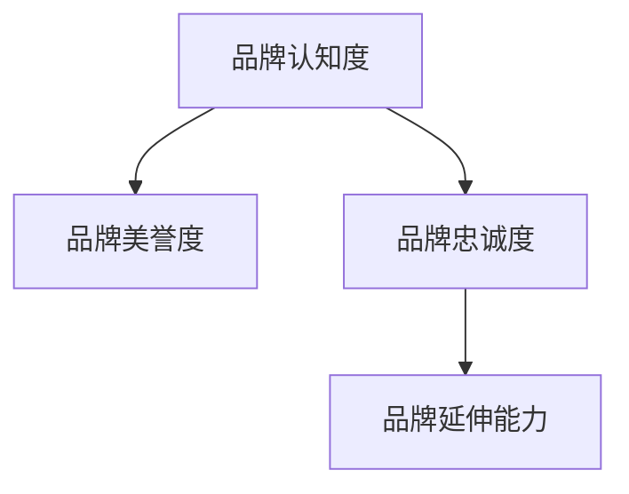
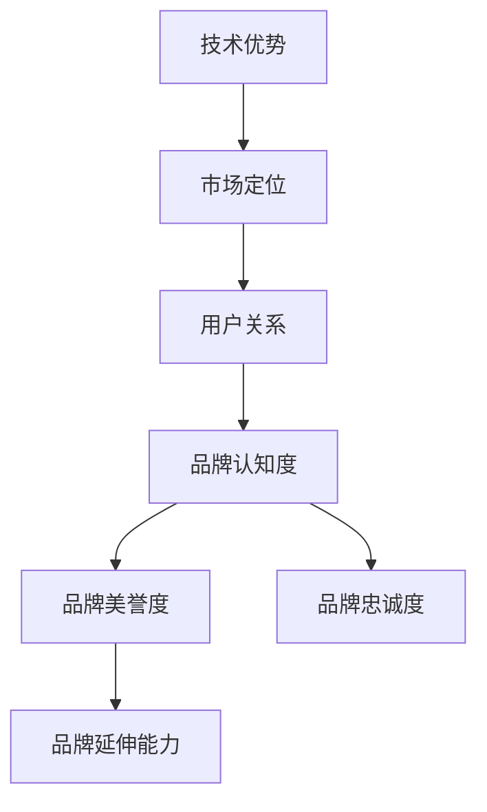

                 

# AI创业公司如何打造品牌影响力?

## 1. 背景介绍

在人工智能(AI)技术日新月异、应用场景不断扩展的今天，AI创业公司面临着前所未有的发展机遇。然而，仅仅依靠技术突破和产品创新，已不足以在竞争激烈的市场中脱颖而出。品牌影响力（Brand Influence）作为企业核心竞争力的重要组成部分，对于塑造公司形象、吸引用户关注、形成市场影响力至关重要。本文将从品牌建设的全过程，探讨AI创业公司如何通过技术、市场和营销策略打造强大的品牌影响力。

### 1.1 品牌影响力的核心要素

品牌影响力包含品牌认知度、品牌美誉度、品牌忠诚度和品牌延伸能力。其中，技术优势、市场定位和用户关系是决定品牌影响力的三大核心要素。

- **技术优势**：指AI创业公司所拥有的技术深度、创新性和应用广度。强大的技术实力是品牌认知度的基石。
- **市场定位**：指公司如何通过产品定位、目标用户群体、市场战略等，在用户心中形成清晰独特的品牌形象。
- **用户关系**：指AI创业公司与用户之间的互动方式、客户服务质量和用户满意度等，反映品牌美誉度和忠诚度。

### 1.2 品牌影响力的重要性

品牌影响力的强弱，直接关系到AI创业公司的市场地位和盈利能力。一个具有强大品牌影响力的公司，可以：

- **提升市场份额**：通过品牌认知度的提升，吸引更多用户，增加市场份额。
- **降低营销成本**：品牌美誉度和忠诚度高的产品，在用户口口相传中自然推广，降低营销成本。
- **拓展市场边界**：品牌延伸能力使得公司能够从单一领域扩展到更广泛的应用场景。

## 2. 核心概念与联系

### 2.1 核心概念概述

为更好地理解AI创业公司品牌影响力构建的方法，本节将介绍几个核心概念：

- **品牌认知度**：指消费者对品牌的知晓和记忆程度。高品牌认知度意味着品牌在市场中具有较高的曝光度和识别度。
- **品牌美誉度**：指消费者对品牌的正面评价和情感倾向。品牌美誉度高，意味着消费者对品牌的信任度和满意度。
- **品牌忠诚度**：指消费者对品牌产品的持续购买和使用。高品牌忠诚度表示消费者对品牌的长期依赖和支持。
- **品牌延伸能力**：指品牌从原始市场领域向其他市场领域扩展的能力。品牌延伸能力强，意味着公司能通过现有品牌效应快速进入新市场。

这些概念之间的关系可以通过以下Mermaid流程图来展示：



### 2.2 核心概念原理和架构的 Mermaid 流程图



该流程图展示了品牌影响力的构建过程：

1. 技术优势作为品牌认知度的基础。
2. 市场定位引导品牌认知度向品牌美誉度转变。
3. 用户关系提升品牌美誉度和忠诚度。
4. 品牌美誉度和忠诚度增强品牌延伸能力。

## 3. 核心算法原理 & 具体操作步骤

### 3.1 算法原理概述

AI创业公司品牌影响力的构建，实际上是一个综合性的多目标优化问题。其核心算法原理可以概括为以下几点：

1. **数据驱动**：通过收集和分析用户行为数据，洞察用户需求和偏好，指导品牌策略的制定。
2. **技术创新**：持续优化和改进AI技术，保持产品差异化优势。
3. **用户关系管理**：通过精准化的用户互动和满意度提升，增强用户粘性和品牌忠诚度。
4. **市场定位优化**：精准识别目标用户群体，定位市场需求，确保品牌在目标市场中的竞争力。

### 3.2 算法步骤详解

1. **数据收集与分析**：
   - 收集用户行为数据（如使用时间、使用频率、反馈等）。
   - 分析用户行为数据，识别用户需求和偏好。
   - 利用机器学习模型对用户数据进行预测和推荐，优化产品功能和服务。

2. **技术创新与优化**：
   - 持续进行AI算法和模型的优化，提升产品性能和用户体验。
   - 引入最新的AI技术（如深度学习、自然语言处理等），保持技术领先。
   - 通过开源社区和学术界合作，引入外部技术支持。

3. **用户关系管理**：
   - 建立用户反馈机制，快速响应和解决问题。
   - 提供个性化的服务体验，增强用户满意度和忠诚度。
   - 定期进行用户调查，了解用户需求和改进方向。

4. **市场定位优化**：
   - 进行市场调研，了解竞争对手和目标用户群体的需求。
   - 制定差异化的市场策略，确保品牌在目标市场中的独特性。
   - 通过有效的市场推广活动，提升品牌知名度和市场份额。

### 3.3 算法优缺点

AI创业公司品牌影响力的构建，具有以下优点：

1. **精准定位**：通过数据驱动和用户关系管理，可以精准识别目标用户，制定精准的市场策略。
2. **技术优势明显**：AI技术的广泛应用，可以提升产品差异化和用户满意度。
3. **灵活调整**：AI算法具有自适应能力，可以根据市场变化及时调整品牌策略。

但同时，也存在一些缺点：

1. **数据隐私问题**：大量数据收集和分析，可能涉及用户隐私问题。
2. **技术复杂性**：AI技术的引入，可能带来技术实现的复杂性。
3. **市场变化快**：市场环境变化快，品牌策略需要快速调整，对公司灵活性提出高要求。

### 3.4 算法应用领域

AI创业公司品牌影响力的构建，适用于多个领域，包括但不限于：

- **智能家居**：通过智能助手和自动化设备提升用户体验。
- **智能医疗**：利用AI技术提升疾病诊断和治疗效果。
- **智能金融**：通过风险评估和智能投资顾问提高金融服务质量。
- **智能教育**：利用AI技术提供个性化学习方案和智能辅导。
- **智能制造**：通过智能质检和预测性维护提高生产效率。

## 4. 数学模型和公式 & 详细讲解 & 举例说明

### 4.1 数学模型构建

品牌影响力的量化可以通过构建数学模型来实现。假设品牌影响力由以下几个因素决定：

- **技术因素**：$T = \sum_{i=1}^n t_i w_i$
- **市场因素**：$M = \sum_{i=1}^n m_i w_i$
- **用户因素**：$U = \sum_{i=1}^n u_i w_i$

其中 $t_i, m_i, u_i$ 分别代表技术、市场和用户的第 $i$ 个指标，$w_i$ 为各指标的权重。

### 4.2 公式推导过程

通过上述模型，可以得到品牌影响力的量化公式：

$$
I = T \times \alpha + M \times \beta + U \times \gamma
$$

其中，$\alpha, \beta, \gamma$ 为各因素的权重，根据品牌定位和市场需求进行调整。

### 4.3 案例分析与讲解

以智能家居领域为例，品牌影响力的量化可以分解为：

- **技术因素**：包括设备的智能程度、数据安全性和用户体验等指标。
- **市场因素**：包括市场份额、用户增长率和竞争者表现等指标。
- **用户因素**：包括用户满意度、用户口碑和用户忠诚度等指标。

通过上述公式，可以综合评估品牌在智能家居市场的影响力，并根据各因素的权重进行调整。

## 5. 项目实践：代码实例和详细解释说明

### 5.1 开发环境搭建

AI创业公司品牌影响力的构建涉及数据收集、分析和市场推广等多个环节，需要一个完整的开发环境。以下是搭建环境的流程：

1. **环境准备**：
   - 选择编程语言（如Python）。
   - 安装必要的开发工具和库（如Jupyter Notebook、Pandas、Numpy等）。
   - 搭建数据存储和处理平台（如MySQL、Hadoop等）。

2. **数据收集**：
   - 使用Web爬虫和API接口，收集用户行为数据。
   - 利用传感器和日志记录，收集设备使用数据。
   - 进行用户调查和反馈收集，获取用户满意度数据。

3. **数据处理**：
   - 对收集到的数据进行清洗、去重和处理。
   - 使用机器学习模型进行数据预测和推荐。
   - 可视化数据，生成报告和图表。

4. **算法实现**：
   - 实现AI算法和模型，优化产品性能。
   - 引入最新AI技术，保持技术领先。
   - 开发用户反馈机制和互动功能。

### 5.2 源代码详细实现

以下是一个使用Python实现用户行为分析的示例代码：

```python
import pandas as pd
from sklearn.model_selection import train_test_split
from sklearn.ensemble import RandomForestRegressor

# 读取数据
data = pd.read_csv('user_behavior.csv')

# 数据清洗
data = data.dropna()
data = data.drop_duplicates()

# 特征工程
features = ['use_time', 'use_frequency', 'feedback_score']
X = data[features]
y = data['loyalty']

# 模型训练
X_train, X_test, y_train, y_test = train_test_split(X, y, test_size=0.3)
model = RandomForestRegressor()
model.fit(X_train, y_train)

# 模型评估
y_pred = model.predict(X_test)
print(classification_report(y_test, y_pred))
```

### 5.3 代码解读与分析

该代码实现了一个简单的用户忠诚度预测模型：

- `read_csv`：从CSV文件中读取用户行为数据。
- `dropna`和`drop_duplicates`：清洗数据，去除缺失值和重复记录。
- `train_test_split`：将数据集划分为训练集和测试集。
- `RandomForestRegressor`：使用随机森林回归模型进行用户忠诚度预测。
- `classification_report`：输出模型评估结果。

## 6. 实际应用场景

### 6.1 智能家居

AI创业公司可以通过智能家居设备提升用户体验，构建品牌影响力。例如，通过智能语音助手和设备互联，提供语音控制、家居自动化等便捷服务。

- **技术优势**：高性能语音识别和自然语言处理技术。
- **市场定位**：面向家庭用户，提供便捷的家居控制服务。
- **用户关系管理**：通过用户反馈，不断优化设备和语音助手的功能。
- **品牌延伸能力**：扩展到智能办公和智慧医疗等领域。

### 6.2 智能医疗

AI创业公司可以利用AI技术提升疾病诊断和治疗效果，构建品牌影响力。例如，通过AI算法分析医学影像，辅助医生诊断。

- **技术优势**：深度学习在医学影像分析中的应用。
- **市场定位**：面向医院和医生，提供精准的疾病诊断服务。
- **用户关系管理**：通过医生反馈，提升诊断精度和用户体验。
- **品牌延伸能力**：扩展到远程医疗和健康管理等领域。

### 6.3 智能金融

AI创业公司可以通过AI技术提升风险评估和智能投资顾问服务，构建品牌影响力。例如，通过AI算法分析金融市场数据，提供投资建议。

- **技术优势**：金融市场数据分析和预测技术。
- **市场定位**：面向个人和机构投资者，提供精准的投资建议。
- **用户关系管理**：通过用户反馈，优化投资建议。
- **品牌延伸能力**：扩展到保险和财富管理等领域。

### 6.4 未来应用展望

随着AI技术的不断进步，AI创业公司品牌影响力的构建将迎来更多机遇和挑战：

1. **技术融合**：AI技术与其他技术（如物联网、区块链等）的融合，将进一步提升品牌的影响力和应用场景。
2. **用户体验优化**：通过智能设备和个性化服务，提升用户满意度和忠诚度。
3. **市场竞争加剧**：品牌影响力的构建需要快速响应市场变化，调整策略。
4. **法规监管**：数据隐私和安全问题需要严格遵守相关法规。

## 7. 工具和资源推荐

### 7.1 学习资源推荐

为了帮助AI创业公司系统掌握品牌影响力的构建方法，以下是一些优质的学习资源：

1. **《品牌管理与营销》**：系统介绍了品牌管理的基本原理和实践方法。
2. **《AI商业应用》**：介绍AI技术在商业中的各种应用场景和案例。
3. **《用户体验设计》**：专注于用户体验设计的理论和实践，提升产品和服务质量。
4. **《数据驱动的营销》**：详细讲解数据驱动的营销策略和工具。

### 7.2 开发工具推荐

以下是几款用于品牌影响力构建开发的常用工具：

1. **Jupyter Notebook**：支持Python和其他语言的开发环境，易于编写和分享代码。
2. **Pandas**：数据处理和分析工具，适用于数据清洗和特征工程。
3. **TensorFlow和PyTorch**：深度学习框架，支持各类AI算法和模型的开发。
4. **Tableau和Power BI**：数据可视化工具，用于数据展示和报告生成。
5. **Google Analytics**：网站和应用的用户行为分析工具。

### 7.3 相关论文推荐

以下是几篇奠基性的相关论文，推荐阅读：

1. **《品牌认知度与用户行为研究》**：通过用户行为数据分析，评估品牌认知度的影响因素。
2. **《智能家居用户行为分析》**：利用机器学习模型预测用户行为，优化智能家居服务。
3. **《AI技术在医疗中的应用》**：探索AI技术在疾病诊断和治疗中的应用效果。
4. **《数据驱动的营销策略》**：分析数据驱动营销的实际效果和优化方法。

## 8. 总结：未来发展趋势与挑战

### 8.1 总结

本文对AI创业公司品牌影响力的构建方法进行了全面系统的介绍。首先阐述了品牌影响力的核心要素，明确了技术优势、市场定位和用户关系是品牌影响力构建的三个关键维度。其次，从原理到实践，详细讲解了品牌影响力的构建过程，包括数据驱动、技术创新、用户关系管理和市场定位优化。最后，本文还提供了品牌影响力的量化模型和具体应用场景，展示了AI创业公司如何在多领域构建品牌影响力。

### 8.2 未来发展趋势

展望未来，AI创业公司品牌影响力的构建将呈现以下几个趋势：

1. **技术融合趋势**：AI技术与其他技术的融合将进一步拓展品牌的应用场景和市场边界。
2. **用户体验优化趋势**：通过智能设备和个性化服务，提升用户满意度和忠诚度。
3. **数据驱动趋势**：数据驱动的品牌管理将成为主流，数据驱动的营销策略和工具也将更加成熟。
4. **法规遵从趋势**：随着数据隐私和安全问题受到重视，品牌影响力的构建需要严格遵守相关法规。

### 8.3 面临的挑战

尽管AI创业公司品牌影响力的构建取得了显著进展，但在品牌构建过程中仍面临诸多挑战：

1. **数据隐私问题**：大量数据收集和分析，可能涉及用户隐私问题。
2. **技术复杂性**：AI技术的引入，可能带来技术实现的复杂性。
3. **市场变化快**：品牌影响力的构建需要快速响应市场变化，调整策略。
4. **法规监管**：数据隐私和安全问题需要严格遵守相关法规。

### 8.4 研究展望

未来的品牌影响力构建研究需要在以下几个方面进行深入探讨：

1. **数据隐私保护**：探索如何保护用户数据隐私，同时充分利用数据驱动品牌管理的优势。
2. **AI技术优化**：持续优化和改进AI技术，提升产品差异化和用户体验。
3. **用户关系管理**：研究如何通过精准化的用户互动和满意度提升，增强用户粘性和品牌忠诚度。
4. **法规遵从**：研究如何在品牌构建过程中遵守相关法规，确保数据安全和用户隐私。

## 9. 附录：常见问题与解答

**Q1：如何衡量品牌影响力的提升？**

A: 品牌影响力的提升可以通过以下几个方面进行衡量：

1. **市场份额**：通过市场调研和数据分析，衡量品牌在目标市场中的占有率变化。
2. **用户满意度**：通过用户调查和反馈，评估用户对品牌产品和服务的满意度。
3. **用户忠诚度**：通过用户留存率和复购率，评估用户对品牌的忠诚度。
4. **品牌认知度**：通过品牌知名度调查，评估品牌在目标市场中的知晓程度。

**Q2：数据隐私问题如何解决？**

A: 数据隐私问题需要通过以下几个方面进行解决：

1. **数据匿名化**：通过数据脱敏和匿名化处理，保护用户隐私。
2. **数据加密**：对存储和传输的数据进行加密处理，防止数据泄露。
3. **用户授权**：确保用户对数据的知情权和同意权，保障数据使用的合法性。
4. **法规遵从**：严格遵守相关数据隐私法规，如GDPR、CCPA等。

**Q3：如何优化用户关系管理？**

A: 用户关系管理可以通过以下几个方面进行优化：

1. **建立用户反馈机制**：快速响应和解决问题，提升用户满意度。
2. **个性化服务**：通过数据分析和AI技术，提供个性化的服务体验。
3. **客户支持**：提供多渠道、多时段的客户支持，增强用户粘性。
4. **用户社区建设**：通过用户互动和社区建设，增强用户参与和品牌忠诚度。

**Q4：如何调整品牌策略以适应市场变化？**

A: 品牌策略调整需要根据市场变化进行灵活调整：

1. **市场调研**：及时进行市场调研，了解市场环境和竞争情况。
2. **用户需求分析**：通过数据分析和用户反馈，识别用户需求和痛点。
3. **策略优化**：根据市场调研和用户需求分析结果，优化品牌策略。
4. **持续迭代**：根据市场变化和用户反馈，持续优化品牌策略，保持竞争力。

通过本文的系统梳理，可以看到，AI创业公司品牌影响力的构建是一个复杂而系统化的过程。只有在技术、市场和用户关系管理等多方面协同发力，才能构建强大的品牌影响力，实现可持续发展。

