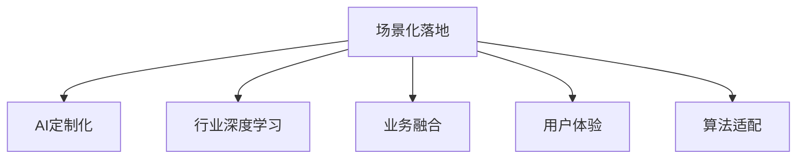
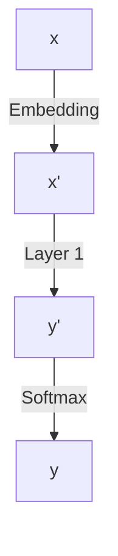

                 

# AI创业公司如何进行场景化落地?

## 1. 背景介绍

### 1.1 问题由来
人工智能(AI)技术近年来迅猛发展，各行各业纷纷引入AI来提升效率、优化流程、创新服务。AI创业公司在此背景下应运而生，它们利用最新AI技术，为垂直领域提供定制化的解决方案，助力产业转型升级。然而，如何将AI技术落地应用，满足不同行业的多样化需求，成为AI创业公司面临的一大挑战。

### 1.2 问题核心关键点
场景化落地是指针对特定行业应用场景，将AI技术进行定制化适配，并转化为实际应用的过程。这一过程涉及技术、业务、市场等多个维度，需要深入理解目标场景、设计符合需求的解决方案，并进行优化迭代。AI创业公司要实现场景化落地，必须具备跨学科的复合能力，深度洞察行业需求，综合运用算法、数据、模型等技术手段，从需求挖掘到落地部署，全程提供一站式的解决方案。

### 1.3 问题研究意义
实现场景化落地，能够使AI技术更好地服务于行业需求，提升AI应用的价值和影响力。同时，通过场景化落地，AI创业公司能够快速验证和优化技术方案，增强市场竞争力，实现商业化成功。

## 2. 核心概念与联系

### 2.1 核心概念概述

为更好地理解场景化落地的核心方法，本节将介绍几个密切相关的核心概念：

- **场景化落地**：针对特定行业应用场景，定制化适配AI技术的过程。其核心在于理解需求、设计模型、优化迭代等环节。
- **AI定制化**：根据具体行业需求，对AI技术进行定制化优化，以提升应用效果和用户体验。
- **行业深度学习**：利用深度学习技术，针对特定行业问题进行模型训练和优化，提升AI在特定场景中的性能。
- **业务融合**：将AI技术与行业业务进行深度融合，提升业务流程的智能化水平，实现高效、稳定、可靠的应用。
- **用户体验**：通过优化用户界面、交互方式、反馈机制等，提升AI应用的易用性和用户体验。
- **算法适配**：根据特定场景需求，选择合适的算法模型和架构，进行参数调整和优化。

这些核心概念之间的逻辑关系可以通过以下Mermaid流程图来展示：



这个流程图展示了一体化场景化落地过程的关键步骤：

1. 首先，通过场景化落地，了解行业需求和应用场景。
2. 然后，根据场景需求进行AI定制化，优化算法模型和架构。
3. 在此基础上，开展行业深度学习，提升模型性能和效果。
4. 最后，通过业务融合和用户体验优化，确保AI应用落地成功。

## 3. 核心算法原理 & 具体操作步骤

### 3.1 算法原理概述

场景化落地的核心在于深度理解和适配行业需求，通过AI技术的定制化优化，实现模型在特定场景中的高效应用。其基本思想是：

- 分析行业场景，明确应用需求和目标。
- 根据需求设计符合场景的算法模型和架构。
- 在大量领域数据上进行模型训练和优化，提升模型泛化能力。
- 在目标场景中进行测试和验证，不断调整和优化模型参数。
- 最终将模型部署到实际应用中，实现场景化落地。

### 3.2 算法步骤详解

以下是AI创业公司进行场景化落地的详细步骤：

**Step 1: 场景分析与需求调研**

- 深入了解目标行业的业务流程、数据特点、用户痛点等，明确AI应用的目标和需求。
- 与行业专家、客户进行深度交流，获取第一手数据和见解。
- 绘制场景需求图，列出关键需求点，如性能指标、实时性要求、用户体验等。

**Step 2: 设计模型与算法**

- 根据场景需求，选择或设计适合的算法模型和架构，如CNN、RNN、Transformer等。
- 定义模型的输入输出格式，确定数据预处理和特征工程方法。
- 设计模型训练流程，包括损失函数、优化器、学习率等。

**Step 3: 数据准备与预处理**

- 收集目标场景的代表性数据，包括历史数据、模拟数据、标注数据等。
- 对数据进行清洗、去重、标注等预处理操作。
- 划分训练集、验证集和测试集，确保数据分布的一致性。

**Step 4: 模型训练与优化**

- 使用目标场景数据对模型进行训练，调整模型参数以提升性能。
- 在验证集上进行模型评估，调整模型结构或参数以提升泛化能力。
- 使用正则化、早停等技术防止过拟合，确保模型稳定性。
- 采用模型融合、剪枝等方法提升模型效率，适应特定场景需求。

**Step 5: 测试与部署**

- 在目标场景中对模型进行测试，评估模型在实际数据上的表现。
- 根据测试结果，调整模型参数或重新设计算法，优化模型性能。
- 将模型部署到实际应用中，如集成到业务系统中，进行生产环境测试。
- 持续收集用户反馈和运行数据，优化模型和应用效果。

### 3.3 算法优缺点

场景化落地具有以下优点：

1. **高度定制化**：能够针对特定行业需求进行深度定制，提升模型在特定场景中的表现。
2. **应用效果显著**：通过优化模型和算法，显著提升业务流程的智能化水平。
3. **用户满意度提高**：通过设计符合用户需求的界面和交互方式，提升用户体验。
4. **业务融合紧密**：通过与行业业务深度融合，提升业务流程的整体效率和质量。

同时，场景化落地也存在一些局限性：

1. **开发周期长**：需要深入理解行业需求，进行大量模型设计和优化工作，开发周期较长。
2. **成本高**：可能需要大量数据和计算资源，开发成本较高。
3. **适应性不足**：如果场景需求发生变化，模型可能需要重新设计或优化。
4. **模型复杂度高**：高度定制化模型可能较复杂，难以扩展到其他场景。

尽管如此，场景化落地仍然是AI创业公司实现商业化的重要手段，能够显著提升应用价值，满足行业需求。

### 3.4 算法应用领域

场景化落地的应用领域非常广泛，覆盖了各行业的AI应用场景，例如：

- **医疗健康**：基于医疗数据，设计深度学习模型进行疾病预测、诊疗辅助等。
- **金融科技**：利用金融数据，设计模型进行风险评估、智能投顾、反欺诈等。
- **智能制造**：基于生产数据，设计模型进行设备故障预测、生产优化等。
- **智能交通**：利用交通数据，设计模型进行路线优化、交通流量预测等。
- **智慧教育**：基于学生数据，设计模型进行个性化学习推荐、智能作业批改等。
- **智慧城市**：利用城市数据，设计模型进行环境监测、应急响应等。

这些领域的应用场景多样，需求各异，需要深入理解行业特点，量身定制AI解决方案。

## 4. 数学模型和公式 & 详细讲解 & 举例说明

### 4.1 数学模型构建

假设目标场景为零售行业，需要设计一个智能推荐系统。模型输入为用户历史购买记录和浏览记录，输出为用户可能感兴趣的商品推荐。

**输入表示**：将用户行为数据表示为向量形式 $x \in \mathbb{R}^n$，其中 $n$ 为特征维度。

**输出表示**：将推荐结果表示为向量形式 $y \in \mathbb{R}^m$，其中 $m$ 为商品数量。

### 4.2 公式推导过程

以神经网络模型为例，输入 $x$ 通过若干隐藏层映射到输出 $y$，模型结构如图：



其中，$x'$ 为嵌入后的特征向量，$y'$ 为中间层的输出向量。

定义模型的损失函数为交叉熵损失函数，形式为：

$$
\mathcal{L} = -\frac{1}{N} \sum_{i=1}^N \sum_{j=1}^m y_j \log \hat{y}_j
$$

其中 $N$ 为样本数量，$\hat{y}_j$ 为模型对商品 $j$ 的预测概率。

### 4.3 案例分析与讲解

以推荐系统为例，分析模型训练和优化的关键步骤：

1. **数据准备**：收集用户历史购买记录和浏览记录，将其表示为向量形式，进行预处理和归一化。

2. **模型设计**：选择合适的神经网络模型架构，如多层感知机、卷积神经网络等。

3. **模型训练**：使用交叉熵损失函数，通过反向传播算法进行梯度更新，调整模型参数以最小化损失函数。

4. **模型优化**：采用正则化、Dropout等技术防止过拟合，使用早停等策略控制训练次数。

5. **模型测试**：在验证集上评估模型性能，根据测试结果调整模型参数，确保模型泛化能力。

6. **模型部署**：将训练好的模型集成到推荐系统中，进行实际测试和优化。

## 5. 项目实践：代码实例和详细解释说明

### 5.1 开发环境搭建

以下是使用Python和PyTorch搭建推荐系统环境的流程：

1. 安装Anaconda：从官网下载并安装Anaconda，用于创建独立的Python环境。

2. 创建并激活虚拟环境：
```bash
conda create -n pytorch-env python=3.8 
conda activate pytorch-env
```

3. 安装PyTorch：根据CUDA版本，从官网获取对应的安装命令。例如：
```bash
conda install pytorch torchvision torchaudio cudatoolkit=11.1 -c pytorch -c conda-forge
```

4. 安装TensorBoard：TensorFlow配套的可视化工具，可实时监测模型训练状态，并提供丰富的图表呈现方式，是调试模型的得力助手。

5. 安装TensorBoard：
```bash
pip install tensorboard
```

### 5.2 源代码详细实现

以下是推荐系统的代码实现：

```python
import torch
import torch.nn as nn
import torch.optim as optim
from torch.utils.data import DataLoader
from torchvision import datasets, transforms
from tensorboard import SummaryWriter

# 定义模型结构
class RecommendationModel(nn.Module):
    def __init__(self):
        super(RecommendationModel, self).__init__()
        self.encoder = nn.Sequential(
            nn.Linear(100, 128),
            nn.ReLU(),
            nn.Linear(128, 128),
            nn.ReLU()
        )
        self.decoder = nn.Linear(128, 1)

    def forward(self, x):
        x = self.encoder(x)
        x = self.decoder(x)
        return x

# 定义损失函数和优化器
criterion = nn.MSELoss()
optimizer = optim.Adam(model.parameters(), lr=0.001)

# 定义数据集
train_dataset = datasets.MNIST(root='data', train=True, download=True,
                               transform=transforms.ToTensor())
test_dataset = datasets.MNIST(root='data', train=False, download=True,
                              transform=transforms.ToTensor())

# 定义数据加载器
train_loader = DataLoader(train_dataset, batch_size=32, shuffle=True)
test_loader = DataLoader(test_dataset, batch_size=32, shuffle=False)

# 定义训练函数
def train_epoch(model, loader, optimizer, criterion):
    model.train()
    losses = []
    for inputs, labels in loader:
        inputs, labels = inputs.to(device), labels.to(device)
        optimizer.zero_grad()
        outputs = model(inputs)
        loss = criterion(outputs, labels)
        loss.backward()
        optimizer.step()
        losses.append(loss.item())
    return sum(losses) / len(loader)

# 定义测试函数
def evaluate(model, loader, criterion):
    model.eval()
    losses = []
    for inputs, labels in loader:
        inputs, labels = inputs.to(device), labels.to(device)
        outputs = model(inputs)
        loss = criterion(outputs, labels)
        losses.append(loss.item())
    return sum(losses) / len(loader)

# 定义训练循环
device = torch.device('cuda' if torch.cuda.is_available() else 'cpu')
model.to(device)

for epoch in range(10):
    train_loss = train_epoch(model, train_loader, optimizer, criterion)
    test_loss = evaluate(model, test_loader, criterion)
    print(f'Epoch {epoch+1}, train loss: {train_loss:.4f}, test loss: {test_loss:.4f}')
```

### 5.3 代码解读与分析

上述代码实现了推荐系统的基本功能，包括以下关键点：

1. **模型定义**：定义了一个简单的神经网络模型，包括两个隐藏层和一个输出层。

2. **数据加载**：使用PyTorch内置的数据集，对数据进行预处理和加载。

3. **模型训练**：使用交叉熵损失函数和Adam优化器，进行模型训练。

4. **模型测试**：在测试集上评估模型性能，输出损失值。

5. **训练循环**：进行10个epoch的训练，输出训练和测试损失值。

## 6. 实际应用场景

### 6.1 智能客服系统

智能客服系统通过场景化落地，能够提升客户服务体验，减少人力成本，提高响应速度。系统可以集成语音识别、自然语言处理等技术，自动回答客户咨询，解决常见问题。

以电商客服为例，系统可以分析历史聊天记录，总结常见问题和回复模板，进行模型训练和优化。模型集成到系统中，根据用户输入，自动匹配问题和回答，提高服务效率和质量。

### 6.2 金融风控系统

金融风控系统通过场景化落地，能够实时监控和评估交易风险，减少欺诈损失。系统可以集成深度学习模型，对交易数据进行分析和预测。

以反欺诈系统为例，系统可以分析历史交易数据，建立用户行为模型，进行风险评估和预测。模型集成到系统中，实时监控交易行为，预测潜在欺诈行为，及时采取措施。

### 6.3 智慧医疗系统

智慧医疗系统通过场景化落地，能够提升医疗诊断和治疗效果，减少误诊和漏诊。系统可以集成图像识别、自然语言处理等技术，辅助医生进行诊断和治疗。

以影像诊断系统为例，系统可以分析医学影像数据，提取特征并建立诊断模型。模型集成到系统中，根据医生输入的影像数据，自动生成诊断报告，辅助医生进行决策。

## 7. 工具和资源推荐

### 7.1 学习资源推荐

为了帮助AI创业公司系统掌握场景化落地的技术方法，这里推荐一些优质的学习资源：

1. 《深度学习》课程：斯坦福大学开设的深度学习课程，涵盖基础理论、算法实现和应用案例，适合系统学习。

2. 《Python深度学习》书籍：全面介绍了深度学习在Python中的实现方法和应用案例，适合实战练习。

3. 《AI创业公司落地指南》：系统介绍了AI创业公司的落地方法、商业模型和案例分析，适合创业者和企业参考。

4. 《TensorFlow实战》书籍：详细介绍了TensorFlow框架的使用方法和应用案例，适合实战练习。

5. 《机器学习实战》书籍：介绍了机器学习算法在实际应用中的实现方法和应用案例，适合实战练习。

通过对这些资源的学习实践，相信你一定能够系统掌握场景化落地的技术方法，并用于解决实际的AI落地问题。

### 7.2 开发工具推荐

高效的开发离不开优秀的工具支持。以下是几款用于AI场景化落地的常用工具：

1. PyTorch：基于Python的开源深度学习框架，灵活动态的计算图，适合快速迭代研究。

2. TensorFlow：由Google主导开发的开源深度学习框架，生产部署方便，适合大规模工程应用。

3. Keras：基于TensorFlow和Theano的高级深度学习框架，提供高层API，适合快速原型开发。

4. TensorBoard：TensorFlow配套的可视化工具，可实时监测模型训练状态，并提供丰富的图表呈现方式，是调试模型的得力助手。

5. Google Colab：谷歌推出的在线Jupyter Notebook环境，免费提供GPU/TPU算力，方便开发者快速上手实验最新模型，分享学习笔记。

合理利用这些工具，可以显著提升AI场景化落地的开发效率，加快创新迭代的步伐。

### 7.3 相关论文推荐

场景化落地的技术方法源于学界的持续研究。以下是几篇奠基性的相关论文，推荐阅读：

1. Attention is All You Need：提出Transformer结构，开启了NLP领域的预训练大模型时代。

2. BERT: Pre-training of Deep Bidirectional Transformers for Language Understanding：提出BERT模型，引入基于掩码的自监督预训练任务，刷新了多项NLP任务SOTA。

3. Multi-task Learning Using Prediction Task Alignments：提出多任务学习的方法，利用不同任务的预测目标对齐，提升模型的泛化能力。

4. Transfer Learning with Deep Latent Representations：提出基于隐层表示的迁移学习方法，提升了模型在不同场景下的适应能力。

5. Adaptive Computation Time for Recurrent Neural Networks：提出自适应计算时间的方法，提升RNN模型的训练效率和性能。

这些论文代表了大模型落地应用的研究脉络，通过学习这些前沿成果，可以帮助研究者把握学科前进方向，激发更多的创新灵感。

## 8. 总结：未来发展趋势与挑战

### 8.1 总结

本文对AI创业公司如何进行场景化落地的关键方法进行了全面系统的介绍。首先，阐述了场景化落地的背景和意义，明确了落地方法在实际应用中的重要价值。其次，从原理到实践，详细讲解了场景化落地的数学模型和具体步骤，给出了完整的代码实例和详细解释。同时，本文还广泛探讨了场景化落地在多个行业领域的应用前景，展示了落地方法的巨大潜力。此外，本文精选了落地技术的各类学习资源，力求为读者提供全方位的技术指引。

通过本文的系统梳理，可以看到，场景化落地方法正在成为AI创业公司实现商业化的重要手段，能够显著提升应用价值，满足行业需求。未来，伴随技术的不断进步和商业化的深入推进，场景化落地方法还将有更多的创新和突破，为AI创业公司带来更大的发展机遇。

### 8.2 未来发展趋势

展望未来，场景化落地方法将呈现以下几个发展趋势：

1. **模型泛化能力增强**：随着深度学习模型的不断发展，模型泛化能力将进一步提升，能够适应更多场景的需求。

2. **算法和架构优化**：新的算法和架构将被开发出来，以提高训练效率和性能，更好地适配特定场景。

3. **跨模态融合**：未来的落地方法将更多地融合跨模态数据，如视觉、语音、文本等，提升系统的全面性和智能化水平。

4. **云计算和边缘计算**：云计算和边缘计算技术的应用，将使AI落地更加高效、便捷，提升用户体验。

5. **联邦学习**：联邦学习技术将使AI模型在多边数据场景中协同训练，提升模型的泛化能力和隐私保护。

6. **隐私保护**：在数据隐私和安全方面，落地方法将更加注重隐私保护，确保用户数据的安全。

以上趋势凸显了AI场景化落地方法的广阔前景。这些方向的探索发展，必将进一步提升AI应用的价值和影响力，为AI创业公司带来更大的发展机遇。

### 8.3 面临的挑战

尽管场景化落地方法已经取得了一定的进展，但在迈向更广泛应用的过程中，仍然面临诸多挑战：

1. **数据质量问题**：数据质量不足，标注不准确等问题，会影响模型的性能和可靠性。

2. **计算资源限制**：大模型需要大量计算资源，大规模落地需要较高的硬件成本。

3. **模型复杂度增加**：高度定制化的模型可能较复杂，难以扩展到其他场景。

4. **业务融合困难**：模型需要与行业业务深度融合，需要专业的业务知识和技术支持。

5. **用户体验不足**：模型需要优化用户体验，设计符合用户需求的交互方式和界面。

6. **隐私和安全问题**：数据隐私和安全问题，需要新的技术和策略保障。

这些挑战需要行业各方共同努力，通过技术创新和业务合作，才能克服。只有这样，AI场景化落地方法才能更好地服务于行业需求，推动产业数字化转型。

### 8.4 研究展望

面对场景化落地的挑战，未来的研究需要在以下几个方面寻求新的突破：

1. **数据高效利用**：开发高效的数据获取和标注方法，降低成本，提高数据质量。

2. **模型压缩与优化**：开发模型压缩与优化技术，降低计算资源需求，提高落地效率。

3. **跨模态融合**：研究跨模态数据融合技术，提升系统的全面性和智能化水平。

4. **联邦学习与隐私保护**：研究联邦学习技术和隐私保护方法，确保数据安全和隐私。

5. **业务深度融合**：研究AI与业务的深度融合方法，提升系统的实用性和商业价值。

6. **用户体验优化**：研究用户体验设计方法，设计符合用户需求的交互方式和界面。

这些研究方向将推动AI落地方法的不断进步，为AI创业公司带来更大的发展机遇。

## 9. 附录：常见问题与解答

**Q1：场景化落地需要哪些关键技术？**

A: 场景化落地需要以下关键技术：

1. **深度学习模型**：选择合适的深度学习模型和架构，进行模型训练和优化。
2. **数据预处理**：对数据进行清洗、标注、归一化等预处理操作，确保数据质量。
3. **算法优化**：采用正则化、Dropout、早停等技术防止过拟合，确保模型稳定性。
4. **模型部署**：将训练好的模型集成到应用系统中，进行实际测试和优化。
5. **用户体验设计**：设计符合用户需求的交互方式和界面，提升用户体验。

这些技术是实现场景化落地的核心，需要深入理解和灵活应用。

**Q2：场景化落地过程中如何评估模型性能？**

A: 模型性能评估是场景化落地的关键步骤，通常包括以下方法：

1. **交叉验证**：使用交叉验证方法，对模型进行多次训练和评估，确保模型的泛化能力。
2. **A/B测试**：将模型部署到实际应用中，进行A/B测试，对比不同模型的表现。
3. **业务指标**：根据业务需求，设计关键业务指标，评估模型的实际效果。
4. **用户反馈**：收集用户反馈和评价，了解用户对模型的满意度。
5. **性能指标**：根据性能指标，如精度、召回率、F1值等，评估模型的性能。

这些方法可以综合评估模型的性能，确保模型在实际应用中能够满足业务需求。

**Q3：场景化落地的开发流程是什么？**

A: 场景化落地的开发流程包括以下关键步骤：

1. **需求调研**：深入了解目标行业的业务流程、数据特点、用户痛点等，明确AI应用的目标和需求。
2. **模型设计**：选择合适的深度学习模型和架构，进行模型训练和优化。
3. **数据准备**：收集目标场景的代表性数据，进行数据预处理和加载。
4. **模型训练**：使用交叉熵损失函数和优化器，进行模型训练和优化。
5. **模型测试**：在验证集上评估模型性能，根据测试结果调整模型参数，确保模型泛化能力。
6. **模型部署**：将训练好的模型集成到应用系统中，进行实际测试和优化。

这些步骤需要系统掌握，确保模型能够顺利落地。

**Q4：场景化落地在实际应用中需要注意哪些问题？**

A: 场景化落地在实际应用中需要注意以下问题：

1. **数据隐私保护**：确保数据隐私和安全，避免数据泄露和滥用。
2. **模型解释性**：提高模型的可解释性，便于用户理解和调试。
3. **系统鲁棒性**：提升系统的鲁棒性和稳定性，避免过拟合和异常情况。
4. **业务适配**：确保模型与业务深度融合，提升系统的实用性和商业价值。
5. **用户界面设计**：设计符合用户需求的交互方式和界面，提升用户体验。
6. **持续优化**：持续收集用户反馈和运行数据，优化模型和应用效果。

这些问题是场景化落地中常见的挑战，需要综合考虑和解决。

**Q5：场景化落地需要哪些工具和技术支持？**

A: 场景化落地需要以下工具和技术支持：

1. **深度学习框架**：如PyTorch、TensorFlow等，提供深度学习模型的实现和优化。
2. **数据处理工具**：如Pandas、NumPy等，提供数据预处理和分析功能。
3. **可视化工具**：如TensorBoard、Matplotlib等，提供模型训练和性能评估的可视化支持。
4. **云计算平台**：如AWS、Google Cloud等，提供高性能计算和存储资源。
5. **业务分析工具**：如Tableau、Power BI等，提供业务指标和数据分析功能。
6. **用户界面设计工具**：如Sketch、Figma等，提供UI设计功能。

这些工具和技术支持是场景化落地的关键，需要合理使用。

---

作者：禅与计算机程序设计艺术 / Zen and the Art of Computer Programming

