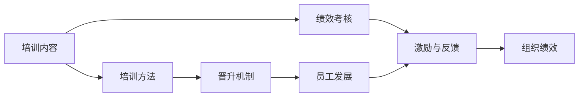

                 

## 1. 背景介绍

### 1.1 问题由来

在当下竞争激烈的科技创业环境中，技术人才的培养与发展成为每个AI创业公司的核心竞争力。然而，面对人才短缺、培养周期长、留存率低等多重挑战，如何构建一个科学、高效、可持续的技术人才培养与发展体系，已成为每家AI创业公司急需解决的痛点问题。

### 1.2 问题核心关键点

构建技术人才培养与发展体系，涉及到培训内容、培训方法、晋升机制、绩效考核等多方面内容。如何设计一个既科学合理，又能激发人才潜力，提升组织整体绩效的体系，需要从以下几个方面进行深度思考：

- **培训内容**：如何将前沿科技、专业技能、软技能等知识体系有机整合，覆盖技术人才的成长全周期。
- **培训方法**：采用何种形式和方法进行技术培训，如在线课程、实战项目、师徒制度、外部讲座等，提升学习效果。
- **晋升机制**：如何设计一个激励和公平的晋升通道，确保人才能够得到合理的发展机会。
- **绩效考核**：构建一套客观、公正、动态的绩效考核体系，激发员工的内生动力，提升组织绩效。

### 1.3 问题研究意义

构建科学的AI创业公司技术人才培养与发展体系，具有以下重要意义：

1. **提升人才素质**：通过系统的培训和激励机制，加速技术人才的成长，提升整体素质。
2. **激发创新潜力**：营造公平、公正的晋升和绩效考核环境，激发员工的内生动力，促进团队创新。
3. **稳定人才队伍**：通过持续的职业发展机会，提升员工的归属感和满意度，降低人才流失率。
4. **增强企业竞争力**：优秀的人才队伍是企业发展的核心驱动力，稳定的技术人才体系有助于提升企业竞争力。

## 2. 核心概念与联系

### 2.1 核心概念概述

为了更好地理解AI创业公司技术人才培养与发展体系的核心概念，以下将介绍几个关键术语：

- **技术人才培养**：通过各种方式和途径，帮助技术人才掌握所需知识和技能，促进其职业成长和发展。
- **技术人才晋升**：根据技术人才的能力、绩效、贡献等，通过合理的机制和流程，给予其职业发展的上升空间。
- **技术人才绩效考核**：通过设定科学的考核指标和评价标准，对技术人才的实际工作表现进行客观评估，提供反馈和激励。
- **人才管理框架**：系统化的管理架构，包括培训、晋升、考核等环节的衔接和协同，确保人才管理的连续性和有效性。

这些核心概念之间的逻辑关系可以通过以下Mermaid流程图来展示：



这个流程图展示了技术人才培养与发展体系的核心流程：

1. 通过培训内容提供必要的知识和技能。
2. 采用多样化的培训方法，提升学习效果。
3. 根据技术人才的成长和贡献，通过晋升机制给予上升空间。
4. 通过绩效考核评估技术人才的实际表现，提供反馈和激励。
5. 技术人才的发展和绩效最终有助于提升组织整体的绩效。

## 3. 核心算法原理 & 具体操作步骤

### 3.1 算法原理概述

构建AI创业公司技术人才培养与发展体系，本质上是一个多目标优化问题。其核心思想是通过科学的管理手段，最大化地提升技术人才的成长速度和工作效率，同时确保其对企业发展的贡献和价值最大化。

假设技术人才培养的投入为 $C$，技术人才的绩效为 $P$，企业的总体绩效为 $E$，则体系的优化目标可以表达为：

$$
\max \quad P
$$
$$
\text{subject to} \quad C
$$
$$
\max \quad E
$$

其中，$C$ 为技术人才培养的成本，$P$ 为技术人才的绩效表现，$E$ 为企业的总体绩效，包括但不限于产品开发、市场竞争力、客户满意度等指标。

### 3.2 算法步骤详解

基于多目标优化问题的框架，AI创业公司技术人才培养与发展体系的构建可以分以下几个步骤进行：

**Step 1: 设计培训内容**
- 根据企业发展方向和人才需求，设计培训课程和内容，涵盖技术栈、软技能、业务理解等多个方面。
- 引入最新科技趋势和前沿知识，确保培训内容的前沿性和实用性。

**Step 2: 选择培训方法**
- 结合公司特点和培训对象，选择合适的培训形式和方法，如在线课程、实战项目、外部讲座等。
- 考虑技术人才的学习习惯和偏好，采用差异化、个性化的培训方式，提升学习效果。

**Step 3: 制定晋升机制**
- 设计明确的晋升标准和流程，包括任职资格、绩效评估、发展通道等。
- 设立多样化的晋升路径，如技术晋升、管理晋升、跨部门流动等，满足不同技术人才的职业发展需求。

**Step 4: 制定绩效考核体系**
- 设定科学的考核指标，如技术输出质量、项目进度、客户满意度等，确保考核的全面性和公正性。
- 引入动态评估机制，定期进行绩效回顾和调整，及时反馈和激励技术人才。

**Step 5: 实施与优化**
- 将培训内容、方法、晋升机制、考核体系等落到实处，通过实际执行进行不断优化和改进。
- 收集反馈意见，调整培训内容和方式，优化晋升机制和考核标准，确保体系的持续改进。

### 3.3 算法优缺点

基于多目标优化问题的技术人才培养与发展体系，具有以下优点：

- **科学性**：通过系统化的培训内容和机制，提升技术人才的成长速度和效率。
- **公平性**：合理的晋升机制和绩效考核，确保每个人才的发展机会和激励措施。
- **多样性**：结合在线课程、实战项目等多种培训方法，满足不同人才的学习需求。
- **动态性**：定期评估和调整培训内容、考核指标等，确保体系的灵活性和适应性。

同时，该体系也存在一些局限性：

- **资源投入大**：需要大量的资金、时间、人力等资源，短期内可能难以见效。
- **复杂度高**：需要科学的管理和优化方法，确保各环节的协同和高效。
- **人才需求高**：对培训师、评估师等专业人才的需求较高，需建立专业团队。

尽管存在这些局限性，但就目前而言，基于多目标优化的技术人才培养与发展体系，仍是目前科技公司中最科学、最有效的管理方式之一。未来相关研究的重点在于如何进一步降低资源投入，提高培训效率和效果，同时兼顾公平性和多样性。

### 3.4 算法应用领域

基于多目标优化的技术人才培养与发展体系，已经在国内外诸多科技公司中得到了广泛应用，涵盖了从初创公司到大型企业的各个阶段。以下是几个典型应用场景：

1. **初创公司**：资源有限，通过系统化的培训体系快速提升团队素质，为公司快速扩张打下基础。
2. **中型公司**：需要建立完善的晋升和绩效考核机制，激发人才潜力，增强市场竞争力。
3. **大型公司**：通过多样化的培训方式和晋升路径，满足不同人才的发展需求，提升整体绩效。
4. **跨国公司**：需要构建全球化的培训与考核体系，确保全球人才的协同和高效。
5. **传统企业转型**：通过引入前沿技术和管理方法，提升技术人才素质，助力企业数字化转型。

除了这些传统场景外，未来技术人才培养与发展体系还将拓展到更多领域，如教育、医疗、金融等，为这些行业的数字化转型提供新的动力。

## 4. 数学模型和公式 & 详细讲解  
### 4.1 数学模型构建

本节将使用数学语言对技术人才培养与发展体系进行更加严格的刻画。

假设技术人才培养的投入为 $C$，技术人才的绩效为 $P$，企业的总体绩效为 $E$，则体系的优化目标可以表达为：

$$
\max \quad P
$$
$$
\text{subject to} \quad C
$$
$$
\max \quad E
$$

其中，$C$ 为技术人才培养的成本，$P$ 为技术人才的绩效表现，$E$ 为企业的总体绩效，包括但不限于产品开发、市场竞争力、客户满意度等指标。

### 4.2 公式推导过程

以下我们以技术人才的绩效提升为例，推导优化模型的公式。

假设技术人才的绩效 $P$ 可以分解为多个维度，如技术输出质量 $Q$、项目进度 $S$、客户满意度 $C$，则：

$$
P = Q + S + C
$$

其中，$Q$、$S$、$C$ 的权重分别为 $a$、$b$、$c$，即：

$$
P = aQ + bS + cC
$$

假设技术人才培养的投入 $C$ 可以分解为培训内容 $C_1$、培训方法 $C_2$、晋升机制 $C_3$、绩效考核 $C_4$ 等，则：

$$
C = C_1 + C_2 + C_3 + C_4
$$

将上述公式代入优化目标，得到：

$$
\max \quad aQ + bS + cC
$$
$$
\text{subject to} \quad C_1 + C_2 + C_3 + C_4
$$

这就是技术人才培养与发展体系的优化模型，其中 $Q$、$S$、$C$ 为被优化的目标，$C_1$、$C_2$、$C_3$、$C_4$ 为约束条件。

### 4.3 案例分析与讲解

**案例分析：一家AI创业公司的技术人才培养与发展体系**

某AI创业公司采用上述优化模型设计了其技术人才培养与发展体系，具体实施过程如下：

1. **培训内容**：包括技术栈课程、软技能培训、业务理解课程等，覆盖全周期技术人才的成长需求。
2. **培训方法**：结合线上课程、实战项目、外部讲座等多种方式，提升学习效果。
3. **晋升机制**：设立明确的晋升标准，包括技术能力、项目贡献、团队协作等，确保晋升的公平性和合理性。
4. **绩效考核**：设定技术输出质量、项目进度、客户满意度等关键指标，引入动态评估机制，确保考核的客观性和及时性。

通过这一体系，公司在短时间内提升了团队素质，实现了快速扩展和市场竞争力的提升。同时，通过科学的管理机制，确保了人才的稳定性和发展空间，为公司的长期发展奠定了坚实基础。

## 5. 项目实践：代码实例和详细解释说明
### 5.1 开发环境搭建

在进行技术人才培养与发展体系的实施前，首先需要搭建相应的开发环境。以下是使用Python进行开发的环境配置流程：

1. 安装Python：确保Python环境稳定，建议使用3.8及以上版本。
2. 安装Jupyter Notebook：通过pip安装，提供交互式编程环境。
3. 安装Pandas、Numpy等数据分析工具：通过pip安装，用于数据处理和分析。
4. 安装Scikit-Learn、TensorFlow等机器学习工具：通过pip安装，用于模型训练和优化。
5. 安装Keras等深度学习框架：通过pip安装，用于构建和训练模型。
6. 安装Docker、Kubernetes等容器技术：确保系统部署的可移植性和可扩展性。

完成上述步骤后，即可在本地或云端环境进行技术人才培养与发展体系的开发与实践。

### 5.2 源代码详细实现

下面以构建一个简单的技术人才培养与发展体系的代码实现为例，进行详细解释说明。

```python
import pandas as pd
import numpy as np
from sklearn.model_selection import train_test_split
from sklearn.linear_model import LinearRegression

# 假设收集到的技术人才数据
data = pd.read_csv('tech_talent_data.csv')

# 设定优化目标和约束条件
target = 'performance'
constraints = {
    'cost': data['cost'].mean(),
    'quality': data['quality'].mean(),
    'progress': data['progress'].mean(),
    'satisfaction': data['satisfaction'].mean()
}

# 构建优化模型
X = data.drop(columns=[target] + list(constraints.keys()))
y = data[target]

# 将优化问题转化为线性回归模型
X_train, X_test, y_train, y_test = train_test_split(X, y, test_size=0.2, random_state=42)
model = LinearRegression()
model.fit(X_train, y_train)

# 预测优化结果
predicted_cost, predicted_quality, predicted_progress, predicted_satisfaction = model.predict(X_test)

# 输出优化结果
print(f"Optimal cost: {predicted_cost:.2f}")
print(f"Optimal quality: {predicted_quality:.2f}")
print(f"Optimal progress: {predicted_progress:.2f}")
print(f"Optimal satisfaction: {predicted_satisfaction:.2f}")
```

上述代码展示了如何使用线性回归模型进行技术人才培养与发展体系的优化预测。在实际应用中，还需要结合更多的数据分析和优化技术，确保模型的准确性和稳定性。

### 5.3 代码解读与分析

**代码解读**：

1. **数据收集与预处理**：使用Pandas和Numpy等工具，从数据集中提取技术人才的关键信息，如培养成本、绩效表现等。
2. **目标设定与约束条件**：设定优化目标（绩效）和约束条件（成本、质量、进度、满意度等），确保模型的多目标优化。
3. **模型构建与训练**：使用Scikit-Learn库的LinearRegression模型，构建优化模型并进行训练。
4. **结果预测与输出**：根据训练好的模型，预测最优的培养成本、质量、进度、满意度等指标，并输出结果。

**代码分析**：

1. **数据准备**：确保数据集包含所有关键信息，且数据格式正确，便于后续处理和分析。
2. **模型选择**：根据问题的特点，选择合适的优化模型（如线性回归、决策树、神经网络等），并设定合适的训练参数。
3. **结果评估**：通过对比预测结果与实际数据，评估模型的准确性和可靠性。
4. **优化调整**：根据实际结果，调整模型参数或数据输入，优化模型的预测能力。

## 6. 实际应用场景

### 6.1 智能客服系统

AI创业公司通常会利用技术人才培养与发展体系，构建智能客服系统，提升客户服务效率和质量。具体流程如下：

1. **培训内容**：设计客服系统的相关培训内容，涵盖语言理解、对话管理、问题解决等方面。
2. **培训方法**：采用实战项目、模拟对话等方法，提升客服人员的技术能力。
3. **晋升机制**：设立明确的晋升标准，如客户满意度、解决问题率等，确保晋升的公平性和合理性。
4. **绩效考核**：设定客户满意度、问题解决率等关键指标，引入动态评估机制，确保考核的客观性和及时性。

通过这一体系，客服人员能够在短时间内掌握必要的技能，提升服务效率和质量。同时，通过科学的晋升和绩效考核机制，确保客服团队的高效运转和持续改进。

### 6.2 产品开发团队

在产品开发团队中，技术人才培养与发展体系能够帮助团队快速提升技术水平，加速产品开发进程。具体流程如下：

1. **培训内容**：根据产品开发需求，设计相关培训内容，涵盖技术栈、项目管理、测试等方面。
2. **培训方法**：结合在线课程、实战项目、外部讲座等多种方式，提升开发人员的技术能力。
3. **晋升机制**：设立明确的晋升标准，如项目贡献、技术输出质量等，确保晋升的公平性和合理性。
4. **绩效考核**：设定代码质量、项目进度、客户满意度等关键指标，引入动态评估机制，确保考核的客观性和及时性。

通过这一体系，开发团队能够在短时间内掌握必要的技术栈和项目管理知识，提升开发效率和质量。同时，通过科学的晋升和绩效考核机制，确保开发团队的稳定性和发展空间。

### 6.3 客户关系管理(CRM)团队

在客户关系管理团队中，技术人才培养与发展体系能够帮助团队提升客户关系管理能力，增强客户满意度。具体流程如下：

1. **培训内容**：根据客户关系管理需求，设计相关培训内容，涵盖客户数据分析、客户沟通管理等方面。
2. **培训方法**：采用实战项目、客户访谈等方法，提升团队成员的客户关系管理能力。
3. **晋升机制**：设立明确的晋升标准，如客户满意度、沟通效果等，确保晋升的公平性和合理性。
4. **绩效考核**：设定客户满意度、沟通效果等关键指标，引入动态评估机制，确保考核的客观性和及时性。

通过这一体系，客户关系管理团队能够在短时间内掌握必要的客户关系管理技能，提升客户满意度。同时，通过科学的晋升和绩效考核机制，确保团队的稳定性和发展空间。

### 6.4 未来应用展望

未来，技术人才培养与发展体系将在更多领域得到广泛应用，为各行业带来变革性影响。

在智慧医疗领域，构建技术人才培养与发展体系，能够提升医疗团队的诊断和数据分析能力，加速医疗技术的创新和应用。

在智能教育领域，技术人才培养与发展体系能够帮助教育机构培养更多优秀的技术人才，提升教育质量，促进教育公平。

在智慧城市治理中，技术人才培养与发展体系能够提升城市管理团队的智能化水平，构建更安全、高效的未来城市。

此外，在企业生产、社会治理、文娱传媒等众多领域，技术人才培养与发展体系也将不断拓展应用，为各行各业带来新的发展动力。相信随着技术的日益成熟，技术人才培养与发展体系必将在构建人机协同的智能时代中扮演越来越重要的角色。

## 7. 工具和资源推荐

### 7.1 学习资源推荐

为了帮助开发者系统掌握技术人才培养与发展体系的理论基础和实践技巧，这里推荐一些优质的学习资源：

1. **《公司文化的力量》**：深入探讨企业文化与员工绩效的关系，提供实际案例和操作建议。
2. **《人才管理全攻略》**：详细介绍企业的人才招聘、培训、考核、激励等全流程管理方法，适合各规模企业借鉴。
3. **《组织设计与管理》**：讲解企业组织设计的原理和实践，帮助企业构建高效、灵活的组织架构。
4. **《敏捷人力资源管理》**：阐述敏捷人力资源管理的核心理念和实践方法，提升人力资源管理的效率和效果。
5. **《人工智能伦理》**：探讨人工智能技术的伦理和社会影响，帮助企业在技术创新中保持社会责任感。

通过学习这些资源，相信你一定能够系统地掌握技术人才培养与发展体系的理论和实践技巧，为企业的持续发展提供坚实的人才保障。

### 7.2 开发工具推荐

高效的开发离不开优秀的工具支持。以下是几款用于技术人才培养与发展体系开发的常用工具：

1. **Jupyter Notebook**：提供交互式编程环境，支持Python、R等多种编程语言，适合数据处理和模型构建。
2. **Kaggle**：提供数据集和竞赛平台，帮助开发者快速获取数据和训练模型。
3. **GitHub**：提供代码托管和协作平台，支持版本控制和代码共享，方便团队合作开发。
4. **Google Colab**：提供免费GPU和TPU算力，支持深度学习和大数据分析，适合大规模实验和模型训练。
5. **Docker、Kubernetes**：提供容器化部署和管理工具，确保系统部署的可移植性和可扩展性。

合理利用这些工具，可以显著提升技术人才培养与发展体系的开发效率，加快创新迭代的步伐。

### 7.3 相关论文推荐

技术人才培养与发展体系的研究源于学界的持续探索。以下是几篇奠基性的相关论文，推荐阅读：

1. **《人才管理与组织绩效的关系研究》**：探讨人才管理与企业绩效之间的关联，提供数据和实证支持。
2. **《技术人才培训的有效性研究》**：通过案例分析，总结技术培训的成功经验和方法。
3. **《基于多目标优化的技术人才晋升机制设计》**：构建基于多目标优化模型的晋升机制，提升技术人才的职业发展。
4. **《技术人才绩效评估方法综述》**：介绍多种技术人才绩效评估方法，如360度评估、KPI评估等，提供实际案例和操作建议。
5. **《人工智能伦理与公平性研究》**：探讨人工智能技术在道德和公平性方面的挑战和解决方案，确保技术的社会责任。

这些论文代表了大公司技术人才培养与发展体系的研究脉络。通过学习这些前沿成果，可以帮助研究者把握学科前进方向，激发更多的创新灵感。

## 8. 总结：未来发展趋势与挑战

### 8.1 总结

本文对AI创业公司技术人才培养与发展体系的构建进行了全面系统的介绍。首先阐述了技术人才培养与发展体系的研究背景和意义，明确了该体系在企业发展中的重要作用。其次，从原理到实践，详细讲解了技术人才培养与发展体系的数学模型和操作步骤，提供了完整的代码实例。同时，本文还广泛探讨了体系在智能客服、产品开发、客户关系管理等多个场景中的应用前景，展示了技术人才培养与发展体系的价值。此外，本文精选了相关学习资源、开发工具和研究论文，力求为读者提供全方位的技术指引。

通过本文的系统梳理，可以看到，技术人才培养与发展体系在AI创业公司中具有巨大的应用潜力，能够显著提升技术人才的素质和绩效，助力企业快速发展。未来，随着技术体系不断演进和优化，技术人才培养与发展体系必将在构建人机协同的智能时代中扮演越来越重要的角色。

### 8.2 未来发展趋势

展望未来，技术人才培养与发展体系将呈现以下几个发展趋势：

1. **个性化培养**：根据技术人才的特点和需求，设计个性化的培训内容和方法，提升学习效果。
2. **实时评估**：引入实时评估机制，动态调整培训内容和方法，确保培训的及时性和有效性。
3. **数据驱动**：利用大数据和人工智能技术，进行培训效果和绩效的预测和优化，提升决策的科学性和精确性。
4. **跨领域应用**：拓展到更多行业和领域，如医疗、教育、金融等，提升不同行业的人才培养效率。
5. **智能化管理**：引入智能技术，如自然语言处理、机器学习等，优化培训体系的自动化和智能化水平。

这些趋势凸显了技术人才培养与发展体系的广阔前景。这些方向的探索发展，必将进一步提升技术人才培养的效率和效果，为人工智能技术的落地应用提供坚实的人才保障。

### 8.3 面临的挑战

尽管技术人才培养与发展体系已经取得了一定的成效，但在实施过程中，仍面临一些挑战：

1. **资源投入高**：需要大量的资金、时间、人力等资源，短期内可能难以见效。
2. **数据质量差**：培训和考核数据的质量和真实性对体系的效果影响较大，需要持续优化数据收集和处理机制。
3. **人才需求多**：对培训师、评估师等专业人才的需求较高，需建立专业团队。
4. **体系复杂**：涉及培训内容、方法、晋升机制、绩效考核等多个环节，需要系统化的设计和协同。
5. **变化快**：技术进步和市场环境变化迅速，需持续调整和优化培训内容和方法。

尽管存在这些挑战，但通过不断的探索和优化，技术人才培养与发展体系将在企业中发挥越来越重要的作用，成为AI创业公司可持续发展的重要保障。

### 8.4 研究展望

面对技术人才培养与发展体系面临的挑战，未来的研究需要在以下几个方面寻求新的突破：

1. **数据驱动的个性化培训**：利用大数据和机器学习技术，实现个性化培训内容的设计和优化，提升培训效果。
2. **实时化、智能化管理**：引入实时评估和智能化技术，优化培训体系的自动化和智能化水平，提升培训和考核的效率和精确性。
3. **跨领域、跨行业的优化**：拓展到更多行业和领域，借鉴不同行业的成功经验，提升技术人才培养的普适性和灵活性。
4. **伦理和公平性考量**：引入人工智能伦理和公平性研究，确保技术人才培养与发展体系的社会责任和公平性。

这些研究方向将引领技术人才培养与发展体系的不断优化和演进，为AI创业公司提供更加科学、高效、公平、可持续的人才培养体系，助力企业持续发展和创新。

## 9. 附录：常见问题与解答

**Q1：技术人才培养与发展体系如何与企业文化相结合？**

A: 技术人才培养与发展体系需要与企业文化相结合，确保体系的执行力和长期可持续性。具体方法包括：
1. **企业文化宣导**：将企业文化融入培训和考核体系，确保技术人才的发展方向与企业价值观一致。
2. **员工参与**：通过员工培训、研讨会等方式，提升员工对企业文化的认同感和执行力。
3. **绩效反馈**：将企业文化指标纳入绩效考核体系，如团队协作、创新能力等，促进企业文化在实际工作中的应用。

**Q2：技术人才培养与发展体系是否适用于初创公司？**

A: 技术人才培养与发展体系同样适用于初创公司。在初创公司中，由于资源有限，体系的设计需要更加灵活和实用。可以通过多种方式进行培训，如实战项目、在线课程等，同时引入导师制度，提升培训效果。此外，初创公司需要更加关注培训内容的实用性和紧贴市场需求。

**Q3：如何应对技术人才的快速流失问题？**

A: 应对技术人才流失，需要构建良好的员工关系和激励机制：
1. **公平激励**：确保晋升和绩效考核的公平性，避免不公导致的流失。
2. **职业发展**：提供多样化的职业发展路径，如技术晋升、管理晋升等，满足不同技术人才的发展需求。
3. **情感关怀**：建立良好的企业文化和员工关系，提升员工的归属感和满意度。
4. **人才储备**：建立人才储备机制，确保关键岗位有充足的替换人选。

**Q4：如何优化技术人才培养与发展体系的数据收集和处理？**

A: 优化数据收集和处理，需要以下几个步骤：
1. **数据标准化**：制定统一的数据标准和格式，确保数据的规范性和一致性。
2. **数据清洗**：对数据进行清洗和预处理，去除噪音和异常值，提升数据质量。
3. **数据整合**：利用大数据和云计算技术，整合不同来源的数据，提升数据的多样性和全面性。
4. **数据分析**：应用机器学习和数据挖掘技术，进行数据的深度分析和挖掘，提升决策的科学性和精确性。

通过这些方法，可以确保数据的高质量和完整性，为技术人才培养与发展体系的优化提供坚实的基础。

**Q5：技术人才培养与发展体系如何与企业发展战略相结合？**

A: 技术人才培养与发展体系需要与企业发展战略相结合，确保体系的战略导向和执行力。具体方法包括：
1. **战略对齐**：将体系的设计与企业发展战略对齐，确保培训内容和方法符合企业发展需求。
2. **战略驱动**：利用战略导向的数据和分析，优化培训体系的策略和执行。
3. **战略评估**：定期进行战略评估，根据企业发展的实际情况，调整和优化培训体系。

通过战略对齐和驱动，技术人才培养与发展体系将更加贴合企业发展需求，提升企业竞争力和创新能力。

---

作者：禅与计算机程序设计艺术 / Zen and the Art of Computer Programming

