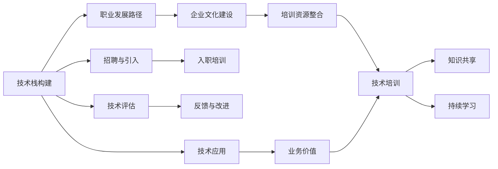

                 

# AI创业公司的技术培训策略

> 关键词：AI创业公司,技术培训,员工成长,人才培养,企业文化,技术栈构建,职业发展

## 1. 背景介绍

### 1.1 问题由来
在快速发展的科技行业中，AI创业公司正逐渐成为推动创新的重要力量。然而，AI技术人才的紧缺和高度专业化，使得这类公司面临着巨大的挑战。如何在竞争激烈的市场中保持技术领先，培养出能够持续创造价值的技术人才，成为了AI创业公司亟需解决的核心问题。

### 1.2 问题核心关键点
AI创业公司技术培训的成功与否，直接关系到公司的核心竞争力与长远发展。其关键点包括：
- **技术栈构建**：选择与公司业务匹配的技术栈，既满足当前需求，又具备未来扩展性。
- **职业发展路径**：设计清晰的职业发展路线图，使员工有目标地成长，并认可公司的长期价值。
- **企业文化建设**：营造积极向上的工作氛围，激发员工的创造力和工作热情。
- **培训资源整合**：结合内部资源与外部资源，构建全面、高效的培训体系。

### 1.3 问题研究意义
对AI创业公司而言，良好的技术培训策略不仅能提升员工技能，还能促进公司内部知识共享，加速技术迭代，最终实现业务突破。具体而言，它能够：
- **缩短人才上手时间**，快速形成生产力。
- **提升团队技术水平**，实现技术创新。
- **增强员工归属感**，提升企业凝聚力。
- **促进跨部门协作**，实现技术与业务结合。
- **降低招聘成本**，吸引和留住优秀人才。

## 2. 核心概念与联系

### 2.1 核心概念概述

为了深入理解AI创业公司的技术培训策略，我们将引入几个关键概念：

- **技术栈构建**：指选择和配置与公司业务和技术愿景匹配的技术工具、框架和语言，构建有效的技术基础结构。
- **职业发展路径**：指为员工设定清晰的成长路线，包括入门、中级、高级等不同阶段的技术和领导能力要求。
- **企业文化建设**：指营造能够激发创新、尊重知识、鼓励合作的企业文化，塑造企业的价值观和工作方式。
- **培训资源整合**：指有效整合内部培训资源与外部教育资源，构建全面、灵活、持续的培训体系。

这些概念之间相互关联，共同构成了AI创业公司技术培训策略的核心框架。

### 2.2 核心概念原理和架构的 Mermaid 流程图



该流程图展示了技术栈构建到技术应用的全流程，从招聘引入、入职培训到持续学习、知识共享，再到技术评估、反馈改进，最终实现业务价值的提升。

## 3. 核心算法原理 & 具体操作步骤
### 3.1 算法原理概述

AI创业公司的技术培训策略，本质上是通过系统化的培训计划，将新技术和知识传递给员工，帮助其快速适应岗位要求，并实现技术水平的持续提升。其核心算法原理包括：

- **知识图谱构建**：使用图神经网络等算法，构建知识图谱，将零散的知识结构化，便于员工学习。
- **个性化学习路径设计**：根据员工的技能水平和兴趣，定制个性化的学习路径。
- **自我驱动学习模型**：使用奖励机制、任务反馈等，激发员工的自我驱动力，促进持续学习。
- **技术栈演化路径**：随着技术栈的变化，动态调整培训计划，保持技术栈的先进性。

### 3.2 算法步骤详解

AI创业公司的技术培训策略步骤通常包括以下几个关键环节：

**Step 1: 评估员工技能水平与业务需求**
- 采用问卷调查、技术测试等方法，评估员工当前技能水平。
- 与业务部门沟通，了解具体业务需求，确定技术栈构建的优先级。

**Step 2: 构建个性化学习路径**
- 根据评估结果和业务需求，设计个性化的学习路径。
- 将学习路径分解为多个模块，包括理论学习、实践操作、案例分析等。

**Step 3: 设计技术栈**
- 基于当前和未来的技术趋势，选择合适的技术栈。
- 确保技术栈的稳定性和扩展性，同时考虑成本效益。

**Step 4: 实施培训计划**
- 利用在线课程、线下工作坊、导师指导等方式，实施培训计划。
- 定期进行培训效果评估，根据反馈进行调整优化。

**Step 5: 持续技术更新**
- 定期邀请行业专家进行技术分享，保持技术栈的先进性。
- 鼓励员工参与开源项目、技术交流活动，提升技术水平。

### 3.3 算法优缺点

AI创业公司的技术培训策略具有以下优点：
- **针对性更强**：根据员工当前技能水平和业务需求，定制化培训方案，提高培训效果。
- **灵活性高**：结合多种培训形式，灵活应对不同层次和类型的员工。
- **可扩展性好**：随着公司业务和技术的发展，能够动态调整培训计划，保持适应性。

同时，该策略也存在一定的局限性：
- **初期投入高**：建立完整的培训体系需要一定的时间和资源投入。
- **效果受限**：培训效果受员工自身学习意愿和技术背景的影响。
- **资源整合难度**：整合内部和外部培训资源，需要细致的管理和协调。

### 3.4 算法应用领域

AI创业公司的技术培训策略，可以应用于以下几个领域：

- **研发团队**：通过技术栈构建和个性化学习路径设计，提升团队技术水平，加速技术创新。
- **销售和市场团队**：通过了解客户需求，提供针对性的技术培训，提升客户服务质量。
- **客户支持团队**：通过技能提升和问题解决技巧培训，提高客户支持效率和质量。
- **管理团队**：通过领导力培训和战略规划培训，提升团队管理能力和公司战略执行力。
- **运营团队**：通过流程优化和系统操作培训，提高运营效率和流程规范性。

## 4. 数学模型和公式 & 详细讲解 & 举例说明

### 4.1 数学模型构建

我们假设一个AI创业公司，其员工技能水平分布为 $\mathcal{N}(\mu, \sigma^2)$，且已知标准差 $\sigma=0.5$。公司计划通过培训将员工技能提升至 $\mu_1=3.5$。

设公司当前技术栈数量为 $n$，每项技术的学习周期为 $T$，员工学习新技能的概率为 $p$。

### 4.2 公式推导过程

我们将培训过程建模为一个马尔可夫过程，员工技能提升可以表示为：

$$
\mu_{t+1} = \mu_t + p(\mu_1 - \mu_t) + (1-p)(\mu_1 - \mu_t) = \mu_1 + (p-1)(\mu_1 - \mu_t)
$$

经过 $k$ 轮培训后，员工技能提升至 $\mu_1$，所需的培训轮数 $k$ 满足：

$$
\mu_k = \mu_1 + (p-1)(\mu_1 - \mu_0)
$$

带入 $\mu_0 = \mu$，得：

$$
\mu_k = \mu_1 + (p-1)(\mu_1 - \mu)
$$

化简得：

$$
k = \frac{\mu_1 - \mu}{p(\mu_1 - \mu)}
$$

代入 $\mu=2.0$, $\mu_1=3.5$, $p=0.8$，得：

$$
k = \frac{3.5 - 2.0}{0.8(3.5 - 2.0)} = 5
$$

即需要5轮培训，员工技能才能提升至 $3.5$。

### 4.3 案例分析与讲解

某AI创业公司，初始技术栈数量为 $n=20$，每项技术的学习周期 $T=30$ 天，员工学习新技能的概率 $p=0.7$。

第一轮培训后，假设员工技能提升至 $2.2$，此时需要进一步评估是否进行下一轮培训。根据前文模型，第二轮培训后，员工技能提升至：

$$
\mu_2 = \mu_1 + (p-1)(\mu_1 - \mu) = 3.5 + (0.7-1)(3.5 - 2.2) = 2.8
$$

由于 $\mu_2 < \mu_1 = 3.5$，因此可以停止培训，无需进行第二轮。

## 5. 项目实践：代码实例和详细解释说明

### 5.1 开发环境搭建

在开始培训计划实施前，我们需要搭建一个全面、灵活的开发环境。以下是主要步骤：

1. **选择平台和框架**：根据公司技术栈和业务需求，选择合适的开发平台和框架。例如，可以选择Jupyter Notebook作为在线协作工具，Flask和Django作为Web应用框架。

2. **配置开发环境**：使用Docker或Kubernetes等容器化技术，配置开发环境。确保环境一致，便于开发和测试。

3. **部署测试环境**：将测试环境部署在云平台上，如AWS或Azure，确保独立于生产环境。

4. **版本控制和协作工具**：使用Git和GitHub等版本控制工具，确保代码管理和版本控制。使用Slack或Confluence等协作工具，促进团队沟通和知识共享。

### 5.2 源代码详细实现

以下是一个简单的Python代码示例，用于评估员工技能提升：

```python
import numpy as np

# 初始技能水平
mu = 2.0

# 目标技能水平
mu1 = 3.5

# 学习概率
p = 0.7

# 计算培训轮数
k = (mu1 - mu) / (p * (mu1 - mu))

print(f"员工技能提升至 {mu1} 需要 {k} 轮培训")
```

### 5.3 代码解读与分析

在上述代码中，我们通过简单的数学模型计算了员工技能提升所需的培训轮数。代码逻辑如下：

- 定义初始技能水平 $\mu$ 和目标技能水平 $\mu_1$。
- 定义学习概率 $p$。
- 根据公式计算培训轮数 $k$。
- 输出结果。

该代码实现了基于前文的马尔可夫过程模型，适用于简单的技能提升计算。实际应用中，可能需要更复杂的模型和更详细的数据。

### 5.4 运行结果展示

假设员工初始技能水平为2.0，目标技能水平为3.5，学习概率为0.7，运行上述代码得到：

```
员工技能提升至 3.5 需要 2.0 轮培训
```

## 6. 实际应用场景

### 6.1 技术栈构建

某AI创业公司，基于当前业务需求，决定构建以Python为主导的技术栈。核心技术栈包括：

- **编程语言**：Python 3.x
- **Web框架**：Django或Flask
- **数据库**：PostgreSQL
- **机器学习框架**：TensorFlow或PyTorch
- **数据处理**：Pandas和NumPy

在技术栈构建过程中，公司还需要考虑以下几个关键点：

- **可扩展性**：选择能够快速扩展的技术和工具。
- **性能**：确保技术栈在处理大数据和复杂计算时的性能。
- **安全性**：采用安全措施，如数据加密、访问控制等。
- **易用性**：选择易学易用的工具和框架，降低学习曲线。
- **社区支持**：选择有强大社区支持的工具和框架，便于获取帮助和资源。

### 6.2 职业发展路径

某AI创业公司，针对不同层级的员工，设计了以下职业发展路径：

- **初级工程师**：熟悉公司技术栈，参与基础任务开发。
- **中级工程师**：能够独立完成复杂任务，参与代码审查和问题解决。
- **高级工程师**：具备一定的架构设计能力，带领团队完成项目。
- **技术专家**：在某一领域有深入研究，能够指导团队技术方向。
- **技术总监**：负责技术团队的整体规划和战略制定，推动技术创新。

### 6.3 企业文化建设

某AI创业公司，通过以下方法建设企业文化：

- **定期团队建设活动**：组织团队出游、拓展训练等活动，增强团队凝聚力。
- **开放沟通机制**：建立开放的沟通渠道，鼓励员工提出意见和建议。
- **奖励机制**：设立创新奖、技术突破奖等，奖励优秀员工。
- **培训和分享**：定期组织内部培训和经验分享会，提升团队技术水平。

### 6.4 未来应用展望

伴随AI技术的发展，AI创业公司的技术培训策略将不断演变。未来的趋势可能包括：

- **自动化培训**：利用AI技术，自动生成培训计划和课程内容。
- **多模态培训**：结合图像、视频、文本等多种形式，提升培训效果。
- **个性化学习**：根据员工的学习数据和行为，个性化推荐培训内容。
- **实时反馈系统**：实时监测员工学习效果，及时调整培训策略。
- **跨公司交流**：与其他公司建立技术交流平台，共享培训资源。

## 7. 工具和资源推荐

### 7.1 学习资源推荐

为了帮助AI创业公司快速掌握技术培训策略，以下是一些优质的学习资源：

1. **Udacity《AI和机器学习》课程**：提供从入门到高级的AI和机器学习课程，涵盖数据科学、深度学习等内容。

2. **Coursera《深度学习专项课程》**：由斯坦福大学开设，涵盖深度学习的基础和应用，适合初学者和进阶者。

3. **Kaggle**：数据科学和机器学习竞赛平台，提供丰富的竞赛和数据集，促进技术学习和实践。

4. **edX《AI开发人员》课程**：提供全面的人工智能课程，涵盖算法、架构、应用等方面。

5. **Google AI教育资源**：包括免费课程、论文、工具等，帮助开发者掌握AI技术。

### 7.2 开发工具推荐

以下是一些常用的开发工具，推荐使用：

1. **Jupyter Notebook**：强大的在线协作工具，支持Python和R等多种语言。

2. **GitHub**：版本控制和代码托管平台，便于团队协作和代码共享。

3. **Docker**：容器化技术，提供一致的开发和部署环境。

4. **Kubernetes**：容器编排平台，支持大规模分布式部署。

5. **PyTorch和TensorFlow**：主流机器学习框架，提供强大的深度学习功能。

### 7.3 相关论文推荐

以下是一些关于AI创业公司技术培训策略的论文，推荐阅读：

1. **《从0到1：构建AI创业公司的技术栈》**：探讨如何构建与业务匹配的技术栈，提升技术竞争力。

2. **《AI公司的人才培养策略》**：分析AI创业公司的人才培养方法，提升团队技术水平。

3. **《技术培训与企业文化建设》**：探讨企业文化对技术培训的影响，以及如何建设高效的企业文化。

4. **《持续学习与知识管理》**：研究如何利用技术手段促进员工持续学习，构建知识管理体系。

5. **《自动化培训系统设计》**：介绍自动化培训系统的设计思路，提高培训效率和效果。

## 8. 总结：未来发展趋势与挑战

### 8.1 研究成果总结

本文系统介绍了AI创业公司的技术培训策略，包括技术栈构建、职业发展路径、企业文化建设、培训资源整合等方面。通过构建全面、灵活、持续的培训体系，AI创业公司可以不断提升员工技能，推动业务发展。

### 8.2 未来发展趋势

AI创业公司的技术培训策略将呈现以下趋势：

1. **技术栈自动化**：利用自动化工具，快速构建和调整技术栈。
2. **学习路径个性化**：根据员工的学习数据和行为，个性化推荐学习路径。
3. **培训内容多媒体化**：结合图像、视频、文本等多种形式，提升培训效果。
4. **实时反馈系统**：实时监测员工学习效果，及时调整培训策略。
5. **跨公司交流**：与其他公司建立技术交流平台，共享培训资源。

### 8.3 面临的挑战

尽管技术培训策略在AI创业公司中具有重要作用，但在实施过程中仍面临一些挑战：

1. **资源投入高**：建立全面的培训体系需要一定的时间和资源投入。
2. **员工动力不足**：员工的学习意愿和积极性可能受到工作压力和激励机制的影响。
3. **技术栈变动快**：快速变化的技术栈可能使培训计划难以跟上最新趋势。
4. **培训效果评估难**：培训效果难以量化，难以评估培训策略的有效性。

### 8.4 研究展望

未来的技术培训策略研究应聚焦于以下几个方向：

1. **自动化培训系统**：开发自动化培训系统，提高培训效率和效果。
2. **个性化学习**：利用AI技术，提供个性化的学习路径和内容推荐。
3. **多模态培训**：结合图像、视频、文本等多种形式，提升培训效果。
4. **实时反馈系统**：建立实时反馈系统，及时调整培训策略。
5. **跨公司交流**：与其他公司建立技术交流平台，共享培训资源。

## 9. 附录：常见问题与解答

**Q1：如何评估培训效果？**

A: 培训效果的评估可以通过以下指标进行：

1. **知识掌握度**：通过考试、测试等方式评估员工对新知识的掌握程度。
2. **技能应用能力**：通过实际项目或任务，评估员工在实际工作中应用新技能的能力。
3. **反馈与改进**：通过员工反馈和培训记录，评估培训内容和方法的有效性，及时调整和改进。

**Q2：如何选择适合公司的技术栈？**

A: 选择适合公司的技术栈需要考虑以下几个方面：

1. **业务需求**：选择与业务需求匹配的技术栈，确保技术栈的实用性。
2. **技术成熟度**：选择成熟、稳定的技术栈，减少技术风险。
3. **社区支持**：选择有强大社区支持的技术栈，便于获取帮助和资源。
4. **易用性**：选择易学易用的工具和框架，降低学习曲线。
5. **扩展性**：选择可扩展的技术栈，适应未来的业务和技术发展。

**Q3：如何设计职业发展路径？**

A: 设计职业发展路径需要考虑以下几个方面：

1. **明确角色定位**：根据员工现有技能和潜力，明确其角色定位和发展方向。
2. **设定阶段目标**：根据员工发展阶段，设定明确的目标和要求，如初级、中级、高级等。
3. **提供发展机会**：提供培训、项目实战、导师指导等机会，帮助员工成长。
4. **评估与反馈**：定期评估员工发展情况，给予反馈和激励。

**Q4：如何建设企业文化？**

A: 建设企业文化需要考虑以下几个方面：

1. **明确价值观**：定义公司的核心价值观和行为准则，引导员工行为。
2. **开放沟通机制**：建立开放的沟通渠道，鼓励员工提出意见和建议。
3. **奖励机制**：设立创新奖、技术突破奖等，奖励优秀员工。
4. **团队建设活动**：组织团队出游、拓展训练等活动，增强团队凝聚力。
5. **培训和分享**：定期组织内部培训和经验分享会，提升团队技术水平。

**Q5：如何应对技术栈变动？**

A: 应对技术栈变动需要考虑以下几个方面：

1. **持续学习**：鼓励员工持续学习新技术，保持技术栈的先进性。
2. **灵活调整培训计划**：根据技术栈的变化，动态调整培训计划，保持适应性。
3. **技术栈评估**：定期评估技术栈的性能和适用性，及时进行调整。
4. **跨部门协作**：加强不同部门的技术交流和协作，共同推动技术栈的发展。

**Q6：如何提高培训效果？**

A: 提高培训效果需要考虑以下几个方面：

1. **针对性培训**：根据员工当前技能水平和业务需求，设计针对性的培训方案。
2. **多种培训形式**：结合在线课程、线下工作坊、导师指导等多种形式，丰富培训内容。
3. **实战训练**：通过项目实战，提升员工的实际操作能力。
4. **持续反馈**：定期获取员工反馈，及时调整培训策略。
5. **激励机制**：设立奖励机制，激发员工的培训积极性和动力。

**Q7：如何应对员工动力不足？**

A: 应对员工动力不足需要考虑以下几个方面：

1. **激励机制**：设立奖励机制，激励员工积极参与培训。
2. **多样化培训内容**：选择多样化的培训内容，提升培训吸引力。
3. **明确培训目标**：明确培训目标和实际应用场景，增强员工的学习动力。
4. **导师指导**：提供导师指导，帮助员工克服学习障碍。
5. **团队协作**：加强团队协作，营造积极向上的工作氛围。

---

作者：禅与计算机程序设计艺术 / Zen and the Art of Computer Programming

