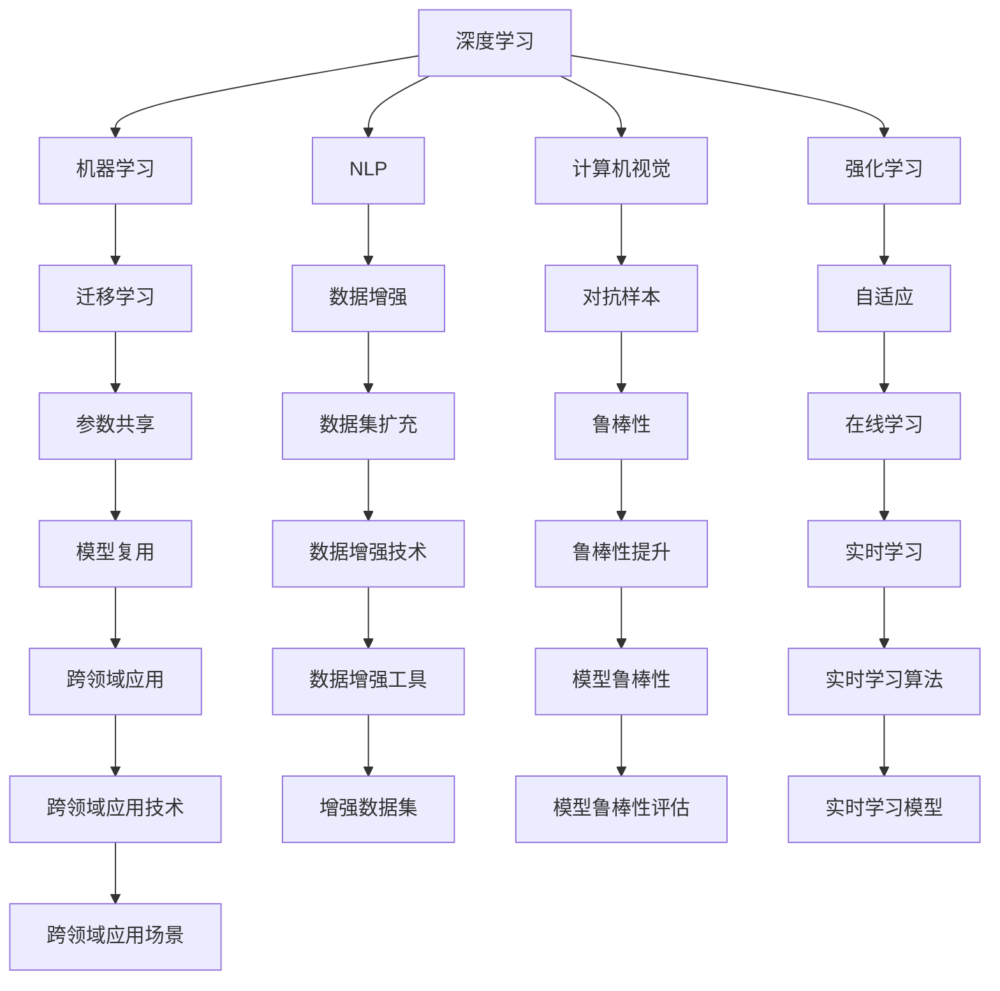

                 

## 1. 背景介绍

### 1.1 问题由来

近年来，随着人工智能技术的迅猛发展，特别是深度学习和大数据技术的突破，越来越多的初创企业投身于人工智能领域的探索与实践。这些AI创业公司凭借其灵活性和创新性，迅速在各个应用场景中取得了显著成果，但同时也面临着技术积累不足、业务落地难度大等诸多挑战。在技术层面上，如何构建一套高效、稳定、可扩展的AI技术体系，成为每个AI创业公司都必须考虑的问题。

### 1.2 问题核心关键点

AI创业公司的技术白皮书，即技术研发团队的“技术说明书”，是公司在技术架构、业务应用、发展路线等方面进行系统性阐述的文档。白皮书的撰写不仅需要涵盖技术原理和算法实现，还需要提供应用场景、工具和资源推荐、未来发展趋势及面临挑战等综合信息，从而为公司内部的技术团队以及外部的合作伙伴、投资者提供全面的技术参考和支持。

### 1.3 问题研究意义

技术白皮书不仅有助于公司的内部管理和发展决策，也是对外展示公司技术实力、获取认可和投资的重要工具。其研究和撰写过程，可以系统性地梳理和巩固公司现有技术积累，明确技术发展的方向和重点，同时也有助于在技术研究和应用中规避风险，抓住机遇。

## 2. 核心概念与联系

### 2.1 核心概念概述

在AI创业公司的技术白皮书中，涉及的核心概念主要包括：

- 深度学习（Deep Learning）：一种基于神经网络的技术，通过多层次的特征提取和信息传递，实现对复杂数据的高级建模和分析。
- 机器学习（Machine Learning）：让机器通过数据训练学习规律和模式，并基于此进行预测和决策。
- 自然语言处理（Natural Language Processing, NLP）：使计算机能够理解和处理人类语言的技术。
- 计算机视觉（Computer Vision）：使计算机能够“看”、“理解”和“处理”图像和视频内容的技术。
- 强化学习（Reinforcement Learning）：通过与环境的交互，让机器学习最优决策策略的技术。
- 迁移学习（Transfer Learning）：将在一个任务上学习到的知识迁移到另一个相关任务上，提升模型性能。
- 模型压缩（Model Compression）：通过模型剪枝、量化、蒸馏等技术减少模型参数量，提升计算效率。

这些核心概念共同构成了AI创业公司技术体系的骨架，相互之间通过数据、算法、架构等多个层面进行紧密联系。

### 2.2 核心概念原理和架构的 Mermaid 流程图



这个流程图展示了各个核心概念之间的联系，并通过箭头表示它们之间的数据流和算法交互。例如，深度学习是其他多种技术的基础，而迁移学习则是将深度学习的成果应用到其他任务中的关键技术。

## 3. 核心算法原理 & 具体操作步骤

### 3.1 算法原理概述

AI创业公司的技术白皮书需要详细阐述的算法原理包括但不限于：

- 神经网络（Neural Networks）：深度学习的核心算法之一，通过多层次的神经元组合，实现对复杂数据的高效建模。
- 卷积神经网络（Convolutional Neural Networks, CNNs）：特别适用于图像和视频处理，通过卷积层提取局部特征。
- 循环神经网络（Recurrent Neural Networks, RNNs）：适用于序列数据处理，如文本、语音和时间序列。
- 长短期记忆网络（Long Short-Term Memory, LSTM）：一种特殊的RNN，用于解决梯度消失问题。
- 生成对抗网络（Generative Adversarial Networks, GANs）：通过对抗训练，生成逼真图像和视频。
- 自编码器（Autoencoders）：用于数据压缩和降维，保留关键信息，去除噪声。

这些算法通过不同的神经网络结构和训练方法，实现了对不同类型数据的处理和建模。

### 3.2 算法步骤详解

以卷积神经网络（CNNs）为例，CNNs在图像分类任务中的具体步骤详解如下：

1. **数据预处理**：将图像数据进行归一化、缩放和增强，以便模型更好地学习。
2. **网络构建**：搭建卷积层、池化层、全连接层等组件，设置适当的卷积核大小、步幅和激活函数。
3. **损失函数**：选择适合分类任务的损失函数，如交叉熵损失。
4. **模型训练**：使用优化器（如Adam、SGD等）和梯度下降法最小化损失函数，更新模型参数。
5. **模型评估**：在验证集和测试集上评估模型性能，使用准确率、精确度、召回率等指标。
6. **模型优化**：通过调整超参数、正则化、数据增强等手段提升模型性能。
7. **模型应用**：将训练好的模型应用到新的图像数据上，进行分类预测。

### 3.3 算法优缺点

- **优点**：
  - 强大的表达能力：深度学习算法能够处理高度复杂的数据结构，并从中提取有用的特征。
  - 自适应能力：通过大量数据训练，模型能够自适应不同的数据分布。
  - 广泛应用：深度学习算法在图像、语音、文本等多个领域都有成功应用。

- **缺点**：
  - 计算资源消耗大：深度学习模型参数量庞大，训练和推理过程中需要大量的计算资源。
  - 模型复杂度高：深度学习模型的结构和训练过程复杂，难以解释和调试。
  - 数据依赖性强：模型的训练和性能依赖于高质量的标注数据，数据获取成本高。

### 3.4 算法应用领域

深度学习算法广泛应用于图像识别、语音识别、自然语言处理、推荐系统等多个领域，具体应用包括：

- **图像识别**：自动驾驶、医疗影像分析、工业缺陷检测。
- **语音识别**：智能客服、语音助手、语音翻译。
- **自然语言处理**：机器翻译、情感分析、智能问答系统。
- **推荐系统**：电商推荐、新闻推荐、广告推荐。

## 4. 数学模型和公式 & 详细讲解 & 举例说明

### 4.1 数学模型构建

以卷积神经网络为例，其数学模型构建如下：

- 输入层：$x \in \mathbb{R}^m$，其中$m$为输入数据维度。
- 卷积层：$h(x) = w * x + b$，其中$w$为卷积核，$b$为偏置项。
- 激活函数：$f(h) = \max(0, h)$，使用ReLU函数。
- 池化层：$g(f) = \max\limits_{i,j} f(i,j)$，使用最大池化。
- 全连接层：$y = \omega g + \beta$，其中$\omega$为权重，$\beta$为偏置项。

### 4.2 公式推导过程

卷积神经网络中，卷积操作的推导公式如下：

$$
h(x) = \sum_{i=0}^{k-1} \sum_{j=0}^{k-1} w_{ij} * x_{i,j}
$$

其中，$w_{ij}$为卷积核元素，$x_{i,j}$为输入数据元素。

### 4.3 案例分析与讲解

以LeNet-5网络为例，LeNet-5是一个经典的卷积神经网络，用于手写数字识别。网络结构包含两个卷积层、两个池化层、三个全连接层，以及一个输出层。在LeNet-5中，卷积层和池化层的输出被送入全连接层进行分类预测。

## 5. 项目实践：代码实例和详细解释说明

### 5.1 开发环境搭建

搭建一个用于图像分类的深度学习项目，需要进行以下步骤：

1. **安装环境**：使用Anaconda或Miniconda安装Python及其相关库，如NumPy、Pandas、Matplotlib等。
2. **配置GPU**：确保有足够的GPU资源，可以使用Docker或云服务，如AWS、Google Cloud等。
3. **环境验证**：安装深度学习框架（如TensorFlow、PyTorch等），并运行一个简单的测试代码，确保环境配置正确。

### 5.2 源代码详细实现

以下是一个使用PyTorch框架实现卷积神经网络的示例代码：

```python
import torch
import torch.nn as nn
import torch.optim as optim

# 定义卷积神经网络模型
class CNN(nn.Module):
    def __init__(self):
        super(CNN, self).__init__()
        self.conv1 = nn.Conv2d(1, 32, 3, 1)
        self.pool = nn.MaxPool2d(2, 2)
        self.conv2 = nn.Conv2d(32, 64, 3, 1)
        self.fc1 = nn.Linear(64 * 4 * 4, 120)
        self.fc2 = nn.Linear(120, 84)
        self.fc3 = nn.Linear(84, 10)

    def forward(self, x):
        x = self.pool(torch.relu(self.conv1(x)))
        x = self.pool(torch.relu(self.conv2(x)))
        x = x.view(-1, 64 * 4 * 4)
        x = torch.relu(self.fc1(x))
        x = torch.relu(self.fc2(x))
        x = self.fc3(x)
        return x

# 加载数据集
train_loader = torch.utils.data.DataLoader(
    torchvision.datasets.MNIST(root='./data', train=True, download=True,
                               transform=torchvision.transforms.ToTensor()),
    batch_size=64, shuffle=True)

# 训练模型
model = CNN()
criterion = nn.CrossEntropyLoss()
optimizer = optim.SGD(model.parameters(), lr=0.001, momentum=0.9)
for epoch in range(10):
    running_loss = 0.0
    for i, data in enumerate(train_loader, 0):
        inputs, labels = data
        optimizer.zero_grad()
        outputs = model(inputs)
        loss = criterion(outputs, labels)
        loss.backward()
        optimizer.step()
        running_loss += loss.item()
    print(f"Epoch {epoch+1}, loss: {running_loss/len(train_loader)}")
```

### 5.3 代码解读与分析

- **模型定义**：首先定义了一个名为`CNN`的卷积神经网络模型，包含两个卷积层、两个池化层和三个全连接层。
- **数据加载**：使用`torchvision`库加载MNIST数据集，进行归一化和批处理。
- **模型训练**：设置损失函数和优化器，进行前向传播和反向传播，更新模型参数。
- **结果展示**：在每个epoch后输出训练损失。

## 6. 实际应用场景

### 6.1 智能客服系统

智能客服系统能够通过自然语言处理技术，自动处理客户咨询，提升服务效率和客户满意度。其具体应用场景包括：

- **自动答复**：通过训练一个预训练语言模型，能够自动理解客户问题，并给出合适的回复。
- **情感分析**：对客户反馈进行情感分析，及时发现和解决客户的不满情绪。
- **多渠道支持**：支持电话、邮件、社交媒体等多种客户接触渠道，实现全渠道智能客服。

### 6.2 金融风险管理

金融行业面临大量的交易数据和风险预警需求，通过机器学习算法，能够实时监控市场动态，预测金融风险。其具体应用场景包括：

- **信用评分**：通过分析客户的历史交易记录，构建信用评分模型，评估客户信用风险。
- **欺诈检测**：使用异常检测算法，识别潜在的欺诈行为，保护金融机构利益。
- **投资组合优化**：通过构建优化模型，自动调整投资组合，提升资产回报率。

### 6.3 医疗影像诊断

医疗影像分析是AI在医疗领域的重要应用之一，能够帮助医生快速准确地诊断疾病。其具体应用场景包括：

- **图像分类**：自动将X光片、CT扫描等影像数据分类，判断是否存在异常。
- **定位病变**：通过深度学习算法，精确定位病灶的位置和大小。
- **辅助诊断**：结合临床数据，辅助医生进行疾病诊断和治疗方案制定。

### 6.4 未来应用展望

随着AI技术的发展，未来AI创业公司将面临更多新的应用场景和挑战。主要发展方向包括：

- **跨领域融合**：将AI技术与更多行业领域进行融合，如教育、交通、物流等。
- **联邦学习**：在分布式环境中进行模型训练，保护数据隐私的同时提升模型性能。
- **边缘计算**：将AI模型部署在边缘设备上，实现实时计算和决策。
- **自适应学习**：开发能够根据环境变化自动调整学习策略的智能系统。

## 7. 工具和资源推荐

### 7.1 学习资源推荐

- **《深度学习》教材**：Ian Goodfellow等著，系统介绍了深度学习的基本概念、算法和应用。
- **Coursera《深度学习专项课程》**：由斯坦福大学教授Andrew Ng主讲，涵盖深度学习的各个方面。
- **Hugging Face官方文档**：提供丰富的预训练模型和教程，是学习和使用深度学习的重要资源。
- **GitHub**：存储了大量开源项目和代码库，是学习和交流深度学习的宝贵平台。

### 7.2 开发工具推荐

- **PyTorch**：深度学习框架，支持动态计算图，易于调试和优化。
- **TensorFlow**：深度学习框架，支持分布式计算，适用于大规模训练。
- **Keras**：高层次深度学习框架，易于上手，适合快速原型开发。
- **Jupyter Notebook**：交互式编程环境，支持代码编写、数据可视化和结果展示。

### 7.3 相关论文推荐

- **《ImageNet Classification with Deep Convolutional Neural Networks》**：Alex Krizhevsky等著，提出卷积神经网络，并应用于图像分类任务。
- **《Playing Atari with Deep Reinforcement Learning》**：Volodymyr Mnih等著，使用深度强化学习算法玩Atari游戏，取得出色结果。
- **《Attention is All You Need》**：Ashish Vaswani等著，提出Transformer架构，应用于自然语言处理任务。

## 8. 总结：未来发展趋势与挑战

### 8.1 研究成果总结

AI创业公司技术白皮书的撰写，不仅体现了公司技术研发团队的实力，也反映了行业发展的趋势和挑战。通过系统的技术梳理和实践总结，有助于公司内部的技术传承和外部合作伙伴的信任建立。

### 8.2 未来发展趋势

未来AI创业公司将面临更加复杂多变的技术环境和应用需求。主要发展趋势包括：

- **深度学习算法优化**：提升算法的效率和可解释性，降低计算资源消耗。
- **跨领域应用扩展**：将AI技术应用到更多领域，实现多行业协同创新。
- **数据隐私保护**：在数据处理和模型训练过程中，保护用户隐私和数据安全。
- **边缘计算和联邦学习**：适应分布式计算和边缘部署，提升系统的实时性和灵活性。

### 8.3 面临的挑战

尽管AI技术取得了显著进展，但在实际应用中仍面临诸多挑战：

- **数据获取和标注成本高**：高质量的标注数据获取困难，标注成本高昂。
- **模型复杂度高**：深度学习模型结构复杂，难以调试和解释。
- **鲁棒性和泛化性不足**：模型在面对未知数据时，泛化性能不足，容易产生错误。
- **计算资源需求大**：模型训练和推理需要大量计算资源，成本较高。

### 8.4 研究展望

未来AI技术的研究方向将更加多样和深入。主要研究展望包括：

- **小样本学习**：在数据量有限的情况下，通过迁移学习和自监督学习提升模型性能。
- **可解释性增强**：开发具有更好可解释性的模型，帮助用户理解和信任AI系统的决策。
- **跨模态学习**：将视觉、语音、文本等多种模态数据进行联合建模，提升系统的整体表现。
- **联邦学习和隐私保护**：在分布式环境中进行模型训练，保护数据隐私的同时提升性能。

## 9. 附录：常见问题与解答

**Q1：AI创业公司如何选择适合的技术框架？**

A: AI创业公司在选择技术框架时，应综合考虑以下因素：

- **性能和稳定性**：选择稳定性和性能均优的技术框架，如TensorFlow、PyTorch等。
- **社区和生态**：选择具有活跃社区和丰富资源的技术框架，便于技术支持和资源获取。
- **易用性和扩展性**：选择易于上手和使用，同时支持未来扩展的技术框架。

**Q2：如何提升模型的泛化性能？**

A: 提升模型泛化性能，可以从以下几个方面入手：

- **数据增强**：通过对训练数据进行扩充和变换，提升模型的鲁棒性。
- **正则化**：使用L2正则、Dropout等技术，防止过拟合。
- **迁移学习**：通过在多个任务上进行微调，提升模型在未知数据上的泛化能力。
- **对抗训练**：通过引入对抗样本，提升模型对噪声和干扰的鲁棒性。

**Q3：AI创业公司如何进行技术预研？**

A: 技术预研是AI创业公司技术创新和发展的基础。具体步骤包括：

- **文献调研**：通过阅读最新的研究论文和会议报告，了解最新的技术进展和趋势。
- **原型验证**：构建小规模的原型系统，验证技术可行性和效果。
- **团队培养**：建立跨学科团队，提升技术研发能力和创新能力。
- **市场调研**：分析市场需求和技术瓶颈，制定技术路线图。

---

作者：禅与计算机程序设计艺术 / Zen and the Art of Computer Programming

