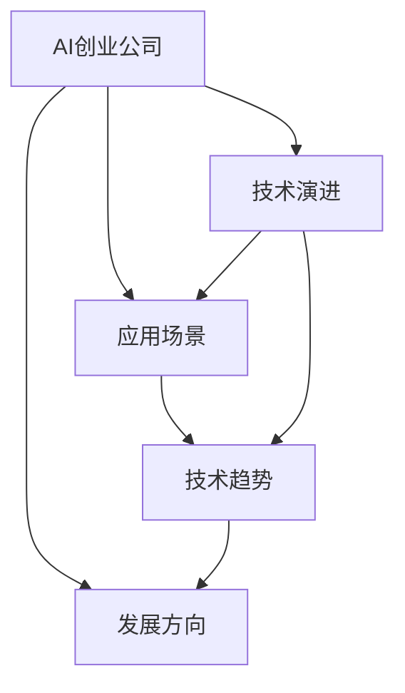

                 

# AI创业公司的技术趋势研究：技术演进、应用场景与发展方向

> 关键词：AI创业公司,技术演进,应用场景,发展方向,技术趋势,机器学习,深度学习,自然语言处理,NLP,计算机视觉,CV,推荐系统,数据挖掘,创业技术

## 1. 背景介绍

在当今数字化时代，AI创业公司的兴起不仅推动了技术进步，还为各行各业带来了深远影响。这些公司通过研发和应用前沿技术，不仅实现了自身的商业成功，也为社会经济发展注入了新的活力。本文旨在深入研究AI创业公司的技术趋势，探讨其演进路径、应用场景及未来发展方向，为AI创业者提供有价值的洞察。

### 1.1 研究背景

过去十年，AI技术的飞速发展推动了许多创新企业的诞生。从早期的深度学习、计算机视觉到如今自然语言处理(NLP)、推荐系统等领域的突破，AI创业公司不断推陈出新，引领行业变革。这些公司的成功经验和技术积累，为后续企业提供了宝贵的参考。

### 1.2 研究目的

本文将深入探讨AI创业公司的技术演进、应用场景及发展方向，重点关注机器学习、深度学习、自然语言处理、计算机视觉等核心技术，以及这些技术在不同领域的应用。通过分析前沿案例，本文旨在为AI创业者提供全面的技术趋势分析，助力他们把握未来发展机遇。

## 2. 核心概念与联系

### 2.1 核心概念概述

为更好地理解AI创业公司的技术趋势，本节将介绍几个关键概念：

- **AI创业公司**：专注于研发和应用AI技术的创业企业，涉及机器学习、深度学习、计算机视觉、自然语言处理等诸多领域。
- **技术演进**：指AI技术从基础研究到商业应用的演化过程，包括算法、模型、架构、工具等方面的进步。
- **应用场景**：指AI技术在不同行业中的实际应用，如智能客服、金融风控、医疗诊断等。
- **发展方向**：指AI技术的未来趋势，包括技术创新、应用拓展、市场需求等方面的预期。
- **技术趋势**：指AI技术发展的总体方向和重点领域，如强化学习、生成对抗网络、自监督学习等。
- **机器学习**：通过数据训练模型，使其具备预测和决策能力。
- **深度学习**：基于神经网络，通过多层次的特征提取和抽象，实现复杂的模式识别和分类。
- **自然语言处理(NLP)**：使计算机理解和处理人类语言的技术，包括文本分析、语音识别等。
- **计算机视觉(CV)**：使计算机能够识别和理解图像、视频中的对象和场景。
- **推荐系统**：通过分析用户行为和偏好，推荐个性化内容或产品。
- **数据挖掘**：从大数据中提取有价值的信息，用于决策支持和业务优化。

这些概念之间的逻辑关系可以通过以下Mermaid流程图来展示：



这个流程图展示了AI创业公司的技术演进、应用场景、技术趋势和发展方向之间的内在联系。

## 3. 核心算法原理 & 具体操作步骤
### 3.1 算法原理概述

AI创业公司的核心算法原理主要围绕机器学习、深度学习和自然语言处理展开。以下将详细介绍这些核心技术的原理：

- **机器学习**：通过数据训练模型，使其具备预测和决策能力。算法包括监督学习、无监督学习和半监督学习等。
- **深度学习**：基于神经网络，通过多层次的特征提取和抽象，实现复杂的模式识别和分类。常用的模型包括卷积神经网络(CNN)、循环神经网络(RNN)和变分自编码器(VAE)等。
- **自然语言处理(NLP)**：使计算机理解和处理人类语言的技术，包括文本分析、语音识别等。NLP的核心算法包括词向量表示、注意力机制、Transformer架构等。

### 3.2 算法步骤详解

AI创业公司常用的算法步骤包括以下几个关键环节：

1. **数据收集与预处理**：收集和清洗用于模型训练的数据集，包括文本、图像、视频等。
2. **模型设计**：选择合适的算法和模型架构，如CNN、RNN、Transformer等。
3. **模型训练**：使用训练数据集训练模型，通过反向传播算法优化模型参数。
4. **模型评估**：在验证集和测试集上评估模型性能，选择合适的超参数和优化策略。
5. **模型应用**：将训练好的模型应用于实际业务场景，进行预测、分类、生成等任务。

### 3.3 算法优缺点

AI创业公司的核心算法具有以下优点：

- **高效性**：通过大规模数据训练，模型能够在短时间内完成复杂的任务。
- **泛化能力**：深度学习模型能够处理复杂的非线性关系，适用于多种应用场景。
- **创新性**：机器学习和深度学习为AI创业公司提供了广阔的创新空间，推动技术进步。

同时，这些算法也存在一些缺点：

- **高计算成本**：深度学习模型通常需要大量计算资源，包括GPU、TPU等高性能设备。
- **数据依赖性强**：模型的训练和性能高度依赖于数据的质量和数量。
- **模型复杂度**：复杂的模型结构可能导致过拟合，需要优化和调整。

### 3.4 算法应用领域

AI创业公司的核心算法在多个领域中得到了广泛应用，包括但不限于以下几个方面：

- **金融风控**：通过分析交易数据和客户行为，预测风险，提升风控效果。
- **智能客服**：使用自然语言处理技术，实现自动客服和智能对话，提升用户体验。
- **医疗诊断**：利用图像和文本数据，辅助医生进行疾病诊断和治疗。
- **推荐系统**：分析用户行为数据，推荐个性化内容和产品，提升用户满意度。
- **自动驾驶**：通过计算机视觉和深度学习，实现车辆自动驾驶和环境感知。
- **智慧城市**：通过数据分析和预测，优化城市交通、环境治理等。

## 4. 数学模型和公式 & 详细讲解  
### 4.1 数学模型构建

本节将使用数学语言对AI创业公司的核心算法进行严格描述。

- **机器学习模型**：
  - 监督学习：假设已知标签数据 $(x_i, y_i)$，目标是通过训练数据学习函数 $f$，使得 $f(x_i) = y_i$。
  - 无监督学习：假设无标签数据 $x_i$，目标是通过聚类、降维等技术，发现数据的内在结构。
  
- **深度学习模型**：
  - 卷积神经网络：定义卷积核 $w$，输入 $x$，通过卷积操作 $y = \sigma(w*x)$ 实现特征提取。
  - 循环神经网络：通过隐状态 $h_t$，实现序列数据的建模，如 $h_{t+1} = \sigma(w*h_t + u*x_t)$。
  - 变分自编码器：通过编码器 $z = w*x$ 和解码器 $x' = v*z$，实现数据的压缩和重构。

### 4.2 公式推导过程

以下以卷积神经网络为例，推导其核心公式：

- **卷积层**：
  - 定义卷积核 $w_{ij}$，输入 $x_{mn}$，卷积操作 $y_{mn} = \sum_{i,j}w_{ij}*x_{m-n+i,n-j}$
  - 利用激活函数 $\sigma$，得到输出 $y = \sigma(W*x)$

### 4.3 案例分析与讲解

**案例1：图像分类**
- 使用卷积神经网络对图像进行分类，如CIFAR-10数据集。训练数据集分为训练集和验证集，通过反向传播算法优化模型参数，最终在测试集上评估模型性能。

**案例2：机器翻译**
- 使用Transformer模型进行机器翻译任务。输入为源语言文本，输出为目标语言文本。通过自监督学习任务对模型进行预训练，然后在监督数据上进行微调，最终实现高质量的翻译效果。

## 5. 项目实践：代码实例和详细解释说明
### 5.1 开发环境搭建

在AI创业公司的技术实践中，开发环境搭建是基础环节。以下是使用Python进行TensorFlow开发的详细步骤：

1. 安装Anaconda：从官网下载并安装Anaconda，用于创建独立的Python环境。
2. 创建并激活虚拟环境：
```bash
conda create -n tensorflow-env python=3.8 
conda activate tensorflow-env
```

3. 安装TensorFlow：根据CUDA版本，从官网获取对应的安装命令。例如：
```bash
conda install tensorflow -c tf -c conda-forge
```

4. 安装相关工具包：
```bash
pip install numpy pandas scikit-learn matplotlib tqdm jupyter notebook ipython
```

5. 安装TensorBoard：TensorFlow配套的可视化工具，实时监测模型训练状态，提供丰富的图表呈现方式。

```bash
pip install tensorboard
```

完成上述步骤后，即可在`tensorflow-env`环境中开始项目实践。

### 5.2 源代码详细实现

下面我们以图像分类任务为例，给出使用TensorFlow进行卷积神经网络开发的PyTorch代码实现。

```python
import tensorflow as tf
from tensorflow.keras import layers, models

# 定义卷积神经网络模型
model = models.Sequential()
model.add(layers.Conv2D(32, (3, 3), activation='relu', input_shape=(32, 32, 3)))
model.add(layers.MaxPooling2D((2, 2)))
model.add(layers.Conv2D(64, (3, 3), activation='relu'))
model.add(layers.MaxPooling2D((2, 2)))
model.add(layers.Conv2D(64, (3, 3), activation='relu'))
model.add(layers.Flatten())
model.add(layers.Dense(64, activation='relu'))
model.add(layers.Dense(10))

# 编译模型
model.compile(optimizer='adam',
              loss=tf.keras.losses.SparseCategoricalCrossentropy(from_logits=True),
              metrics=['accuracy'])

# 训练模型
model.fit(train_images, train_labels, epochs=10, validation_data=(test_images, test_labels))
```

以上代码展示了使用TensorFlow进行卷积神经网络训练的完整流程。可以看到，通过Keras API，模型的定义和训练过程变得非常简单。

### 5.3 代码解读与分析

让我们再详细解读一下关键代码的实现细节：

- **Sequential模型**：使用Keras的Sequential模型，按照顺序添加卷积层、池化层和全连接层，构建基本的卷积神经网络。
- **Conv2D层**：定义卷积层，使用3x3的卷积核，输出32或64个特征图。
- **MaxPooling2D层**：使用2x2的最大池化，缩小特征图的尺寸。
- **Flatten层**：将特征图展平，输入到全连接层。
- **Dense层**：定义全连接层，实现分类任务的预测。
- **compile方法**：定义模型的优化器、损失函数和评估指标，进行模型的编译。
- **fit方法**：使用训练集进行模型训练，并在验证集上进行性能评估。

### 5.4 运行结果展示

在完成模型训练后，可以通过TensorBoard查看训练过程中的各项指标，包括损失函数和准确率的变化曲线。

```python
from tensorflow.keras.callbacks import TensorBoard

# 定义TensorBoard回调函数
tb_callback = TensorBoard(log_dir='logs', histogram_freq=1)

# 训练模型，并记录TensorBoard日志
model.fit(train_images, train_labels, epochs=10, validation_data=(test_images, test_labels), callbacks=[tb_callback])
```

执行上述代码后，TensorBoard会在`logs`目录下生成可视化的训练日志，包含模型参数、损失函数和准确率的变化曲线，便于我们进行模型调优和分析。

## 6. 实际应用场景
### 6.1 智能客服系统

基于卷积神经网络(CNN)的图像分类技术，可以应用于智能客服系统的图像识别场景。传统客服系统往往需要人工处理图像，难以应对复杂多变的图像背景和质量问题。通过训练卷积神经网络，智能客服系统可以自动识别图像内容，快速响应客户咨询，提升客服效率和质量。

在技术实现上，可以收集客户上传的图像数据，标注出客户意图（如咨询、投诉、反馈等），在此基础上对预训练模型进行微调。微调后的模型能够自动理解图像内容，匹配最合适的客服策略，实现自动客服和智能对话。

### 6.2 金融风控

卷积神经网络在金融风控中的应用主要集中在图像识别和模式识别上。通过分析交易记录、财务报表等图像数据，识别异常交易、欺诈行为等风险因素。例如，对信用卡交易记录进行图像处理，提取卡号、交易金额等关键信息，并通过卷积神经网络进行模式识别，提高风险预警的准确性和及时性。

### 6.3 医疗诊断

卷积神经网络在医疗诊断中主要应用于图像识别和病理学分析。通过训练模型，自动识别X光片、CT图像中的病变区域，辅助医生进行疾病诊断。例如，使用卷积神经网络对乳腺癌图像进行分类，自动识别癌灶位置和大小，提升诊断效率和准确性。

### 6.4 未来应用展望

随着卷积神经网络等技术的不断进步，其在AI创业公司中的应用前景更加广阔。未来，我们可以预见以下应用趋势：

- **多模态融合**：将卷积神经网络与其他技术（如自然语言处理、时间序列分析等）进行融合，实现更全面的数据分析和处理。
- **边缘计算**：在物联网设备中应用卷积神经网络，实现实时图像处理和边缘计算，提高数据处理效率。
- **联邦学习**：通过联邦学习技术，在多设备间共享模型参数，提升模型泛化能力和隐私保护。
- **自监督学习**：利用无监督学习技术，从大量未标注数据中提取有价值的信息，提高模型的自适应能力。

## 7. 工具和资源推荐
### 7.1 学习资源推荐

为了帮助AI创业者系统掌握卷积神经网络等核心技术，这里推荐一些优质的学习资源：

1. 《深度学习》书籍：Ian Goodfellow等人所著，深入浅出地介绍了深度学习的理论基础和实践应用。
2. Coursera《深度学习专项课程》：由斯坦福大学Andrew Ng教授主讲，涵盖深度学习的基本概念和经典模型。
3. TensorFlow官方文档：详细介绍了TensorFlow的API和使用方法，提供丰富的示例和教程。
4. Kaggle数据科学竞赛：通过参加数据竞赛，提升数据处理和模型调优能力。
5. Arxiv论文库：访问最新的人工智能研究成果，了解前沿技术进展。

通过这些资源的学习实践，相信你一定能够快速掌握卷积神经网络等核心技术，并应用于实际项目中。

### 7.2 开发工具推荐

高效的开发离不开优秀的工具支持。以下是几款用于卷积神经网络开发的工具：

1. TensorFlow：基于Google的深度学习框架，生产部署方便，适合大规模工程应用。
2. PyTorch：基于Python的开源深度学习框架，灵活动态的计算图，适合快速迭代研究。
3. Keras：基于TensorFlow的高级API，简化模型定义和训练过程，适合初学者和快速原型设计。
4. Weights & Biases：模型训练的实验跟踪工具，可以记录和可视化模型训练过程中的各项指标，方便对比和调优。
5. TensorBoard：TensorFlow配套的可视化工具，可实时监测模型训练状态，并提供丰富的图表呈现方式。

合理利用这些工具，可以显著提升卷积神经网络等核心技术的开发效率，加快创新迭代的步伐。

### 7.3 相关论文推荐

卷积神经网络在AI创业公司中的应用研究，需要基于大量的理论和实践成果。以下是几篇奠基性的相关论文，推荐阅读：

1. AlexNet: ImageNet Classification with Deep Convolutional Neural Networks：提出卷积神经网络，刷新了ImageNet图像识别任务的成绩。
2. Inception: GoogLeNet Architectures for Large-Scale Image Recognition：提出Inception模块，提高了卷积神经网络的特征提取能力。
3. ResNet: Deep Residual Learning for Image Recognition：提出残差网络，解决了深度卷积神经网络的训练问题。
4. DenseNet: Dense Convolutional Networks：提出密集连接网络，提升了特征的传递和利用效率。
5. EfficientNet: Rethinking Model Scaling for Convolutional Neural Networks：提出EfficientNet架构，实现了参数和计算效率的优化。

这些论文代表了卷积神经网络的发展脉络，通过学习这些前沿成果，可以帮助研究者把握学科前进方向，激发更多的创新灵感。

## 8. 总结：未来发展趋势与挑战
### 8.1 总结

本文对AI创业公司的卷积神经网络技术趋势进行了全面系统的介绍。首先阐述了卷积神经网络的发展历程和核心原理，明确了其在图像识别、智能客服、金融风控等领域的广泛应用。其次，通过具体案例和代码实现，展示了卷积神经网络的开发流程和技术细节。同时，本文还探讨了卷积神经网络在智能城市、推荐系统、医疗诊断等更多领域的应用前景。

通过本文的系统梳理，可以看到，卷积神经网络技术在AI创业公司中的应用前景广阔，不仅能提升系统性能，还能推动产业数字化升级。未来，随着技术的不断进步，卷积神经网络将为AI创业者提供更多创新空间和商业机遇。

### 8.2 未来发展趋势

展望未来，卷积神经网络技术将呈现以下几个发展趋势：

1. **多模态融合**：将卷积神经网络与其他技术（如自然语言处理、时间序列分析等）进行融合，实现更全面的数据分析和处理。
2. **边缘计算**：在物联网设备中应用卷积神经网络，实现实时图像处理和边缘计算，提高数据处理效率。
3. **联邦学习**：通过联邦学习技术，在多设备间共享模型参数，提升模型泛化能力和隐私保护。
4. **自监督学习**：利用无监督学习技术，从大量未标注数据中提取有价值的信息，提高模型的自适应能力。
5. **可解释性增强**：开发可解释性更强的卷积神经网络模型，提高模型决策的透明性和可信度。

### 8.3 面临的挑战

尽管卷积神经网络技术已经取得了瞩目成就，但在迈向更加智能化、普适化应用的过程中，仍面临诸多挑战：

1. **数据质量问题**：高质量标注数据获取成本高，数据质量和多样性不足可能导致模型性能下降。
2. **计算资源瓶颈**：大规模卷积神经网络模型需要高性能设备支持，计算资源消耗大，部署成本高。
3. **模型过拟合**：复杂模型容易过拟合，泛化能力不足，需要在模型设计上进行优化。
4. **应用场景局限**：卷积神经网络主要应用于视觉和图像领域，在其他领域应用有限，需要更多的研究和突破。
5. **伦理和隐私问题**：大规模数据处理和模型应用可能带来隐私泄露和伦理问题，需要加强监管和保护。

### 8.4 研究展望

面对卷积神经网络技术所面临的挑战，未来的研究需要在以下几个方面寻求新的突破：

1. **数据增强技术**：开发更有效的数据增强方法，提升数据多样性和质量。
2. **模型压缩技术**：利用模型压缩、稀疏化等技术，减少计算资源消耗，提高模型效率。
3. **自适应学习算法**：开发自适应学习算法，提升模型泛化能力和自适应能力。
4. **跨领域应用研究**：探索卷积神经网络在其他领域（如自然语言处理、语音识别等）的应用，推动多模态融合。
5. **伦理和隐私保护**：加强模型伦理和隐私保护研究，建立数据使用和分享的规范体系。

这些研究方向将推动卷积神经网络技术的发展，为AI创业者提供更多创新空间和商业机遇。

## 9. 附录：常见问题与解答

**Q1：卷积神经网络在卷积核大小的选择上有什么建议？**

A: 卷积神经网络中，卷积核大小的选择取决于具体任务和数据特征。一般来说，较小的卷积核（如3x3）可以捕捉更细粒度的特征，适用于细节丰富的图像；较大的卷积核（如5x5或7x7）可以提取更宏观的特征，适用于全局的图像识别。实际应用中，通常需要根据任务需求进行多次实验，选择最优的卷积核大小。

**Q2：卷积神经网络在训练过程中如何防止过拟合？**

A: 卷积神经网络在训练过程中，可以采用以下几种方法防止过拟合：
1. 数据增强：通过图像旋转、平移、缩放等变换，扩充训练数据集，提升模型的泛化能力。
2. 正则化：使用L2正则化、Dropout等方法，抑制模型复杂度，防止过拟合。
3. 早停法：在验证集上监测模型性能，一旦性能不再提升，及时停止训练。
4. 模型集成：训练多个模型，取平均输出，减少模型的方差，提高泛化性能。

**Q3：卷积神经网络在实际应用中如何优化计算效率？**

A: 卷积神经网络在实际应用中，可以采用以下几种方法优化计算效率：
1. 卷积核共享：通过共享卷积核，减少模型参数量，提高计算效率。
2. 批量处理：在训练过程中，使用批量数据进行前向和反向传播，减少计算时间。
3. 模型剪枝：通过剪枝技术，去除冗余参数和网络结构，提高计算速度和资源利用率。
4. 量化压缩：将浮点模型转为定点模型，减少内存消耗和计算时间。

**Q4：卷积神经网络在推荐系统中的应用场景有哪些？**

A: 卷积神经网络在推荐系统中的应用场景包括：
1. 商品推荐：通过分析用户浏览历史和购买记录，生成个性化推荐列表。
2. 内容推荐：根据用户的历史阅读和观看记录，推荐相似的文章、视频和音乐。
3. 社交网络推荐：基于用户社交关系和兴趣，推荐相关的朋友和内容。
4. 多模态推荐：结合文本、图像、视频等多种模态数据，提升推荐效果。

这些应用场景展示了卷积神经网络在推荐系统中的广泛应用，未来还有更多创新和突破。

**Q5：卷积神经网络在金融风控中的应用有哪些？**

A: 卷积神经网络在金融风控中的应用包括：
1. 交易欺诈检测：通过分析交易记录，检测异常交易行为，防范金融欺诈。
2. 信用评分：分析客户的信用记录和行为数据，预测其信用风险，提升信用评估的准确性。
3. 风险预警：通过分析财务报表和市场数据，识别潜在风险，提前预警。
4. 反洗钱检测：分析交易记录，识别洗钱行为，提升反洗钱能力。

卷积神经网络在金融风控中的应用具有重要的实际意义，未来将有更多创新和突破。

---

作者：禅与计算机程序设计艺术 / Zen and the Art of Computer Programming

