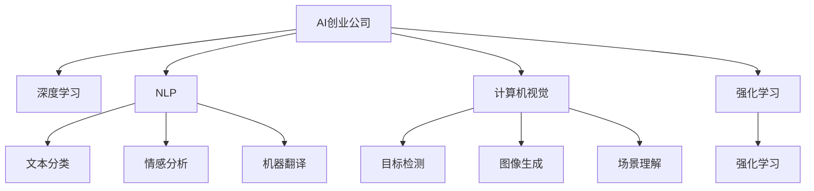

                 

# AI创业公司的未来发展

## 1. 背景介绍

### 1.1 问题由来

近年来，随着人工智能技术的不断成熟和应用，越来越多的AI创业公司崭露头角。这些公司聚焦于各类NLP、计算机视觉、强化学习等前沿技术，在金融、医疗、教育、零售等多个领域落地应用，取得了令人瞩目的成绩。然而，AI创业公司也面临诸多挑战，如技术创新难度大、市场竞争激烈、商业化难等。因此，如何把握未来AI创业公司的发展趋势，制定切实可行的发展策略，成为当前重要的研究方向。

### 1.2 问题核心关键点

AI创业公司未来发展的核心关键点包括：

- 技术趋势：未来AI技术将呈现哪些新方向、新突破？
- 应用场景：AI技术在哪些行业、领域有广阔应用前景？
- 市场竞争：AI创业公司如何应对激烈的市场竞争，获取更多市场份额？
- 商业模式：AI公司如何构建更加灵活、高效的商业模式？
- 人才管理：AI公司如何吸引和培养优秀人才，保持创新活力？
- 可持续发展：AI公司如何实现长期可持续增长，避免昙花一现？

通过系统梳理以上关键点，将有助于对AI创业公司的未来发展进行全面分析。

## 2. 核心概念与联系

### 2.1 核心概念概述

为更好地理解AI创业公司的未来发展，本节将介绍几个密切相关的核心概念：

- **AI创业公司**：专注于人工智能技术的研发和应用的创业公司，致力于解决实际问题和提高效率。
- **深度学习**：一类基于神经网络的机器学习技术，通过多层非线性变换学习数据的内在表示。
- **自然语言处理**(NLP)：使计算机能够理解和生成人类语言的技术，涉及文本分类、情感分析、机器翻译等任务。
- **计算机视觉**：使计算机能够理解和分析图像和视频数据的高级技术，涉及目标检测、图像生成、场景理解等任务。
- **强化学习**：通过智能体与环境的交互，学习最优决策策略的机器学习方法，广泛应用于游戏、机器人等场景。
- **迁移学习**：将一个领域学习到的知识迁移到另一个相关领域，提高模型在新领域的泛化能力。
- **泛化能力**：模型在未见过的新数据上表现出良好性能的能力，是衡量模型性能的重要指标。
- **可解释性**：模型能够提供清晰、易于理解的推理过程和决策依据。
- **可扩展性**：模型能够方便地增加新任务、新数据，避免重复开发和维护。

这些核心概念之间的逻辑关系可以通过以下Mermaid流程图来展示：



这个流程图展示了大语言模型的核心概念及其之间的关系：

1. AI创业公司运用深度学习、NLP、计算机视觉、强化学习等技术，解决各类问题。
2. NLP技术包括文本分类、情感分析、机器翻译等任务，支持文本数据的处理。
3. 计算机视觉技术包括目标检测、图像生成、场景理解等任务，支持图像和视频数据的处理。
4. 强化学习技术适用于游戏、机器人等场景，支持智能体的学习和决策。

## 3. 核心算法原理 & 具体操作步骤
### 3.1 算法原理概述

AI创业公司的核心算法原理，主要包括深度学习、迁移学习、可解释性和可扩展性等。

深度学习通过多层非线性变换学习数据的内在表示，适用于处理复杂数据和非线性关系。迁移学习通过将一个领域学习到的知识迁移到另一个相关领域，提高模型在新领域的泛化能力。可解释性使模型能够提供清晰、易于理解的推理过程和决策依据，支持对模型的调试和优化。可扩展性使模型能够方便地增加新任务、新数据，避免重复开发和维护。

### 3.2 算法步骤详解

AI创业公司未来发展的关键步骤包括：

1. **技术研发**：选择适合的技术方向，投入研发力量，开发核心技术。
2. **市场定位**：明确目标市场和客户群体，制定市场推广策略。
3. **产品开发**：基于核心技术开发实际应用产品，满足市场需求。
4. **市场推广**：通过线上线下渠道，广泛宣传推广，扩大市场份额。
5. **持续创新**：不断引入新技术和新应用场景，保持市场竞争力。
6. **商业化落地**：将技术产品转化为实际业务，实现商业价值。

### 3.3 算法优缺点

AI创业公司未来发展的主要优点包括：

- **技术前沿**：AI公司通常聚焦于深度学习、NLP等前沿技术，具备较强的技术创新能力。
- **市场空间**：AI技术在金融、医疗、教育等领域的广泛应用，提供了广阔的市场空间。
- **行业应用**：AI技术能够在多个行业落地应用，具有较强的适用性和普适性。

同时，AI创业公司也面临以下挑战：

- **技术难度大**：深度学习、NLP等技术门槛高，需要持续投入研发资源。
- **竞争激烈**：市场竞争激烈，小公司难以对抗大公司的资源和技术优势。
- **商业化难**：从技术到产品，再到商业化落地，过程中存在诸多挑战和风险。
- **人才紧缺**：优秀人才稀缺，需要付出高昂成本吸引和培养。

### 3.4 算法应用领域

AI创业公司在未来发展中，将在以下几个领域具有广阔应用前景：

- **医疗健康**：AI技术可以用于医疗影像分析、诊断辅助、个性化治疗等，提升医疗服务水平。
- **金融科技**：AI技术可以用于风险控制、欺诈检测、客户服务优化等，提升金融服务效率。
- **教育培训**：AI技术可以用于智能辅导、学习分析、知识图谱等，提升教育质量。
- **智能制造**：AI技术可以用于智能生产、质量检测、供应链优化等，提升制造业效率。
- **智能交通**：AI技术可以用于智能导航、自动驾驶、车联网等，提升交通出行体验。
- **智慧城市**：AI技术可以用于城市管理、公共安全、能源优化等，提升城市治理水平。

## 4. 数学模型和公式 & 详细讲解  
### 4.1 数学模型构建

AI创业公司的核心技术，通常基于深度学习框架，利用数学模型进行训练和推理。

以NLP中的文本分类任务为例，我们定义输入为文本$x$，输出为类别$y$，模型参数为$\theta$。则模型的损失函数为：

$$
\mathcal{L}(\theta) = -\frac{1}{N}\sum_{i=1}^N \log P(y_i|x_i)
$$

其中$P(y_i|x_i)$表示模型在给定文本$x_i$下预测类别$y_i$的概率，$N$表示样本数量。

### 4.2 公式推导过程

以NLP中的情感分析任务为例，假设模型输出为向量$\hat{y} \in [0,1]$，表示文本情感倾向，则模型的损失函数为：

$$
\mathcal{L}(\theta) = -\frac{1}{N}\sum_{i=1}^N [y_i\log \hat{y_i} + (1-y_i)\log (1-\hat{y_i})]
$$

其中$y_i \in \{0,1\}$，表示文本的情感类别。

通过反向传播算法，计算梯度$\frac{\partial \mathcal{L}(\theta)}{\partial \theta}$，使用优化算法如AdamW、SGD等更新模型参数$\theta$。

### 4.3 案例分析与讲解

以计算机视觉中的目标检测任务为例，我们定义输入为图像$x$，输出为边界框$y$，模型参数为$\theta$。则模型的损失函数为：

$$
\mathcal{L}(\theta) = -\frac{1}{N}\sum_{i=1}^N (y_i \log p_i + (1-y_i) \log(1-p_i))
$$

其中$p_i$表示模型预测为边界框的概率。

使用梯度下降算法，不断更新模型参数$\theta$，最小化损失函数$\mathcal{L}(\theta)$。

## 5. 项目实践：代码实例和详细解释说明
### 5.1 开发环境搭建

在进行AI创业公司技术开发前，我们需要准备好开发环境。以下是使用Python进行TensorFlow开发的环境配置流程：

1. 安装Anaconda：从官网下载并安装Anaconda，用于创建独立的Python环境。

2. 创建并激活虚拟环境：
```bash
conda create -n tf-env python=3.8 
conda activate tf-env
```

3. 安装TensorFlow：根据CUDA版本，从官网获取对应的安装命令。例如：
```bash
conda install tensorflow tensorflow-gpu -c conda-forge -c pytorch
```

4. 安装各类工具包：
```bash
pip install numpy pandas scikit-learn matplotlib tqdm jupyter notebook ipython
```

完成上述步骤后，即可在`tf-env`环境中开始AI创业公司的技术开发。

### 5.2 源代码详细实现

下面以NLP中的文本分类任务为例，给出使用TensorFlow进行情感分析任务微调的完整代码实现。

首先，定义文本分类任务的数据处理函数：

```python
import tensorflow as tf
from tensorflow.keras.preprocessing.text import Tokenizer
from tensorflow.keras.preprocessing.sequence import pad_sequences

# 定义文本和标签
texts = ['I love this place', 'This is not what I expected', 'The food was great', 'The service was terrible']
labels = [1, 0, 1, 0]

# 构建词汇表
tokenizer = Tokenizer(num_words=10000)
tokenizer.fit_on_texts(texts)
sequences = tokenizer.texts_to_sequences(texts)

# 对序列进行填充
padded_sequences = pad_sequences(sequences, padding='post')

# 将标签转换为one-hot编码
labels = tf.keras.utils.to_categorical(labels)

# 构建模型
model = tf.keras.Sequential([
    tf.keras.layers.Embedding(10000, 16, input_length=padded_sequences.shape[1]),
    tf.keras.layers.Flatten(),
    tf.keras.layers.Dense(64, activation='relu'),
    tf.keras.layers.Dense(2, activation='softmax')
])

# 编译模型
model.compile(optimizer='adam', loss='categorical_crossentropy', metrics=['accuracy'])
```

然后，定义模型训练和评估函数：

```python
def train_model(model, dataset):
    model.fit(dataset['text'], dataset['label'], epochs=10, batch_size=32)
    
def evaluate_model(model, dataset):
    test_loss, test_acc = model.evaluate(dataset['text'], dataset['label'])
    print(f'Test Loss: {test_loss:.4f}')
    print(f'Test Accuracy: {test_acc:.4f}')

# 加载数据集
dataset = {
    'text': padded_sequences,
    'label': labels
}

# 训练模型
train_model(model, dataset)

# 评估模型
evaluate_model(model, dataset)
```

最后，启动训练流程并在测试集上评估：

```python
epochs = 10
batch_size = 32

for epoch in range(epochs):
    model.fit(padded_sequences, labels, epochs=1, batch_size=batch_size)
    evaluate_model(model, dataset)
```

以上就是使用TensorFlow进行NLP任务情感分析任务微调的完整代码实现。可以看到，TensorFlow的Keras API提供了简单易用的接口，使得模型构建、训练和评估变得异常简便。

### 5.3 代码解读与分析

让我们再详细解读一下关键代码的实现细节：

**Tokenizer类**：
- `fit_on_texts`方法：对文本进行分词，并构建词汇表。
- `texts_to_sequences`方法：将文本转换为词汇表索引序列。
- `pad_sequences`方法：对序列进行填充，保证所有序列长度一致。

**损失函数和优化器**：
- `categorical_crossentropy`损失函数：适用于多分类任务的损失函数。
- `adam`优化器：常用的优化算法，具有良好的收敛性和性能。

**模型构建**：
- 使用`Embedding`层将文本转换为向量表示。
- 通过`Flatten`层将向量展开成一维数组。
- 使用`Dense`层进行全连接操作，使用`softmax`激活函数输出概率分布。

**训练和评估函数**：
- `train_model`函数：使用`fit`方法对模型进行训练，参数为`epochs`和`batch_size`。
- `evaluate_model`函数：使用`evaluate`方法评估模型性能，输出损失和准确率。

在模型训练过程中，我们可以通过`callbacks`参数配置EarlyStopping、ModelCheckpoint等回调函数，避免过拟合，并保存模型权重。

## 6. 实际应用场景
### 6.1 智能客服系统

AI创业公司的智能客服系统，可以基于大语言模型和微调技术，实现自然语言理解和对话生成。通过收集企业内部的历史客服对话记录，将问题和最佳答复构建成监督数据，在此基础上对预训练模型进行微调。微调后的模型能够自动理解用户意图，匹配最合适的答案模板进行回复。对于客户提出的新问题，还可以接入检索系统实时搜索相关内容，动态组织生成回答。

### 6.2 金融舆情监测

AI创业公司的金融舆情监测系统，可以基于自然语言处理技术，分析金融市场舆情。通过收集金融领域相关的新闻、报道、评论等文本数据，并对其进行主题标注和情感标注。在此基础上对预训练语言模型进行微调，使其能够自动判断文本属于何种主题，情感倾向是正面、中性还是负面。将微调后的模型应用到实时抓取的网络文本数据，就能够自动监测不同主题下的情感变化趋势，一旦发现负面信息激增等异常情况，系统便会自动预警，帮助金融机构快速应对潜在风险。

### 6.3 个性化推荐系统

AI创业公司的个性化推荐系统，可以基于深度学习技术，实现用户行为分析。通过收集用户浏览、点击、评论、分享等行为数据，提取和用户交互的物品标题、描述、标签等文本内容。将文本内容作为模型输入，用户的后续行为（如是否点击、购买等）作为监督信号，在此基础上微调预训练语言模型。微调后的模型能够从文本内容中准确把握用户的兴趣点。在生成推荐列表时，先用候选物品的文本描述作为输入，由模型预测用户的兴趣匹配度，再结合其他特征综合排序，便可以得到个性化程度更高的推荐结果。

### 6.4 未来应用展望

AI创业公司的未来应用场景，将不断扩展到更广泛的领域。随着技术的不断进步，AI创业公司将在以下几个方向取得突破：

1. **医疗健康**：AI技术可以用于医疗影像分析、诊断辅助、个性化治疗等，提升医疗服务水平。
2. **金融科技**：AI技术可以用于风险控制、欺诈检测、客户服务优化等，提升金融服务效率。
3. **教育培训**：AI技术可以用于智能辅导、学习分析、知识图谱等，提升教育质量。
4. **智能制造**：AI技术可以用于智能生产、质量检测、供应链优化等，提升制造业效率。
5. **智能交通**：AI技术可以用于智能导航、自动驾驶、车联网等，提升交通出行体验。
6. **智慧城市**：AI技术可以用于城市管理、公共安全、能源优化等，提升城市治理水平。

## 7. 工具和资源推荐
### 7.1 学习资源推荐

为了帮助开发者系统掌握AI创业公司的技术基础和前沿技术，这里推荐一些优质的学习资源：

1. 《深度学习》课程：斯坦福大学开设的深度学习经典课程，由Andrew Ng主讲，涵盖深度学习的基本概念和算法。
2. 《自然语言处理综论》书籍：斯坦福大学NLP课程的配套教材，介绍了NLP的主要技术和应用场景。
3. TensorFlow官方文档：TensorFlow的官方文档，提供了丰富的API和样例代码，是TensorFlow学习的必备资源。
4. PyTorch官方文档：PyTorch的官方文档，提供了详细的API和样例代码，是深度学习学习的必备资源。
5. Kaggle竞赛平台：全球最大的数据科学竞赛平台，提供了丰富的数据集和算法竞赛，帮助开发者提升实践能力。

通过对这些资源的学习实践，相信你一定能够快速掌握AI创业公司的技术精髓，并用于解决实际的NLP问题。

### 7.2 开发工具推荐

高效的开发离不开优秀的工具支持。以下是几款用于AI创业公司技术开发的工具：

1. TensorFlow：由Google主导开发的开源深度学习框架，生产部署方便，适合大规模工程应用。
2. PyTorch：基于Python的开源深度学习框架，灵活动态的计算图，适合快速迭代研究。
3. Keras：基于TensorFlow和Theano的高级深度学习框架，提供了简单易用的API，适合快速开发原型。
4. Jupyter Notebook：交互式编程环境，支持Python、R等多种编程语言，方便快速开发和测试。
5. GitHub：全球最大的代码托管平台，支持版本控制、协作开发，适合团队协作和代码共享。

合理利用这些工具，可以显著提升AI创业公司技术开发的效率，加快创新迭代的步伐。

### 7.3 相关论文推荐

AI创业公司的技术发展，源于学界的持续研究。以下是几篇奠基性的相关论文，推荐阅读：

1. AlphaGo：DeepMind开发的围棋AI，展示了深度学习和强化学习在复杂决策问题中的应用。
2. GANs for Image Synthesis：Ian Goodfellow等人的论文，提出生成对抗网络（GAN），用于生成逼真的图像数据。
3. ImageNet Classification with Deep Convolutional Neural Networks：Alex Krizhevsky等人的论文，提出卷积神经网络（CNN），用于大规模图像分类。
4. Attention is All You Need：Google的Transformer论文，提出自注意力机制，用于处理长序列数据。
5. The Generative Adversarial Pixel Network：Tinghui Zhou等人的论文，提出生成对抗像素网络（GAN-Pix），用于生成高分辨率图像。

这些论文代表了大语言模型微调技术的发展脉络。通过学习这些前沿成果，可以帮助研究者把握学科前进方向，激发更多的创新灵感。

## 8. 总结：未来发展趋势与挑战
### 8.1 研究成果总结

AI创业公司的未来发展，需要在技术创新、市场推广、商业模式、人才管理、可持续发展等多个方面进行系统思考和优化。

技术上，需要不断引入新的技术方向和算法方法，提升模型的性能和泛化能力。市场推广上，需要精准定位目标市场和客户群体，制定科学的推广策略。商业模式上，需要根据市场特点和用户需求，设计灵活多样的商业模型，实现可持续发展。人才管理上，需要制定合理的人才激励机制，吸引和培养优秀人才。可持续发展上，需要注重研发投入和技术创新，不断提升市场竞争力。

### 8.2 未来发展趋势

AI创业公司的未来发展，将在以下几个方向取得突破：

1. **技术前沿**：深度学习、NLP、计算机视觉等技术将进一步发展，带来新的应用场景和技术突破。
2. **市场空间**：AI技术在医疗、金融、教育等领域的广泛应用，将提供广阔的市场空间。
3. **应用场景**：AI技术将在更多垂直领域落地应用，提升各行业的效率和效益。
4. **商业模型**：AI公司将不断创新商业模式，形成更加多样化和灵活的盈利模式。
5. **人才需求**：优秀人才将成为AI公司的重要竞争优势，公司将加大人才培养和引进力度。
6. **可持续发展**：AI公司将注重研发投入和技术创新，实现长期可持续增长。

### 8.3 面临的挑战

AI创业公司未来发展，仍面临诸多挑战：

1. **技术难度大**：深度学习、NLP等技术门槛高，需要持续投入研发资源。
2. **市场竞争激烈**：市场竞争激烈，小公司难以对抗大公司的资源和技术优势。
3. **商业化难**：从技术到产品，再到商业化落地，过程中存在诸多挑战和风险。
4. **人才紧缺**：优秀人才稀缺，需要付出高昂成本吸引和培养。
5. **市场应用**：AI技术的应用场景有限，难以在多个领域落地应用。
6. **伦理风险**：AI技术可能带来伦理和法律风险，需要加强监管和管理。

### 8.4 研究展望

未来，AI创业公司需要在以下几个方向进行深入研究：

1. **技术创新**：引入新技术和新方法，提升模型的性能和泛化能力。
2. **市场应用**：探索更多应用场景，推动AI技术在各领域的落地应用。
3. **商业模式**：设计灵活多样的商业模型，实现可持续发展。
4. **人才管理**：制定合理的人才激励机制，吸引和培养优秀人才。
5. **可持续发展**：注重研发投入和技术创新，实现长期可持续增长。
6. **伦理风险**：加强AI技术的伦理和法律管理，避免风险和误解。

## 9. 附录：常见问题与解答

**Q1：AI创业公司如何把握技术趋势？**

A: AI创业公司应积极关注学术界和产业界的最新研究进展，通过参加行业会议、阅读顶级期刊论文等方式，把握技术前沿。同时，结合实际需求，制定技术发展路线图，确保技术研发和市场应用同步推进。

**Q2：AI创业公司如何选择市场定位？**

A: AI创业公司需要充分了解目标市场和客户需求，分析市场竞争环境，制定明确的市场定位和推广策略。例如，在医疗领域，可以定位为医疗影像分析、个性化治疗等；在金融领域，可以定位为风险控制、客户服务优化等。

**Q3：AI创业公司如何构建商业模型？**

A: AI创业公司应根据市场特点和用户需求，设计灵活多样的商业模型，如按需服务、订阅服务、广告服务等。同时，注重客户体验和产品质量，建立品牌信誉，实现长期可持续增长。

**Q4：AI创业公司如何吸引和培养优秀人才？**

A: AI创业公司应制定合理的人才激励机制，提供有竞争力的薪酬待遇和职业发展空间。同时，注重人才培养和引进，通过内部培训、外部招聘等方式，吸引和培养优秀人才。

**Q5：AI创业公司如何实现可持续发展？**

A: AI创业公司应注重研发投入和技术创新，保持技术前沿和市场竞争力。同时，注重商业模式创新和市场推广，实现长期可持续增长。

---

作者：禅与计算机程序设计艺术 / Zen and the Art of Computer Programming

