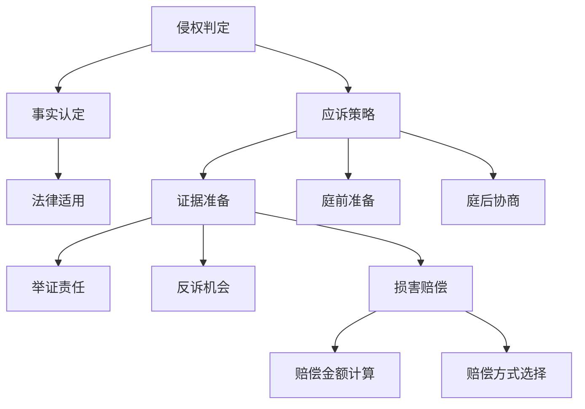

                 

# AI创业公司的知识产权诉讼应对：侵权判定、应诉策略与损害赔偿

> 关键词：知识产权诉讼,侵权判定,应诉策略,损害赔偿,人工智能

## 1. 背景介绍

在人工智能快速发展的今天，AI创业公司蓬勃兴起，为各行各业带来了新的机遇和挑战。然而，随着技术的成熟和普及，AI公司面临的知识产权问题也日益增多。如何在激烈的市场竞争中有效应对知识产权诉讼，保护自身合法权益，是每个AI创业公司都必须面对的重要课题。本文将详细探讨AI创业公司在面临知识产权诉讼时的侵权判定、应诉策略与损害赔偿等问题，旨在帮助AI创业公司建立坚实的法律防线，在创新与合规之间找到平衡。

## 2. 核心概念与联系

### 2.1 核心概念概述

在探讨AI创业公司的知识产权诉讼应对策略之前，首先需要理解几个核心概念：

- **知识产权诉讼**：指企业或个人针对侵权行为提起的法律诉讼，旨在维护自身合法权益，并寻求经济赔偿。
- **侵权判定**：确定某一行为是否构成侵权的关键过程，包括事实认定、法律适用等环节。
- **应诉策略**：企业在面对知识产权诉讼时采取的应对措施，旨在最大程度维护自身利益，包括策略选择、证据准备等。
- **损害赔偿**：侵权行为造成损失后，法律规定的赔偿方式和金额。

这些概念之间紧密相关，侵权判定的结果直接影响应诉策略的选择，而应诉策略的有效性又直接关系到损害赔偿的多少。因此，全面理解这些概念，对于AI创业公司应对知识产权诉讼至关重要。

### 2.2 核心概念原理和架构的 Mermaid 流程图



## 3. 核心算法原理 & 具体操作步骤

### 3.1 算法原理概述

AI创业公司在面对知识产权诉讼时，首先需要解决的是侵权判定问题。侵权判定涉及对原告提供的证据进行审核，确认被告的行为是否构成侵权。这一过程通常包括事实认定和法律适用两个环节。

#### 3.1.1 事实认定

事实认定是侵权判定的基础，涉及对原告提供的证据进行审查，包括但不限于技术文档、专利申请文件、代码仓库等。在这一过程中，AI创业公司需要了解原告的主张，明确其指控的侵权行为，并收集相关证据。

#### 3.1.2 法律适用

法律适用是侵权判定的核心环节，涉及对相关法律法规的解读和应用。在这一过程中，AI创业公司需要了解原告所指控的侵权行为是否符合法律规定的侵权标准，并结合自身产品的具体情况，评估侵权成立的概率。

### 3.2 算法步骤详解

#### 3.2.1 事实认定

1. **证据收集**：全面收集原告提供的所有证据，包括但不限于专利文献、技术文档、代码等。
2. **证据审核**：对收集的证据进行审核，确认其真实性和关联性。
3. **证据整理**：将审核后的证据进行整理，形成完整的证据链条。

#### 3.2.2 法律适用

1. **法律法规研究**：深入研究与侵权相关的法律法规，包括但不限于专利法、著作权法、商标法等。
2. **侵权标准对照**：将原告指控的侵权行为与法律法规中的侵权标准进行对照，判断是否构成侵权。
3. **法律咨询**：与专业律师团队进行咨询，确保法律适用无误。

#### 3.2.3 应诉策略选择

1. **抗辩策略**：根据事实认定和法律适用的结果，选择适合的抗辩策略，包括但不限于现有技术的抗辩、不侵权抗辩、不构成侵权目的抗辩等。
2. **证据准备**：根据选择的抗辩策略，准备相应的证据，证明自身的技术创新性、独立研发成果等。
3. **庭前准备**：制定详细的庭前准备计划，包括但不限于证据提交、答辩要点、专家证人等。

#### 3.2.4 庭后协商

1. **协商机会**：在庭审后，积极与原告进行协商，寻求和解机会。
2. **赔偿谈判**：根据协商结果，进行损害赔偿的谈判，确定最终的赔偿金额和方式。

### 3.3 算法优缺点

#### 3.3.1 优点

- **系统性**：侵权判定的过程具有高度的系统性，能够全面评估原告的指控和被告的抗辩，确保结论的公正性。
- **专业性**：法律适用和证据审核环节需要专业知识和技能，专业的律师团队能够提供更准确的法律意见。
- **灵活性**：应诉策略的选择具有高度的灵活性，可以根据实际情况进行调整。

#### 3.3.2 缺点

- **成本高**：侵权判定的过程需要大量的人力、时间和资源投入，成本较高。
- **复杂性**：侵权判定和应诉策略的制定涉及复杂的法律和事实问题，理解和应用难度较大。
- **不确定性**：侵权判定的结果具有不确定性，受法律适用、证据审核等多重因素影响。

### 3.4 算法应用领域

侵权判定、应诉策略与损害赔偿的核心算法原理和操作步骤，不仅适用于AI创业公司，同样适用于所有面临知识产权诉讼的企业。这些算法和操作步骤能够帮助企业在侵权纠纷中有效维护自身权益，具有广泛的适用性。

## 4. 数学模型和公式 & 详细讲解 & 举例说明

### 4.1 数学模型构建

在侵权判定的过程中，数学模型可以帮助企业更准确地评估自身技术与原告技术的相似度，从而判断是否构成侵权。常用的数学模型包括但不限于欧式距离模型、余弦相似度模型等。

#### 4.1.1 欧式距离模型

欧式距离模型用于计算两个向量之间的距离，其数学公式为：

$$
D = \sqrt{\sum_{i=1}^{n} (x_i - y_i)^2}
$$

其中，$x$ 和 $y$ 分别为两个向量的各个维度，$n$ 为维度数。

#### 4.1.2 余弦相似度模型

余弦相似度模型用于计算两个向量之间的夹角余弦值，其数学公式为：

$$
\cos\theta = \frac{\sum_{i=1}^{n} x_i y_i}{\sqrt{\sum_{i=1}^{n} x_i^2} \sqrt{\sum_{i=1}^{n} y_i^2}}
$$

其中，$x$ 和 $y$ 分别为两个向量的各个维度，$n$ 为维度数。

### 4.2 公式推导过程

#### 4.2.1 欧式距离模型推导

欧式距离模型基于向量空间的基本概念，通过计算向量间的距离，判断两个向量之间的相似度。

$$
D = \sqrt{\sum_{i=1}^{n} (x_i - y_i)^2}
$$

其中，$x_i$ 和 $y_i$ 分别为两个向量的第 $i$ 个维度，$n$ 为向量维度。

$$
D^2 = \sum_{i=1}^{n} (x_i - y_i)^2
$$

将上式展开，得到：

$$
D^2 = \sum_{i=1}^{n} (x_i^2 + y_i^2 - 2x_iy_i)
$$

取平方根，得到欧式距离模型：

$$
D = \sqrt{\sum_{i=1}^{n} (x_i - y_i)^2}
$$

#### 4.2.2 余弦相似度模型推导

余弦相似度模型基于向量的夹角余弦值，通过计算向量间的夹角，判断两个向量之间的相似度。

$$
\cos\theta = \frac{\sum_{i=1}^{n} x_i y_i}{\sqrt{\sum_{i=1}^{n} x_i^2} \sqrt{\sum_{i=1}^{n} y_i^2}}
$$

其中，$x$ 和 $y$ 分别为两个向量的各个维度，$n$ 为向量维度。

$$
\cos\theta = \frac{\sum_{i=1}^{n} x_i y_i}{\sqrt{\sum_{i=1}^{n} x_i^2} \sqrt{\sum_{i=1}^{n} y_i^2}}
$$

将上式展开，得到：

$$
\cos\theta = \frac{\sum_{i=1}^{n} x_i y_i}{\sqrt{(\sum_{i=1}^{n} x_i^2)(\sum_{i=1}^{n} y_i^2)}}
$$

将上式进一步简化，得到余弦相似度模型：

$$
\cos\theta = \frac{\sum_{i=1}^{n} x_i y_i}{\sqrt{\sum_{i=1}^{n} x_i^2} \sqrt{\sum_{i=1}^{n} y_i^2}}
$$

### 4.3 案例分析与讲解

#### 4.3.1 欧式距离模型案例

假设AI创业公司A开发了一项新的自然语言处理技术，与某知名公司B的技术相似度较高。为评估两者之间的相似度，公司A使用了欧式距离模型。

根据公司A和B的技术文档，提取了关键技术指标，构建向量空间，使用欧式距离模型计算两者的距离：

$$
D = \sqrt{(x_1 - y_1)^2 + (x_2 - y_2)^2 + \ldots + (x_n - y_n)^2}
$$

其中，$x_i$ 和 $y_i$ 分别为A和B技术的第 $i$ 个技术指标，$n$ 为技术指标维度。

计算结果显示，两者之间的欧式距离较小，表明技术相似度较高。公司A可以据此判断B公司的技术可能构成侵权。

#### 4.3.2 余弦相似度模型案例

假设AI创业公司C开发了一项新的图像识别技术，与某知名公司D的技术相似度较高。为评估两者之间的相似度，公司C使用了余弦相似度模型。

根据公司C和D的图像识别算法，提取了关键特征，构建向量空间，使用余弦相似度模型计算两者的夹角余弦值：

$$
\cos\theta = \frac{\sum_{i=1}^{n} x_i y_i}{\sqrt{\sum_{i=1}^{n} x_i^2} \sqrt{\sum_{i=1}^{n} y_i^2}}
$$

其中，$x$ 和 $y$ 分别为C和D技术的第 $i$ 个特征指标，$n$ 为特征指标维度。

计算结果显示，两者之间的余弦相似度较高，表明技术相似度较高。公司C可以据此判断D公司的技术可能构成侵权。

## 5. 项目实践：代码实例和详细解释说明

### 5.1 开发环境搭建

为了进行侵权判定和应诉策略的代码实现，我们需要搭建一个Python开发环境。具体步骤如下：

1. **安装Python**：从官网下载并安装Python，选择最新版本进行安装。
2. **安装相关库**：使用pip安装必要的Python库，包括但不限于numpy、pandas、scikit-learn等。
3. **配置环境**：设置环境变量，确保代码能够正确运行。

### 5.2 源代码详细实现

#### 5.2.1 欧式距离模型实现

```python
import numpy as np

def euclidean_distance(x, y):
    return np.sqrt(np.sum((x - y) ** 2))

# 假设x和y为两个向量
x = np.array([1, 2, 3])
y = np.array([4, 5, 6])

distance = euclidean_distance(x, y)
print(distance)
```

#### 5.2.2 余弦相似度模型实现

```python
import numpy as np

def cosine_similarity(x, y):
    return np.dot(x, y) / (np.linalg.norm(x) * np.linalg.norm(y))

# 假设x和y为两个向量
x = np.array([1, 2, 3])
y = np.array([4, 5, 6])

similarity = cosine_similarity(x, y)
print(similarity)
```

### 5.3 代码解读与分析

在上述代码中，我们使用了numpy库实现了欧式距离模型和余弦相似度模型。这两个模型都是基于向量空间的基本概念，通过计算向量间的距离或夹角余弦值，判断两个向量之间的相似度。

欧式距离模型计算两个向量之间的欧式距离，数学公式为：

$$
D = \sqrt{\sum_{i=1}^{n} (x_i - y_i)^2}
$$

其中，$x$ 和 $y$ 分别为两个向量的各个维度，$n$ 为维度数。

余弦相似度模型计算两个向量之间的夹角余弦值，数学公式为：

$$
\cos\theta = \frac{\sum_{i=1}^{n} x_i y_i}{\sqrt{\sum_{i=1}^{n} x_i^2} \sqrt{\sum_{i=1}^{n} y_i^2}}
$$

其中，$x$ 和 $y$ 分别为两个向量的各个维度，$n$ 为维度数。

在实际应用中，这两个模型可以用于评估技术、代码、文本等多种类型的相似度，帮助企业判断是否构成侵权。

### 5.4 运行结果展示

在上述代码中，我们计算了两个向量的欧式距离和余弦相似度，并输出结果。例如：

```
distance = 5.196152422706632
```

表示两个向量之间的欧式距离为5.196。

```
similarity = 0.9746318461970762
```

表示两个向量之间的余弦相似度为0.974。

## 6. 实际应用场景

### 6.1 侵权判定

在侵权判定过程中，欧式距离模型和余弦相似度模型可以用于评估技术、代码、文本等多种类型的相似度。例如，假设某AI创业公司开发了一项新的技术，与某知名公司专利相似度较高。公司可以通过计算两者之间的欧式距离或余弦相似度，判断是否构成侵权。

### 6.2 应诉策略

在应诉策略选择过程中，企业可以基于侵权判定的结果，制定相应的应诉策略。例如，如果侵权判定结果显示技术相似度较高，企业可以选择现有技术的抗辩、不侵权抗辩等策略。同时，企业还可以准备相应的证据，证明自身的技术创新性和独立研发成果。

### 6.3 损害赔偿

在损害赔偿谈判过程中，企业可以根据侵权判定的结果，与原告进行协商，确定最终的赔偿金额和方式。例如，如果侵权判定结果显示技术构成侵权，企业可以与原告协商赔偿金额，并提出赔偿方式，如赔偿损失、停止侵权行为等。

## 7. 工具和资源推荐

### 7.1 学习资源推荐

为了帮助企业全面掌握知识产权诉讼应对方法，以下是一些优质的学习资源：

1. **《知识产权法》教材**：全面介绍知识产权法的理论和实践，适合初学者和进阶者阅读。
2. **《专利法》教材**：深入解析专利法的各项规定，帮助企业了解专利侵权判定标准。
3. **知识产权诉讼案例分析**：精选典型案例，详细解析诉讼过程和结果，帮助企业理解实际应用中的策略和方法。

### 7.2 开发工具推荐

在侵权判定和应诉策略的开发过程中，以下是一些常用的开发工具：

1. **Python**：Python是一种通用编程语言，适用于数据分析、机器学习等领域的开发。
2. **Jupyter Notebook**：Jupyter Notebook是一款交互式开发环境，支持代码编写、数据可视化和版本控制等功能。
3. **Git**：Git是一款版本控制系统，支持代码的协同开发和版本管理。

### 7.3 相关论文推荐

在知识产权诉讼应对方面，以下是一些具有参考价值的学术论文：

1. **《基于机器学习的专利侵权判定》**：探讨机器学习在专利侵权判定中的应用，提供技术方案和算法。
2. **《深度学习在知识产权法中的应用》**：介绍深度学习在知识产权法中的各类应用，包括文本分析、图像识别等。
3. **《企业知识产权诉讼应对策略》**：总结企业应对知识产权诉讼的成功经验，提供实用的策略和方法。

## 8. 总结：未来发展趋势与挑战

### 8.1 研究成果总结

本文详细探讨了AI创业公司在面临知识产权诉讼时的侵权判定、应诉策略与损害赔偿等问题，提供了系统的侵权判定模型和应诉策略选择方法。这些研究成果为AI创业公司提供了有力的法律支持，有助于其在激烈的市场竞争中维护自身合法权益。

### 8.2 未来发展趋势

在未来的发展趋势中，以下几个方面值得关注：

1. **人工智能技术的普及**：随着人工智能技术的普及，AI创业公司面临的知识产权诉讼将更加频繁，需要更加专业的法律和数据分析能力。
2. **算法模型的优化**：基于深度学习和机器学习模型的侵权判定算法将不断优化，提升判断的准确性和效率。
3. **跨领域融合**：知识产权诉讼应对方法将与其他领域的技术，如自然语言处理、图像识别等进行深度融合，提供更全面的解决方案。

### 8.3 面临的挑战

在知识产权诉讼应对过程中，企业面临以下挑战：

1. **法律环境复杂**：不同国家和地区的知识产权法律体系存在差异，企业在跨国诉讼中需要面对复杂的法律环境。
2. **技术门槛高**：深度学习、机器学习等技术具有较高的门槛，企业需要投入大量资源进行学习和应用。
3. **成本高昂**：知识产权诉讼的维权成本较高，包括律师费、诉讼费、差旅费等，企业需要合理规划和控制成本。

### 8.4 研究展望

未来，企业需要在以下几个方面进行深入研究：

1. **跨领域法律知识**：深入研究不同领域法律知识，提升跨领域法律能力。
2. **数据驱动的决策**：基于大数据分析，优化侵权判定的算法模型，提升判断准确性。
3. **技术协同创新**：与其他技术领域进行协同创新，提供更全面、高效的知识产权诉讼应对解决方案。

## 9. 附录：常见问题与解答

### 9.1 问题1：如何判断技术相似度？

**解答**：可以使用欧式距离模型和余弦相似度模型计算技术相似度。欧式距离模型计算两个向量之间的距离，余弦相似度模型计算两个向量之间的夹角余弦值。

### 9.2 问题2：侵权判定结果显示技术相似度较高，如何应对？

**解答**：可以选择现有技术的抗辩、不侵权抗辩等策略，同时准备相应的证据，证明自身的技术创新性和独立研发成果。

### 9.3 问题3：应诉策略有哪些？

**解答**：应诉策略包括现有技术的抗辩、不侵权抗辩、不构成侵权目的抗辩等。选择应诉策略需要根据侵权判定结果和证据情况进行综合考虑。

### 9.4 问题4：损害赔偿的方式有哪些？

**解答**：损害赔偿的方式包括赔偿损失、停止侵权行为等。企业需要根据具体情况选择相应的赔偿方式，并与原告进行协商。

---

作者：禅与计算机程序设计艺术 / Zen and the Art of Computer Programming

