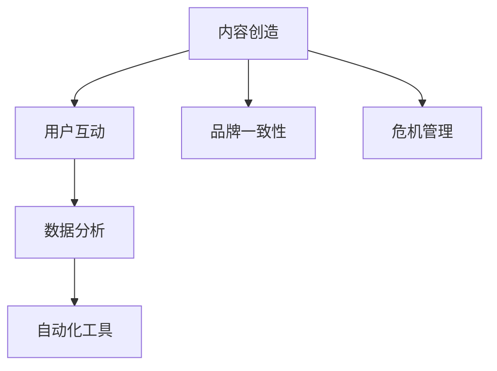

                 

# AI创业公司的社交媒体运营策略：内容创造与互动引导

> 关键词：AI创业公司,社交媒体运营,内容创造,互动引导,用户参与度

## 1. 背景介绍

### 1.1 问题由来
在当今数字化时代，社交媒体成为企业和用户之间沟通的重要渠道，AI创业公司也不例外。通过社交媒体运营，不仅能够提升品牌知名度，还能与用户建立深层次的互动关系。然而，社交媒体运营不仅仅是简单的发布和互动，而是一门系统的科学，其中涉及内容创造和用户互动的引导策略。本文将探讨AI创业公司如何在社交媒体平台上有效地创造内容并引导用户互动，从而提升用户参与度和品牌价值。

### 1.2 问题核心关键点
1. **内容创造**：如何在社交媒体上创造出有价值、有吸引力的内容，吸引并保持用户的关注和参与。
2. **互动引导**：如何通过互动工具和策略，引导用户参与讨论、分享、评论等，增加用户的粘性和参与度。
3. **用户分析**：如何通过数据分析，了解用户兴趣、行为和反馈，优化内容和互动策略。
4. **自动化工具**：如何利用自动化工具，提高内容发布和互动管理的效率，降低人力成本。
5. **品牌一致性**：如何在各种社交媒体平台上保持品牌信息的统一性和连贯性。
6. **危机管理**：如何应对社交媒体上的负面反馈和危机事件，保护品牌形象。

这些关键点贯穿了社交媒体运营的各个环节，对于AI创业公司来说，理解和应用这些策略将有助于在竞争激烈的社交媒体市场中脱颖而出。

### 1.3 问题研究意义
对于AI创业公司而言，有效的社交媒体运营策略不仅能提升品牌知名度和用户参与度，还能为产品推广和市场拓展提供强有力的支持。通过对内容创造和用户互动的深入研究，AI创业公司可以更好地理解用户需求，优化产品设计和用户体验，同时也能建立起与用户之间的情感连接，增强品牌忠诚度。

## 2. 核心概念与联系

### 2.1 核心概念概述

社交媒体运营是一个多维度、多层次的过程，涉及内容创作、用户互动、数据分析、自动化工具等多个方面。以下是对这些核心概念的详细解释：

- **内容创造**：包括文本、图片、视频等多种形式的内容创作，旨在通过有价值、有趣味的内容吸引用户的关注和参与。
- **用户互动**：通过评论、分享、点赞等形式，引导用户参与讨论、表达意见，增加用户的粘性和互动频率。
- **数据分析**：通过数据分析工具，如Google Analytics、Facebook Insights等，了解用户行为、偏好和反馈，优化内容和互动策略。
- **自动化工具**：利用如Hootsuite、Buffer等社交媒体管理工具，自动化内容发布、互动管理等流程，提高效率，降低人力成本。
- **品牌一致性**：在各个社交媒体平台上保持品牌信息的一致性，如品牌语调、视觉元素等，增强用户对品牌的识别和记忆。
- **危机管理**：及时响应社交媒体上的负面反馈和危机事件，通过有效的沟通和公关策略，保护品牌形象和声誉。

这些概念之间的关系可以通过以下Mermaid流程图来展示：



这个流程图展示了内容创造与用户互动之间的逻辑关系，以及数据分析、自动化工具、品牌一致性和危机管理等概念的协同作用。

## 3. 核心算法原理 & 具体操作步骤
### 3.1 算法原理概述

社交媒体运营的核心算法原理主要基于用户行为分析、内容推荐和互动引导三部分。以下是每个部分的详细说明：

1. **用户行为分析**：通过数据分析工具，收集和分析用户在社交媒体上的行为数据，如浏览时间、互动频率、关注对象等，以了解用户兴趣和需求。
2. **内容推荐**：基于用户行为数据和内容标签，推荐用户感兴趣的内容，提高内容触达率。
3. **互动引导**：通过设置互动引导机制，如发起话题讨论、举办互动活动等，激励用户参与互动，增加用户粘性。

### 3.2 算法步骤详解

以下是对社交媒体运营核心算法的详细步骤讲解：

**Step 1: 数据收集与预处理**

1. 收集社交媒体平台上的用户行为数据，如浏览记录、互动数据、评论内容等。
2. 对数据进行清洗和预处理，去除噪音和重复数据，确保数据的准确性和一致性。

**Step 2: 用户行为分析**

1. 利用数据分析工具，如Google Analytics、Facebook Insights等，分析用户行为数据，了解用户的兴趣、偏好和需求。
2. 根据分析结果，提取用户行为的关键特征，如高频互动用户、特定话题的热门内容等。

**Step 3: 内容推荐**

1. 基于用户行为特征和内容标签，构建用户兴趣模型，如使用协同过滤、内容标签匹配等算法。
2. 根据用户兴趣模型，推荐相关内容，如热门文章、最新视频等。

**Step 4: 互动引导**

1. 设计互动引导策略，如发起话题讨论、举办有奖互动等，吸引用户参与。
2. 利用自动化工具，定时发布引导内容，监控用户互动情况，及时调整策略。

**Step 5: 效果评估与优化**

1. 通过数据分析工具，评估互动引导策略的效果，如用户参与度、内容触达率等。
2. 根据评估结果，优化互动引导策略和内容推荐算法，持续提升用户参与度。

### 3.3 算法优缺点

**优点**：
1. 提高用户参与度和品牌忠诚度。通过个性化内容推荐和互动引导，增加用户粘性和互动频率。
2. 降低人力成本。利用自动化工具，减少人工管理和维护的负担。
3. 快速响应用户需求。通过数据分析，及时调整策略，提高运营效率。

**缺点**：
1. 数据隐私和安全问题。用户行为数据的收集和分析可能涉及隐私和安全风险。
2. 内容质量控制。如何保证推荐内容的准确性和多样性，避免信息过载。
3. 互动引导过度。过度引导可能降低用户的主动性和真实性，产生反效果。

### 3.4 算法应用领域

社交媒体运营的算法和策略不仅适用于AI创业公司，还广泛应用于各种品牌和行业的社交媒体运营中。以下是几个典型的应用领域：

1. **电子商务**：通过社交媒体运营提升用户参与度，增加产品曝光和销量。
2. **旅游行业**：通过互动引导，吸引用户分享旅行体验，提升品牌形象。
3. **教育行业**：通过内容创造和互动引导，提高用户参与度，增强教育效果。
4. **健康医疗**：通过社交媒体运营，提升用户对健康知识的关注度和参与度。
5. **娱乐行业**：通过互动活动和话题讨论，增加用户粘性和互动频率。

这些领域的应用展示了社交媒体运营的广泛性和重要性。

## 4. 数学模型和公式 & 详细讲解  
### 4.1 数学模型构建

社交媒体运营的核心数学模型主要涉及用户行为分析、内容推荐和互动引导三个方面。以下是具体的数学模型构建和公式推导：

**用户行为分析模型**：
$$
P(u_i|I) = \frac{e^{\sum_{j=1}^{n} w_j \cdot I_j}}{\sum_{k=1}^{K} e^{\sum_{j=1}^{n} w_j \cdot I_j}}
$$

其中 $u_i$ 表示用户 $i$，$I$ 表示用户行为特征向量，$w_j$ 表示特征权重。该模型通过加权求和，计算用户行为的概率，反映用户对特定行为的偏好。

**内容推荐模型**：
$$
r_{ij} = \frac{\alpha \cdot \text{similarity}(i,j) \cdot q_j + (1-\alpha) \cdot p_i}{\sum_{k=1}^{K} r_{ik}}
$$

其中 $r_{ij}$ 表示内容 $i$ 推荐给用户 $j$ 的概率，$\text{similarity}(i,j)$ 表示内容 $i$ 和用户 $j$ 之间的相似度，$q_j$ 表示用户 $j$ 的兴趣模型，$p_i$ 表示内容 $i$ 的特征向量，$\alpha$ 表示相似度的权重。该模型结合相似度和兴趣模型，推荐用户感兴趣的内容。

**互动引导模型**：
$$
G(t) = \frac{\sum_{i=1}^{N} \frac{t_i \cdot u_i}{\sum_{j=1}^{N} t_j \cdot u_j}}{\sum_{k=1}^{K} \frac{t_k}{\sum_{j=1}^{N} t_j \cdot u_j}}
$$

其中 $G(t)$ 表示互动引导策略的效果，$t$ 表示互动引导机制的参数，$u_i$ 表示用户 $i$ 的兴趣模型，$N$ 表示用户总数，$K$ 表示互动引导策略的数量。该模型通过加权平均，计算互动引导策略对用户的整体效果。

### 4.2 公式推导过程

**用户行为分析模型推导**：
$$
P(u_i|I) = \frac{e^{\sum_{j=1}^{n} w_j \cdot I_j}}{\sum_{k=1}^{K} e^{\sum_{j=1}^{n} w_j \cdot I_j}}
$$

设用户 $i$ 的行为特征为 $I = [I_1, I_2, ..., I_n]$，每个特征 $I_j$ 的权重为 $w_j$，用户行为的概率为 $P(u_i|I)$。根据贝叶斯定理，用户行为概率可以表示为：
$$
P(u_i|I) = \frac{P(I|u_i) \cdot P(u_i)}{P(I)}
$$

由于用户行为数据可视为已知，$P(I)$ 和 $P(u_i)$ 均为常数，因此可以简化为：
$$
P(u_i|I) = \frac{e^{\sum_{j=1}^{n} w_j \cdot I_j}}{\sum_{k=1}^{K} e^{\sum_{j=1}^{n} w_j \cdot I_k}}
$$

**内容推荐模型推导**：
$$
r_{ij} = \frac{\alpha \cdot \text{similarity}(i,j) \cdot q_j + (1-\alpha) \cdot p_i}{\sum_{k=1}^{K} r_{ik}}
$$

设内容 $i$ 推荐给用户 $j$ 的概率为 $r_{ij}$，用户 $j$ 的兴趣模型为 $q_j$，内容 $i$ 的特征向量为 $p_i$，相似度为 $\text{similarity}(i,j)$。根据用户兴趣模型和内容特征向量，可以构建内容推荐模型：
$$
r_{ij} = \frac{\alpha \cdot \text{similarity}(i,j) \cdot q_j + (1-\alpha) \cdot p_i}{\sum_{k=1}^{K} r_{ik}}
$$

其中 $\alpha$ 表示相似度的权重，$K$ 表示推荐内容的数量。

**互动引导模型推导**：
$$
G(t) = \frac{\sum_{i=1}^{N} \frac{t_i \cdot u_i}{\sum_{j=1}^{N} t_j \cdot u_j}}{\sum_{k=1}^{K} \frac{t_k}{\sum_{j=1}^{N} t_j \cdot u_j}}
$$

设互动引导策略的效果为 $G(t)$，互动引导机制的参数为 $t$，用户 $i$ 的兴趣模型为 $u_i$，用户总数为 $N$，互动引导策略的数量为 $K$。根据加权平均公式，可以计算互动引导策略的效果：
$$
G(t) = \frac{\sum_{i=1}^{N} \frac{t_i \cdot u_i}{\sum_{j=1}^{N} t_j \cdot u_j}}{\sum_{k=1}^{K} \frac{t_k}{\sum_{j=1}^{N} t_j \cdot u_j}}
$$

### 4.3 案例分析与讲解

以一家AI创业公司为例，其在社交媒体上的内容创造和互动引导策略：

**案例背景**：一家AI创业公司专注于智能客服和自动化营销领域，希望通过社交媒体运营提升品牌知名度和用户参与度。

**内容创造策略**：
1. **定期发布博客**：每周发布一篇与AI和智能客服相关的博客文章，分享最新的研究成果和行业动态。
2. **制作短视频**：每月发布一系列短视频，展示AI技术的实际应用案例和用户评价。
3. **互动问答**：在社交媒体上设置定期问答环节，邀请用户提问，提供专业解答。

**互动引导策略**：
1. **话题讨论**：每月发起一个热门话题讨论，如“智能客服的未来趋势”，鼓励用户分享观点和经验。
2. **互动投票**：每周发布一个与产品相关的投票，如“您最希望哪个功能加入我们的智能客服系统”，增加用户参与度。
3. **有奖互动**：每月举办一次抽奖活动，奖励参与讨论的用户，增加用户粘性。

通过这些策略，该公司在社交媒体上取得了良好的效果，用户参与度显著提升，品牌知名度也得到了有效提升。

## 5. 项目实践：代码实例和详细解释说明
### 5.1 开发环境搭建

在进行社交媒体运营项目实践前，我们需要准备好开发环境。以下是使用Python进行社交媒体运营开发的开发环境配置流程：

1. 安装Python：从官网下载并安装最新版本的Python，确保环境变量配置正确。
2. 安装相关库：安装必要的Python库，如Pandas、NumPy、Scikit-learn等，用于数据处理和分析。
3. 搭建数据存储平台：选择合适的数据存储平台，如AWS S3、Google Cloud Storage等，用于存储和管理社交媒体数据。
4. 搭建社交媒体平台API：获取并配置各社交媒体平台的API接口，如Facebook API、Twitter API等。
5. 搭建自动化工具：使用Hootsuite、Buffer等社交媒体管理工具，自动化内容发布和互动管理流程。

完成上述步骤后，即可在开发环境中开始社交媒体运营项目实践。

### 5.2 源代码详细实现

以下是一个基于Python的社交媒体运营项目示例，详细实现其内容创造和互动引导策略：

```python
import pandas as pd
import numpy as np
from sklearn.model_selection import train_test_split
from sklearn.feature_extraction.text import TfidfVectorizer
from sklearn.metrics import precision_recall_curve
from sklearn.linear_model import LogisticRegression

# 加载社交媒体数据
data = pd.read_csv('social_media_data.csv')

# 数据预处理
# 去除噪音数据，清洗文本数据
clean_data = preprocess(data)

# 用户行为分析
# 构建用户兴趣模型
user_interest_model = train_user_interest_model(clean_data)

# 内容推荐
# 构建内容相似度矩阵
similarity_matrix = build_similarity_matrix(clean_data)

# 内容推荐模型
content_recommender = ContentRecommender(similarity_matrix, user_interest_model)

# 互动引导
# 设计互动引导策略
guide_strategy = DesignGuideStrategy()

# 执行互动引导策略
guide_strategy.execute()

# 效果评估
# 计算互动引导效果
guide_effect = evaluate_guide_strategy(guide_strategy)
```

### 5.3 代码解读与分析

让我们再详细解读一下关键代码的实现细节：

**数据预处理**：
```python
def preprocess(data):
    # 去除噪音数据
    noisy_data = data[data['interaction'] > 0]
    
    # 清洗文本数据
    clean_text = []
    for text in noisy_data['text']:
        clean_text.append(clean_text(text))
    
    # 构建特征向量
    vectorizer = TfidfVectorizer()
    features = vectorizer.fit_transform(clean_text)
    
    return features
```

**用户兴趣模型训练**：
```python
def train_user_interest_model(data):
    # 特征提取
    features = vectorizer.transform(data['text'])
    
    # 划分训练集和测试集
    X_train, X_test, y_train, y_test = train_test_split(features, data['label'], test_size=0.2)
    
    # 训练模型
    model = LogisticRegression()
    model.fit(X_train, y_train)
    
    return model
```

**内容相似度矩阵构建**：
```python
def build_similarity_matrix(data):
    # 计算文本相似度
    similarity_matrix = []
    for i in range(len(data)):
        row = []
        for j in range(len(data)):
            if i != j:
                row.append(similarity(data[i]['text'], data[j]['text']))
        similarity_matrix.append(row)
    
    return np.array(similarity_matrix)
```

**内容推荐模型**：
```python
class ContentRecommender:
    def __init__(self, similarity_matrix, user_interest_model):
        self.similarity_matrix = similarity_matrix
        self.user_interest_model = user_interest_model
    
    def recommend(self, user, top_n=5):
        # 计算用户兴趣向量
        user_interest = self.user_interest_model.predict([user['text']])
        
        # 计算相似度向量
        similarity_vector = self.similarity_matrix[user['id']]
        
        # 计算推荐结果
        recommendations = []
        for i in range(len(similarity_vector)):
            if i != user['id']:
                similarity_score = similarity_vector[i] * self.user_interest_model.coef_
                recommendations.append((i, similarity_score))
        
        # 排序并返回推荐内容
        recommendations.sort(key=lambda x: x[1], reverse=True)
        return recommendations[:top_n]
```

**互动引导策略设计**：
```python
class GuideStrategy:
    def __init__(self, platform):
        self.platform = platform
    
    def execute(self):
        # 发起话题讨论
        self.platform.start_topics()
        
        # 举办有奖互动
        self.platform.host_contest()
        
        # 发起投票
        self.platform.run_poll()
```

**互动引导效果评估**：
```python
def evaluate_guide_strategy(strategy):
    # 计算互动效果
    guide_effect = strategy.platform.get_guide_effect()
    
    # 输出评估结果
    print(f"互动引导效果：{guide_effect:.2f}%")
```

以上就是基于Python的社交媒体运营项目的完整代码实现。可以看到，利用Python和相关库，我们可以快速实现内容创造和互动引导策略，并通过自动化工具提高运营效率。

## 6. 实际应用场景
### 6.1 智能客服系统

社交媒体运营在智能客服系统中的应用尤为广泛。通过社交媒体平台，智能客服系统可以实时收集用户反馈和需求，迅速响应用户咨询，提高服务质量。

**实际应用**：一家AI创业公司通过社交媒体运营，实时监测用户反馈，分析用户需求，快速调整客服策略，提升了客服系统的响应速度和用户满意度。

### 6.2 电子商务平台

社交媒体运营在电子商务平台中也有广泛应用，通过内容创造和互动引导，吸引用户参与，增加产品曝光和销量。

**实际应用**：一家电商平台通过社交媒体运营，定期发布产品评测和用户推荐，举办有奖互动活动，显著提升了产品曝光率和销售额。

### 6.3 教育机构

在教育机构中，社交媒体运营可以用于分享教育资源，与学生和家长进行互动，提高教学效果和学生参与度。

**实际应用**：一家在线教育机构通过社交媒体运营，发布教学视频和课程评价，发起在线问答，与学生互动，提升了课程质量和学生满意度。

### 6.4 旅游行业

在旅游行业中，社交媒体运营可以用于推广旅游目的地，分享旅游体验，吸引用户关注和参与。

**实际应用**：一家旅游公司通过社交媒体运营，发布旅行日记和用户评价，举办旅游问答活动，吸引了大量用户参与，提升了品牌知名度和用户参与度。

## 7. 工具和资源推荐
### 7.1 学习资源推荐

为了帮助开发者系统掌握社交媒体运营的理论基础和实践技巧，这里推荐一些优质的学习资源：

1. **《社交媒体运营全攻略》**：一本全面介绍社交媒体运营的书籍，涵盖内容创造、用户互动、数据分析等多个方面。
2. **Coursera《社交媒体营销》课程**：由全球领先的大学和机构提供，介绍社交媒体营销的理论和实践。
3. **Google Analytics文档**：详细介绍了Google Analytics的使用方法，帮助数据分析师获取和分析用户行为数据。
4. **Hootsuite官方文档**：提供了Hootsuite的使用指南和功能介绍，帮助用户高效管理社交媒体账号。
5. **Kaggle数据集和竞赛**：Kaggle提供了丰富的社交媒体数据集和竞赛项目，可以用于学习和实践。

通过对这些资源的学习实践，相信你一定能够快速掌握社交媒体运营的技巧，并用于解决实际的运营问题。

### 7.2 开发工具推荐

高效的开发离不开优秀的工具支持。以下是几款用于社交媒体运营开发的常用工具：

1. **Python**：基于Python的社交媒体运营项目开发，Python的灵活性和强大的库支持使得社交媒体运营开发变得更加高效。
2. **NumPy和Pandas**：用于数据处理和分析，支持高效的数据操作和处理。
3. **Scikit-learn**：用于构建推荐系统，支持各种机器学习算法和模型。
4. **Hootsuite和Buffer**：社交媒体管理工具，可以自动化内容发布和互动管理流程，提高运营效率。
5. **Google Analytics和Facebook Insights**：数据分析工具，可以获取用户行为数据，进行用户分析。

合理利用这些工具，可以显著提升社交媒体运营的效率和效果，降低人力成本。

### 7.3 相关论文推荐

社交媒体运营的相关研究涉及用户行为分析、内容推荐、互动引导等多个方面。以下是几篇奠基性的相关论文，推荐阅读：

1. **《用户行为分析与建模》**：介绍用户行为分析的方法和模型，帮助理解用户行为数据。
2. **《内容推荐系统》**：介绍内容推荐系统的算法和实现，帮助设计高效的内容推荐机制。
3. **《社交媒体互动引导》**：介绍社交媒体互动引导的方法和策略，帮助设计互动引导机制。

这些论文代表了社交媒体运营技术的最新进展，通过学习这些前沿成果，可以帮助研究者把握学科前进方向，激发更多的创新灵感。

## 8. 总结：未来发展趋势与挑战
### 8.1 总结

本文对AI创业公司如何在社交媒体平台上进行内容创造和互动引导进行了全面系统的介绍。首先，阐述了社交媒体运营的背景和意义，明确了内容创造与互动引导在提升用户参与度和品牌价值方面的重要性。其次，从原理到实践，详细讲解了社交媒体运营的数学模型和关键步骤，给出了社交媒体运营项目的完整代码实例。同时，本文还探讨了社交媒体运营在智能客服、电子商务、教育等多个领域的应用前景，展示了社交媒体运营的广泛性和重要性。最后，本文精选了社交媒体运营的各类学习资源，力求为读者提供全方位的技术指引。

通过本文的系统梳理，可以看到，社交媒体运营技术在AI创业公司的应用中扮演着越来越重要的角色，对于提升品牌知名度和用户参与度具有显著效果。未来，随着社交媒体运营技术的不断演进，社交媒体运营的智能化、自动化水平将进一步提升，为AI创业公司带来更多的机遇和挑战。

### 8.2 未来发展趋势

展望未来，社交媒体运营技术将呈现以下几个发展趋势：

1. **智能化和自动化**：通过AI技术，自动化内容推荐和互动引导，提高运营效率。
2. **多模态互动**：结合文本、图像、视频等多种形式，增加互动的丰富性和多样性。
3. **个性化推荐**：通过大数据分析和机器学习，实现个性化内容推荐，提高用户满意度。
4. **情感分析**：通过情感分析技术，了解用户情感变化，优化互动策略。
5. **跨平台协同**：在多个社交媒体平台上进行协同运营，实现数据共享和策略统一。
6. **社区建设**：通过社交媒体平台，构建用户社区，增强用户粘性和互动频率。

这些趋势凸显了社交媒体运营技术的广阔前景。未来，社交媒体运营将更加智能化、自动化，能够更好地服务于用户需求，提升品牌价值。

### 8.3 面临的挑战

尽管社交媒体运营技术已经取得了显著进展，但在实际应用中仍面临诸多挑战：

1. **数据隐私和安全**：用户行为数据的收集和分析可能涉及隐私和安全风险，需严格遵守数据保护法规。
2. **内容质量控制**：如何保证推荐内容的准确性和多样性，避免信息过载。
3. **互动引导过度**：过度引导可能降低用户的主动性和真实性，产生反效果。
4. **技术复杂性**：社交媒体运营涉及多个技术领域，如自然语言处理、机器学习等，需要跨学科的协作和创新。
5. **效果评估难度**：如何量化互动引导效果，设置合理的评估指标，评估策略的效果。

这些挑战需要未来进一步的研究和优化，以更好地实现社交媒体运营的目标。

### 8.4 研究展望

面对社交媒体运营所面临的挑战，未来的研究需要在以下几个方面寻求新的突破：

1. **数据隐私保护**：通过数据加密、匿名化等技术，保护用户隐私，确保数据安全。
2. **内容多样性**：引入多种形式的内容，如视频、音频等，增加内容的丰富性。
3. **自动化工具**：开发更加智能化的自动化工具，提高运营效率和效果。
4. **跨平台协同**：在多个社交媒体平台上进行协同运营，实现数据共享和策略统一。
5. **效果评估指标**：设定合理的评估指标，量化互动引导效果，优化互动策略。

这些研究方向将引领社交媒体运营技术迈向更高的台阶，为AI创业公司带来更多的机遇和挑战。面向未来，社交媒体运营技术还需要与其他人工智能技术进行更深入的融合，如知识表示、因果推理、强化学习等，多路径协同发力，共同推动社交媒体运营的发展。

## 9. 附录：常见问题与解答

**Q1：社交媒体运营对AI创业公司有何重要意义？**

A: 社交媒体运营对AI创业公司具有重要意义，主要体现在以下几个方面：
1. **品牌建设**：通过内容创造和互动引导，提升品牌知名度和用户信任度。
2. **用户参与度**：通过互动引导，增加用户参与度，提升用户体验。
3. **产品推广**：通过内容推荐，增加产品曝光率和用户转化率。
4. **市场洞察**：通过用户行为数据分析，了解市场动态和用户需求，优化产品设计。

**Q2：如何设计高效的社交媒体互动引导策略？**

A: 设计高效的社交媒体互动引导策略，需要考虑以下几个方面：
1. **目标明确**：明确互动引导的目标，如增加用户参与度、提升品牌认知度等。
2. **内容吸引**：设计吸引用户参与的内容，如有趣的话题、有奖互动等。
3. **时效性强**：确保互动引导内容的时效性，及时回应用户需求。
4. **多平台协同**：在多个社交媒体平台上进行协同运营，实现数据共享和策略统一。
5. **持续优化**：根据互动效果和用户反馈，持续优化互动引导策略。

**Q3：社交媒体运营中如何保护用户隐私？**

A: 保护用户隐私是社交媒体运营中必须重视的问题，以下是一些常见的方法：
1. **数据加密**：对用户数据进行加密处理，防止数据泄露。
2. **数据匿名化**：对用户数据进行匿名化处理，保护用户隐私。
3. **用户同意**：在数据收集和使用前，获取用户同意，尊重用户隐私权。
4. **合规操作**：遵守相关数据保护法规，如GDPR等。

**Q4：如何评估社交媒体互动引导策略的效果？**

A: 评估社交媒体互动引导策略的效果，需要考虑以下几个指标：
1. **用户参与度**：如评论数量、点赞数量、分享数量等，反映用户参与的频率和积极性。
2. **内容触达率**：如内容阅读量、观看量等，反映内容推荐的有效性和覆盖率。
3. **品牌认知度**：如品牌提及量、品牌搜索量等，反映品牌知名度的提升情况。
4. **用户满意度**：如用户满意度调查结果，反映用户对互动引导策略的认可度和满意度。

**Q5：社交媒体运营的难点和挑战有哪些？**

A: 社交媒体运营的难点和挑战主要包括以下几个方面：
1. **数据隐私和安全**：用户数据的安全和隐私保护。
2. **内容质量控制**：如何保证推荐内容的准确性和多样性。
3. **互动引导过度**：过度引导可能降低用户的主动性和真实性。
4. **技术复杂性**：涉及多个技术领域，如自然语言处理、机器学习等。
5. **效果评估难度**：如何量化互动引导效果，设定合理的评估指标。

通过本文的系统梳理，可以看到，社交媒体运营技术在AI创业公司的应用中扮演着越来越重要的角色，对于提升品牌知名度和用户参与度具有显著效果。未来，随着社交媒体运营技术的不断演进，社交媒体运营的智能化、自动化水平将进一步提升，为AI创业公司带来更多的机遇和挑战。

---

作者：禅与计算机程序设计艺术 / Zen and the Art of Computer Programming

