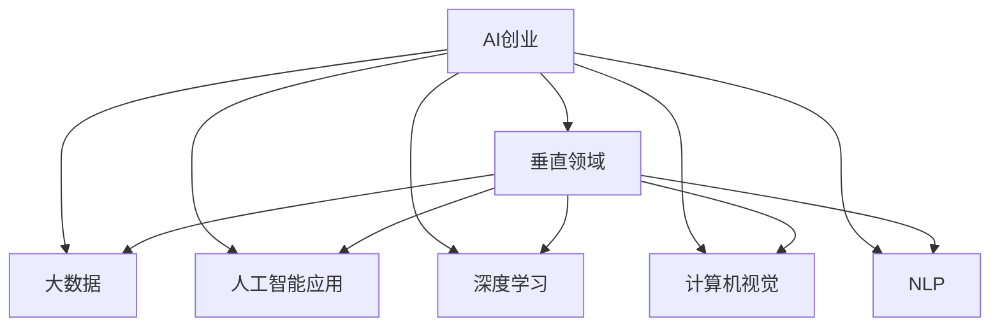

                 

# AI创业者的码头：专注于垂直领域

> 关键词：AI创业,垂直领域,大数据,人工智能应用,深度学习,计算机视觉,自然语言处理,NLP

## 1. 背景介绍

### 1.1 问题由来

随着人工智能(AI)技术的迅猛发展，AI创业已经成为一个热门的领域。根据CB Insights的报告，2021年全球AI初创企业融资总额达到了1.2万亿美元，创下历史新高。然而，尽管AI技术如火如荼地发展，但在实际应用中仍然存在很多挑战。比如，如何选取垂直领域进行深入应用，如何选择最合适的AI技术进行开发，如何将AI技术与业务需求紧密结合等。本文将深入探讨这些问题，帮助AI创业者更好地专注于垂直领域。

### 1.2 问题核心关键点

AI创业成功的关键在于选准垂直领域，并在其中深入应用AI技术。然而，选择合适的领域往往比技术实现更难。以下是选择垂直领域的关键点：

1. **市场潜力**：选择的领域要有一定的市场规模和发展潜力，确保商业化可行。
2. **数据可用性**：数据是AI技术应用的基础，需要评估领域内数据的质量和可获得性。
3. **技术成熟度**：评估AI技术在领域内的成熟度，确保有足够的技术支持。
4. **业务需求匹配**：AI应用需要与业务需求紧密结合，确保技术解决实际问题。
5. **竞争格局**：评估领域内的竞争情况，确保有足够的竞争优势。

## 2. 核心概念与联系

### 2.1 核心概念概述

为更好地理解AI创业者的垂直领域聚焦，本节将介绍几个密切相关的核心概念：

- **AI创业**：指通过开发、应用AI技术解决实际问题，以创造商业价值的过程。
- **垂直领域**：指在特定行业或领域内应用AI技术的场景，如医疗、金融、教育等。
- **大数据**：指通过大规模数据集进行分析和挖掘，以发现隐藏的模式和规律。
- **人工智能应用**：指将AI技术应用于特定领域或问题，以解决实际问题的过程。
- **深度学习**：指利用多层神经网络进行复杂模式识别的AI技术。
- **计算机视觉**：指通过机器视觉技术识别、分类和处理图像、视频等视觉数据的AI应用。
- **自然语言处理(NLP)**：指通过计算机技术处理和理解人类语言的应用，如文本分析、语音识别等。

这些核心概念之间的逻辑关系可以通过以下Mermaid流程图来展示：



这个流程图展示了大规模AI创业的关键路径：

1. AI创业团队通过大数据挖掘发现市场需求，选择垂直领域。
2. 基于垂直领域的特性，选择合适的AI应用和技术栈。
3. 使用深度学习、计算机视觉、NLP等技术，实现具体的AI应用。

## 3. 核心算法原理 & 具体操作步骤
### 3.1 算法原理概述

AI创业者在垂直领域的深入应用，本质上是一个数据驱动的AI应用过程。其核心思想是通过对大规模数据集进行分析挖掘，发现其中的规律和模式，并使用AI技术进行处理和应用。

形式化地，假设某垂直领域的数据集为 $D=\{(x_i,y_i)\}_{i=1}^N$，其中 $x_i$ 为输入特征，$y_i$ 为输出标签。目标是通过训练一个模型 $M$，使得在新的输入 $x$ 上，模型能够准确预测输出 $y$。

训练模型的目标是最大化预测准确度，即最小化损失函数 $\mathcal{L}$：

$$
\mathcal{L}(M)=\frac{1}{N}\sum_{i=1}^N L(y_i, M(x_i))
$$

其中 $L$ 为损失函数，常用的有交叉熵损失、均方误差损失等。

常见的模型选择包括神经网络、决策树、支持向量机等。对于AI创业项目，由于数据量往往较大，深度学习模型如卷积神经网络(CNN)、循环神经网络(RNN)、Transformer等是常用的选择。

### 3.2 算法步骤详解

AI创业在垂直领域的应用，主要包括以下几个关键步骤：

**Step 1: 数据收集与预处理**
- 收集垂直领域的原始数据，包括文本、图像、语音等。
- 对数据进行清洗、去噪、归一化等预处理操作，确保数据质量。

**Step 2: 数据划分**
- 将数据划分为训练集、验证集和测试集，通常比例为7:1.5:1.5。
- 确保验证集和测试集的数据分布与训练集一致，避免过拟合。

**Step 3: 模型选择与训练**
- 选择合适的深度学习模型，如CNN、RNN、Transformer等。
- 在训练集上使用梯度下降等优化算法训练模型。

**Step 4: 模型评估与优化**
- 在验证集上评估模型性能，调整模型参数或选择其他模型。
- 在测试集上最终评估模型性能，确保模型泛化性能良好。

**Step 5: 模型部署与应用**
- 将训练好的模型部署到实际应用系统中。
- 持续收集新数据，定期重新训练模型，以适应数据分布的变化。

以上是AI创业在垂直领域应用的一般流程。在实际应用中，还需要针对具体领域的特性，对各个环节进行优化设计，如改进训练目标函数，引入更多的正则化技术，搜索最优的超参数组合等，以进一步提升模型性能。

### 3.3 算法优缺点

AI创业在垂直领域的深入应用，具有以下优点：

1. **高效性**：通过数据驱动的模型训练，可以快速发现领域内的问题和解决方案。
2. **可扩展性**：AI应用能够处理大规模数据，具备良好的可扩展性。
3. **灵活性**：深度学习模型具有高度的灵活性和适应性，能够适应复杂的多模态数据。
4. **商业化潜力**：AI技术在垂直领域的深入应用，能够创造显著的经济价值。

同时，该方法也存在一些局限性：

1. **数据依赖性强**：AI应用的效果很大程度上取决于数据的质量和数量，数据获取难度大。
2. **模型复杂度高**：深度学习模型的训练和优化过程复杂，需要大量计算资源。
3. **模型可解释性差**：AI模型的内部决策逻辑难以解释，难以调试和优化。
4. **技术门槛高**：AI创业对技术和数据处理能力要求较高，需要专业的团队支持。
5. **风险高**：数据和模型的错误可能导致严重的商业风险。

尽管存在这些局限性，但就目前而言，AI创业在垂直领域的应用依然是大势所趋。未来相关研究的重点在于如何进一步降低数据获取成本，提高模型可解释性，降低技术门槛，同时兼顾可扩展性和商业化潜力。

### 3.4 算法应用领域

AI创业在垂直领域的应用已经广泛应用于多个行业，如医疗、金融、制造、零售等，具体包括：

- **医疗领域**：AI在医疗影像分析、疾病预测、个性化医疗等方面已取得显著成果。
- **金融领域**：AI在风险评估、智能投顾、反欺诈等领域展现了巨大潜力。
- **制造领域**：AI在智能制造、预测性维护、质量检测等方面提高了生产效率和质量。
- **零售领域**：AI在客户推荐、库存管理、价格优化等方面改善了零售体验和效率。
- **能源领域**：AI在能源需求预测、智能电网、能源管理等方面促进了能源的可持续发展。

这些应用展示了AI技术在垂直领域的广泛应用，为传统行业带来了新的增长点和发展机会。

## 4. 数学模型和公式 & 详细讲解 & 举例说明

### 4.1 数学模型构建

本节将使用数学语言对AI创业在垂直领域应用的一般过程进行更加严格的刻画。

记垂直领域的数据集为 $D=\{(x_i,y_i)\}_{i=1}^N$，其中 $x_i$ 为输入特征，$y_i$ 为输出标签。假设选择的深度学习模型为 $M_{\theta}(x)$，其中 $\theta$ 为模型参数。

定义模型 $M_{\theta}$ 在输入 $x$ 上的损失函数为 $\ell(y_i, M_{\theta}(x_i))$，则在数据集 $D$ 上的经验风险为：

$$
\mathcal{L}(\theta) = \frac{1}{N}\sum_{i=1}^N \ell(y_i, M_{\theta}(x_i))
$$

训练目标是最小化经验风险，即找到最优参数：

$$
\theta^* = \mathop{\arg\min}_{\theta} \mathcal{L}(\theta)
$$

在实践中，我们通常使用基于梯度的优化算法（如SGD、Adam等）来近似求解上述最优化问题。设 $\eta$ 为学习率，$\lambda$ 为正则化系数，则参数的更新公式为：

$$
\theta \leftarrow \theta - \eta \nabla_{\theta}\mathcal{L}(\theta) - \eta\lambda\theta
$$

其中 $\nabla_{\theta}\mathcal{L}(\theta)$ 为损失函数对参数 $\theta$ 的梯度，可通过反向传播算法高效计算。

### 4.2 公式推导过程

以下我们以图像分类任务为例，推导交叉熵损失函数及其梯度的计算公式。

假设模型 $M_{\theta}$ 在输入 $x$ 上的输出为 $\hat{y}=M_{\theta}(x) \in [0,1]$，表示样本属于类别 $c$ 的概率。真实标签 $y \in \{1,0\}$，表示样本属于类别 $c$。则二分类交叉熵损失函数定义为：

$$
\ell(y_i, M_{\theta}(x_i)) = -[y_i\log M_{\theta}(x_i) + (1-y_i)\log (1-M_{\theta}(x_i))]
$$

将其代入经验风险公式，得：

$$
\mathcal{L}(\theta) = -\frac{1}{N}\sum_{i=1}^N [y_i\log M_{\theta}(x_i)+(1-y_i)\log(1-M_{\theta}(x_i))]
$$

根据链式法则，损失函数对参数 $\theta_k$ 的梯度为：

$$
\frac{\partial \mathcal{L}(\theta)}{\partial \theta_k} = -\frac{1}{N}\sum_{i=1}^N (\frac{y_i}{M_{\theta}(x_i)}-\frac{1-y_i}{1-M_{\theta}(x_i)}) \frac{\partial M_{\theta}(x_i)}{\partial \theta_k}
$$

其中 $\frac{\partial M_{\theta}(x_i)}{\partial \theta_k}$ 可进一步递归展开，利用自动微分技术完成计算。

在得到损失函数的梯度后，即可带入参数更新公式，完成模型的迭代优化。重复上述过程直至收敛，最终得到适应垂直领域的最优模型参数 $\theta^*$。

## 5. 项目实践：代码实例和详细解释说明

### 5.1 开发环境搭建

在进行AI创业在垂直领域的应用开发前，我们需要准备好开发环境。以下是使用Python进行PyTorch开发的环境配置流程：

1. 安装Anaconda：从官网下载并安装Anaconda，用于创建独立的Python环境。

2. 创建并激活虚拟环境：
```bash
conda create -n pytorch-env python=3.8 
conda activate pytorch-env
```

3. 安装PyTorch：根据CUDA版本，从官网获取对应的安装命令。例如：
```bash
conda install pytorch torchvision torchaudio cudatoolkit=11.1 -c pytorch -c conda-forge
```

4. 安装Transformers库：
```bash
pip install transformers
```

5. 安装各类工具包：
```bash
pip install numpy pandas scikit-learn matplotlib tqdm jupyter notebook ipython
```

完成上述步骤后，即可在`pytorch-env`环境中开始应用开发。

### 5.2 源代码详细实现

下面我以图像分类任务为例，给出使用Transformers库对ResNet模型进行图像分类的PyTorch代码实现。

首先，定义图像分类任务的数据处理函数：

```python
from transformers import ResNet50, BertTokenizer
from torch.utils.data import Dataset
import torch

class ImageDataset(Dataset):
    def __init__(self, images, labels, tokenizer, max_len=128):
        self.images = images
        self.labels = labels
        self.tokenizer = tokenizer
        self.max_len = max_len
        
    def __len__(self):
        return len(self.images)
    
    def __getitem__(self, item):
        image = self.images[item]
        label = self.labels[item]
        
        # 图像数据预处理
        image = preprocess_image(image)
        
        # 对标签进行编码
        encoded_label = [label2id[label] for label in self.labels] 
        encoded_label.extend([label2id['O']] * (self.max_len - len(encoded_label)))
        labels = torch.tensor(encoded_label, dtype=torch.long)
        
        return {'image': image,
                'labels': labels}

# 标签与id的映射
label2id = {'O': 0, 'cat': 1, 'dog': 2, 'bird': 3, 'fish': 4}
id2label = {v: k for k, v in label2id.items()}

# 创建dataset
tokenizer = BertTokenizer.from_pretrained('bert-base-cased')

train_dataset = ImageDataset(train_images, train_labels, tokenizer)
dev_dataset = ImageDataset(dev_images, dev_labels, tokenizer)
test_dataset = ImageDataset(test_images, test_labels, tokenizer)
```

然后，定义模型和优化器：

```python
from transformers import ResNet50
from transformers import AdamW

model = ResNet50.from_pretrained('resnet50')
optimizer = AdamW(model.parameters(), lr=2e-5)
```

接着，定义训练和评估函数：

```python
from torch.utils.data import DataLoader
from tqdm import tqdm
from sklearn.metrics import classification_report

device = torch.device('cuda') if torch.cuda.is_available() else torch.device('cpu')
model.to(device)

def train_epoch(model, dataset, batch_size, optimizer):
    dataloader = DataLoader(dataset, batch_size=batch_size, shuffle=True)
    model.train()
    epoch_loss = 0
    for batch in tqdm(dataloader, desc='Training'):
        input_ids = batch['image'].to(device)
        labels = batch['labels'].to(device)
        model.zero_grad()
        outputs = model(input_ids)
        loss = outputs.loss
        epoch_loss += loss.item()
        loss.backward()
        optimizer.step()
    return epoch_loss / len(dataloader)

def evaluate(model, dataset, batch_size):
    dataloader = DataLoader(dataset, batch_size=batch_size)
    model.eval()
    preds, labels = [], []
    with torch.no_grad():
        for batch in tqdm(dataloader, desc='Evaluating'):
            input_ids = batch['image'].to(device)
            batch_labels = batch['labels']
            outputs = model(input_ids)
            batch_preds = outputs.logits.argmax(dim=2).to('cpu').tolist()
            batch_labels = batch_labels.to('cpu').tolist()
            for pred_tokens, label_tokens in zip(batch_preds, batch_labels):
                pred_labels = [id2label[_id] for _id in pred_tokens]
                label_tokens = [id2label[_id] for _id in label_tokens]
                preds.append(pred_labels[:len(label_tokens)])
                labels.append(label_tokens)
                
    print(classification_report(labels, preds))
```

最后，启动训练流程并在测试集上评估：

```python
epochs = 5
batch_size = 16

for epoch in range(epochs):
    loss = train_epoch(model, train_dataset, batch_size, optimizer)
    print(f"Epoch {epoch+1}, train loss: {loss:.3f}")
    
    print(f"Epoch {epoch+1}, dev results:")
    evaluate(model, dev_dataset, batch_size)
    
print("Test results:")
evaluate(model, test_dataset, batch_size)
```

以上就是使用PyTorch对ResNet模型进行图像分类的完整代码实现。可以看到，得益于Transformers库的强大封装，我们可以用相对简洁的代码完成ResNet模型的加载和微调。

### 5.3 代码解读与分析

让我们再详细解读一下关键代码的实现细节：

**ImageDataset类**：
- `__init__`方法：初始化图像、标签、分词器等关键组件。
- `__len__`方法：返回数据集的样本数量。
- `__getitem__`方法：对单个样本进行处理，将图像输入预处理后，将标签编码为数字，并对其进行定长padding，最终返回模型所需的输入。

**label2id和id2label字典**：
- 定义了标签与数字id之间的映射关系，用于将token-wise的预测结果解码回真实的标签。

**训练和评估函数**：
- 使用PyTorch的DataLoader对数据集进行批次化加载，供模型训练和推理使用。
- 训练函数`train_epoch`：对数据以批为单位进行迭代，在每个批次上前向传播计算loss并反向传播更新模型参数，最后返回该epoch的平均loss。
- 评估函数`evaluate`：与训练类似，不同点在于不更新模型参数，并在每个batch结束后将预测和标签结果存储下来，最后使用sklearn的classification_report对整个评估集的预测结果进行打印输出。

**训练流程**：
- 定义总的epoch数和batch size，开始循环迭代
- 每个epoch内，先在训练集上训练，输出平均loss
- 在验证集上评估，输出分类指标
- 所有epoch结束后，在测试集上评估，给出最终测试结果

可以看到，PyTorch配合Transformers库使得ResNet模型的微调过程变得简洁高效。开发者可以将更多精力放在数据处理、模型改进等高层逻辑上，而不必过多关注底层的实现细节。

当然，工业级的系统实现还需考虑更多因素，如模型的保存和部署、超参数的自动搜索、更灵活的任务适配层等。但核心的微调范式基本与此类似。

## 6. 实际应用场景
### 6.1 智能制造

AI创业在智能制造领域的应用，旨在通过AI技术提高生产效率和质量。传统的制造业面临着诸多挑战，如设备故障率高、生产效率低下、质量检测困难等。通过AI创业在垂直领域的应用，可以实现以下目标：

- **设备故障预测**：利用AI模型对设备运行数据进行分析，预测设备故障，避免生产停滞。
- **生产过程优化**：通过AI对生产过程进行监控和分析，优化生产流程，提高生产效率。
- **质量检测**：利用AI模型对生产的产品进行智能检测，提高产品质量，降低次品率。
- **供应链管理**：通过AI对供应链数据进行分析，优化供应链管理，提高物料供应效率。

AI创业在智能制造领域的应用，不仅提高了生产效率和质量，还带来了巨大的经济价值和社会效益。

### 6.2 智能交通

AI创业在智能交通领域的应用，旨在通过AI技术提升交通安全和效率。交通领域面临着交通拥堵、事故频发、环境污染等诸多问题。通过AI创业在垂直领域的应用，可以实现以下目标：

- **交通流量预测**：利用AI模型对交通流量进行预测，优化交通信号灯，减少交通拥堵。
- **事故预测**：通过AI对交通数据进行分析，预测交通事故，提高交通安全。
- **路径规划**：利用AI对实时交通数据进行分析，优化路径规划，提高交通效率。
- **环境监测**：利用AI对交通环境进行监测，减少环境污染，提高交通环保水平。

AI创业在智能交通领域的应用，不仅提升了交通管理的智能化水平，还为城市交通治理带来了新的思路和方法。

### 6.3 智慧农业

AI创业在智慧农业领域的应用，旨在通过AI技术提高农业生产效率和可持续性。传统的农业生产面临着生产规模小、资源浪费、生产方式落后等问题。通过AI创业在垂直领域的应用，可以实现以下目标：

- **作物生长预测**：利用AI模型对作物生长数据进行分析，预测作物生长状态，优化种植方案。
- **病虫害检测**：通过AI对作物图像进行分析，检测病虫害，提高作物健康度。
- **资源优化**：利用AI对农业资源进行优化配置，提高资源利用效率。
- **智能灌溉**：利用AI对土壤和气象数据进行分析，优化灌溉方案，提高水资源利用率。

AI创业在智慧农业领域的应用，不仅提高了农业生产效率，还促进了农业的可持续发展，为食品安全和环境保护提供了新的解决方案。

### 6.4 未来应用展望

随着AI技术的不断进步，AI创业在垂直领域的应用将不断拓展。以下是一些未来可能的突破方向：

1. **跨模态数据融合**：将视觉、语音、文本等多种模态数据融合，提升AI模型的感知能力和决策能力。
2. **边缘计算**：在生产现场直接对数据进行本地处理，减少数据传输延迟，提高实时性。
3. **联邦学习**：通过边缘设备协同学习，保护数据隐私的同时，提高AI模型的泛化能力。
4. **自适应学习**：根据环境变化和任务需求，动态调整AI模型的参数和结构，实现自适应学习。
5. **智能合约**：通过AI模型对合同进行智能分析，减少法律纠纷，提高合同执行效率。
6. **虚拟助手**：利用AI技术开发智能虚拟助手，提供智能交互和决策支持。

这些应用方向展示了AI创业在垂直领域的广阔前景，为传统行业带来了新的增长点和创新机会。

## 7. 工具和资源推荐
### 7.1 学习资源推荐

为了帮助开发者系统掌握AI创业在垂直领域的应用理论基础和实践技巧，这里推荐一些优质的学习资源：

1. **《深度学习》书籍**：Ian Goodfellow等人著，全面介绍了深度学习的基本概念和前沿技术，适合初学者入门。
2. **Coursera《深度学习专项课程》**：Andrew Ng等人主讲的深度学习课程，内容详实，实战性强。
3. **Arxiv预印本**：包含大量前沿AI研究论文，适合跟踪最新的研究进展。
4. **GitHub开源项目**：通过GitHub可以获取到许多优秀的AI创业项目，学习其实现细节和优化策略。
5. **Kaggle数据集**：Kaggle提供海量数据集和竞赛，可以帮助开发者练习AI模型训练和优化。

通过对这些资源的学习实践，相信你一定能够快速掌握AI创业在垂直领域的应用精髓，并用于解决实际的AI问题。

### 7.2 开发工具推荐

高效的开发离不开优秀的工具支持。以下是几款用于AI创业在垂直领域应用的常用工具：

1. **PyTorch**：基于Python的开源深度学习框架，灵活动态的计算图，适合快速迭代研究。大部分预训练语言模型都有PyTorch版本的实现。
2. **TensorFlow**：由Google主导开发的开源深度学习框架，生产部署方便，适合大规模工程应用。同样有丰富的预训练语言模型资源。
3. **Transformers库**：HuggingFace开发的NLP工具库，集成了众多SOTA语言模型，支持PyTorch和TensorFlow，是进行AI创业任务开发的利器。
4. **Weights & Biases**：模型训练的实验跟踪工具，可以记录和可视化模型训练过程中的各项指标，方便对比和调优。与主流深度学习框架无缝集成。
5. **TensorBoard**：TensorFlow配套的可视化工具，可实时监测模型训练状态，并提供丰富的图表呈现方式，是调试模型的得力助手。
6. **Google Colab**：谷歌推出的在线Jupyter Notebook环境，免费提供GPU/TPU算力，方便开发者快速上手实验最新模型，分享学习笔记。

合理利用这些工具，可以显著提升AI创业在垂直领域应用开发效率，加快创新迭代的步伐。

### 7.3 相关论文推荐

AI创业在垂直领域的应用源于学界的持续研究。以下是几篇奠基性的相关论文，推荐阅读：

1. **《ImageNet Classification with Deep Convolutional Neural Networks》**：Alex Krizhevsky等人提出的卷积神经网络在ImageNet分类任务上取得突破。
2. **《Rethinking the Inception Architecture for Computer Vision》**：Google提出的Inception网络架构，通过多分支并行设计提高模型性能。
3. **《Faster R-CNN: Towards Real-Time Object Detection with Region Proposal Networks》**：SSD和Faster R-CNN等检测算法，提高了目标检测的实时性和准确性。
4. **《BERT: Pre-training of Deep Bidirectional Transformers for Language Understanding》**：Google提出的BERT模型，通过预训练语言模型提升自然语言处理任务的性能。
5. **《Semantic Segmentation with Deep Convolutional Nets, Atrous Convolution, and Fully Connected CRFs》**：通过Atrous卷积和全连接CRF，提高语义分割的精度和效率。
6. **《Attention is All You Need》**：Transformer模型提出，开启了NLP领域的预训练大模型时代。

这些论文代表了大规模AI创业的应用基础，通过学习这些前沿成果，可以帮助研究者把握学科前进方向，激发更多的创新灵感。

## 8. 总结：未来发展趋势与挑战

### 8.1 总结

本文对AI创业在垂直领域的应用进行了全面系统的介绍。首先阐述了AI创业在垂直领域聚焦的关键点，明确了垂直领域选择的重要性。其次，从原理到实践，详细讲解了AI创业在垂直领域应用的数学模型和算法，给出了完整的代码实现。同时，本文还广泛探讨了AI创业在智能制造、智能交通、智慧农业等多个行业领域的应用前景，展示了AI技术在垂直领域的广泛应用。

通过本文的系统梳理，可以看到，AI创业在垂直领域的应用已经展现出强大的潜力，为传统行业带来了新的增长点和创新机会。未来，伴随AI技术的不断进步，AI创业在垂直领域的应用必将继续拓展，为各行各业带来深刻变革。

### 8.2 未来发展趋势

展望未来，AI创业在垂直领域的应用将呈现以下几个发展趋势：

1. **AI创业企业数量激增**：随着AI技术的普及和市场需求增加，AI创业企业数量将不断增长。
2. **跨领域应用拓展**：AI创业技术将从特定领域扩展到更多行业，如智慧教育、智能医疗等。
3. **边缘计算与联邦学习**：在生产现场直接对数据进行本地处理，保护数据隐私的同时，提高AI模型的泛化能力。
4. **自适应学习和智能合约**：根据环境变化和任务需求，动态调整AI模型的参数和结构，提高模型的自适应性和可靠性。
5. **跨模态数据融合**：将视觉、语音、文本等多种模态数据融合，提升AI模型的感知能力和决策能力。
6. **智能助手和虚拟现实**：利用AI技术开发智能助手和虚拟现实应用，提供智能交互和沉浸式体验。

这些趋势展示了AI创业在垂直领域的广阔前景，为传统行业带来了新的增长点和创新机会。

### 8.3 面临的挑战

尽管AI创业在垂直领域的应用前景广阔，但在实施过程中仍然面临诸多挑战：

1. **数据获取难度大**：获取垂直领域的高质量数据是AI创业的难点之一。数据不平衡、数据隐私等问题需要特别注意。
2. **技术门槛高**：AI创业对技术和数据处理能力要求较高，需要专业的团队支持。
3. **模型复杂度高**：深度学习模型训练和优化过程复杂，需要大量计算资源。
4. **可解释性差**：AI模型的内部决策逻辑难以解释，难以调试和优化。
5. **法律法规限制**：AI创业需要遵循相关法律法规，保护数据隐私和安全。
6. **市场竞争激烈**：AI创业领域竞争激烈，需要不断创新和优化才能脱颖而出。

尽管存在这些挑战，但通过不断探索和创新，相信AI创业在垂直领域的应用将不断突破，带来更多的商业价值和社会效益。

### 8.4 研究展望

面向未来，AI创业在垂直领域的研究需要在以下几个方面寻求新的突破：

1. **低成本数据获取**：研究如何通过数据合成、数据增强等手段，降低数据获取成本，提高数据质量。
2. **高效模型训练**：研究如何通过模型压缩、模型裁剪等技术，提高模型训练效率和推理速度。
3. **可解释性和可控性**：研究如何提高AI模型的可解释性和可控性，增强模型透明度和可靠性。
4. **跨模态融合与协同**：研究如何将视觉、语音、文本等多种模态数据融合，提升AI模型的感知能力和决策能力。
5. **联邦学习与边缘计算**：研究如何在保护数据隐私的同时，提高AI模型的泛化能力和实时性。
6. **智能合约与智能助手**：研究如何利用AI技术开发智能合约和智能助手，提升法律和商业决策的智能化水平。

这些研究方向将推动AI创业在垂直领域的应用走向更加智能化、普适化和普惠化，为经济社会的发展注入新的活力。

## 9. 附录：常见问题与解答

**Q1：如何选择合适的垂直领域进行AI创业？**

A: 选择垂直领域的关键在于评估其市场潜力、数据可用性和技术成熟度。具体步骤如下：
1. **市场潜力评估**：研究该领域的市场规模、增长速度、竞争格局等。
2. **数据可用性评估**：评估该领域的数据量、数据质量、数据分布等。
3. **技术成熟度评估**：评估该领域的技术水平、现有解决方案、技术难点等。
4. **业务需求匹配**：评估该领域的业务需求和痛点，确保AI技术能够解决实际问题。
5. **竞争格局评估**：评估该领域内现有企业的市场份额、技术优势、发展趋势等。

通过以上步骤，可以全面评估垂直领域的适用性，选择最有潜力的领域进行AI创业。

**Q2：AI创业在垂直领域应用中如何降低数据获取成本？**

A: 降低数据获取成本可以通过以下方法：
1. **数据合成与增强**：利用生成对抗网络(GAN)、数据增强技术等，生成合成数据，弥补真实数据的不足。
2. **半监督学习**：利用少量标注数据和大量未标注数据，通过半监督学习提升模型性能。
3. **迁移学习**：利用预训练模型和迁移学习技术，在新的垂直领域中快速获取数据。
4. **众包数据收集**：通过众包平台收集用户数据，降低数据获取成本。
5. **数据共享与交换**：与行业内其他企业或研究机构合作，共享数据资源。

通过以上方法，可以在降低数据获取成本的同时，提高数据质量和数量。

**Q3：如何提高AI创业在垂直领域应用的模型可解释性？**

A: 提高AI模型的可解释性可以通过以下方法：
1. **透明性增强**：使用可解释性模型，如LIME、SHAP等，解释模型的决策过程。
2. **知识图谱整合**：将符号化的先验知识与神经网络模型结合，增强模型的可解释性。
3. **可视化工具**：利用可视化工具展示模型训练过程和预测结果，帮助开发者理解模型。
4. **特征重要性分析**：分析模型中各个特征的重要性，解释模型对输入数据的敏感度。
5. **模型简化**：通过模型压缩、模型裁剪等技术，降低模型的复杂度，提高可解释性。

通过以上方法，可以提高AI创业在垂直领域应用的模型可解释性，增强模型的透明度和可靠性。

**Q4：AI创业在垂直领域应用中如何优化模型性能？**

A: 优化模型性能可以通过以下方法：
1. **数据增强**：通过数据增强技术，增加数据多样性，提高模型的泛化能力。
2. **正则化技术**：使用L2正则、Dropout等技术，防止模型过拟合。
3. **模型集成**：通过集成多个模型，提高模型的鲁棒性和泛化能力。
4. **超参数优化**：通过超参数优化技术，找到最优的模型参数。
5. **迁移学习**：利用预训练模型和迁移学习技术，提高模型的性能和泛化能力。
6. **模型压缩**：通过模型压缩技术，降低模型的复杂度，提高推理速度和效率。

通过以上方法，可以优化AI创业在垂直领域应用的模型性能，提升模型的效果和可靠性。

**Q5：AI创业在垂直领域应用中如何保护数据隐私和安全？**

A: 保护数据隐私和安全可以通过以下方法：
1. **数据匿名化**：对数据进行匿名化处理，防止数据泄露。
2. **联邦学习**：在本地设备上对数据进行处理和模型训练，保护数据隐私。
3. **加密技术**：使用加密技术，保护数据在传输和存储过程中的安全性。
4. **访问控制**：对数据进行访问控制，限制未授权的访问。
5. **安全协议**：使用安全协议，如SSL/TLS，保护数据在网络传输过程中的安全性。
6. **隐私保护算法**：使用隐私保护算法，如差分隐私、同态加密等，保护数据隐私。

通过以上方法，可以保护AI创业在垂直领域应用中的数据隐私和安全，确保数据使用的合法性和安全性。

---

作者：禅与计算机程序设计艺术 / Zen and the Art of Computer Programming

