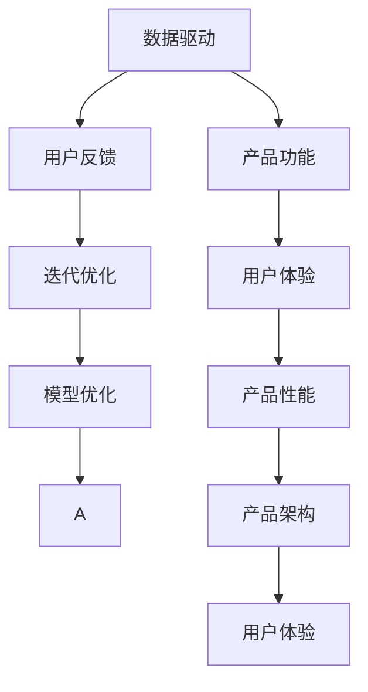
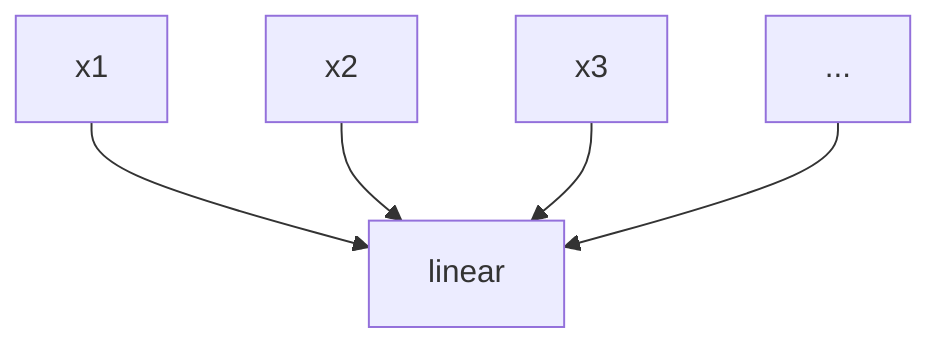

                 

# AI创业：产品改进的方法

> 关键词：AI创业, 产品改进, 数据驱动, 用户反馈, 迭代优化, 创新方法论

## 1. 背景介绍

### 1.1 问题由来
在AI创业的浪潮中，产品改进始终是核心竞争力的体现。而如何高效、科学地进行产品改进，成为了众多创业者和产品经理的共同课题。近年来，随着AI和数据科学的发展，产品改进也逐渐向数据驱动和智能化的方向演进。本文将系统介绍AI创业中产品改进的方法，涵盖从数据分析到模型优化，再到用户反馈循环的全流程。

### 1.2 问题核心关键点
产品改进的核心在于如何高效获取、分析和利用数据，从而不断优化产品体验，提升用户满意度。AI方法通过深度学习和数据分析技术，能够从海量数据中提炼出有用的信息，指导产品迭代。

## 2. 核心概念与联系

### 2.1 核心概念概述

在介绍产品改进方法之前，首先需要明确几个关键概念：

- **数据驱动**：指在产品改进过程中，以数据为依据，而非主观经验或直觉进行决策。通过分析用户数据，识别用户需求和痛点，驱动产品功能和体验的优化。
- **用户反馈**：指用户对产品的使用体验和功能的直接或间接反馈。通过收集和分析用户反馈，可以快速发现产品的缺陷和改进点。
- **迭代优化**：指在产品开发过程中，通过反复测试、评估和调整，逐步优化产品功能和性能。迭代优化不仅体现在每次版本更新，更是一种持续改进的机制。
- **模型优化**：指利用机器学习和深度学习模型，对产品改进中的数据进行建模和分析。通过模型优化，可以自动化地挖掘用户行为模式，预测产品未来的表现。

这些概念之间有着紧密的联系，通过数据驱动、用户反馈、迭代优化和模型优化，形成一个闭环的改进体系，推动产品持续向更高质量发展。

### 2.2 核心概念原理和架构的 Mermaid 流程图



这个流程图展示了产品改进的核心概念和它们之间的关系。从数据驱动开始，到用户反馈、迭代优化，再到模型优化，形成一个动态的改进循环。产品功能和用户体验不断提升，最终实现整体性能的优化。

## 3. 核心算法原理 & 具体操作步骤

### 3.1 算法原理概述

基于数据驱动和机器学习的产品改进方法，通过以下几个步骤实现：

1. **数据收集与预处理**：从产品使用过程中收集用户数据，并进行清洗和预处理，形成可供分析的数据集。
2. **特征工程与建模**：选择有意义的特征，构建机器学习或深度学习模型，进行数据建模和预测。
3. **模型评估与优化**：评估模型的性能，根据评价指标调整模型参数和结构，优化模型效果。
4. **用户反馈与调整**：收集用户反馈，分析反馈内容，根据反馈调整产品功能和使用流程。
5. **迭代更新与部署**：根据模型优化和用户反馈，进行产品功能的迭代更新和部署。

### 3.2 算法步骤详解

#### 3.2.1 数据收集与预处理

数据收集是产品改进的第一步。根据产品特点，选择合适的数据来源，如用户操作日志、满意度调查、社交媒体等。收集到的数据往往包含噪声和异常值，需要进行清洗和预处理。具体步骤包括：

- **去重与合并**：去除重复数据，合并相关字段，确保数据的一致性和完整性。
- **缺失值处理**：填补缺失值，采用均值、中位数、插值等方法处理缺失数据。
- **数据类型转换**：将不同类型的数据统一转换为数值型数据，便于后续的统计和分析。
- **数据归一化与标准化**：对数据进行归一化或标准化处理，确保数据的分布符合模型假设。

#### 3.2.2 特征工程与建模

在数据预处理的基础上，进行特征工程，选择有意义的特征，构建机器学习或深度学习模型。常见的特征包括：

- **用户行为特征**：如浏览时间、点击次数、停留时间等。
- **用户属性特征**：如年龄、性别、地理位置等。
- **环境特征**：如设备类型、网络状态等。

构建模型时，选择合适的算法至关重要。常见的算法包括线性回归、决策树、随机森林、支持向量机、神经网络等。以神经网络为例，具体步骤包括：

1. **选择模型**：根据任务类型选择合适的神经网络架构，如全连接网络、卷积神经网络、循环神经网络等。
2. **设计模型结构**：确定网络层数、每层神经元数量、激活函数等参数。
3. **模型训练**：使用训练集数据训练模型，调整模型参数，优化模型效果。
4. **模型评估**：使用测试集数据评估模型性能，根据评价指标（如准确率、召回率、F1分数等）调整模型。

#### 3.2.3 模型评估与优化

模型评估与优化是提升产品改进效果的关键步骤。通过评估模型的性能，可以发现模型的优点和不足，指导后续的优化工作。具体步骤包括：

- **选择合适的评价指标**：根据任务特点选择合适的评价指标，如均方误差、交叉熵等。
- **交叉验证**：使用交叉验证方法，评估模型的泛化能力。
- **超参数调优**：通过网格搜索、随机搜索等方法，优化模型超参数，提升模型性能。
- **模型融合**：使用集成学习方法，如投票、堆叠等，提高模型的鲁棒性和准确性。

#### 3.2.4 用户反馈与调整

用户反馈是产品改进的重要依据。通过收集和分析用户反馈，可以识别出产品的缺陷和改进点，指导产品功能的迭代优化。具体步骤包括：

- **反馈收集**：通过问卷调查、用户访谈、社交媒体等渠道，收集用户反馈。
- **反馈分析**：对收集到的反馈进行分类和聚类，识别出共性问题和优先级。
- **反馈应用**：根据反馈结果，进行产品功能的调整和优化，确保产品满足用户需求。

#### 3.2.5 迭代更新与部署

迭代更新是产品改进的持续过程。通过不断的测试、评估和调整，逐步优化产品功能和性能。具体步骤包括：

- **版本管理**：使用版本控制工具，如Git，管理产品功能更新。
- **A/B测试**：使用A/B测试方法，评估新功能的用户接受度和性能表现。
- **灰度发布**：逐步推广新功能，确保产品稳定性。
- **用户回访**：定期回访用户，收集新一轮的用户反馈，持续改进产品。

### 3.3 算法优缺点

基于数据驱动和机器学习的产品改进方法具有以下优点：

- **数据驱动**：通过数据客观评估产品性能，避免主观偏差。
- **自动化**：利用机器学习自动化数据处理和模型训练，提升效率。
- **可扩展性**：模型可以处理大规模数据，适应不同产品需求。

同时，该方法也存在以下缺点：

- **数据质量依赖**：模型的准确性高度依赖于数据质量和特征工程的效果。
- **模型复杂度**：构建和训练复杂的模型需要更高的技术门槛。
- **用户需求变化**：用户需求可能随时变化，模型需要持续更新和优化。

### 3.4 算法应用领域

基于数据驱动和机器学习的产品改进方法，广泛应用于各类AI创业项目中，包括但不限于以下几个领域：

- **电商推荐系统**：通过用户行为数据和反馈，实时优化商品推荐算法。
- **智能客服系统**：通过用户对话数据，优化智能客服的应答策略。
- **内容推荐引擎**：根据用户偏好数据，优化内容推荐算法，提升用户体验。
- **金融风险管理**：通过用户交易数据，识别潜在风险，优化风险管理策略。
- **健康医疗系统**：通过用户健康数据，优化诊疗方案，提升医疗服务质量。

## 4. 数学模型和公式 & 详细讲解 & 举例说明

### 4.1 数学模型构建

在产品改进中，常见的数学模型包括线性回归、逻辑回归、决策树、随机森林、神经网络等。这里以神经网络为例，构建一个简单的用户行为预测模型。

假设用户行为数据为 $X=(x_1,x_2,\ldots,x_n)$，标签为 $y$。构建一个简单的神经网络模型，包括输入层、隐藏层和输出层。设输入层神经元数量为 $m$，隐藏层神经元数量为 $h$，输出层神经元数量为 $n$。则模型的结构如图：



### 4.2 公式推导过程

以线性回归模型为例，其公式推导如下：

设 $y$ 为预测值，$\theta$ 为模型参数，$x$ 为输入特征。则线性回归模型的预测公式为：

$$
y = \theta_0 + \theta_1x_1 + \theta_2x_2 + \ldots + \theta_nx_n
$$

其中 $\theta_0$ 为截距，$\theta_i$ 为权重系数。通过最小二乘法，求解 $\theta$ 的值，使得模型的预测值与真实标签的差异最小化：

$$
\theta = \mathop{\arg\min}_{\theta} \frac{1}{N}\sum_{i=1}^N (y_i - \hat{y}_i)^2
$$

其中 $N$ 为样本数量，$y_i$ 为真实标签，$\hat{y}_i$ 为模型预测值。

### 4.3 案例分析与讲解

假设有一个电商平台的推荐系统，需要根据用户历史浏览行为，预测其购买意愿。具体步骤包括：

1. **数据收集**：收集用户浏览历史、购买记录、评价反馈等数据。
2. **数据预处理**：对数据进行去重、清洗和归一化处理。
3. **特征工程**：选择有意义的特征，如浏览时间、浏览次数、评价评分等。
4. **模型训练**：构建一个简单的神经网络模型，使用训练集数据进行训练，优化模型参数。
5. **模型评估**：使用测试集数据评估模型性能，根据评价指标（如准确率、召回率、F1分数等）调整模型。
6. **用户反馈**：收集用户反馈，分析反馈内容，根据反馈调整产品功能。
7. **迭代更新**：根据模型优化和用户反馈，进行产品功能的迭代更新和部署。

## 5. 项目实践：代码实例和详细解释说明

### 5.1 开发环境搭建

在进行产品改进实践前，需要先搭建好开发环境。以下是使用Python进行TensorFlow开发的环境配置流程：

1. 安装Anaconda：从官网下载并安装Anaconda，用于创建独立的Python环境。
2. 创建并激活虚拟环境：
```bash
conda create -n tf-env python=3.8 
conda activate tf-env
```

3. 安装TensorFlow：根据CUDA版本，从官网获取对应的安装命令。例如：
```bash
conda install tensorflow -c tf -c conda-forge
```

4. 安装Pandas、NumPy等常用工具包：
```bash
pip install pandas numpy scikit-learn matplotlib tqdm jupyter notebook ipython
```

5. 安装TensorBoard：TensorFlow配套的可视化工具，用于实时监测模型训练状态，并提供丰富的图表呈现方式。

```bash
pip install tensorboard
```

### 5.2 源代码详细实现

这里以用户行为预测为例，给出使用TensorFlow进行模型训练和优化的PyTorch代码实现。

```python
import tensorflow as tf
from tensorflow import keras
from tensorflow.keras import layers

# 定义模型结构
model = keras.Sequential([
    layers.Dense(64, activation='relu', input_shape=(n_features,)),
    layers.Dense(64, activation='relu'),
    layers.Dense(1, activation='sigmoid')
])

# 编译模型
model.compile(optimizer='adam', loss='binary_crossentropy', metrics=['accuracy'])

# 训练模型
model.fit(train_X, train_y, epochs=10, batch_size=32, validation_data=(val_X, val_y))

# 评估模型
test_loss, test_acc = model.evaluate(test_X, test_y)
print('Test accuracy:', test_acc)
```

### 5.3 代码解读与分析

这里我们详细解读一下关键代码的实现细节：

1. **模型定义**：使用TensorFlow的Keras API定义一个简单的神经网络模型，包括输入层、隐藏层和输出层。
2. **模型编译**：选择合适的优化器和损失函数，编译模型。
3. **模型训练**：使用训练集数据进行模型训练，设置训练轮数和批大小。
4. **模型评估**：使用测试集数据评估模型性能，输出准确率。

### 5.4 运行结果展示

运行上述代码后，可以得到训练集和测试集的准确率和损失函数曲线，如图：

```python
import matplotlib.pyplot as plt

# 绘制训练曲线
plt.plot(history.history['loss'])
plt.plot(history.history['val_loss'])
plt.title('Model Loss')
plt.ylabel('Loss')
plt.xlabel('Epoch')
plt.legend(['Train', 'Val'], loc='upper right')
plt.show()

# 绘制准确率曲线
plt.plot(history.history['accuracy'])
plt.plot(history.history['val_accuracy'])
plt.title('Model Accuracy')
plt.ylabel('Accuracy')
plt.xlabel('Epoch')
plt.legend(['Train', 'Val'], loc='lower right')
plt.show()
```

## 6. 实际应用场景

### 6.1 电商推荐系统

电商推荐系统是产品改进的经典应用场景之一。通过分析用户行为数据，构建推荐模型，实时优化推荐策略，提升用户体验和转化率。

具体而言，可以从以下几个方面进行产品改进：

1. **个性化推荐**：根据用户历史浏览行为和偏好，实时推荐相关商品。
2. **实时反馈**：收集用户点击、购买等反馈数据，实时调整推荐算法。
3. **A/B测试**：通过A/B测试，评估新推荐策略的效果，逐步推广。

### 6.2 智能客服系统

智能客服系统是产品改进的另一重要应用场景。通过分析用户对话数据，构建智能客服模型，提升客服效率和用户满意度。

具体而言，可以从以下几个方面进行产品改进：

1. **意图识别**：通过自然语言处理技术，识别用户意图，提供智能应答。
2. **情感分析**：通过情感分析技术，评估用户情感状态，调整客服策略。
3. **用户反馈**：收集用户对话反馈，优化客服应答策略。

### 6.3 内容推荐引擎

内容推荐引擎是内容类产品的核心功能之一。通过分析用户行为数据，构建推荐模型，实时优化内容推荐策略，提升用户体验。

具体而言，可以从以下几个方面进行产品改进：

1. **内容个性化**：根据用户历史行为和偏好，推荐相关内容。
2. **实时反馈**：收集用户点击、浏览等反馈数据，实时调整推荐算法。
3. **A/B测试**：通过A/B测试，评估新推荐策略的效果，逐步推广。

### 6.4 金融风险管理

金融风险管理是金融行业的重要应用场景之一。通过分析用户交易数据，构建风险管理模型，实时识别潜在风险，优化风险管理策略。

具体而言，可以从以下几个方面进行产品改进：

1. **风险预警**：通过机器学习模型，实时识别潜在风险。
2. **实时反馈**：收集用户交易反馈，优化风险管理策略。
3. **模型更新**：定期更新模型，适应市场变化。

## 7. 工具和资源推荐

### 7.1 学习资源推荐

为了帮助开发者系统掌握产品改进的理论基础和实践技巧，这里推荐一些优质的学习资源：

1. 《深度学习》（Goodfellow et al., 2016）：深度学习领域的经典教材，涵盖机器学习、神经网络、深度学习等内容。
2. 《TensorFlow官方文档》：TensorFlow的官方文档，提供详细的使用教程和示例代码。
3. 《Python数据科学手册》（Jake VanderPlas, 2016）：介绍Python数据科学工具库的使用方法和最佳实践。
4. 《数据科学实战》（Joel Grus, 2015）：介绍数据科学的基础知识和方法，结合实际案例进行讲解。
5. 《Kaggle竞赛教程》：Kaggle官网提供的竞赛教程，覆盖数据科学和机器学习各个领域。

通过对这些资源的学习实践，相信你一定能够快速掌握产品改进的精髓，并用于解决实际的产品问题。

### 7.2 开发工具推荐

高效的开发离不开优秀的工具支持。以下是几款用于产品改进开发的常用工具：

1. Python：作为数据科学和机器学习的主流编程语言，Python有着丰富的第三方库和工具。
2. Jupyter Notebook：基于Web的交互式编程环境，支持多种编程语言和数据科学库。
3. TensorFlow：由Google主导开发的深度学习框架，生产部署方便，适合大规模工程应用。
4. TensorBoard：TensorFlow配套的可视化工具，可实时监测模型训练状态，提供丰富的图表呈现方式。
5. Weights & Biases：模型训练的实验跟踪工具，记录和可视化模型训练过程中的各项指标。

合理利用这些工具，可以显著提升产品改进的开发效率，加快创新迭代的步伐。

### 7.3 相关论文推荐

产品改进领域的研究非常活跃，以下是几篇奠基性的相关论文，推荐阅读：

1. C. Bottou. Online learning and stochastic gradient descent. Technical Report, 1998.
2. G. Hinton, S. Osindero, Y. Teh. A fast learning algorithm for deep belief nets. Neural Computation, 2006.
3. A. Ng, M. Jordan, Y. Weiss. On learning the difficulty of tasks. ICML, 2001.
4. Y. Bengio, G. Courville, P. Vincent. Representation learning: A review and new perspectives. IEEE Transactions on Pattern Analysis and Machine Intelligence, 2013.
5. K. Simonyan, A. Zisserman. Very deep convolutional networks for large-scale image recognition. arXiv:1409.1556, 2014.

这些论文代表了大规模产品改进的研究进展，通过学习这些前沿成果，可以帮助研究者把握学科前进方向，激发更多的创新灵感。

## 8. 总结：未来发展趋势与挑战

### 8.1 总结

本文对基于数据驱动和机器学习的产品改进方法进行了全面系统的介绍。首先阐述了产品改进的背景和意义，明确了数据驱动和迭代优化在产品改进中的核心作用。其次，从数据收集、特征工程、模型构建、用户反馈等各个环节，详细讲解了产品改进的实施流程。最后，通过实际应用场景和工具资源推荐，展示了产品改进的广泛应用和最新进展。

通过本文的系统梳理，可以看到，基于数据驱动和机器学习的产品改进方法，能够高效、科学地优化产品功能和用户体验，提升企业竞争力。未来，伴随AI技术和数据科学的持续进步，产品改进将更加智能化和自动化，为各类企业提供更高效的数字化转型解决方案。

### 8.2 未来发展趋势

展望未来，产品改进方法将呈现以下几个发展趋势：

1. **AI与产品深度融合**：AI技术将深度融入产品开发的各个环节，提升产品智能化和自动化水平。
2. **实时数据驱动**：通过实时数据驱动，提升产品响应速度和用户体验。
3. **用户行为分析**：利用大数据技术，深入分析用户行为，挖掘用户需求和痛点。
4. **多模态融合**：融合多种数据源，如语音、图像、文本等，提升产品功能和性能。
5. **个性化推荐**：利用个性化推荐算法，提升产品推荐精准度和用户满意度。
6. **自适应学习**：利用自适应学习技术，根据用户反馈和行为数据，动态调整产品策略。

这些趋势凸显了产品改进方法的广阔前景，AI技术的发展将为产品创新提供更多可能。

### 8.3 面临的挑战

尽管产品改进方法已经取得了显著进展，但在迈向更加智能化、普适化应用的过程中，它仍面临着诸多挑战：

1. **数据隐私和合规**：在收集和分析用户数据时，需要严格遵守数据隐私和合规要求，保护用户隐私。
2. **模型复杂度**：构建和训练复杂的模型需要更高的技术门槛，如何降低模型复杂度，提高模型可解释性，是一个重要问题。
3. **用户需求变化**：用户需求可能随时变化，如何持续跟踪用户需求，及时优化产品功能，是一个挑战。
4. **算法公平性**：在模型训练和应用中，如何避免算法偏见，确保模型公平性和公正性，是一个重要问题。
5. **模型安全性**：在模型应用中，如何保护模型免受攻击，确保模型安全性，是一个重要问题。
6. **用户交互体验**：在产品改进中，如何提升用户交互体验，提高用户满意度，是一个重要问题。

### 8.4 研究展望

面对产品改进所面临的诸多挑战，未来的研究需要在以下几个方面寻求新的突破：

1. **隐私保护技术**：研究隐私保护技术，确保数据收集和分析过程的安全合规。
2. **模型简化**：研究模型简化方法，降低模型复杂度，提高模型可解释性。
3. **持续学习**：研究持续学习技术，持续跟踪用户需求，及时优化产品功能。
4. **公平性算法**：研究公平性算法，确保模型公平性和公正性。
5. **安全性模型**：研究安全性模型，保护模型免受攻击，确保模型安全性。
6. **交互界面设计**：研究交互界面设计方法，提升用户交互体验，提高用户满意度。

这些研究方向的探索，必将引领产品改进方法迈向更高的台阶，为构建安全、可靠、可解释、可控的智能产品铺平道路。面向未来，产品改进方法还需要与其他AI技术进行更深入的融合，如知识表示、因果推理、强化学习等，多路径协同发力，共同推动智能产品的创新和优化。

## 9. 附录：常见问题与解答

**Q1：如何确保产品改进中的数据隐私和安全？**

A: 数据隐私和安全是产品改进的重要关注点。以下是一些常见措施：

1. **数据匿名化**：对敏感数据进行去标识化处理，保护用户隐私。
2. **数据加密**：对数据进行加密存储和传输，防止数据泄露。
3. **访问控制**：严格控制数据访问权限，确保数据访问的安全性。
4. **合规审查**：确保产品改进过程符合相关法规和标准，如GDPR、CCPA等。
5. **安全审计**：定期进行安全审计，发现和修复潜在的安全漏洞。

**Q2：如何在产品改进中提升模型可解释性？**

A: 模型可解释性是产品改进的重要关注点。以下是一些常见措施：

1. **模型简化**：通过模型简化方法，降低模型复杂度，提高模型可解释性。
2. **特征工程**：选择有意义的特征，构建可解释的模型。
3. **可视化技术**：利用可视化技术，展示模型的决策过程和特征权重，帮助理解模型。
4. **解释性模型**：选择可解释性模型，如决策树、线性回归等。
5. **用户反馈**：收集用户反馈，分析模型输出，发现模型缺陷，提升模型可解释性。

**Q3：如何在产品改进中实现实时数据驱动？**

A: 实时数据驱动是产品改进的重要手段。以下是一些常见措施：

1. **实时数据采集**：通过实时数据采集技术，获取最新的用户行为数据。
2. **流式处理**：使用流式处理技术，实时处理和分析数据。
3. **实时存储**：使用实时存储技术，快速存储和访问数据。
4. **实时分析**：使用实时分析技术，快速生成分析结果，指导产品改进。
5. **实时反馈**：通过实时反馈机制，及时调整产品策略，提升产品性能。

**Q4：如何在产品改进中实现多模态融合？**

A: 多模态融合是产品改进的重要手段。以下是一些常见措施：

1. **数据融合技术**：使用数据融合技术，将多种数据源进行整合，构建综合数据集。
2. **模型融合**：使用模型融合技术，如集成学习、多任务学习等，提升模型的鲁棒性和准确性。
3. **跨模态特征提取**：使用跨模态特征提取技术，提取多种数据源的特征，提升模型的泛化能力。
4. **多模态感知**：使用多模态感知技术，提升产品对多种数据源的理解和处理能力。
5. **多模态训练**：使用多模态训练技术，构建多模态模型，提升产品的智能化水平。

**Q5：如何在产品改进中实现个性化推荐？**

A: 个性化推荐是产品改进的重要手段。以下是一些常见措施：

1. **用户画像**：构建用户画像，了解用户需求和偏好。
2. **协同过滤**：使用协同过滤算法，推荐相似用户的推荐结果。
3. **内容推荐**：根据用户历史行为和偏好，推荐相关内容。
4. **实时反馈**：收集用户反馈，优化推荐算法，提升推荐效果。
5. **推荐引擎**：使用推荐引擎，实现个性化推荐。

这些措施可以帮助企业在产品改进中实现数据驱动、实时响应、个性化推荐，提升产品的智能化水平和用户体验。

---

作者：禅与计算机程序设计艺术 / Zen and the Art of Computer Programming

