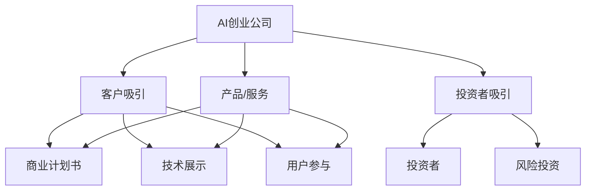

                 

# AI创业：吸引客户和投资者

> 关键词：AI创业, 客户吸引, 投资者, 商业计划, 技术展示, 用户参与

## 1. 背景介绍

### 1.1 问题由来

随着人工智能（AI）技术的不断成熟，越来越多的创业公司开始将AI技术应用于产品和服务中，以期在竞争激烈的市场中获得优势。然而，对于大多数AI初创公司来说，如何吸引客户和投资者，是一个至关重要但又极具挑战性的问题。本文将从理论和实践两个层面，深入探讨如何有效吸引客户和投资者，帮助AI创业公司在激烈的市场竞争中脱颖而出。

### 1.2 问题核心关键点

AI创业公司吸引客户和投资者主要依赖以下三个关键点：

- **技术领先性**：展示公司技术的独特性和创新性，明确其市场竞争优势。
- **市场应用潜力**：突出产品或服务在实际应用中的潜力和价值，展示其在市场上的应用场景和需求。
- **商业模式**：清晰、可持续的商业模式，确保公司在市场上的长期生存和发展。

## 2. 核心概念与联系

### 2.1 核心概念概述

为更好地理解如何吸引客户和投资者，本节将介绍几个核心概念及其之间的联系：

- **AI创业公司**：指专注于AI技术开发、应用和商业化的创业公司，包括计算机视觉、自然语言处理、机器学习等领域的公司。
- **客户吸引**：指通过市场推广、产品展示等手段，吸引潜在客户关注和参与，形成稳定的用户基础。
- **投资者吸引**：指通过展示公司潜力、市场前景和财务规划，吸引风险投资家和其他投资者的关注和投资。
- **商业计划书**：系统阐述公司的核心技术、市场应用、商业模式和财务预测等，是吸引客户和投资者的重要工具。
- **技术展示**：通过技术演示、开源项目、学术成果等方式，展示公司技术的实力和创新性。
- **用户参与**：通过社群建设、社区论坛、用户反馈等方式，增加用户对产品的参与感和黏性。

这些概念之间的逻辑关系可以通过以下Mermaid流程图来展示：



这个流程图展示了AI创业公司的核心概念及其之间的关系：

1. AI创业公司通过产品/服务作为载体，进行客户吸引和投资者吸引。
2. 客户吸引和投资者吸引分别涉及商业计划书、技术展示和用户参与等具体手段。
3. 投资者关注公司产品、技术潜力和商业模式，风险投资家和资本市场是主要的资金来源。

## 3. 核心算法原理 & 具体操作步骤

### 3.1 算法原理概述

吸引客户和投资者本质上是一个复杂的市场营销和商业决策过程。其核心原理可以概括为：

- **客户获取模型（Customer Acquisition Model）**：通过分析客户行为、市场趋势和竞争环境，建立预测客户吸引效果的数学模型。
- **投资回报模型（Investment Return Model）**：基于投资者对回报率、风险偏好和投资周期的关注，建立预测投资回报的数学模型。
- **综合决策模型（Comprehensive Decision Model）**：将客户获取和投资回报模型结合起来，形成综合决策框架，指导AI创业公司的市场营销和筹资活动。

### 3.2 算法步骤详解

以下是吸引客户和投资者的详细步骤：

**Step 1: 市场调研与目标客户分析**

- 确定目标市场：分析行业趋势、竞争对手和潜在客户需求，定位目标客户群体。
- 客户行为分析：通过问卷调查、用户访谈等方式，收集目标客户的行为数据和偏好信息。
- 市场规模估算：分析目标市场的规模、增长率和潜力，估算市场机会和收益。

**Step 2: 商业计划书制定**

- 核心技术介绍：详细描述公司的技术优势、创新点和发展路线图。
- 市场应用分析：展示产品在目标市场的应用场景、需求和价值。
- 商业模式设计：明确收入来源、成本结构、盈利模式和可持续发展策略。
- 财务预测：基于市场分析和商业模式，进行财务预测，展示公司的盈利能力和发展潜力。

**Step 3: 技术展示与产品演示**

- 技术论文和专利：撰写和发布高影响力的学术论文、技术专利，展示技术实力。
- 开源项目和代码贡献：通过GitHub等平台，发布开源项目和代码，吸引开发者和社区支持。
- 技术演示与体验：举办技术沙龙、线上线下演示活动，展示产品的实际应用效果。

**Step 4: 客户吸引与市场推广**

- 数字营销策略：利用搜索引擎优化（SEO）、社交媒体、内容营销等方式，增加品牌曝光和流量。
- 客户关系管理（CRM）：建立客户关系管理系统，跟踪客户互动和反馈，提升用户体验和忠诚度。
- 渠道合作：与行业合作伙伴、销售渠道建立合作关系，扩大市场覆盖和销售渠道。

**Step 5: 投资者吸引与融资策略**

- 投资价值评估：通过技术评估、市场分析和财务预测，展示公司的投资价值。
- 路演和推介会：参加行业会议、创投展会，进行项目推介，吸引投资者关注。
- 财务计划和风险控制：制定详细的财务计划和风险控制策略，确保资金使用效率和风险可控。

**Step 6: 用户参与与社群建设**

- 社区论坛与用户反馈：建立在线社区和论坛，收集用户反馈和建议，持续改进产品。
- 用户参与活动：举办黑客松、开发者大会等活动，增强用户参与感和社区凝聚力。
- 客户支持与售后服务：提供优质的客户支持和售后服务，建立良好的用户关系和口碑。

### 3.3 算法优缺点

吸引客户和投资者的算法具有以下优点：

- **系统化与量化**：通过建立数学模型和量化分析，帮助公司更加系统和科学地决策，提升市场推广和投资决策的准确性。
- **数据驱动**：基于实证数据和市场分析，使决策更加客观和可验证，减少主观偏见。
- **灵活性**：模型可以根据市场变化进行调整和优化，适应不同阶段的市场需求和投资环境。

但该算法也存在一些缺点：

- **复杂性**：建立和维护一个全面的商业计划书和综合决策模型，需要投入大量资源和时间。
- **不确定性**：市场和技术环境瞬息万变，模型的预测结果可能存在一定的偏差。
- **数据依赖**：模型的有效性依赖于高质量的数据和准确的分析，数据质量不佳可能导致决策失误。

### 3.4 算法应用领域

吸引客户和投资者的算法广泛应用于以下几个领域：

- **AI初创公司**：用于帮助初创公司制定市场推广和投资策略，提升客户吸引力和投资者信心。
- **数字营销**：通过量化分析优化数字营销策略，提高品牌曝光和流量转化率。
- **风险投资**：帮助风险投资家评估项目的投资价值和风险，做出更明智的投资决策。
- **企业战略规划**：企业利用综合决策模型，制定长期战略和年度计划，提升整体竞争力。

## 4. 数学模型和公式 & 详细讲解 & 举例说明

### 4.1 数学模型构建

本节将通过数学语言对吸引客户和投资者的算法进行更加严格的刻画。

设目标市场规模为 $M$，公司产品或服务的需求量为 $D$，客户获取成本为 $C$，投资回报率为 $R$。构建客户获取模型和投资回报模型如下：

- **客户获取模型（Customer Acquisition Model）**：
$$
\text{净收益} = D \times R - C \times M
$$

- **投资回报模型（Investment Return Model）**：
$$
\text{投资回报率} = \frac{D \times R}{C \times M}
$$

### 4.2 公式推导过程

以上公式可以进一步推导，以分析不同因素对客户吸引和投资回报的影响：

1. **需求量提升**：通过技术创新、市场营销等手段提升产品或服务的需求量 $D$，从而提高净收益和投资回报率。
2. **客户获取成本降低**：通过优化推广策略、改进客户关系管理等手段降低客户获取成本 $C$，提升净收益和投资回报率。
3. **市场规模扩大**：通过拓展新市场、进入新领域等方式扩大市场规模 $M$，提升净收益和投资回报率。

### 4.3 案例分析与讲解

假设某AI创业公司针对特定市场开发了一款自然语言处理产品，其需求量为 $D=1000$，客户获取成本为 $C=100$，市场规模为 $M=5000$。设投资回报率为 $R=0.3$，则：

- **净收益**：
$$
\text{净收益} = 1000 \times 0.3 - 100 \times 5000 = 300 - 50000 = -49700
$$

- **投资回报率**：
$$
\text{投资回报率} = \frac{1000 \times 0.3}{100 \times 5000} = 0.006
$$

分析发现，当前模型下的净收益为负，投资回报率低，说明公司需要进行市场扩展和客户获取成本的优化。

## 5. 项目实践：代码实例和详细解释说明

### 5.1 开发环境搭建

在进行AI创业公司的市场推广和投资吸引实践前，我们需要准备好开发环境。以下是使用Python进行商业计划书和投资分析的开发环境配置流程：

1. 安装Anaconda：从官网下载并安装Anaconda，用于创建独立的Python环境。

2. 创建并激活虚拟环境：
```bash
conda create -n business-analysis python=3.8 
conda activate business-analysis
```

3. 安装相关库：
```bash
conda install pandas numpy matplotlib scikit-learn plotly jupyter notebook ipython
```

完成上述步骤后，即可在`business-analysis`环境中开始商业计划书和投资分析的开发工作。

### 5.2 源代码详细实现

这里我们以商业计划书为例，展示如何利用Python进行客户吸引和投资者吸引的分析和展示。

**商业计划书模板**：

```python
from IPython.display import HTML

class BusinessPlan:
    def __init__(self, market_size, demand, cost):
        self.market_size = market_size
        self.demand = demand
        self.cost = cost
    
    def net_profit(self):
        return self.demand * 0.3 - self.cost * self.market_size
    
    def investment_return_rate(self):
        return self.demand * 0.3 / (self.cost * self.market_size)
    
    def render(self):
        HTML('''
        <h2>Business Plan</h2>
        <p>Market Size: {{self.market_size}}</p>
        <p>Demand: {{self.demand}}</p>
        <p>Cost: {{self.cost}}</p>
        <p>Net Profit: {{self.net_profit()}}</p>
        <p>Investment Return Rate: {{self.investment_return_rate()}}</p>
        '''.format(self=self))

bp = BusinessPlan(5000, 1000, 100)
bp.render()
```

**投资分析工具**：

```python
import plotly.graph_objects as go

def investment_analysis(plan, factor):
    market_size = plan.market_size
    demand = plan.demand
    cost = plan.cost
    
    factor *= market_size
    
    return htmlrender(plan, market_size, demand, factor, 'Investment Analysis')

def htmlrender(plan, market_size, demand, factor, title):
    html = '''
        <h2>{}</h2>
        <p>Market Size: {}</p>
        <p>Demand: {}</p>
        <p>Factor: {}</p>
        <p>Net Profit: {} * {} - {} * {} = {}</p>
        <p>Investment Return Rate: {} * {} / {} = {}</p>
        <p>''' .format(title, market_size, demand, factor, demand, 0.3, factor, cost, market_size, demand * 0.3, market_size, cost)
    
    return html
```

完成以上代码后，在Jupyter Notebook中运行，即可得到详细的商业计划书和投资分析结果。

### 5.3 代码解读与分析

让我们再详细解读一下关键代码的实现细节：

**BusinessPlan类**：
- `__init__`方法：初始化市场规模、需求和成本。
- `net_profit`方法：计算净收益。
- `investment_return_rate`方法：计算投资回报率。
- `render`方法：将计算结果以HTML格式展示。

**htmlrender函数**：
- 接收商业计划书实例、市场规模、需求和增长因子，计算净收益和投资回报率。
- 生成HTML格式的字符串，展示计算结果。

**投资分析工具函数**：
- 接收商业计划书实例和增长因子，计算市场规模和需求变化后的净收益和投资回报率。
- 将结果以HTML格式展示。

**代码运行结果**：
```bash
Markdown:
```
    Markdown:
    ```python
    class BusinessPlan:
    def __init__(self, market_size, demand, cost):
        self.market_size = market_size
        self.demand = demand
        self.cost = cost
    
    def net_profit(self):
        return self.demand * 0.3 - self.cost * self.market_size
    
    def investment_return_rate(self):
        return self.demand * 0.3 / (self.cost * self.market_size)
    
    def render(self):
        HTML('''
        <h2>Business Plan</h2>
        <p>Market Size: {{self.market_size}}</p>
        <p>Demand: {{self.demand}}</p>
        <p>Cost: {{self.cost}}</p>
        <p>Net Profit: {{self.net_profit()}}</p>
        <p>Investment Return Rate: {{self.investment_return_rate()}}</p>
        '''.format(self=self))

    bp = BusinessPlan(5000, 1000, 100)
    bp.render()
    ```

    ```python
    import plotly.graph_objects as go

    def investment_analysis(plan, factor):
        market_size = plan.market_size
        demand = plan.demand
        cost = plan.cost
    
        factor *= market_size
    
        return htmlrender(plan, market_size, demand, factor, 'Investment Analysis')

    def htmlrender(plan, market_size, demand, factor, title):
        html = '''
            <h2>{}</h2>
            <p>Market Size: {}</p>
            <p>Demand: {}</p>
            <p>Factor: {}</p>
            <p>Net Profit: {} * {} - {} * {} = {}</p>
            <p>Investment Return Rate: {} * {} / {} = {}</p>
            <p>'''.format(title, market_size, demand, factor, demand, 0.3, factor, cost, market_size, demand * 0.3, market_size, cost)
    
        return html
    ```

通过这些代码示例，可以清晰地展示如何利用Python进行商业计划书和投资分析的计算和展示。在实际应用中，还需要根据具体需求进行进一步的扩展和优化。

## 6. 实际应用场景

### 6.1 数字营销

AI创业公司可以借助数字化营销手段，如社交媒体广告、搜索引擎优化、内容营销等，快速提升品牌曝光和用户转化。例如，利用程序化广告平台进行定向投放，通过数据分析优化广告预算和策略，实现精准投放和效果跟踪。同时，通过内容营销，撰写高质量的技术文章、案例分析和用户指南，吸引目标客户关注和参与。

### 6.2 产品演示与用户体验

产品演示是展示AI技术实力和应用效果的重要手段。创业公司可以通过技术沙龙、黑客松、线上直播等方式，向客户和投资者展示产品的实际应用效果和潜在使用场景。同时，注重用户体验和反馈，通过在线问卷、用户访谈等方式，收集用户反馈和建议，持续改进产品。

### 6.3 投资与融资

吸引投资者是AI创业公司成长的重要环节。创业公司可以通过路演、创业大赛、创投展会等方式，展示公司的技术实力和市场潜力，吸引投资者关注和投资。同时，制定详细的财务计划和风险控制策略，确保资金使用效率和风险可控。

## 7. 工具和资源推荐

### 7.1 学习资源推荐

为了帮助开发者系统掌握AI创业的理论与实践，这里推荐一些优质的学习资源：

1. **《AI创业指南》**：详细介绍了AI创业的各个环节，包括市场调研、产品开发、市场营销和融资策略等。
2. **《AI商业化实战》**：通过具体案例，展示AI技术在实际应用中的商业化路径和挑战。
3. **《数字营销圣经》**：全面介绍了数字营销的各个方面，包括搜索引擎优化、社交媒体营销、内容营销等。
4. **《商业计划书写作》**：系统讲解了如何撰写高质量的商业计划书，吸引投资者关注和投资。
5. **《投资评估与财务分析》**：详细介绍了投资评估和财务分析的各个方面，帮助创业者制定科学合理的投资计划。

通过对这些资源的学习实践，相信你一定能够系统掌握AI创业的关键环节，并用于解决实际的商业问题。

### 7.2 开发工具推荐

高效的开发离不开优秀的工具支持。以下是几款用于AI创业开发和营销推广的工具：

1. **Anaconda**：用于创建和管理Python环境，方便进行数据分析和商业计划书编写。
2. **Jupyter Notebook**：开源的交互式笔记本环境，适合进行数据处理、模型分析和可视化展示。
3. **GitHub**：代码托管和版本控制平台，方便团队协作和开源项目的维护。
4. **Hootsuite**：社交媒体管理工具，支持多平台管理、数据监测和分析。
5. **Google Analytics**：网站流量分析工具，提供详细的用户行为数据和优化建议。
6. **Crowdfunding Platforms**：如Kickstarter、Indiegogo等，通过众筹平台展示产品，吸引早期投资者和用户支持。

合理利用这些工具，可以显著提升AI创业公司的市场推广和投资吸引能力，加快产品开发和商业化进程。

### 7.3 相关论文推荐

AI创业的吸引客户和投资者理论研究涉及多个方面，以下是几篇代表性的论文，推荐阅读：

1. **《AI创业中的技术创新与商业模式》**：探讨AI创业公司如何通过技术创新和商业模式设计，获得市场竞争优势。
2. **《数字营销对AI创业公司的影响》**：分析数字营销策略在AI创业公司中的应用效果和优化方法。
3. **《投资评估模型的构建与应用》**：介绍如何构建和应用投资回报模型，评估AI创业公司的投资价值。
4. **《用户参与和社区建设》**：研究用户参与和社群建设对AI创业公司产品发展和用户黏性的影响。

这些论文代表了AI创业研究的发展脉络，通过学习这些前沿成果，可以帮助研究者把握学科前进方向，激发更多的创新灵感。

## 8. 总结：未来发展趋势与挑战

### 8.1 总结

本文对AI创业公司如何吸引客户和投资者进行了全面系统的介绍。首先阐述了吸引客户和投资者的重要性和关键点，明确了技术领先性、市场应用潜力和商业模式的重要性。其次，从原理到实践，详细讲解了吸引客户和投资者的数学模型和操作步骤，提供了系统化的分析和工具支持。同时，本文还广泛探讨了数字营销、产品演示和投资吸引等实际应用场景，展示了微调范式的巨大潜力。此外，本文精选了市场推广和投资分析的各类学习资源，力求为读者提供全方位的技术指引。

通过本文的系统梳理，可以看到，吸引客户和投资者是AI创业公司成长的关键环节，只有科学合理的市场推广和投资策略，才能在激烈的市场竞争中脱颖而出。未来，伴随AI技术的不断成熟和市场环境的不断变化，吸引客户和投资者的理论和实践将不断进步，为AI创业公司提供更加科学、高效、可行的指导。

### 8.2 未来发展趋势

展望未来，AI创业公司在吸引客户和投资者方面将呈现以下几个发展趋势：

1. **技术智能化**：利用AI技术进行市场调研和客户分析，提升数据分析和决策的精准性和智能化水平。
2. **市场全球化**：通过数字营销和产品演示，拓展全球市场，提升品牌国际影响力。
3. **投资多元化**：探索多种融资渠道，如众筹、债券、股权等，实现融资方式的多样化。
4. **用户参与深化**：利用社群和社区建设，增强用户参与感和忠诚度，提升用户口碑和品牌效应。
5. **数据驱动决策**：通过大数据分析和AI算法，提升市场推广和投资决策的科学性和精准性。

以上趋势凸显了AI创业公司在吸引客户和投资者方面的广阔前景，通过技术创新和市场策略的不断优化，AI创业公司必将在全球市场中占据更加重要的位置。

### 8.3 面临的挑战

尽管AI创业公司在吸引客户和投资者方面取得了一定进展，但在迈向更加智能化、全球化和多元化的过程中，仍面临诸多挑战：

1. **数据质量问题**：数据的不确定性和噪声可能影响分析结果，需要持续优化数据采集和处理流程。
2. **市场竞争激烈**：AI创业公司需要在激烈的市场竞争中脱颖而出，需要不断创新和优化产品。
3. **投资风险高**：高投入和高风险是创业公司面临的普遍问题，需要通过科学的投资决策和风险控制策略，降低投资风险。
4. **用户参与度低**：如何持续提升用户参与度和黏性，形成稳定的用户基础，是创业公司面临的重要挑战。
5. **法规与伦理**：AI技术在应用过程中可能面临的法规和伦理问题，需要合规经营和道德考量。

### 8.4 研究展望

未来研究需要在以下几个方面寻求新的突破：

1. **多渠道市场推广**：探索和整合多种市场推广渠道，实现精准投放和效果跟踪。
2. **用户行为分析**：深入挖掘用户行为数据，洞察用户需求和偏好，指导产品开发和市场推广。
3. **投资回报模型优化**：结合市场数据和商业计划，构建更加科学合理的投资回报模型，提高投资决策的准确性。
4. **用户参与机制设计**：设计有效的用户参与机制，增强用户黏性和社区建设，提升品牌效应。
5. **法规与伦理研究**：研究AI技术在应用中的法规和伦理问题，确保合规经营和道德考量。

这些研究方向将帮助AI创业公司更好地吸引客户和投资者，实现技术创新和市场扩展，推动人工智能技术的普及和应用。

## 9. 附录：常见问题与解答

**Q1：AI创业公司如何选择合适的市场调研方法和工具？**

A: 选择合适的市场调研方法和工具需要综合考虑以下几个因素：

1. **目标市场**：根据目标市场特征和客户需求，选择适合的调研方法。例如，B2B市场可以使用问卷调查、深度访谈等方式；B2C市场可以使用在线调研、社交媒体分析等方法。
2. **调研成本**：调研方法的选择应兼顾成本和效果，如在线调研、大数据分析等方法成本较低，但数据质量和深度可能不足。
3. **调研深度**：深度调研应选择质性研究方法，如深度访谈、焦点小组等，以获取更详细、深入的市场信息和客户反馈。

常用的市场调研工具包括SurveyMonkey、Qualtrics、Tableau等，可根据具体需求进行选择。

**Q2：如何通过数字营销提升品牌曝光和用户转化？**

A: 数字营销是提升品牌曝光和用户转化的重要手段。以下是一些有效的方法：

1. **内容营销**：通过撰写高质量的技术文章、案例分析和用户指南，吸引目标客户关注和参与。
2. **社交媒体营销**：利用社交媒体平台，进行定向广告投放和用户互动，提高品牌曝光和用户转化率。
3. **搜索引擎优化**：通过优化网站和内容，提升在搜索引擎中的排名，增加自然流量。
4. **程序化广告**：通过程序化广告平台，进行精准投放和效果跟踪，实现高效的用户转化。
5. **数据分析**：利用数据分析工具，如Google Analytics、Tableau等，分析用户行为数据，优化营销策略。

**Q3：如何通过产品演示和用户体验提升客户吸引和投资吸引？**

A: 产品演示和用户体验是提升客户吸引和投资吸引的重要环节。以下是一些有效的方法：

1. **技术沙龙和黑客松**：举办技术沙龙、黑客松等活动，展示产品的实际应用效果和潜在使用场景。
2. **线上直播和演示**：通过线上直播和演示，向客户和投资者展示产品的功能和优势。
3. **用户体验调研**：通过在线问卷、用户访谈等方式，收集用户反馈和建议，持续改进产品。
4. **社区建设和互动**：建立在线社区和论坛，增加用户参与感和忠诚度，提升用户体验和满意度。
5. **客户支持和服务**：提供优质的客户支持和售后服务，建立良好的用户关系和口碑。

**Q4：如何制定科学的商业计划书和投资回报模型？**

A: 制定科学的商业计划书和投资回报模型需要遵循以下步骤：

1. **市场调研**：通过问卷调查、用户访谈等方式，收集市场数据和客户需求。
2. **需求分析**：分析市场需求和趋势，确定产品或服务的需求量和增长潜力。
3. **成本分析**：估算产品开发、市场推广和运营成本，明确成本结构。
4. **收益预测**：基于市场需求和成本结构，进行收益预测，明确盈利模式和财务计划。
5. **风险评估**：识别和评估市场风险和运营风险，制定风险控制策略。
6. **数据驱动**：利用大数据分析和AI算法，提升市场推广和投资决策的科学性和精准性。

**Q5：如何通过数字化营销吸引和转化潜在客户？**

A: 数字化营销是吸引和转化潜在客户的重要手段。以下是一些有效的方法：

1. **搜索引擎优化**：通过优化网站和内容，提升在搜索引擎中的排名，增加自然流量。
2. **社交媒体营销**：利用社交媒体平台，进行定向广告投放和用户互动，提高品牌曝光和用户转化率。
3. **内容营销**：通过撰写高质量的技术文章、案例分析和用户指南，吸引目标客户关注和参与。
4. **程序化广告**：通过程序化广告平台，进行精准投放和效果跟踪，实现高效的用户转化。
5. **数据分析**：利用数据分析工具，如Google Analytics、Tableau等，分析用户行为数据，优化营销策略。

这些方法可以帮助AI创业公司通过数字化营销手段，吸引和转化潜在客户，提升品牌影响力和市场占有率。

通过本文的系统梳理，可以看到，吸引客户和投资者是AI创业公司成长的关键环节，只有科学合理的市场推广和投资策略，才能在激烈的市场竞争中脱颖而出。未来，伴随AI技术的不断成熟和市场环境的不断变化，吸引客户和投资者的理论和实践将不断进步，为AI创业公司提供更加科学、高效、可行的指导。相信通过不断创新和优化，AI创业公司必将在全球市场中占据更加重要的位置。

---

作者：禅与计算机程序设计艺术 / Zen and the Art of Computer Programming

