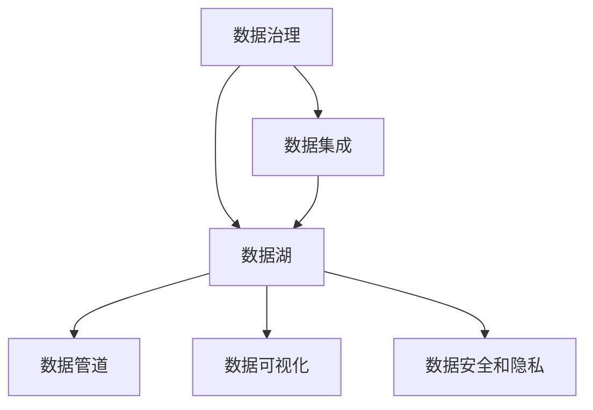

                 

# AI创业：数据管理的成功方法

> 关键词：数据管理, AI创业, 数据处理, 数据策略, 数据隐私

## 1. 背景介绍

在人工智能（AI）蓬勃发展的今天，数据管理成为了AI创业公司成功与否的关键。无论是早期创业公司还是成熟企业，在AI模型的开发、训练、部署和维护过程中，数据管理始终是最核心的环节。良好的数据管理不仅可以确保模型训练和运营的高效性，还能帮助企业解锁更多的商业价值，赢得竞争优势。

### 1.1 数据管理的角色

在AI创业中，数据管理不仅是技术团队的工作，更是整个公司的战略重心。数据管理的好坏，直接影响AI模型的性能、可靠性、可解释性以及最终的业务落地。一个健康、高效的数据管理流程，能够确保数据采集、存储、清洗、处理和分析的各个环节高效协同，为AI模型的开发提供坚实的数据基础。

### 1.2 数据管理的关键要素

一个有效的数据管理流程包括数据收集、数据存储、数据清洗、数据处理和数据分析等多个环节。每个环节都需要精心设计和细致执行，确保数据的完整性、准确性和及时性。以下是数据管理的关键要素：

1. **数据收集**：确定数据来源、数据格式和数据收集策略，确保数据的多样性和代表性。
2. **数据存储**：选择合适的存储介质和存储方式，确保数据的安全性和可访问性。
3. **数据清洗**：去除噪声和冗余数据，确保数据的干净和一致性。
4. **数据处理**：进行特征工程和数据转换，提升数据的质量和可用性。
5. **数据分析**：通过统计分析、机器学习等方法，从数据中挖掘有价值的信息。

## 2. 核心概念与联系

### 2.1 核心概念概述

为了更好地理解数据管理在AI创业中的重要性，本节将介绍几个核心概念及其相互关系：

- **数据治理**：确保数据的质量、一致性和可用性，包括数据策略、数据标准和数据合规性。
- **数据集成**：将不同来源的数据汇集在一起，构建统一的数据仓库，便于后续的数据分析和模型训练。
- **数据湖**：构建一个大型的、分布式的数据存储系统，支持大规模数据处理和分析。
- **数据管道**：通过自动化工具，实现数据从源到目标的自动传输和处理。
- **数据可视化**：通过图表、仪表盘等形式，直观展示数据的分布、趋势和关联关系。
- **数据安全和隐私**：确保数据在存储和传输过程中不被泄露或滥用，保护个人隐私和数据安全。

这些核心概念通过数据流的方式联系在一起，构成了一个完整的数据管理生态。通过理解这些概念的相互关系，可以更系统地管理数据，提升数据管理效率和效果。

### 2.2 核心概念原理和架构的 Mermaid 流程图



## 3. 核心算法原理 & 具体操作步骤

### 3.1 算法原理概述

数据管理的核心算法通常涉及数据清洗、数据转换和数据聚合等技术。这些算法通过优化数据处理流程，提高数据质量和可利用性，确保模型训练和运营的高效性和准确性。

### 3.2 算法步骤详解

以下以数据清洗为例，详细介绍数据管理的主要步骤：

1. **数据预处理**：对原始数据进行初步的格式化和标准化，去除明显的错误和噪声。
2. **数据清洗**：通过数据过滤、去重和异常值处理等方法，去除不完整、不准确和不一致的数据。
3. **数据转换**：进行数据格式转换、特征提取和特征选择，提升数据的质量和可用性。
4. **数据聚合**：将清洗后的数据按照一定的规则进行合并和汇总，形成结构化数据集。
5. **数据存储**：将处理后的数据存储在高效的数据库或数据仓库中，便于后续的分析和查询。

### 3.3 算法优缺点

数据管理的核心算法通常具有以下优点：

- **高效性**：通过自动化工具和优化算法，可以快速处理大量数据，提升数据管理效率。
- **准确性**：通过严格的清洗和转换流程，可以确保数据的准确性和一致性，提升模型训练效果。
- **可扩展性**：数据管理算法通常具有较好的可扩展性，能够适应不同规模和类型的数据集。

同时，这些算法也存在一些缺点：

- **复杂性**：数据管理流程涉及多个环节，步骤复杂，需要细致的规划和管理。
- **资源消耗**：数据清洗和转换通常需要大量计算资源和时间，可能影响业务运营。
- **依赖人工**：数据管理流程中仍需大量人工干预，容易出现人为错误和偏差。

### 3.4 算法应用领域

数据管理的核心算法广泛应用于各个领域，包括但不限于：

- **金融**：金融数据管理涉及交易数据、财务报表和客户信息等，需要高准确性和实时性。
- **医疗**：医疗数据管理涉及患者记录、实验室数据和临床试验数据等，需要高度的隐私保护和数据安全。
- **电商**：电商数据管理涉及用户行为数据、商品信息和交易记录等，需要高效率和实时性。
- **社交媒体**：社交媒体数据管理涉及用户互动数据、内容生成数据和广告数据等，需要大数据处理和实时分析能力。

## 4. 数学模型和公式 & 详细讲解 & 举例说明

### 4.1 数学模型构建

在本节中，我们将以数据清洗为例，构建一个简单的数学模型，详细讲解数据清洗的原理和步骤。

设原始数据集为 $D=\{x_1, x_2, ..., x_n\}$，其中每个样本 $x_i$ 包含 $d$ 个特征。假设我们需要对数据集进行去重和异常值处理，最终得到干净的数据集 $D'$。

### 4.2 公式推导过程

1. **去重操作**：
   - 假设在数据集中存在重复的样本 $x_i=x_j$，我们需要将其删除。可以使用哈希表或哈希集合等数据结构，快速判断和删除重复样本。

   公式表示为：
   $$
   D' = \{x \in D | \nexists x' \in D, x' \neq x, x \cap x' \neq \emptyset\}
   $$

2. **异常值处理**：
   - 异常值是指数据集中与其他样本明显不同的数据点，可能由于噪声或错误产生。常用的异常值处理方法包括箱线图法、Z-score法等。

   假设 $x_i$ 的均值和标准差分别为 $\mu$ 和 $\sigma$，定义一个阈值 $t$，将超出阈值的数据点视为异常值。

   公式表示为：
   $$
   D' = \{x \in D | |x_i - \mu| \leq t\sigma\}
   $$

### 4.3 案例分析与讲解

以电商订单数据为例，我们通过数据清洗和转换，提升数据的准确性和可用性。

假设电商订单数据集包含用户ID、订单号、商品ID、订单金额和订单时间等特征。

1. **去重操作**：
   - 通过订单号和用户ID进行去重，去除重复订单记录。
   - 具体实现：
     ```python
     import pandas as pd

     df = pd.read_csv('orders.csv')
     df.drop_duplicates(subset=['order_id', 'user_id'], keep='first', inplace=True)
     ```

2. **异常值处理**：
   - 通过订单金额的箱线图法检测异常值。
   - 具体实现：
     ```python
     import numpy as np

     df['amount'].boxplot()
     df = df[(np.abs(df['amount'] - df['amount'].mean()) < 3 * df['amount'].std())]
     ```

3. **数据转换**：
   - 对订单金额进行对数转换，提升数据的分布均匀性。
   - 具体实现：
     ```python
     df['amount_log'] = np.log(df['amount'])
     ```

## 5. 项目实践：代码实例和详细解释说明

### 5.1 开发环境搭建

在进行数据管理项目实践前，我们需要准备好开发环境。以下是使用Python进行PySpark开发的环境配置流程：

1. 安装Anaconda：从官网下载并安装Anaconda，用于创建独立的Python环境。

2. 创建并激活虚拟环境：
   ```bash
   conda create -n pyspark-env python=3.8 
   conda activate pyspark-env
   ```

3. 安装PySpark：根据CUDA版本，从官网获取对应的安装命令。例如：
   ```bash
   conda install pyspark -c conda-forge -c pypi
   ```

4. 安装各类工具包：
   ```bash
   pip install numpy pandas scikit-learn matplotlib tqdm jupyter notebook ipython
   ```

完成上述步骤后，即可在`pyspark-env`环境中开始项目实践。

### 5.2 源代码详细实现

下面我们以数据清洗为例，给出使用PySpark进行数据清洗的Python代码实现。

首先，定义数据清洗函数：

```python
from pyspark.sql import SparkSession

spark = SparkSession.builder.appName('data_cleaning').getOrCreate()

def clean_data(df):
    # 去重
    df = df.drop_duplicates(subset=['id', 'name'], keep='first')
    
    # 异常值处理
    df = df[(df['value'] - df['value'].mean()).abs() < 3 * df['value'].std()]
    
    # 转换
    df['value_log'] = np.log(df['value'])
    
    return df
```

然后，加载数据并进行清洗：

```python
from pyspark.sql import SparkSession
import numpy as np

spark = SparkSession.builder.appName('data_cleaning').getOrCreate()

df = spark.read.csv('data.csv', header=True, inferSchema=True)
df = clean_data(df)

df.show()
```

最后，导出处理后的数据：

```python
df.write.csv('cleaned_data.csv')
```

以上就是使用PySpark进行数据清洗的完整代码实现。可以看到，得益于PySpark的大规模数据处理能力，数据清洗和转换过程变得更加高效。

### 5.3 代码解读与分析

让我们再详细解读一下关键代码的实现细节：

**clean_data函数**：
- 定义了数据清洗的三个主要步骤：去重、异常值处理和转换。
- 使用PySpark的drop_duplicates方法进行去重操作，去重字段为`id`和`name`。
- 使用np标准差和均值计算异常值，去除超出3倍标准差的数据。
- 使用np对数函数进行数据转换。

**数据加载和导出**：
- 使用PySpark的read方法加载CSV格式的数据文件。
- 调用clean_data函数进行数据清洗。
- 使用show方法展示处理后的数据集。
- 使用write方法将数据导出为CSV格式。

可以看到，通过合理使用PySpark等大数据处理工具，数据管理任务变得更加高效和便捷。开发者可以将更多精力放在数据策略和业务逻辑上，而不必过多关注底层实现细节。

## 6. 实际应用场景

### 6.1 智能推荐系统

智能推荐系统是数据管理的重要应用场景之一。通过收集用户的浏览、点击、购买等行为数据，构建用户画像和商品特征，可以高效推荐个性化的商品和服务，提升用户体验和转化率。

在技术实现上，可以通过数据清洗和转换，提取用户的兴趣点和偏好，并结合商品信息进行推荐。通过数据集成和可视化，实时监控推荐效果，不断优化推荐策略，提升推荐系统的效果和用户体验。

### 6.2 金融风险管理

金融风险管理是数据管理的另一个重要应用场景。通过收集和分析金融市场数据，实时监控交易行为和财务报表，可以及时发现和规避潜在的金融风险，保护投资者的利益。

在技术实现上，可以构建一个实时数据管道，从各个数据源汇集金融数据，进行数据清洗和转换，构建统一的数据仓库。通过数据分析和机器学习算法，识别出异常交易行为和潜在的金融风险，及时进行预警和处理。

### 6.3 医疗健康管理

医疗健康管理是数据管理的重要应用领域之一。通过收集和分析医疗数据，可以提升医疗服务的智能化水平，辅助医生诊疗，提高医疗资源的利用效率。

在技术实现上，可以构建一个医疗数据湖，汇集患者的电子病历、诊断记录和实验室数据等，进行数据清洗和转换。通过数据分析和机器学习算法，发现疾病规律，预测患者的健康状况，辅助医生进行诊断和治疗。

## 7. 工具和资源推荐

### 7.1 学习资源推荐

为了帮助开发者系统掌握数据管理的理论基础和实践技巧，这里推荐一些优质的学习资源：

1. 《大数据之路：数据挖掘、数据分析与数据化运营》：详细介绍了数据挖掘、数据分析和数据化运营的流程和方法，适合初学者入门。

2. 《Python数据科学手册》：介绍了Python在数据科学中的应用，包括数据处理、数据可视化、机器学习等。

3. 《Kaggle竞赛指南》：介绍了Kaggle数据竞赛的流程和方法，适合进阶学习。

4. Coursera和edX上的数据科学课程：由全球顶尖大学和公司开设，提供系统化的学习路径，适合深入学习。

5. PySpark官方文档：提供了PySpark的详细使用方法和最佳实践，是进行大数据处理的必备资料。

通过对这些资源的学习实践，相信你一定能够快速掌握数据管理的精髓，并用于解决实际的业务问题。

### 7.2 开发工具推荐

高效的开发离不开优秀的工具支持。以下是几款用于数据管理开发的常用工具：

1. PySpark：基于Python的分布式计算框架，支持大规模数据处理和分析，适合进行大数据项目开发。

2. Pandas：Python的数据处理库，提供了高效的数据清洗、转换和分析功能，适合进行小规模数据分析和处理。

3. SQL：结构化查询语言，提供了强大的数据管理和分析能力，适合进行结构化数据处理和查询。

4. Tableau：数据可视化工具，支持将数据转化为直观的图表和仪表盘，适合进行数据探索和展示。

5. Apache Airflow：工作流调度工具，支持自动化数据管道构建和任务调度，适合进行大规模数据处理和分析。

6. Apache Kafka：分布式消息队列，支持高吞吐量的数据传输和处理，适合进行实时数据处理和分析。

合理利用这些工具，可以显著提升数据管理任务的开发效率，加快创新迭代的步伐。

### 7.3 相关论文推荐

数据管理的发展源于学界的持续研究。以下是几篇奠基性的相关论文，推荐阅读：

1. Big Data：A Revolution That Will Transform How We Live, Work, and Think：详细介绍了大数据的原理和应用，是数据科学领域的经典著作。

2. The Data Warehouse Toolkit：介绍了数据仓库的原理和构建方法，是数据仓库领域的权威指南。

3. Mining of Massive Datasets：介绍了大规模数据挖掘的方法和算法，适合大数据研究。

4. Big Data: Principles and Best Practices of Scalable Real-time Data Systems：介绍了大数据系统的构建和优化方法，适合进行大规模数据处理。

这些论文代表了大数据管理的最新进展，通过学习这些前沿成果，可以帮助研究者把握学科前进方向，激发更多的创新灵感。

## 8. 总结：未来发展趋势与挑战

### 8.1 研究成果总结

本文对数据管理在AI创业中的重要性进行了全面系统的介绍。首先阐述了数据管理的重要性和关键要素，明确了数据管理在AI模型开发、训练、部署和维护过程中的核心地位。其次，从原理到实践，详细讲解了数据管理的数学模型和操作步骤，给出了数据清洗等关键算法的Python代码实现。同时，本文还广泛探讨了数据管理方法在智能推荐、金融风险管理、医疗健康管理等多个领域的应用前景，展示了数据管理技术的广泛应用价值。此外，本文精选了数据管理的各类学习资源，力求为读者提供全方位的技术指引。

通过本文的系统梳理，可以看到，数据管理是AI创业成功的关键。数据管理不仅关乎技术实现，更关乎业务价值和用户体验。一个高效、系统的数据管理流程，能够确保数据的质量、一致性和可用性，为AI模型的开发和运营提供坚实的数据基础。未来，伴随数据管理技术的不断演进，相信数据管理将成为AI创业的核心竞争力，助力企业在数据驱动的智能时代中脱颖而出。

### 8.2 未来发展趋势

展望未来，数据管理技术将呈现以下几个发展趋势：

1. **自动化和智能化**：随着AI技术的不断发展，数据管理将越来越智能化和自动化。自动化的数据清洗、转换和分析工具将大幅提升数据管理的效率和准确性。

2. **多源数据融合**：数据管理将突破单一数据源的局限，融合多源异构数据，构建更全面、准确的数据视图，提升数据管理的决策支撑能力。

3. **实时数据处理**：数据管理将越来越多地涉及实时数据流处理，通过流式计算框架如Apache Kafka和Apache Flink等，实现数据的实时监控和分析。

4. **数据治理和合规性**：数据治理将成为数据管理的核心环节，通过数据标准和合规性管理，确保数据的安全和隐私，提升数据管理的合规性和可操作性。

5. **数据质量管理**：数据质量管理将成为数据管理的重要组成部分，通过数据清洗、验证和监控，确保数据的质量和一致性。

6. **数据可视化和大数据分析**：数据可视化和大数据分析将进一步普及和应用，通过可视化的仪表盘和数据分析报告，帮助决策者更好地理解和利用数据。

这些趋势凸显了数据管理技术的广阔前景。随着数据管理和AI技术的进一步融合，相信数据管理将为企业带来更多的商业价值和竞争优势。

### 8.3 面临的挑战

尽管数据管理技术已经取得了显著进展，但在迈向更加智能化、普适化应用的过程中，它仍面临着诸多挑战：

1. **数据多样性和异构性**：不同来源和格式的数据存在多样性和异构性，数据融合和集成难度较大。如何构建统一的数据视图，提升数据管理的可操作性，仍需进一步探索。

2. **数据质量管理**：数据质量管理涉及数据清洗、验证和监控等多个环节，步骤复杂，容易出现人为错误和偏差。如何通过自动化和智能化手段提升数据质量管理的效率和准确性，仍需更多理论和实践的积累。

3. **数据安全和隐私**：数据安全和隐私是数据管理的核心挑战之一，涉及数据存储、传输和访问等多个环节。如何构建安全可靠的数据管理流程，保障数据的安全和隐私，仍需进一步加强。

4. **数据治理和合规性**：数据治理和合规性管理涉及数据标准、数据使用规范和法律法规等多个方面，复杂度较高。如何构建科学合理的数据治理体系，提升数据管理的合规性和可操作性，仍需进一步探索。

5. **资源消耗**：数据清洗和转换通常需要大量计算资源和时间，可能影响业务运营。如何优化数据管理流程，降低资源消耗，提升数据管理的效率和效果，仍需进一步研究。

6. **技术更新**：数据管理技术在不断更新和演进，如何及时跟踪和应用最新的技术进展，提升数据管理的现代化水平，仍需进一步加强。

### 8.4 研究展望

面对数据管理面临的这些挑战，未来的研究需要在以下几个方面寻求新的突破：

1. **自动化数据清洗**：开发自动化的数据清洗工具和算法，提高数据清洗的效率和准确性。

2. **多源数据融合**：探索多源数据融合的先进方法和技术，构建统一的数据视图，提升数据管理的决策支撑能力。

3. **实时数据处理**：开发实时数据处理框架和工具，支持数据的实时监控和分析。

4. **数据治理和合规性**：构建科学合理的数据治理体系，提升数据管理的合规性和可操作性。

5. **数据质量管理**：开发数据质量管理的自动化工具和算法，提升数据质量管理的效率和准确性。

6. **数据安全和隐私**：开发安全可靠的数据管理流程和技术，保障数据的安全和隐私。

这些研究方向的探索，必将引领数据管理技术迈向更高的台阶，为AI创业提供坚实的技术支撑，助力企业在数据驱动的智能时代中脱颖而出。

## 9. 附录：常见问题与解答

**Q1：数据管理与AI模型开发的关系是什么？**

A: 数据管理是AI模型开发的重要基础和保障。数据管理通过确保数据的完整性、准确性和一致性，为AI模型的开发和训练提供高质量的数据支持。一个高效、系统的数据管理流程，可以提升AI模型的性能和可靠性，增强模型的泛化能力和稳定性。

**Q2：数据清洗和转换有哪些主要步骤？**

A: 数据清洗和转换的主要步骤包括去重、异常值处理、转换、聚合和可视化。具体步骤如下：
1. 去重：通过删除重复数据，确保数据的唯一性和一致性。
2. 异常值处理：通过识别和处理异常值，去除噪声和错误数据，提升数据的质量和准确性。
3. 转换：通过特征工程和数据转换，提升数据的可用性和适用性。
4. 聚合：通过汇总和归并，形成结构化数据集，便于后续的数据分析和模型训练。
5. 可视化：通过图表和仪表盘，直观展示数据的分布和趋势，辅助决策分析。

**Q3：如何提高数据管理流程的效率？**

A: 提高数据管理流程效率的方法包括：
1. 自动化工具：使用自动化工具和算法，减少人工干预，提升数据处理速度。
2. 数据管道：构建数据管道，实现数据从源到目标的自动传输和处理，减少人工操作和错误。
3. 分布式计算：采用分布式计算框架如Apache Spark和Hadoop，提升大规模数据处理能力。
4. 数据仓库：构建数据仓库，集中存储和管理数据，提升数据访问和查询效率。
5. 数据治理：建立科学合理的数据治理体系，提升数据管理的规范性和可操作性。

**Q4：数据安全和隐私保护有哪些措施？**

A: 数据安全和隐私保护主要措施包括：
1. 数据加密：对数据进行加密存储和传输，防止数据泄露和篡改。
2. 访问控制：通过访问控制策略和身份认证，限制数据访问权限，防止非法访问和数据泄露。
3. 数据匿名化：对敏感数据进行匿名化处理，防止数据被用于个人识别和攻击。
4. 合规性管理：建立科学合理的数据治理体系，确保数据管理和使用的合规性。
5. 监控和审计：实时监控数据访问和使用情况，建立数据使用审计机制，防范数据滥用和泄露。

**Q5：数据治理和合规性管理的核心要素是什么？**

A: 数据治理和合规性管理的核心要素包括：
1. 数据标准：制定科学合理的数据标准和规范，确保数据的一致性和可用性。
2. 数据质量：通过数据清洗、验证和监控，确保数据的质量和准确性。
3. 数据使用规范：制定数据使用的规范和流程，防止数据滥用和泄露。
4. 法律法规：遵守相关法律法规和政策要求，确保数据管理的合规性和可操作性。

这些措施将帮助企业在数据管理中构建科学合理的数据治理体系，保障数据的安全和隐私，提升数据管理的效率和效果。

