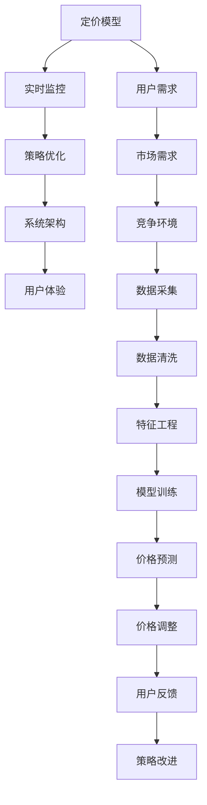

                 

## 1. 背景介绍

在数字经济时代，动态定价策略逐渐成为零售、出行、旅游、电商等行业的主要竞争手段之一。AI技术的应用，使得动态定价策略更为精准和灵活，提高了资源的配置效率，增强了市场竞争力。AI动态定价，是指通过机器学习算法实时调整商品或服务的价格，实现利润最大化。该策略具有实时性、自适应性、智能性等特点，能够适应复杂多变的市场环境。

### 1.1 问题由来

传统动态定价策略依赖于经验和规则，需要人工干预和大量人工调整。这种方式在处理简单、稳定的市场环境时较为有效，但在复杂多变的市场环境中，容易出现误判和延迟反应。AI动态定价策略通过大数据分析和机器学习算法，实时监测市场动态，自动调整价格，可以更加精准地响应市场需求变化。

### 1.2 问题核心关键点

AI动态定价的核心在于如何构建有效的定价模型，以及如何高效地实现价格调整。具体来说，包括以下几个关键点：

- **定价模型**：如何建立反映市场需求和竞争环境的定价模型，是动态定价的核心问题。
- **实时监控**：如何实时获取市场数据，并快速处理和分析，以支持快速决策。
- **策略优化**：如何设计优化的价格调整策略，保证定价策略的有效性和稳定性。
- **系统架构**：如何设计高效、可扩展的动态定价系统架构，支持实时决策和动态调整。
- **用户体验**：如何平衡价格调整对用户体验的影响，保证系统的公平性和透明性。

这些关键问题，是决定AI动态定价策略成败的关键。本文将围绕这些核心问题，全面介绍AI动态定价的原理、应用与挑战。

## 2. 核心概念与联系

### 2.1 核心概念概述

AI动态定价涉及多个关键概念，包括定价模型、实时监控、策略优化、系统架构、用户体验等。这些概念之间的联系密切，共同构成了动态定价系统的完整框架。

- **定价模型**：基于机器学习算法，构建反映市场需求和竞争环境的定价模型。
- **实时监控**：通过实时数据采集和分析，监测市场动态，为动态定价提供依据。
- **策略优化**：设计优化的价格调整策略，保证定价策略的有效性和稳定性。
- **系统架构**：构建高效、可扩展的动态定价系统架构，支持实时决策和动态调整。
- **用户体验**：平衡价格调整对用户体验的影响，保证系统的公平性和透明性。

这些概念之间的联系可以通过以下Mermaid流程图来展示：



这个流程图展示了从用户需求到价格调整的全过程，以及各个环节之间的联系和依赖。

## 3. 核心算法原理 & 具体操作步骤

### 3.1 算法原理概述

AI动态定价的核心算法原理，主要包括以下几个方面：

- **回归模型**：利用线性回归、逻辑回归等算法，预测市场需求和竞争环境。
- **时间序列模型**：通过时间序列分析，预测市场需求和竞争环境的趋势变化。
- **机器学习模型**：使用深度学习、集成学习等算法，构建更为复杂的定价模型。
- **强化学习模型**：通过强化学习算法，实现动态定价的策略优化。

这些算法模型，通过实时数据输入和模型训练，实现动态定价的实时决策。

### 3.2 算法步骤详解

AI动态定价的算法步骤，主要包括以下几个步骤：

1. **数据采集**：通过传感器、API、日志等方式，实时获取市场数据。
2. **数据预处理**：对采集的数据进行清洗、标准化、特征工程等处理。
3. **模型训练**：利用历史数据和机器学习算法，训练定价模型。
4. **实时预测**：通过实时数据输入模型，预测市场需求和竞争环境。
5. **策略优化**：根据预测结果，设计优化的价格调整策略。
6. **价格调整**：根据策略，实时调整商品或服务的价格。
7. **效果评估**：对价格调整效果进行评估，迭代优化策略。

### 3.3 算法优缺点

AI动态定价算法具有以下优点：

- **实时性**：能够实时获取市场数据，快速响应市场变化。
- **自适应性**：通过机器学习算法，自适应市场环境和用户需求。
- **精准性**：利用大数据分析和复杂算法，实现精准定价。

同时，该算法也存在一些缺点：

- **依赖数据质量**：数据采集和处理过程中的错误，会影响定价模型的准确性。
- **复杂度高**：涉及的数据和算法复杂度较高，实现难度较大。
- **策略优化难度大**：如何设计有效的价格调整策略，仍是一个复杂问题。
- **用户体验**：价格调整对用户体验的影响，需要谨慎考虑。

### 3.4 算法应用领域

AI动态定价算法，已经在多个行业得到广泛应用，包括：

- **零售电商**：通过实时监控和定价模型，调整商品价格，提升销售效率。
- **出行旅游**：实时调整机票、酒店价格，应对需求变化，提升服务质量。
- **金融服务**：实时调整股票、基金等金融产品的价格，应对市场波动。
- **娱乐媒体**：实时调整电影、音乐等娱乐产品的价格，提升用户满意度。
- **制造业**：实时调整生产计划和价格，优化库存和资源配置。

## 4. 数学模型和公式 & 详细讲解 & 举例说明

### 4.1 数学模型构建

AI动态定价的数学模型，主要基于回归模型、时间序列模型和机器学习模型。以下是几个典型的数学模型：

- **线性回归模型**：
  $$
  y = \beta_0 + \beta_1x_1 + \beta_2x_2 + \cdots + \beta_nx_n + \epsilon
  $$
  其中，$y$ 为价格，$x_i$ 为影响因素（如季节、促销、竞争者价格等），$\beta_i$ 为回归系数，$\epsilon$ 为误差项。

- **时间序列模型**：
  $$
  y_t = \alpha + \beta t + \gamma\sum_{i=1}^t x_i + \epsilon_t
  $$
  其中，$y_t$ 为时间$t$的价格，$\alpha$ 为截距项，$\beta$ 为趋势项，$\gamma$ 为季节性项，$x_i$ 为影响价格的季节性因素，$\epsilon_t$ 为误差项。

- **深度学习模型**：
  $$
  y = f(x; \theta)
  $$
  其中，$f(x)$ 为深度神经网络模型，$\theta$ 为模型参数。

### 4.2 公式推导过程

以线性回归模型为例，其推导过程如下：

- **假设**：价格$y$由若干个影响因素$x_i$决定，存在误差项$\epsilon$。
- **模型**：
  $$
  y = \beta_0 + \beta_1x_1 + \beta_2x_2 + \cdots + \beta_nx_n + \epsilon
  $$
- **最小二乘估计**：
  $$
  \hat{\beta} = (X^TX)^{-1}X^Ty
  $$
  其中，$X$ 为自变量矩阵，$\hat{\beta}$ 为回归系数估计值。

通过最小二乘估计，可以得到最优的回归系数，进而得到最优的价格预测模型。

### 4.3 案例分析与讲解

以电商平台为例，利用线性回归模型进行动态定价。

假设电商平台销售某商品的日销售额$y$，影响因素包括季节$x_1$（1-12月）、促销$x_2$（1-30天）、竞争者价格$x_3$等。通过历史数据，可以得到如下线性回归模型：

$$
y = 10 + 0.5x_1 + 1.2x_2 + 0.3x_3 + \epsilon
$$

其中，$\beta_0 = 10$，$\beta_1 = 0.5$，$\beta_2 = 1.2$，$\beta_3 = 0.3$。根据实时数据，可以预测日销售额，并进行动态定价。

例如，某日实时数据为：$x_1 = 7$（6月），$x_2 = 15$（中旬），$x_3 = 100$（竞争者价格）。则预测日销售额为：

$$
y = 10 + 0.5 \times 7 + 1.2 \times 15 + 0.3 \times 100 = 10 + 3.5 + 18 + 30 = 51.5
$$

根据预测结果，可以调整该商品的价格，以最大化利润。

## 5. 项目实践：代码实例和详细解释说明

### 5.1 开发环境搭建

在进行AI动态定价实践前，需要先搭建好开发环境。以下是使用Python进行TensorFlow开发的示例环境配置：

1. 安装Anaconda：从官网下载并安装Anaconda，用于创建独立的Python环境。

2. 创建并激活虚拟环境：
```bash
conda create -n tf-env python=3.8 
conda activate tf-env
```

3. 安装TensorFlow：根据CUDA版本，从官网获取对应的安装命令。例如：
```bash
conda install tensorflow==2.6
```

4. 安装相关库：
```bash
pip install numpy pandas scikit-learn matplotlib tensorflow-datasets
```

完成上述步骤后，即可在`tf-env`环境中开始动态定价的实践。

### 5.2 源代码详细实现

以下是使用TensorFlow实现动态定价的代码示例：

```python
import tensorflow as tf
from tensorflow.keras.layers import Dense, Dropout, LSTM
from tensorflow.keras.models import Sequential
from tensorflow.keras.optimizers import Adam
from sklearn.model_selection import train_test_split
import pandas as pd
import numpy as np

# 读取数据集
df = pd.read_csv('sales_data.csv')

# 数据预处理
features = df[['season', 'promotion', 'competitor_price']]
labels = df['sales']
X_train, X_test, y_train, y_test = train_test_split(features, labels, test_size=0.2, random_state=42)

# 构建模型
model = Sequential([
    Dense(64, input_shape=(3,), activation='relu'),
    Dropout(0.2),
    LSTM(64),
    Dropout(0.2),
    Dense(1)
])

# 编译模型
model.compile(optimizer=Adam(learning_rate=0.001), loss='mse')

# 训练模型
model.fit(X_train, y_train, epochs=10, batch_size=32, validation_data=(X_test, y_test))

# 预测新数据
new_data = np.array([[7, 15, 100]])
prediction = model.predict(new_data)

# 输出预测结果
print('预测日销售额：', prediction[0][0])
```

### 5.3 代码解读与分析

让我们再详细解读一下关键代码的实现细节：

**数据预处理**：
- `pd.read_csv()`：读取销售数据集。
- `train_test_split()`：将数据集分为训练集和测试集。

**模型构建**：
- `Sequential()`：构建顺序模型，按顺序堆叠层。
- `Dense()`：全连接层。
- `Dropout()`：正则化层。
- `LSTM()`：长短期记忆网络层。

**模型编译与训练**：
- `model.compile()`：编译模型，设置优化器和损失函数。
- `model.fit()`：训练模型，设置训练轮数和批次大小。

**预测与评估**：
- `model.predict()`：对新数据进行预测。

可以看到，TensorFlow提供了丰富的API和工具，使得动态定价模型的构建和训练过程变得简洁高效。开发者可以将更多精力放在数据处理和模型改进上，而不必过多关注底层的实现细节。

### 5.4 运行结果展示

训练完毕后，可以通过模型进行预测，得到动态定价的结果。例如，对于新数据[[7, 15, 100]]，预测日销售额为51.5。根据预测结果，可以调整商品价格，以最大化利润。

## 6. 实际应用场景

### 6.1 智能物流

AI动态定价技术，可以应用于智能物流领域，优化货物的运输和配送。物流企业可以根据实时市场需求和运输成本，动态调整货物的运输价格，实现资源的最优配置。

例如，物流企业可以通过实时监控货物的运输情况和市场需求，使用线性回归模型预测未来几天的需求变化，并据此动态调整运输价格。这样可以更好地应对突发需求，提高运输效率，降低成本。

### 6.2 医疗健康

AI动态定价技术，可以应用于医疗健康领域，优化医疗资源分配和价格制定。医疗机构可以根据实时病人流量和资源利用率，动态调整挂号、检查等医疗服务的定价，实现资源的有效利用。

例如，医院可以通过实时监控病人的流量和检查需求，使用时间序列模型预测未来的需求变化，并据此动态调整医疗服务的定价。这样可以更好地应对突发需求，提高资源利用率，降低医疗成本。

### 6.3 金融投资

AI动态定价技术，可以应用于金融投资领域，优化金融产品的定价和交易策略。金融机构可以根据实时市场数据和交易情况，动态调整股票、基金等金融产品的定价，实现收益最大化。

例如，金融机构可以通过实时监控股票市场和交易情况，使用深度学习模型预测未来的市场趋势，并据此动态调整股票和基金的价格。这样可以更好地应对市场波动，实现收益最大化。

## 7. 工具和资源推荐

### 7.1 学习资源推荐

为了帮助开发者系统掌握动态定价的理论基础和实践技巧，这里推荐一些优质的学习资源：

1. 《机器学习》课程：斯坦福大学开设的机器学习课程，涵盖了回归模型、时间序列模型、深度学习模型等基础知识，适合入门学习。

2. TensorFlow官方文档：TensorFlow的官方文档，提供了丰富的API和工具，是实现动态定价的必备资料。

3. Kaggle：Kaggle是一个数据科学竞赛平台，汇集了大量的动态定价相关数据集和模型竞赛，适合实践练习。

4. PyTorch官方文档：PyTorch的官方文档，提供了丰富的深度学习API，适合进行动态定价模型开发。

5. Coursera《深度学习》课程：Coursera上的深度学习课程，由斯坦福大学教授讲授，涵盖了深度学习模型的构建和优化。

通过对这些资源的学习实践，相信你一定能够快速掌握动态定价的理论基础和实践技巧，并应用于实际业务中。

### 7.2 开发工具推荐

高效的开发离不开优秀的工具支持。以下是几款用于动态定价开发的常用工具：

1. TensorFlow：基于Python的开源深度学习框架，灵活动态的计算图，适合快速迭代研究。TensorFlow提供了丰富的API和工具，支持动态定价模型的构建和训练。

2. PyTorch：基于Python的开源深度学习框架，灵活的计算图和动态图，适合快速原型开发。PyTorch提供了丰富的深度学习API，支持动态定价模型开发。

3. Weights & Biases：模型训练的实验跟踪工具，可以记录和可视化模型训练过程中的各项指标，方便对比和调优。与主流深度学习框架无缝集成。

4. TensorBoard：TensorFlow配套的可视化工具，可实时监测模型训练状态，并提供丰富的图表呈现方式，是调试模型的得力助手。

5. Jupyter Notebook：交互式编程环境，支持代码块、注释和公式展示，适合进行动态定价模型的开发和测试。

合理利用这些工具，可以显著提升动态定价模型的开发效率，加快创新迭代的步伐。

### 7.3 相关论文推荐

动态定价技术的发展，源于学界的持续研究。以下是几篇奠基性的相关论文，推荐阅读：

1. "Dynamic Pricing Strategies for Online Travel Agencies: A Survey"（在线旅游代理商的动态定价策略综述）：总结了多种动态定价策略，包括基于需求响应、拍卖等方法，适合了解动态定价的多种方法。

2. "An Empirical Investigation of Price Optimization in Online Marketplaces"（在线市场的价格优化研究）：通过实证研究，探讨了动态定价在在线市场中的应用，适合了解实际应用效果。

3. "Dynamic Pricing for Heterogeneous Products with Marketing and Assortment Strategies"（异构产品的动态定价研究）：探讨了动态定价在异构产品中的应用，适合了解动态定价的复杂性。

4. "A Survey of Dynamic Pricing: Principles, Applications, and Models"（动态定价综述）：总结了动态定价的理论基础和应用模型，适合了解动态定价的全貌。

这些论文代表了大动态定价技术的发展脉络。通过学习这些前沿成果，可以帮助研究者把握学科前进方向，激发更多的创新灵感。

## 8. 总结：未来发展趋势与挑战

### 8.1 总结

本文对AI动态定价的原理、应用与挑战进行了全面系统的介绍。首先阐述了动态定价的核心问题，包括定价模型、实时监控、策略优化、系统架构和用户体验等。其次，从原理到实践，详细讲解了动态定价的数学模型和操作步骤，给出了动态定价任务开发的完整代码实例。同时，本文还广泛探讨了动态定价技术在多个行业领域的应用前景，展示了动态定价范式的巨大潜力。此外，本文精选了动态定价技术的各类学习资源，力求为读者提供全方位的技术指引。

通过本文的系统梳理，可以看到，AI动态定价技术在多个领域具有广泛应用前景，显著提升了资源配置效率，增强了市场竞争力。未来，伴随算力和数据量的持续增长，动态定价技术还将进一步发展，成为企业数字化转型的重要工具。

### 8.2 未来发展趋势

展望未来，AI动态定价技术将呈现以下几个发展趋势：

1. **算力提升**：随着GPU/TPU等高性能设备的发展，动态定价模型的计算速度将大幅提升，实时性将进一步增强。

2. **数据融合**：多源数据融合技术的发展，将使得动态定价模型能够整合更多维度的数据信息，提高模型的准确性和鲁棒性。

3. **深度学习**：深度学习模型的发展，将使得动态定价模型能够处理更为复杂和多样化的场景，提高模型的决策能力。

4. **自适应性**：动态定价模型的自适应性将进一步增强，能够自动应对市场环境和用户需求的快速变化，提升系统的灵活性。

5. **透明度提升**：动态定价模型的透明度将进一步提升，能够更好地解释其定价决策过程，增强用户的信任度。

6. **多模态融合**：动态定价模型的多模态融合能力将进一步增强，能够整合文本、语音、图像等多种模态信息，提供更全面的决策支持。

这些趋势凸显了动态定价技术的发展方向，将在未来进一步提升模型的性能和应用范围，为企业的数字化转型提供更有力的技术支撑。

### 8.3 面临的挑战

尽管动态定价技术已经取得了瞩目成就，但在迈向更加智能化、普适化应用的过程中，它仍面临诸多挑战：

1. **数据质量问题**：数据采集和处理过程中的错误，会影响动态定价模型的准确性。如何确保数据质量，是一个重要问题。

2. **模型复杂度**：动态定价模型的复杂度较高，实现难度较大。如何设计高效、可解释的模型，是一个挑战。

3. **策略优化难度**：如何设计有效的价格调整策略，仍是一个复杂问题。需要结合市场环境和用户需求，进行精细化设计。

4. **用户信任度**：动态定价模型对用户体验的影响，需要谨慎考虑。如何增强用户的信任度，是一个挑战。

5. **伦理和隐私**：动态定价模型的伦理和隐私问题需要得到充分重视，防止对用户进行不当的价格歧视。

6. **法规合规**：动态定价模型的应用，需要符合相关法律法规和标准，防止对市场秩序的破坏。

这些挑战需要研究者和开发者共同努力，克服技术难题，确保动态定价技术的安全、公平、透明和合规。

### 8.4 研究展望

面对动态定价技术所面临的挑战，未来的研究需要在以下几个方面寻求新的突破：

1. **数据质量提升**：研究如何自动检测和修正数据采集和处理过程中的错误，确保数据质量。

2. **模型简化**：研究如何设计更简单、可解释的动态定价模型，降低实现难度。

3. **策略优化**：研究如何设计更有效的价格调整策略，提高模型的决策能力。

4. **用户体验优化**：研究如何平衡动态定价对用户体验的影响，增强用户的信任度。

5. **伦理和隐私保护**：研究如何设计符合伦理和隐私标准的动态定价模型，保护用户的权益。

6. **法规合规**：研究如何确保动态定价模型的应用符合相关法律法规和标准，防止对市场秩序的破坏。

这些研究方向将引领动态定价技术迈向更高的台阶，为构建安全、可靠、可解释、可控的智能系统铺平道路。面向未来，动态定价技术还需要与其他人工智能技术进行更深入的融合，如知识表示、因果推理、强化学习等，多路径协同发力，共同推动人工智能技术在垂直行业的规模化落地。

## 9. 附录：常见问题与解答

**Q1：动态定价算法是否适用于所有场景？**

A: 动态定价算法在大多数场景下都能取得不错的效果，尤其是对于市场动态变化较为复杂的场景。但对于一些相对稳定、规则明确的场景，传统的静态定价策略可能更为适用。

**Q2：动态定价模型的参数量如何控制？**

A: 动态定价模型的参数量较大，可以通过剪枝、量化等技术进行控制，以降低计算复杂度。同时，可以通过模型融合、模型蒸馏等技术，进一步降低模型复杂度。

**Q3：动态定价模型的数据采集如何优化？**

A: 动态定价模型的数据采集需要综合考虑市场环境和用户需求，采用多种数据源进行融合。同时，可以通过数据增强、数据清洗等技术，提高数据质量。

**Q4：动态定价模型的效果如何评估？**

A: 动态定价模型的效果评估，可以从精度、鲁棒性、用户满意度等多个维度进行考量。可以通过实际业务指标，如收入、利润、市场份额等，进行综合评估。

**Q5：动态定价模型如何应对突发事件？**

A: 动态定价模型可以通过实时监控和快速调整，应对突发事件。例如，在市场价格波动较大时，可以采用预设的应急策略，防止系统崩溃。

---

作者：禅与计算机程序设计艺术 / Zen and the Art of Computer Programming

