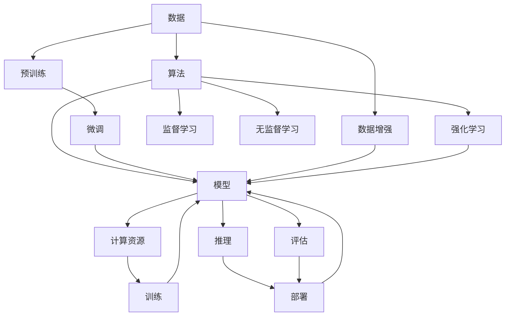

                 

# AI发展的三大关键因素

## 1. 背景介绍

### 1.1 问题由来
随着人工智能（AI）技术的飞速发展，其影响力已经渗透到各个领域，从医疗、金融到交通、制造，几乎无所不在。然而，尽管AI取得了诸多成就，但真正能够引领AI技术前进的关键因素是什么？在探讨这一问题时，我们发现三大核心因素在驱动AI技术的发展和应用中起着至关重要的作用。

### 1.2 问题核心关键点
AI发展的三大关键因素包括数据、算法和计算资源。这三大因素相互关联、相辅相成，共同推动AI技术的演进和应用落地。数据提供了AI学习的原材料，算法则是学习和推理的核心引擎，计算资源则为算法提供了必要的计算能力。理解这三大因素的相互作用，对于把握AI技术的未来发展趋势至关重要。

## 2. 核心概念与联系

### 2.1 核心概念概述

为更好地理解AI发展的三大关键因素，本节将介绍几个密切相关的核心概念：

- 数据(Data)：AI学习的原材料，包含结构化和非结构化数据，用于训练和测试AI模型。
- 算法(Algorithm)：AI学习和推理的核心引擎，包括监督学习、无监督学习、强化学习等。
- 计算资源(Computing Resources)：硬件和软件资源，包括CPU、GPU、TPU、云计算等，为算法提供计算能力。
- 模型(Model)：经过训练的AI算法，用于执行特定任务，如分类、生成、预测等。
- 深度学习(Deep Learning)：一种基于神经网络的算法，通过多层非线性变换进行数据表示和处理。
- 迁移学习(Transfer Learning)：利用预训练模型，对特定任务进行微调，提高模型性能。
- 强化学习(Reinforcement Learning)：通过奖励机制，使AI模型通过试错不断优化策略。
- 模型压缩(Model Compression)：通过剪枝、量化、蒸馏等技术，优化模型结构和参数，提升推理效率。

这些核心概念之间的逻辑关系可以通过以下Mermaid流程图来展示：



这个流程图展示了大语言模型的核心概念及其之间的关系：

1. 数据通过算法进行处理，最终形成模型。
2. 模型在计算资源上进行训练，形成推理能力。
3. 模型经过微调和预训练，提升其性能。
4. 模型通过推理生成输出，应用于实际问题。
5. 评估模型性能，并进行持续改进。

## 3. 核心算法原理 & 具体操作步骤
### 3.1 算法原理概述

AI算法主要分为监督学习、无监督学习和强化学习三大类。

- 监督学习（Supervised Learning）：利用标注数据训练模型，使其能够学习输入数据与输出标签之间的关系。典型的算法包括线性回归、逻辑回归、支持向量机等。
- 无监督学习（Unsupervised Learning）：不依赖标注数据，通过数据自身特性进行学习。典型的算法包括聚类、降维、关联规则学习等。
- 强化学习（Reinforcement Learning）：通过与环境的互动，优化策略，实现特定的行为目标。典型的算法包括Q-learning、策略梯度等。

### 3.2 算法步骤详解

以深度学习中的监督学习为例，其操作步骤包括：

1. 数据准备：收集和清洗数据，分为训练集、验证集和测试集。
2. 模型选择：选择合适的深度学习模型，如卷积神经网络（CNN）、循环神经网络（RNN）、Transformer等。
3. 模型训练：在训练集上使用优化算法（如梯度下降）进行参数更新，最小化损失函数。
4. 模型评估：在验证集上评估模型性能，调整超参数。
5. 模型微调：对模型进行微调，提高模型在特定任务上的性能。
6. 模型推理：在测试集上测试模型性能，进行实际应用。

### 3.3 算法优缺点

深度学习算法的优点包括：

- 高精度：在特定任务上，深度学习模型可以达到或超过人类的性能水平。
- 自我优化：通过反向传播算法，自动调整模型参数，实现自我优化。
- 可扩展性：深度学习模型具有较好的可扩展性，适用于处理大规模复杂数据。

深度学习算法的主要缺点包括：

- 计算资源需求高：深度学习模型通常需要大量的计算资源进行训练和推理。
- 模型复杂度高：深度学习模型结构复杂，难以解释。
- 过拟合风险高：深度学习模型容易过拟合，需要更多的数据和正则化技术来防止过拟合。

### 3.4 算法应用领域

深度学习算法在各个领域都有广泛的应用，包括：

- 计算机视觉（CV）：图像分类、目标检测、图像生成等。
- 自然语言处理（NLP）：机器翻译、文本分类、情感分析等。
- 语音识别：语音合成、语音识别、情感识别等。
- 医疗健康：疾病诊断、医疗影像分析、药物发现等。
- 金融科技：信用评分、风险管理、投资预测等。
- 自动驾驶：图像识别、路径规划、自动驾驶等。

## 4. 数学模型和公式 & 详细讲解  
### 4.1 数学模型构建

以监督学习中的线性回归模型为例，其数学模型为：

$$ y = \theta^T x $$

其中 $y$ 为输出，$x$ 为输入特征，$\theta$ 为模型参数。目标是最小化均方误差损失函数：

$$ L = \frac{1}{2N} \sum_{i=1}^N (y_i - \hat{y}_i)^2 $$

### 4.2 公式推导过程

以梯度下降算法为例，其步骤如下：

1. 初始化模型参数 $\theta$。
2. 计算损失函数对参数 $\theta$ 的梯度。
3. 更新参数 $\theta$：

$$ \theta = \theta - \eta \nabla_{\theta}L(\theta) $$

其中 $\eta$ 为学习率。

### 4.3 案例分析与讲解

线性回归模型是监督学习中最为基础的模型之一，用于预测连续型输出。在实际应用中，线性回归模型可以用于房价预测、股票价格预测、销售量预测等。通过调整模型参数，可以进一步提升模型的预测能力。

## 5. 项目实践：代码实例和详细解释说明
### 5.1 开发环境搭建

在进行深度学习项目实践前，我们需要准备好开发环境。以下是使用Python进行PyTorch开发的环境配置流程：

1. 安装Anaconda：从官网下载并安装Anaconda，用于创建独立的Python环境。

2. 创建并激活虚拟环境：
```bash
conda create -n pytorch-env python=3.8 
conda activate pytorch-env
```

3. 安装PyTorch：根据CUDA版本，从官网获取对应的安装命令。例如：
```bash
conda install pytorch torchvision torchaudio cudatoolkit=11.1 -c pytorch -c conda-forge
```

4. 安装TensorFlow：
```bash
pip install tensorflow
```

5. 安装各类工具包：
```bash
pip install numpy pandas scikit-learn matplotlib tqdm jupyter notebook ipython
```

完成上述步骤后，即可在`pytorch-env`环境中开始深度学习实践。

### 5.2 源代码详细实现

下面我以线性回归模型为例，给出使用PyTorch进行深度学习项目开发的PyTorch代码实现。

首先，定义线性回归模型：

```python
import torch
import torch.nn as nn
import torch.optim as optim

class LinearRegression(nn.Module):
    def __init__(self, input_size, output_size):
        super(LinearRegression, self).__init__()
        self.linear = nn.Linear(input_size, output_size)
        
    def forward(self, x):
        return self.linear(x)
```

然后，定义训练和评估函数：

```python
import torch.utils.data as data
from sklearn.datasets import load_boston
from sklearn.model_selection import train_test_split
from sklearn.preprocessing import StandardScaler

def train_epoch(model, train_loader, optimizer):
    model.train()
    loss_sum = 0
    for data, target in train_loader:
        optimizer.zero_grad()
        output = model(data)
        loss = torch.mean((output - target)**2)
        loss_sum += loss.item()
        loss.backward()
        optimizer.step()
    return loss_sum / len(train_loader)

def evaluate(model, test_loader):
    model.eval()
    loss_sum = 0
    with torch.no_grad():
        for data, target in test_loader:
            output = model(data)
            loss = torch.mean((output - target)**2)
            loss_sum += loss.item()
    return loss_sum / len(test_loader)

# 加载波士顿房价数据集
data = load_boston()
X = data.data
y = data.target
scaler = StandardScaler()
X = scaler.fit_transform(X)

# 划分为训练集和测试集
X_train, X_test, y_train, y_test = train_test_split(X, y, test_size=0.2, random_state=42)

# 创建数据集和加载器
train_dataset = data.TensorDataset(torch.from_numpy(X_train), torch.from_numpy(y_train))
test_dataset = data.TensorDataset(torch.from_numpy(X_test), torch.from_numpy(y_test))
train_loader = data.DataLoader(train_dataset, batch_size=32, shuffle=True)
test_loader = data.DataLoader(test_dataset, batch_size=32, shuffle=False)

# 创建模型和优化器
model = LinearRegression(input_size=X_train.shape[1], output_size=1)
optimizer = optim.SGD(model.parameters(), lr=0.01)

# 训练模型
for epoch in range(100):
    loss = train_epoch(model, train_loader, optimizer)
    print(f"Epoch {epoch+1}, train loss: {loss:.3f}")
    
    print(f"Epoch {epoch+1}, test loss: {evaluate(model, test_loader):.3f}")
```

以上就是使用PyTorch进行线性回归模型训练的完整代码实现。可以看到，通过简单的代码，就可以实现从模型定义、数据加载、模型训练到模型评估的完整流程。

### 5.3 代码解读与分析

让我们再详细解读一下关键代码的实现细节：

**LinearRegression类**：
- `__init__`方法：初始化线性回归模型，包含一个线性层。
- `forward`方法：前向传播计算输出。

**训练和评估函数**：
- `train_epoch`函数：对数据集进行批次化加载，对模型进行前向传播和反向传播，更新参数。
- `evaluate`函数：评估模型在测试集上的性能。

**数据预处理**：
- 使用sklearn库加载波士顿房价数据集，并进行标准化处理。
- 划分为训练集和测试集。
- 创建TensorDataset加载器，方便PyTorch处理数据。

**模型训练**：
- 定义线性回归模型和优化器。
- 在训练集上进行100轮训练，每轮更新模型参数。
- 在验证集上评估模型性能。

可以看到，通过PyTorch库，深度学习模型的开发变得简洁高效。开发者可以将更多精力放在模型改进和数据处理上，而不必过多关注底层的实现细节。

当然，工业级的系统实现还需考虑更多因素，如模型的保存和部署、超参数的自动搜索、更灵活的任务适配层等。但核心的深度学习范式基本与此类似。

## 6. 实际应用场景
### 6.1 智能客服系统

深度学习算法可以应用于智能客服系统的构建。传统客服往往需要配备大量人力，高峰期响应缓慢，且一致性和专业性难以保证。而使用深度学习模型，可以7x24小时不间断服务，快速响应客户咨询，用自然流畅的语言解答各类常见问题。

在技术实现上，可以收集企业内部的历史客服对话记录，将问题和最佳答复构建成监督数据，在此基础上对深度学习模型进行训练。训练后的模型能够自动理解用户意图，匹配最合适的答复模板进行回复。对于客户提出的新问题，还可以接入检索系统实时搜索相关内容，动态组织生成回答。如此构建的智能客服系统，能大幅提升客户咨询体验和问题解决效率。

### 6.2 金融舆情监测

金融机构需要实时监测市场舆论动向，以便及时应对负面信息传播，规避金融风险。传统的人工监测方式成本高、效率低，难以应对网络时代海量信息爆发的挑战。基于深度学习模型的文本分类和情感分析技术，为金融舆情监测提供了新的解决方案。

具体而言，可以收集金融领域相关的新闻、报道、评论等文本数据，并对其进行主题标注和情感标注。在此基础上对深度学习模型进行微调，使其能够自动判断文本属于何种主题，情感倾向是正面、中性还是负面。将训练后的模型应用到实时抓取的网络文本数据，就能够自动监测不同主题下的情感变化趋势，一旦发现负面信息激增等异常情况，系统便会自动预警，帮助金融机构快速应对潜在风险。

### 6.3 个性化推荐系统

当前的推荐系统往往只依赖用户的历史行为数据进行物品推荐，无法深入理解用户的真实兴趣偏好。基于深度学习模型的个性化推荐系统可以更好地挖掘用户行为背后的语义信息，从而提供更精准、多样的推荐内容。

在实践中，可以收集用户浏览、点击、评论、分享等行为数据，提取和用户交互的物品标题、描述、标签等文本内容。将文本内容作为模型输入，用户的后续行为（如是否点击、购买等）作为监督信号，在此基础上训练深度学习模型。训练后的模型能够从文本内容中准确把握用户的兴趣点。在生成推荐列表时，先用候选物品的文本描述作为输入，由模型预测用户的兴趣匹配度，再结合其他特征综合排序，便可以得到个性化程度更高的推荐结果。

### 6.4 未来应用展望

随着深度学习模型的不断发展，基于深度学习算法的应用将在更多领域得到应用，为传统行业带来变革性影响。

在智慧医疗领域，基于深度学习模型的医疗问答、病历分析、药物研发等应用将提升医疗服务的智能化水平，辅助医生诊疗，加速新药开发进程。

在智能教育领域，深度学习模型可应用于作业批改、学情分析、知识推荐等方面，因材施教，促进教育公平，提高教学质量。

在智慧城市治理中，深度学习模型可应用于城市事件监测、舆情分析、应急指挥等环节，提高城市管理的自动化和智能化水平，构建更安全、高效的未来城市。

此外，在企业生产、社会治理、文娱传媒等众多领域，基于深度学习算法的AI应用也将不断涌现，为经济社会发展注入新的动力。相信随着技术的日益成熟，深度学习算法还将继续拓展其应用边界，为人类认知智能的进化带来深远影响。

## 7. 工具和资源推荐
### 7.1 学习资源推荐

为了帮助开发者系统掌握深度学习理论基础和实践技巧，这里推荐一些优质的学习资源：

1. 《深度学习》书籍：Ian Goodfellow等人所著，系统介绍了深度学习的理论和实践。
2. 深度学习框架PyTorch官方文档：详细介绍了PyTorch的使用方法和最佳实践。
3. Coursera深度学习课程：由Andrew Ng等人开设的深度学习入门课程，覆盖了深度学习的核心概念和前沿技术。
4. TensorFlow官方文档：详细介绍了TensorFlow的使用方法和最佳实践。
5. Kaggle数据竞赛：Kaggle提供了大量深度学习项目的数据和模型，适合实践和竞赛学习。

通过对这些资源的学习实践，相信你一定能够快速掌握深度学习技术的精髓，并用于解决实际的AI问题。
###  7.2 开发工具推荐

高效的开发离不开优秀的工具支持。以下是几款用于深度学习开发的常用工具：

1. PyTorch：基于Python的开源深度学习框架，灵活动态的计算图，适合快速迭代研究。
2. TensorFlow：由Google主导开发的开源深度学习框架，生产部署方便，适合大规模工程应用。
3. Keras：Keras提供高级API，使得深度学习模型的搭建和训练变得更加简单。
4. PyTorch Lightning：基于PyTorch的轻量级深度学习框架，支持分布式训练和模型部署。
5. TensorBoard：TensorFlow配套的可视化工具，可实时监测模型训练状态，并提供丰富的图表呈现方式。
6. Weights & Biases：模型训练的实验跟踪工具，可以记录和可视化模型训练过程中的各项指标，方便对比和调优。

合理利用这些工具，可以显著提升深度学习模型的开发效率，加快创新迭代的步伐。

### 7.3 相关论文推荐

深度学习算法在各个领域都有广泛的应用，以下是几篇奠基性的相关论文，推荐阅读：

1. AlexNet：ImageNet大规模视觉识别挑战赛的冠军算法，标志着深度学习在计算机视觉领域的突破。
2. VGG：使用大量小卷积层进行深度学习，提升了图像分类的精度。
3. ResNet：使用残差连接解决深度网络退化问题，大大提升了网络深度和精度。
4. Transformer：提出了自注意力机制，提升了NLP任务的精度。
5. GAN：生成对抗网络，实现了高质量的图像生成。
6. Capsule Network：提出了胶囊网络，提高了图像识别的鲁棒性。

这些论文代表了大深度学习算法的发展脉络。通过学习这些前沿成果，可以帮助研究者把握学科前进方向，激发更多的创新灵感。

## 8. 总结：未来发展趋势与挑战
### 8.1 总结

本文对深度学习算法的发展进行了全面系统的介绍。首先阐述了深度学习算法的三大关键因素：数据、算法和计算资源。其次，从原理到实践，详细讲解了深度学习算法的数学模型和操作步骤。最后，通过实际应用场景和未来展望，展示了深度学习算法在各个领域的广泛应用。

通过本文的系统梳理，可以看到，深度学习算法在推动AI技术发展中的应用场景日益广泛，其潜力正逐步被挖掘和利用。未来，随着深度学习算法的不断演进和优化，相信AI技术必将在更多领域得到应用，深刻影响人类的生产生活方式。

### 8.2 未来发展趋势

展望未来，深度学习算法的发展将呈现以下几个趋势：

1. 模型规模持续增大。随着算力成本的下降和数据规模的扩张，深度学习模型的参数量还将持续增长。超大规模深度学习模型蕴含的丰富知识，有望支撑更加复杂多变的应用场景。

2. 算法创新不断涌现。未来将涌现更多创新性的深度学习算法，如无监督学习、强化学习等，拓展深度学习的应用边界。

3. 多模态学习成为热点。深度学习模型将更广泛地融合视觉、语音、文本等多模态数据，实现更加全面的智能理解和推理。

4. 自动化和可解释性提升。未来将有更多自动化和可解释性强的深度学习算法出现，使得模型训练和推理更加透明和高效。

5. 跨领域知识融合。深度学习算法将与更多领域知识进行深度融合，如知识图谱、因果推理等，提升模型的综合性能。

以上趋势凸显了深度学习算法的广阔前景。这些方向的探索发展，必将进一步推动深度学习技术的发展和应用落地。

### 8.3 面临的挑战

尽管深度学习算法已经取得了瞩目成就，但在迈向更加智能化、普适化应用的过程中，它仍面临着诸多挑战：

1. 数据质量和数量不足。尽管大数据的积累对深度学习至关重要，但部分领域的数据质量和数量仍不足以满足深度学习的需求。

2. 计算资源限制。深度学习模型的训练和推理需要大量计算资源，现有硬件设施难以满足超高算力需求。

3. 模型复杂性高。深度学习模型结构复杂，难以解释和优化，给实际应用带来挑战。

4. 过拟合风险高。深度学习模型容易过拟合，需要更多的数据和正则化技术来防止过拟合。

5. 安全性和隐私问题。深度学习模型可能引入隐私风险，数据泄露、模型攻击等问题亟待解决。

6. 伦理和法律挑战。深度学习模型的应用涉及伦理和法律问题，如何保障模型的公平性和安全性仍需探讨。

7. 跨领域应用困难。深度学习算法在不同领域应用时，需要重新设计模型和算法，难以实现跨领域无缝迁移。

正视深度学习算法面临的这些挑战，积极应对并寻求突破，将是大深度学习算法走向成熟的必由之路。相信随着学界和产业界的共同努力，这些挑战终将一一被克服，深度学习算法必将在构建人机协同的智能系统中扮演越来越重要的角色。

### 8.4 研究展望

面向未来，深度学习算法的研究将朝着以下几个方向展开：

1. 强化学习与深度学习的结合。通过强化学习优化深度学习模型的超参数，提升模型的性能和泛化能力。

2. 自适应学习与迁移学习。通过自适应学习技术，使深度学习模型能够动态调整学习策略，提升在不同任务上的适应能力。

3. 跨领域知识融合与迁移。通过知识图谱、因果推理等技术，将深度学习模型与其他领域的知识进行深度融合，提升模型的综合性能。

4. 可解释性与透明度提升。通过模型压缩、特征解释等技术，提升深度学习模型的可解释性和透明度，使其更加透明和可信。

5. 自动化与可控性增强。通过自动化超参数优化、自动化模型训练等技术，使得深度学习模型的训练和应用更加高效和可控。

6. 多模态学习与跨模态融合。通过多模态学习技术，使深度学习模型能够融合多种模态的数据，提升跨模态数据的理解和推理能力。

这些研究方向的探索，将引领深度学习算法向更高的台阶迈进，为构建安全、可靠、可解释、可控的智能系统铺平道路。面向未来，深度学习算法的研究需要与其他人工智能技术进行更深入的融合，如知识表示、因果推理、强化学习等，多路径协同发力，共同推动自然语言理解和智能交互系统的进步。只有勇于创新、敢于突破，才能不断拓展深度学习算法的边界，让智能技术更好地造福人类社会。

## 9. 附录：常见问题与解答

**Q1：深度学习算法是否适用于所有AI任务？**

A: 深度学习算法在大多数AI任务上都能取得不错的效果，特别是对于数据量较大的任务。但对于一些需要较少数据和计算资源的轻量级任务，深度学习算法可能不是最优选择。此外，对于需要规则推理的任务，深度学习算法也不如符号系统。

**Q2：如何选择合适的深度学习模型？**

A: 选择合适的深度学习模型需要考虑多个因素，包括任务类型、数据特征、计算资源等。例如，对于图像识别任务，卷积神经网络（CNN）通常是最佳选择；对于自然语言处理任务，循环神经网络（RNN）或Transformer模型更为适合。同时，还需要考虑模型的可解释性、训练速度、推理速度等。

**Q3：如何防止深度学习模型的过拟合？**

A: 防止深度学习模型过拟合的方法包括：
1. 数据增强：通过旋转、裁剪、翻转等技术，扩充训练集。
2. 正则化：使用L2正则、Dropout等技术，限制模型参数的复杂度。
3. 早停机制：在验证集上监测模型性能，当性能不再提升时停止训练。
4. 模型集成：使用多个模型进行集成，取平均或投票结果，减少过拟合风险。
5. 模型压缩：通过剪枝、量化等技术，减少模型参数，提升泛化能力。

这些方法需要根据具体任务和数据特点进行灵活组合。只有在数据、模型、训练、推理等各环节进行全面优化，才能最大限度地防止过拟合。

**Q4：深度学习模型在落地部署时需要注意哪些问题？**

A: 将深度学习模型转化为实际应用，还需要考虑以下因素：
1. 模型裁剪：去除不必要的层和参数，减小模型尺寸，加快推理速度。
2. 量化加速：将浮点模型转为定点模型，压缩存储空间，提高计算效率。
3. 服务化封装：将模型封装为标准化服务接口，便于集成调用。
4. 弹性伸缩：根据请求流量动态调整资源配置，平衡服务质量和成本。
5. 监控告警：实时采集系统指标，设置异常告警阈值，确保服务稳定性。
6. 安全防护：采用访问鉴权、数据脱敏等措施，保障数据和模型安全。

深度学习模型在实际部署时需要考虑多个因素，需要在开发过程中进行全面优化，才能确保模型的高效和安全应用。

---

作者：禅与计算机程序设计艺术 / Zen and the Art of Computer Programming

