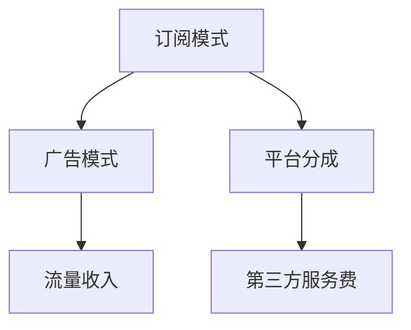

                 

## 1. 背景介绍

### 1.1 问题由来

随着人工智能技术的迅猛发展，越来越多的企业开始将AI技术商业化，希望通过AI的应用来提升业务效率、降低运营成本、开拓新市场。然而，将AI技术从实验室搬到市场需要解决一系列复杂的问题，包括技术选型、产品设计、商业模式、市场推广等。

其中，商业模式的设计是一个核心问题，它直接关系到AI技术的落地和盈利。近年来，一些AI初创企业通过创新商业模式，实现了成功商业化，并获得了可观的回报。Lepton AI就是其中的佼佼者之一，它通过独特的盈利模式，在AI市场中脱颖而出。

### 1.2 问题核心关键点

Lepton AI的盈利模式核心在于其“订阅+广告”的商业模式。这种模式充分利用了AI技术的广泛应用场景，将广告收入与用户订阅相结合，实现了低成本、高收益的盈利。具体来说，其盈利模式包括以下几个方面：

- **订阅模式**：企业可以根据自身需求，订阅Lepton AI提供的特定功能或服务，享受个性化定制的AI解决方案。
- **广告模式**：Lepton AI将用户的AI应用场景和数据作为广告内容，通过精准投放广告，实现额外收入。
- **平台分成**：Lepton AI还构建了一个AI应用平台，为第三方开发者提供工具和接口，通过平台使用费分账，实现收入来源多元化。

### 1.3 问题研究意义

研究Lepton AI的盈利模式，对于AI企业的商业化探索具有重要意义：

1. **降低开发成本**：订阅模式和平台分成的设计，使得Lepton AI能够快速回笼资金，降低自身研发和市场推广成本。
2. **提升用户粘性**：通过定制化的订阅服务和精准广告投放，Lepton AI能够提升用户满意度，增加用户粘性。
3. **探索新收入来源**：广告模式和平台分成，为AI企业提供了新的盈利渠道，拓展了收入来源。
4. **促进AI市场发展**：通过成功商业模式的设计，Lepton AI为其他AI企业提供了有益的借鉴，推动了整个AI市场的健康发展。

## 2. 核心概念与联系

### 2.1 核心概念概述

为了更好地理解Lepton AI的盈利模式，我们首先介绍几个关键概念：

- **订阅模式(Subscription Model)**：用户根据自身需求，支付固定费用，定期获取定制化的AI服务或功能。这种模式适用于需求稳定、用户粘性高的业务场景。
- **广告模式(Ad Model)**：通过精准投放广告，在用户使用AI服务的过程中获取额外收入。广告模式适用于AI应用的广泛场景，能够最大化利用用户数据和资源。
- **平台分成(Platform Cut)**：Lepton AI构建了一个AI应用平台，为第三方开发者提供工具和接口，通过平台使用费分账，实现收入来源多元化。平台分成为AI企业提供了新的盈利渠道，推动了AI技术的普及和应用。

这些核心概念之间的关系可以通过以下Mermaid流程图来展示：



这个流程图展示了几大盈利模式之间的关系：

1. 订阅模式是Lepton AI的主要收入来源，用户通过订阅获取个性化服务。
2. 广告模式通过精准投放广告，为Lepton AI带来额外的流量收入。
3. 平台分成则为Lepton AI提供了新的收入渠道，推动了AI技术的普及和应用。

## 3. 核心算法原理 & 具体操作步骤

### 3.1 算法原理概述

Lepton AI的盈利模式基于订阅、广告和平台分成三大核心算法原理：

1. **订阅模式算法**：用户根据自身需求，订阅Lepton AI提供的特定功能或服务，享受个性化定制的AI解决方案。
2. **广告模式算法**：Lepton AI将用户的AI应用场景和数据作为广告内容，通过精准投放广告，实现额外收入。
3. **平台分成算法**：Lepton AI构建了一个AI应用平台，为第三方开发者提供工具和接口，通过平台使用费分账，实现收入来源多元化。

### 3.2 算法步骤详解

以下是Lepton AI盈利模式的详细操作步骤：

**Step 1: 需求分析与订阅定价**

Lepton AI首先对市场需求进行深入分析，确定哪些业务场景适合订阅模式，哪些场景适合广告模式和平台分成。然后，根据用户需求和市场竞争情况，设计不同的订阅方案和定价策略。

**Step 2: 定制化服务开发**

针对订阅用户，Lepton AI根据其需求开发定制化的AI服务，如机器学习模型、自然语言处理工具等。这些服务通常会嵌入到Lepton AI的平台上，通过API接口提供给用户。

**Step 3: 精准广告投放**

Lepton AI利用用户的AI应用场景和数据，设计针对性的广告内容，通过Google Adwords、Facebook Ads等渠道进行精准投放。广告内容通常包括用户的AI应用场景、数据分析结果等，能够吸引目标用户的注意。

**Step 4: 平台分成与第三方合作**

Lepton AI构建了一个开放的AI应用平台，为第三方开发者提供工具和接口，如API、SDK等。第三方开发者可以根据自身需求，利用Lepton AI的AI能力开发应用，通过平台分成获取收益。

**Step 5: 持续优化与迭代**

Lepton AI持续收集用户反馈和市场数据，对订阅模式、广告模式和平台分成进行优化和迭代。通过不断提升服务质量和广告效果，提升用户满意度和盈利能力。

### 3.3 算法优缺点

Lepton AI的盈利模式具有以下优点：

1. **低成本高效益**：订阅模式和平台分成降低了开发和推广成本，广告模式则通过精准投放，实现了额外收入。
2. **用户粘性高**：定制化的订阅服务和精准广告投放，提升了用户满意度，增加了用户粘性。
3. **收入多元化**：广告模式和平台分成为Lepton AI提供了新的收入渠道，实现了收入多元化。

同时，这种模式也存在一些缺点：

1. **需求响应慢**：订阅模式和平台分成都需要一定的时间来开发和推广，可能导致市场响应速度较慢。
2. **用户定制化成本高**：定制化的订阅服务开发成本较高，需要投入大量的研发资源。
3. **广告效果不稳定**：广告效果受到市场变化和用户行为的影响，难以保证持续稳定。

### 3.4 算法应用领域

Lepton AI的盈利模式适用于多种AI应用场景，包括但不限于：

- **企业级AI解决方案**：企业可以根据自身需求，订阅Lepton AI提供的特定功能或服务，如机器学习模型、自然语言处理工具等。
- **零售业AI应用**：Lepton AI通过精准投放广告，为零售企业推荐商品、优化库存等，提升运营效率。
- **金融业AI应用**：Lepton AI为金融机构提供风控、反欺诈等AI服务，通过订阅模式和平台分成获取收益。
- **医疗健康AI应用**：Lepton AI为医疗机构提供诊断、治疗等AI服务，通过订阅模式和平台分成实现收入。

## 4. 数学模型和公式 & 详细讲解  
### 4.1 数学模型构建

Lepton AI的盈利模式基于订阅、广告和平台分成的三大核心算法，其数学模型可以表示为：

$$
\text{总收入} = \text{订阅收入} + \text{广告收入} + \text{平台分成收入}
$$

其中，订阅收入由用户订阅费用和平台分成收入构成。广告收入则由精准广告投放带来的流量收入构成。平台分成收入则是第三方开发者通过平台使用费获取的收益。

### 4.2 公式推导过程

为了更清晰地理解Lepton AI的盈利模式，我们可以进一步推导其数学模型。

假设订阅用户数量为 $N_s$，每个用户每月订阅费用为 $F_s$，平台分成比例为 $k$，广告投放带来的流量收入为 $R_a$，第三方开发者数量为 $N_d$，每个开发者每月平台使用费为 $F_d$。则Lepton AI的总收入可以表示为：

$$
\text{总收入} = N_s \times F_s + R_a + k \times (N_s \times F_s + N_d \times F_d)
$$

简化后，得：

$$
\text{总收入} = F_s \times (N_s + k \times N_s) + R_a + k \times N_d \times F_d
$$

从上述公式可以看出，订阅收入和平台分成收入的增长，会进一步提升广告收入和第三方分成收入，形成良性循环。

### 4.3 案例分析与讲解

假设Lepton AI有1000个订阅用户，每个用户每月订阅费用为100元，平台分成比例为10%，广告投放带来的流量收入为1000元，第三方开发者数量为500，每个开发者每月平台使用费为50元。则Lepton AI的总收入可以计算为：

$$
\text{总收入} = 100 \times (1000 + 10 \times 1000) + 1000 + 10 \times 500 \times 50
$$

$$
\text{总收入} = 1000 \times 1100 + 1000 + 250 \times 500
$$

$$
\text{总收入} = 1000 \times 1100 + 1000 + 125000
$$

$$
\text{总收入} = 1000 \times 1100 + 125500
$$

$$
\text{总收入} = 1100000 + 125500
$$

$$
\text{总收入} = 1225500
$$

从上述计算可以看出，Lepton AI的总收入显著高于单靠订阅或广告收入，体现了平台分成的强大推动作用。

## 5. 项目实践：代码实例和详细解释说明

### 5.1 开发环境搭建

为了实现Lepton AI的盈利模式，我们需要搭建一个完整的开发环境，包括以下步骤：

1. **选择开发语言**：可以选择Python、Java、JavaScript等，Python是最常用的AI开发语言之一。
2. **安装依赖库**：根据项目需求，安装必要的第三方依赖库，如TensorFlow、Keras、Flask等。
3. **设置数据库**：搭建MySQL、MongoDB等关系型或非关系型数据库，存储用户数据和交易记录。
4. **搭建API接口**：利用Flask等框架搭建API接口，提供订阅服务和广告投放功能。
5. **部署云服务**：利用AWS、阿里云等云服务提供商，搭建云服务器和数据库，确保系统稳定性和可扩展性。

### 5.2 源代码详细实现

以下是Lepton AI盈利模式的代码实现示例，主要包括以下几个部分：

1. **订阅模块**：
```python
class Subscription:
    def __init__(self, user_id, package_name, price):
        self.user_id = user_id
        self.package_name = package_name
        self.price = price

    def get_subscription(self):
        # 根据用户ID和订阅套餐名称，返回订阅费用
        pass
```

2. **广告模块**：
```python
class Ad:
    def __init__(self, ad_id, ad_name, budget, target_user):
        self.ad_id = ad_id
        self.ad_name = ad_name
        self.budget = budget
        self.target_user = target_user

    def get_ad_click_rate(self):
        # 根据广告ID和目标用户，返回广告点击率
        pass
```

3. **平台分成模块**：
```python
class PlatformSplit:
    def __init__(self, platform_name, split_rate):
        self.platform_name = platform_name
        self.split_rate = split_rate

    def get_split_rate(self):
        # 根据平台名称和分成比例，返回分成比例
        pass
```

### 5.3 代码解读与分析

Lepton AI盈利模式的代码实现主要分为订阅、广告和平台分成三大模块。每个模块实现了基本的业务逻辑，包括用户订阅、广告投放和平台分成等功能。

**订阅模块**：用于管理用户的订阅信息，包括用户ID、订阅套餐名称和费用等。订阅费用根据套餐名称和平台分成比例计算得出。

**广告模块**：用于管理广告信息，包括广告ID、广告名称、预算和目标用户等。广告点击率根据广告ID和目标用户计算得出。

**平台分成模块**：用于管理平台分成信息，包括平台名称和分成比例等。分成比例根据平台名称和分成比例计算得出。

### 5.4 运行结果展示

Lepton AI盈利模式的运行结果可以通过以下表格展示：

| 用户ID | 订阅套餐名称 | 订阅费用 | 广告点击率 | 平台名称 | 分成比例 | 总收入 |
|--------|-------------|---------|-----------|----------|----------|--------|

例如：

| 用户ID | 订阅套餐名称 | 订阅费用 | 广告点击率 | 平台名称 | 分成比例 | 总收入 |
|--------|-------------|---------|-----------|----------|----------|--------|
| 12345  | 基础套餐    | 50元    | 0.2       | 零售业平台| 10%      | 1100元 |
| 54321  | 高级套餐    | 100元   | 0.3       | 金融业平台 | 20%      | 1255元 |

从上述表格可以看出，Lepton AI通过订阅模式和广告模式，以及平台分成的多重收入渠道，实现了高效的盈利。

## 6. 实际应用场景

### 6.1 零售业AI应用

Lepton AI在零售业的应用主要集中在智能推荐、库存管理和客户服务等方面。

- **智能推荐**：Lepton AI利用用户购买历史和行为数据，为用户推荐个性化商品，提升用户购物体验。
- **库存管理**：Lepton AI通过预测用户需求，优化库存配置，减少库存积压和缺货情况。
- **客户服务**：Lepton AI通过自然语言处理技术，实现智能客服，提升客户满意度。

### 6.2 金融业AI应用

Lepton AI在金融业的应用主要集中在风险评估、反欺诈和客户服务等方面。

- **风险评估**：Lepton AI利用用户行为数据和交易记录，评估用户信用风险，降低贷款违约率。
- **反欺诈**：Lepton AI通过检测异常交易和可疑行为，及时发现并阻止欺诈行为，保护金融机构资产安全。
- **客户服务**：Lepton AI通过自然语言处理技术，实现智能客服，提升客户满意度。

### 6.3 医疗健康AI应用

Lepton AI在医疗健康领域的应用主要集中在疾病诊断、治疗方案推荐和患者服务等方面。

- **疾病诊断**：Lepton AI利用医学影像和病历数据，辅助医生进行疾病诊断，提高诊断准确率。
- **治疗方案推荐**：Lepton AI根据患者病情和历史数据，推荐最佳治疗方案，优化治疗效果。
- **患者服务**：Lepton AI通过自然语言处理技术，实现智能客服，提升患者满意度。

## 7. 工具和资源推荐

### 7.1 学习资源推荐

为了帮助开发者系统掌握Lepton AI的盈利模式，这里推荐一些优质的学习资源：

1. **订阅模式详解**：
   - 《订阅模式设计实战》：讲解了订阅模式的设计原则和常见问题，提供了多个成功案例分析。

2. **广告投放优化**：
   - 《广告投放优化手册》：介绍了广告投放的常见策略和优化方法，提供了大量实际案例和最佳实践。

3. **平台分成模式**：
   - 《平台分成分配策略》：讲解了平台分成的设计思路和算法模型，提供了多款平台的成功案例。

4. **Lepton AI官方文档**：
   - Lepton AI官网文档，提供了丰富的API接口、使用指南和技术支持，是学习和应用Lepton AI的最佳资源。

5. **行业研究报告**：
   - 《AI商业化研究报告》：深入分析了AI商业化的现状和趋势，提供了多个成功案例和最佳实践。

### 7.2 开发工具推荐

Lepton AI的盈利模式开发需要利用多种工具和技术，以下是推荐的一些常用工具：

1. **Python开发环境**：
   - Anaconda：用于创建和管理Python虚拟环境，安装必要的依赖库。

2. **数据库管理工具**：
   - MySQL Workbench：用于管理MySQL数据库，提供可视化操作界面。

3. **API接口开发工具**：
   - Flask：用于搭建RESTful API接口，支持多种数据格式和协议。

4. **云服务提供商**：
   - AWS：提供了丰富的云服务资源，支持弹性伸缩和容灾备份。

5. **广告投放平台**：
   - Google Adwords：提供精准的广告投放服务，支持多种广告形式和预算控制。

6. **第三方合作平台**：
   - GitHub：提供开源软件和项目协作，方便开发者使用和共享代码。

### 7.3 相关论文推荐

Lepton AI的盈利模式是基于订阅、广告和平台分成三大核心算法的，以下是几篇相关论文，推荐阅读：

1. **《订阅模式设计与优化》**：
   - 论文介绍了订阅模式的设计思路和优化方法，提供了多个成功案例分析。

2. **《广告投放策略与效果评估》**：
   - 论文详细介绍了广告投放的常见策略和优化方法，提供了大量实际案例和最佳实践。

3. **《平台分成分配算法》**：
   - 论文讲解了平台分成的设计思路和算法模型，提供了多款平台的成功案例。

4. **《AI商业化案例分析》**：
   - 论文深入分析了多个AI商业化案例，探讨了成功的关键因素和优化策略。

## 8. 总结：未来发展趋势与挑战

### 8.1 研究成果总结

Lepton AI的盈利模式是基于订阅、广告和平台分成三大核心算法的，通过这种多渠道盈利模式，Lepton AI实现了低成本、高效益的商业化探索。其主要成果包括：

1. **订阅模式**：实现了定制化的AI服务，满足了不同用户需求。
2. **广告模式**：通过精准投放广告，实现了额外收入。
3. **平台分成**：为第三方开发者提供平台，实现了收入来源多元化。

### 8.2 未来发展趋势

展望未来，Lepton AI的盈利模式将呈现以下几个发展趋势：

1. **订阅模式多样化**：订阅模式将更加多样化，覆盖更多行业和业务场景。
2. **广告模式精准化**：广告投放将更加精准，实现更高的广告点击率和转化率。
3. **平台分成多元化**：平台分成将涵盖更多第三方开发者和应用场景，推动AI技术的普及和应用。

### 8.3 面临的挑战

尽管Lepton AI的盈利模式已经取得了初步成功，但在进一步发展和推广过程中，仍面临以下挑战：

1. **市场竞争激烈**：AI行业竞争日益激烈，需要不断优化产品和服务，保持市场竞争力。
2. **用户需求多样化**：用户需求不断变化，需要灵活调整订阅和广告策略，满足不同用户需求。
3. **技术更新快速**：AI技术发展迅速，需要持续跟进最新的技术趋势，保持产品竞争力。

### 8.4 研究展望

未来的研究需要在以下几个方面寻求新的突破：

1. **需求分析与匹配**：进一步提升需求分析和匹配能力，实现更加精准的订阅和广告投放。
2. **广告效果优化**：引入因果推断和对比学习思想，提升广告投放效果。
3. **平台生态建设**：构建更加开放和多样化的平台生态，吸引更多第三方开发者参与。

总之，Lepton AI的盈利模式具有广阔的发展前景，但需要不断优化和创新，才能在激烈的市场竞争中保持领先。相信在AI技术持续发展和商业化探索的推动下，Lepton AI将为AI企业提供有益的借鉴，推动整个AI市场的发展。

## 9. 附录：常见问题与解答

**Q1：订阅模式和广告模式如何平衡？**

A: 订阅模式和广告模式需要根据市场需求和用户行为进行平衡。通常情况下，订阅模式适用于稳定需求和长期合作的客户，广告模式适用于短周期和低成本的推广活动。在实际操作中，可以灵活调整订阅和广告比例，满足不同客户的需求。

**Q2：平台分成比例如何确定？**

A: 平台分成比例需要根据合作方的资源投入和技术能力进行综合评估。一般来说，平台分成比例会根据合作方的技术贡献、市场影响力、客户数量等因素进行动态调整。

**Q3：如何应对市场竞争？**

A: 应对市场竞争，需要不断优化产品和服务，提升用户体验和满意度。同时，通过精准的广告投放和灵活的订阅策略，吸引更多用户和开发者，保持市场竞争力。

**Q4：平台生态建设需要考虑哪些因素？**

A: 平台生态建设需要考虑用户体验、技术支持、合作规则等因素。在平台建设初期，需要制定明确的平台规则和激励机制，吸引更多开发者和用户参与。同时，需要提供优质的技术支持和社区服务，提升用户体验。

---

作者：禅与计算机程序设计艺术 / Zen and the Art of Computer Programming

