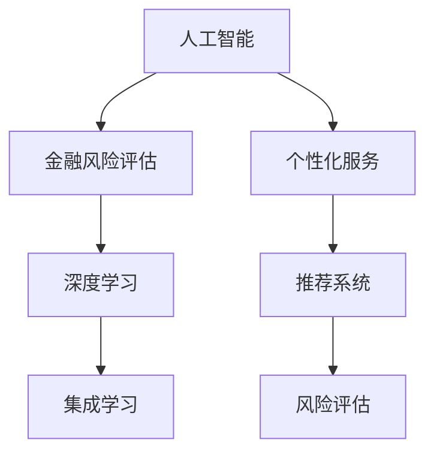

                 

# AI在个性化金融服务中的应用：风险评估

在金融服务领域，风险评估始终是核心竞争力之一。随着人工智能技术的不断进步，AI在金融风险评估中的应用正变得越来越广泛。本文将探讨AI技术在个性化金融服务中风险评估的原理、方法、案例及应用展望。

## 1. 背景介绍

### 1.1 问题由来
金融风险评估是金融服务行业中的重要一环，通过评估借款人、投资标的、交易对手等的风险水平，金融机构能够更好地制定风险管理策略，保护资产安全。传统的风险评估方法依赖于大量的历史数据和经验法则，需要经验丰富的风控人员进行操作，且难以覆盖到长尾小微群体。

近年来，随着大数据、机器学习等技术的成熟，AI开始被广泛应用于风险评估，不仅提高了效率，还大幅提升了评估的精准性和覆盖面。本文将介绍基于AI的个性化金融服务中的风险评估方法，通过实际案例展示其应用效果。

### 1.2 问题核心关键点
AI在风险评估中的应用主要集中在以下几个方面：

1. 数据驱动：利用海量数据进行模型训练，挖掘数据中隐藏的关联关系，构建精准的风险评估模型。
2. 自动化：AI能够自动化处理数据，节省人力成本，提高效率。
3. 个性化：通过个性化模型，实现对不同客户群体、不同场景的风险评估，满足多元化的风险管理需求。
4. 实时性：AI实时分析、实时评估，提高风险管理的动态响应能力。
5. 鲁棒性：AI模型具备较强的泛化能力，能够在不同的数据分布和环境下稳定运行。

本文将重点关注如何构建个性化的AI风险评估模型，并结合实际应用场景进行详细分析。

## 2. 核心概念与联系

### 2.1 核心概念概述

为更好地理解AI在个性化金融服务中风险评估的原理，本节将介绍几个密切相关的核心概念：

- **人工智能（Artificial Intelligence, AI）**：利用计算机算法和数据模型，模仿人的智能行为，以实现自动化决策。
- **金融风险评估（Financial Risk Assessment）**：对金融产品、交易、客户等的风险进行综合评估，以判断其潜在风险水平。
- **个性化服务（Personalized Service）**：根据客户的具体需求和特征，提供定制化的金融产品和服务。
- **深度学习（Deep Learning）**：一种基于神经网络的机器学习方法，能够处理高维数据，捕捉数据中的复杂关联。
- **集成学习（Ensemble Learning）**：结合多个学习模型，提高预测的准确性和鲁棒性。
- **推荐系统（Recommendation System）**：根据用户的历史行为和偏好，推荐合适的金融产品或服务。

这些核心概念之间的逻辑关系可以通过以下Mermaid流程图来展示：



这个流程图展示了几者之间的关系：

1. 人工智能是金融风险评估的基础，通过深度学习等技术，提高模型的准确性和泛化能力。
2. 个性化服务需要依靠AI技术，根据客户的具体需求提供定制化产品。
3. 深度学习作为AI的核心技术，通过多层神经网络，挖掘数据中的复杂关系。
4. 集成学习通过结合多个模型，提升整体预测能力。
5. 推荐系统根据客户行为，推荐合适的金融产品，帮助客户做出更好的决策。
6. 风险评估是金融服务的重要环节，通过AI技术，实现个性化、自动化的风险管理。

## 3. 核心算法原理 & 具体操作步骤
### 3.1 算法原理概述

基于AI的金融风险评估主要采用监督学习和非监督学习两种方法。监督学习通过已标注的历史数据训练模型，预测未来的风险水平；非监督学习则通过聚类等方法，发现数据中的隐含关系，辅助风险管理。

本文重点介绍基于监督学习的AI风险评估方法。其核心思想是：利用历史数据训练模型，将风险因素映射到风险评分，根据评分判断客户的风险水平。

具体步骤如下：

1. **数据预处理**：清洗和标准化数据，去除异常值和缺失值，确保数据质量。
2. **特征工程**：提取有意义的特征，如信用评分、收入水平、消费行为等，构建特征集合。
3. **模型训练**：选择适合的机器学习模型（如决策树、随机森林、神经网络等），在标注数据上训练模型，得到风险评估模型。
4. **风险评分**：将客户特征输入训练好的模型，得到风险评分，评估其风险水平。
5. **风险管理**：根据风险评分，制定风险管理策略，如提高贷款利率、拒绝贷款申请等。

### 3.2 算法步骤详解

以下是基于监督学习的AI风险评估详细步骤：

**Step 1: 数据准备**
- **数据收集**：收集历史客户数据，包括但不限于：
  - 个人基本信息：姓名、年龄、性别、职业等。
  - 财务状况：收入水平、信用评分、负债情况等。
  - 行为数据：消费记录、还款记录等。
- **数据清洗**：处理缺失值、异常值，确保数据完整性和一致性。

**Step 2: 特征工程**
- **特征提取**：从历史数据中提取有意义的特征，如信用评分、月收入、消费频次等。
- **特征编码**：将分类特征转换为数值型特征，如将性别转换为0（男）或1（女）。
- **特征归一化**：将特征值归一化到[0,1]之间，提高模型训练的稳定性。

**Step 3: 模型训练**
- **选择合适的模型**：如随机森林、梯度提升树、神经网络等。
- **训练集划分**：将数据划分为训练集和验证集，通常采用交叉验证方法。
- **模型训练**：在训练集上训练模型，调整超参数，确保模型泛化能力。

**Step 4: 风险评分**
- **评分计算**：将客户的新特征输入模型，计算其风险评分。
- **评分解释**：解释评分结果，帮助业务人员理解模型输出。

**Step 5: 风险管理**
- **策略制定**：根据风险评分，制定风险管理策略，如提高贷款利率、拒绝贷款申请等。
- **实时评估**：实时分析客户数据，更新风险评分，确保风险评估的及时性。

### 3.3 算法优缺点

基于监督学习的AI风险评估方法具有以下优点：

1. **高效性**：模型训练和评分计算速度快，能够实时处理大量数据。
2. **准确性**：通过大量历史数据训练，模型具有较强的泛化能力。
3. **可解释性**：模型输出可解释，帮助业务人员理解决策依据。
4. **自动化**：自动处理数据、训练模型、计算评分，减少人工操作。

同时，该方法也存在以下局限性：

1. **数据依赖**：模型性能高度依赖数据质量，数据不充分或偏差会导致模型效果不佳。
2. **过拟合风险**：模型可能过拟合训练数据，对新数据的泛化能力不足。
3. **模型复杂性**：复杂的模型需要更多的计算资源和时间，可能不适用于小规模数据集。
4. **可解释性不足**：深度学习等复杂模型难以解释其内部工作机制。

### 3.4 算法应用领域

基于AI的金融风险评估方法广泛应用于以下几个领域：

1. **信用风险评估**：评估客户的还款能力，制定相应的贷款政策。
2. **市场风险评估**：分析金融市场的波动性和风险，优化资产配置。
3. **操作风险评估**：监控和评估内部操作的风险，如交易欺诈、系统故障等。
4. **欺诈检测**：识别和防范金融欺诈行为，保护客户资金安全。
5. **产品推荐**：根据客户风险评估结果，推荐合适的金融产品，满足客户需求。

## 4. 数学模型和公式 & 详细讲解 & 举例说明

### 4.1 数学模型构建

本节将使用数学语言对基于监督学习的大语言模型微调过程进行更加严格的刻画。

假设历史客户数据为 $D=\{(x_i,y_i)\}_{i=1}^N, x_i \in \mathbb{R}^d, y_i \in \{0,1\}$，其中 $x_i$ 表示客户特征向量，$y_i$ 表示客户是否存在风险。定义风险评估模型为 $M_{\theta}(x) \in [0,1]$，其中 $\theta$ 为模型参数。

定义模型 $M_{\theta}$ 在输入 $x$ 上的损失函数为 $L(M_{\theta}(x),y)$，则在数据集 $D$ 上的经验风险为：

$$
\mathcal{L}(\theta) = \frac{1}{N} \sum_{i=1}^N L(M_{\theta}(x_i),y_i)
$$

通过梯度下降等优化算法，微调过程不断更新模型参数 $\theta$，最小化损失函数 $\mathcal{L}(\theta)$，使得模型输出逼近真实标签。

### 4.2 公式推导过程

以信用评分预测为例，假设模型为线性回归模型，则损失函数为均方误差：

$$
L(M_{\theta}(x),y) = \frac{1}{2N} \sum_{i=1}^N (y_i - M_{\theta}(x_i))^2
$$

代入经验风险公式，得：

$$
\mathcal{L}(\theta) = \frac{1}{2N} \sum_{i=1}^N (y_i - M_{\theta}(x_i))^2
$$

通过求解目标函数的最小值，得到模型参数 $\theta$：

$$
\theta^* = \mathop{\arg\min}_{\theta} \mathcal{L}(\theta)
$$

### 4.3 案例分析与讲解

以某银行的信用风险评估为例，银行收集了历史客户的信用评分、月收入、负债比例等数据，并标注了每个客户是否存在风险。基于这些数据，银行可以训练一个线性回归模型进行风险预测。具体步骤如下：

1. **数据准备**：收集历史客户数据，清洗和标准化数据。
2. **特征工程**：提取信用评分、月收入、负债比例等特征，并将分类特征转换为数值型特征。
3. **模型训练**：使用随机森林或神经网络，在标注数据上训练模型。
4. **风险评分**：将客户的新特征输入模型，计算其信用评分，评估其风险水平。
5. **风险管理**：根据信用评分，制定相应的贷款政策，如提高贷款利率、拒绝贷款申请等。

假设训练得到的模型为 $M_{\theta}(x) = 0.2x_1 + 0.3x_2 - 0.1x_3$，其中 $x_1$ 表示信用评分，$x_2$ 表示月收入，$x_3$ 表示负债比例。则模型输出即为客户的风险评分，计算公式为：

$$
M_{\theta}(x) = 0.2 \times \text{信用评分} + 0.3 \times \text{月收入} - 0.1 \times \text{负债比例}
$$

## 5. 项目实践：代码实例和详细解释说明

### 5.1 开发环境搭建

在进行风险评估实践前，我们需要准备好开发环境。以下是使用Python进行PyTorch开发的环境配置流程：

1. 安装Anaconda：从官网下载并安装Anaconda，用于创建独立的Python环境。

2. 创建并激活虚拟环境：
```bash
conda create -n pytorch-env python=3.8 
conda activate pytorch-env
```

3. 安装PyTorch：根据CUDA版本，从官网获取对应的安装命令。例如：
```bash
conda install pytorch torchvision torchaudio cudatoolkit=11.1 -c pytorch -c conda-forge
```

4. 安装其他必要的库：
```bash
pip install pandas numpy matplotlib sklearn scikit-learn
```

完成上述步骤后，即可在`pytorch-env`环境中开始风险评估实践。

### 5.2 源代码详细实现

下面以信用评分预测为例，给出使用PyTorch实现的风险评估模型的代码实现。

```python
import torch
import torch.nn as nn
import torch.optim as optim
from sklearn.model_selection import train_test_split
from sklearn.preprocessing import StandardScaler

# 定义模型
class LinearRegression(nn.Module):
    def __init__(self, input_dim):
        super(LinearRegression, self).__init__()
        self.linear = nn.Linear(input_dim, 1)
        
    def forward(self, x):
        return self.linear(x)
    
# 加载数据
df = pd.read_csv('credit_data.csv')
X = df[['credit_score', 'income', 'debt_ratio']]
y = df['default']
X_train, X_test, y_train, y_test = train_test_split(X, y, test_size=0.2, random_state=42)
scaler = StandardScaler()
X_train = scaler.fit_transform(X_train)
X_test = scaler.transform(X_test)

# 数据处理
X_train = torch.from_numpy(X_train).float()
y_train = torch.from_numpy(y_train.values).float()
X_test = torch.from_numpy(X_test).float()
y_test = torch.from_numpy(y_test.values).float()

# 定义模型和优化器
model = LinearRegression(X_train.shape[1])
optimizer = optim.Adam(model.parameters(), lr=0.01)
criterion = nn.MSELoss()

# 训练模型
for epoch in range(100):
    optimizer.zero_grad()
    outputs = model(X_train)
    loss = criterion(outputs, y_train)
    loss.backward()
    optimizer.step()
    
    if (epoch+1) % 10 == 0:
        print('Epoch [{}/{}], Loss: {:.4f}'.format(epoch+1, 100, loss.item()))

# 测试模型
model.eval()
with torch.no_grad():
    outputs = model(X_test)
    loss = criterion(outputs, y_test)
    print('Test Loss: {:.4f}'.format(loss.item()))
```

### 5.3 代码解读与分析

**LinearRegression类**：
- `__init__`方法：定义线性回归模型的结构，包含一个线性层。
- `forward`方法：前向传播计算模型的输出。

**数据处理**：
- 使用pandas加载数据，提取特征和标签。
- 使用sklearn的StandardScaler进行特征归一化。
- 将特征和标签转换为PyTorch张量。

**模型训练**：
- 定义线性回归模型。
- 定义优化器和损失函数。
- 使用Adam优化器在训练集上进行梯度下降训练。

**模型测试**：
- 将模型设置为评估模式，不更新参数。
- 使用测试集计算模型的损失，输出结果。

通过上述代码实现，可以训练一个简单的线性回归模型，用于信用评分预测。模型输出即为客户的风险评分。

## 6. 实际应用场景

### 6.1 智能风控系统

智能风控系统是银行、保险公司等金融机构的重要组成部分，通过AI技术实现自动化风险评估和动态管理。以下是一个智能风控系统的实际应用案例：

**场景**：某保险公司需要评估新客户的信用风险，以便决定是否承保和确定保费。

**方法**：保险公司收集历史客户数据，包括信用评分、收入、负债比例等，训练一个线性回归模型进行信用风险预测。在新客户申请时，将客户信息输入模型，计算其信用评分，根据评分制定承保策略。

**效果**：智能风控系统能够实时处理客户申请，根据客户信息快速评估风险，节省大量人工审核时间，同时提高决策的准确性和稳定性。

### 6.2 信贷评估

信贷评估是金融机构风险管理的核心环节，通过AI技术实现信贷评估的自动化，能够提高审批效率，降低坏账率。

**场景**：某银行需要快速审批小微企业贷款申请，评估其还款能力。

**方法**：银行收集企业历史数据，包括财务报表、贷款记录等，训练一个随机森林或神经网络模型进行信贷评估。在新企业申请贷款时，将企业信息输入模型，计算其信贷评分，根据评分制定贷款策略。

**效果**：AI信贷评估系统能够快速处理大量贷款申请，提高审批效率，同时根据评分进行精准的风险管理，降低坏账率。

### 6.3 动态定价

动态定价是金融产品定价的重要方式，通过AI技术实现个性化定价，能够提高客户满意度和收益。

**场景**：某保险公司需要根据客户风险评估结果，动态调整保费。

**方法**：保险公司收集客户历史数据，包括年龄、健康状况、风险行为等，训练一个决策树模型进行客户风险评估。根据评估结果，制定个性化的保费定价策略，动态调整保费，满足不同客户的需求。

**效果**：动态定价系统能够根据客户风险评估结果，实现个性化定价，提高客户满意度和保费收入。

### 6.4 未来应用展望

随着AI技术的不断进步，未来AI在金融风险评估中还将有更多的应用场景：

1. **风险预警**：通过AI实时监控市场数据和客户行为，及时发现风险信号，提前预警，防止损失扩大。
2. **风险量化**：利用AI技术将风险量化为具体的数值，帮助金融机构更精准地管理风险。
3. **客户画像**：通过AI分析客户数据，构建客户画像，提供个性化的金融服务。
4. **合规检查**：利用AI技术进行合规检查，防止金融犯罪和违规操作。

未来，AI在金融风险评估中的应用将更加广泛和深入，为金融机构提供更高效、精准的风险管理工具。

## 7. 工具和资源推荐
### 7.1 学习资源推荐

为了帮助开发者系统掌握AI在金融风险评估中的应用，这里推荐一些优质的学习资源：

1. 《Python金融数据分析》：详细介绍Python在金融数据分析中的应用，包括数据预处理、模型训练等。
2. 《深度学习入门》：深入浅出地讲解深度学习的基本原理和应用，适合金融从业者学习。
3. 《金融风险管理》：详细讲解金融风险管理的理论和方法，帮助理解风险评估的实际应用。
4. Kaggle金融竞赛：参加Kaggle金融数据分析竞赛，通过实战提升金融数据分析能力。
5. Coursera金融工程课程：Coursera上的金融工程课程，涵盖金融工程、机器学习等领域，适合系统学习。

通过对这些资源的学习实践，相信你一定能够快速掌握AI在金融风险评估中的应用，并用于解决实际的金融问题。

### 7.2 开发工具推荐

高效的开发离不开优秀的工具支持。以下是几款用于AI金融风险评估开发的常用工具：

1. Python：作为AI开发的主流语言，Python拥有丰富的科学计算库和机器学习框架，方便开发和测试。
2. PyTorch：基于Python的深度学习框架，灵活性高，易于调试和优化。
3. TensorFlow：由Google主导开发的深度学习框架，适合大规模工程应用。
4. Scikit-learn：简单易用的机器学习库，提供了多种经典的机器学习算法。
5. Jupyter Notebook：可视化开发环境，方便调试和展示代码结果。

合理利用这些工具，可以显著提升AI金融风险评估的开发效率，加快创新迭代的步伐。

### 7.3 相关论文推荐

金融风险评估领域的研究众多，以下是几篇奠基性的相关论文，推荐阅读：

1. Kaggle竞赛论文：参加Kaggle金融数据分析竞赛的优秀论文，展示了机器学习在金融领域的应用。
2. 《Fraud Detection in Credit Card Transactions using Machine Learning》：研究机器学习在信用卡欺诈检测中的应用，提供了多种算法和评估指标。
3. 《A Review of Credit Risk Assessment Models and Techniques》：全面回顾了信用风险评估的方法和技术，提供了丰富的理论支持。
4. 《Machine Learning in Financial Engineering: A Survey》：综述了机器学习在金融工程中的应用，展示了金融风险评估的多样性。

这些论文代表了大规模机器学习在金融领域的应用进展，通过学习这些前沿成果，可以帮助研究者把握学科前进方向，激发更多的创新灵感。

## 8. 总结：未来发展趋势与挑战

### 8.1 总结

本文对基于AI的金融风险评估方法进行了全面系统的介绍。首先阐述了AI技术在金融服务中风险评估的背景和意义，明确了AI在金融风险评估中的重要性和应用价值。其次，从原理到实践，详细讲解了AI风险评估的数学模型和操作步骤，给出了实际案例的代码实现。同时，本文还广泛探讨了AI风险评估方法在智能风控、信贷评估、动态定价等多个领域的应用前景，展示了AI技术的广阔前景。

通过本文的系统梳理，可以看到，AI技术在金融风险评估中的应用正变得越来越广泛，为金融机构提供了更高效、精准的风险管理工具。未来，伴随AI技术的持续演进，相信金融风险评估方法将不断创新，为金融服务行业带来更大的价值。

### 8.2 未来发展趋势

展望未来，AI在金融风险评估中的应用将呈现以下几个发展趋势：

1. **数据驱动**：利用更多的数据源，如社交媒体、公共数据等，丰富数据集，提高模型的泛化能力。
2. **多模态融合**：结合文本、图像、视频等多种数据源，构建更全面、准确的风险评估模型。
3. **自动化决策**：通过AI实现自动化决策，提高审批效率，降低人工成本。
4. **实时监控**：实时监控金融市场和客户行为，及时发现风险信号，提高风险管理的时效性。
5. **个性化服务**：根据客户风险评估结果，提供个性化的金融产品和服务，提升客户满意度。

以上趋势凸显了AI在金融风险评估中的巨大潜力。这些方向的探索发展，必将进一步提升AI在金融服务中的应用水平，为金融服务行业带来更多的创新和突破。

### 8.3 面临的挑战

尽管AI在金融风险评估中取得了显著成果，但在实际应用中也面临诸多挑战：

1. **数据隐私**：金融数据涉及隐私保护，如何在保证数据安全的同时，充分利用数据进行风险评估，是一大难题。
2. **模型可解释性**：复杂的AI模型难以解释其内部工作机制，如何提高模型的可解释性，增强业务人员的信任感，需要更多的研究。
3. **模型鲁棒性**：AI模型在面对新数据和异常情况时，容易发生决策偏差，如何提高模型的鲁棒性，增强稳定性，是一个重要挑战。
4. **计算资源**：大规模金融数据集需要大量的计算资源，如何在不增加成本的前提下，提高计算效率，是一个现实问题。
5. **法律法规**：金融行业的法律法规对数据使用和模型应用有严格要求，如何在合法合规的前提下，进行风险评估，需要更多的研究和规范。

这些挑战需要在技术、伦理、法律等多个维度进行全面思考和应对。只有从数据、模型、法规等各个方面进行深入探索，才能真正实现AI在金融风险评估中的广泛应用。

### 8.4 研究展望

面对AI在金融风险评估中面临的挑战，未来的研究需要在以下几个方面寻求新的突破：

1. **隐私保护**：研究隐私保护技术，如差分隐私、联邦学习等，保护数据隐私的同时，充分利用数据进行风险评估。
2. **模型可解释性**：引入可解释性方法，如LIME、SHAP等，提高AI模型的可解释性，增强业务人员的信任感。
3. **模型鲁棒性**：研究鲁棒性优化方法，如对抗训练、噪声注入等，提高AI模型的鲁棒性，增强稳定性。
4. **计算资源**：研究高效的计算方法，如模型压缩、模型并行等，提高计算效率，降低成本。
5. **法规合规**：研究AI应用中的法律法规问题，制定相关的规范和标准，保障AI应用的合法合规。

这些研究方向的探索，必将引领AI在金融风险评估技术迈向更高的台阶，为金融服务行业带来更大的价值。面向未来，AI在金融风险评估中的应用还需要与其他AI技术进行更深入的融合，如知识图谱、因果推理、强化学习等，共同推动金融服务的智能化和高效化。只有勇于创新、敢于突破，才能真正实现AI技术在金融风险评估中的广泛应用，为金融服务行业带来更多的创新和突破。

## 9. 附录：常见问题与解答

**Q1：AI在金融风险评估中是否需要大量标注数据？**

A: AI在金融风险评估中确实需要大量的标注数据，数据质量对模型性能有直接影响。标注数据应覆盖不同的客户群体和不同的风险场景，以提高模型的泛化能力。在数据量不足的情况下，可以利用半监督学习、弱监督学习等方法，提高模型的鲁棒性。

**Q2：AI模型如何处理缺失数据？**

A: AI模型对缺失数据处理的方法包括插值、删除等。常用的插值方法有均值插值、中位数插值、KNN插值等。删除方法则根据数据的分布特点，选择适当的方式删除缺失数据。在实际应用中，应根据数据的特点选择合适的方法，以提高模型的性能。

**Q3：AI模型如何进行特征选择？**

A: AI模型特征选择的方法包括特征重要性排序、正则化等。常用的特征重要性排序方法有随机森林、Lasso回归等。正则化方法如L2正则、Dropout等，可以有效减少特征数量，提高模型泛化能力。在实际应用中，应根据数据的特点选择合适的方法，以提高模型的性能。

**Q4：AI模型如何进行模型调参？**

A: AI模型调参的方法包括网格搜索、随机搜索、贝叶斯优化等。常用的网格搜索方法是通过遍历超参数空间，选择最优参数组合。随机搜索则通过随机生成超参数组合，提高调参效率。贝叶斯优化则通过构建高斯过程模型，动态选择超参数组合，提高调参精度。在实际应用中，应根据数据的特点和计算资源选择合适的方法，以提高模型的性能。

**Q5：AI模型如何防止过拟合？**

A: AI模型防止过拟合的方法包括正则化、数据增强、早停等。常用的正则化方法有L2正则、Dropout等。数据增强方法如回译、噪声注入等，可以有效提高模型的泛化能力。早停则通过监控验证集的性能，及时停止训练，防止过拟合。在实际应用中，应根据数据的特点选择合适的方法，以提高模型的性能。

通过本文的系统梳理，可以看到，AI在金融风险评估中的应用正变得越来越广泛，为金融机构提供了更高效、精准的风险管理工具。未来，伴随AI技术的持续演进，相信金融风险评估方法将不断创新，为金融服务行业带来更大的价值。

