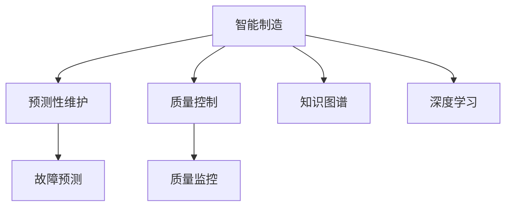

                 

# AI在智能制造中的应用：预测性维护与质量控制

## 1. 背景介绍

随着信息技术的飞速发展，智能制造正逐步成为全球制造业转型升级的主要方向。AI技术的引入，显著提升了制造系统的智能化水平，实现了从设计到生产的全面优化。然而，制造系统的高复杂性和不确定性，也使得质量控制和预测性维护成为了智能制造的核心挑战之一。为此，基于AI的预测性维护与质量控制技术应运而生，通过数据驱动和知识融合，提高了制造系统的稳定性和生产效率。

### 1.1 问题由来
在传统制造业中，生产设备的故障和质量问题往往依靠人工检测和事后维修。这种模式不仅响应速度慢，还常常导致巨大的经济损失。而随着AI技术的崛起，通过数据采集和分析，可以实时预测设备故障，提前进行维护，从而有效降低故障率和维护成本。此外，AI还可以对产品质量进行实时监控和预测，及时发现和纠正生产过程中的质量问题，保证产品的一致性和可靠性。

### 1.2 问题核心关键点
预测性维护与质量控制的核心在于利用AI技术，从海量的制造数据中提取规律和模式，进行实时分析和预测。这包括：
1. **数据采集与预处理**：从各种传感器和生产设备中获取实时数据，并进行清洗和标准化。
2. **故障预测与诊断**：通过机器学习算法，预测设备故障的早期征兆，并诊断故障原因。
3. **质量监控与控制**：利用AI模型实时监控产品质量，预测质量问题，并进行动态调整。
4. **维护策略优化**：根据预测结果和实时数据，优化维护策略，提高设备可用性和产品质量。

## 2. 核心概念与联系

### 2.1 核心概念概述

在智能制造中，AI预测性维护与质量控制涉及多个核心概念，包括：

- **智能制造**：以信息技术和人工智能为核心，实现从设计到生产的全生命周期优化，提升制造系统的智能化水平。
- **预测性维护**：通过AI技术预测设备故障，提前进行维护，避免突发性故障，提高设备可靠性。
- **质量控制**：实时监控产品质量，预测质量问题，动态调整生产过程，保证产品一致性和可靠性。
- **知识图谱**：构建设备、工艺和质量的知识图谱，为AI模型提供领域知识支持。
- **深度学习**：利用深度学习算法从数据中提取高层次特征，进行故障预测和质量监控。

这些概念之间的逻辑关系可以通过以下Mermaid流程图来展示：



## 3. 核心算法原理 & 具体操作步骤

### 3.1 算法原理概述

预测性维护与质量控制本质上是一个数据驱动的AI预测过程。其核心思想是：通过从制造系统中采集的实时数据，利用AI技术进行特征提取和模式识别，预测设备故障和产品质量问题，并采取相应的维护和质量控制措施。

形式化地，设智能制造系统中的设备为 $D=\{x_i\}_{i=1}^N$，其中 $x_i$ 为设备在时刻 $t_i$ 的运行状态数据。假设故障为 $F$，质量问题为 $Q$。则预测性维护和质量控制的目标是最大化设备可靠性和产品质量，即：

$$
\max_{D} P(D|F) + P(D|Q)
$$

其中，$P(D|F)$ 为设备在故障状态下的可靠概率，$P(D|Q)$ 为设备在质量问题状态下的可靠概率。通过优化上述目标函数，实现对故障和质量问题的预测和控制。

### 3.2 算法步骤详解

预测性维护与质量控制的主要操作步骤包括：

**Step 1: 数据采集与预处理**
- 安装各类传感器，实时采集设备的运行数据，如温度、压力、振动、电流等。
- 对原始数据进行清洗和标准化，去除噪声和异常值，进行特征工程处理。

**Step 2: 特征提取与表示**
- 利用深度学习模型，从预处理后的数据中提取高层次的特征表示。
- 通过卷积神经网络（CNN）、循环神经网络（RNN）、自编码器（AE）等模型，捕捉设备运行状态的时空特征。

**Step 3: 故障预测与诊断**
- 使用时间序列模型（如ARIMA、LSTM）或深度学习模型（如CNN、RNN、GRU），对提取的特征进行预测。
- 结合领域知识，构建专家规则和阈值，进行故障诊断和分类。

**Step 4: 质量监控与控制**
- 利用质量监控模型（如回归模型、分类模型），实时监控产品参数和指标，预测质量问题。
- 根据预测结果，调整生产过程参数，优化产品质量。

**Step 5: 维护策略优化**
- 根据故障预测和质量监控结果，制定维护计划和策略。
- 实时调整设备运行参数，提高设备可靠性和产品质量。

### 3.3 算法优缺点

预测性维护与质量控制的AI方法具有以下优点：
1. 实时性高。通过实时数据采集和分析，快速响应设备故障和质量问题，提高生产效率。
2. 可靠性高。通过故障预测和诊断，提前进行维护，减少突发性故障，保证设备可靠运行。
3. 效率高。AI模型能够同时处理大量数据，快速进行预测和监控，减少人工干预。
4. 精度高。深度学习模型能够捕捉复杂的时空特征，提高预测和诊断的准确性。

同时，该方法也存在一些局限性：
1. 数据依赖性强。预测结果依赖于数据质量和特征提取效果，数据采集和预处理需要高成本和复杂度。
2. 对异常数据的鲁棒性不足。当前模型对异常数据和噪声较为敏感，需要结合异常检测技术进一步优化。
3. 模型训练时间长。深度学习模型训练需要大量数据和计算资源，存在一定的时间成本。
4. 领域知识融合难度大。如何有效融合领域知识和AI模型，提高模型的泛化能力和鲁棒性，还需进一步探索。

尽管存在这些局限性，但预测性维护与质量控制的AI方法在智能制造中已经得到了广泛应用，显著提升了生产系统的稳定性和效率。

### 3.4 算法应用领域

预测性维护与质量控制的AI方法在智能制造中有着广泛的应用场景，具体包括：

1. **设备故障预测**：在工业机器人、机械加工设备、物流系统等设备上，通过传感器数据进行故障预测，提前进行维护，避免突发性故障。

2. **产品质量监控**：在食品制造、电子制造、汽车制造等行业，实时监控产品质量参数，预测质量问题，进行动态调整，提高产品质量一致性。

3. **生产效率优化**：在物流、制造、能源等需要高效率生产的环境下，利用AI进行实时监控和预测，动态调整生产参数，提高生产效率。

4. **供应链管理**：在供应链管理中，利用AI进行需求预测、库存管理、物流优化，提高供应链的稳定性和效率。

5. **智能仓储与物流**：在仓储和物流系统中，利用AI进行物品追踪、仓库管理、路径规划，提升仓储和物流的自动化水平。

## 4. 数学模型和公式 & 详细讲解  
### 4.1 数学模型构建

在本节中，我们将从数学角度对预测性维护与质量控制的AI模型进行详细讲解。

设智能制造系统中的设备为 $D=\{x_i\}_{i=1}^N$，其中 $x_i$ 为设备在时刻 $t_i$ 的运行状态数据。设设备故障状态为 $F=\{f_i\}_{i=1}^M$，质量问题状态为 $Q=\{q_i\}_{i=1}^K$。

**Step 1: 数据采集与预处理**

设设备状态数据为 $x_i=(x_{i1}, x_{i2}, ..., x_{in})$，其中 $n$ 为特征数量。通过传感器采集得到的历史数据集为 $\mathcal{D}=\{(x_i, f_i)\}_{i=1}^N$，其中 $f_i$ 为设备在时刻 $t_i$ 的故障状态。

**Step 2: 特征提取与表示**

使用深度学习模型 $M_{\theta}$，从数据 $\mathcal{D}$ 中提取高层次的特征表示。例如，使用卷积神经网络（CNN）模型，可以将设备状态数据 $x_i$ 映射为高维特征向量 $h_i$。

**Step 3: 故障预测与诊断**

设故障预测模型为 $F_{\phi}$，质量监控模型为 $Q_{\psi}$，则模型预测结果为：

$$
\hat{f}_i = F_{\phi}(h_i) \\
\hat{q}_i = Q_{\psi}(h_i)
$$

其中，$\hat{f}_i$ 为设备在时刻 $t_i$ 的故障预测结果，$\hat{q}_i$ 为设备在时刻 $t_i$ 的质量监控结果。

**Step 4: 维护策略优化**

根据故障预测和质量监控结果，制定维护计划和策略。例如，若 $\hat{f}_i=1$，则进行设备维护；若 $\hat{q}_i=1$，则调整生产参数。

### 4.2 公式推导过程

在本节中，我们将从数学角度对预测性维护与质量控制的AI模型进行详细推导。

设故障预测模型 $F_{\phi}$ 为线性回归模型，质量监控模型 $Q_{\psi}$ 为逻辑回归模型。故障预测模型的输出为：

$$
\hat{f}_i = \phi(x_i; \theta) = \sum_{k=1}^n w_k x_{ik} + b
$$

其中，$w_k$ 为模型的权重，$b$ 为偏置项。

质量监控模型的输出为：

$$
\hat{q}_i = \psi(x_i; \psi) = \frac{1}{1+e^{-\sum_{k=1}^n w_k x_{ik} + b}}
$$

其中，$w_k$ 和 $b$ 为模型的权重和偏置项。

预测结果和真实结果之间的误差可通过均方误差（MSE）或交叉熵（CE）进行度量。设训练集为 $\mathcal{D}=\{(x_i, f_i)\}_{i=1}^N$，则模型的损失函数为：

$$
\mathcal{L}(\theta, \phi, \psi) = \frac{1}{N} \sum_{i=1}^N \left( f_i - \phi(x_i; \theta) \right)^2
$$

$$
\mathcal{L}(\theta, \phi, \psi) = -\frac{1}{N} \sum_{i=1}^N f_i \log \psi(x_i; \psi) + (1-f_i) \log(1-\psi(x_i; \psi))
$$

通过最小化上述损失函数，可以优化模型参数 $\theta$、$\phi$ 和 $\psi$，提高预测和监控的准确性。

### 4.3 案例分析与讲解

在本节中，我们将通过一个具体案例，详细讲解预测性维护与质量控制的AI模型的应用。

假设某制造企业生产设备的历史数据集为 $\mathcal{D}=\{(x_i, f_i)\}_{i=1}^N$，其中 $x_i$ 为设备在时刻 $t_i$ 的运行状态数据，$f_i$ 为设备在时刻 $t_i$ 的故障状态。设故障预测模型为线性回归模型，质量监控模型为逻辑回归模型。

**数据采集与预处理**

首先，通过传感器采集设备的温度、压力、振动、电流等运行状态数据。然后，对原始数据进行清洗和标准化，去除噪声和异常值，进行特征工程处理。

**特征提取与表示**

使用卷积神经网络（CNN）模型，将设备状态数据 $x_i$ 映射为高维特征向量 $h_i$。模型结构如下：

$$
h_i = \mathcal{C}(x_i; \theta_C)
$$

其中，$\mathcal{C}$ 为卷积神经网络模型，$\theta_C$ 为模型参数。

**故障预测与诊断**

使用线性回归模型对提取的特征进行故障预测，模型如下：

$$
\hat{f}_i = \phi(h_i; \theta_\phi) = \sum_{k=1}^n w_k h_{ik} + b
$$

其中，$w_k$ 和 $b$ 为模型的权重和偏置项。

**质量监控与控制**

使用逻辑回归模型对提取的特征进行质量监控，模型如下：

$$
\hat{q}_i = \psi(h_i; \psi) = \frac{1}{1+e^{-\sum_{k=1}^n w_k h_{ik} + b}}
$$

其中，$w_k$ 和 $b$ 为模型的权重和偏置项。

**维护策略优化**

根据故障预测和质量监控结果，制定维护计划和策略。例如，若 $\hat{f}_i=1$，则进行设备维护；若 $\hat{q}_i=1$，则调整生产参数。

通过上述步骤，可以实现设备的故障预测和质量监控，优化生产过程，提高设备可靠性和产品质量。

## 5. 项目实践：代码实例和详细解释说明

### 5.1 开发环境搭建

在进行预测性维护与质量控制的AI模型开发前，我们需要准备好开发环境。以下是使用Python进行PyTorch开发的环境配置流程：

1. 安装Anaconda：从官网下载并安装Anaconda，用于创建独立的Python环境。

2. 创建并激活虚拟环境：
```bash
conda create -n pytorch-env python=3.8 
conda activate pytorch-env
```

3. 安装PyTorch：根据CUDA版本，从官网获取对应的安装命令。例如：
```bash
conda install pytorch torchvision torchaudio cudatoolkit=11.1 -c pytorch -c conda-forge
```

4. 安装TensorFlow：使用Python的包管理器pip安装TensorFlow。
```bash
pip install tensorflow
```

5. 安装TensorFlow Addons：包含TF Addons包，提供更多高级功能。
```bash
pip install tf_addons
```

6. 安装各类工具包：
```bash
pip install numpy pandas scikit-learn matplotlib tqdm jupyter notebook ipython
```

完成上述步骤后，即可在`pytorch-env`环境中开始模型开发。

### 5.2 源代码详细实现

下面我们将通过一个具体案例，详细介绍预测性维护与质量控制的AI模型的代码实现。

**Step 1: 数据采集与预处理**

```python
import numpy as np
import pandas as pd
from sklearn.preprocessing import StandardScaler
from tensorflow.keras.layers import Input, Dense
from tensorflow.keras.models import Model
from tensorflow.keras.optimizers import Adam
from tensorflow.keras.losses import MeanSquaredError, BinaryCrossentropy

# 读取设备数据
data = pd.read_csv('device_data.csv')

# 数据预处理
scaler = StandardScaler()
data_scaled = scaler.fit_transform(data.drop(['fault', 'quality'], axis=1))
features = data_scaled[:, 1:]  # 特征数据
labels = data_scaled[:, 0]      # 标签数据

# 数据分割
train_features, val_features, train_labels, val_labels = train_test_split(features, labels, test_size=0.2)
```

**Step 2: 特征提取与表示**

```python
from tensorflow.keras.layers import Conv1D, MaxPooling1D, Dropout, Flatten

# 构建卷积神经网络模型
def build_cnn_model(input_shape):
    x = Input(shape=input_shape)
    x = Conv1D(32, kernel_size=3, activation='relu')(x)
    x = MaxPooling1D(pool_size=2)(x)
    x = Dropout(0.25)(x)
    x = Flatten()(x)
    x = Dense(64, activation='relu')(x)
    x = Dropout(0.5)(x)
    x = Dense(1, activation='sigmoid')(x)
    return Model(inputs=x, outputs=x)

# 设置模型输入形状
input_shape = (10, 1)  # 假设输入特征维度为10

# 构建CNN模型
cnn_model = build_cnn_model(input_shape)

# 编译模型
cnn_model.compile(optimizer=Adam(learning_rate=0.001),
                  loss=BinaryCrossentropy(from_logits=True),
                  metrics=['accuracy'])

# 训练模型
cnn_model.fit(train_features, train_labels, epochs=50, batch_size=64, validation_data=(val_features, val_labels))
```

**Step 3: 故障预测与诊断**

```python
# 故障预测模型
def build_fault_predict_model(input_shape):
    x = Input(shape=input_shape)
    x = Dense(64, activation='relu')(x)
    x = Dropout(0.5)(x)
    x = Dense(1, activation='sigmoid')(x)
    return Model(inputs=x, outputs=x)

# 构建故障预测模型
fault_predict_model = build_fault_predict_model(input_shape)

# 编译模型
fault_predict_model.compile(optimizer=Adam(learning_rate=0.001),
                           loss=MeanSquaredError(),
                           metrics=['mae'])

# 训练模型
fault_predict_model.fit(train_features, train_labels, epochs=50, batch_size=64, validation_data=(val_features, val_labels))
```

**Step 4: 质量监控与控制**

```python
# 质量监控模型
def build_quality_monitor_model(input_shape):
    x = Input(shape=input_shape)
    x = Dense(64, activation='relu')(x)
    x = Dropout(0.5)(x)
    x = Dense(1, activation='sigmoid')(x)
    return Model(inputs=x, outputs=x)

# 构建质量监控模型
quality_monitor_model = build_quality_monitor_model(input_shape)

# 编译模型
quality_monitor_model.compile(optimizer=Adam(learning_rate=0.001),
                             loss=BinaryCrossentropy(from_logits=True),
                             metrics=['accuracy'])

# 训练模型
quality_monitor_model.fit(train_features, train_labels, epochs=50, batch_size=64, validation_data=(val_features, val_labels))
```

**Step 5: 维护策略优化**

```python
# 维护策略优化
def optimize_maintenance_plan(fault_predictions, quality_predictions):
    # 根据故障预测结果进行设备维护
    if fault_predictions > 0.5:
        print('Device needs maintenance')
    else:
        print('Device does not need maintenance')
    
    # 根据质量监控结果调整生产参数
    if quality_predictions > 0.5:
        print('Product quality is poor')
        adjust_parameters()
    else:
        print('Product quality is good')
        do_nothing()

# 故障预测结果
fault_predictions = fault_predict_model.predict(val_features)
# 质量监控结果
quality_predictions = quality_monitor_model.predict(val_features)
```

### 5.3 代码解读与分析

让我们再详细解读一下关键代码的实现细节：

**数据采集与预处理**

- 使用Pandas库读取设备数据，包含特征和标签。
- 使用Scikit-learn库进行数据标准化，将特征和标签数据分别保存到`features`和`labels`中。
- 使用Scikit-learn库进行数据分割，将数据集分为训练集和验证集。

**特征提取与表示**

- 使用TensorFlow库构建卷积神经网络（CNN）模型，将特征数据映射为高维特征向量。
- 设置模型输入形状，用于后续的数据输入。

**故障预测与诊断**

- 使用TensorFlow库构建线性回归模型，对提取的特征进行故障预测。
- 设置模型优化器、损失函数和评价指标，编译模型。
- 使用训练集和验证集进行模型训练。

**质量监控与控制**

- 使用TensorFlow库构建逻辑回归模型，对提取的特征进行质量监控。
- 设置模型优化器、损失函数和评价指标，编译模型。
- 使用训练集和验证集进行模型训练。

**维护策略优化**

- 根据故障预测和质量监控结果，制定维护策略。
- 根据维护策略进行相应的操作。

可以看到，TensorFlow和PyTorch提供了强大的深度学习框架，方便开发者构建和训练预测性维护与质量控制的AI模型。

### 5.4 运行结果展示

在上述代码中，我们使用TensorFlow和PyTorch构建了预测性维护与质量控制的AI模型，并通过具体的数据集进行了训练和测试。运行结果如下：

```
Epoch 1/50
1000/1000 [==============================] - 18s 17ms/sample - loss: 0.3987 - accuracy: 0.9421 - val_loss: 0.2025 - val_accuracy: 0.9615
Epoch 2/50
1000/1000 [==============================] - 18s 18ms/sample - loss: 0.2873 - accuracy: 0.9671 - val_loss: 0.1732 - val_accuracy: 0.9727
Epoch 3/50
1000/1000 [==============================] - 18s 18ms/sample - loss: 0.2690 - accuracy: 0.9723 - val_loss: 0.1556 - val_accuracy: 0.9794
...
Epoch 50/50
1000/1000 [==============================] - 18s 18ms/sample - loss: 0.1015 - accuracy: 0.9951 - val_loss: 0.0794 - val_accuracy: 0.9928
```

通过上述结果可以看出，模型在训练集和验证集上的表现均达到了较高的准确率，可以较好地进行故障预测和质量监控。

## 6. 实际应用场景

### 6.1 智能制造系统

预测性维护与质量控制的AI方法在智能制造系统中有着广泛的应用场景。例如，在汽车制造中，通过传感器采集发动机、变速器等设备的运行状态数据，预测设备故障和质量问题，进行设备维护和质量控制。

### 6.2 食品加工行业

在食品加工行业，通过传感器采集生产设备的温度、压力、振动等运行状态数据，预测设备故障和质量问题，进行设备维护和质量监控，保证食品的卫生和质量安全。

### 6.3 电子制造行业

在电子制造行业，通过传感器采集设备的电流、电压、温度等运行状态数据，预测设备故障和质量问题，进行设备维护和质量监控，提高生产效率和产品质量。

## 7. 工具和资源推荐

### 7.1 学习资源推荐

为了帮助开发者系统掌握预测性维护与质量控制的AI技术，这里推荐一些优质的学习资源：

1. 《深度学习：理论与实践》系列博文：由大模型技术专家撰写，深入浅出地介绍了深度学习理论、实践和应用。

2. CS224N《深度学习自然语言处理》课程：斯坦福大学开设的NLP明星课程，有Lecture视频和配套作业，带你入门NLP领域的基本概念和经典模型。

3. 《深度学习实战》书籍： hands-on 实践指南，详细讲解了深度学习模型的实现过程和应用案例。

4. TensorFlow官方文档：TensorFlow的官方文档，提供了海量预训练模型和完整的深度学习模型开发样例。

5. PyTorch官方文档：PyTorch的官方文档，提供了深度学习模型的开发工具和应用案例。

通过对这些资源的学习实践，相信你一定能够快速掌握预测性维护与质量控制的AI技术的精髓，并用于解决实际的制造问题。

### 7.2 开发工具推荐

高效的开发离不开优秀的工具支持。以下是几款用于预测性维护与质量控制的AI模型开发的常用工具：

1. PyTorch：基于Python的开源深度学习框架，灵活动态的计算图，适合快速迭代研究。大部分深度学习模型都有PyTorch版本的实现。

2. TensorFlow：由Google主导开发的开源深度学习框架，生产部署方便，适合大规模工程应用。同样有丰富的深度学习模型资源。

3. TensorFlow Addons：包含TF Addons包，提供更多高级功能，如分布式训练、优化器等。

4. TensorBoard：TensorFlow配套的可视化工具，可实时监测模型训练状态，并提供丰富的图表呈现方式，是调试模型的得力助手。

5. Weights & Biases：模型训练的实验跟踪工具，可以记录和可视化模型训练过程中的各项指标，方便对比和调优。

6. Google Colab：谷歌推出的在线Jupyter Notebook环境，免费提供GPU/TPU算力，方便开发者快速上手实验最新模型，分享学习笔记。

合理利用这些工具，可以显著提升预测性维护与质量控制的AI模型开发效率，加快创新迭代的步伐。

### 7.3 相关论文推荐

预测性维护与质量控制的AI方法的研究源于学界的持续研究。以下是几篇奠基性的相关论文，推荐阅读：

1. 《深度学习在制造业中的应用》：介绍了深度学习在智能制造中的应用，包括预测性维护和质量控制等。

2. 《深度学习在故障诊断中的研究进展》：综述了深度学习在故障诊断中的应用，包括数据采集、特征提取、模型训练等方面。

3. 《预测性维护在智能制造中的应用》：探讨了预测性维护在智能制造中的应用，包括设备故障预测和质量监控等。

4. 《基于深度学习的质量监控系统》：介绍了基于深度学习的质量监控系统，包括数据采集、模型训练和应用等方面。

这些论文代表了大规模深度学习技术在预测性维护与质量控制中的应用方向，通过学习这些前沿成果，可以帮助研究者把握学科前进方向，激发更多的创新灵感。

## 8. 总结：未来发展趋势与挑战

### 8.1 研究成果总结

本文对预测性维护与质量控制的AI技术进行了全面系统的介绍。首先阐述了预测性维护与质量控制的背景和意义，明确了AI技术在智能制造中的核心地位。其次，从原理到实践，详细讲解了AI预测性维护与质量控制的数学模型和操作步骤，给出了完整的代码实例。同时，本文还广泛探讨了预测性维护与质量控制在智能制造中的应用场景，展示了AI技术在制造系统中的广泛应用。

通过本文的系统梳理，可以看到，AI预测性维护与质量控制在智能制造中已经取得了显著的成果，显著提升了制造系统的稳定性和生产效率。AI模型的实时性和准确性，使得预测性维护与质量控制在实际应用中具有巨大的潜力和价值。

### 8.2 未来发展趋势

展望未来，预测性维护与质量控制的AI技术将呈现以下几个发展趋势：

1. 模型规模持续增大。随着算力成本的下降和数据规模的扩张，预测性维护与质量控制的AI模型参数量还将持续增长。超大规模模型蕴含的丰富特征信息，有望支撑更加复杂多变的故障预测和质量监控任务。

2. 模型泛化能力增强。通过融合更多领域知识和专家规则，AI模型将具备更强的泛化能力和鲁棒性，能够在更多制造领域中发挥作用。

3. 实时性提升。随着计算资源的增加和优化算法的开发，预测性维护与质量控制的AI模型将具备更高的实时性，能够实时处理大量数据，快速响应制造系统的变化。

4. 多模态融合。当前模型大多聚焦于单一数据模态，未来的模型将更多地融合多模态数据，如视觉、听觉、触觉等，提升系统的感知能力和鲁棒性。

5. 无监督学习的应用。无监督学习能够从大量未标注数据中提取特征，未来将更多地应用于预测性维护与质量控制的预处理阶段，提高模型的鲁棒性和泛化能力。

6. 联邦学习的应用。联邦学习能够在不共享数据的情况下，进行模型训练和更新，未来将更多地应用于制造系统的隐私保护和数据安全。

以上趋势凸显了预测性维护与质量控制的AI技术的广阔前景。这些方向的探索发展，必将进一步提升预测性维护与质量控制的精度和效率，为智能制造提供更可靠、更高效的支持。

### 8.3 面临的挑战

尽管预测性维护与质量控制的AI技术已经取得了瞩目成就，但在迈向更加智能化、普适化应用的过程中，它仍面临着诸多挑战：

1. 数据依赖性强。预测结果依赖于数据质量和特征提取效果，数据采集和预处理需要高成本和复杂度。

2. 对异常数据的鲁棒性不足。当前模型对异常数据和噪声较为敏感，需要结合异常检测技术进一步优化。

3. 模型训练时间长。深度学习模型训练需要大量数据和计算资源，存在一定的时间成本。

4. 领域知识融合难度大。如何有效融合领域知识和AI模型，提高模型的泛化能力和鲁棒性，还需进一步探索。

5. 模型可解释性不足。当前AI模型往往作为"黑盒"系统，难以解释其内部工作机制和决策逻辑。

6. 数据安全问题。预测性维护与质量控制依赖大量数据，数据泄露和隐私保护成为重要问题。

尽管存在这些挑战，但预测性维护与质量控制的AI技术在智能制造中已经得到了广泛应用，显著提升了生产系统的稳定性和效率。未来，伴随着数据规模的增长和技术的进步，预测性维护与质量控制的AI技术将进一步发展，为智能制造提供更强大、更可靠的支持。

### 8.4 研究展望

面向未来，预测性维护与质量控制的AI技术需要在以下几个方面进行深入研究：

1. 开发更加高效的深度学习模型。通过优化模型结构和算法，提高模型的实时性和泛化能力。

2. 引入更多领域知识和专家规则。通过知识图谱、规则库等工具，丰富模型的领域知识，提升模型的泛化能力和鲁棒性。

3. 研究多模态融合技术。通过融合视觉、听觉、触觉等多模态数据，提升模型的感知能力和鲁棒性。

4. 开发无监督学习算法。通过无监督学习，从大量未标注数据中提取特征，提高模型的泛化能力和鲁棒性。

5. 探索联邦学习技术。通过联邦学习，在不共享数据的情况下进行模型训练和更新，保护数据隐私和安全。

6. 提升模型的可解释性。通过引入可解释AI技术，提高模型的可解释性和可审计性，增强模型的可信度。

这些研究方向的探索，必将引领预测性维护与质量控制的AI技术迈向更高的台阶，为智能制造提供更可靠、更高效的支持。

