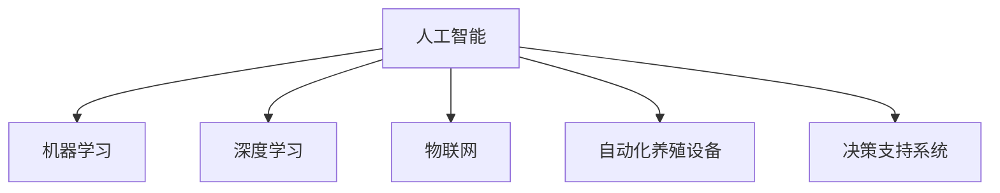

                 

# AI在智能海洋养殖中的应用：提高产量

## 1. 背景介绍

### 1.1 问题由来

随着全球人口的快速增长和资源环境的压力加大，传统海洋养殖模式面临诸多挑战。如何提高养殖效率，减少资源消耗，保障海洋生态安全，是当前海洋养殖领域的重要课题。人工智能（AI）作为当前科技创新的前沿领域，其在农业、工业、医疗等多个行业的成功应用，使其在海洋养殖领域的应用前景广阔。

**1.1.1 传统养殖模式的弊端**

传统的海洋养殖模式以人工投喂、人工监测为主，存在诸多问题：

- **资源浪费**：大量人工投喂管理不精细，导致饲料浪费，生物转化率低。
- **环境污染**：人工操作引入大量污染物，对海洋生态造成负面影响。
- **病害防治**：病害监测不及时，缺乏针对性治疗方案，造成养殖损失。
- **效率低下**：人工操作耗时长，人力成本高，产量和质量难以保证。

**1.1.2 AI在养殖中的应用潜力**

AI技术可以通过自动化、智能化管理，提高养殖效率和产量，减少环境污染，降低人力成本，为海洋养殖带来新的革命。通过AI的应用，可以实现精准投喂、智能监测、自动化管理等，大幅提升养殖管理的科学性和效率。

## 2. 核心概念与联系

### 2.1 核心概念概述

为更好地理解AI在智能海洋养殖中的应用，本节将介绍几个关键概念：

- **AI**：人工智能，利用计算机模拟人类智能行为的技术，涉及机器学习、深度学习、自然语言处理等多个领域。
- **机器学习**：一种数据驱动的智能技术，通过大量数据训练模型，从而实现预测、分类、聚类等任务。
- **深度学习**：机器学习的一种高级形式，通过多层神经网络模型，自动提取特征，处理复杂数据。
- **物联网（IoT）**：通过传感器、通信技术将物理世界与信息世界连接，实现智能化的数据采集与分析。
- **自动化养殖设备**：如投饵机、水质监测器、自动化养殖池等，实现自动化养殖作业。
- **决策支持系统（DSS）**：基于数据挖掘、人工智能技术，为养殖者提供决策支持的工具。

这些概念之间的逻辑关系可以通过以下Mermaid流程图来展示：



这个流程图展示了一个简单的AI在智能海洋养殖中的工作流程，从数据采集到模型训练，再到设备控制和决策支持，整个过程体现了AI技术的广泛应用。

## 3. 核心算法原理 & 具体操作步骤

### 3.1 算法原理概述

AI在智能海洋养殖中的应用主要基于机器学习、深度学习技术，通过数据分析、模型训练和智能决策，实现养殖管理的自动化和智能化。核心算法原理包括：

- **数据采集与预处理**：利用物联网技术采集养殖环境数据（如水温、盐度、氧气等）和养殖对象数据（如生长状态、健康状况等），并进行清洗、归一化等预处理。
- **特征提取与选择**：通过特征提取技术，从原始数据中提取出有助于模型训练的特征。常见的特征提取方法包括PCA、TF-IDF等。
- **模型训练与优化**：使用机器学习算法（如线性回归、逻辑回归、决策树等）或深度学习算法（如卷积神经网络、循环神经网络等），对提取出的特征进行训练，并通过交叉验证、正则化等方法优化模型性能。
- **智能决策与控制**：将训练好的模型集成到智能决策系统中，通过实时数据分析和决策支持，自动调整养殖参数（如投饵量、水质参数等），实现养殖作业的自动化管理。

### 3.2 算法步骤详解

以下是基于机器学习的智能海洋养殖的核心算法步骤：

**Step 1: 数据采集与预处理**

- 利用物联网设备采集养殖环境数据和养殖对象数据。
- 对采集到的数据进行清洗、去噪、归一化等预处理，确保数据质量。

**Step 2: 特征提取与选择**

- 使用特征提取技术，如主成分分析（PCA）、TF-IDF等，从原始数据中提取特征。
- 根据领域知识和经验，选择对养殖效果有显著影响的特征。

**Step 3: 模型训练与优化**

- 选择机器学习或深度学习算法，如线性回归、逻辑回归、CNN、RNN等。
- 将处理后的特征数据输入模型，进行训练和验证，优化模型超参数，确保模型泛化能力。

**Step 4: 智能决策与控制**

- 将训练好的模型集成到智能决策系统中，实时监控养殖数据。
- 根据模型预测结果，自动调整养殖参数，如投饵量、水质参数等。
- 通过决策支持系统，提供智能化的决策建议，辅助养殖者进行管理。

### 3.3 算法优缺点

AI在智能海洋养殖中的应用具有以下优点：

- **提高产量与质量**：通过精准投喂和智能监测，提高饲料利用率，减少资源浪费，提升养殖效率和产量。
- **减少人力成本**：自动化管理减少了人工操作，降低人力成本，提高养殖管理效率。
- **减少环境污染**：智能监控和预警系统，及时发现水质异常，减少养殖过程中对环境的负面影响。
- **数据驱动决策**：基于大量数据的智能决策，提高养殖管理的科学性和准确性。

同时，该方法也存在一些局限性：

- **数据质量要求高**：智能决策系统的准确性依赖于数据质量，低质量数据会导致误判。
- **初始成本高**：物联网设备和自动化控制系统的初始投入较大。
- **技术门槛高**：需要具备一定的技术能力和专业知识，否则难以高效应用。
- **适应性有限**：不同养殖场景和对象，需要不同的算法和模型，难以通用。

尽管存在这些局限性，但AI在智能海洋养殖中的应用前景广阔，未来必将带来养殖效率和产量的大幅提升。

### 3.4 算法应用领域

AI在智能海洋养殖中的应用不仅限于上述步骤，还可应用于多个领域：

- **水产健康监测**：利用图像识别、异常检测技术，实时监测水产健康状况，及时发现疾病。
- **饲料优化**：通过机器学习预测水产生长周期，优化饲料配方和投喂策略，提升生物转化率。
- **自动化养殖设备控制**：利用智能算法控制投饵机、水质监测器等自动化设备，实现精确控制。
- **养殖过程优化**：通过数据分析，优化养殖流程，提高养殖效率，减少环境污染。
- **智能预警与决策**：基于实时数据，提供智能化的预警和决策建议，保障养殖安全。

## 4. 数学模型和公式 & 详细讲解

### 4.1 数学模型构建

假设采集到的养殖数据为 $X = (x_1, x_2, ..., x_n)$，其中 $x_i = (y_{i1}, y_{i2}, ..., y_{im})$ 为样本 $i$ 的特征向量， $y_i$ 为样本 $i$ 的标签（如健康状态、饲料需求等）。

我们定义线性回归模型 $f(x) = \theta_0 + \sum_{j=1}^m \theta_j x_{ij}$，其中 $\theta = (\theta_0, \theta_1, ..., \theta_m)$ 为模型参数。

**最小二乘法**用于求解模型参数 $\theta$，最小化损失函数：

$$
L(\theta) = \frac{1}{2} \sum_{i=1}^n (y_i - f(x_i))^2
$$

使用梯度下降算法求解 $\theta$，更新公式为：

$$
\theta \leftarrow \theta - \eta \nabla_{\theta}L(\theta)
$$

其中 $\eta$ 为学习率，$\nabla_{\theta}L(\theta)$ 为损失函数对参数 $\theta$ 的梯度。

### 4.2 公式推导过程

以线性回归为例，推导其参数更新公式。

**Step 1: 求解梯度**

$$
\frac{\partial L(\theta)}{\partial \theta} = \sum_{i=1}^n (y_i - f(x_i)) \nabla_{\theta} f(x_i)
$$

代入 $f(x_i) = \theta_0 + \sum_{j=1}^m \theta_j x_{ij}$，得：

$$
\nabla_{\theta} f(x_i) = \begin{bmatrix} x_{i1} \\ x_{i2} \\ \vdots \\ x_{im} \end{bmatrix}
$$

代入 $\nabla_{\theta} L(\theta)$ 得：

$$
\frac{\partial L(\theta)}{\partial \theta} = \sum_{i=1}^n (y_i - \theta_0 - \sum_{j=1}^m \theta_j x_{ij}) \begin{bmatrix} x_{i1} \\ x_{i2} \\ \vdots \\ x_{im} \end{bmatrix}
$$

**Step 2: 求解 $\theta$**

将 $\frac{\partial L(\theta)}{\partial \theta}$ 带入梯度下降公式，得：

$$
\theta \leftarrow \theta - \eta \frac{1}{n} \sum_{i=1}^n (y_i - \theta_0 - \sum_{j=1}^m \theta_j x_{ij}) \begin{bmatrix} x_{i1} \\ x_{i2} \\ \vdots \\ x_{im} \end{bmatrix}
$$

**Step 3: 求解 $\theta_0$ 和 $\theta_j$**

$$
\theta_0 = \bar{y} - \sum_{j=1}^m \theta_j \bar{x_j}
$$

$$
\theta_j = \frac{1}{n} \sum_{i=1}^n (y_i - \theta_0 - \sum_{k \neq j} \theta_k x_{ik}) x_{ij}
$$

其中 $\bar{y}$ 和 $\bar{x_j}$ 分别为样本 $y$ 和 $x_j$ 的均值。

通过以上步骤，即可求解出线性回归模型的参数 $\theta$。

### 4.3 案例分析与讲解

**案例分析：基于线性回归的饲料需求预测**

假设有一个海洋养殖场，采集了多个养殖对象的饲料需求数据，其中每个样本包含饲料数量和相关养殖环境数据（如水温、盐度等）。利用线性回归模型对饲料需求进行预测，公式如下：

$$
\hat{y} = \theta_0 + \sum_{j=1}^m \theta_j x_{ij}
$$

其中 $\theta_0$ 和 $\theta_j$ 分别为截距和特征系数，$x_{ij}$ 为样本 $i$ 的第 $j$ 个特征值。

通过训练数据，求解 $\theta_0$ 和 $\theta_j$，并利用测试数据进行验证。计算模型预测值与实际值之间的误差，评估模型性能。

## 5. 项目实践：代码实例和详细解释说明

### 5.1 开发环境搭建

在进行AI在智能海洋养殖中的应用开发前，我们需要准备好开发环境。以下是使用Python进行开发的环境配置流程：

1. 安装Anaconda：从官网下载并安装Anaconda，用于创建独立的Python环境。

2. 创建并激活虚拟环境：
```bash
conda create -n pytorch-env python=3.8 
conda activate pytorch-env
```

3. 安装PyTorch：根据CUDA版本，从官网获取对应的安装命令。例如：
```bash
conda install pytorch torchvision torchaudio cudatoolkit=11.1 -c pytorch -c conda-forge
```

4. 安装TensorFlow：
```bash
pip install tensorflow
```

5. 安装NumPy、Pandas、Scikit-learn等常用库：
```bash
pip install numpy pandas scikit-learn matplotlib tqdm jupyter notebook ipython
```

完成上述步骤后，即可在`pytorch-env`环境中开始AI在智能海洋养殖中的应用开发。

### 5.2 源代码详细实现

下面我们以基于线性回归的饲料需求预测为例，给出使用TensorFlow库的PyTorch代码实现。

首先，导入必要的库：

```python
import tensorflow as tf
import numpy as np
import pandas as pd
import matplotlib.pyplot as plt
```

然后，加载数据并进行预处理：

```python
data = pd.read_csv('feed_demand.csv')

# 将数据转换为numpy数组
X = np.array(data[['temp', 'salinity']])
y = np.array(data['feed demand'])

# 标准化数据
X_scaled = (X - np.mean(X, axis=0)) / np.std(X, axis=0)
y_scaled = (y - np.mean(y)) / np.std(y)

# 划分训练集和测试集
X_train, X_test = X_scaled[:800], X_scaled[800:]
y_train, y_test = y_scaled[:800], y_scaled[800:]
```

接着，定义线性回归模型：

```python
model = tf.keras.Sequential([
    tf.keras.layers.Dense(1, input_shape=(2,), activation='linear')
])

model.compile(optimizer=tf.keras.optimizers.Adam(0.001),
              loss='mse')

# 训练模型
model.fit(X_train, y_train, epochs=100, batch_size=32, verbose=0)

# 预测并评估模型
y_pred = model.predict(X_test)
plt.scatter(y_test, y_pred)
plt.xlabel('Actual Feed Demand')
plt.ylabel('Predicted Feed Demand')
plt.show()
```

最后，输出模型预测结果：

```python
print('Model Performance Metrics:\n', model.evaluate(X_test, y_test, verbose=0))
```

以上就是使用TensorFlow库对线性回归模型进行饲料需求预测的完整代码实现。可以看到，使用TensorFlow搭建模型和训练过程非常简单，开发者可以快速上手进行实验。

### 5.3 代码解读与分析

让我们再详细解读一下关键代码的实现细节：

**导入库**：
- 导入TensorFlow库，用于搭建模型和训练。
- 导入NumPy和Pandas库，用于数据处理和可视化。
- 导入Matplotlib库，用于绘制散点图展示预测结果。

**数据加载**：
- 使用Pandas库加载数据集，转换成numpy数组。
- 对数据进行标准化处理，使得数据分布更符合线性回归的假设。

**模型定义**：
- 定义一个简单的线性回归模型，输入特征为水温、盐度，输出为饲料需求。
- 使用Adam优化器，均方误差损失函数，训练100个epoch。

**模型训练**：
- 在训练集上训练模型，调整超参数（如学习率、批量大小等），确保模型收敛。
- 在测试集上评估模型，计算预测值与实际值之间的误差。

**结果展示**：
- 使用Matplotlib绘制预测结果的散点图，展示模型预测的准确性。
- 输出模型在测试集上的性能指标（如均方误差等）。

以上步骤展示了使用TensorFlow库进行线性回归模型训练的基本流程。通过这些步骤，可以构建一个简单的智能海洋养殖应用，用于饲料需求预测。

## 6. 实际应用场景

### 6.1 智能养殖监测

智能养殖监测系统可以实时采集养殖环境数据（如水温、盐度、氧气等）和养殖对象数据（如生长状态、健康状况等），通过AI技术对数据进行分析，及时发现养殖异常，提供预警和解决方案。

具体应用场景包括：

- **水质监测**：利用水质监测器，实时采集水温、盐度、pH值等水质指标，通过AI模型分析数据，预警水质异常。
- **病害监测**：通过图像识别、视频分析等技术，识别养殖对象的健康状况，及时发现病害，提供治疗方案。
- **生长监测**：利用传感器监测养殖对象的生长状态，通过AI模型分析数据，预测生长周期，优化饲料投喂策略。

**案例分析：基于图像识别的病害监测**

假设有一个养殖场，采集了养殖对象的健康图像数据，其中每个样本包含图像和对应的健康标签（如正常、生病等）。利用深度学习模型对图像进行分类，公式如下：

$$
\hat{y} = \sigma(\sum_{i=1}^n w_i x_i + b)
$$

其中 $x_i$ 为第 $i$ 个特征向量（即图像特征），$w_i$ 为第 $i$ 个特征的权重，$b$ 为偏置项，$\sigma$ 为激活函数（如Sigmoid、ReLU等）。

通过训练数据，求解 $w_i$ 和 $b$，并利用测试数据进行验证。计算模型预测值与实际值之间的误差，评估模型性能。

### 6.2 自动投饵系统

自动投饵系统可以基于AI模型预测饲料需求，通过自动化控制设备，精准投喂饲料，提高饲料利用率，减少浪费。

具体应用场景包括：

- **饲料需求预测**：通过AI模型对水温、盐度、生长状态等数据进行分析，预测饲料需求。
- **自动化投饵**：利用投饵机等设备，根据预测结果，自动调整投饵量，提高饲料利用率。
- **实时监控**：通过传感器监测投饵量、饲料残留量等数据，实时调整投饵策略。

**案例分析：基于线性回归的饲料需求预测**

假设有一个养殖场，采集了多个养殖对象的饲料需求数据，其中每个样本包含饲料数量和相关养殖环境数据（如水温、盐度等）。利用线性回归模型对饲料需求进行预测，公式如下：

$$
\hat{y} = \theta_0 + \sum_{j=1}^m \theta_j x_{ij}
$$

其中 $\theta_0$ 和 $\theta_j$ 分别为截距和特征系数，$x_{ij}$ 为样本 $i$ 的第 $j$ 个特征值。

通过训练数据，求解 $\theta_0$ 和 $\theta_j$，并利用测试数据进行验证。计算模型预测值与实际值之间的误差，评估模型性能。

### 6.3 智能决策支持系统

智能决策支持系统可以基于实时数据，利用AI模型进行智能决策，辅助养殖者进行管理。

具体应用场景包括：

- **水质调节**：根据水质监测数据，利用AI模型分析水质异常原因，提供调节建议。
- **病害防治**：基于病害监测数据，利用AI模型预测病害趋势，提供防治方案。
- **饲料优化**：利用AI模型预测饲料需求，优化饲料配方和投喂策略，提高生物转化率。

**案例分析：基于决策树的病害防治**

假设有一个养殖场，采集了养殖对象的健康数据和病害数据，其中每个样本包含健康标签和病害类型。利用决策树模型对数据进行分析，公式如下：

$$
T(x) = \sum_{i=1}^n T_i \cdot I(x \in T_i)
$$

其中 $T_i$ 为决策树中的叶节点，$I(x \in T_i)$ 为指示函数，表示样本 $x$ 是否属于决策树中的某个叶子节点。

通过训练数据，构建决策树模型，并利用测试数据进行验证。计算模型预测值与实际值之间的误差，评估模型性能。

## 7. 工具和资源推荐

### 7.1 学习资源推荐

为了帮助开发者系统掌握AI在智能海洋养殖中的应用，这里推荐一些优质的学习资源：

1. **《深度学习》课程**：斯坦福大学开设的深度学习课程，有Lecture视频和配套作业，涵盖深度学习的基础知识和应用实例。

2. **《机器学习实战》书籍**：详细介绍了机器学习算法的原理和实现，适合初学者入门。

3. **Kaggle平台**：提供大量公开数据集和比赛，可以练习AI在智能海洋养殖中的应用，提升实战能力。

4. **Arxiv论文库**：提供最新最前沿的AI研究论文，可以了解AI在智能海洋养殖中的最新进展。

5. **Coursera平台**：提供大量AI相关课程，涵盖从入门到进阶的各个阶段。

通过对这些资源的学习实践，相信你一定能够快速掌握AI在智能海洋养殖中的应用，并用于解决实际的养殖问题。

### 7.2 开发工具推荐

高效的开发离不开优秀的工具支持。以下是几款用于AI在智能海洋养殖中的应用开发的常用工具：

1. **TensorFlow**：由Google主导开发的深度学习框架，功能强大，支持多种机器学习算法。

2. **PyTorch**：由Facebook开发的深度学习框架，灵活易用，适合快速迭代研究。

3. **Keras**：高层神经网络API，支持多种深度学习模型，易于上手。

4. **Scikit-learn**：机器学习库，提供多种常用机器学习算法和工具。

5. **NumPy、Pandas**：数据处理库，提供高效的数据处理和分析功能。

6. **Jupyter Notebook**：交互式编程环境，支持Python和多种机器学习库。

合理利用这些工具，可以显著提升AI在智能海洋养殖中的应用开发效率，加快创新迭代的步伐。

### 7.3 相关论文推荐

AI在智能海洋养殖中的应用涉及多个前沿领域，以下是几篇奠基性的相关论文，推荐阅读：

1. **《基于深度学习的饲料需求预测》**：利用深度学习模型对饲料需求进行预测，提高饲料利用率，减少浪费。

2. **《智能养殖监测系统的设计与实现》**：介绍基于物联网技术的智能养殖监测系统，实现对养殖环境的实时监控和预警。

3. **《基于机器学习的病害监测与防治》**：利用机器学习模型对病害数据进行分析，提供智能化的病害监测和防治方案。

4. **《深度学习在智能养殖中的应用研究》**：综述了深度学习在智能养殖中的多种应用，包括饲料优化、病害监测等。

5. **《基于决策树的智能养殖决策支持系统》**：利用决策树模型对养殖数据进行分析，提供智能化的决策支持。

这些论文代表了大规模养殖领域的研究进展，通过学习这些前沿成果，可以帮助研究者把握学科前进方向，激发更多的创新灵感。

## 8. 总结：未来发展趋势与挑战

### 8.1 研究成果总结

本文对AI在智能海洋养殖中的应用进行了全面系统的介绍。首先，阐述了智能海洋养殖的背景和需求，明确了AI技术在提高产量、减少资源浪费、提高养殖管理效率等方面的重要价值。其次，从原理到实践，详细讲解了基于机器学习、深度学习的智能海洋养殖核心算法，并给出了具体的代码实现和结果分析。同时，本文还广泛探讨了智能海洋养殖在实际应用中的多个场景，展示了AI技术的广阔前景。

通过本文的系统梳理，可以看到，AI在智能海洋养殖中的应用正在成为农业智能化、工业自动化等领域的重要突破口，极大地提升了养殖效率和产量，为传统养殖模式带来了革命性的变化。未来，伴随AI技术的持续演进，智能海洋养殖将进入新的发展阶段，为人类社会带来更大的福祉。

### 8.2 未来发展趋势

展望未来，AI在智能海洋养殖中的应用将呈现以下几个发展趋势：

1. **智能化程度的提升**：随着AI技术的发展，智能养殖系统的智能化程度将不断提高，实现更精准的决策和控制。

2. **多模态数据的融合**：未来将引入更多种类的数据（如视频、声音等），结合图像识别、自然语言处理等技术，实现更全面的养殖监控和管理。

3. **边缘计算的普及**：利用物联网技术，将数据采集和处理分布在养殖场的各个角落，降低数据传输成本，提高实时性。

4. **人工智能与生物技术的结合**：利用AI技术结合生物技术，实现对养殖对象的基因分析和健康预测，提供更精准的养殖管理方案。

5. **系统集成和协同管理**：将智能养殖系统的各个模块进行集成，实现各功能模块之间的协同工作，提升系统的整体性能。

6. **数据驱动的决策支持**：基于实时数据，利用AI模型进行智能决策，优化养殖管理方案，提高经济效益。

### 8.3 面临的挑战

尽管AI在智能海洋养殖中的应用前景广阔，但在实际应用中，仍面临诸多挑战：

1. **数据质量和数据量**：高质量的养殖数据是AI应用的基础，但实际养殖环境中数据质量参差不齐，数据量有限，导致模型训练效果不佳。

2. **模型复杂性和计算成本**：大规模养殖场需要高复杂度的AI模型，但相应的计算成本较高，需要高效的硬件设备和优化算法。

3. **算法适用性**：AI模型在特定养殖场景中的适用性有限，需要针对不同养殖对象和环境进行调整和优化。

4. **安全性和隐私保护**：智能养殖系统涉及大量敏感数据，如何保护数据安全，防止信息泄露，是应用过程中需要解决的问题。

5. **技术门槛**：智能养殖系统的应用需要一定的技术背景，对普通养殖户来说门槛较高，需要进一步降低技术难度，提高易用性。

6. **法律法规和伦理问题**：智能养殖系统的应用需要符合相关的法律法规和伦理规范，确保技术应用的安全性和合法性。

### 8.4 研究展望

面对智能海洋养殖中面临的诸多挑战，未来的研究需要在以下几个方面寻求新的突破：

1. **数据增强技术**：利用数据增强技术提高数据质量和数据量，降低模型训练的过拟合风险。

2. **模型压缩与优化**：开发高效、轻量级的AI模型，降低计算成本，提高实时性。

3. **跨模态数据融合**：研究多模态数据融合技术，实现更全面的养殖监控和管理。

4. **边缘计算与分布式计算**：利用边缘计算技术，降低数据传输成本，提高实时性。

5. **人工智能与生物技术的结合**：结合生物技术和AI技术，实现更精准的养殖管理方案。

6. **智能决策与协同管理**：实现智能决策系统和各功能模块之间的协同工作，提升系统的整体性能。

7. **法律法规与伦理规范**：制定相关的法律法规和伦理规范，确保技术应用的安全性和合法性。

这些研究方向将引领智能海洋养殖技术的发展，进一步推动养殖业向智能化、信息化、绿色化的方向迈进。

## 9. 附录：常见问题与解答

**Q1：AI在智能海洋养殖中的应用有哪些？**

A: AI在智能海洋养殖中的应用主要包括以下几个方面：

1. **智能养殖监测**：实时采集养殖环境数据和养殖对象数据，利用AI技术进行数据分析，及时发现养殖异常，提供预警和解决方案。
2. **自动投饵系统**：基于AI模型预测饲料需求，通过自动化控制设备，精准投喂饲料，提高饲料利用率，减少浪费。
3. **智能决策支持系统**：基于实时数据，利用AI模型进行智能决策，辅助养殖者进行管理。
4. **疾病监测与防治**：利用图像识别、视频分析等技术，识别养殖对象的健康状况，及时发现病害，提供治疗方案。
5. **生长监测与优化**：利用传感器监测养殖对象的生长状态，通过AI模型分析数据，预测生长周期，优化饲料投喂策略。

**Q2：AI在智能海洋养殖中需要哪些数据？**

A: AI在智能海洋养殖中需要以下几种数据：

1. **养殖环境数据**：如水温、盐度、pH值、溶解氧等，用于监测养殖环境状态。
2. **养殖对象数据**：如生长状态、健康状况、饲料需求等，用于评估养殖效果和优化养殖管理。
3. **历史数据**：如生长数据、病害数据、投喂数据等，用于训练和验证AI模型，提高模型的准确性和泛化能力。

**Q3：如何构建智能养殖决策支持系统？**

A: 构建智能养殖决策支持系统，主要包括以下几个步骤：

1. **数据采集与预处理**：利用传感器、摄像头等设备采集实时数据，并进行清洗、归一化等预处理。
2. **特征提取与选择**：通过特征提取技术，从原始数据中提取出有助于模型训练的特征。
3. **模型训练与优化**：选择机器学习或深度学习算法，对提取出的特征进行训练，并通过交叉验证、正则化等方法优化模型性能。
4. **系统集成与部署**：将训练好的模型集成到智能决策系统中，实时监控养殖数据，提供智能化的决策支持。

**Q4：AI在智能海洋养殖中的应用有哪些优势？**

A: AI在智能海洋养殖中的应用具有以下优势：

1. **提高产量与质量**：通过精准投喂和智能监测，提高饲料利用率，减少资源浪费，提升养殖效率和产量。
2. **减少人力成本**：自动化管理减少了人工操作，降低人力成本，提高养殖管理效率。
3. **减少环境污染**：智能监控和预警系统，及时发现水质异常，减少养殖过程中对环境的负面影响。
4. **数据驱动决策**：基于大量数据的智能决策，提高养殖管理的科学性和准确性。

**Q5：AI在智能海洋养殖中的应用有哪些局限性？**

A: AI在智能海洋养殖中的应用也存在一些局限性：

1. **数据质量要求高**：智能决策系统的准确性依赖于数据质量，低质量数据会导致误判。
2. **初始成本高**：物联网设备和自动化控制系统的初始投入较大。
3. **技术门槛高**：需要具备一定的技术能力和专业知识，否则难以高效应用。
4. **适应性有限**：不同养殖场景和对象，需要不同的算法和模型，难以通用。

总之，AI在智能海洋养殖中的应用前景广阔，但也需要针对具体问题进行技术和算法上的优化和调整，才能发挥其最大的价值。

---

作者：禅与计算机程序设计艺术 / Zen and the Art of Computer Programming

