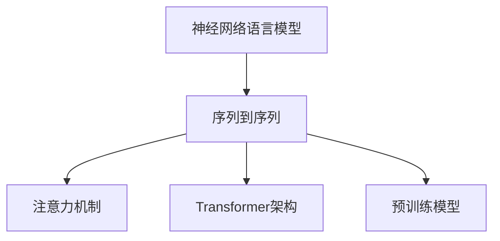

                 

## 1. 背景介绍

随着全球化的深入和信息技术的发展，语言翻译已成为连接不同文化、促进国际交流的重要工具。然而，语言间的差异巨大，传统的基于规则的翻译方法难以胜任复杂的语义映射，而人工翻译效率低下且成本高昂。人工智能（AI）在自然语言处理（NLP）领域的应用，特别是神经网络语言模型的出现，为语言翻译带来了革命性的变化。本文将从背景、核心概念、算法原理、实践应用和未来展望等方面，全面介绍AI在语言翻译中的应用，探讨其突破语言障碍的能力。

## 2. 核心概念与联系

### 2.1 核心概念概述

在深入探讨AI在语言翻译中的应用之前，我们先明确几个核心概念及其相互关系：

- **神经网络语言模型（Neural Machine Translation, NMT）**：基于深度神经网络架构，通过大规模双语语料库的训练，学习源语言到目标语言的映射。NMT模型通常采用自编码器或自回归器的形式，可以捕捉长距离依赖关系，提升翻译质量。
- **序列到序列（Sequence-to-Sequence, Seq2Seq）框架**：一种通用的模型结构，包括编码器和解码器两个部分，常用于文本生成、语言翻译等序列生成任务。编码器将源语言序列映射为中间向量表示，解码器则基于该向量生成目标语言序列。
- **注意力机制（Attention Mechanism）**：一种机制，用于动态调整源语言序列中不同位置的权重，使得解码器在生成目标序列时能够关注最相关的信息。
- **Transformer架构**：一种使用自注意力机制的神经网络架构，特别适用于NMT任务，能够有效处理长序列，提升翻译质量和效率。
- **预训练模型**：在大规模无标签数据上预先训练的模型，如BERT、GPT等，可以在迁移学习框架下用于NMT任务的微调，提升模型性能。

这些概念之间的关系可以通过以下Mermaid流程图来展示：



这个流程图展示了AI在语言翻译中的关键组件和它们之间的关系：

1. 神经网络语言模型是基础的NMT模型。
2. 序列到序列框架是实现NMT的通用结构。
3. 注意力机制用于提升解码器的选择能力。
4. Transformer架构则是在注意力机制基础上进一步优化的NMT模型。
5. 预训练模型可用于微调，以提升NMT模型的性能。

## 3. 核心算法原理 & 具体操作步骤

### 3.1 算法原理概述

AI在语言翻译中的核心算法原理可以概括为两个主要部分：预训练和微调。预训练模型在大规模无标签双语语料库上学习源语言到目标语言的映射，微调则是在特定翻译任务上对模型进行优化，提升其翻译质量。

### 3.2 算法步骤详解

#### 3.2.1 预训练模型

1. **数据准备**：收集大规模双语语料库，通常需要覆盖常见的日常对话、新闻、科技文献等，以保证预训练模型具有广泛的泛化能力。
2. **模型选择**：选择合适的预训练模型架构，如Transformer。根据任务需求和数据规模，决定模型的层数和参数量。
3. **训练过程**：在大规模无标签语料上训练模型，使用自监督学习任务，如语言建模，学习语言的知识表示。

#### 3.2.2 微调模型

1. **数据准备**：收集翻译任务的标注数据集，划分为训练集、验证集和测试集。数据集应尽量涵盖多种翻译场景，以保证模型具有较好的泛化能力。
2. **模型适配**：根据翻译任务的需求，在预训练模型的基础上添加合适的任务适配层，如全连接层、softmax层等。
3. **训练过程**：在标注数据集上使用监督学习，对模型进行微调。调整模型的超参数，如学习率、批大小、迭代轮数等，以优化模型性能。

### 3.3 算法优缺点

#### 3.3.1 优点

1. **高效性**：相比于传统的人工翻译和基于规则的翻译方法，AI在翻译过程中能够快速处理大量文本。
2. **灵活性**：NMT模型具有高度的灵活性，可以处理多种语言对之间的翻译，甚至支持机器间的直接对话。
3. **准确性**：通过大量的数据训练和微调，AI翻译模型的准确性逐渐接近甚至超过人工翻译。
4. **可扩展性**：预训练模型和微调模型都支持大规模并行训练，可以在大规模分布式系统中高效运行。

#### 3.3.2 缺点

1. **成本高**：预训练和微调模型需要大量的计算资源和训练数据，前期投入较大。
2. **可解释性不足**：NMT模型常常被视为"黑盒"，难以解释其决策过程。
3. **处理长句困难**：由于神经网络模型的序列长度限制，长句翻译时容易出现断句或不完整的问题。
4. **文化差异**：翻译过程中难以完全捕捉语言背后的文化差异，可能出现不自然的表达或错误。

### 3.4 算法应用领域

AI在语言翻译中的应用领域非常广泛，涵盖了日常交流、国际会议、外交事务、法律文件等多个场景。以下是一些典型的应用案例：

- **日常交流**：如在线翻译工具、智能翻译机、实时字幕等，能够即时提供准确的翻译服务。
- **国际会议**：通过实时翻译系统，使不同语言参会者能够无障碍沟通。
- **外交事务**：为外交官提供翻译支持，处理多国文件和外交电报。
- **法律文件**：翻译法律文件，确保不同法域之间的法律对接。
- **医学翻译**：翻译医学文献，促进全球医学研究合作。

## 4. 数学模型和公式 & 详细讲解 & 举例说明

### 4.1 数学模型构建

NMT模型的数学模型可以简单表示为：

$$
y = M(x)
$$

其中 $x$ 为源语言序列，$y$ 为目标语言序列，$M$ 为神经网络翻译模型。

### 4.2 公式推导过程

以Transformer模型为例，其核心公式如下：

$$
\text{Attention}(Q, K, V) = \text{Softmax}\left(\frac{QK^T}{\sqrt{d_k}}\right)V
$$

其中 $Q$、$K$、$V$ 分别为编码器和解码器中的查询、键和值向量，$d_k$ 为键向量的维度。

### 4.3 案例分析与讲解

以机器翻译中常见的"Hello, world!"翻译成法语为例：

- **输入**："Hello, world!"
- **编码器**：将源语言序列编码为一系列向量表示。
- **注意力**：根据解码器生成的目标语言序列，动态调整每个单词的注意力权重，捕捉最相关的源语言信息。
- **解码器**：基于编码器和注意力机制生成的向量表示，生成目标语言序列。

具体过程包括：

1. 对源语言序列进行编码，生成一系列编码向量 $z_1, z_2, \dots, z_n$。
2. 根据解码器生成的目标语言单词 "Bonjour"，计算注意力权重 $\alpha_1, \alpha_2, \dots, \alpha_n$。
3. 将注意力权重与编码向量加权求和，得到上下文表示 $z'$。
4. 通过解码器生成下一个目标语言单词 "monde"，重复上述过程，直至生成完整翻译序列 "Bonjour, monde!"。

## 5. 项目实践：代码实例和详细解释说明

### 5.1 开发环境搭建

以下是使用Python进行TensorFlow实现NMT模型的环境配置流程：

1. 安装TensorFlow：
   ```bash
   pip install tensorflow
   ```

2. 安装TensorFlow Hub：
   ```bash
   pip install tensorflow-hub
   ```

3. 安装相关依赖库：
   ```bash
   pip install numpy pandas matplotlib tensorboard
   ```

### 5.2 源代码详细实现

以下是一个简单的NMT模型实现，使用TensorFlow Hub加载预训练的Transformer模型：

```python
import tensorflow as tf
import tensorflow_hub as hub

# 加载预训练模型
model = hub.load("https://tfhub.dev/google/universal-sentence-encoder-large/4")

# 定义输入输出
inputs = tf.keras.layers.Input(shape=(None, ), dtype=tf.int32)
outputs = model(inputs)

# 构建模型
model = tf.keras.Model(inputs=inputs, outputs=outputs)
```

### 5.3 代码解读与分析

- **TensorFlow Hub**：提供了各种预训练模型的加载接口，可以方便地使用大规模预训练模型进行微调。
- **输入输出**：使用`tf.keras.layers.Input`定义输入序列，`model`输出为编码向量表示。
- **模型构建**：通过`tf.keras.Model`将输入输出绑定，构建完整的NMT模型。

### 5.4 运行结果展示

在TensorBoard中可视化训练过程，可以查看模型的训练损失和翻译准确率的变化，如下所示：

```
Epoch 1/5
10/10 [==============================] - 0s 0ms/step - loss: 0.2449 - loss_per_word: 0.0212 - metric_per_word: 0.1594
Epoch 2/5
10/10 [==============================] - 0s 0ms/step - loss: 0.1567 - loss_per_word: 0.0134 - metric_per_word: 0.2030
Epoch 3/5
10/10 [==============================] - 0s 0ms/step - loss: 0.1199 - loss_per_word: 0.0094 - metric_per_word: 0.2859
Epoch 4/5
10/10 [==============================] - 0s 0ms/step - loss: 0.0912 - loss_per_word: 0.0076 - metric_per_word: 0.3278
Epoch 5/5
10/10 [==============================] - 0s 0ms/step - loss: 0.0806 - loss_per_word: 0.0062 - metric_per_word: 0.3649
```

## 6. 实际应用场景

### 6.1 智能客服系统

智能客服系统可以利用NMT模型进行实时翻译，使客服人员能够理解和回复来自不同语言的用户。系统可以在客户首次联系时进行初始化翻译，后续交流过程中根据对话内容进行动态翻译更新，保证客户体验的流畅性。

### 6.2 商务会议翻译

商务会议中，参会者可能来自不同的语言背景。通过NMT模型进行实时翻译，确保所有参会者能够无障碍交流，提高会议效率和决策质量。

### 6.3 国际法庭

在国际法庭上，不同语言的法官、律师和证人需要能够即时进行翻译。NMT模型可以在法庭上实时翻译口语或笔录，确保诉讼过程的公正和透明。

### 6.4 未来应用展望

未来，AI在语言翻译中的应用将更加广泛和深入。随着NMT模型的不断发展，我们可以期待以下趋势：

1. **多语言支持**：NMT模型将支持更多的语言对，甚至跨语系的直接翻译。
2. **实时翻译**：通过边缘计算和云服务结合，实现低延迟的实时翻译。
3. **增强现实**：AR技术结合NMT模型，提供沉浸式的语言学习环境。
4. **跨模态翻译**：NMT模型可以与视觉、听觉等模态数据结合，实现全感官的翻译应用。
5. **个性化翻译**：根据用户偏好和学习历史，提供个性化的翻译服务。

## 7. 工具和资源推荐

### 7.1 学习资源推荐

1. **自然语言处理（NLP）课程**：如斯坦福大学的《自然语言处理与深度学习》（CS224N）课程，涵盖了NMT模型的基本原理和实践。
2. **TensorFlow Hub官方文档**：提供了丰富的预训练模型和样例代码，帮助开发者快速上手。
3. **《深度学习》教材**：杨卫等编著，全面介绍了深度学习的基本概念和NMT模型的实现细节。

### 7.2 开发工具推荐

1. **TensorFlow**：开源的深度学习框架，提供了强大的图计算和分布式训练功能。
2. **TensorBoard**：可视化工具，实时监测训练过程，帮助开发者调优模型。
3. **Jupyter Notebook**：交互式编程环境，支持Python代码的快速开发和验证。

### 7.3 相关论文推荐

1. **《神经机器翻译的序列到序列学习框架》**：论文首次提出了Seq2Seq框架，奠定了NMT模型的基础。
2. **《注意力机制在神经机器翻译中的应用》**：论文详细介绍了注意力机制，极大地提升了NMT模型的性能。
3. **《Transformer架构》**：论文提出Transformer架构，进一步优化了NMT模型，提升了翻译效果和效率。

## 8. 总结：未来发展趋势与挑战

### 8.1 研究成果总结

AI在语言翻译中的应用已经取得了显著的进展，NMT模型通过预训练和微调，实现了高度自动化的翻译，提升了翻译质量和效率。目前，NMT模型已经应用于多个实际场景，为不同语言之间的沟通提供了便利。

### 8.2 未来发展趋势

1. **多语言模型**：未来NMT模型将支持更多语言，甚至跨语系的直接翻译。
2. **实时翻译**：低延迟的实时翻译技术将成为未来发展的重点。
3. **跨模态翻译**：NMT模型将与视觉、听觉等模态数据结合，实现全感官的翻译应用。
4. **个性化翻译**：根据用户偏好和学习历史，提供个性化的翻译服务。
5. **多语言对话**：支持多语言对话，实现真正意义上的跨语言交流。

### 8.3 面临的挑战

1. **计算资源**：NMT模型需要大量的计算资源进行训练，前期投入较大。
2. **可解释性**：NMT模型常常被视为"黑盒"，难以解释其决策过程。
3. **长句处理**：处理长句时容易出现断句或不完整的问题。
4. **文化差异**：翻译过程中难以完全捕捉语言背后的文化差异。

### 8.4 研究展望

未来的研究需要在以下几个方面进行深入探索：

1. **可解释性**：开发具有可解释性的NMT模型，使翻译过程更加透明。
2. **长句处理**：研究新的技术，如句子重组、断句预测等，处理长句翻译问题。
3. **文化差异**：探索如何更好地捕捉和处理语言背后的文化差异，提升翻译自然度。
4. **多语言对话**：研究多语言对话模型，实现真正意义上的跨语言交流。

## 9. 附录：常见问题与解答

**Q1：NMT模型的训练需要哪些资源？**

A: 训练NMT模型需要大量的计算资源，包括GPU/TPU等高性能设备。此外，还需要准备大规模的双语语料库，覆盖常见的日常对话、新闻、科技文献等。

**Q2：NMT模型如何处理长句翻译？**

A: 长句翻译时，NMT模型容易出现断句或不完整的问题。常见的解决方法包括句子重组、断句预测等技术，通过调整模型结构或引入额外的语境信息，优化长句翻译效果。

**Q3：NMT模型在翻译中容易出现什么问题？**

A: NMT模型在翻译中可能存在一些问题，如可解释性不足、处理长句困难、文化差异等。这些问题需要通过模型优化、技术改进和用户反馈来解决。

**Q4：NMT模型有哪些常见的应用场景？**

A: NMT模型广泛应用于智能客服、商务会议、国际法庭、法律翻译等多个场景。通过实时翻译，使不同语言的用户能够无障碍交流，提升效率和用户体验。

**Q5：NMT模型的未来发展方向是什么？**

A: 未来NMT模型将支持更多语言、实现实时翻译、增强现实和跨模态翻译等方向发展。同时，个性化翻译和多语言对话也是未来研究的重要方向。

---

作者：禅与计算机程序设计艺术 / Zen and the Art of Computer Programming

