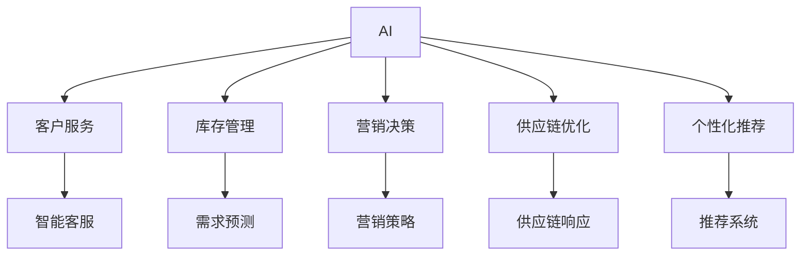

                 

# AI在零售业中的应用前景

## 1. 背景介绍

### 1.1 问题由来
随着人工智能(AI)技术的快速发展，AI在零售业的应用已经成为行业数字化转型的重要驱动力。AI技术在零售业中的应用，从客户服务、库存管理到营销决策、供应链优化，无所不在。AI的广泛应用，不仅提升了零售企业的运营效率，优化了客户体验，还推动了行业的创新和变革。

### 1.2 问题核心关键点
当前，AI在零售业的应用主要集中在以下几个方面：

1. **客户服务**：通过聊天机器人、智能客服等技术，提升客户服务效率和体验。
2. **库存管理**：利用AI进行需求预测和库存优化，避免积压或缺货。
3. **营销决策**：通过数据分析和预测，制定更加精准的营销策略。
4. **供应链优化**：AI辅助决策，提高供应链的响应速度和灵活性。
5. **个性化推荐**：基于客户行为和偏好，提供个性化商品推荐。

这些应用极大地提高了零售业的运营效率和客户满意度，但也面临着数据隐私、模型解释性、技术集成等问题。如何更好地整合AI技术，提升零售业的智能化水平，成为行业关注的焦点。

### 1.3 问题研究意义
AI在零售业的应用，有助于零售企业提升运营效率、优化客户体验、降低成本，增强市场竞争力。通过AI技术，零售企业可以实现从粗放式管理到精细化运营的转变，为消费者提供更加个性化、高效的服务，从而实现业务的可持续发展。

## 2. 核心概念与联系

### 2.1 核心概念概述

为更好地理解AI在零售业的应用，本节将介绍几个密切相关的核心概念：

- **AI**：人工智能技术的统称，包括机器学习、深度学习、自然语言处理等子领域。
- **零售业**：指通过购买、销售、服务等活动进行商品或服务交换的行业，涉及零售商、供应商、客户等多个参与者。
- **客户服务**：指通过提供多种渠道的交互方式，满足客户需求并提升客户体验。
- **库存管理**：指对库存进行规划、采购、存储、补货等活动的全过程管理。
- **营销决策**：指基于市场数据和消费者行为，制定有效的营销策略和活动。
- **供应链优化**：指通过数据分析和AI技术，优化供应链的各个环节，提升整体效率和灵活性。
- **个性化推荐**：指根据客户的历史行为和偏好，提供定制化的商品推荐。

这些核心概念之间的逻辑关系可以通过以下Mermaid流程图来展示：



这个流程图展示了AI技术在零售业的各个应用场景：

1. AI通过智能客服等技术提升客户服务效率和体验。
2. 利用需求预测等技术优化库存管理。
3. 通过数据分析和预测，制定精准的营销策略。
4. AI辅助决策，优化供应链响应。
5. 基于客户行为和偏好，提供个性化商品推荐。

## 3. 核心算法原理 & 具体操作步骤
### 3.1 算法原理概述

AI在零售业的应用，主要依赖于机器学习和深度学习技术。其核心思想是：通过大量历史数据的训练，构建模型预测未来的趋势和行为，从而辅助决策。

形式化地，假设零售企业的数据集为 $D=\{(x_i,y_i)\}_{i=1}^N$，其中 $x_i$ 为历史数据，如销售记录、库存量等，$y_i$ 为相应的标签或目标变量，如未来销售预测、客户满意度等。AI模型的目标是找到最优的模型参数 $\theta$，使得模型在新的数据集上的预测结果与真实标签尽可能接近。

具体而言，常见的AI模型包括线性回归、决策树、随机森林、神经网络等。以神经网络为例，其训练过程包括前向传播、损失计算、反向传播、参数更新等步骤。通过不断迭代优化，模型逐渐学习到数据中的规律，并对新数据进行预测。

### 3.2 算法步骤详解

AI在零售业的应用主要包括以下几个关键步骤：

**Step 1: 数据准备**
- 收集零售企业的历史数据，包括销售记录、库存量、客户反馈等。
- 对数据进行预处理，包括清洗、归一化、特征工程等，以提高数据质量。

**Step 2: 模型选择**
- 根据业务需求选择合适的AI模型，如线性回归、神经网络、深度学习等。
- 确定模型参数和超参数，如学习率、批大小、训练轮数等。

**Step 3: 模型训练**
- 使用历史数据对模型进行训练，计算损失函数并更新模型参数。
- 使用交叉验证等技术评估模型性能，选择合适的模型参数。

**Step 4: 模型应用**
- 将训练好的模型应用于新的数据，进行预测和决策。
- 对预测结果进行评估和调整，优化模型效果。

**Step 5: 模型部署**
- 将模型集成到实际的零售业务系统中，实现自动化决策。
- 持续监控模型效果，定期更新模型以适应新的业务需求。

### 3.3 算法优缺点

AI在零售业的应用具有以下优点：
1. 提升效率。AI可以自动化处理大量数据，快速做出决策，提升运营效率。
2. 优化体验。通过智能客服、个性化推荐等技术，提升客户满意度和体验。
3. 降低成本。AI技术可以优化库存管理、营销策略等，降低运营成本。

同时，AI在零售业的应用也存在一定的局限性：
1. 数据质量依赖。AI模型的性能高度依赖于数据质量，数据缺失或不完整会影响模型效果。
2. 模型解释性不足。深度学习等复杂模型难以解释决策过程，难以被决策者理解和信任。
3. 技术集成复杂。AI技术的引入需要企业投入大量资源进行技术集成和系统改造。

尽管存在这些局限性，但AI在零售业的应用仍具有巨大的潜力。未来相关研究的重点在于如何进一步提升数据质量，提高模型解释性，简化技术集成等，以实现更高效的零售运营。

### 3.4 算法应用领域

AI在零售业的应用广泛，覆盖了从客户服务到供应链优化等多个领域。具体如下：

- **客户服务**：智能客服、聊天机器人、语音识别等技术，提升客户服务效率和体验。
- **库存管理**：需求预测、库存优化等技术，避免积压或缺货。
- **营销决策**：数据分析和预测，制定精准的营销策略。
- **供应链优化**：数据分析和AI技术，提高供应链的响应速度和灵活性。
- **个性化推荐**：基于客户行为和偏好，提供个性化商品推荐。

这些应用极大地提升了零售业的运营效率和客户满意度，成为AI技术在零售业的重要应用范式。

## 4. 数学模型和公式 & 详细讲解 & 举例说明
### 4.1 数学模型构建

AI在零售业的应用，通常依赖于机器学习和深度学习模型。这里以线性回归模型为例，构建一个简单的需求预测模型。

假设零售企业的需求量 $y$ 与时间 $x$ 之间的关系可以用线性回归模型表示：

$$
y = \beta_0 + \beta_1 x
$$

其中 $\beta_0$ 为截距，$\beta_1$ 为斜率。通过大量历史数据 $D=\{(x_i,y_i)\}_{i=1}^N$ 对模型进行训练，得到最优的 $\beta_0$ 和 $\beta_1$ 值。

### 4.2 公式推导过程

线性回归模型的参数估计过程如下：

1. **最小二乘法**：计算各历史数据点的残差平方和 $SSE=\sum_{i=1}^N (y_i - \hat{y}_i)^2$，其中 $\hat{y}_i$ 为模型预测值。
2. **求解参数**：对 $\beta_0$ 和 $\beta_1$ 进行求解，使得 $SSE$ 最小化。
3. **回归方程**：得到最优参数后，构建回归方程 $\hat{y} = \beta_0 + \beta_1 x$，用于预测未来的需求量。

使用最小二乘法求解线性回归模型的参数估计公式为：

$$
\beta_0 = \frac{\sum_{i=1}^N (y_i - \overline{y})x_i - \sum_{i=1}^N x_i (\overline{y} - \overline{x}y)}{\sum_{i=1}^N x_i^2 - \sum_{i=1}^N x_i^2}
$$

$$
\beta_1 = \frac{\sum_{i=1}^N x_iy_i - N\overline{x}\overline{y}}{\sum_{i=1}^N x_i^2 - N\overline{x}^2}
$$

其中 $\overline{x}$ 和 $\overline{y}$ 分别为数据的均值。

### 4.3 案例分析与讲解

以一家零售企业的历史销售数据为例，假设销售量 $y$ 与时间 $x$ 之间的关系可以用线性回归模型表示。以下是具体实现步骤：

1. **数据准备**：收集过去一年的销售数据，包括每天的销售额和日期。
2. **模型训练**：使用历史数据对线性回归模型进行训练，得到最优参数 $\beta_0$ 和 $\beta_1$。
3. **模型应用**：使用训练好的模型预测未来7天的销售额。
4. **效果评估**：将预测结果与实际销售数据进行对比，评估模型效果。

## 5. 项目实践：代码实例和详细解释说明
### 5.1 开发环境搭建

在进行AI应用开发前，我们需要准备好开发环境。以下是使用Python进行PyTorch开发的环境配置流程：

1. 安装Anaconda：从官网下载并安装Anaconda，用于创建独立的Python环境。
2. 创建并激活虚拟环境：
```bash
conda create -n pytorch-env python=3.8 
conda activate pytorch-env
```

3. 安装PyTorch：根据CUDA版本，从官网获取对应的安装命令。例如：
```bash
conda install pytorch torchvision torchaudio cudatoolkit=11.1 -c pytorch -c conda-forge
```

4. 安装TensorBoard：用于可视化模型训练过程。

5. 安装Keras：作为模型的高级API，方便模型构建和训练。

### 5.2 源代码详细实现

以下是一个基于线性回归模型的零售需求预测的PyTorch代码实现：

```python
import torch
import torch.nn as nn
import torch.optim as optim
import pandas as pd
import numpy as np
from sklearn.preprocessing import StandardScaler
from sklearn.model_selection import train_test_split

class LinearRegressionModel(nn.Module):
    def __init__(self, input_dim, output_dim):
        super(LinearRegressionModel, self).__init__()
        self.linear = nn.Linear(input_dim, output_dim)
    
    def forward(self, x):
        return self.linear(x)

def train(model, train_loader, loss_fn, optimizer, epochs):
    model.train()
    for epoch in range(epochs):
        for batch_idx, (x, y) in enumerate(train_loader):
            x, y = x.to(device), y.to(device)
            optimizer.zero_grad()
            output = model(x)
            loss = loss_fn(output, y)
            loss.backward()
            optimizer.step()
            if (batch_idx + 1) % 100 == 0:
                print('Train Epoch: {} [{}/{} ({:.0f}%)]\tLoss: {:.6f}'.format(
                    epoch, batch_idx * len(x), len(train_loader.dataset),
                    100. * batch_idx / len(train_loader), loss.item()))

def test(model, test_loader, loss_fn):
    model.eval()
    test_loss = 0
    with torch.no_grad():
        for x, y in test_loader:
            x, y = x.to(device), y.to(device)
            output = model(x)
            test_loss += loss_fn(output, y).item()
    return test_loss / len(test_loader.dataset)

# 读取数据
data = pd.read_csv('sales_data.csv')
X = data[['date']]
y = data['sales']

# 数据预处理
X = X.as_matrix().reshape(-1, 1)
X_scaled = StandardScaler().fit_transform(X)

# 分割数据集
X_train, X_test, y_train, y_test = train_test_split(X_scaled, y, test_size=0.2, random_state=42)

# 模型定义和训练
device = torch.device('cuda' if torch.cuda.is_available() else 'cpu')
input_dim, output_dim = X_train.shape[1], 1
model = LinearRegressionModel(input_dim, output_dim).to(device)
loss_fn = nn.MSELoss()
optimizer = optim.SGD(model.parameters(), lr=0.01)

train_loader = torch.utils.data.DataLoader(torch.tensor(X_train), batch_size=32)
test_loader = torch.utils.data.DataLoader(torch.tensor(X_test), batch_size=32)

train(model, train_loader, loss_fn, optimizer, 1000)
test_loss = test(model, test_loader, loss_fn)
print('Test Loss: {:.6f}'.format(test_loss))
```

以上代码实现了基于线性回归模型的零售需求预测。首先，读取数据并进行预处理，然后将数据集分割为训练集和测试集。接着，定义模型、损失函数和优化器，并使用训练集进行模型训练。最后，使用测试集评估模型效果。

### 5.3 代码解读与分析

让我们再详细解读一下关键代码的实现细节：

**线性回归模型类定义**：
- `__init__`方法：初始化模型的线性层。
- `forward`方法：定义前向传播过程，将输入数据通过线性层得到输出。

**数据预处理**：
- 使用Pandas读取数据集，选择日期和销售额作为特征和标签。
- 将日期转换为数值型特征。
- 对特征进行标准化处理，以提高模型训练效果。

**模型训练和评估**：
- 使用PyTorch的DataLoader对数据进行批处理。
- 在训练过程中，使用SGD优化器更新模型参数。
- 在测试过程中，计算模型在测试集上的损失函数值，评估模型效果。

## 6. 实际应用场景
### 6.1 智能客服系统

AI在智能客服系统中的应用，可以极大地提升客户服务效率和体验。传统客服往往需要配备大量人力，高峰期响应缓慢，且一致性和专业性难以保证。而使用智能客服系统，可以24/7不间断服务，快速响应客户咨询，用自然流畅的语言解答各类常见问题。

在技术实现上，可以构建一个基于深度学习的智能客服系统，通过自然语言处理技术理解客户问题，并自动给出答案。系统可以集成语音识别、自然语言理解、对话管理等多个组件，形成完整的客服解决方案。

### 6.2 库存管理

AI在库存管理中的应用，可以显著提升库存的响应速度和灵活性。传统库存管理依赖于人工记录和预测，存在数据不准确、预测不精准等问题。通过AI技术，可以实现对库存的实时监控和优化。

具体而言，可以使用深度学习模型预测未来的销售量，并通过优化算法动态调整库存水平。系统可以集成需求预测、库存优化、自动补货等多个功能，提升库存管理效率和准确性。

### 6.3 营销决策

AI在营销决策中的应用，可以辅助企业制定更加精准的营销策略。传统营销决策依赖于人工经验和直觉，存在主观性和不确定性。通过AI技术，可以对大量市场数据进行分析，预测市场趋势和客户行为，制定更加科学的营销策略。

具体而言，可以使用机器学习模型分析客户历史行为数据，预测未来的购买意愿和购买金额，从而制定个性化的营销策略。系统可以集成数据分析、预测模型、广告投放等多个功能，提升营销效果和ROI。

### 6.4 供应链优化

AI在供应链优化中的应用，可以显著提升供应链的响应速度和灵活性。传统供应链管理依赖于人工经验和直觉，存在主观性和不确定性。通过AI技术，可以实现对供应链的实时监控和优化。

具体而言，可以使用机器学习模型预测未来的需求量，并通过优化算法动态调整供应链资源。系统可以集成需求预测、库存优化、自动补货等多个功能，提升供应链管理效率和准确性。

### 6.5 个性化推荐

AI在个性化推荐中的应用，可以提升用户的购物体验和满意度。传统推荐系统依赖于简单的推荐算法，存在准确性和多样性不足的问题。通过AI技术，可以实现对用户行为和偏好的深入分析，提供更加精准和多样化的推荐。

具体而言，可以使用协同过滤、深度学习等技术，分析用户历史行为数据，预测未来的购买意愿和购买金额，从而制定个性化的推荐策略。系统可以集成数据分析、推荐算法、用户反馈等多个功能，提升用户满意度和忠诚度。

## 7. 工具和资源推荐
### 7.1 学习资源推荐

为了帮助开发者系统掌握AI在零售业的应用，这里推荐一些优质的学习资源：

1. 《深度学习》系列课程：斯坦福大学开设的深度学习课程，有Lecture视频和配套作业，带你入门深度学习的基本概念和经典模型。
2. 《自然语言处理综论》书籍：北京大学出版社出版的自然语言处理教材，系统介绍自然语言处理的基本概念和前沿技术。
3. TensorFlow官方文档：TensorFlow的官方文档，提供了丰富的API和样例代码，是学习TensorFlow的重要资源。
4. PyTorch官方文档：PyTorch的官方文档，提供了丰富的API和样例代码，是学习PyTorch的重要资源。
5. Kaggle：全球最大的数据科学竞赛平台，提供大量的数据集和竞赛题目，帮助你实践和提升技能。

通过对这些资源的学习实践，相信你一定能够快速掌握AI在零售业的应用，并用于解决实际的零售问题。

### 7.2 开发工具推荐

高效的开发离不开优秀的工具支持。以下是几款用于AI应用开发的常用工具：

1. Jupyter Notebook：开源的交互式笔记本，支持Python、R等多种语言，方便调试和分享代码。
2. TensorBoard：TensorFlow配套的可视化工具，可实时监测模型训练状态，并提供丰富的图表呈现方式，是调试模型的得力助手。
3. Keras：高级API，简化了深度学习模型的构建和训练过程。
4. PyTorch：基于Python的开源深度学习框架，灵活动态的计算图，适合快速迭代研究。
5. Scikit-Learn：常用的机器学习库，提供丰富的模型和算法。

合理利用这些工具，可以显著提升AI应用开发的效率，加快创新迭代的步伐。

### 7.3 相关论文推荐

AI在零售业的应用源于学界的持续研究。以下是几篇奠基性的相关论文，推荐阅读：

1. Deep Learning for Retail: A Survey and Tutorial（深度学习在零售领域的综述和教程）：系统综述了深度学习在零售业中的应用，包括需求预测、库存管理、个性化推荐等。
2. Sales Forecasting in Retail: A Survey and Case Studies（零售行业销售预测综述和案例研究）：综述了零售行业销售预测的研究现状和实际应用案例。
3. A Comparative Study on Customer-Driven Product Recommendations in E-Commerce（电子零售客户驱动产品推荐的比较研究）：比较了不同的推荐算法，分析了其在零售行业的应用效果。
4. Enhancing Retail Customer Experience through AI and Robotics（AI和机器人技术提升零售客户体验）：探讨了AI和机器人技术在零售客户体验中的应用。

这些论文代表了大数据和AI在零售业的应用现状和发展趋势。通过学习这些前沿成果，可以帮助研究者把握学科前进方向，激发更多的创新灵感。

## 8. 总结：未来发展趋势与挑战
### 8.1 总结

本文对AI在零售业的应用进行了全面系统的介绍。首先阐述了AI技术在零售业中的广泛应用及其重要性，明确了AI在提升运营效率、优化客户体验、降低成本等方面的巨大潜力。其次，从原理到实践，详细讲解了AI应用的数学模型和算法流程，给出了具体实现代码实例。最后，探讨了AI在零售业应用的实际场景和未来发展趋势。

通过本文的系统梳理，可以看到，AI技术在零售业的应用已经成为行业数字化转型的重要驱动力，通过智能化升级，零售企业可以实现从粗放式管理到精细化运营的转变，为消费者提供更加个性化、高效的服务，从而实现业务的可持续发展。

### 8.2 未来发展趋势

展望未来，AI在零售业的应用将呈现以下几个发展趋势：

1. 智能化程度提升。随着AI技术的不断进步，未来的零售系统将更加智能化，能够实现对客户行为、市场趋势等复杂信息的深度理解和自主决策。
2. 跨领域融合。AI技术将与物联网、大数据、区块链等新兴技术融合，形成更加全面、灵活的智能零售解决方案。
3. 个性化推荐优化。通过进一步深入分析用户行为数据，提供更加精准和多样化的个性化推荐，提升用户满意度和忠诚度。
4. 实时响应能力增强。通过实时监控和预测，优化库存和供应链管理，提高响应速度和灵活性。
5. 数据隐私保护。随着数据量的大幅增加，数据隐私和安全问题将更加重要，未来的AI应用将更加注重数据保护和隐私合规。

以上趋势凸显了AI技术在零售业应用的广阔前景。这些方向的探索发展，必将进一步提升零售业的智能化水平，为消费者提供更加高效、个性化和安全的购物体验。

### 8.3 面临的挑战

尽管AI在零售业的应用已经取得了显著成果，但在迈向更加智能化、普适化应用的过程中，仍面临诸多挑战：

1. 数据质量问题。AI模型的性能高度依赖于数据质量，数据缺失或不完整会影响模型效果。未来的AI应用需要更加注重数据收集和清洗，确保数据的质量和完整性。
2. 模型解释性不足。深度学习等复杂模型难以解释决策过程，难以被决策者理解和信任。未来需要更多可解释性研究，提升模型的透明度和可信度。
3. 技术集成复杂。AI技术的引入需要企业投入大量资源进行技术集成和系统改造。未来的AI应用需要更加注重模块化和可扩展性，降低技术集成的复杂度。
4. 数据隐私和安全。随着数据量的大幅增加，数据隐私和安全问题将更加重要。未来的AI应用需要更加注重数据保护和隐私合规。
5. 跨领域融合难度大。AI技术与其他新兴技术的融合需要跨学科知识，未来的AI应用需要更多跨领域研究和协作。

正视AI在零售业应用面临的这些挑战，积极应对并寻求突破，将是大数据和AI技术实现零售业智能化升级的重要保障。相信随着学界和产业界的共同努力，这些挑战终将一一被克服，AI技术必将在零售业迈向更加广泛的落地应用。

### 8.4 研究展望

面向未来，AI在零售业的研究需要从以下几个方向寻求新的突破：

1. 深入研究数据质量提升方法。开发更多高效的数据清洗和预处理技术，确保数据的质量和完整性。
2. 加强可解释性研究。开发更多可解释性强的AI模型，提升模型的透明度和可信度。
3. 探索跨领域融合技术。加强与物联网、大数据、区块链等新兴技术的融合，形成更加全面、灵活的智能零售解决方案。
4. 优化个性化推荐算法。通过进一步深入分析用户行为数据，提供更加精准和多样化的个性化推荐，提升用户满意度和忠诚度。
5. 提升实时响应能力。通过实时监控和预测，优化库存和供应链管理，提高响应速度和灵活性。
6. 加强数据隐私和安全保护。开发更多数据保护和隐私合规技术，确保数据的安全和隐私。

这些研究方向的探索，必将引领AI技术在零售业实现更高效的智能化升级，为消费者提供更加高效、个性化和安全的购物体验。面向未来，AI在零售业的应用还需要与其他AI技术进行更深入的融合，如知识表示、因果推理、强化学习等，多路径协同发力，共同推动智能零售系统的进步。只有勇于创新、敢于突破，才能不断拓展AI在零售业的应用边界，让智能技术更好地造福人类社会。

## 9. 附录：常见问题与解答

**Q1：AI在零售业的应用主要依赖于哪些技术？**

A: AI在零售业的应用主要依赖于机器学习和深度学习技术。具体包括自然语言处理、计算机视觉、强化学习等多个子领域。

**Q2：AI在零售业的应用中如何处理数据隐私问题？**

A: 在AI应用中，数据隐私和保护非常重要。通常采用以下方法：
1. 数据匿名化：对敏感数据进行去标识化处理，保护用户隐私。
2. 差分隐私：在数据收集和处理过程中，加入噪声，保护用户隐私。
3. 访问控制：对数据访问进行严格控制，确保数据只能被授权人员访问。
4. 数据加密：对敏感数据进行加密处理，防止数据泄露。

**Q3：AI在零售业的应用中如何提高模型的解释性？**

A: 提高模型解释性是AI在零售业应用中的重要问题。通常采用以下方法：
1. 模型简化：使用简单模型代替复杂模型，提升模型的可解释性。
2. 可解释性技术：使用可解释性技术，如LIME、SHAP等，提升模型的透明度和可信度。
3. 知识图谱：将AI模型与知识图谱结合，提供更多结构化信息，增强模型的可解释性。

**Q4：AI在零售业的应用中如何优化个性化推荐？**

A: 优化个性化推荐是AI在零售业应用中的重要目标。通常采用以下方法：
1. 协同过滤：分析用户历史行为数据，预测未来的购买意愿和购买金额。
2. 深度学习：使用深度学习模型，从大量数据中学习用户行为规律，提供更精准的推荐。
3. 多模态融合：结合文本、图像、语音等多种模态信息，提供更全面的推荐。

**Q5：AI在零售业的应用中如何提高实时响应能力？**

A: 提高实时响应能力是AI在零售业应用中的重要需求。通常采用以下方法：
1. 实时数据采集：对实时数据进行采集和处理，提供即时反馈。
2. 实时分析：对实时数据进行实时分析，及时调整决策。
3. 自动补货：根据实时需求数据，自动调整库存水平，提高响应速度和灵活性。

通过本文的系统梳理，可以看到，AI在零售业的应用已经成为行业数字化转型的重要驱动力，通过智能化升级，零售企业可以实现从粗放式管理到精细化运营的转变，为消费者提供更加个性化、高效的服务，从而实现业务的可持续发展。相信随着技术的不断发展，AI在零售业的应用将更加广泛和深入，为消费者带来更多便利和价值。

