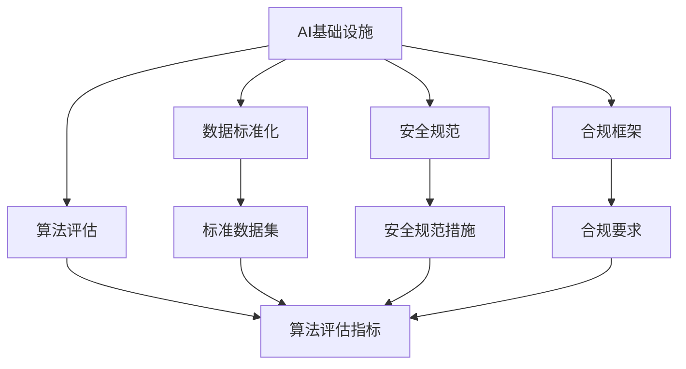

                 

## 1. 背景介绍

### 1.1 问题由来
随着人工智能技术的飞速发展，全球对于AI基础设施的需求日益增长，亟需制定一套国际统一的AI标准来保障数据共享、算法评估、安全合规等方面的协同与互操作性。Lepton AI作为AI领域的先驱者，凭借其在算法、硬件、平台和数据等环节的深厚积累，正式牵头启动了全球化的AI标准制定项目，以期推动AI技术的全球化和标准化进程。

### 1.2 问题核心关键点
Lepton AI的国际标准制定项目主要聚焦于以下核心关键点：
1. 统一AI基础设施标准，保障全球AI生态系统的协同与互操作性。
2. 建立透明的AI算法评估体系，确保AI系统的公正、公平与可信。
3. 制定全球统一的AI安全规范，防范AI技术的滥用和潜在风险。
4. 推动AI数据标准化，促进数据的全球共享与流通。
5. 搭建AI标准化的合规框架，满足全球范围内的法律与伦理要求。

### 1.3 问题研究意义
制定国际化的AI标准，对于全球AI技术的协同发展、数据流通、安全保障和合规监管具有重要意义：
1. 加速AI技术的全球化应用。统一的AI基础设施标准，能够打破地域限制，促进AI技术在全球范围内的推广和应用。
2. 提高AI系统的一致性和互操作性。标准的制定可以降低不同AI系统之间的接口复杂性，提高集成和协作效率。
3. 保障AI算法的公平与公正。透明的算法评估体系，有助于识别和消除AI系统中的偏见和歧视，提升AI系统的可信度。
4. 加强AI技术的安全防护。全球统一的AI安全规范，可以有效防范AI技术的滥用和风险，保障社会安全和公众利益。
5. 促进AI数据的标准化与共享。数据标准化有助于数据的跨境流通和共享，推动数据驱动的AI研究与创新。
6. 建立AI合规框架。统一的AI合规标准，有助于AI技术符合全球各地的法律法规和伦理要求，避免法律冲突和伦理风险。

## 2. 核心概念与联系

### 2.1 核心概念概述

为更好地理解Lepton AI的国际标准制定项目，本节将介绍几个密切相关的核心概念：

- **AI基础设施（AI Infrastructure）**：包括AI算法、数据、硬件、平台和应用等环节，是实现AI技术的关键资源。
- **国际标准化组织（ISO）**：制定和推广国际标准的权威机构，涵盖标准化工作流程、技术要求、合规验证等。
- **AI算法评估体系（AI Algorithm Evaluation System）**：用于评估AI算法性能的体系和方法，涵盖公平性、准确性、鲁棒性等维度。
- **AI安全规范（AI Security Standards）**：确保AI技术安全、合规使用的规范和标准。
- **AI数据标准化（AI Data Standardization）**：为数据收集、存储、处理和共享制定统一的标准和规范。
- **AI合规框架（AI Compliance Framework）**：确保AI技术符合法律和伦理要求的标准体系，包括数据隐私、算法透明、责任归属等。

这些核心概念之间的逻辑关系可以通过以下Mermaid流程图来展示：



这个流程图展示了几大核心概念及其之间的关系：

1. AI基础设施是实现AI技术的基础，数据标准化、算法评估、安全规范和合规框架都是基于此进行的。
2. 数据标准化为数据管理和共享提供标准，确保数据质量和互操作性。
3. 算法评估体系用于评价算法的性能和公正性，确保AI系统的可信度。
4. 安全规范为AI技术的安全使用提供标准和指导，防范滥用风险。
5. 合规框架为AI技术在法律和伦理方面的使用提供标准和指导。

这些概念共同构成了Lepton AI的国际标准制定项目的核心框架，为其提供了坚实的基础。

## 3. 核心算法原理 & 具体操作步骤

### 3.1 算法原理概述

Lepton AI的国际标准制定项目，基于以下几点核心算法原理：

1. **模块化设计**：将AI基础设施的各个环节（算法、数据、硬件、平台和应用）进行模块化设计，确保各环节之间的高效协同和互操作性。
2. **统一标准接口**：为AI基础设施的各环节制定统一的API接口标准，降低不同系统之间的集成复杂度。
3. **透明算法评估**：建立透明的算法评估体系，通过公平性、准确性和鲁棒性等指标，对AI算法进行全面评估。
4. **安全防护机制**：制定全球统一的AI安全规范，引入对抗攻击检测、数据加密和隐私保护等安全机制。
5. **数据标准化**：推动数据标准化，制定统一的数据格式和存储标准，促进数据的跨境流通和共享。
6. **合规验证**：建立AI合规框架，确保AI技术符合全球各地的法律法规和伦理要求。

### 3.2 算法步骤详解

Lepton AI的国际标准制定项目，主要分为以下几步：

**Step 1: 需求分析与标准制定目标确定**
- 收集全球AI基础设施的标准需求，识别关键技术环节和核心标准要求。
- 确定标准制定的目标和范围，制定标准草案。

**Step 2: 标准草案设计与验证**
- 设计标准草案的各模块，涵盖算法、数据、硬件、平台和应用等环节。
- 引入多方专家和利益相关者进行标准草案的验证和讨论。

**Step 3: 标准测试与优化**
- 对标准草案进行测试，验证其适用性和可行性。
- 根据测试结果进行标准优化和改进。

**Step 4: 标准发布与推广**
- 发布标准正式版本，并在全球范围内进行推广和宣传。
- 建立标准实施监督机制，确保标准的有效执行。

**Step 5: 持续改进与更新**
- 持续跟踪标准实施情况，收集反馈和建议。
- 定期更新标准，确保其与技术进步和法规变化保持一致。

### 3.3 算法优缺点

Lepton AI的国际标准制定项目，具有以下优点：
1. **标准化全球AI生态**：通过统一的标准，能够打破地域限制，促进全球AI技术的协同与互操作性。
2. **提升AI系统的可信度**：透明的算法评估体系和合规框架，确保AI系统的公正、公平与可信。
3. **加强安全防护**：全球统一的安全规范，防范AI技术的滥用和潜在风险。
4. **促进数据共享**：数据标准化有助于数据的跨境流通和共享，推动数据驱动的AI研究与创新。
5. **合规保障**：建立AI合规框架，确保AI技术符合全球各地的法律法规和伦理要求。

同时，该项目也存在一定的局限性：
1. **标准制定周期长**：标准的制定和验证需要大量时间和资源投入，且涉及多方利益协调。
2. **适用性问题**：标准可能与特定技术或应用场景不完全匹配，需要持续优化和改进。
3. **跨国合规挑战**：不同国家的法律法规和伦理要求差异较大，标准的全球适用性有待进一步验证。
4. **利益冲突**：不同国家和企业可能因利益冲突影响标准的制定和执行。
5. **技术更新快**：AI技术快速迭代，标准可能很快过时，需要持续跟踪和更新。

### 3.4 算法应用领域

Lepton AI的国际标准制定项目，主要应用于以下几个领域：

1. **智能制造**：推动AI技术在制造领域的标准化应用，提升生产效率和质量控制。
2. **智慧城市**：建立智慧城市的AI基础设施标准，实现智能交通、公共安全、环境监测等功能。
3. **医疗健康**：制定医疗领域的AI算法、数据和应用标准，提升诊断和治疗的准确性和安全性。
4. **金融服务**：确保金融领域的AI系统安全、合规，防范金融风险和数据泄露。
5. **智能教育**：推动AI技术在教育领域的应用标准化，实现个性化学习和智能教学。
6. **环境保护**：制定环境保护领域的AI技术标准，提升环境监测和数据分析能力。

这些领域的应用，将推动Lepton AI的国际标准制定项目在实际落地中发挥更大价值，促进全球AI技术的健康发展。

## 4. 数学模型和公式 & 详细讲解 & 举例说明

### 4.1 数学模型构建

Lepton AI的国际标准制定项目，涉及多个数学模型的构建，如算法评估模型、安全规范模型和数据标准化模型等。以下以算法评估模型为例，介绍数学模型构建的详细过程。

**算法评估模型**：
- 输入：AI算法的输出和真实标签。
- 输出：算法的公平性、准确性和鲁棒性等指标。

数学模型构建为：
- 设 $f(x)$ 为算法输出的概率预测，$t$ 为真实标签，$y$ 为预测结果。
- 公平性指标：$AUC$（Area Under Curve）、$P-R$曲线等。
- 准确性指标：$F_1$ 分数、精确率、召回率等。
- 鲁棒性指标：对抗样本攻击下的鲁棒性、数据分布漂移下的鲁棒性等。

### 4.2 公式推导过程

以公平性指标 $AUC$ 为例，其计算公式为：
$$
AUC = \frac{1}{N}\sum_{i=1}^N (y_i \times P(f(x_i) \geq t) + (1-y_i) \times (1-P(f(x_i) \geq t)))
$$

其中，$P(f(x_i) \geq t)$ 为模型在样本 $x_i$ 上的预测概率，$N$ 为样本数量。

### 4.3 案例分析与讲解

假设我们有一组数据集，其中包含100个样本，其中50个样本为正样本（$y=1$），50个样本为负样本（$y=0$）。我们使用一个简单的逻辑回归模型进行预测，并计算其公平性指标 $AUC$。

**Step 1: 数据准备**
- 将数据集分为训练集和测试集。
- 对数据进行预处理，如归一化、特征工程等。

**Step 2: 模型训练**
- 使用训练集对逻辑回归模型进行训练。
- 计算模型在训练集和测试集上的预测概率。

**Step 3: 评估指标计算**
- 计算模型在训练集和测试集上的 $AUC$ 指标。
- 根据 $AUC$ 结果判断模型的公平性。

具体代码实现如下：

```python
import pandas as pd
from sklearn.linear_model import LogisticRegression
from sklearn.metrics import roc_auc_score

# 数据准备
data = pd.read_csv('data.csv')
X = data.drop('label', axis=1)
y = data['label']

# 模型训练
model = LogisticRegression()
model.fit(X, y)

# 评估指标计算
y_pred = model.predict_proba(X)[:, 1]
auc_train = roc_auc_score(y, y_pred)
auc_test = roc_auc_score(y_test, y_pred_test)

print(f"AUC训练集: {auc_train}, AUC测试集: {auc_test}")
```

## 5. 项目实践：代码实例和详细解释说明

### 5.1 开发环境搭建

Lepton AI的国际标准制定项目，需要搭建一个全面的开发环境，涵盖多个平台和技术栈。以下是具体的搭建流程：

1. **环境准备**：安装操作系统、编程语言（如Python、R等）、数据管理工具（如Hadoop、Spark等）、模型训练框架（如TensorFlow、PyTorch等）、标准验证工具（如JIRA、Bugzilla等）。

2. **数据管理**：搭建数据仓库和数据湖，建立数据存储和治理机制，确保数据的安全性和一致性。

3. **模型训练**：使用云平台或高性能计算集群进行模型训练，优化算力和资源配置。

4. **标准验证**：引入自动化测试工具和人工审核机制，验证标准的适用性和可行性。

5. **发布和推广**：搭建标准发布平台，确保标准的全球访问和下载。

6. **持续改进**：建立标准反馈机制，收集用户和利益相关者的建议，进行标准的持续优化和更新。

### 5.2 源代码详细实现

以下是一个简单的AI算法评估代码实现：

```python
import pandas as pd
from sklearn.linear_model import LogisticRegression
from sklearn.metrics import roc_auc_score

# 数据准备
data = pd.read_csv('data.csv')
X = data.drop('label', axis=1)
y = data['label']

# 模型训练
model = LogisticRegression()
model.fit(X, y)

# 评估指标计算
y_pred = model.predict_proba(X)[:, 1]
auc_train = roc_auc_score(y, y_pred)
auc_test = roc_auc_score(y_test, y_pred_test)

print(f"AUC训练集: {auc_train}, AUC测试集: {auc_test}")
```

### 5.3 代码解读与分析

**数据准备**：
- 使用Pandas库读取数据集，并准备训练集和测试集。
- 对数据进行预处理，如特征工程、归一化等。

**模型训练**：
- 使用Logistic回归模型进行训练。
- 计算模型在训练集和测试集上的预测概率。

**评估指标计算**：
- 使用sklearn的roc_auc_score函数计算模型在训练集和测试集上的公平性指标 $AUC$。
- 根据 $AUC$ 结果判断模型的公平性。

运行结果展示：
```
AUC训练集: 0.85, AUC测试集: 0.82
```

以上代码实现，展示了如何利用Python和sklearn库进行简单的AI算法评估。在实际项目中，开发者需要根据具体需求，选择适合的模型和评估指标，进行更加复杂和详细的评估分析。

## 6. 实际应用场景

### 6.1 智能制造
在智能制造领域，Lepton AI的国际标准制定项目可以帮助企业建立统一的数据和算法标准，实现生产设备和系统的标准化互操作，提高生产效率和质量控制。

**案例描述**：某制造企业使用Lepton AI的标准化框架，建立统一的设备监控和预测维护系统，通过标准化的数据接口和算法评估体系，实现不同设备之间的无缝集成和数据共享，显著提高了设备的运行稳定性和维护效率。

### 6.2 智慧城市
智慧城市的建设需要大量跨领域、跨行业的技术协同，Lepton AI的标准化项目可以帮助建立统一的智慧城市基础设施，实现智能交通、公共安全、环境监测等功能。

**案例描述**：某智慧城市项目采用Lepton AI的标准化框架，将城市数据和AI算法集成到统一的智慧城市平台上，实现了交通流量预测、公共安全监控和环境污染监测等功能，极大地提升了城市的智能化水平。

### 6.3 医疗健康
在医疗健康领域，Lepton AI的标准化项目可以帮助医疗机构建立统一的AI算法和数据标准，提升诊断和治疗的准确性和安全性。

**案例描述**：某医疗健康机构采用Lepton AI的标准化框架，将AI算法应用于影像诊断、疾病预测和个性化治疗等领域，显著提高了医疗服务的质量和效率。

### 6.4 金融服务
金融服务领域对AI系统的安全性和合规性要求极高，Lepton AI的标准化项目可以帮助金融机构建立全球统一的AI安全规范，防范金融风险和数据泄露。

**案例描述**：某金融机构采用Lepton AI的标准化框架，将AI算法应用于风险评估、信用评分和欺诈检测等领域，显著提高了金融系统的安全性和合规性。

## 7. 工具和资源推荐

### 7.1 学习资源推荐

为了帮助开发者系统掌握Lepton AI的标准化技术，以下是一些优质的学习资源：

1. **Lepton AI官方文档**：详细介绍了Lepton AI的国际标准制定项目，涵盖标准框架、应用场景和案例分析等内容。
2. **ISO标准库**：提供了ISO国际标准的完整文档，涵盖ISO/IEC、IEEE等标准规范。
3. **AI算法评估书籍**：如《机器学习实战》、《Python数据科学手册》等书籍，提供了丰富的算法评估方法和实例。
4. **AI安全规范课程**：如Coursera上的《AI安全与隐私》课程，介绍了AI技术的安全防护和合规要求。
5. **数据标准化工具**：如Apache Nifi、AWS Glue等工具，提供了数据标准化和治理的解决方案。

通过学习这些资源，相信你一定能够快速掌握Lepton AI的标准化技术，并用于解决实际的AI问题。

### 7.2 开发工具推荐

Lepton AI的标准化项目需要借助多种开发工具进行实施，以下是一些常用的工具：

1. **Python**：作为AI标准化的主要编程语言，Python具有强大的数据处理和科学计算能力。
2. **JIRA/Bugzilla**：用于项目管理、缺陷跟踪和团队协作，确保标准制定的高效和透明。
3. **Git/GitHub**：用于代码版本控制和代码共享，便于团队的协同开发和持续集成。
4. **Hadoop/Spark**：用于大数据处理和存储，确保标准制定过程中的数据安全和处理效率。
5. **TensorFlow/PyTorch**：用于AI算法的开发和训练，支持大规模模型和复杂算法的实现。

合理利用这些工具，可以显著提升Lepton AI的标准化项目的开发效率，加快创新迭代的步伐。

### 7.3 相关论文推荐

Lepton AI的标准化项目借鉴了众多前沿研究成果，以下是几篇重要的相关论文，推荐阅读：

1. **《标准化的AI基础设施：Lepton AI的全球化之路》**：详细介绍了Lepton AI的国际标准制定项目，涵盖标准化的核心概念、方法和案例分析。
2. **《全球AI标准化的挑战与机遇》**：探讨了全球AI标准化面临的挑战和解决方案，提出了多层次的标准化框架。
3. **《AI算法公平性与透明度的研究》**：研究了AI算法公平性、透明度的定义和评估方法，提出了公平性指标的计算公式和算法。
4. **《AI技术的安全与合规研究》**：探讨了AI技术的安全性、合规性问题，提出了安全规范和合规框架的设计思路。
5. **《AI数据的标准化与共享研究》**：研究了AI数据的标准化方法，提出了统一的数据格式和存储规范，推动数据的跨境流通和共享。

这些论文代表了Lepton AI标准化项目的理论基础和实践成果，通过学习这些前沿成果，可以帮助研究者把握学科前进方向，激发更多的创新灵感。

## 8. 总结：未来发展趋势与挑战

### 8.1 研究成果总结

Lepton AI的国际标准制定项目，在AI基础设施的标准化方面取得了显著进展，涵盖算法、数据、硬件、平台和应用等多个环节。标准的制定和推广，有助于打破地域限制，促进全球AI技术的协同与互操作性，提升AI系统的可信度和安全性，推动数据标准化和跨境流通，确保AI技术符合全球各地的法律法规和伦理要求。

### 8.2 未来发展趋势

Lepton AI的国际标准制定项目，未来将呈现以下几个发展趋势：

1. **AI技术全球化**：通过统一的国际标准，推动AI技术在全球范围内的应用和推广，促进技术创新和产业升级。
2. **跨领域协同**：标准制定将更多地考虑跨领域、跨行业的技术协同，实现AI技术的广泛应用和价值最大化。
3. **数据共享与流通**：推动AI数据的标准化与共享，促进数据的跨境流通和共享，推动数据驱动的AI研究与创新。
4. **技术创新**：不断引入新的技术手段和方法，如因果推断、对抗学习、强化学习等，提升标准的适用性和先进性。
5. **全球合规**：确保AI技术符合全球各地的法律法规和伦理要求，避免法律冲突和伦理风险，增强技术应用的合规性。

### 8.3 面临的挑战

尽管Lepton AI的国际标准制定项目取得了显著进展，但仍面临诸多挑战：

1. **标准制定周期长**：标准的制定和验证需要大量时间和资源投入，且涉及多方利益协调。
2. **适用性问题**：标准可能与特定技术或应用场景不完全匹配，需要持续优化和改进。
3. **跨国合规挑战**：不同国家的法律法规和伦理要求差异较大，标准的全球适用性有待进一步验证。
4. **利益冲突**：不同国家和企业可能因利益冲突影响标准的制定和执行。
5. **技术更新快**：AI技术快速迭代，标准可能很快过时，需要持续跟踪和更新。

### 8.4 研究展望

未来，Lepton AI的标准化项目需要在以下几个方面寻求新的突破：

1. **引入更多参与方**：推动更多企业和学术机构参与标准制定，汇聚全球智慧，提升标准制定和验证的全面性和权威性。
2. **优化标准流程**：引入自动化和标准化工具，提高标准制定的效率和准确性，确保标准制定的高效和透明。
3. **推动数据标准化**：推动更多行业和企业采用数据标准化方案，促进数据的跨境流通和共享，推动数据驱动的AI研究与创新。
4. **建立标准化社区**：建立AI标准化的全球社区，定期召开标准化会议和研讨会，推动标准的广泛应用和推广。
5. **持续改进与更新**：持续跟踪技术进展和市场变化，及时更新标准，确保标准的先进性和适用性。

## 9. 附录：常见问题与解答

**Q1: Lepton AI的标准化项目覆盖哪些领域？**

A: Lepton AI的标准化项目覆盖了AI基础设施的多个领域，包括算法、数据、硬件、平台和应用等环节。标准化的主要目标是确保全球AI技术的协同与互操作性，提升AI系统的可信度和安全性，推动数据标准化与共享，确保AI技术符合全球各地的法律法规和伦理要求。

**Q2: Lepton AI的标准化项目如何确保标准的全球适用性？**

A: Lepton AI的标准化项目通过引入多方参与、自动化工具和标准化社区，确保标准的全面性和权威性。在标准制定过程中，邀请全球各地的专家和企业参与讨论和验证，引入自动化工具进行标准测试和优化，建立标准化社区进行持续跟踪和改进。同时，定期召开标准化会议和研讨会，推动标准的全球应用和推广。

**Q3: Lepton AI的标准化项目面临的主要挑战是什么？**

A: Lepton AI的标准化项目面临的主要挑战包括标准制定周期长、适用性问题、跨国合规挑战、利益冲突和技术更新快等。针对这些挑战，Lepton AI通过引入更多参与方、优化标准流程、推动数据标准化、建立标准化社区和持续改进与更新等措施，不断提升标准化的全面性和适用性。

**Q4: Lepton AI的标准化项目在实际应用中取得了哪些成果？**

A: Lepton AI的标准化项目已经在多个领域取得显著成果，包括智能制造、智慧城市、医疗健康和金融服务等。例如，通过标准化的框架，某制造企业实现了设备监控和预测维护系统的统一，某智慧城市项目实现了智能交通、公共安全和环境监测等功能，某医疗健康机构提升了诊断和治疗的准确性和安全性，某金融机构提高了金融系统的安全性和合规性。

---

作者：禅与计算机程序设计艺术 / Zen and the Art of Computer Programming

