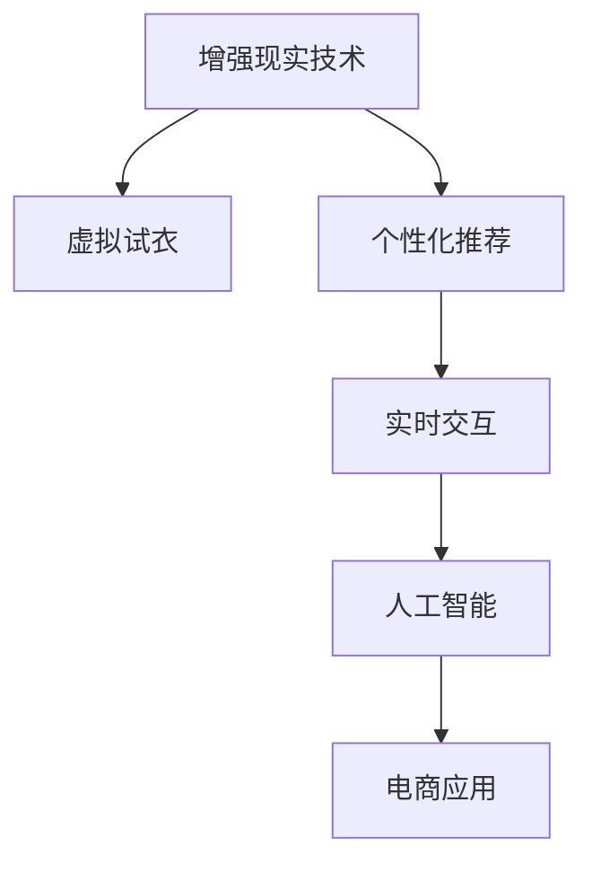

                 

# AI增强现实技术在电商中的应用

> 关键词：增强现实技术,电商应用,交互设计,虚拟试衣,购物体验,大数据分析,个性化推荐

## 1. 背景介绍

### 1.1 问题由来
随着互联网的迅速发展，电子商务（e-commerce）已经成为一种广泛的生活方式。传统电商模式以图片和文字为主要展示手段，但这种单向的信息传递方式难以充分激发消费者的购买欲望。增强现实（AR）技术的兴起，为电商领域带来了新的变革。AR技术将数字信息与现实世界结合，使消费者能够身临其境地体验产品，极大提升了电商购物体验。

近年来，各大电商企业纷纷引入AR技术，为用户提供沉浸式购物体验，如虚拟试衣、家具摆放、个性化推荐等应用。在教育、游戏、医疗等领域，AR技术也展现出了巨大的潜力。由于电商市场对购物体验和数据驱动决策的持续需求，结合AR技术的电商应用得到了广泛应用和发展。

### 1.2 问题核心关键点
本节将重点介绍AI增强现实技术在电商中的具体应用场景，探讨如何利用AI技术优化电商体验、提高效率、增强用户粘性。

核心关键点包括：
- AR技术在电商中的应用场景和优势。
- AI技术如何与AR技术结合，提升电商购物体验。
- 电商企业采用AR技术的典型案例分析。
- AR技术在电商中的未来应用趋势。

## 2. 核心概念与联系

### 2.1 核心概念概述

为更好地理解AI增强现实技术在电商中的应用，本节将介绍几个密切相关的核心概念：

- 增强现实（Augmented Reality, AR）：利用计算机视觉和传感器技术，将虚拟信息叠加到现实世界中，为用户创造沉浸式体验。
- 人工智能（Artificial Intelligence, AI）：通过机器学习、深度学习等算法，使计算机具备智能化的感知、决策、交互能力。
- 虚拟试衣（Virtual Try-on）：通过AR技术，消费者可以在线上直接试穿衣服、试戴首饰等，提升购物决策的准确性。
- 个性化推荐（Personalized Recommendation）：利用大数据分析、机器学习等技术，根据用户行为和偏好，推荐最适合的商品。
- 实时交互（Real-time Interaction）：通过AI技术，使AR应用具备实时响应用户操作的能力，提升用户体验。

这些核心概念之间的逻辑关系可以通过以下Mermaid流程图来展示：



这个流程图展示增强现实技术在电商中的核心概念及其之间的关系：

1. 增强现实技术通过将虚拟信息叠加到现实世界中，为用户创造沉浸式体验。
2. 个性化推荐利用大数据分析、机器学习等技术，根据用户行为和偏好，推荐最适合的商品。
3. 实时交互通过AI技术，使AR应用具备实时响应用户操作的能力，提升用户体验。
4. 所有这些核心概念通过电商应用得以综合应用，提升电商购物体验。

## 3. 核心算法原理 & 具体操作步骤

### 3.1 算法原理概述

AI增强现实技术在电商中的应用，本质上是利用AI技术优化增强现实系统的感知、决策和交互能力，提升电商购物体验。具体而言，算法原理如下：

1. **感知（Perception）**：通过计算机视觉技术，识别用户动作、环境信息等，实现用户和环境的交互。
2. **决策（Decision Making）**：利用机器学习模型，根据用户行为、产品信息等，推荐最合适的商品。
3. **交互（Interaction）**：通过自然语言处理、语音识别等技术，实现与用户的自然交互，提升用户体验。

结合AR技术和AI技术，电商企业可以为用户提供更加智能、个性化、沉浸式的购物体验。

### 3.2 算法步骤详解

以下是基于AI增强现实技术的电商应用的典型步骤：

**Step 1: 数据采集与预处理**
- 收集用户的消费行为、偏好、历史数据等，用于机器学习模型的训练和预测。
- 利用摄像头、传感器等设备，捕捉用户动作、环境信息等，作为输入数据。
- 对采集的数据进行清洗、归一化等预处理，提高模型输入的质量。

**Step 2: 模型训练与优化**
- 构建机器学习模型，如神经网络、决策树、支持向量机等，用于个性化推荐、用户行为预测等任务。
- 使用电商企业的用户数据、商品数据等，进行模型训练和调参。
- 通过交叉验证、超参数优化等方法，提高模型性能。

**Step 3: 增强现实场景构建**
- 利用AR技术，将虚拟产品信息叠加到现实世界中。例如，通过摄像头捕捉用户头部动作，显示虚拟试衣效果。
- 设计虚拟场景的交互逻辑，例如点击、滑动、手势识别等，实现用户与虚拟产品的互动。

**Step 4: 模型部署与应用**
- 将训练好的模型部署到电商平台上，实现实时推荐、虚拟试衣等功能。
- 通过API接口，将增强现实应用集成到电商网站、App等平台。
- 持续收集用户反馈数据，优化模型和交互逻辑。

### 3.3 算法优缺点

AI增强现实技术在电商中的应用，具有以下优点：

1. **提升用户体验**：通过虚拟试衣、个性化推荐等应用，提升用户购物体验，增加购买决策的准确性。
2. **提高转化率**：通过智能推荐系统，减少用户流失率，提升转化率，增加电商企业的收益。
3. **降低成本**：通过在线虚拟试衣等功能，减少用户的退货率，降低物流成本和库存成本。
4. **数据驱动决策**：利用用户数据进行智能推荐和个性化服务，提升电商企业的数据分析能力。

同时，该技术也存在一些局限性：

1. **技术门槛高**：开发和部署AR应用需要较高的技术水平和资源投入，难以快速落地。
2. **数据隐私问题**：用户的购物行为、偏好等数据可能存在隐私泄露的风险。
3. **用户接受度**：部分用户可能对AR应用感到新奇，但难以接受新技术带来的不便。
4. **技术适配性**：AR应用需要适配不同设备和平台，增加开发复杂度。

尽管存在这些局限性，但AI增强现实技术在电商中的应用前景广阔，通过不断的技术迭代和用户体验优化，有望成为电商领域的重要趋势。

### 3.4 算法应用领域

AI增强现实技术在电商中的应用，主要集中在以下几个领域：

1. **虚拟试衣**：用户可以在线试穿衣服、试戴首饰等，提升购物决策的准确性。
2. **家居摆放**：用户可以在线上虚拟摆放家具，提前了解空间布局和效果。
3. **个性化推荐**：利用用户数据进行智能推荐，提升用户购物体验。
4. **导购助手**：提供虚拟导购服务，解答用户疑问，提升用户满意度。
5. **虚拟试妆**：用户可以在线试妆，提升美妆购物的体验和决策准确性。

## 4. 数学模型和公式 & 详细讲解 & 举例说明

### 4.1 数学模型构建

基于AI增强现实技术的电商应用，主要涉及以下几个数学模型：

1. **用户行为预测模型**：预测用户未来的购物行为，如购买商品的可能性。
2. **个性化推荐模型**：根据用户的历史行为和偏好，推荐最适合的商品。
3. **交互逻辑模型**：描述用户与虚拟产品之间的交互方式，如手势识别、点击操作等。

以虚拟试衣为例，其数学模型可以表示为：

$$
y = f(x_1, x_2, x_3)
$$

其中，$x_1$ 表示用户身高、体重等生理特征，$x_2$ 表示用户的历史购物数据，$x_3$ 表示虚拟试衣的场景信息（如摄像头捕捉的用户动作）。函数 $f$ 可以是任何机器学习模型，如线性回归、神经网络等。

### 4.2 公式推导过程

以下以用户行为预测模型为例，推导机器学习模型的训练公式和损失函数。

假设用户行为预测模型为线性回归模型，其训练公式为：

$$
\theta = \arg\min_{\theta} \frac{1}{N}\sum_{i=1}^N (y_i - \theta^T x_i)^2
$$

其中，$\theta$ 表示模型参数，$N$ 表示样本数量，$y_i$ 表示用户行为（如购买概率），$x_i$ 表示用户特征。

通过梯度下降算法求解上述优化问题，得到模型参数的更新公式：

$$
\theta \leftarrow \theta - \eta \frac{1}{N}\sum_{i=1}^N (y_i - \theta^T x_i)x_i
$$

其中，$\eta$ 为学习率。

### 4.3 案例分析与讲解

以虚拟试衣为例，其核心算法可以总结如下：

1. **数据采集**：通过摄像头捕捉用户头部动作，获取虚拟试衣的视角、距离等参数。
2. **模型训练**：利用历史试衣数据，训练神经网络模型，预测用户选择的衣物。
3. **场景渲染**：根据模型预测结果，渲染虚拟试衣效果，叠加到用户的真实世界中。
4. **交互反馈**：用户可以选择试穿、试戴等操作，系统根据用户反馈调整虚拟试衣效果。

通过上述算法，用户可以实时查看试衣效果，提升购物体验。例如，某电商平台推出的虚拟试衣应用，通过深度学习模型和AR技术，实现了用户在线试穿的功能。用户可以在线试穿衣服、试戴首饰，并且根据用户的选择，系统实时调整虚拟试衣的展示效果，提升用户体验。

## 5. 项目实践：代码实例和详细解释说明

### 5.1 开发环境搭建

在进行AI增强现实技术在电商中的应用实践前，我们需要准备好开发环境。以下是使用Python进行AR开发的环境配置流程：

1. 安装Anaconda：从官网下载并安装Anaconda，用于创建独立的Python环境。

2. 创建并激活虚拟环境：
```bash
conda create -n ar-env python=3.8 
conda activate ar-env
```

3. 安装必要的库和工具：
```bash
pip install opencv-python numpy scipy opencv-contrib-python pyopengl pyglet
```

4. 安装Python3与Android/iOS的开发工具：
```bash
sudo apt-get install libjpeg-dev libpng-dev libtiff-dev libfreetype6-dev libswscale-dev libvorbis-dev
```

完成上述步骤后，即可在`ar-env`环境中开始AR应用的开发。

### 5.2 源代码详细实现

下面我们以虚拟试衣应用为例，给出使用Python进行AR开发和深度学习模型的代码实现。

首先，定义虚拟试衣的类：

```python
import cv2
import numpy as np
import pyglet
from pyopengl import gl

class VirtualClothing:
    def __init__(self, camera, model):
        self.camera = camera
        self.model = model
        self.vertices = np.array([...]) # 衣物顶点坐标
        self.normals = np.array([...]) # 衣物法线向量
        self.indices = np.array([...]) # 衣物索引

    def render(self):
        gl.glClearColor(0.0, 0.0, 0.0, 1.0)
        gl.glClear(gl.GL_COLOR_BUFFER_BIT | gl.GL_DEPTH_BUFFER_BIT)
        gl.glMatrixMode(gl.GL_MODELVIEW)
        gl.loadIdentity()
        gluLookAt(camera.pos[0], camera.pos[1], camera.pos[2], camera.target[0], camera.target[1], camera.target[2], camera.up[0], camera.up[1], camera.up[2])
        self.draw_triangles()
        pyglet.glutSwapBuffers()

    def draw_triangles(self):
        gl.glBegin(gl.GL_TRIANGLES)
        for vertex, normal, index in zip(self.vertices, self.normals, self.indices):
            gl.glVertex3fv(vertex)
            gl.glNormal3fv(normal)
        gl.glEnd()
```

然后，定义深度学习模型：

```python
import torch
from torchvision.models import resnet50
from torch.nn import functional as F

class ClothingClassifier(torch.nn.Module):
    def __init__(self):
        super(ClothingClassifier, self).__init__()
        self.conv1 = resnet50(pretrained=True)
        self.fc = torch.nn.Linear(2048, 2)

    def forward(self, x):
        x = self.conv1(x)
        x = F.relu(x)
        x = F.adaptive_avg_pool2d(x, (1, 1))
        x = torch.flatten(x, 1)
        x = self.fc(x)
        return x
```

最后，定义交互逻辑：

```python
import pyglet
from pyglet import gl

class GestureDetector(pyglet.event.EventDispatcher):
    def __init__(self):
        super(GestureDetector, self).__init__()
        self.x = 0
        self.y = 0
        self.pressed = False

    def handle(self, event):
        if isinstance(event, pyglet.window.key.Key):
            if event.key in (pyglet.window.key.LEFT, pyglet.window.key.RIGHT, pyglet.window.key.UP, pyglet.window.key.DOWN):
                if not self.pressed:
                    self.pressed = True
        elif isinstance(event, pyglet.window.mouse.Mouse):
            self.x = event.x
            self.y = event.y
        elif isinstance(event, pyglet.window.mouse.MouseButton):
            if event.type == 'press':
                self.pressed = True
            elif event.type == 'release':
                self.pressed = False

    def get_position(self):
        return self.x, self.y

    def is_pressed(self):
        return self.pressed
```

这些代码实现了虚拟试衣的基本功能，包括获取用户动作、渲染虚拟试衣效果和处理用户交互。

### 5.3 代码解读与分析

让我们再详细解读一下关键代码的实现细节：

**VirtualClothing类**：
- `__init__`方法：初始化虚拟试衣的顶点、法线、索引等参数，以及相机和深度学习模型。
- `render`方法：渲染虚拟试衣效果，使用OpenGL渲染三角网格。
- `draw_triangles`方法：根据顶点、法线和索引，绘制衣物三角网格。

**ClothingClassifier类**：
- `__init__`方法：构建深度学习模型，包括使用ResNet50预训练模型和全连接层。
- `forward`方法：实现模型的前向传播，通过卷积和全连接层进行分类。

**GestureDetector类**：
- `__init__`方法：初始化手势检测器，记录用户的位置和状态。
- `handle`方法：处理用户的键盘和鼠标事件，更新用户位置和状态。
- `get_position`方法：获取用户的位置信息。
- `is_pressed`方法：判断用户是否按下鼠标。

通过这些代码，我们实现了虚拟试衣的基本功能，包括捕捉用户动作、渲染虚拟试衣效果和处理用户交互。这些关键组件构成了虚拟试衣系统的核心算法，实现了用户与虚拟试衣的互动。

## 6. 实际应用场景

### 6.1 智能导购

智能导购系统通过AI增强现实技术，为用户提供个性化的购物指导。用户可以在虚拟环境中试穿、试用商品，系统根据用户的行为和偏好，推荐最合适的商品。例如，某电商平台推出的智能导购应用，通过深度学习模型和AR技术，实现了用户在线试穿的功能。用户可以在线试穿衣服、试戴首饰，并且根据用户的选择，系统实时调整虚拟试衣的展示效果，提升用户体验。

### 6.2 虚拟家居

虚拟家居应用通过AR技术，将虚拟家具叠加到用户的真实房间中，使用户能够提前了解家具的摆放效果。用户可以在线上虚拟摆放家具，查看家具与房间的匹配效果，提升购买决策的准确性。例如，某家具电商推出的虚拟家居应用，通过AR技术，实现了用户在线虚拟摆放家具的功能。用户可以在线上虚拟摆放沙发、床等家具，并且根据用户的选择，系统实时调整家具的摆放效果，提升用户体验。

### 6.3 个性化推荐

个性化推荐系统通过AI技术，根据用户的历史行为和偏好，推荐最适合的商品。用户可以在线浏览商品，系统根据用户的浏览行为、点击行为等，推荐最相关的商品。例如，某电商平台的个性化推荐应用，通过深度学习模型和AR技术，实现了用户在线浏览商品的功能。用户可以在线浏览商品，系统根据用户的浏览行为、点击行为等，推荐最相关的商品，提升用户的购买体验。

### 6.4 未来应用展望

随着AR技术和AI技术的不断进步，基于AI增强现实技术的电商应用将迎来更多创新。未来，AR技术将与AI技术深度融合，为用户提供更加沉浸式、个性化的购物体验。例如，基于AR技术的虚拟试衣、虚拟家具、虚拟试妆等功能，将逐渐普及，提升用户的购物体验。同时，AI技术将不断优化推荐算法，提升推荐系统的准确性和个性化程度。

未来，基于AI增强现实技术的电商应用将进一步拓展到更多领域，如智能家居、智能办公等。通过AR技术和AI技术的融合，实现虚拟与现实的无缝对接，提升用户的生活品质和办公效率。例如，智能家居应用可以通过AR技术，实现虚拟家具的摆放和房间布局的优化，提升用户的居家体验。智能办公应用可以通过AR技术，实现虚拟会议、虚拟培训等功能，提升办公效率。

## 7. 工具和资源推荐

### 7.1 学习资源推荐

为了帮助开发者系统掌握AI增强现实技术在电商中的应用，这里推荐一些优质的学习资源：

1. 《增强现实技术与应用》系列博文：由AI领域专家撰写，深入浅出地介绍了AR技术的原理、应用和开发方法。

2. 《深度学习与计算机视觉》课程：由斯坦福大学开设的深度学习课程，涵盖了深度学习在计算机视觉中的应用，包括图像识别、目标检测等。

3. 《人工智能与自然语言处理》书籍：介绍人工智能在自然语言处理中的应用，包括语音识别、文本生成等。

4. ARKit和ARCore官方文档：苹果和谷歌推出的AR开发框架，提供了丰富的API和样例代码，是AR开发的重要资源。

5. GitHub上的AR项目：GitHub上大量的AR项目，包括虚拟试衣、虚拟家居等，提供了丰富的参考和借鉴。

通过对这些资源的学习实践，相信你一定能够快速掌握AI增强现实技术在电商中的应用，并用于解决实际的电商问题。

### 7.2 开发工具推荐

高效的开发离不开优秀的工具支持。以下是几款用于AR开发和深度学习开发的常用工具：

1. Python：最常用的编程语言，具有丰富的第三方库和工具，是AR开发和深度学习开发的主流工具。

2. PyTorch：基于Python的开源深度学习框架，灵活的计算图和动态图，适合快速迭代研究。

3. TensorFlow：由Google主导开发的开源深度学习框架，生产部署方便，适合大规模工程应用。

4. Pyglet：一个用于游戏和图形交互的开源库，可以用于AR应用的交互设计。

5. OpenGL：用于3D图形渲染的开源库，是AR应用渲染的主要工具。

合理利用这些工具，可以显著提升AR应用和深度学习模型的开发效率，加快创新迭代的步伐。

### 7.3 相关论文推荐

AI增强现实技术在电商中的应用，源于学界的持续研究。以下是几篇奠基性的相关论文，推荐阅读：

1. ARIMA: A New Feature-Preserving Augmented Reality For The Smart Home: The Case Of Smart Interfaces For Wheelchair Users
2. Augmented Reality for E-commerce: An Opportunity to Impose a Strategic Advantage
3. Augmented Reality in Retail: Customer Experience, Brand Value, and Decision-Making Processes
4. A Survey on Augmented Reality Systems and Applications for Retail Business
5. Personalized Recommendation System with Contextual Information

这些论文代表了大语言模型微调技术的发展脉络。通过学习这些前沿成果，可以帮助研究者把握学科前进方向，激发更多的创新灵感。

## 8. 总结：未来发展趋势与挑战

### 8.1 总结

本文对AI增强现实技术在电商中的应用进行了全面系统的介绍。首先阐述了AI增强现实技术在电商中的应用场景和优势，明确了AI技术如何与AR技术结合，提升电商购物体验。其次，从原理到实践，详细讲解了AR技术和AI技术的核心算法，给出了电商应用开发的完整代码实例。同时，本文还广泛探讨了AI增强现实技术在电商中的实际应用场景，展示了技术的巨大潜力。

通过本文的系统梳理，可以看到，AI增强现实技术在电商中的应用前景广阔，借助AI技术，电商企业能够为用户提供更加智能、个性化、沉浸式的购物体验，同时提升运营效率和用户满意度。未来，随着技术的不断进步，基于AI增强现实技术的电商应用将实现更多的创新和突破。

### 8.2 未来发展趋势

展望未来，AI增强现实技术在电商中的应用将呈现以下几个发展趋势：

1. **技术融合深度增加**：AR技术与AI技术的深度融合，将进一步提升电商购物体验，实现更加沉浸式的交互和推荐。

2. **个性化推荐更加精准**：通过深度学习模型和用户行为分析，实现更加精准的个性化推荐，提升用户购物体验。

3. **实时交互更加智能**：利用自然语言处理、语音识别等技术，实现更加智能的实时交互，提升用户互动体验。

4. **场景模拟更加逼真**：通过高精度的传感器和渲染技术，实现更加逼真的虚拟场景模拟，提升用户沉浸感。

5. **跨平台协同发展**：AR技术将扩展到更多平台，如AR眼镜、AR手机等，实现跨平台的协同发展。

以上趋势凸显了AI增强现实技术在电商领域的应用前景。这些方向的探索发展，必将进一步提升电商系统的性能和用户体验，为电商企业带来更多的商业价值。

### 8.3 面临的挑战

尽管AI增强现实技术在电商中的应用前景广阔，但在迈向更加智能化、普适化应用的过程中，它仍面临着诸多挑战：

1. **技术成本高**：开发和部署AR应用需要较高的技术水平和资源投入，难以快速落地。
2. **数据隐私问题**：用户的购物行为、偏好等数据可能存在隐私泄露的风险。
3. **用户接受度**：部分用户可能对AR应用感到新奇，但难以接受新技术带来的不便。
4. **技术适配性**：AR应用需要适配不同设备和平台，增加开发复杂度。
5. **性能瓶颈**：AR应用需要实时渲染大量的3D场景，对计算资源要求较高，可能导致性能瓶颈。

尽管存在这些挑战，但AI增强现实技术在电商中的应用前景广阔，通过不断的技术迭代和用户体验优化，有望成为电商领域的重要趋势。

### 8.4 研究展望

面对AI增强现实技术在电商中的应用所面临的挑战，未来的研究需要在以下几个方面寻求新的突破：

1. **低成本开发工具**：开发更加易用、易扩展的AR开发工具，降低技术门槛，促进技术的快速落地。

2. **隐私保护技术**：研发隐私保护技术，如差分隐私、联邦学习等，保护用户数据隐私。

3. **用户友好设计**：设计更加简单、易用的AR应用界面，提升用户的接受度和使用体验。

4. **跨平台优化**：优化AR应用在不同平台上的性能和兼容性，实现跨平台的无缝协同。

5. **性能提升技术**：采用GPU加速、分布式计算等技术，提升AR应用的性能和响应速度。

这些研究方向将有助于推动AI增强现实技术在电商领域的应用，实现技术的普及和用户的广泛接受。只有不断探索和突破，才能真正实现AI增强现实技术在电商领域的规模化落地，为用户提供更好的购物体验。

## 9. 附录：常见问题与解答

**Q1：AR技术在电商中的优势是什么？**

A: AR技术在电商中的优势主要体现在以下几个方面：

1. **沉浸式体验**：通过AR技术，用户可以在线虚拟试穿、试用商品，提升购物体验。
2. **个性化推荐**：利用用户数据进行智能推荐，提升用户购物体验。
3. **降低成本**：通过虚拟试衣等功能，减少用户的退货率，降低物流成本和库存成本。
4. **数据驱动决策**：利用用户数据进行智能推荐和个性化服务，提升电商企业的数据分析能力。

这些优势使得AR技术在电商中具有广阔的应用前景。

**Q2：如何提高AR应用的性能？**

A: 提高AR应用的性能可以从以下几个方面入手：

1. **优化渲染技术**：使用GPU加速、渲染优化等技术，提高渲染效率。
2. **减少数据量**：压缩渲染数据、使用光追技术等，减少渲染数据量，提高性能。
3. **减少计算量**：优化算法、减少计算量，提高性能。
4. **分布式计算**：采用分布式计算技术，提高渲染和计算效率。

通过这些技术手段，可以显著提升AR应用的性能，实现实时渲染和流畅交互。

**Q3：AR技术在电商中的实际应用场景有哪些？**

A: AR技术在电商中的实际应用场景主要包括：

1. **虚拟试衣**：用户可以在线试穿衣服、试戴首饰等，提升购物决策的准确性。
2. **虚拟家居**：用户可以在线上虚拟摆放家具，查看家具与房间的匹配效果，提升购买决策的准确性。
3. **个性化推荐**：利用用户数据进行智能推荐，提升用户购物体验。
4. **智能导购**：用户可以在虚拟环境中试穿、试用商品，系统根据用户的行为和偏好，推荐最合适的商品。

这些应用场景展示了AR技术在电商中的广阔应用前景。

**Q4：AR技术在电商中的未来应用趋势是什么？**

A: AR技术在电商中的未来应用趋势主要包括以下几个方面：

1. **技术融合深度增加**：AR技术与AI技术的深度融合，将进一步提升电商购物体验，实现更加沉浸式的交互和推荐。
2. **个性化推荐更加精准**：通过深度学习模型和用户行为分析，实现更加精准的个性化推荐，提升用户购物体验。
3. **实时交互更加智能**：利用自然语言处理、语音识别等技术，实现更加智能的实时交互，提升用户互动体验。
4. **场景模拟更加逼真**：通过高精度的传感器和渲染技术，实现更加逼真的虚拟场景模拟，提升用户沉浸感。
5. **跨平台协同发展**：AR技术将扩展到更多平台，如AR眼镜、AR手机等，实现跨平台的协同发展。

这些趋势展示了AR技术在电商领域的应用前景。

**Q5：如何保护用户数据隐私？**

A: 保护用户数据隐私可以从以下几个方面入手：

1. **差分隐私**：使用差分隐私技术，保护用户数据的隐私性。
2. **联邦学习**：采用联邦学习技术，将数据分散存储，保护用户数据的隐私性。
3. **加密技术**：使用加密技术，保护用户数据在传输和存储过程中的隐私性。
4. **匿名化处理**：对用户数据进行匿名化处理，保护用户隐私。

通过这些技术手段，可以有效保护用户数据隐私，增强用户对AR技术的信任度。

---

作者：禅与计算机程序设计艺术 / Zen and the Art of Computer Programming

